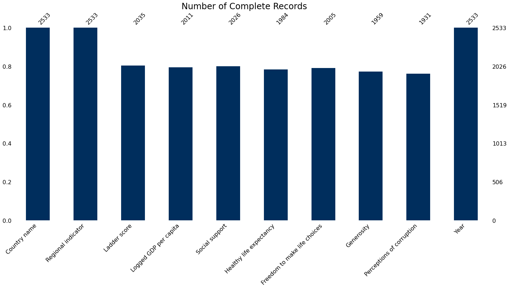
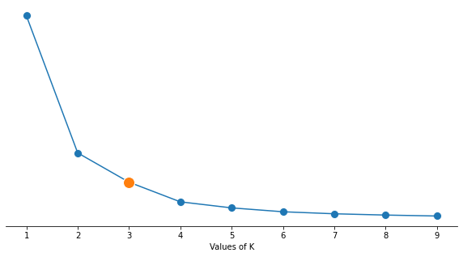
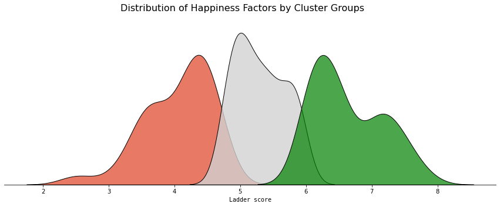
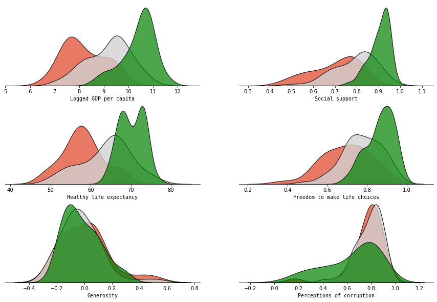
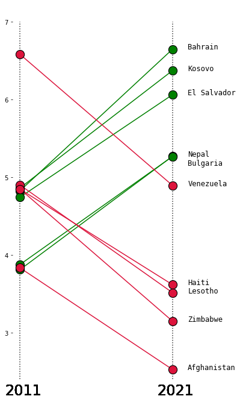
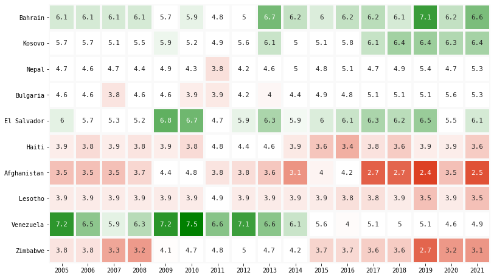
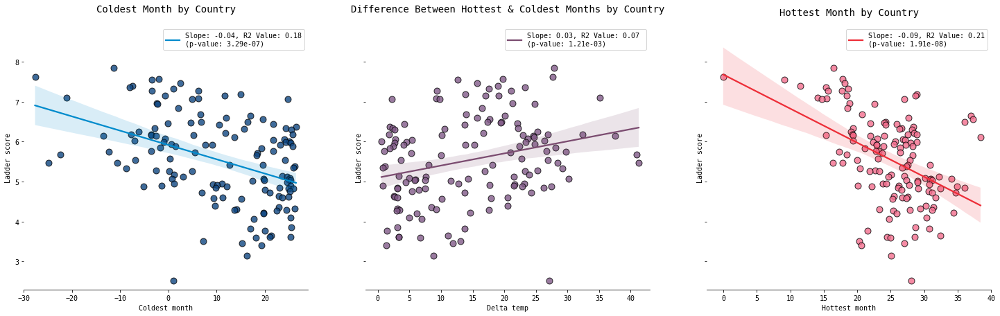

# Data Science Technical Assessment


#### World Happiness Report 2021 (Nasser AlKhazraji)

<br><br>

**Table of Contents**
1. [Data Cleaning](#Data-Cleaning)
  - [Imputing Missing Values](#Imputation)
2. [KMeans Clustering](#KMeans-Clustering)
  - [Statistical Testing of Clusters using ANOVA](#ANOVA)
  - [Happiness Factor Distributions by Clusters](#Distributions)
3. [Shifts in Happiness over 10 Years](#Shifts)
4. [World Map Visualization](#Choropleth)
5. [Effects of Temperature on Happiness](#Temperature)
6. [Predicting Happiness](#Modelling)
  - [Hyperparameter Tuning](#Hyperparameter-Tuning)
  - [Model Evaluation](#Metrics)
  
  
<br>

<a id='Data-Cleaning'></a>

## 1) Data Cleaning

<details>
  <summary>Click to expand</summary>
```python
import pandas as pd
import numpy as np

import plotly.graph_objects as go
import pandas as pd
import emoji
from plotly.offline import download_plotlyjs, init_notebook_mode, plot, iplot
import cufflinks as cf
from scipy.stats import linregress
import statsmodels.api as sm
from statsmodels.formula.api import ols

from sklearn.cluster import KMeans
from sklearn.linear_model import LinearRegression, Ridge
from sklearn.svm import SVR
from sklearn.metrics import mean_absolute_error
from sklearn.model_selection import GridSearchCV, train_test_split, cross_val_score
from xgboost import XGBRegressor
from lightgbm import LGBMRegressor

import matplotlib
import matplotlib.pyplot as plt
import seaborn as sns
import missingno as msno
%matplotlib inline
```


```python
current_df = pd.read_csv("data/world-happiness-report-2021.csv")
current_df = current_df.iloc[:,[0,1,2,6,7,8,9,10,11]]
current_df['Year'] = 2021

historical_df = pd.read_csv("data/world-happiness-report.csv")
region_mapping = current_df[['Country name', 'Regional indicator']]
historical_df = pd.merge(region_mapping, historical_df.iloc[:,0:9], on='Country name', how='left')
col = historical_df.pop('year')
historical_df.insert(historical_df.shape[1], col.name, col)
historical_df.columns = current_df.columns
merged_df = pd.concat([historical_df, current_df], axis=0)
```
</details>

<a id='Imputation'></a>

#### Imputing Missing Values

<details>
  <summary>Click to expand</summary>
```python
missing = pd.read_csv("data/missing-records.csv")
msno.bar(missing, color='#002E5D')
plt.suptitle("Number of Complete Records", fontsize=24)
# plt.tight_layout(rect=[0, 0.03, 1, 0.95])
plt.show()
```
</details>

    

    


<details>
  <summary>Click to expand</summary>

```python
factors_list = merged_df.columns
missing_df = pd.DataFrame()
imputed_df = merged_df[['Country name', 'Regional indicator','Year']]

for i in range(merged_df.shape[1]-3):
    pivot_df = merged_df.set_index(['Country name', 'Year']).iloc[:,i+1].unstack().reset_index()
    missing_df = pd.concat([missing_df, pivot_df.isnull().sum()], axis=1)
    pivot_df.set_index('Country name', drop=True, inplace=True)
    pivot_df = pivot_df.transpose()
    pivot_df.fillna(pivot_df.mean(), inplace=True)
    pivot_df['Year'] = pivot_df.index
    pivot_df = pivot_df.melt(id_vars=['Year'])
    imputed_df = pd.merge(imputed_df, pivot_df, on=['Country name', 'Year'], how='outer')

col = imputed_df.pop('Year')
imputed_df.insert(imputed_df.shape[1], col.name, col)
imputed_df.columns = factors_list
missing_df.columns = factors_list[2:9]
missing_df = missing_df.iloc[1:,]

imputed_df.drop(['Regional indicator'], axis=1, inplace=True)
imputed_df = pd.merge(region_mapping, imputed_df.iloc[:,0:9], on='Country name', how='outer')
```

</details>


<a id='KMeans-Clustering'></a> 

## 2) KMeans Clustering
Determining Optimal K using the Elbow method

<details>
  <summary>Click to expand</summary>
```python
distortions = []
K = range(1,10)
for k in K:
    kmeanModel = KMeans(n_clusters=k)
    kmeanModel.fit(current_df[['Ladder score']])
    distortions.append(kmeanModel.inertia_)
    
fig = plt.gcf()
fig.set_size_inches(10, 5)
g = sns.lineplot(x=K, y=distortions)
g = sns.scatterplot(x=K, y=distortions, s=100)
g = sns.scatterplot(x=[K[2]], y=[distortions[2]], s=200, markers='+', zorder=3)
sns.despine(left=True)
g.set_ylabel('')
g.set_xlabel('Values of K')
g.set(yticks=[])

plt.show()
```

</details>

    

    


<details>
  <summary>Click to expand</summary>
  
```python
kmeanModel = KMeans(n_clusters=3)
kmeanModel.fit(current_df[['Ladder score']])
current_df.loc[:,'kmean group'] = kmeanModel.labels_

group_labels = current_df[['Ladder score', 'kmean group']].groupby(['kmean group']).agg(['mean'])
group_labels.columns = group_labels.columns.get_level_values(0)

group_labels['Status'] = 'Content'
group_labels.iloc[group_labels['Ladder score'].idxmax(),1] = 'Happy'
group_labels.iloc[group_labels['Ladder score'].idxmin(),1] = 'Unhappy'
group_labels.drop(['Ladder score'], axis=1, inplace=True)
group_labels.reset_index(inplace=True)

group_labels = pd.merge(current_df[['Country name', 'kmean group']], group_labels, on='kmean group')
imputed_df = pd.merge(imputed_df, group_labels, on='Country name', how='left')

# Save final dataset for analysis
imputed_df.to_csv("data/imputed-data.csv", index=False)
```

</details>

<a id='ANOVA'></a>

#### Statistical Testing of Clusters using ANOVA


<details>
  <summary>Click to expand</summary>
  
```python
df = pd.read_csv('data/imputed-data.csv')
df = df.iloc[:, [2,3,4,5,6,7,8,10]]
original_cols = list(df.columns)[0:-1]
df.columns = ['a', 'b', 'c', 'd', 'e', 'f', 'g', 'group']
factors = df.columns[0:-1]
pvals = []
for i in factors:
    model_string = f'{i} ~ C(group)'
    model = ols(model_string, data=df).fit()
    anova_table = sm.stats.anova_lm(model, typ=2)
    pvals.append(anova_table.iloc[0,3])

summary_anova = pd.DataFrame([pvals], columns=original_cols)
summary_anova.index = ['p-value']
display(summary_anova)
```

</details>

<div>
<style scoped>
    .dataframe tbody tr th:only-of-type {
        vertical-align: middle;
    }

    .dataframe tbody tr th {
        vertical-align: top;
    }

    .dataframe thead th {
        text-align: right;
    }
</style>
<table border="1" class="dataframe">
  <thead>
    <tr style="text-align: right;">
      <th></th>
      <th>Ladder score</th>
      <th>Logged GDP per capita</th>
      <th>Social support</th>
      <th>Healthy life expectancy</th>
      <th>Freedom to make life choices</th>
      <th>Generosity</th>
      <th>Perceptions of corruption</th>
    </tr>
  </thead>
  <tbody>
    <tr>
      <th>p-value</th>
      <td>0.0</td>
      <td>0.0</td>
      <td>3.823499e-272</td>
      <td>5.928788e-323</td>
      <td>4.220391e-123</td>
      <td>1.673813e-19</td>
      <td>6.744451e-79</td>
    </tr>
  </tbody>
</table>
</div>


<a id='Distributions'></a>

#### Happiness Factor Distributions by Clusters

<details>
  <summary>Click to expand</summary>
  
```python
df = pd.read_csv("data/imputed-data.csv")
df['Year'] = df['Year'].astype('int')
current_df = df[df['Year'] == 2021].copy(deep=True)
happy_countries = current_df[current_df['Status'] == 'Happy']
unhappy_countries = current_df[current_df['Status'] == 'Unhappy']
content_countries = current_df[current_df['Status'] == 'Content']
factors = ['Logged GDP per capita', 'Social support', 'Healthy life expectancy', 'Freedom to make life choices', 'Generosity', 'Perceptions of corruption']


fig = plt.gcf()
fig.set_size_inches(15, 5)
variable = 'Ladder score'
g = sns.kdeplot(unhappy_countries[variable], alpha=0.7, shade=True, ec='black',  color='#dd4124')
g = sns.kdeplot(content_countries[variable], alpha=0.8, shade=True, ec='black',  color='#d2d2d2')
g = sns.kdeplot(happy_countries[variable], alpha=0.7, shade=True, ec='black', color='#008000')
g.set_xlabel(variable, fontfamily='Monospace')
sns.despine(left=True)
g.set_ylabel('')
g.set(yticks=[])
plt.suptitle('Distribution of Happiness Factors by Cluster Groups',fontsize=16)
plt.show()


fig, axes = plt.subplots(ncols=2, nrows=3)
fig.set_size_inches(15, 10)

for i, ax in zip(range(10), axes.flat):
    variable = factors[i]
    g = sns.kdeplot(unhappy_countries[variable], alpha=0.7, shade=True, ec='black', ax=ax, color='#dd4124')
    g = sns.kdeplot(content_countries[variable], alpha=0.8, shade=True, ec='black', ax=ax, color='#d2d2d2')
    g = sns.kdeplot(happy_countries[variable], alpha=0.7, shade=True, ec='black', ax=ax, color='#008000')
    g.set_xlabel(variable, fontfamily='Monospace')
    sns.despine(left=True)
    g.set_ylabel('')
    g.set(yticks=[])
    
plt.show()
```

</details>

    

    


    

    


<a id='Shifts'></a>

## 3) Shifts in Happiness over 10 years

<details>
  <summary>Click to expand</summary>
  
```python
df = pd.read_csv("data/imputed-data.csv")
df['Year'] = df['Year'].astype('int')

ten_year_history = df[(df['Year'] == 2011) | (df['Year'] == 2021)][['Country name', 'Ladder score', 'Year']].copy(deep=True)
ten_year_history = ten_year_history.pivot_table(index=['Country name'], values=['Ladder score'], columns=['Year'])
ten_year_history.columns = ['Historic', 'Current']

ten_year_history['Score change'] = ten_year_history['Current'] - ten_year_history['Historic']
ten_year_history.sort_values(by=['Score change'], axis=0, ascending=False, inplace=True)
ten_year_history = pd.concat([ten_year_history.head(5), ten_year_history.tail(5)])
ten_year_history['Country name'] = ten_year_history.index
ten_year_history['Slope color'] = (ten_year_history['Score change'] < 0)*1


fig = plt.gcf()
fig.set_size_inches(5, 12)

slope_color = ['#008000']*5 + ['#DC143C']*5

for i in range(ten_year_history.shape[0]):
    country = ten_year_history.iloc[i,:]
        
    g = sns.lineplot(x=[1,2], y=[country['Historic'], country['Current']], color=slope_color[i], zorder=2)
    g = sns.scatterplot(x=[1,2], y=[country['Historic'], country['Current']], color=slope_color[i], s=200, edgecolor="black", zorder=3)
    
    if country['Country name'] == 'Bulgaria':
        plt.text(2.1, 5.15, country['Country name'], fontsize='large', fontfamily='monospace')
    
    else:
        plt.text(2.1, country['Current'], country['Country name'],  fontsize='large', fontfamily='monospace')

    plt.plot([2.0, 2.0], [2.4, 7], ':', color='black', alpha=0.1, zorder=1)
    plt.plot([1.0, 1.0], [2.4, 7], ':', color='black', alpha=0.1, zorder=1)
        
    plt.text(0.9,2.2, '2011', fontsize=24)
    plt.text(1.9,2.2,'2021',  fontsize=24)
        
    sns.despine(top=True, bottom=True, left=True, right=True)
    g.set(xticks=[])
    
plt.show()


ten_year_full = df[df['Country name'].isin(ten_year_history['Country name'])][['Country name', 'Year', 'Ladder score']].copy(deep=True)
# ten_year_full = ten_year_full[ten_year_full['Year'] >= 2011]
ten_year_full = ten_year_full.pivot_table(index=['Country name'], columns='Year', values='Ladder score')
ten_year_full = ten_year_full.reindex(list(ten_year_history.index))


fig = plt.gcf()
fig.set_size_inches(13, 10)
plt.rcParams["font.family"] = "monospace"


colors = ['#dd4124','white','white','#008000']

cmap = matplotlib.colors.LinearSegmentedColormap.from_list("", colors)

g = sns.heatmap(ten_year_full,
                square=True,
                cmap=cmap,
                linewidth=3,
                linecolor='#f9f9f9',
                cbar=False,
                annot=True,annot_kws={"size": 11})

g.set_ylabel("")
g.set_xlabel("")

plt.show()
```

</details>
    

    


    

    


<a id='Choropleth'></a>

## 4) World Map Visualization

<details>
  <summary>Click to expand</summary>

```python
import chart_studio.plotly as py
init_notebook_mode(connected=True)
cf.go_offline()

df = pd.read_csv("data/imputed-data.csv")
df['Year'] = df['Year'].astype('int')
country_codes = pd.read_csv("data/country-codes.csv", encoding='ISO-8859-1')
maps_df = pd.merge(country_codes, df, on='Country name', how='right')

# Drop North Cyprus
maps_df = maps_df[maps_df['Country name'] != 'North Cyprus']
maps_df.tail()

maps_df['Emoji'] = maps_df['Status']
emoji_dict = {'Happy': ":grinning_face_with_big_eyes:", 
              'Content': ":neutral_face:",
             'Unhappy': ":sad_but_relieved_face:"}

maps_df.replace({"Emoji": emoji_dict}, inplace=True)

country_texts = []
for i in range(maps_df.shape[0]):
    country = maps_df.iloc[i,:]
    text_annot = f"""
    <b>{country['Country name']}</b> {emoji.emojize(country['Emoji'])}<br>
    Happiness Score: {country['Ladder score']:.2f} <br> <br>
       <i>GDP per Capita</i>: {country['Logged GDP per capita']:.2f} <br>
       <i>Social Support</i>: {country['Social support']:.2f} <br>
       <i>Life Expectancy</i>: {country['Healthy life expectancy']:.2f} <br>
       <i>Generosity</i>: {country['Generosity']:.2f} <br>
       <i>Corruption</i>: {country['Perceptions of corruption']:.2f}
    """
    country_texts.append(text_annot)
    
maps_df['text'] = country_texts

fig = go.Figure(data=go.Choropleth(
    locations = maps_df['Code'],
    locationmode='ISO-3',
    z = maps_df['Ladder score'],
    text = maps_df['text'],
    colorscale = 'Viridis',
    autocolorscale=False,
    reversescale=False,
    marker_line_color='darkgray',
    marker_line_width=0.5,
    colorbar_title = 'Ladder Score',
    hoverinfo='text',
))

fig.update_layout(
    title_text='World Happiness Index 2021',
    autosize=False,
    width=900,
    height=800,
    hoverlabel=dict(
        font_family="monospace",
        ),
    geo=dict(
        showframe=True,
        showcoastlines=True,
        projection_type='orthographic'
    ))


iplot(fig, show_link=False)
```

</details>

<script type="text/javascript">
window.PlotlyConfig = {MathJaxConfig: 'local'};
if (window.MathJax) {MathJax.Hub.Config({SVG: {font: "STIX-Web"}});}
if (typeof require !== 'undefined') {
require.undef("plotly");
requirejs.config({
    paths: {
        'plotly': ['https://cdn.plot.ly/plotly-latest.min']
    }
});
require(['plotly'], function(Plotly) {
    window._Plotly = Plotly;
});
}
</script>


<script type="text/javascript">
window.PlotlyConfig = {MathJaxConfig: 'local'};
if (window.MathJax) {MathJax.Hub.Config({SVG: {font: "STIX-Web"}});}
if (typeof require !== 'undefined') {
require.undef("plotly");
requirejs.config({
    paths: {
        'plotly': ['https://cdn.plot.ly/plotly-latest.min']
    }
});
require(['plotly'], function(Plotly) {
    window._Plotly = Plotly;
});
}
</script>


<div>                            <div id="7736dbab-dcdc-46dc-91b9-d02e00990b2b" class="plotly-graph-div" style="height:800px; width:900px;"></div>            <script type="text/javascript">                require(["plotly"], function(Plotly) {                    window.PLOTLYENV=window.PLOTLYENV || {};                                    if (document.getElementById("7736dbab-dcdc-46dc-91b9-d02e00990b2b")) {                    Plotly.newPlot(                        "7736dbab-dcdc-46dc-91b9-d02e00990b2b",                        [{"autocolorscale": false, "colorbar": {"title": {"text": "Ladder Score"}}, "colorscale": [[0.0, "#440154"], [0.1111111111111111, "#482878"], [0.2222222222222222, "#3e4989"], [0.3333333333333333, "#31688e"], [0.4444444444444444, "#26828e"], [0.5555555555555556, "#1f9e89"], [0.6666666666666666, "#35b779"], [0.7777777777777778, "#6ece58"], [0.8888888888888888, "#b5de2b"], [1.0, "#fde725"]], "hoverinfo": "text", "locationmode": "ISO-3", "locations": ["FIN", "FIN", "FIN", "FIN", "FIN", "FIN", "FIN", "FIN", "FIN", "FIN", "FIN", "FIN", "FIN", "FIN", "FIN", "FIN", "FIN", "DNK", "DNK", "DNK", "DNK", "DNK", "DNK", "DNK", "DNK", "DNK", "DNK", "DNK", "DNK", "DNK", "DNK", "DNK", "DNK", "DNK", "CHE", "CHE", "CHE", "CHE", "CHE", "CHE", "CHE", "CHE", "CHE", "CHE", "CHE", "CHE", "CHE", "CHE", "CHE", "CHE", "CHE", "ISL", "ISL", "ISL", "ISL", "ISL", "ISL", "ISL", "ISL", "ISL", "ISL", "ISL", "ISL", "ISL", "ISL", "ISL", "ISL", "ISL", "NLD", "NLD", "NLD", "NLD", "NLD", "NLD", "NLD", "NLD", "NLD", "NLD", "NLD", "NLD", "NLD", "NLD", "NLD", "NLD", "NLD", "NOR", "NOR", "NOR", "NOR", "NOR", "NOR", "NOR", "NOR", "NOR", "NOR", "NOR", "NOR", "NOR", "NOR", "NOR", "NOR", "NOR", "SWE", "SWE", "SWE", "SWE", "SWE", "SWE", "SWE", "SWE", "SWE", "SWE", "SWE", "SWE", "SWE", "SWE", "SWE", "SWE", "SWE", "LUX", "LUX", "LUX", "LUX", "LUX", "LUX", "LUX", "LUX", "LUX", "LUX", "LUX", "LUX", "LUX", "LUX", "LUX", "LUX", "LUX", "NZL", "NZL", "NZL", "NZL", "NZL", "NZL", "NZL", "NZL", "NZL", "NZL", "NZL", "NZL", "NZL", "NZL", "NZL", "NZL", "NZL", "AUT", "AUT", "AUT", "AUT", "AUT", "AUT", "AUT", "AUT", "AUT", "AUT", "AUT", "AUT", "AUT", "AUT", "AUT", "AUT", "AUT", "AUS", "AUS", "AUS", "AUS", "AUS", "AUS", "AUS", "AUS", "AUS", "AUS", "AUS", "AUS", "AUS", "AUS", "AUS", "AUS", "AUS", "ISR", "ISR", "ISR", "ISR", "ISR", "ISR", "ISR", "ISR", "ISR", "ISR", "ISR", "ISR", "ISR", "ISR", "ISR", "ISR", "ISR", "DEU", "DEU", "DEU", "DEU", "DEU", "DEU", "DEU", "DEU", "DEU", "DEU", "DEU", "DEU", "DEU", "DEU", "DEU", "DEU", "DEU", "CAN", "CAN", "CAN", "CAN", "CAN", "CAN", "CAN", "CAN", "CAN", "CAN", "CAN", "CAN", "CAN", "CAN", "CAN", "CAN", "CAN", "IRL", "IRL", "IRL", "IRL", "IRL", "IRL", "IRL", "IRL", "IRL", "IRL", "IRL", "IRL", "IRL", "IRL", "IRL", "IRL", "IRL", "CRI", "CRI", "CRI", "CRI", "CRI", "CRI", "CRI", "CRI", "CRI", "CRI", "CRI", "CRI", "CRI", "CRI", "CRI", "CRI", "CRI", "GBR", "GBR", "GBR", "GBR", "GBR", "GBR", "GBR", "GBR", "GBR", "GBR", "GBR", "GBR", "GBR", "GBR", "GBR", "GBR", "GBR", "CZE", "CZE", "CZE", "CZE", "CZE", "CZE", "CZE", "CZE", "CZE", "CZE", "CZE", "CZE", "CZE", "CZE", "CZE", "CZE", "CZE", "USA", "USA", "USA", "USA", "USA", "USA", "USA", "USA", "USA", "USA", "USA", "USA", "USA", "USA", "USA", "USA", "USA", "BEL", "BEL", "BEL", "BEL", "BEL", "BEL", "BEL", "BEL", "BEL", "BEL", "BEL", "BEL", "BEL", "BEL", "BEL", "BEL", "BEL", "FRA", "FRA", "FRA", "FRA", "FRA", "FRA", "FRA", "FRA", "FRA", "FRA", "FRA", "FRA", "FRA", "FRA", "FRA", "FRA", "FRA", "BHR", "BHR", "BHR", "BHR", "BHR", "BHR", "BHR", "BHR", "BHR", "BHR", "BHR", "BHR", "BHR", "BHR", "BHR", "BHR", "BHR", "MLT", "MLT", "MLT", "MLT", "MLT", "MLT", "MLT", "MLT", "MLT", "MLT", "MLT", "MLT", "MLT", "MLT", "MLT", "MLT", "MLT", "TWN", "TWN", "TWN", "TWN", "TWN", "TWN", "TWN", "TWN", "TWN", "TWN", "TWN", "TWN", "TWN", "TWN", "TWN", "TWN", "TWN", "ARE", "ARE", "ARE", "ARE", "ARE", "ARE", "ARE", "ARE", "ARE", "ARE", "ARE", "ARE", "ARE", "ARE", "ARE", "ARE", "ARE", "SAU", "SAU", "SAU", "SAU", "SAU", "SAU", "SAU", "SAU", "SAU", "SAU", "SAU", "SAU", "SAU", "SAU", "SAU", "SAU", "SAU", "ESP", "ESP", "ESP", "ESP", "ESP", "ESP", "ESP", "ESP", "ESP", "ESP", "ESP", "ESP", "ESP", "ESP", "ESP", "ESP", "ESP", "ITA", "ITA", "ITA", "ITA", "ITA", "ITA", "ITA", "ITA", "ITA", "ITA", "ITA", "ITA", "ITA", "ITA", "ITA", "ITA", "ITA", "SVN", "SVN", "SVN", "SVN", "SVN", "SVN", "SVN", "SVN", "SVN", "SVN", "SVN", "SVN", "SVN", "SVN", "SVN", "SVN", "SVN", "GTM", "GTM", "GTM", "GTM", "GTM", "GTM", "GTM", "GTM", "GTM", "GTM", "GTM", "GTM", "GTM", "GTM", "GTM", "GTM", "GTM", "URY", "URY", "URY", "URY", "URY", "URY", "URY", "URY", "URY", "URY", "URY", "URY", "URY", "URY", "URY", "URY", "URY", "SGP", "SGP", "SGP", "SGP", "SGP", "SGP", "SGP", "SGP", "SGP", "SGP", "SGP", "SGP", "SGP", "SGP", "SGP", "SGP", "SGP", "KOS", "KOS", "KOS", "KOS", "KOS", "KOS", "KOS", "KOS", "KOS", "KOS", "KOS", "KOS", "KOS", "KOS", "KOS", "KOS", "KOS", "SVK", "SVK", "SVK", "SVK", "SVK", "SVK", "SVK", "SVK", "SVK", "SVK", "SVK", "SVK", "SVK", "SVK", "SVK", "SVK", "SVK", "BRA", "BRA", "BRA", "BRA", "BRA", "BRA", "BRA", "BRA", "BRA", "BRA", "BRA", "BRA", "BRA", "BRA", "BRA", "BRA", "BRA", "MEX", "MEX", "MEX", "MEX", "MEX", "MEX", "MEX", "MEX", "MEX", "MEX", "MEX", "MEX", "MEX", "MEX", "MEX", "MEX", "MEX", "JAM", "JAM", "JAM", "JAM", "JAM", "JAM", "JAM", "JAM", "JAM", "JAM", "JAM", "JAM", "JAM", "JAM", "JAM", "JAM", "JAM", "LTU", "LTU", "LTU", "LTU", "LTU", "LTU", "LTU", "LTU", "LTU", "LTU", "LTU", "LTU", "LTU", "LTU", "LTU", "LTU", "LTU", "CYP", "CYP", "CYP", "CYP", "CYP", "CYP", "CYP", "CYP", "CYP", "CYP", "CYP", "CYP", "CYP", "CYP", "CYP", "CYP", "CYP", "EST", "EST", "EST", "EST", "EST", "EST", "EST", "EST", "EST", "EST", "EST", "EST", "EST", "EST", "EST", "EST", "EST", "PAN", "PAN", "PAN", "PAN", "PAN", "PAN", "PAN", "PAN", "PAN", "PAN", "PAN", "PAN", "PAN", "PAN", "PAN", "PAN", "PAN", "UZB", "UZB", "UZB", "UZB", "UZB", "UZB", "UZB", "UZB", "UZB", "UZB", "UZB", "UZB", "UZB", "UZB", "UZB", "UZB", "UZB", "CHL", "CHL", "CHL", "CHL", "CHL", "CHL", "CHL", "CHL", "CHL", "CHL", "CHL", "CHL", "CHL", "CHL", "CHL", "CHL", "CHL", "POL", "POL", "POL", "POL", "POL", "POL", "POL", "POL", "POL", "POL", "POL", "POL", "POL", "POL", "POL", "POL", "POL", "KAZ", "KAZ", "KAZ", "KAZ", "KAZ", "KAZ", "KAZ", "KAZ", "KAZ", "KAZ", "KAZ", "KAZ", "KAZ", "KAZ", "KAZ", "KAZ", "KAZ", "ROU", "ROU", "ROU", "ROU", "ROU", "ROU", "ROU", "ROU", "ROU", "ROU", "ROU", "ROU", "ROU", "ROU", "ROU", "ROU", "ROU", "KWT", "KWT", "KWT", "KWT", "KWT", "KWT", "KWT", "KWT", "KWT", "KWT", "KWT", "KWT", "KWT", "KWT", "KWT", "KWT", "KWT", "SRB", "SRB", "SRB", "SRB", "SRB", "SRB", "SRB", "SRB", "SRB", "SRB", "SRB", "SRB", "SRB", "SRB", "SRB", "SRB", "SRB", "SLV", "SLV", "SLV", "SLV", "SLV", "SLV", "SLV", "SLV", "SLV", "SLV", "SLV", "SLV", "SLV", "SLV", "SLV", "SLV", "SLV", "MUS", "MUS", "MUS", "MUS", "MUS", "MUS", "MUS", "MUS", "MUS", "MUS", "MUS", "MUS", "MUS", "MUS", "MUS", "MUS", "MUS", "LVA", "LVA", "LVA", "LVA", "LVA", "LVA", "LVA", "LVA", "LVA", "LVA", "LVA", "LVA", "LVA", "LVA", "LVA", "LVA", "LVA", "COL", "COL", "COL", "COL", "COL", "COL", "COL", "COL", "COL", "COL", "COL", "COL", "COL", "COL", "COL", "COL", "COL", "HUN", "HUN", "HUN", "HUN", "HUN", "HUN", "HUN", "HUN", "HUN", "HUN", "HUN", "HUN", "HUN", "HUN", "HUN", "HUN", "HUN", "THA", "THA", "THA", "THA", "THA", "THA", "THA", "THA", "THA", "THA", "THA", "THA", "THA", "THA", "THA", "THA", "THA", "NIC", "NIC", "NIC", "NIC", "NIC", "NIC", "NIC", "NIC", "NIC", "NIC", "NIC", "NIC", "NIC", "NIC", "NIC", "NIC", "NIC", "JPN", "JPN", "JPN", "JPN", "JPN", "JPN", "JPN", "JPN", "JPN", "JPN", "JPN", "JPN", "JPN", "JPN", "JPN", "JPN", "JPN", "ARG", "ARG", "ARG", "ARG", "ARG", "ARG", "ARG", "ARG", "ARG", "ARG", "ARG", "ARG", "ARG", "ARG", "ARG", "ARG", "ARG", "PRT", "PRT", "PRT", "PRT", "PRT", "PRT", "PRT", "PRT", "PRT", "PRT", "PRT", "PRT", "PRT", "PRT", "PRT", "PRT", "PRT", "HND", "HND", "HND", "HND", "HND", "HND", "HND", "HND", "HND", "HND", "HND", "HND", "HND", "HND", "HND", "HND", "HND", "HRV", "HRV", "HRV", "HRV", "HRV", "HRV", "HRV", "HRV", "HRV", "HRV", "HRV", "HRV", "HRV", "HRV", "HRV", "HRV", "HRV", "PHL", "PHL", "PHL", "PHL", "PHL", "PHL", "PHL", "PHL", "PHL", "PHL", "PHL", "PHL", "PHL", "PHL", "PHL", "PHL", "PHL", "KOR", "KOR", "KOR", "KOR", "KOR", "KOR", "KOR", "KOR", "KOR", "KOR", "KOR", "KOR", "KOR", "KOR", "KOR", "KOR", "KOR", "PER", "PER", "PER", "PER", "PER", "PER", "PER", "PER", "PER", "PER", "PER", "PER", "PER", "PER", "PER", "PER", "PER", "BIH", "BIH", "BIH", "BIH", "BIH", "BIH", "BIH", "BIH", "BIH", "BIH", "BIH", "BIH", "BIH", "BIH", "BIH", "BIH", "BIH", "MDA", "MDA", "MDA", "MDA", "MDA", "MDA", "MDA", "MDA", "MDA", "MDA", "MDA", "MDA", "MDA", "MDA", "MDA", "MDA", "MDA", "ECU", "ECU", "ECU", "ECU", "ECU", "ECU", "ECU", "ECU", "ECU", "ECU", "ECU", "ECU", "ECU", "ECU", "ECU", "ECU", "ECU", "KGZ", "KGZ", "KGZ", "KGZ", "KGZ", "KGZ", "KGZ", "KGZ", "KGZ", "KGZ", "KGZ", "KGZ", "KGZ", "KGZ", "KGZ", "KGZ", "KGZ", "GRC", "GRC", "GRC", "GRC", "GRC", "GRC", "GRC", "GRC", "GRC", "GRC", "GRC", "GRC", "GRC", "GRC", "GRC", "GRC", "GRC", "BOL", "BOL", "BOL", "BOL", "BOL", "BOL", "BOL", "BOL", "BOL", "BOL", "BOL", "BOL", "BOL", "BOL", "BOL", "BOL", "BOL", "MNG", "MNG", "MNG", "MNG", "MNG", "MNG", "MNG", "MNG", "MNG", "MNG", "MNG", "MNG", "MNG", "MNG", "MNG", "MNG", "MNG", "PRY", "PRY", "PRY", "PRY", "PRY", "PRY", "PRY", "PRY", "PRY", "PRY", "PRY", "PRY", "PRY", "PRY", "PRY", "PRY", "PRY", "MNE", "MNE", "MNE", "MNE", "MNE", "MNE", "MNE", "MNE", "MNE", "MNE", "MNE", "MNE", "MNE", "MNE", "MNE", "MNE", "MNE", "DOM", "DOM", "DOM", "DOM", "DOM", "DOM", "DOM", "DOM", "DOM", "DOM", "DOM", "DOM", "DOM", "DOM", "DOM", "DOM", "DOM", "BLR", "BLR", "BLR", "BLR", "BLR", "BLR", "BLR", "BLR", "BLR", "BLR", "BLR", "BLR", "BLR", "BLR", "BLR", "BLR", "BLR", "RUS", "RUS", "RUS", "RUS", "RUS", "RUS", "RUS", "RUS", "RUS", "RUS", "RUS", "RUS", "RUS", "RUS", "RUS", "RUS", "RUS", "HKG", "HKG", "HKG", "HKG", "HKG", "HKG", "HKG", "HKG", "HKG", "HKG", "HKG", "HKG", "HKG", "HKG", "HKG", "HKG", "HKG", "TJK", "TJK", "TJK", "TJK", "TJK", "TJK", "TJK", "TJK", "TJK", "TJK", "TJK", "TJK", "TJK", "TJK", "TJK", "TJK", "TJK", "VNM", "VNM", "VNM", "VNM", "VNM", "VNM", "VNM", "VNM", "VNM", "VNM", "VNM", "VNM", "VNM", "VNM", "VNM", "VNM", "VNM", "LBY", "LBY", "LBY", "LBY", "LBY", "LBY", "LBY", "LBY", "LBY", "LBY", "LBY", "LBY", "LBY", "LBY", "LBY", "LBY", "LBY", "MYS", "MYS", "MYS", "MYS", "MYS", "MYS", "MYS", "MYS", "MYS", "MYS", "MYS", "MYS", "MYS", "MYS", "MYS", "MYS", "MYS", "IDN", "IDN", "IDN", "IDN", "IDN", "IDN", "IDN", "IDN", "IDN", "IDN", "IDN", "IDN", "IDN", "IDN", "IDN", "IDN", "IDN", "COD", "COD", "COD", "COD", "COD", "COD", "COD", "COD", "COD", "COD", "COD", "COD", "COD", "COD", "COD", "COD", "COD", "CHN", "CHN", "CHN", "CHN", "CHN", "CHN", "CHN", "CHN", "CHN", "CHN", "CHN", "CHN", "CHN", "CHN", "CHN", "CHN", "CHN", "CIV", "CIV", "CIV", "CIV", "CIV", "CIV", "CIV", "CIV", "CIV", "CIV", "CIV", "CIV", "CIV", "CIV", "CIV", "CIV", "CIV", "ARM", "ARM", "ARM", "ARM", "ARM", "ARM", "ARM", "ARM", "ARM", "ARM", "ARM", "ARM", "ARM", "ARM", "ARM", "ARM", "ARM", "NPL", "NPL", "NPL", "NPL", "NPL", "NPL", "NPL", "NPL", "NPL", "NPL", "NPL", "NPL", "NPL", "NPL", "NPL", "NPL", "NPL", "BGR", "BGR", "BGR", "BGR", "BGR", "BGR", "BGR", "BGR", "BGR", "BGR", "BGR", "BGR", "BGR", "BGR", "BGR", "BGR", "BGR", "MDV", "MDV", "MDV", "MDV", "MDV", "MDV", "MDV", "MDV", "MDV", "MDV", "MDV", "MDV", "MDV", "MDV", "MDV", "MDV", "MDV", "AZE", "AZE", "AZE", "AZE", "AZE", "AZE", "AZE", "AZE", "AZE", "AZE", "AZE", "AZE", "AZE", "AZE", "AZE", "AZE", "AZE", "CMR", "CMR", "CMR", "CMR", "CMR", "CMR", "CMR", "CMR", "CMR", "CMR", "CMR", "CMR", "CMR", "CMR", "CMR", "CMR", "CMR", "SEN", "SEN", "SEN", "SEN", "SEN", "SEN", "SEN", "SEN", "SEN", "SEN", "SEN", "SEN", "SEN", "SEN", "SEN", "SEN", "SEN", "ALB", "ALB", "ALB", "ALB", "ALB", "ALB", "ALB", "ALB", "ALB", "ALB", "ALB", "ALB", "ALB", "ALB", "ALB", "ALB", "ALB", "MKD", "MKD", "MKD", "MKD", "MKD", "MKD", "MKD", "MKD", "MKD", "MKD", "MKD", "MKD", "MKD", "MKD", "MKD", "MKD", "MKD", "GHA", "GHA", "GHA", "GHA", "GHA", "GHA", "GHA", "GHA", "GHA", "GHA", "GHA", "GHA", "GHA", "GHA", "GHA", "GHA", "GHA", "NER", "NER", "NER", "NER", "NER", "NER", "NER", "NER", "NER", "NER", "NER", "NER", "NER", "NER", "NER", "NER", "NER", "TKM", "TKM", "TKM", "TKM", "TKM", "TKM", "TKM", "TKM", "TKM", "TKM", "TKM", "TKM", "TKM", "TKM", "TKM", "TKM", "TKM", "GMB", "GMB", "GMB", "GMB", "GMB", "GMB", "GMB", "GMB", "GMB", "GMB", "GMB", "GMB", "GMB", "GMB", "GMB", "GMB", "GMB", "BEN", "BEN", "BEN", "BEN", "BEN", "BEN", "BEN", "BEN", "BEN", "BEN", "BEN", "BEN", "BEN", "BEN", "BEN", "BEN", "BEN", "LAO", "LAO", "LAO", "LAO", "LAO", "LAO", "LAO", "LAO", "LAO", "LAO", "LAO", "LAO", "LAO", "LAO", "LAO", "LAO", "LAO", "BGD", "BGD", "BGD", "BGD", "BGD", "BGD", "BGD", "BGD", "BGD", "BGD", "BGD", "BGD", "BGD", "BGD", "BGD", "BGD", "BGD", "GIN", "GIN", "GIN", "GIN", "GIN", "GIN", "GIN", "GIN", "GIN", "GIN", "GIN", "GIN", "GIN", "GIN", "GIN", "GIN", "GIN", "ZAF", "ZAF", "ZAF", "ZAF", "ZAF", "ZAF", "ZAF", "ZAF", "ZAF", "ZAF", "ZAF", "ZAF", "ZAF", "ZAF", "ZAF", "ZAF", "ZAF", "TUR", "TUR", "TUR", "TUR", "TUR", "TUR", "TUR", "TUR", "TUR", "TUR", "TUR", "TUR", "TUR", "TUR", "TUR", "TUR", "TUR", "PAK", "PAK", "PAK", "PAK", "PAK", "PAK", "PAK", "PAK", "PAK", "PAK", "PAK", "PAK", "PAK", "PAK", "PAK", "PAK", "PAK", "MAR", "MAR", "MAR", "MAR", "MAR", "MAR", "MAR", "MAR", "MAR", "MAR", "MAR", "MAR", "MAR", "MAR", "MAR", "MAR", "MAR", "VEN", "VEN", "VEN", "VEN", "VEN", "VEN", "VEN", "VEN", "VEN", "VEN", "VEN", "VEN", "VEN", "VEN", "VEN", "VEN", "VEN", "GEO", "GEO", "GEO", "GEO", "GEO", "GEO", "GEO", "GEO", "GEO", "GEO", "GEO", "GEO", "GEO", "GEO", "GEO", "GEO", "GEO", "DZA", "DZA", "DZA", "DZA", "DZA", "DZA", "DZA", "DZA", "DZA", "DZA", "DZA", "DZA", "DZA", "DZA", "DZA", "DZA", "DZA", "UKR", "UKR", "UKR", "UKR", "UKR", "UKR", "UKR", "UKR", "UKR", "UKR", "UKR", "UKR", "UKR", "UKR", "UKR", "UKR", "UKR", "IRQ", "IRQ", "IRQ", "IRQ", "IRQ", "IRQ", "IRQ", "IRQ", "IRQ", "IRQ", "IRQ", "IRQ", "IRQ", "IRQ", "IRQ", "IRQ", "IRQ", "GAB", "GAB", "GAB", "GAB", "GAB", "GAB", "GAB", "GAB", "GAB", "GAB", "GAB", "GAB", "GAB", "GAB", "GAB", "GAB", "GAB", "BFA", "BFA", "BFA", "BFA", "BFA", "BFA", "BFA", "BFA", "BFA", "BFA", "BFA", "BFA", "BFA", "BFA", "BFA", "BFA", "BFA", "KHM", "KHM", "KHM", "KHM", "KHM", "KHM", "KHM", "KHM", "KHM", "KHM", "KHM", "KHM", "KHM", "KHM", "KHM", "KHM", "KHM", "MOZ", "MOZ", "MOZ", "MOZ", "MOZ", "MOZ", "MOZ", "MOZ", "MOZ", "MOZ", "MOZ", "MOZ", "MOZ", "MOZ", "MOZ", "MOZ", "MOZ", "NGA", "NGA", "NGA", "NGA", "NGA", "NGA", "NGA", "NGA", "NGA", "NGA", "NGA", "NGA", "NGA", "NGA", "NGA", "NGA", "NGA", "MLI", "MLI", "MLI", "MLI", "MLI", "MLI", "MLI", "MLI", "MLI", "MLI", "MLI", "MLI", "MLI", "MLI", "MLI", "MLI", "MLI", "IRN", "IRN", "IRN", "IRN", "IRN", "IRN", "IRN", "IRN", "IRN", "IRN", "IRN", "IRN", "IRN", "IRN", "IRN", "IRN", "IRN", "UGA", "UGA", "UGA", "UGA", "UGA", "UGA", "UGA", "UGA", "UGA", "UGA", "UGA", "UGA", "UGA", "UGA", "UGA", "UGA", "UGA", "LBR", "LBR", "LBR", "LBR", "LBR", "LBR", "LBR", "LBR", "LBR", "LBR", "LBR", "LBR", "LBR", "LBR", "LBR", "LBR", "LBR", "KEN", "KEN", "KEN", "KEN", "KEN", "KEN", "KEN", "KEN", "KEN", "KEN", "KEN", "KEN", "KEN", "KEN", "KEN", "KEN", "KEN", "TUN", "TUN", "TUN", "TUN", "TUN", "TUN", "TUN", "TUN", "TUN", "TUN", "TUN", "TUN", "TUN", "TUN", "TUN", "TUN", "TUN", "LBN", "LBN", "LBN", "LBN", "LBN", "LBN", "LBN", "LBN", "LBN", "LBN", "LBN", "LBN", "LBN", "LBN", "LBN", "LBN", "LBN", "NAM", "NAM", "NAM", "NAM", "NAM", "NAM", "NAM", "NAM", "NAM", "NAM", "NAM", "NAM", "NAM", "NAM", "NAM", "NAM", "NAM", "PSE", "PSE", "PSE", "PSE", "PSE", "PSE", "PSE", "PSE", "PSE", "PSE", "PSE", "PSE", "PSE", "PSE", "PSE", "PSE", "PSE", "MMR", "MMR", "MMR", "MMR", "MMR", "MMR", "MMR", "MMR", "MMR", "MMR", "MMR", "MMR", "MMR", "MMR", "MMR", "MMR", "MMR", "JOR", "JOR", "JOR", "JOR", "JOR", "JOR", "JOR", "JOR", "JOR", "JOR", "JOR", "JOR", "JOR", "JOR", "JOR", "JOR", "JOR", "TCD", "TCD", "TCD", "TCD", "TCD", "TCD", "TCD", "TCD", "TCD", "TCD", "TCD", "TCD", "TCD", "TCD", "TCD", "TCD", "TCD", "LKA", "LKA", "LKA", "LKA", "LKA", "LKA", "LKA", "LKA", "LKA", "LKA", "LKA", "LKA", "LKA", "LKA", "LKA", "LKA", "LKA", "SWZ", "SWZ", "SWZ", "SWZ", "SWZ", "SWZ", "SWZ", "SWZ", "SWZ", "SWZ", "SWZ", "SWZ", "SWZ", "SWZ", "SWZ", "SWZ", "SWZ", "COM", "COM", "COM", "COM", "COM", "COM", "COM", "COM", "COM", "COM", "COM", "COM", "COM", "COM", "COM", "COM", "COM", "EGY", "EGY", "EGY", "EGY", "EGY", "EGY", "EGY", "EGY", "EGY", "EGY", "EGY", "EGY", "EGY", "EGY", "EGY", "EGY", "EGY", "ETH", "ETH", "ETH", "ETH", "ETH", "ETH", "ETH", "ETH", "ETH", "ETH", "ETH", "ETH", "ETH", "ETH", "ETH", "ETH", "ETH", "MRT", "MRT", "MRT", "MRT", "MRT", "MRT", "MRT", "MRT", "MRT", "MRT", "MRT", "MRT", "MRT", "MRT", "MRT", "MRT", "MRT", "MDG", "MDG", "MDG", "MDG", "MDG", "MDG", "MDG", "MDG", "MDG", "MDG", "MDG", "MDG", "MDG", "MDG", "MDG", "MDG", "MDG", "TGO", "TGO", "TGO", "TGO", "TGO", "TGO", "TGO", "TGO", "TGO", "TGO", "TGO", "TGO", "TGO", "TGO", "TGO", "TGO", "TGO", "ZMB", "ZMB", "ZMB", "ZMB", "ZMB", "ZMB", "ZMB", "ZMB", "ZMB", "ZMB", "ZMB", "ZMB", "ZMB", "ZMB", "ZMB", "ZMB", "ZMB", "SLE", "SLE", "SLE", "SLE", "SLE", "SLE", "SLE", "SLE", "SLE", "SLE", "SLE", "SLE", "SLE", "SLE", "SLE", "SLE", "SLE", "IND", "IND", "IND", "IND", "IND", "IND", "IND", "IND", "IND", "IND", "IND", "IND", "IND", "IND", "IND", "IND", "IND", "BDI", "BDI", "BDI", "BDI", "BDI", "BDI", "BDI", "BDI", "BDI", "BDI", "BDI", "BDI", "BDI", "BDI", "BDI", "BDI", "BDI", "YEM", "YEM", "YEM", "YEM", "YEM", "YEM", "YEM", "YEM", "YEM", "YEM", "YEM", "YEM", "YEM", "YEM", "YEM", "YEM", "YEM", "TZA", "TZA", "TZA", "TZA", "TZA", "TZA", "TZA", "TZA", "TZA", "TZA", "TZA", "TZA", "TZA", "TZA", "TZA", "TZA", "TZA", "HTI", "HTI", "HTI", "HTI", "HTI", "HTI", "HTI", "HTI", "HTI", "HTI", "HTI", "HTI", "HTI", "HTI", "HTI", "HTI", "HTI", "MWI", "MWI", "MWI", "MWI", "MWI", "MWI", "MWI", "MWI", "MWI", "MWI", "MWI", "MWI", "MWI", "MWI", "MWI", "MWI", "MWI", "LSO", "LSO", "LSO", "LSO", "LSO", "LSO", "LSO", "LSO", "LSO", "LSO", "LSO", "LSO", "LSO", "LSO", "LSO", "LSO", "LSO", "BWA", "BWA", "BWA", "BWA", "BWA", "BWA", "BWA", "BWA", "BWA", "BWA", "BWA", "BWA", "BWA", "BWA", "BWA", "BWA", "BWA", "RWA", "RWA", "RWA", "RWA", "RWA", "RWA", "RWA", "RWA", "RWA", "RWA", "RWA", "RWA", "RWA", "RWA", "RWA", "RWA", "RWA", "ZWE", "ZWE", "ZWE", "ZWE", "ZWE", "ZWE", "ZWE", "ZWE", "ZWE", "ZWE", "ZWE", "ZWE", "ZWE", "ZWE", "ZWE", "ZWE", "ZWE", "AFG", "AFG", "AFG", "AFG", "AFG", "AFG", "AFG", "AFG", "AFG", "AFG", "AFG", "AFG", "AFG", "AFG", "AFG", "AFG", "AFG"], "marker": {"line": {"color": "darkgray", "width": 0.5}}, "reversescale": false, "text": ["\n    <b>Finland</b> \ud83d\ude03<br>\n    Happiness Score: 7.67 <br> <br>\n       <i>GDP per Capita</i>: 10.74 <br>\n       <i>Social Support</i>: 0.96 <br>\n       <i>Life Expectancy</i>: 69.76 <br>\n       <i>Generosity</i>: -0.01 <br>\n       <i>Corruption</i>: 0.13\n    ", "\n    <b>Finland</b> \ud83d\ude03<br>\n    Happiness Score: 7.67 <br> <br>\n       <i>GDP per Capita</i>: 10.80 <br>\n       <i>Social Support</i>: 0.95 <br>\n       <i>Life Expectancy</i>: 70.08 <br>\n       <i>Generosity</i>: 0.03 <br>\n       <i>Corruption</i>: 0.22\n    ", "\n    <b>Finland</b> \ud83d\ude03<br>\n    Happiness Score: 7.39 <br> <br>\n       <i>GDP per Capita</i>: 10.73 <br>\n       <i>Social Support</i>: 0.94 <br>\n       <i>Life Expectancy</i>: 70.40 <br>\n       <i>Generosity</i>: 0.09 <br>\n       <i>Corruption</i>: 0.41\n    ", "\n    <b>Finland</b> \ud83d\ude03<br>\n    Happiness Score: 7.35 <br> <br>\n       <i>GDP per Capita</i>: 10.75 <br>\n       <i>Social Support</i>: 0.94 <br>\n       <i>Life Expectancy</i>: 70.64 <br>\n       <i>Generosity</i>: 0.10 <br>\n       <i>Corruption</i>: 0.32\n    ", "\n    <b>Finland</b> \ud83d\ude03<br>\n    Happiness Score: 7.42 <br> <br>\n       <i>GDP per Capita</i>: 10.73 <br>\n       <i>Social Support</i>: 0.93 <br>\n       <i>Life Expectancy</i>: 70.88 <br>\n       <i>Generosity</i>: -0.00 <br>\n       <i>Corruption</i>: 0.36\n    ", "\n    <b>Finland</b> \ud83d\ude03<br>\n    Happiness Score: 7.45 <br> <br>\n       <i>GDP per Capita</i>: 10.72 <br>\n       <i>Social Support</i>: 0.94 <br>\n       <i>Life Expectancy</i>: 71.12 <br>\n       <i>Generosity</i>: 0.04 <br>\n       <i>Corruption</i>: 0.31\n    ", "\n    <b>Finland</b> \ud83d\ude03<br>\n    Happiness Score: 7.38 <br> <br>\n       <i>GDP per Capita</i>: 10.71 <br>\n       <i>Social Support</i>: 0.95 <br>\n       <i>Life Expectancy</i>: 71.36 <br>\n       <i>Generosity</i>: -0.00 <br>\n       <i>Corruption</i>: 0.27\n    ", "\n    <b>Finland</b> \ud83d\ude03<br>\n    Happiness Score: 7.45 <br> <br>\n       <i>GDP per Capita</i>: 10.72 <br>\n       <i>Social Support</i>: 0.95 <br>\n       <i>Life Expectancy</i>: 71.60 <br>\n       <i>Generosity</i>: 0.11 <br>\n       <i>Corruption</i>: 0.22\n    ", "\n    <b>Finland</b> \ud83d\ude03<br>\n    Happiness Score: 7.66 <br> <br>\n       <i>GDP per Capita</i>: 10.74 <br>\n       <i>Social Support</i>: 0.95 <br>\n       <i>Life Expectancy</i>: 71.70 <br>\n       <i>Generosity</i>: -0.03 <br>\n       <i>Corruption</i>: 0.25\n    ", "\n    <b>Finland</b> \ud83d\ude03<br>\n    Happiness Score: 7.79 <br> <br>\n       <i>GDP per Capita</i>: 10.77 <br>\n       <i>Social Support</i>: 0.96 <br>\n       <i>Life Expectancy</i>: 71.80 <br>\n       <i>Generosity</i>: -0.00 <br>\n       <i>Corruption</i>: 0.19\n    ", "\n    <b>Finland</b> \ud83d\ude03<br>\n    Happiness Score: 7.86 <br> <br>\n       <i>GDP per Capita</i>: 10.78 <br>\n       <i>Social Support</i>: 0.96 <br>\n       <i>Life Expectancy</i>: 71.90 <br>\n       <i>Generosity</i>: -0.13 <br>\n       <i>Corruption</i>: 0.20\n    ", "\n    <b>Finland</b> \ud83d\ude03<br>\n    Happiness Score: 7.78 <br> <br>\n       <i>GDP per Capita</i>: 10.79 <br>\n       <i>Social Support</i>: 0.94 <br>\n       <i>Life Expectancy</i>: 72.00 <br>\n       <i>Generosity</i>: -0.05 <br>\n       <i>Corruption</i>: 0.20\n    ", "\n    <b>Finland</b> \ud83d\ude03<br>\n    Happiness Score: 7.89 <br> <br>\n       <i>GDP per Capita</i>: 10.75 <br>\n       <i>Social Support</i>: 0.96 <br>\n       <i>Life Expectancy</i>: 72.10 <br>\n       <i>Generosity</i>: -0.12 <br>\n       <i>Corruption</i>: 0.16\n    ", "\n    <b>Finland</b> \ud83d\ude03<br>\n    Happiness Score: 7.84 <br> <br>\n       <i>GDP per Capita</i>: 10.78 <br>\n       <i>Social Support</i>: 0.95 <br>\n       <i>Life Expectancy</i>: 72.00 <br>\n       <i>Generosity</i>: -0.10 <br>\n       <i>Corruption</i>: 0.19\n    ", "\n    <b>Finland</b> \ud83d\ude03<br>\n    Happiness Score: 7.61 <br> <br>\n       <i>GDP per Capita</i>: 10.75 <br>\n       <i>Social Support</i>: 0.95 <br>\n       <i>Life Expectancy</i>: 71.24 <br>\n       <i>Generosity</i>: -0.00 <br>\n       <i>Corruption</i>: 0.24\n    ", "\n    <b>Finland</b> \ud83d\ude03<br>\n    Happiness Score: 7.61 <br> <br>\n       <i>GDP per Capita</i>: 10.75 <br>\n       <i>Social Support</i>: 0.95 <br>\n       <i>Life Expectancy</i>: 71.24 <br>\n       <i>Generosity</i>: -0.00 <br>\n       <i>Corruption</i>: 0.24\n    ", "\n    <b>Finland</b> \ud83d\ude03<br>\n    Happiness Score: 7.61 <br> <br>\n       <i>GDP per Capita</i>: 10.75 <br>\n       <i>Social Support</i>: 0.95 <br>\n       <i>Life Expectancy</i>: 71.24 <br>\n       <i>Generosity</i>: -0.00 <br>\n       <i>Corruption</i>: 0.24\n    ", "\n    <b>Denmark</b> \ud83d\ude03<br>\n    Happiness Score: 8.02 <br> <br>\n       <i>GDP per Capita</i>: 10.85 <br>\n       <i>Social Support</i>: 0.97 <br>\n       <i>Life Expectancy</i>: 69.60 <br>\n       <i>Generosity</i>: 0.16 <br>\n       <i>Corruption</i>: 0.24\n    ", "\n    <b>Denmark</b> \ud83d\ude03<br>\n    Happiness Score: 7.83 <br> <br>\n       <i>GDP per Capita</i>: 10.89 <br>\n       <i>Social Support</i>: 0.95 <br>\n       <i>Life Expectancy</i>: 69.92 <br>\n       <i>Generosity</i>: 0.24 <br>\n       <i>Corruption</i>: 0.21\n    ", "\n    <b>Denmark</b> \ud83d\ude03<br>\n    Happiness Score: 7.97 <br> <br>\n       <i>GDP per Capita</i>: 10.88 <br>\n       <i>Social Support</i>: 0.95 <br>\n       <i>Life Expectancy</i>: 70.08 <br>\n       <i>Generosity</i>: 0.27 <br>\n       <i>Corruption</i>: 0.25\n    ", "\n    <b>Denmark</b> \ud83d\ude03<br>\n    Happiness Score: 7.68 <br> <br>\n       <i>GDP per Capita</i>: 10.82 <br>\n       <i>Social Support</i>: 0.94 <br>\n       <i>Life Expectancy</i>: 70.24 <br>\n       <i>Generosity</i>: 0.26 <br>\n       <i>Corruption</i>: 0.21\n    ", "\n    <b>Denmark</b> \ud83d\ude03<br>\n    Happiness Score: 7.77 <br> <br>\n       <i>GDP per Capita</i>: 10.84 <br>\n       <i>Social Support</i>: 0.97 <br>\n       <i>Life Expectancy</i>: 70.40 <br>\n       <i>Generosity</i>: 0.24 <br>\n       <i>Corruption</i>: 0.17\n    ", "\n    <b>Denmark</b> \ud83d\ude03<br>\n    Happiness Score: 7.79 <br> <br>\n       <i>GDP per Capita</i>: 10.85 <br>\n       <i>Social Support</i>: 0.96 <br>\n       <i>Life Expectancy</i>: 70.62 <br>\n       <i>Generosity</i>: 0.30 <br>\n       <i>Corruption</i>: 0.22\n    ", "\n    <b>Denmark</b> \ud83d\ude03<br>\n    Happiness Score: 7.52 <br> <br>\n       <i>GDP per Capita</i>: 10.85 <br>\n       <i>Social Support</i>: 0.95 <br>\n       <i>Life Expectancy</i>: 70.84 <br>\n       <i>Generosity</i>: 0.14 <br>\n       <i>Corruption</i>: 0.19\n    ", "\n    <b>Denmark</b> \ud83d\ude03<br>\n    Happiness Score: 7.59 <br> <br>\n       <i>GDP per Capita</i>: 10.85 <br>\n       <i>Social Support</i>: 0.96 <br>\n       <i>Life Expectancy</i>: 71.06 <br>\n       <i>Generosity</i>: 0.21 <br>\n       <i>Corruption</i>: 0.17\n    ", "\n    <b>Denmark</b> \ud83d\ude03<br>\n    Happiness Score: 7.51 <br> <br>\n       <i>GDP per Capita</i>: 10.86 <br>\n       <i>Social Support</i>: 0.96 <br>\n       <i>Life Expectancy</i>: 71.28 <br>\n       <i>Generosity</i>: 0.12 <br>\n       <i>Corruption</i>: 0.24\n    ", "\n    <b>Denmark</b> \ud83d\ude03<br>\n    Happiness Score: 7.51 <br> <br>\n       <i>GDP per Capita</i>: 10.88 <br>\n       <i>Social Support</i>: 0.96 <br>\n       <i>Life Expectancy</i>: 71.50 <br>\n       <i>Generosity</i>: 0.22 <br>\n       <i>Corruption</i>: 0.19\n    ", "\n    <b>Denmark</b> \ud83d\ude03<br>\n    Happiness Score: 7.56 <br> <br>\n       <i>GDP per Capita</i>: 10.90 <br>\n       <i>Social Support</i>: 0.95 <br>\n       <i>Life Expectancy</i>: 71.80 <br>\n       <i>Generosity</i>: 0.14 <br>\n       <i>Corruption</i>: 0.21\n    ", "\n    <b>Denmark</b> \ud83d\ude03<br>\n    Happiness Score: 7.59 <br> <br>\n       <i>GDP per Capita</i>: 10.92 <br>\n       <i>Social Support</i>: 0.95 <br>\n       <i>Life Expectancy</i>: 72.10 <br>\n       <i>Generosity</i>: 0.15 <br>\n       <i>Corruption</i>: 0.18\n    ", "\n    <b>Denmark</b> \ud83d\ude03<br>\n    Happiness Score: 7.65 <br> <br>\n       <i>GDP per Capita</i>: 10.94 <br>\n       <i>Social Support</i>: 0.96 <br>\n       <i>Life Expectancy</i>: 72.40 <br>\n       <i>Generosity</i>: 0.02 <br>\n       <i>Corruption</i>: 0.15\n    ", "\n    <b>Denmark</b> \ud83d\ude03<br>\n    Happiness Score: 7.69 <br> <br>\n       <i>GDP per Capita</i>: 10.95 <br>\n       <i>Social Support</i>: 0.96 <br>\n       <i>Life Expectancy</i>: 72.70 <br>\n       <i>Generosity</i>: 0.02 <br>\n       <i>Corruption</i>: 0.17\n    ", "\n    <b>Denmark</b> \ud83d\ude03<br>\n    Happiness Score: 7.51 <br> <br>\n       <i>GDP per Capita</i>: 10.91 <br>\n       <i>Social Support</i>: 0.95 <br>\n       <i>Life Expectancy</i>: 73.00 <br>\n       <i>Generosity</i>: 0.05 <br>\n       <i>Corruption</i>: 0.21\n    ", "\n    <b>Denmark</b> \ud83d\ude03<br>\n    Happiness Score: 7.62 <br> <br>\n       <i>GDP per Capita</i>: 10.93 <br>\n       <i>Social Support</i>: 0.95 <br>\n       <i>Life Expectancy</i>: 72.70 <br>\n       <i>Generosity</i>: 0.03 <br>\n       <i>Corruption</i>: 0.18\n    ", "\n    <b>Denmark</b> \ud83d\ude03<br>\n    Happiness Score: 7.68 <br> <br>\n       <i>GDP per Capita</i>: 10.88 <br>\n       <i>Social Support</i>: 0.96 <br>\n       <i>Life Expectancy</i>: 71.27 <br>\n       <i>Generosity</i>: 0.16 <br>\n       <i>Corruption</i>: 0.20\n    ", "\n    <b>Switzerland</b> \ud83d\ude03<br>\n    Happiness Score: 7.47 <br> <br>\n       <i>GDP per Capita</i>: 11.05 <br>\n       <i>Social Support</i>: 0.95 <br>\n       <i>Life Expectancy</i>: 71.54 <br>\n       <i>Generosity</i>: 0.29 <br>\n       <i>Corruption</i>: 0.41\n    ", "\n    <b>Switzerland</b> \ud83d\ude03<br>\n    Happiness Score: 7.53 <br> <br>\n       <i>GDP per Capita</i>: 11.05 <br>\n       <i>Social Support</i>: 0.94 <br>\n       <i>Life Expectancy</i>: 72.26 <br>\n       <i>Generosity</i>: 0.12 <br>\n       <i>Corruption</i>: 0.34\n    ", "\n    <b>Switzerland</b> \ud83d\ude03<br>\n    Happiness Score: 7.78 <br> <br>\n       <i>GDP per Capita</i>: 11.08 <br>\n       <i>Social Support</i>: 0.95 <br>\n       <i>Life Expectancy</i>: 72.78 <br>\n       <i>Generosity</i>: 0.14 <br>\n       <i>Corruption</i>: 0.32\n    ", "\n    <b>Switzerland</b> \ud83d\ude03<br>\n    Happiness Score: 7.49 <br> <br>\n       <i>GDP per Capita</i>: 11.10 <br>\n       <i>Social Support</i>: 0.96 <br>\n       <i>Life Expectancy</i>: 73.06 <br>\n       <i>Generosity</i>: 0.06 <br>\n       <i>Corruption</i>: 0.28\n    ", "\n    <b>Switzerland</b> \ud83d\ude03<br>\n    Happiness Score: 7.57 <br> <br>\n       <i>GDP per Capita</i>: 11.10 <br>\n       <i>Social Support</i>: 0.94 <br>\n       <i>Life Expectancy</i>: 73.20 <br>\n       <i>Generosity</i>: 0.11 <br>\n       <i>Corruption</i>: 0.21\n    ", "\n    <b>Switzerland</b> \ud83d\ude03<br>\n    Happiness Score: 7.46 <br> <br>\n       <i>GDP per Capita</i>: 11.11 <br>\n       <i>Social Support</i>: 0.93 <br>\n       <i>Life Expectancy</i>: 73.50 <br>\n       <i>Generosity</i>: 0.09 <br>\n       <i>Corruption</i>: 0.30\n    ", "\n    <b>Switzerland</b> \ud83d\ude03<br>\n    Happiness Score: 7.47 <br> <br>\n       <i>GDP per Capita</i>: 11.12 <br>\n       <i>Social Support</i>: 0.95 <br>\n       <i>Life Expectancy</i>: 73.80 <br>\n       <i>Generosity</i>: 0.18 <br>\n       <i>Corruption</i>: 0.32\n    ", "\n    <b>Switzerland</b> \ud83d\ude03<br>\n    Happiness Score: 7.51 <br> <br>\n       <i>GDP per Capita</i>: 11.13 <br>\n       <i>Social Support</i>: 0.93 <br>\n       <i>Life Expectancy</i>: 74.10 <br>\n       <i>Generosity</i>: 0.10 <br>\n       <i>Corruption</i>: 0.30\n    ", "\n    <b>Switzerland</b> \ud83d\ude03<br>\n    Happiness Score: 7.69 <br> <br>\n       <i>GDP per Capita</i>: 11.14 <br>\n       <i>Social Support</i>: 0.95 <br>\n       <i>Life Expectancy</i>: 74.40 <br>\n       <i>Generosity</i>: 0.04 <br>\n       <i>Corruption</i>: 0.29\n    ", "\n    <b>Switzerland</b> \ud83d\ude03<br>\n    Happiness Score: 7.51 <br> <br>\n       <i>GDP per Capita</i>: 11.08 <br>\n       <i>Social Support</i>: 0.95 <br>\n       <i>Life Expectancy</i>: 74.70 <br>\n       <i>Generosity</i>: -0.06 <br>\n       <i>Corruption</i>: 0.28\n    ", "\n    <b>Switzerland</b> \ud83d\ude03<br>\n    Happiness Score: 7.57 <br> <br>\n       <i>GDP per Capita</i>: 11.12 <br>\n       <i>Social Support</i>: 0.94 <br>\n       <i>Life Expectancy</i>: 74.40 <br>\n       <i>Generosity</i>: 0.03 <br>\n       <i>Corruption</i>: 0.29\n    ", "\n    <b>Switzerland</b> \ud83d\ude03<br>\n    Happiness Score: 7.55 <br> <br>\n       <i>GDP per Capita</i>: 11.10 <br>\n       <i>Social Support</i>: 0.94 <br>\n       <i>Life Expectancy</i>: 73.43 <br>\n       <i>Generosity</i>: 0.10 <br>\n       <i>Corruption</i>: 0.30\n    ", "\n    <b>Switzerland</b> \ud83d\ude03<br>\n    Happiness Score: 7.55 <br> <br>\n       <i>GDP per Capita</i>: 11.10 <br>\n       <i>Social Support</i>: 0.94 <br>\n       <i>Life Expectancy</i>: 73.43 <br>\n       <i>Generosity</i>: 0.10 <br>\n       <i>Corruption</i>: 0.30\n    ", "\n    <b>Switzerland</b> \ud83d\ude03<br>\n    Happiness Score: 7.55 <br> <br>\n       <i>GDP per Capita</i>: 11.10 <br>\n       <i>Social Support</i>: 0.94 <br>\n       <i>Life Expectancy</i>: 73.43 <br>\n       <i>Generosity</i>: 0.10 <br>\n       <i>Corruption</i>: 0.30\n    ", "\n    <b>Switzerland</b> \ud83d\ude03<br>\n    Happiness Score: 7.55 <br> <br>\n       <i>GDP per Capita</i>: 11.10 <br>\n       <i>Social Support</i>: 0.94 <br>\n       <i>Life Expectancy</i>: 73.43 <br>\n       <i>Generosity</i>: 0.10 <br>\n       <i>Corruption</i>: 0.30\n    ", "\n    <b>Switzerland</b> \ud83d\ude03<br>\n    Happiness Score: 7.55 <br> <br>\n       <i>GDP per Capita</i>: 11.10 <br>\n       <i>Social Support</i>: 0.94 <br>\n       <i>Life Expectancy</i>: 73.43 <br>\n       <i>Generosity</i>: 0.10 <br>\n       <i>Corruption</i>: 0.30\n    ", "\n    <b>Switzerland</b> \ud83d\ude03<br>\n    Happiness Score: 7.55 <br> <br>\n       <i>GDP per Capita</i>: 11.10 <br>\n       <i>Social Support</i>: 0.94 <br>\n       <i>Life Expectancy</i>: 73.43 <br>\n       <i>Generosity</i>: 0.10 <br>\n       <i>Corruption</i>: 0.30\n    ", "\n    <b>Iceland</b> \ud83d\ude03<br>\n    Happiness Score: 6.89 <br> <br>\n       <i>GDP per Capita</i>: 10.86 <br>\n       <i>Social Support</i>: 0.98 <br>\n       <i>Life Expectancy</i>: 72.32 <br>\n       <i>Generosity</i>: 0.27 <br>\n       <i>Corruption</i>: 0.71\n    ", "\n    <b>Iceland</b> \ud83d\ude03<br>\n    Happiness Score: 7.59 <br> <br>\n       <i>GDP per Capita</i>: 10.78 <br>\n       <i>Social Support</i>: 0.98 <br>\n       <i>Life Expectancy</i>: 72.76 <br>\n       <i>Generosity</i>: 0.24 <br>\n       <i>Corruption</i>: 0.76\n    ", "\n    <b>Iceland</b> \ud83d\ude03<br>\n    Happiness Score: 7.50 <br> <br>\n       <i>GDP per Capita</i>: 10.81 <br>\n       <i>Social Support</i>: 0.97 <br>\n       <i>Life Expectancy</i>: 72.84 <br>\n       <i>Generosity</i>: 0.31 <br>\n       <i>Corruption</i>: 0.71\n    ", "\n    <b>Iceland</b> \ud83d\ude03<br>\n    Happiness Score: 7.50 <br> <br>\n       <i>GDP per Capita</i>: 10.85 <br>\n       <i>Social Support</i>: 0.98 <br>\n       <i>Life Expectancy</i>: 73.00 <br>\n       <i>Generosity</i>: 0.30 <br>\n       <i>Corruption</i>: 0.64\n    ", "\n    <b>Iceland</b> \ud83d\ude03<br>\n    Happiness Score: 7.51 <br> <br>\n       <i>GDP per Capita</i>: 10.90 <br>\n       <i>Social Support</i>: 0.98 <br>\n       <i>Life Expectancy</i>: 73.00 <br>\n       <i>Generosity</i>: 0.28 <br>\n       <i>Corruption</i>: 0.72\n    ", "\n    <b>Iceland</b> \ud83d\ude03<br>\n    Happiness Score: 7.48 <br> <br>\n       <i>GDP per Capita</i>: 10.93 <br>\n       <i>Social Support</i>: 0.97 <br>\n       <i>Life Expectancy</i>: 73.00 <br>\n       <i>Generosity</i>: 0.25 <br>\n       <i>Corruption</i>: 0.73\n    ", "\n    <b>Iceland</b> \ud83d\ude03<br>\n    Happiness Score: 7.53 <br> <br>\n       <i>GDP per Capita</i>: 10.93 <br>\n       <i>Social Support</i>: 0.98 <br>\n       <i>Life Expectancy</i>: 73.00 <br>\n       <i>Generosity</i>: 0.25 <br>\n       <i>Corruption</i>: 0.70\n    ", "\n    <b>Iceland</b> \ud83d\ude03<br>\n    Happiness Score: 7.58 <br> <br>\n       <i>GDP per Capita</i>: 10.82 <br>\n       <i>Social Support</i>: 0.98 <br>\n       <i>Life Expectancy</i>: 73.00 <br>\n       <i>Generosity</i>: 0.16 <br>\n       <i>Corruption</i>: 0.64\n    ", "\n    <b>Iceland</b> \ud83d\ude03<br>\n    Happiness Score: 7.55 <br> <br>\n       <i>GDP per Capita</i>: 10.88 <br>\n       <i>Social Support</i>: 0.98 <br>\n       <i>Life Expectancy</i>: 73.00 <br>\n       <i>Generosity</i>: 0.16 <br>\n       <i>Corruption</i>: 0.67\n    ", "\n    <b>Iceland</b> \ud83d\ude03<br>\n    Happiness Score: 7.46 <br> <br>\n       <i>GDP per Capita</i>: 10.86 <br>\n       <i>Social Support</i>: 0.98 <br>\n       <i>Life Expectancy</i>: 72.88 <br>\n       <i>Generosity</i>: 0.25 <br>\n       <i>Corruption</i>: 0.70\n    ", "\n    <b>Iceland</b> \ud83d\ude03<br>\n    Happiness Score: 7.46 <br> <br>\n       <i>GDP per Capita</i>: 10.86 <br>\n       <i>Social Support</i>: 0.98 <br>\n       <i>Life Expectancy</i>: 72.88 <br>\n       <i>Generosity</i>: 0.25 <br>\n       <i>Corruption</i>: 0.70\n    ", "\n    <b>Iceland</b> \ud83d\ude03<br>\n    Happiness Score: 7.46 <br> <br>\n       <i>GDP per Capita</i>: 10.86 <br>\n       <i>Social Support</i>: 0.98 <br>\n       <i>Life Expectancy</i>: 72.88 <br>\n       <i>Generosity</i>: 0.25 <br>\n       <i>Corruption</i>: 0.70\n    ", "\n    <b>Iceland</b> \ud83d\ude03<br>\n    Happiness Score: 7.46 <br> <br>\n       <i>GDP per Capita</i>: 10.86 <br>\n       <i>Social Support</i>: 0.98 <br>\n       <i>Life Expectancy</i>: 72.88 <br>\n       <i>Generosity</i>: 0.25 <br>\n       <i>Corruption</i>: 0.70\n    ", "\n    <b>Iceland</b> \ud83d\ude03<br>\n    Happiness Score: 7.46 <br> <br>\n       <i>GDP per Capita</i>: 10.86 <br>\n       <i>Social Support</i>: 0.98 <br>\n       <i>Life Expectancy</i>: 72.88 <br>\n       <i>Generosity</i>: 0.25 <br>\n       <i>Corruption</i>: 0.70\n    ", "\n    <b>Iceland</b> \ud83d\ude03<br>\n    Happiness Score: 7.46 <br> <br>\n       <i>GDP per Capita</i>: 10.86 <br>\n       <i>Social Support</i>: 0.98 <br>\n       <i>Life Expectancy</i>: 72.88 <br>\n       <i>Generosity</i>: 0.25 <br>\n       <i>Corruption</i>: 0.70\n    ", "\n    <b>Iceland</b> \ud83d\ude03<br>\n    Happiness Score: 7.46 <br> <br>\n       <i>GDP per Capita</i>: 10.86 <br>\n       <i>Social Support</i>: 0.98 <br>\n       <i>Life Expectancy</i>: 72.88 <br>\n       <i>Generosity</i>: 0.25 <br>\n       <i>Corruption</i>: 0.70\n    ", "\n    <b>Iceland</b> \ud83d\ude03<br>\n    Happiness Score: 7.46 <br> <br>\n       <i>GDP per Capita</i>: 10.86 <br>\n       <i>Social Support</i>: 0.98 <br>\n       <i>Life Expectancy</i>: 72.88 <br>\n       <i>Generosity</i>: 0.25 <br>\n       <i>Corruption</i>: 0.70\n    ", "\n    <b>Netherlands</b> \ud83d\ude03<br>\n    Happiness Score: 7.46 <br> <br>\n       <i>GDP per Capita</i>: 10.81 <br>\n       <i>Social Support</i>: 0.95 <br>\n       <i>Life Expectancy</i>: 70.40 <br>\n       <i>Generosity</i>: 0.27 <br>\n       <i>Corruption</i>: 0.57\n    ", "\n    <b>Netherlands</b> \ud83d\ude03<br>\n    Happiness Score: 7.45 <br> <br>\n       <i>GDP per Capita</i>: 10.88 <br>\n       <i>Social Support</i>: 0.94 <br>\n       <i>Life Expectancy</i>: 70.80 <br>\n       <i>Generosity</i>: 0.34 <br>\n       <i>Corruption</i>: 0.45\n    ", "\n    <b>Netherlands</b> \ud83d\ude03<br>\n    Happiness Score: 7.63 <br> <br>\n       <i>GDP per Capita</i>: 10.90 <br>\n       <i>Social Support</i>: 0.94 <br>\n       <i>Life Expectancy</i>: 71.00 <br>\n       <i>Generosity</i>: 0.36 <br>\n       <i>Corruption</i>: 0.42\n    ", "\n    <b>Netherlands</b> \ud83d\ude03<br>\n    Happiness Score: 7.50 <br> <br>\n       <i>GDP per Capita</i>: 10.86 <br>\n       <i>Social Support</i>: 0.96 <br>\n       <i>Life Expectancy</i>: 71.40 <br>\n       <i>Generosity</i>: 0.35 <br>\n       <i>Corruption</i>: 0.40\n    ", "\n    <b>Netherlands</b> \ud83d\ude03<br>\n    Happiness Score: 7.56 <br> <br>\n       <i>GDP per Capita</i>: 10.88 <br>\n       <i>Social Support</i>: 0.94 <br>\n       <i>Life Expectancy</i>: 71.52 <br>\n       <i>Generosity</i>: 0.34 <br>\n       <i>Corruption</i>: 0.36\n    ", "\n    <b>Netherlands</b> \ud83d\ude03<br>\n    Happiness Score: 7.47 <br> <br>\n       <i>GDP per Capita</i>: 10.86 <br>\n       <i>Social Support</i>: 0.94 <br>\n       <i>Life Expectancy</i>: 71.64 <br>\n       <i>Generosity</i>: 0.29 <br>\n       <i>Corruption</i>: 0.43\n    ", "\n    <b>Netherlands</b> \ud83d\ude03<br>\n    Happiness Score: 7.41 <br> <br>\n       <i>GDP per Capita</i>: 10.86 <br>\n       <i>Social Support</i>: 0.93 <br>\n       <i>Life Expectancy</i>: 71.76 <br>\n       <i>Generosity</i>: 0.30 <br>\n       <i>Corruption</i>: 0.51\n    ", "\n    <b>Netherlands</b> \ud83d\ude03<br>\n    Happiness Score: 7.32 <br> <br>\n       <i>GDP per Capita</i>: 10.87 <br>\n       <i>Social Support</i>: 0.91 <br>\n       <i>Life Expectancy</i>: 71.88 <br>\n       <i>Generosity</i>: 0.33 <br>\n       <i>Corruption</i>: 0.46\n    ", "\n    <b>Netherlands</b> \ud83d\ude03<br>\n    Happiness Score: 7.32 <br> <br>\n       <i>GDP per Capita</i>: 10.88 <br>\n       <i>Social Support</i>: 0.88 <br>\n       <i>Life Expectancy</i>: 72.00 <br>\n       <i>Generosity</i>: 0.26 <br>\n       <i>Corruption</i>: 0.41\n    ", "\n    <b>Netherlands</b> \ud83d\ude03<br>\n    Happiness Score: 7.54 <br> <br>\n       <i>GDP per Capita</i>: 10.90 <br>\n       <i>Social Support</i>: 0.93 <br>\n       <i>Life Expectancy</i>: 72.10 <br>\n       <i>Generosity</i>: 0.24 <br>\n       <i>Corruption</i>: 0.43\n    ", "\n    <b>Netherlands</b> \ud83d\ude03<br>\n    Happiness Score: 7.46 <br> <br>\n       <i>GDP per Capita</i>: 10.92 <br>\n       <i>Social Support</i>: 0.94 <br>\n       <i>Life Expectancy</i>: 72.20 <br>\n       <i>Generosity</i>: 0.25 <br>\n       <i>Corruption</i>: 0.36\n    ", "\n    <b>Netherlands</b> \ud83d\ude03<br>\n    Happiness Score: 7.46 <br> <br>\n       <i>GDP per Capita</i>: 10.94 <br>\n       <i>Social Support</i>: 0.94 <br>\n       <i>Life Expectancy</i>: 72.30 <br>\n       <i>Generosity</i>: 0.16 <br>\n       <i>Corruption</i>: 0.37\n    ", "\n    <b>Netherlands</b> \ud83d\ude03<br>\n    Happiness Score: 7.42 <br> <br>\n       <i>GDP per Capita</i>: 10.95 <br>\n       <i>Social Support</i>: 0.94 <br>\n       <i>Life Expectancy</i>: 72.40 <br>\n       <i>Generosity</i>: 0.21 <br>\n       <i>Corruption</i>: 0.36\n    ", "\n    <b>Netherlands</b> \ud83d\ude03<br>\n    Happiness Score: 7.50 <br> <br>\n       <i>GDP per Capita</i>: 10.90 <br>\n       <i>Social Support</i>: 0.94 <br>\n       <i>Life Expectancy</i>: 72.50 <br>\n       <i>Generosity</i>: 0.15 <br>\n       <i>Corruption</i>: 0.28\n    ", "\n    <b>Netherlands</b> \ud83d\ude03<br>\n    Happiness Score: 7.46 <br> <br>\n       <i>GDP per Capita</i>: 10.93 <br>\n       <i>Social Support</i>: 0.94 <br>\n       <i>Life Expectancy</i>: 72.40 <br>\n       <i>Generosity</i>: 0.17 <br>\n       <i>Corruption</i>: 0.34\n    ", "\n    <b>Netherlands</b> \ud83d\ude03<br>\n    Happiness Score: 7.47 <br> <br>\n       <i>GDP per Capita</i>: 10.89 <br>\n       <i>Social Support</i>: 0.93 <br>\n       <i>Life Expectancy</i>: 71.75 <br>\n       <i>Generosity</i>: 0.27 <br>\n       <i>Corruption</i>: 0.41\n    ", "\n    <b>Netherlands</b> \ud83d\ude03<br>\n    Happiness Score: 7.47 <br> <br>\n       <i>GDP per Capita</i>: 10.89 <br>\n       <i>Social Support</i>: 0.93 <br>\n       <i>Life Expectancy</i>: 71.75 <br>\n       <i>Generosity</i>: 0.27 <br>\n       <i>Corruption</i>: 0.41\n    ", "\n    <b>Norway</b> \ud83d\ude03<br>\n    Happiness Score: 7.42 <br> <br>\n       <i>GDP per Capita</i>: 11.03 <br>\n       <i>Social Support</i>: 0.96 <br>\n       <i>Life Expectancy</i>: 71.32 <br>\n       <i>Generosity</i>: 0.11 <br>\n       <i>Corruption</i>: 0.40\n    ", "\n    <b>Norway</b> \ud83d\ude03<br>\n    Happiness Score: 7.63 <br> <br>\n       <i>GDP per Capita</i>: 11.04 <br>\n       <i>Social Support</i>: 0.94 <br>\n       <i>Life Expectancy</i>: 71.56 <br>\n       <i>Generosity</i>: 0.02 <br>\n       <i>Corruption</i>: 0.50\n    ", "\n    <b>Norway</b> \ud83d\ude03<br>\n    Happiness Score: 7.68 <br> <br>\n       <i>GDP per Capita</i>: 11.02 <br>\n       <i>Social Support</i>: 0.95 <br>\n       <i>Life Expectancy</i>: 72.24 <br>\n       <i>Generosity</i>: 0.15 <br>\n       <i>Corruption</i>: 0.37\n    ", "\n    <b>Norway</b> \ud83d\ude03<br>\n    Happiness Score: 7.44 <br> <br>\n       <i>GDP per Capita</i>: 11.02 <br>\n       <i>Social Support</i>: 0.94 <br>\n       <i>Life Expectancy</i>: 72.68 <br>\n       <i>Generosity</i>: 0.18 <br>\n       <i>Corruption</i>: 0.41\n    ", "\n    <b>Norway</b> \ud83d\ude03<br>\n    Happiness Score: 7.60 <br> <br>\n       <i>GDP per Capita</i>: 11.03 <br>\n       <i>Social Support</i>: 0.95 <br>\n       <i>Life Expectancy</i>: 72.90 <br>\n       <i>Generosity</i>: 0.26 <br>\n       <i>Corruption</i>: 0.30\n    ", "\n    <b>Norway</b> \ud83d\ude03<br>\n    Happiness Score: 7.60 <br> <br>\n       <i>GDP per Capita</i>: 11.04 <br>\n       <i>Social Support</i>: 0.96 <br>\n       <i>Life Expectancy</i>: 73.00 <br>\n       <i>Generosity</i>: 0.13 <br>\n       <i>Corruption</i>: 0.41\n    ", "\n    <b>Norway</b> \ud83d\ude03<br>\n    Happiness Score: 7.58 <br> <br>\n       <i>GDP per Capita</i>: 11.05 <br>\n       <i>Social Support</i>: 0.95 <br>\n       <i>Life Expectancy</i>: 73.10 <br>\n       <i>Generosity</i>: 0.24 <br>\n       <i>Corruption</i>: 0.25\n    ", "\n    <b>Norway</b> \ud83d\ude03<br>\n    Happiness Score: 7.44 <br> <br>\n       <i>GDP per Capita</i>: 11.06 <br>\n       <i>Social Support</i>: 0.97 <br>\n       <i>Life Expectancy</i>: 73.20 <br>\n       <i>Generosity</i>: 0.09 <br>\n       <i>Corruption</i>: 0.27\n    ", "\n    <b>Norway</b> \ud83d\ude03<br>\n    Happiness Score: 7.44 <br> <br>\n       <i>GDP per Capita</i>: 11.06 <br>\n       <i>Social Support</i>: 0.94 <br>\n       <i>Life Expectancy</i>: 73.30 <br>\n       <i>Generosity</i>: 0.11 <br>\n       <i>Corruption</i>: 0.27\n    ", "\n    <b>Norway</b> \ud83d\ude03<br>\n    Happiness Score: 7.29 <br> <br>\n       <i>GDP per Capita</i>: 11.04 <br>\n       <i>Social Support</i>: 0.96 <br>\n       <i>Life Expectancy</i>: 73.40 <br>\n       <i>Generosity</i>: 0.07 <br>\n       <i>Corruption</i>: 0.27\n    ", "\n    <b>Norway</b> \ud83d\ude03<br>\n    Happiness Score: 7.39 <br> <br>\n       <i>GDP per Capita</i>: 11.05 <br>\n       <i>Social Support</i>: 0.95 <br>\n       <i>Life Expectancy</i>: 73.30 <br>\n       <i>Generosity</i>: 0.09 <br>\n       <i>Corruption</i>: 0.27\n    ", "\n    <b>Norway</b> \ud83d\ude03<br>\n    Happiness Score: 7.50 <br> <br>\n       <i>GDP per Capita</i>: 11.04 <br>\n       <i>Social Support</i>: 0.95 <br>\n       <i>Life Expectancy</i>: 72.73 <br>\n       <i>Generosity</i>: 0.13 <br>\n       <i>Corruption</i>: 0.34\n    ", "\n    <b>Norway</b> \ud83d\ude03<br>\n    Happiness Score: 7.50 <br> <br>\n       <i>GDP per Capita</i>: 11.04 <br>\n       <i>Social Support</i>: 0.95 <br>\n       <i>Life Expectancy</i>: 72.73 <br>\n       <i>Generosity</i>: 0.13 <br>\n       <i>Corruption</i>: 0.34\n    ", "\n    <b>Norway</b> \ud83d\ude03<br>\n    Happiness Score: 7.50 <br> <br>\n       <i>GDP per Capita</i>: 11.04 <br>\n       <i>Social Support</i>: 0.95 <br>\n       <i>Life Expectancy</i>: 72.73 <br>\n       <i>Generosity</i>: 0.13 <br>\n       <i>Corruption</i>: 0.34\n    ", "\n    <b>Norway</b> \ud83d\ude03<br>\n    Happiness Score: 7.50 <br> <br>\n       <i>GDP per Capita</i>: 11.04 <br>\n       <i>Social Support</i>: 0.95 <br>\n       <i>Life Expectancy</i>: 72.73 <br>\n       <i>Generosity</i>: 0.13 <br>\n       <i>Corruption</i>: 0.34\n    ", "\n    <b>Norway</b> \ud83d\ude03<br>\n    Happiness Score: 7.50 <br> <br>\n       <i>GDP per Capita</i>: 11.04 <br>\n       <i>Social Support</i>: 0.95 <br>\n       <i>Life Expectancy</i>: 72.73 <br>\n       <i>Generosity</i>: 0.13 <br>\n       <i>Corruption</i>: 0.34\n    ", "\n    <b>Norway</b> \ud83d\ude03<br>\n    Happiness Score: 7.50 <br> <br>\n       <i>GDP per Capita</i>: 11.04 <br>\n       <i>Social Support</i>: 0.95 <br>\n       <i>Life Expectancy</i>: 72.73 <br>\n       <i>Generosity</i>: 0.13 <br>\n       <i>Corruption</i>: 0.34\n    ", "\n    <b>Sweden</b> \ud83d\ude03<br>\n    Happiness Score: 7.38 <br> <br>\n       <i>GDP per Capita</i>: 10.74 <br>\n       <i>Social Support</i>: 0.95 <br>\n       <i>Life Expectancy</i>: 71.20 <br>\n       <i>Generosity</i>: 0.14 <br>\n       <i>Corruption</i>: 0.26\n    ", "\n    <b>Sweden</b> \ud83d\ude03<br>\n    Happiness Score: 7.24 <br> <br>\n       <i>GDP per Capita</i>: 10.81 <br>\n       <i>Social Support</i>: 0.92 <br>\n       <i>Life Expectancy</i>: 71.48 <br>\n       <i>Generosity</i>: 0.15 <br>\n       <i>Corruption</i>: 0.29\n    ", "\n    <b>Sweden</b> \ud83d\ude03<br>\n    Happiness Score: 7.52 <br> <br>\n       <i>GDP per Capita</i>: 10.79 <br>\n       <i>Social Support</i>: 0.92 <br>\n       <i>Life Expectancy</i>: 71.62 <br>\n       <i>Generosity</i>: 0.12 <br>\n       <i>Corruption</i>: 0.31\n    ", "\n    <b>Sweden</b> \ud83d\ude03<br>\n    Happiness Score: 7.27 <br> <br>\n       <i>GDP per Capita</i>: 10.74 <br>\n       <i>Social Support</i>: 0.90 <br>\n       <i>Life Expectancy</i>: 71.76 <br>\n       <i>Generosity</i>: 0.22 <br>\n       <i>Corruption</i>: 0.29\n    ", "\n    <b>Sweden</b> \ud83d\ude03<br>\n    Happiness Score: 7.50 <br> <br>\n       <i>GDP per Capita</i>: 10.79 <br>\n       <i>Social Support</i>: 0.97 <br>\n       <i>Life Expectancy</i>: 71.90 <br>\n       <i>Generosity</i>: 0.14 <br>\n       <i>Corruption</i>: 0.25\n    ", "\n    <b>Sweden</b> \ud83d\ude03<br>\n    Happiness Score: 7.38 <br> <br>\n       <i>GDP per Capita</i>: 10.81 <br>\n       <i>Social Support</i>: 0.92 <br>\n       <i>Life Expectancy</i>: 71.98 <br>\n       <i>Generosity</i>: 0.16 <br>\n       <i>Corruption</i>: 0.27\n    ", "\n    <b>Sweden</b> \ud83d\ude03<br>\n    Happiness Score: 7.56 <br> <br>\n       <i>GDP per Capita</i>: 10.80 <br>\n       <i>Social Support</i>: 0.93 <br>\n       <i>Life Expectancy</i>: 72.06 <br>\n       <i>Generosity</i>: 0.13 <br>\n       <i>Corruption</i>: 0.25\n    ", "\n    <b>Sweden</b> \ud83d\ude03<br>\n    Happiness Score: 7.43 <br> <br>\n       <i>GDP per Capita</i>: 10.80 <br>\n       <i>Social Support</i>: 0.92 <br>\n       <i>Life Expectancy</i>: 72.14 <br>\n       <i>Generosity</i>: 0.16 <br>\n       <i>Corruption</i>: 0.32\n    ", "\n    <b>Sweden</b> \ud83d\ude03<br>\n    Happiness Score: 7.24 <br> <br>\n       <i>GDP per Capita</i>: 10.82 <br>\n       <i>Social Support</i>: 0.93 <br>\n       <i>Life Expectancy</i>: 72.22 <br>\n       <i>Generosity</i>: 0.20 <br>\n       <i>Corruption</i>: 0.25\n    ", "\n    <b>Sweden</b> \ud83d\ude03<br>\n    Happiness Score: 7.29 <br> <br>\n       <i>GDP per Capita</i>: 10.85 <br>\n       <i>Social Support</i>: 0.93 <br>\n       <i>Life Expectancy</i>: 72.30 <br>\n       <i>Generosity</i>: 0.21 <br>\n       <i>Corruption</i>: 0.23\n    ", "\n    <b>Sweden</b> \ud83d\ude03<br>\n    Happiness Score: 7.37 <br> <br>\n       <i>GDP per Capita</i>: 10.86 <br>\n       <i>Social Support</i>: 0.91 <br>\n       <i>Life Expectancy</i>: 72.40 <br>\n       <i>Generosity</i>: 0.15 <br>\n       <i>Corruption</i>: 0.25\n    ", "\n    <b>Sweden</b> \ud83d\ude03<br>\n    Happiness Score: 7.29 <br> <br>\n       <i>GDP per Capita</i>: 10.87 <br>\n       <i>Social Support</i>: 0.91 <br>\n       <i>Life Expectancy</i>: 72.50 <br>\n       <i>Generosity</i>: 0.17 <br>\n       <i>Corruption</i>: 0.24\n    ", "\n    <b>Sweden</b> \ud83d\ude03<br>\n    Happiness Score: 7.38 <br> <br>\n       <i>GDP per Capita</i>: 10.88 <br>\n       <i>Social Support</i>: 0.93 <br>\n       <i>Life Expectancy</i>: 72.60 <br>\n       <i>Generosity</i>: 0.08 <br>\n       <i>Corruption</i>: 0.26\n    ", "\n    <b>Sweden</b> \ud83d\ude03<br>\n    Happiness Score: 7.40 <br> <br>\n       <i>GDP per Capita</i>: 10.88 <br>\n       <i>Social Support</i>: 0.93 <br>\n       <i>Life Expectancy</i>: 72.70 <br>\n       <i>Generosity</i>: 0.09 <br>\n       <i>Corruption</i>: 0.25\n    ", "\n    <b>Sweden</b> \ud83d\ude03<br>\n    Happiness Score: 7.31 <br> <br>\n       <i>GDP per Capita</i>: 10.84 <br>\n       <i>Social Support</i>: 0.94 <br>\n       <i>Life Expectancy</i>: 72.80 <br>\n       <i>Generosity</i>: 0.09 <br>\n       <i>Corruption</i>: 0.20\n    ", "\n    <b>Sweden</b> \ud83d\ude03<br>\n    Happiness Score: 7.36 <br> <br>\n       <i>GDP per Capita</i>: 10.87 <br>\n       <i>Social Support</i>: 0.93 <br>\n       <i>Life Expectancy</i>: 72.70 <br>\n       <i>Generosity</i>: 0.09 <br>\n       <i>Corruption</i>: 0.24\n    ", "\n    <b>Sweden</b> \ud83d\ude03<br>\n    Happiness Score: 7.37 <br> <br>\n       <i>GDP per Capita</i>: 10.82 <br>\n       <i>Social Support</i>: 0.93 <br>\n       <i>Life Expectancy</i>: 72.15 <br>\n       <i>Generosity</i>: 0.14 <br>\n       <i>Corruption</i>: 0.26\n    ", "\n    <b>Luxembourg</b> \ud83d\ude03<br>\n    Happiness Score: 6.96 <br> <br>\n       <i>GDP per Capita</i>: 11.56 <br>\n       <i>Social Support</i>: 0.94 <br>\n       <i>Life Expectancy</i>: 71.44 <br>\n       <i>Generosity</i>: 0.13 <br>\n       <i>Corruption</i>: 0.43\n    ", "\n    <b>Luxembourg</b> \ud83d\ude03<br>\n    Happiness Score: 7.10 <br> <br>\n       <i>GDP per Capita</i>: 11.59 <br>\n       <i>Social Support</i>: 0.95 <br>\n       <i>Life Expectancy</i>: 71.70 <br>\n       <i>Generosity</i>: 0.10 <br>\n       <i>Corruption</i>: 0.42\n    ", "\n    <b>Luxembourg</b> \ud83d\ude03<br>\n    Happiness Score: 7.10 <br> <br>\n       <i>GDP per Capita</i>: 11.60 <br>\n       <i>Social Support</i>: 0.93 <br>\n       <i>Life Expectancy</i>: 71.88 <br>\n       <i>Generosity</i>: 0.11 <br>\n       <i>Corruption</i>: 0.39\n    ", "\n    <b>Luxembourg</b> \ud83d\ude03<br>\n    Happiness Score: 6.96 <br> <br>\n       <i>GDP per Capita</i>: 11.57 <br>\n       <i>Social Support</i>: 0.91 <br>\n       <i>Life Expectancy</i>: 72.06 <br>\n       <i>Generosity</i>: 0.06 <br>\n       <i>Corruption</i>: 0.40\n    ", "\n    <b>Luxembourg</b> \ud83d\ude03<br>\n    Happiness Score: 7.13 <br> <br>\n       <i>GDP per Capita</i>: 11.58 <br>\n       <i>Social Support</i>: 0.92 <br>\n       <i>Life Expectancy</i>: 72.24 <br>\n       <i>Generosity</i>: -0.05 <br>\n       <i>Corruption</i>: 0.30\n    ", "\n    <b>Luxembourg</b> \ud83d\ude03<br>\n    Happiness Score: 6.89 <br> <br>\n       <i>GDP per Capita</i>: 11.60 <br>\n       <i>Social Support</i>: 0.88 <br>\n       <i>Life Expectancy</i>: 72.42 <br>\n       <i>Generosity</i>: 0.11 <br>\n       <i>Corruption</i>: 0.37\n    ", "\n    <b>Luxembourg</b> \ud83d\ude03<br>\n    Happiness Score: 6.70 <br> <br>\n       <i>GDP per Capita</i>: 11.62 <br>\n       <i>Social Support</i>: 0.93 <br>\n       <i>Life Expectancy</i>: 72.60 <br>\n       <i>Generosity</i>: 0.05 <br>\n       <i>Corruption</i>: 0.38\n    ", "\n    <b>Luxembourg</b> \ud83d\ude03<br>\n    Happiness Score: 6.97 <br> <br>\n       <i>GDP per Capita</i>: 11.64 <br>\n       <i>Social Support</i>: 0.94 <br>\n       <i>Life Expectancy</i>: 72.60 <br>\n       <i>Generosity</i>: 0.02 <br>\n       <i>Corruption</i>: 0.36\n    ", "\n    <b>Luxembourg</b> \ud83d\ude03<br>\n    Happiness Score: 7.06 <br> <br>\n       <i>GDP per Capita</i>: 11.63 <br>\n       <i>Social Support</i>: 0.91 <br>\n       <i>Life Expectancy</i>: 72.60 <br>\n       <i>Generosity</i>: 0.04 <br>\n       <i>Corruption</i>: 0.33\n    ", "\n    <b>Luxembourg</b> \ud83d\ude03<br>\n    Happiness Score: 7.24 <br> <br>\n       <i>GDP per Capita</i>: 11.64 <br>\n       <i>Social Support</i>: 0.90 <br>\n       <i>Life Expectancy</i>: 72.60 <br>\n       <i>Generosity</i>: -0.02 <br>\n       <i>Corruption</i>: 0.39\n    ", "\n    <b>Luxembourg</b> \ud83d\ude03<br>\n    Happiness Score: 7.40 <br> <br>\n       <i>GDP per Capita</i>: 11.65 <br>\n       <i>Social Support</i>: 0.91 <br>\n       <i>Life Expectancy</i>: 72.60 <br>\n       <i>Generosity</i>: -0.04 <br>\n       <i>Corruption</i>: 0.39\n    ", "\n    <b>Luxembourg</b> \ud83d\ude03<br>\n    Happiness Score: 7.32 <br> <br>\n       <i>GDP per Capita</i>: 11.65 <br>\n       <i>Social Support</i>: 0.91 <br>\n       <i>Life Expectancy</i>: 72.60 <br>\n       <i>Generosity</i>: -0.03 <br>\n       <i>Corruption</i>: 0.39\n    ", "\n    <b>Luxembourg</b> \ud83d\ude03<br>\n    Happiness Score: 7.07 <br> <br>\n       <i>GDP per Capita</i>: 11.61 <br>\n       <i>Social Support</i>: 0.92 <br>\n       <i>Life Expectancy</i>: 72.28 <br>\n       <i>Generosity</i>: 0.04 <br>\n       <i>Corruption</i>: 0.38\n    ", "\n    <b>Luxembourg</b> \ud83d\ude03<br>\n    Happiness Score: 7.07 <br> <br>\n       <i>GDP per Capita</i>: 11.61 <br>\n       <i>Social Support</i>: 0.92 <br>\n       <i>Life Expectancy</i>: 72.28 <br>\n       <i>Generosity</i>: 0.04 <br>\n       <i>Corruption</i>: 0.38\n    ", "\n    <b>Luxembourg</b> \ud83d\ude03<br>\n    Happiness Score: 7.07 <br> <br>\n       <i>GDP per Capita</i>: 11.61 <br>\n       <i>Social Support</i>: 0.92 <br>\n       <i>Life Expectancy</i>: 72.28 <br>\n       <i>Generosity</i>: 0.04 <br>\n       <i>Corruption</i>: 0.38\n    ", "\n    <b>Luxembourg</b> \ud83d\ude03<br>\n    Happiness Score: 7.07 <br> <br>\n       <i>GDP per Capita</i>: 11.61 <br>\n       <i>Social Support</i>: 0.92 <br>\n       <i>Life Expectancy</i>: 72.28 <br>\n       <i>Generosity</i>: 0.04 <br>\n       <i>Corruption</i>: 0.38\n    ", "\n    <b>Luxembourg</b> \ud83d\ude03<br>\n    Happiness Score: 7.07 <br> <br>\n       <i>GDP per Capita</i>: 11.61 <br>\n       <i>Social Support</i>: 0.92 <br>\n       <i>Life Expectancy</i>: 72.28 <br>\n       <i>Generosity</i>: 0.04 <br>\n       <i>Corruption</i>: 0.38\n    ", "\n    <b>New Zealand</b> \ud83d\ude03<br>\n    Happiness Score: 7.30 <br> <br>\n       <i>GDP per Capita</i>: 10.53 <br>\n       <i>Social Support</i>: 0.95 <br>\n       <i>Life Expectancy</i>: 71.20 <br>\n       <i>Generosity</i>: 0.31 <br>\n       <i>Corruption</i>: 0.22\n    ", "\n    <b>New Zealand</b> \ud83d\ude03<br>\n    Happiness Score: 7.60 <br> <br>\n       <i>GDP per Capita</i>: 10.55 <br>\n       <i>Social Support</i>: 0.97 <br>\n       <i>Life Expectancy</i>: 71.40 <br>\n       <i>Generosity</i>: 0.28 <br>\n       <i>Corruption</i>: 0.29\n    ", "\n    <b>New Zealand</b> \ud83d\ude03<br>\n    Happiness Score: 7.38 <br> <br>\n       <i>GDP per Capita</i>: 10.53 <br>\n       <i>Social Support</i>: 0.94 <br>\n       <i>Life Expectancy</i>: 71.60 <br>\n       <i>Generosity</i>: 0.30 <br>\n       <i>Corruption</i>: 0.33\n    ", "\n    <b>New Zealand</b> \ud83d\ude03<br>\n    Happiness Score: 7.22 <br> <br>\n       <i>GDP per Capita</i>: 10.52 <br>\n       <i>Social Support</i>: 0.98 <br>\n       <i>Life Expectancy</i>: 72.00 <br>\n       <i>Generosity</i>: 0.25 <br>\n       <i>Corruption</i>: 0.32\n    ", "\n    <b>New Zealand</b> \ud83d\ude03<br>\n    Happiness Score: 7.19 <br> <br>\n       <i>GDP per Capita</i>: 10.54 <br>\n       <i>Social Support</i>: 0.95 <br>\n       <i>Life Expectancy</i>: 72.12 <br>\n       <i>Generosity</i>: 0.28 <br>\n       <i>Corruption</i>: 0.27\n    ", "\n    <b>New Zealand</b> \ud83d\ude03<br>\n    Happiness Score: 7.25 <br> <br>\n       <i>GDP per Capita</i>: 10.55 <br>\n       <i>Social Support</i>: 0.93 <br>\n       <i>Life Expectancy</i>: 72.24 <br>\n       <i>Generosity</i>: 0.29 <br>\n       <i>Corruption</i>: 0.29\n    ", "\n    <b>New Zealand</b> \ud83d\ude03<br>\n    Happiness Score: 7.28 <br> <br>\n       <i>GDP per Capita</i>: 10.57 <br>\n       <i>Social Support</i>: 0.96 <br>\n       <i>Life Expectancy</i>: 72.36 <br>\n       <i>Generosity</i>: 0.24 <br>\n       <i>Corruption</i>: 0.31\n    ", "\n    <b>New Zealand</b> \ud83d\ude03<br>\n    Happiness Score: 7.31 <br> <br>\n       <i>GDP per Capita</i>: 10.59 <br>\n       <i>Social Support</i>: 0.94 <br>\n       <i>Life Expectancy</i>: 72.48 <br>\n       <i>Generosity</i>: 0.35 <br>\n       <i>Corruption</i>: 0.27\n    ", "\n    <b>New Zealand</b> \ud83d\ude03<br>\n    Happiness Score: 7.42 <br> <br>\n       <i>GDP per Capita</i>: 10.61 <br>\n       <i>Social Support</i>: 0.99 <br>\n       <i>Life Expectancy</i>: 72.60 <br>\n       <i>Generosity</i>: 0.33 <br>\n       <i>Corruption</i>: 0.19\n    ", "\n    <b>New Zealand</b> \ud83d\ude03<br>\n    Happiness Score: 7.23 <br> <br>\n       <i>GDP per Capita</i>: 10.62 <br>\n       <i>Social Support</i>: 0.94 <br>\n       <i>Life Expectancy</i>: 72.80 <br>\n       <i>Generosity</i>: 0.27 <br>\n       <i>Corruption</i>: 0.28\n    ", "\n    <b>New Zealand</b> \ud83d\ude03<br>\n    Happiness Score: 7.33 <br> <br>\n       <i>GDP per Capita</i>: 10.63 <br>\n       <i>Social Support</i>: 0.95 <br>\n       <i>Life Expectancy</i>: 73.00 <br>\n       <i>Generosity</i>: 0.29 <br>\n       <i>Corruption</i>: 0.22\n    ", "\n    <b>New Zealand</b> \ud83d\ude03<br>\n    Happiness Score: 7.37 <br> <br>\n       <i>GDP per Capita</i>: 10.66 <br>\n       <i>Social Support</i>: 0.95 <br>\n       <i>Life Expectancy</i>: 73.20 <br>\n       <i>Generosity</i>: 0.12 <br>\n       <i>Corruption</i>: 0.21\n    ", "\n    <b>New Zealand</b> \ud83d\ude03<br>\n    Happiness Score: 7.21 <br> <br>\n       <i>GDP per Capita</i>: 10.67 <br>\n       <i>Social Support</i>: 0.94 <br>\n       <i>Life Expectancy</i>: 73.40 <br>\n       <i>Generosity</i>: 0.16 <br>\n       <i>Corruption</i>: 0.23\n    ", "\n    <b>New Zealand</b> \ud83d\ude03<br>\n    Happiness Score: 7.26 <br> <br>\n       <i>GDP per Capita</i>: 10.60 <br>\n       <i>Social Support</i>: 0.95 <br>\n       <i>Life Expectancy</i>: 73.60 <br>\n       <i>Generosity</i>: 0.12 <br>\n       <i>Corruption</i>: 0.28\n    ", "\n    <b>New Zealand</b> \ud83d\ude03<br>\n    Happiness Score: 7.28 <br> <br>\n       <i>GDP per Capita</i>: 10.64 <br>\n       <i>Social Support</i>: 0.95 <br>\n       <i>Life Expectancy</i>: 73.40 <br>\n       <i>Generosity</i>: 0.13 <br>\n       <i>Corruption</i>: 0.24\n    ", "\n    <b>New Zealand</b> \ud83d\ude03<br>\n    Happiness Score: 7.31 <br> <br>\n       <i>GDP per Capita</i>: 10.59 <br>\n       <i>Social Support</i>: 0.95 <br>\n       <i>Life Expectancy</i>: 72.49 <br>\n       <i>Generosity</i>: 0.25 <br>\n       <i>Corruption</i>: 0.26\n    ", "\n    <b>New Zealand</b> \ud83d\ude03<br>\n    Happiness Score: 7.31 <br> <br>\n       <i>GDP per Capita</i>: 10.59 <br>\n       <i>Social Support</i>: 0.95 <br>\n       <i>Life Expectancy</i>: 72.49 <br>\n       <i>Generosity</i>: 0.25 <br>\n       <i>Corruption</i>: 0.26\n    ", "\n    <b>Austria</b> \ud83d\ude03<br>\n    Happiness Score: 7.12 <br> <br>\n       <i>GDP per Capita</i>: 10.84 <br>\n       <i>Social Support</i>: 0.94 <br>\n       <i>Life Expectancy</i>: 70.76 <br>\n       <i>Generosity</i>: 0.30 <br>\n       <i>Corruption</i>: 0.49\n    ", "\n    <b>Austria</b> \ud83d\ude03<br>\n    Happiness Score: 7.18 <br> <br>\n       <i>GDP per Capita</i>: 10.89 <br>\n       <i>Social Support</i>: 0.94 <br>\n       <i>Life Expectancy</i>: 71.08 <br>\n       <i>Generosity</i>: 0.29 <br>\n       <i>Corruption</i>: 0.61\n    ", "\n    <b>Austria</b> \ud83d\ude03<br>\n    Happiness Score: 7.30 <br> <br>\n       <i>GDP per Capita</i>: 10.86 <br>\n       <i>Social Support</i>: 0.91 <br>\n       <i>Life Expectancy</i>: 71.40 <br>\n       <i>Generosity</i>: 0.13 <br>\n       <i>Corruption</i>: 0.55\n    ", "\n    <b>Austria</b> \ud83d\ude03<br>\n    Happiness Score: 7.47 <br> <br>\n       <i>GDP per Capita</i>: 10.89 <br>\n       <i>Social Support</i>: 0.94 <br>\n       <i>Life Expectancy</i>: 71.54 <br>\n       <i>Generosity</i>: 0.13 <br>\n       <i>Corruption</i>: 0.70\n    ", "\n    <b>Austria</b> \ud83d\ude03<br>\n    Happiness Score: 7.40 <br> <br>\n       <i>GDP per Capita</i>: 10.89 <br>\n       <i>Social Support</i>: 0.94 <br>\n       <i>Life Expectancy</i>: 71.68 <br>\n       <i>Generosity</i>: 0.12 <br>\n       <i>Corruption</i>: 0.77\n    ", "\n    <b>Austria</b> \ud83d\ude03<br>\n    Happiness Score: 7.50 <br> <br>\n       <i>GDP per Capita</i>: 10.88 <br>\n       <i>Social Support</i>: 0.95 <br>\n       <i>Life Expectancy</i>: 71.82 <br>\n       <i>Generosity</i>: 0.17 <br>\n       <i>Corruption</i>: 0.68\n    ", "\n    <b>Austria</b> \ud83d\ude03<br>\n    Happiness Score: 6.95 <br> <br>\n       <i>GDP per Capita</i>: 10.88 <br>\n       <i>Social Support</i>: 0.90 <br>\n       <i>Life Expectancy</i>: 71.96 <br>\n       <i>Generosity</i>: 0.12 <br>\n       <i>Corruption</i>: 0.57\n    ", "\n    <b>Austria</b> \ud83d\ude03<br>\n    Happiness Score: 7.08 <br> <br>\n       <i>GDP per Capita</i>: 10.88 <br>\n       <i>Social Support</i>: 0.93 <br>\n       <i>Life Expectancy</i>: 72.10 <br>\n       <i>Generosity</i>: 0.10 <br>\n       <i>Corruption</i>: 0.56\n    ", "\n    <b>Austria</b> \ud83d\ude03<br>\n    Happiness Score: 7.05 <br> <br>\n       <i>GDP per Capita</i>: 10.89 <br>\n       <i>Social Support</i>: 0.93 <br>\n       <i>Life Expectancy</i>: 72.40 <br>\n       <i>Generosity</i>: 0.08 <br>\n       <i>Corruption</i>: 0.52\n    ", "\n    <b>Austria</b> \ud83d\ude03<br>\n    Happiness Score: 7.29 <br> <br>\n       <i>GDP per Capita</i>: 10.91 <br>\n       <i>Social Support</i>: 0.91 <br>\n       <i>Life Expectancy</i>: 72.70 <br>\n       <i>Generosity</i>: 0.13 <br>\n       <i>Corruption</i>: 0.52\n    ", "\n    <b>Austria</b> \ud83d\ude03<br>\n    Happiness Score: 7.40 <br> <br>\n       <i>GDP per Capita</i>: 10.93 <br>\n       <i>Social Support</i>: 0.91 <br>\n       <i>Life Expectancy</i>: 73.00 <br>\n       <i>Generosity</i>: 0.05 <br>\n       <i>Corruption</i>: 0.52\n    ", "\n    <b>Austria</b> \ud83d\ude03<br>\n    Happiness Score: 7.20 <br> <br>\n       <i>GDP per Capita</i>: 10.94 <br>\n       <i>Social Support</i>: 0.96 <br>\n       <i>Life Expectancy</i>: 73.30 <br>\n       <i>Generosity</i>: 0.06 <br>\n       <i>Corruption</i>: 0.46\n    ", "\n    <b>Austria</b> \ud83d\ude03<br>\n    Happiness Score: 7.21 <br> <br>\n       <i>GDP per Capita</i>: 10.85 <br>\n       <i>Social Support</i>: 0.93 <br>\n       <i>Life Expectancy</i>: 73.60 <br>\n       <i>Generosity</i>: 0.01 <br>\n       <i>Corruption</i>: 0.46\n    ", "\n    <b>Austria</b> \ud83d\ude03<br>\n    Happiness Score: 7.27 <br> <br>\n       <i>GDP per Capita</i>: 10.91 <br>\n       <i>Social Support</i>: 0.93 <br>\n       <i>Life Expectancy</i>: 73.30 <br>\n       <i>Generosity</i>: 0.04 <br>\n       <i>Corruption</i>: 0.48\n    ", "\n    <b>Austria</b> \ud83d\ude03<br>\n    Happiness Score: 7.24 <br> <br>\n       <i>GDP per Capita</i>: 10.89 <br>\n       <i>Social Support</i>: 0.93 <br>\n       <i>Life Expectancy</i>: 72.19 <br>\n       <i>Generosity</i>: 0.12 <br>\n       <i>Corruption</i>: 0.56\n    ", "\n    <b>Austria</b> \ud83d\ude03<br>\n    Happiness Score: 7.24 <br> <br>\n       <i>GDP per Capita</i>: 10.89 <br>\n       <i>Social Support</i>: 0.93 <br>\n       <i>Life Expectancy</i>: 72.19 <br>\n       <i>Generosity</i>: 0.12 <br>\n       <i>Corruption</i>: 0.56\n    ", "\n    <b>Austria</b> \ud83d\ude03<br>\n    Happiness Score: 7.24 <br> <br>\n       <i>GDP per Capita</i>: 10.89 <br>\n       <i>Social Support</i>: 0.93 <br>\n       <i>Life Expectancy</i>: 72.19 <br>\n       <i>Generosity</i>: 0.12 <br>\n       <i>Corruption</i>: 0.56\n    ", "\n    <b>Australia</b> \ud83d\ude03<br>\n    Happiness Score: 7.34 <br> <br>\n       <i>GDP per Capita</i>: 10.66 <br>\n       <i>Social Support</i>: 0.97 <br>\n       <i>Life Expectancy</i>: 71.40 <br>\n       <i>Generosity</i>: 0.27 <br>\n       <i>Corruption</i>: 0.39\n    ", "\n    <b>Australia</b> \ud83d\ude03<br>\n    Happiness Score: 7.29 <br> <br>\n       <i>GDP per Capita</i>: 10.70 <br>\n       <i>Social Support</i>: 0.96 <br>\n       <i>Life Expectancy</i>: 71.72 <br>\n       <i>Generosity</i>: 0.35 <br>\n       <i>Corruption</i>: 0.51\n    ", "\n    <b>Australia</b> \ud83d\ude03<br>\n    Happiness Score: 7.25 <br> <br>\n       <i>GDP per Capita</i>: 10.72 <br>\n       <i>Social Support</i>: 0.95 <br>\n       <i>Life Expectancy</i>: 71.88 <br>\n       <i>Generosity</i>: 0.30 <br>\n       <i>Corruption</i>: 0.43\n    ", "\n    <b>Australia</b> \ud83d\ude03<br>\n    Happiness Score: 7.45 <br> <br>\n       <i>GDP per Capita</i>: 10.72 <br>\n       <i>Social Support</i>: 0.95 <br>\n       <i>Life Expectancy</i>: 72.20 <br>\n       <i>Generosity</i>: 0.32 <br>\n       <i>Corruption</i>: 0.37\n    ", "\n    <b>Australia</b> \ud83d\ude03<br>\n    Happiness Score: 7.41 <br> <br>\n       <i>GDP per Capita</i>: 10.73 <br>\n       <i>Social Support</i>: 0.97 <br>\n       <i>Life Expectancy</i>: 72.30 <br>\n       <i>Generosity</i>: 0.37 <br>\n       <i>Corruption</i>: 0.38\n    ", "\n    <b>Australia</b> \ud83d\ude03<br>\n    Happiness Score: 7.20 <br> <br>\n       <i>GDP per Capita</i>: 10.75 <br>\n       <i>Social Support</i>: 0.94 <br>\n       <i>Life Expectancy</i>: 72.40 <br>\n       <i>Generosity</i>: 0.27 <br>\n       <i>Corruption</i>: 0.37\n    ", "\n    <b>Australia</b> \ud83d\ude03<br>\n    Happiness Score: 7.36 <br> <br>\n       <i>GDP per Capita</i>: 10.76 <br>\n       <i>Social Support</i>: 0.93 <br>\n       <i>Life Expectancy</i>: 72.50 <br>\n       <i>Generosity</i>: 0.27 <br>\n       <i>Corruption</i>: 0.43\n    ", "\n    <b>Australia</b> \ud83d\ude03<br>\n    Happiness Score: 7.29 <br> <br>\n       <i>GDP per Capita</i>: 10.77 <br>\n       <i>Social Support</i>: 0.92 <br>\n       <i>Life Expectancy</i>: 72.60 <br>\n       <i>Generosity</i>: 0.32 <br>\n       <i>Corruption</i>: 0.44\n    ", "\n    <b>Australia</b> \ud83d\ude03<br>\n    Happiness Score: 7.31 <br> <br>\n       <i>GDP per Capita</i>: 10.78 <br>\n       <i>Social Support</i>: 0.95 <br>\n       <i>Life Expectancy</i>: 72.70 <br>\n       <i>Generosity</i>: 0.33 <br>\n       <i>Corruption</i>: 0.36\n    ", "\n    <b>Australia</b> \ud83d\ude03<br>\n    Happiness Score: 7.25 <br> <br>\n       <i>GDP per Capita</i>: 10.79 <br>\n       <i>Social Support</i>: 0.94 <br>\n       <i>Life Expectancy</i>: 73.00 <br>\n       <i>Generosity</i>: 0.24 <br>\n       <i>Corruption</i>: 0.40\n    ", "\n    <b>Australia</b> \ud83d\ude03<br>\n    Happiness Score: 7.26 <br> <br>\n       <i>GDP per Capita</i>: 10.80 <br>\n       <i>Social Support</i>: 0.95 <br>\n       <i>Life Expectancy</i>: 73.30 <br>\n       <i>Generosity</i>: 0.32 <br>\n       <i>Corruption</i>: 0.41\n    ", "\n    <b>Australia</b> \ud83d\ude03<br>\n    Happiness Score: 7.18 <br> <br>\n       <i>GDP per Capita</i>: 10.81 <br>\n       <i>Social Support</i>: 0.94 <br>\n       <i>Life Expectancy</i>: 73.60 <br>\n       <i>Generosity</i>: 0.15 <br>\n       <i>Corruption</i>: 0.41\n    ", "\n    <b>Australia</b> \ud83d\ude03<br>\n    Happiness Score: 7.23 <br> <br>\n       <i>GDP per Capita</i>: 10.81 <br>\n       <i>Social Support</i>: 0.94 <br>\n       <i>Life Expectancy</i>: 73.90 <br>\n       <i>Generosity</i>: 0.12 <br>\n       <i>Corruption</i>: 0.43\n    ", "\n    <b>Australia</b> \ud83d\ude03<br>\n    Happiness Score: 7.14 <br> <br>\n       <i>GDP per Capita</i>: 10.76 <br>\n       <i>Social Support</i>: 0.94 <br>\n       <i>Life Expectancy</i>: 74.20 <br>\n       <i>Generosity</i>: 0.21 <br>\n       <i>Corruption</i>: 0.49\n    ", "\n    <b>Australia</b> \ud83d\ude03<br>\n    Happiness Score: 7.18 <br> <br>\n       <i>GDP per Capita</i>: 10.80 <br>\n       <i>Social Support</i>: 0.94 <br>\n       <i>Life Expectancy</i>: 73.90 <br>\n       <i>Generosity</i>: 0.16 <br>\n       <i>Corruption</i>: 0.44\n    ", "\n    <b>Australia</b> \ud83d\ude03<br>\n    Happiness Score: 7.28 <br> <br>\n       <i>GDP per Capita</i>: 10.76 <br>\n       <i>Social Support</i>: 0.95 <br>\n       <i>Life Expectancy</i>: 72.77 <br>\n       <i>Generosity</i>: 0.27 <br>\n       <i>Corruption</i>: 0.42\n    ", "\n    <b>Australia</b> \ud83d\ude03<br>\n    Happiness Score: 7.28 <br> <br>\n       <i>GDP per Capita</i>: 10.76 <br>\n       <i>Social Support</i>: 0.95 <br>\n       <i>Life Expectancy</i>: 72.77 <br>\n       <i>Generosity</i>: 0.27 <br>\n       <i>Corruption</i>: 0.42\n    ", "\n    <b>Israel</b> \ud83d\ude03<br>\n    Happiness Score: 7.17 <br> <br>\n       <i>GDP per Capita</i>: 10.39 <br>\n       <i>Social Support</i>: 0.93 <br>\n       <i>Life Expectancy</i>: 71.12 <br>\n       <i>Generosity</i>: 0.12 <br>\n       <i>Corruption</i>: 0.91\n    ", "\n    <b>Israel</b> \ud83d\ude03<br>\n    Happiness Score: 6.84 <br> <br>\n       <i>GDP per Capita</i>: 10.43 <br>\n       <i>Social Support</i>: 0.87 <br>\n       <i>Life Expectancy</i>: 71.44 <br>\n       <i>Generosity</i>: 0.22 <br>\n       <i>Corruption</i>: 0.87\n    ", "\n    <b>Israel</b> \ud83d\ude03<br>\n    Happiness Score: 7.26 <br> <br>\n       <i>GDP per Capita</i>: 10.44 <br>\n       <i>Social Support</i>: 0.86 <br>\n       <i>Life Expectancy</i>: 71.76 <br>\n       <i>Generosity</i>: 0.14 <br>\n       <i>Corruption</i>: 0.90\n    ", "\n    <b>Israel</b> \ud83d\ude03<br>\n    Happiness Score: 7.35 <br> <br>\n       <i>GDP per Capita</i>: 10.43 <br>\n       <i>Social Support</i>: 0.94 <br>\n       <i>Life Expectancy</i>: 72.08 <br>\n       <i>Generosity</i>: 0.17 <br>\n       <i>Corruption</i>: 0.92\n    ", "\n    <b>Israel</b> \ud83d\ude03<br>\n    Happiness Score: 7.36 <br> <br>\n       <i>GDP per Capita</i>: 10.46 <br>\n       <i>Social Support</i>: 0.88 <br>\n       <i>Life Expectancy</i>: 72.40 <br>\n       <i>Generosity</i>: 0.15 <br>\n       <i>Corruption</i>: 0.90\n    ", "\n    <b>Israel</b> \ud83d\ude03<br>\n    Happiness Score: 7.43 <br> <br>\n       <i>GDP per Capita</i>: 10.49 <br>\n       <i>Social Support</i>: 0.89 <br>\n       <i>Life Expectancy</i>: 72.46 <br>\n       <i>Generosity</i>: 0.14 <br>\n       <i>Corruption</i>: 0.89\n    ", "\n    <b>Israel</b> \ud83d\ude03<br>\n    Happiness Score: 7.11 <br> <br>\n       <i>GDP per Capita</i>: 10.49 <br>\n       <i>Social Support</i>: 0.90 <br>\n       <i>Life Expectancy</i>: 72.52 <br>\n       <i>Generosity</i>: 0.15 <br>\n       <i>Corruption</i>: 0.86\n    ", "\n    <b>Israel</b> \ud83d\ude03<br>\n    Happiness Score: 7.32 <br> <br>\n       <i>GDP per Capita</i>: 10.52 <br>\n       <i>Social Support</i>: 0.91 <br>\n       <i>Life Expectancy</i>: 72.58 <br>\n       <i>Generosity</i>: 0.15 <br>\n       <i>Corruption</i>: 0.85\n    ", "\n    <b>Israel</b> \ud83d\ude03<br>\n    Happiness Score: 7.40 <br> <br>\n       <i>GDP per Capita</i>: 10.53 <br>\n       <i>Social Support</i>: 0.89 <br>\n       <i>Life Expectancy</i>: 72.64 <br>\n       <i>Generosity</i>: 0.09 <br>\n       <i>Corruption</i>: 0.82\n    ", "\n    <b>Israel</b> \ud83d\ude03<br>\n    Happiness Score: 7.08 <br> <br>\n       <i>GDP per Capita</i>: 10.54 <br>\n       <i>Social Support</i>: 0.86 <br>\n       <i>Life Expectancy</i>: 72.70 <br>\n       <i>Generosity</i>: 0.11 <br>\n       <i>Corruption</i>: 0.79\n    ", "\n    <b>Israel</b> \ud83d\ude03<br>\n    Happiness Score: 7.16 <br> <br>\n       <i>GDP per Capita</i>: 10.55 <br>\n       <i>Social Support</i>: 0.89 <br>\n       <i>Life Expectancy</i>: 72.90 <br>\n       <i>Generosity</i>: 0.15 <br>\n       <i>Corruption</i>: 0.80\n    ", "\n    <b>Israel</b> \ud83d\ude03<br>\n    Happiness Score: 7.33 <br> <br>\n       <i>GDP per Capita</i>: 10.57 <br>\n       <i>Social Support</i>: 0.92 <br>\n       <i>Life Expectancy</i>: 73.10 <br>\n       <i>Generosity</i>: 0.14 <br>\n       <i>Corruption</i>: 0.79\n    ", "\n    <b>Israel</b> \ud83d\ude03<br>\n    Happiness Score: 6.93 <br> <br>\n       <i>GDP per Capita</i>: 10.59 <br>\n       <i>Social Support</i>: 0.91 <br>\n       <i>Life Expectancy</i>: 73.30 <br>\n       <i>Generosity</i>: 0.06 <br>\n       <i>Corruption</i>: 0.77\n    ", "\n    <b>Israel</b> \ud83d\ude03<br>\n    Happiness Score: 7.33 <br> <br>\n       <i>GDP per Capita</i>: 10.60 <br>\n       <i>Social Support</i>: 0.95 <br>\n       <i>Life Expectancy</i>: 73.50 <br>\n       <i>Generosity</i>: 0.09 <br>\n       <i>Corruption</i>: 0.74\n    ", "\n    <b>Israel</b> \ud83d\ude03<br>\n    Happiness Score: 7.20 <br> <br>\n       <i>GDP per Capita</i>: 10.54 <br>\n       <i>Social Support</i>: 0.96 <br>\n       <i>Life Expectancy</i>: 73.70 <br>\n       <i>Generosity</i>: -0.05 <br>\n       <i>Corruption</i>: 0.75\n    ", "\n    <b>Israel</b> \ud83d\ude03<br>\n    Happiness Score: 7.16 <br> <br>\n       <i>GDP per Capita</i>: 10.57 <br>\n       <i>Social Support</i>: 0.94 <br>\n       <i>Life Expectancy</i>: 73.50 <br>\n       <i>Generosity</i>: 0.03 <br>\n       <i>Corruption</i>: 0.75\n    ", "\n    <b>Israel</b> \ud83d\ude03<br>\n    Happiness Score: 7.21 <br> <br>\n       <i>GDP per Capita</i>: 10.51 <br>\n       <i>Social Support</i>: 0.91 <br>\n       <i>Life Expectancy</i>: 72.61 <br>\n       <i>Generosity</i>: 0.12 <br>\n       <i>Corruption</i>: 0.83\n    ", "\n    <b>Germany</b> \ud83d\ude03<br>\n    Happiness Score: 6.62 <br> <br>\n       <i>GDP per Capita</i>: 10.69 <br>\n       <i>Social Support</i>: 0.96 <br>\n       <i>Life Expectancy</i>: 70.20 <br>\n       <i>Generosity</i>: 0.08 <br>\n       <i>Corruption</i>: 0.78\n    ", "\n    <b>Germany</b> \ud83d\ude03<br>\n    Happiness Score: 6.42 <br> <br>\n       <i>GDP per Capita</i>: 10.76 <br>\n       <i>Social Support</i>: 0.93 <br>\n       <i>Life Expectancy</i>: 70.48 <br>\n       <i>Generosity</i>: 0.17 <br>\n       <i>Corruption</i>: 0.79\n    ", "\n    <b>Germany</b> \ud83d\ude03<br>\n    Happiness Score: 6.52 <br> <br>\n       <i>GDP per Capita</i>: 10.77 <br>\n       <i>Social Support</i>: 0.92 <br>\n       <i>Life Expectancy</i>: 70.62 <br>\n       <i>Generosity</i>: 0.08 <br>\n       <i>Corruption</i>: 0.76\n    ", "\n    <b>Germany</b> \ud83d\ude03<br>\n    Happiness Score: 6.64 <br> <br>\n       <i>GDP per Capita</i>: 10.71 <br>\n       <i>Social Support</i>: 0.94 <br>\n       <i>Life Expectancy</i>: 70.76 <br>\n       <i>Generosity</i>: 0.13 <br>\n       <i>Corruption</i>: 0.69\n    ", "\n    <b>Germany</b> \ud83d\ude03<br>\n    Happiness Score: 6.72 <br> <br>\n       <i>GDP per Capita</i>: 10.76 <br>\n       <i>Social Support</i>: 0.94 <br>\n       <i>Life Expectancy</i>: 70.90 <br>\n       <i>Generosity</i>: 0.10 <br>\n       <i>Corruption</i>: 0.69\n    ", "\n    <b>Germany</b> \ud83d\ude03<br>\n    Happiness Score: 6.62 <br> <br>\n       <i>GDP per Capita</i>: 10.81 <br>\n       <i>Social Support</i>: 0.95 <br>\n       <i>Life Expectancy</i>: 70.98 <br>\n       <i>Generosity</i>: 0.03 <br>\n       <i>Corruption</i>: 0.68\n    ", "\n    <b>Germany</b> \ud83d\ude03<br>\n    Happiness Score: 6.70 <br> <br>\n       <i>GDP per Capita</i>: 10.82 <br>\n       <i>Social Support</i>: 0.93 <br>\n       <i>Life Expectancy</i>: 71.06 <br>\n       <i>Generosity</i>: 0.07 <br>\n       <i>Corruption</i>: 0.68\n    ", "\n    <b>Germany</b> \ud83d\ude03<br>\n    Happiness Score: 6.96 <br> <br>\n       <i>GDP per Capita</i>: 10.82 <br>\n       <i>Social Support</i>: 0.93 <br>\n       <i>Life Expectancy</i>: 71.14 <br>\n       <i>Generosity</i>: 0.02 <br>\n       <i>Corruption</i>: 0.57\n    ", "\n    <b>Germany</b> \ud83d\ude03<br>\n    Happiness Score: 6.98 <br> <br>\n       <i>GDP per Capita</i>: 10.84 <br>\n       <i>Social Support</i>: 0.94 <br>\n       <i>Life Expectancy</i>: 71.22 <br>\n       <i>Generosity</i>: 0.09 <br>\n       <i>Corruption</i>: 0.47\n    ", "\n    <b>Germany</b> \ud83d\ude03<br>\n    Happiness Score: 7.04 <br> <br>\n       <i>GDP per Capita</i>: 10.84 <br>\n       <i>Social Support</i>: 0.93 <br>\n       <i>Life Expectancy</i>: 71.30 <br>\n       <i>Generosity</i>: 0.18 <br>\n       <i>Corruption</i>: 0.41\n    ", "\n    <b>Germany</b> \ud83d\ude03<br>\n    Happiness Score: 6.87 <br> <br>\n       <i>GDP per Capita</i>: 10.86 <br>\n       <i>Social Support</i>: 0.91 <br>\n       <i>Life Expectancy</i>: 71.60 <br>\n       <i>Generosity</i>: 0.15 <br>\n       <i>Corruption</i>: 0.45\n    ", "\n    <b>Germany</b> \ud83d\ude03<br>\n    Happiness Score: 7.07 <br> <br>\n       <i>GDP per Capita</i>: 10.88 <br>\n       <i>Social Support</i>: 0.89 <br>\n       <i>Life Expectancy</i>: 71.90 <br>\n       <i>Generosity</i>: 0.14 <br>\n       <i>Corruption</i>: 0.41\n    ", "\n    <b>Germany</b> \ud83d\ude03<br>\n    Happiness Score: 7.12 <br> <br>\n       <i>GDP per Capita</i>: 10.89 <br>\n       <i>Social Support</i>: 0.92 <br>\n       <i>Life Expectancy</i>: 72.20 <br>\n       <i>Generosity</i>: 0.03 <br>\n       <i>Corruption</i>: 0.50\n    ", "\n    <b>Germany</b> \ud83d\ude03<br>\n    Happiness Score: 7.04 <br> <br>\n       <i>GDP per Capita</i>: 10.89 <br>\n       <i>Social Support</i>: 0.89 <br>\n       <i>Life Expectancy</i>: 72.50 <br>\n       <i>Generosity</i>: 0.06 <br>\n       <i>Corruption</i>: 0.46\n    ", "\n    <b>Germany</b> \ud83d\ude03<br>\n    Happiness Score: 7.31 <br> <br>\n       <i>GDP per Capita</i>: 10.83 <br>\n       <i>Social Support</i>: 0.91 <br>\n       <i>Life Expectancy</i>: 72.80 <br>\n       <i>Generosity</i>: -0.06 <br>\n       <i>Corruption</i>: 0.42\n    ", "\n    <b>Germany</b> \ud83d\ude03<br>\n    Happiness Score: 7.16 <br> <br>\n       <i>GDP per Capita</i>: 10.87 <br>\n       <i>Social Support</i>: 0.90 <br>\n       <i>Life Expectancy</i>: 72.50 <br>\n       <i>Generosity</i>: 0.01 <br>\n       <i>Corruption</i>: 0.46\n    ", "\n    <b>Germany</b> \ud83d\ude03<br>\n    Happiness Score: 6.86 <br> <br>\n       <i>GDP per Capita</i>: 10.81 <br>\n       <i>Social Support</i>: 0.92 <br>\n       <i>Life Expectancy</i>: 71.39 <br>\n       <i>Generosity</i>: 0.08 <br>\n       <i>Corruption</i>: 0.58\n    ", "\n    <b>Canada</b> \ud83d\ude03<br>\n    Happiness Score: 7.42 <br> <br>\n       <i>GDP per Capita</i>: 10.65 <br>\n       <i>Social Support</i>: 0.96 <br>\n       <i>Life Expectancy</i>: 71.30 <br>\n       <i>Generosity</i>: 0.26 <br>\n       <i>Corruption</i>: 0.50\n    ", "\n    <b>Canada</b> \ud83d\ude03<br>\n    Happiness Score: 7.48 <br> <br>\n       <i>GDP per Capita</i>: 10.74 <br>\n       <i>Social Support</i>: 0.93 <br>\n       <i>Life Expectancy</i>: 71.66 <br>\n       <i>Generosity</i>: 0.25 <br>\n       <i>Corruption</i>: 0.41\n    ", "\n    <b>Canada</b> \ud83d\ude03<br>\n    Happiness Score: 7.49 <br> <br>\n       <i>GDP per Capita</i>: 10.74 <br>\n       <i>Social Support</i>: 0.94 <br>\n       <i>Life Expectancy</i>: 71.84 <br>\n       <i>Generosity</i>: 0.26 <br>\n       <i>Corruption</i>: 0.37\n    ", "\n    <b>Canada</b> \ud83d\ude03<br>\n    Happiness Score: 7.49 <br> <br>\n       <i>GDP per Capita</i>: 10.70 <br>\n       <i>Social Support</i>: 0.94 <br>\n       <i>Life Expectancy</i>: 72.02 <br>\n       <i>Generosity</i>: 0.25 <br>\n       <i>Corruption</i>: 0.41\n    ", "\n    <b>Canada</b> \ud83d\ude03<br>\n    Happiness Score: 7.65 <br> <br>\n       <i>GDP per Capita</i>: 10.72 <br>\n       <i>Social Support</i>: 0.95 <br>\n       <i>Life Expectancy</i>: 72.20 <br>\n       <i>Generosity</i>: 0.23 <br>\n       <i>Corruption</i>: 0.41\n    ", "\n    <b>Canada</b> \ud83d\ude03<br>\n    Happiness Score: 7.43 <br> <br>\n       <i>GDP per Capita</i>: 10.74 <br>\n       <i>Social Support</i>: 0.92 <br>\n       <i>Life Expectancy</i>: 72.36 <br>\n       <i>Generosity</i>: 0.25 <br>\n       <i>Corruption</i>: 0.43\n    ", "\n    <b>Canada</b> \ud83d\ude03<br>\n    Happiness Score: 7.42 <br> <br>\n       <i>GDP per Capita</i>: 10.74 <br>\n       <i>Social Support</i>: 0.95 <br>\n       <i>Life Expectancy</i>: 72.52 <br>\n       <i>Generosity</i>: 0.29 <br>\n       <i>Corruption</i>: 0.47\n    ", "\n    <b>Canada</b> \ud83d\ude03<br>\n    Happiness Score: 7.59 <br> <br>\n       <i>GDP per Capita</i>: 10.76 <br>\n       <i>Social Support</i>: 0.94 <br>\n       <i>Life Expectancy</i>: 72.68 <br>\n       <i>Generosity</i>: 0.32 <br>\n       <i>Corruption</i>: 0.41\n    ", "\n    <b>Canada</b> \ud83d\ude03<br>\n    Happiness Score: 7.30 <br> <br>\n       <i>GDP per Capita</i>: 10.78 <br>\n       <i>Social Support</i>: 0.92 <br>\n       <i>Life Expectancy</i>: 72.84 <br>\n       <i>Generosity</i>: 0.27 <br>\n       <i>Corruption</i>: 0.44\n    ", "\n    <b>Canada</b> \ud83d\ude03<br>\n    Happiness Score: 7.41 <br> <br>\n       <i>GDP per Capita</i>: 10.77 <br>\n       <i>Social Support</i>: 0.94 <br>\n       <i>Life Expectancy</i>: 73.00 <br>\n       <i>Generosity</i>: 0.25 <br>\n       <i>Corruption</i>: 0.43\n    ", "\n    <b>Canada</b> \ud83d\ude03<br>\n    Happiness Score: 7.25 <br> <br>\n       <i>GDP per Capita</i>: 10.77 <br>\n       <i>Social Support</i>: 0.92 <br>\n       <i>Life Expectancy</i>: 73.20 <br>\n       <i>Generosity</i>: 0.21 <br>\n       <i>Corruption</i>: 0.39\n    ", "\n    <b>Canada</b> \ud83d\ude03<br>\n    Happiness Score: 7.42 <br> <br>\n       <i>GDP per Capita</i>: 10.79 <br>\n       <i>Social Support</i>: 0.93 <br>\n       <i>Life Expectancy</i>: 73.40 <br>\n       <i>Generosity</i>: 0.16 <br>\n       <i>Corruption</i>: 0.36\n    ", "\n    <b>Canada</b> \ud83d\ude03<br>\n    Happiness Score: 7.17 <br> <br>\n       <i>GDP per Capita</i>: 10.80 <br>\n       <i>Social Support</i>: 0.92 <br>\n       <i>Life Expectancy</i>: 73.60 <br>\n       <i>Generosity</i>: 0.11 <br>\n       <i>Corruption</i>: 0.37\n    ", "\n    <b>Canada</b> \ud83d\ude03<br>\n    Happiness Score: 7.11 <br> <br>\n       <i>GDP per Capita</i>: 10.80 <br>\n       <i>Social Support</i>: 0.93 <br>\n       <i>Life Expectancy</i>: 73.80 <br>\n       <i>Generosity</i>: 0.11 <br>\n       <i>Corruption</i>: 0.44\n    ", "\n    <b>Canada</b> \ud83d\ude03<br>\n    Happiness Score: 7.03 <br> <br>\n       <i>GDP per Capita</i>: 10.73 <br>\n       <i>Social Support</i>: 0.93 <br>\n       <i>Life Expectancy</i>: 74.00 <br>\n       <i>Generosity</i>: 0.05 <br>\n       <i>Corruption</i>: 0.43\n    ", "\n    <b>Canada</b> \ud83d\ude03<br>\n    Happiness Score: 7.10 <br> <br>\n       <i>GDP per Capita</i>: 10.78 <br>\n       <i>Social Support</i>: 0.93 <br>\n       <i>Life Expectancy</i>: 73.80 <br>\n       <i>Generosity</i>: 0.09 <br>\n       <i>Corruption</i>: 0.41\n    ", "\n    <b>Canada</b> \ud83d\ude03<br>\n    Happiness Score: 7.36 <br> <br>\n       <i>GDP per Capita</i>: 10.75 <br>\n       <i>Social Support</i>: 0.93 <br>\n       <i>Life Expectancy</i>: 72.76 <br>\n       <i>Generosity</i>: 0.21 <br>\n       <i>Corruption</i>: 0.42\n    ", "\n    <b>Ireland</b> \ud83d\ude03<br>\n    Happiness Score: 7.14 <br> <br>\n       <i>GDP per Capita</i>: 10.97 <br>\n       <i>Social Support</i>: 0.97 <br>\n       <i>Life Expectancy</i>: 70.14 <br>\n       <i>Generosity</i>: 0.24 <br>\n       <i>Corruption</i>: 0.47\n    ", "\n    <b>Ireland</b> \ud83d\ude03<br>\n    Happiness Score: 7.57 <br> <br>\n       <i>GDP per Capita</i>: 10.93 <br>\n       <i>Social Support</i>: 0.98 <br>\n       <i>Life Expectancy</i>: 70.82 <br>\n       <i>Generosity</i>: 0.32 <br>\n       <i>Corruption</i>: 0.49\n    ", "\n    <b>Ireland</b> \ud83d\ude03<br>\n    Happiness Score: 7.05 <br> <br>\n       <i>GDP per Capita</i>: 10.87 <br>\n       <i>Social Support</i>: 0.96 <br>\n       <i>Life Expectancy</i>: 71.16 <br>\n       <i>Generosity</i>: 0.32 <br>\n       <i>Corruption</i>: 0.58\n    ", "\n    <b>Ireland</b> \ud83d\ude03<br>\n    Happiness Score: 7.26 <br> <br>\n       <i>GDP per Capita</i>: 10.88 <br>\n       <i>Social Support</i>: 0.97 <br>\n       <i>Life Expectancy</i>: 71.50 <br>\n       <i>Generosity</i>: 0.35 <br>\n       <i>Corruption</i>: 0.62\n    ", "\n    <b>Ireland</b> \ud83d\ude03<br>\n    Happiness Score: 7.01 <br> <br>\n       <i>GDP per Capita</i>: 10.88 <br>\n       <i>Social Support</i>: 0.98 <br>\n       <i>Life Expectancy</i>: 71.60 <br>\n       <i>Generosity</i>: 0.38 <br>\n       <i>Corruption</i>: 0.59\n    ", "\n    <b>Ireland</b> \ud83d\ude03<br>\n    Happiness Score: 6.96 <br> <br>\n       <i>GDP per Capita</i>: 10.88 <br>\n       <i>Social Support</i>: 0.96 <br>\n       <i>Life Expectancy</i>: 71.70 <br>\n       <i>Generosity</i>: 0.30 <br>\n       <i>Corruption</i>: 0.57\n    ", "\n    <b>Ireland</b> \ud83d\ude03<br>\n    Happiness Score: 6.76 <br> <br>\n       <i>GDP per Capita</i>: 10.88 <br>\n       <i>Social Support</i>: 0.95 <br>\n       <i>Life Expectancy</i>: 71.80 <br>\n       <i>Generosity</i>: 0.33 <br>\n       <i>Corruption</i>: 0.56\n    ", "\n    <b>Ireland</b> \ud83d\ude03<br>\n    Happiness Score: 7.02 <br> <br>\n       <i>GDP per Capita</i>: 10.96 <br>\n       <i>Social Support</i>: 0.97 <br>\n       <i>Life Expectancy</i>: 71.90 <br>\n       <i>Generosity</i>: 0.26 <br>\n       <i>Corruption</i>: 0.41\n    ", "\n    <b>Ireland</b> \ud83d\ude03<br>\n    Happiness Score: 6.83 <br> <br>\n       <i>GDP per Capita</i>: 11.17 <br>\n       <i>Social Support</i>: 0.95 <br>\n       <i>Life Expectancy</i>: 72.00 <br>\n       <i>Generosity</i>: 0.23 <br>\n       <i>Corruption</i>: 0.41\n    ", "\n    <b>Ireland</b> \ud83d\ude03<br>\n    Happiness Score: 7.04 <br> <br>\n       <i>GDP per Capita</i>: 11.20 <br>\n       <i>Social Support</i>: 0.96 <br>\n       <i>Life Expectancy</i>: 72.10 <br>\n       <i>Generosity</i>: 0.17 <br>\n       <i>Corruption</i>: 0.40\n    ", "\n    <b>Ireland</b> \ud83d\ude03<br>\n    Happiness Score: 7.06 <br> <br>\n       <i>GDP per Capita</i>: 11.27 <br>\n       <i>Social Support</i>: 0.94 <br>\n       <i>Life Expectancy</i>: 72.20 <br>\n       <i>Generosity</i>: 0.22 <br>\n       <i>Corruption</i>: 0.34\n    ", "\n    <b>Ireland</b> \ud83d\ude03<br>\n    Happiness Score: 6.96 <br> <br>\n       <i>GDP per Capita</i>: 11.33 <br>\n       <i>Social Support</i>: 0.94 <br>\n       <i>Life Expectancy</i>: 72.30 <br>\n       <i>Generosity</i>: 0.14 <br>\n       <i>Corruption</i>: 0.36\n    ", "\n    <b>Ireland</b> \ud83d\ude03<br>\n    Happiness Score: 7.25 <br> <br>\n       <i>GDP per Capita</i>: 11.37 <br>\n       <i>Social Support</i>: 0.94 <br>\n       <i>Life Expectancy</i>: 72.40 <br>\n       <i>Generosity</i>: 0.07 <br>\n       <i>Corruption</i>: 0.37\n    ", "\n    <b>Ireland</b> \ud83d\ude03<br>\n    Happiness Score: 7.04 <br> <br>\n       <i>GDP per Capita</i>: 11.32 <br>\n       <i>Social Support</i>: 0.96 <br>\n       <i>Life Expectancy</i>: 72.50 <br>\n       <i>Generosity</i>: 0.01 <br>\n       <i>Corruption</i>: 0.36\n    ", "\n    <b>Ireland</b> \ud83d\ude03<br>\n    Happiness Score: 7.08 <br> <br>\n       <i>GDP per Capita</i>: 11.34 <br>\n       <i>Social Support</i>: 0.95 <br>\n       <i>Life Expectancy</i>: 72.40 <br>\n       <i>Generosity</i>: 0.08 <br>\n       <i>Corruption</i>: 0.36\n    ", "\n    <b>Ireland</b> \ud83d\ude03<br>\n    Happiness Score: 7.07 <br> <br>\n       <i>GDP per Capita</i>: 11.08 <br>\n       <i>Social Support</i>: 0.96 <br>\n       <i>Life Expectancy</i>: 71.77 <br>\n       <i>Generosity</i>: 0.23 <br>\n       <i>Corruption</i>: 0.46\n    ", "\n    <b>Ireland</b> \ud83d\ude03<br>\n    Happiness Score: 7.07 <br> <br>\n       <i>GDP per Capita</i>: 11.08 <br>\n       <i>Social Support</i>: 0.96 <br>\n       <i>Life Expectancy</i>: 71.77 <br>\n       <i>Generosity</i>: 0.23 <br>\n       <i>Corruption</i>: 0.46\n    ", "\n    <b>Costa Rica</b> \ud83d\ude03<br>\n    Happiness Score: 7.08 <br> <br>\n       <i>GDP per Capita</i>: 9.56 <br>\n       <i>Social Support</i>: 0.94 <br>\n       <i>Life Expectancy</i>: 69.94 <br>\n       <i>Generosity</i>: 0.06 <br>\n       <i>Corruption</i>: 0.80\n    ", "\n    <b>Costa Rica</b> \ud83d\ude03<br>\n    Happiness Score: 7.43 <br> <br>\n       <i>GDP per Capita</i>: 9.63 <br>\n       <i>Social Support</i>: 0.92 <br>\n       <i>Life Expectancy</i>: 69.88 <br>\n       <i>Generosity</i>: 0.10 <br>\n       <i>Corruption</i>: 0.82\n    ", "\n    <b>Costa Rica</b> \ud83d\ude03<br>\n    Happiness Score: 6.85 <br> <br>\n       <i>GDP per Capita</i>: 9.66 <br>\n       <i>Social Support</i>: 0.92 <br>\n       <i>Life Expectancy</i>: 69.82 <br>\n       <i>Generosity</i>: 0.10 <br>\n       <i>Corruption</i>: 0.82\n    ", "\n    <b>Costa Rica</b> \ud83d\ude03<br>\n    Happiness Score: 7.62 <br> <br>\n       <i>GDP per Capita</i>: 9.64 <br>\n       <i>Social Support</i>: 0.90 <br>\n       <i>Life Expectancy</i>: 69.76 <br>\n       <i>Generosity</i>: 0.07 <br>\n       <i>Corruption</i>: 0.79\n    ", "\n    <b>Costa Rica</b> \ud83d\ude03<br>\n    Happiness Score: 7.27 <br> <br>\n       <i>GDP per Capita</i>: 9.68 <br>\n       <i>Social Support</i>: 0.92 <br>\n       <i>Life Expectancy</i>: 69.70 <br>\n       <i>Generosity</i>: 0.05 <br>\n       <i>Corruption</i>: 0.76\n    ", "\n    <b>Costa Rica</b> \ud83d\ude03<br>\n    Happiness Score: 7.23 <br> <br>\n       <i>GDP per Capita</i>: 9.71 <br>\n       <i>Social Support</i>: 0.89 <br>\n       <i>Life Expectancy</i>: 69.90 <br>\n       <i>Generosity</i>: -0.03 <br>\n       <i>Corruption</i>: 0.84\n    ", "\n    <b>Costa Rica</b> \ud83d\ude03<br>\n    Happiness Score: 7.27 <br> <br>\n       <i>GDP per Capita</i>: 9.74 <br>\n       <i>Social Support</i>: 0.90 <br>\n       <i>Life Expectancy</i>: 70.10 <br>\n       <i>Generosity</i>: 0.05 <br>\n       <i>Corruption</i>: 0.79\n    ", "\n    <b>Costa Rica</b> \ud83d\ude03<br>\n    Happiness Score: 7.16 <br> <br>\n       <i>GDP per Capita</i>: 9.75 <br>\n       <i>Social Support</i>: 0.90 <br>\n       <i>Life Expectancy</i>: 70.30 <br>\n       <i>Generosity</i>: 0.02 <br>\n       <i>Corruption</i>: 0.81\n    ", "\n    <b>Costa Rica</b> \ud83d\ude03<br>\n    Happiness Score: 7.25 <br> <br>\n       <i>GDP per Capita</i>: 9.78 <br>\n       <i>Social Support</i>: 0.91 <br>\n       <i>Life Expectancy</i>: 70.50 <br>\n       <i>Generosity</i>: 0.01 <br>\n       <i>Corruption</i>: 0.79\n    ", "\n    <b>Costa Rica</b> \ud83d\ude03<br>\n    Happiness Score: 6.85 <br> <br>\n       <i>GDP per Capita</i>: 9.80 <br>\n       <i>Social Support</i>: 0.88 <br>\n       <i>Life Expectancy</i>: 70.70 <br>\n       <i>Generosity</i>: -0.06 <br>\n       <i>Corruption</i>: 0.76\n    ", "\n    <b>Costa Rica</b> \ud83d\ude03<br>\n    Happiness Score: 7.14 <br> <br>\n       <i>GDP per Capita</i>: 9.83 <br>\n       <i>Social Support</i>: 0.90 <br>\n       <i>Life Expectancy</i>: 70.90 <br>\n       <i>Generosity</i>: -0.03 <br>\n       <i>Corruption</i>: 0.78\n    ", "\n    <b>Costa Rica</b> \ud83d\ude03<br>\n    Happiness Score: 7.22 <br> <br>\n       <i>GDP per Capita</i>: 9.86 <br>\n       <i>Social Support</i>: 0.92 <br>\n       <i>Life Expectancy</i>: 71.10 <br>\n       <i>Generosity</i>: -0.08 <br>\n       <i>Corruption</i>: 0.74\n    ", "\n    <b>Costa Rica</b> \ud83d\ude03<br>\n    Happiness Score: 7.14 <br> <br>\n       <i>GDP per Capita</i>: 9.87 <br>\n       <i>Social Support</i>: 0.88 <br>\n       <i>Life Expectancy</i>: 71.30 <br>\n       <i>Generosity</i>: -0.11 <br>\n       <i>Corruption</i>: 0.78\n    ", "\n    <b>Costa Rica</b> \ud83d\ude03<br>\n    Happiness Score: 7.00 <br> <br>\n       <i>GDP per Capita</i>: 9.88 <br>\n       <i>Social Support</i>: 0.91 <br>\n       <i>Life Expectancy</i>: 71.50 <br>\n       <i>Generosity</i>: -0.15 <br>\n       <i>Corruption</i>: 0.84\n    ", "\n    <b>Costa Rica</b> \ud83d\ude03<br>\n    Happiness Score: 7.07 <br> <br>\n       <i>GDP per Capita</i>: 9.88 <br>\n       <i>Social Support</i>: 0.89 <br>\n       <i>Life Expectancy</i>: 71.40 <br>\n       <i>Generosity</i>: -0.13 <br>\n       <i>Corruption</i>: 0.81\n    ", "\n    <b>Costa Rica</b> \ud83d\ude03<br>\n    Happiness Score: 7.17 <br> <br>\n       <i>GDP per Capita</i>: 9.75 <br>\n       <i>Social Support</i>: 0.90 <br>\n       <i>Life Expectancy</i>: 70.45 <br>\n       <i>Generosity</i>: -0.01 <br>\n       <i>Corruption</i>: 0.80\n    ", "\n    <b>Costa Rica</b> \ud83d\ude03<br>\n    Happiness Score: 7.17 <br> <br>\n       <i>GDP per Capita</i>: 9.75 <br>\n       <i>Social Support</i>: 0.90 <br>\n       <i>Life Expectancy</i>: 70.45 <br>\n       <i>Generosity</i>: -0.01 <br>\n       <i>Corruption</i>: 0.80\n    ", "\n    <b>United Kingdom</b> \ud83d\ude03<br>\n    Happiness Score: 6.98 <br> <br>\n       <i>GDP per Capita</i>: 10.66 <br>\n       <i>Social Support</i>: 0.98 <br>\n       <i>Life Expectancy</i>: 69.90 <br>\n       <i>Generosity</i>: 0.31 <br>\n       <i>Corruption</i>: 0.40\n    ", "\n    <b>United Kingdom</b> \ud83d\ude03<br>\n    Happiness Score: 6.80 <br> <br>\n       <i>GDP per Capita</i>: 10.70 <br>\n       <i>Social Support</i>: 0.97 <br>\n       <i>Life Expectancy</i>: 70.46 <br>\n       <i>Generosity</i>: 0.34 <br>\n       <i>Corruption</i>: 0.50\n    ", "\n    <b>United Kingdom</b> \ud83d\ude03<br>\n    Happiness Score: 6.99 <br> <br>\n       <i>GDP per Capita</i>: 10.69 <br>\n       <i>Social Support</i>: 0.95 <br>\n       <i>Life Expectancy</i>: 70.74 <br>\n       <i>Generosity</i>: 0.33 <br>\n       <i>Corruption</i>: 0.55\n    ", "\n    <b>United Kingdom</b> \ud83d\ude03<br>\n    Happiness Score: 6.91 <br> <br>\n       <i>GDP per Capita</i>: 10.64 <br>\n       <i>Social Support</i>: 0.96 <br>\n       <i>Life Expectancy</i>: 71.02 <br>\n       <i>Generosity</i>: 0.34 <br>\n       <i>Corruption</i>: 0.56\n    ", "\n    <b>United Kingdom</b> \ud83d\ude03<br>\n    Happiness Score: 7.03 <br> <br>\n       <i>GDP per Capita</i>: 10.65 <br>\n       <i>Social Support</i>: 0.95 <br>\n       <i>Life Expectancy</i>: 71.30 <br>\n       <i>Generosity</i>: 0.40 <br>\n       <i>Corruption</i>: 0.59\n    ", "\n    <b>United Kingdom</b> \ud83d\ude03<br>\n    Happiness Score: 6.87 <br> <br>\n       <i>GDP per Capita</i>: 10.66 <br>\n       <i>Social Support</i>: 0.95 <br>\n       <i>Life Expectancy</i>: 71.38 <br>\n       <i>Generosity</i>: 0.34 <br>\n       <i>Corruption</i>: 0.44\n    ", "\n    <b>United Kingdom</b> \ud83d\ude03<br>\n    Happiness Score: 6.88 <br> <br>\n       <i>GDP per Capita</i>: 10.66 <br>\n       <i>Social Support</i>: 0.94 <br>\n       <i>Life Expectancy</i>: 71.46 <br>\n       <i>Generosity</i>: 0.37 <br>\n       <i>Corruption</i>: 0.42\n    ", "\n    <b>United Kingdom</b> \ud83d\ude03<br>\n    Happiness Score: 6.92 <br> <br>\n       <i>GDP per Capita</i>: 10.68 <br>\n       <i>Social Support</i>: 0.94 <br>\n       <i>Life Expectancy</i>: 71.54 <br>\n       <i>Generosity</i>: 0.35 <br>\n       <i>Corruption</i>: 0.57\n    ", "\n    <b>United Kingdom</b> \ud83d\ude03<br>\n    Happiness Score: 6.76 <br> <br>\n       <i>GDP per Capita</i>: 10.70 <br>\n       <i>Social Support</i>: 0.91 <br>\n       <i>Life Expectancy</i>: 71.62 <br>\n       <i>Generosity</i>: 0.35 <br>\n       <i>Corruption</i>: 0.48\n    ", "\n    <b>United Kingdom</b> \ud83d\ude03<br>\n    Happiness Score: 6.51 <br> <br>\n       <i>GDP per Capita</i>: 10.71 <br>\n       <i>Social Support</i>: 0.94 <br>\n       <i>Life Expectancy</i>: 71.70 <br>\n       <i>Generosity</i>: 0.30 <br>\n       <i>Corruption</i>: 0.46\n    ", "\n    <b>United Kingdom</b> \ud83d\ude03<br>\n    Happiness Score: 6.82 <br> <br>\n       <i>GDP per Capita</i>: 10.72 <br>\n       <i>Social Support</i>: 0.95 <br>\n       <i>Life Expectancy</i>: 71.90 <br>\n       <i>Generosity</i>: 0.25 <br>\n       <i>Corruption</i>: 0.46\n    ", "\n    <b>United Kingdom</b> \ud83d\ude03<br>\n    Happiness Score: 7.10 <br> <br>\n       <i>GDP per Capita</i>: 10.74 <br>\n       <i>Social Support</i>: 0.94 <br>\n       <i>Life Expectancy</i>: 72.10 <br>\n       <i>Generosity</i>: 0.29 <br>\n       <i>Corruption</i>: 0.42\n    ", "\n    <b>United Kingdom</b> \ud83d\ude03<br>\n    Happiness Score: 7.23 <br> <br>\n       <i>GDP per Capita</i>: 10.74 <br>\n       <i>Social Support</i>: 0.93 <br>\n       <i>Life Expectancy</i>: 72.30 <br>\n       <i>Generosity</i>: 0.23 <br>\n       <i>Corruption</i>: 0.40\n    ", "\n    <b>United Kingdom</b> \ud83d\ude03<br>\n    Happiness Score: 7.16 <br> <br>\n       <i>GDP per Capita</i>: 10.75 <br>\n       <i>Social Support</i>: 0.94 <br>\n       <i>Life Expectancy</i>: 72.50 <br>\n       <i>Generosity</i>: 0.27 <br>\n       <i>Corruption</i>: 0.48\n    ", "\n    <b>United Kingdom</b> \ud83d\ude03<br>\n    Happiness Score: 6.80 <br> <br>\n       <i>GDP per Capita</i>: 10.63 <br>\n       <i>Social Support</i>: 0.93 <br>\n       <i>Life Expectancy</i>: 72.70 <br>\n       <i>Generosity</i>: 0.20 <br>\n       <i>Corruption</i>: 0.49\n    ", "\n    <b>United Kingdom</b> \ud83d\ude03<br>\n    Happiness Score: 7.06 <br> <br>\n       <i>GDP per Capita</i>: 10.71 <br>\n       <i>Social Support</i>: 0.93 <br>\n       <i>Life Expectancy</i>: 72.50 <br>\n       <i>Generosity</i>: 0.23 <br>\n       <i>Corruption</i>: 0.46\n    ", "\n    <b>United Kingdom</b> \ud83d\ude03<br>\n    Happiness Score: 6.93 <br> <br>\n       <i>GDP per Capita</i>: 10.69 <br>\n       <i>Social Support</i>: 0.94 <br>\n       <i>Life Expectancy</i>: 71.57 <br>\n       <i>Generosity</i>: 0.31 <br>\n       <i>Corruption</i>: 0.48\n    ", "\n    <b>Czech Republic</b> \ud83d\ude03<br>\n    Happiness Score: 6.44 <br> <br>\n       <i>GDP per Capita</i>: 10.32 <br>\n       <i>Social Support</i>: 0.92 <br>\n       <i>Life Expectancy</i>: 67.00 <br>\n       <i>Generosity</i>: -0.15 <br>\n       <i>Corruption</i>: 0.90\n    ", "\n    <b>Czech Republic</b> \ud83d\ude03<br>\n    Happiness Score: 6.50 <br> <br>\n       <i>GDP per Capita</i>: 10.44 <br>\n       <i>Social Support</i>: 0.90 <br>\n       <i>Life Expectancy</i>: 67.44 <br>\n       <i>Generosity</i>: -0.06 <br>\n       <i>Corruption</i>: 0.93\n    ", "\n    <b>Czech Republic</b> \ud83d\ude03<br>\n    Happiness Score: 6.25 <br> <br>\n       <i>GDP per Capita</i>: 10.42 <br>\n       <i>Social Support</i>: 0.93 <br>\n       <i>Life Expectancy</i>: 68.10 <br>\n       <i>Generosity</i>: -0.04 <br>\n       <i>Corruption</i>: 0.93\n    ", "\n    <b>Czech Republic</b> \ud83d\ude03<br>\n    Happiness Score: 6.33 <br> <br>\n       <i>GDP per Capita</i>: 10.44 <br>\n       <i>Social Support</i>: 0.91 <br>\n       <i>Life Expectancy</i>: 68.24 <br>\n       <i>Generosity</i>: -0.11 <br>\n       <i>Corruption</i>: 0.95\n    ", "\n    <b>Czech Republic</b> \ud83d\ude03<br>\n    Happiness Score: 6.33 <br> <br>\n       <i>GDP per Capita</i>: 10.43 <br>\n       <i>Social Support</i>: 0.91 <br>\n       <i>Life Expectancy</i>: 68.38 <br>\n       <i>Generosity</i>: -0.15 <br>\n       <i>Corruption</i>: 0.96\n    ", "\n    <b>Czech Republic</b> \ud83d\ude03<br>\n    Happiness Score: 6.70 <br> <br>\n       <i>GDP per Capita</i>: 10.42 <br>\n       <i>Social Support</i>: 0.89 <br>\n       <i>Life Expectancy</i>: 68.52 <br>\n       <i>Generosity</i>: -0.16 <br>\n       <i>Corruption</i>: 0.92\n    ", "\n    <b>Czech Republic</b> \ud83d\ude03<br>\n    Happiness Score: 6.48 <br> <br>\n       <i>GDP per Capita</i>: 10.45 <br>\n       <i>Social Support</i>: 0.88 <br>\n       <i>Life Expectancy</i>: 68.66 <br>\n       <i>Generosity</i>: -0.17 <br>\n       <i>Corruption</i>: 0.90\n    ", "\n    <b>Czech Republic</b> \ud83d\ude03<br>\n    Happiness Score: 6.61 <br> <br>\n       <i>GDP per Capita</i>: 10.50 <br>\n       <i>Social Support</i>: 0.91 <br>\n       <i>Life Expectancy</i>: 68.80 <br>\n       <i>Generosity</i>: -0.15 <br>\n       <i>Corruption</i>: 0.89\n    ", "\n    <b>Czech Republic</b> \ud83d\ude03<br>\n    Happiness Score: 6.74 <br> <br>\n       <i>GDP per Capita</i>: 10.52 <br>\n       <i>Social Support</i>: 0.93 <br>\n       <i>Life Expectancy</i>: 69.30 <br>\n       <i>Generosity</i>: -0.20 <br>\n       <i>Corruption</i>: 0.90\n    ", "\n    <b>Czech Republic</b> \ud83d\ude03<br>\n    Happiness Score: 6.79 <br> <br>\n       <i>GDP per Capita</i>: 10.56 <br>\n       <i>Social Support</i>: 0.90 <br>\n       <i>Life Expectancy</i>: 69.80 <br>\n       <i>Generosity</i>: -0.18 <br>\n       <i>Corruption</i>: 0.87\n    ", "\n    <b>Czech Republic</b> \ud83d\ude03<br>\n    Happiness Score: 7.03 <br> <br>\n       <i>GDP per Capita</i>: 10.58 <br>\n       <i>Social Support</i>: 0.93 <br>\n       <i>Life Expectancy</i>: 70.30 <br>\n       <i>Generosity</i>: -0.29 <br>\n       <i>Corruption</i>: 0.85\n    ", "\n    <b>Czech Republic</b> \ud83d\ude03<br>\n    Happiness Score: 6.90 <br> <br>\n       <i>GDP per Capita</i>: 10.53 <br>\n       <i>Social Support</i>: 0.96 <br>\n       <i>Life Expectancy</i>: 71.30 <br>\n       <i>Generosity</i>: -0.13 <br>\n       <i>Corruption</i>: 0.88\n    ", "\n    <b>Czech Republic</b> \ud83d\ude03<br>\n    Happiness Score: 6.96 <br> <br>\n       <i>GDP per Capita</i>: 10.56 <br>\n       <i>Social Support</i>: 0.95 <br>\n       <i>Life Expectancy</i>: 70.81 <br>\n       <i>Generosity</i>: -0.21 <br>\n       <i>Corruption</i>: 0.87\n    ", "\n    <b>Czech Republic</b> \ud83d\ude03<br>\n    Happiness Score: 6.62 <br> <br>\n       <i>GDP per Capita</i>: 10.47 <br>\n       <i>Social Support</i>: 0.92 <br>\n       <i>Life Expectancy</i>: 68.97 <br>\n       <i>Generosity</i>: -0.15 <br>\n       <i>Corruption</i>: 0.90\n    ", "\n    <b>Czech Republic</b> \ud83d\ude03<br>\n    Happiness Score: 6.62 <br> <br>\n       <i>GDP per Capita</i>: 10.47 <br>\n       <i>Social Support</i>: 0.92 <br>\n       <i>Life Expectancy</i>: 68.97 <br>\n       <i>Generosity</i>: -0.15 <br>\n       <i>Corruption</i>: 0.90\n    ", "\n    <b>Czech Republic</b> \ud83d\ude03<br>\n    Happiness Score: 6.62 <br> <br>\n       <i>GDP per Capita</i>: 10.47 <br>\n       <i>Social Support</i>: 0.92 <br>\n       <i>Life Expectancy</i>: 68.97 <br>\n       <i>Generosity</i>: -0.15 <br>\n       <i>Corruption</i>: 0.90\n    ", "\n    <b>Czech Republic</b> \ud83d\ude03<br>\n    Happiness Score: 6.62 <br> <br>\n       <i>GDP per Capita</i>: 10.47 <br>\n       <i>Social Support</i>: 0.92 <br>\n       <i>Life Expectancy</i>: 68.97 <br>\n       <i>Generosity</i>: -0.15 <br>\n       <i>Corruption</i>: 0.90\n    ", "\n    <b>United States</b> \ud83d\ude03<br>\n    Happiness Score: 7.18 <br> <br>\n       <i>GDP per Capita</i>: 10.92 <br>\n       <i>Social Support</i>: 0.96 <br>\n       <i>Life Expectancy</i>: 68.06 <br>\n       <i>Generosity</i>: 0.18 <br>\n       <i>Corruption</i>: 0.60\n    ", "\n    <b>United States</b> \ud83d\ude03<br>\n    Happiness Score: 7.51 <br> <br>\n       <i>GDP per Capita</i>: 10.93 <br>\n       <i>Social Support</i>: 0.92 <br>\n       <i>Life Expectancy</i>: 68.22 <br>\n       <i>Generosity</i>: 0.20 <br>\n       <i>Corruption</i>: 0.63\n    ", "\n    <b>United States</b> \ud83d\ude03<br>\n    Happiness Score: 7.28 <br> <br>\n       <i>GDP per Capita</i>: 10.92 <br>\n       <i>Social Support</i>: 0.95 <br>\n       <i>Life Expectancy</i>: 68.38 <br>\n       <i>Generosity</i>: 0.26 <br>\n       <i>Corruption</i>: 0.67\n    ", "\n    <b>United States</b> \ud83d\ude03<br>\n    Happiness Score: 7.16 <br> <br>\n       <i>GDP per Capita</i>: 10.89 <br>\n       <i>Social Support</i>: 0.91 <br>\n       <i>Life Expectancy</i>: 68.54 <br>\n       <i>Generosity</i>: 0.20 <br>\n       <i>Corruption</i>: 0.67\n    ", "\n    <b>United States</b> \ud83d\ude03<br>\n    Happiness Score: 7.16 <br> <br>\n       <i>GDP per Capita</i>: 10.90 <br>\n       <i>Social Support</i>: 0.93 <br>\n       <i>Life Expectancy</i>: 68.70 <br>\n       <i>Generosity</i>: 0.24 <br>\n       <i>Corruption</i>: 0.69\n    ", "\n    <b>United States</b> \ud83d\ude03<br>\n    Happiness Score: 7.12 <br> <br>\n       <i>GDP per Capita</i>: 10.91 <br>\n       <i>Social Support</i>: 0.92 <br>\n       <i>Life Expectancy</i>: 68.68 <br>\n       <i>Generosity</i>: 0.16 <br>\n       <i>Corruption</i>: 0.70\n    ", "\n    <b>United States</b> \ud83d\ude03<br>\n    Happiness Score: 7.03 <br> <br>\n       <i>GDP per Capita</i>: 10.93 <br>\n       <i>Social Support</i>: 0.90 <br>\n       <i>Life Expectancy</i>: 68.66 <br>\n       <i>Generosity</i>: 0.21 <br>\n       <i>Corruption</i>: 0.71\n    ", "\n    <b>United States</b> \ud83d\ude03<br>\n    Happiness Score: 7.25 <br> <br>\n       <i>GDP per Capita</i>: 10.94 <br>\n       <i>Social Support</i>: 0.93 <br>\n       <i>Life Expectancy</i>: 68.64 <br>\n       <i>Generosity</i>: 0.27 <br>\n       <i>Corruption</i>: 0.75\n    ", "\n    <b>United States</b> \ud83d\ude03<br>\n    Happiness Score: 7.15 <br> <br>\n       <i>GDP per Capita</i>: 10.96 <br>\n       <i>Social Support</i>: 0.90 <br>\n       <i>Life Expectancy</i>: 68.62 <br>\n       <i>Generosity</i>: 0.22 <br>\n       <i>Corruption</i>: 0.70\n    ", "\n    <b>United States</b> \ud83d\ude03<br>\n    Happiness Score: 6.86 <br> <br>\n       <i>GDP per Capita</i>: 10.98 <br>\n       <i>Social Support</i>: 0.90 <br>\n       <i>Life Expectancy</i>: 68.60 <br>\n       <i>Generosity</i>: 0.22 <br>\n       <i>Corruption</i>: 0.70\n    ", "\n    <b>United States</b> \ud83d\ude03<br>\n    Happiness Score: 6.80 <br> <br>\n       <i>GDP per Capita</i>: 10.99 <br>\n       <i>Social Support</i>: 0.90 <br>\n       <i>Life Expectancy</i>: 68.50 <br>\n       <i>Generosity</i>: 0.14 <br>\n       <i>Corruption</i>: 0.74\n    ", "\n    <b>United States</b> \ud83d\ude03<br>\n    Happiness Score: 6.99 <br> <br>\n       <i>GDP per Capita</i>: 11.00 <br>\n       <i>Social Support</i>: 0.92 <br>\n       <i>Life Expectancy</i>: 68.40 <br>\n       <i>Generosity</i>: 0.20 <br>\n       <i>Corruption</i>: 0.68\n    ", "\n    <b>United States</b> \ud83d\ude03<br>\n    Happiness Score: 6.88 <br> <br>\n       <i>GDP per Capita</i>: 11.03 <br>\n       <i>Social Support</i>: 0.90 <br>\n       <i>Life Expectancy</i>: 68.30 <br>\n       <i>Generosity</i>: 0.12 <br>\n       <i>Corruption</i>: 0.71\n    ", "\n    <b>United States</b> \ud83d\ude03<br>\n    Happiness Score: 6.94 <br> <br>\n       <i>GDP per Capita</i>: 11.04 <br>\n       <i>Social Support</i>: 0.92 <br>\n       <i>Life Expectancy</i>: 68.20 <br>\n       <i>Generosity</i>: 0.14 <br>\n       <i>Corruption</i>: 0.71\n    ", "\n    <b>United States</b> \ud83d\ude03<br>\n    Happiness Score: 7.03 <br> <br>\n       <i>GDP per Capita</i>: 11.00 <br>\n       <i>Social Support</i>: 0.94 <br>\n       <i>Life Expectancy</i>: 68.10 <br>\n       <i>Generosity</i>: 0.03 <br>\n       <i>Corruption</i>: 0.68\n    ", "\n    <b>United States</b> \ud83d\ude03<br>\n    Happiness Score: 6.95 <br> <br>\n       <i>GDP per Capita</i>: 11.02 <br>\n       <i>Social Support</i>: 0.92 <br>\n       <i>Life Expectancy</i>: 68.20 <br>\n       <i>Generosity</i>: 0.10 <br>\n       <i>Corruption</i>: 0.70\n    ", "\n    <b>United States</b> \ud83d\ude03<br>\n    Happiness Score: 7.08 <br> <br>\n       <i>GDP per Capita</i>: 10.96 <br>\n       <i>Social Support</i>: 0.92 <br>\n       <i>Life Expectancy</i>: 68.42 <br>\n       <i>Generosity</i>: 0.18 <br>\n       <i>Corruption</i>: 0.69\n    ", "\n    <b>Belgium</b> \ud83d\ude03<br>\n    Happiness Score: 7.26 <br> <br>\n       <i>GDP per Capita</i>: 10.74 <br>\n       <i>Social Support</i>: 0.94 <br>\n       <i>Life Expectancy</i>: 69.90 <br>\n       <i>Generosity</i>: -0.04 <br>\n       <i>Corruption</i>: 0.60\n    ", "\n    <b>Belgium</b> \ud83d\ude03<br>\n    Happiness Score: 7.22 <br> <br>\n       <i>GDP per Capita</i>: 10.79 <br>\n       <i>Social Support</i>: 0.92 <br>\n       <i>Life Expectancy</i>: 70.26 <br>\n       <i>Generosity</i>: 0.07 <br>\n       <i>Corruption</i>: 0.72\n    ", "\n    <b>Belgium</b> \ud83d\ude03<br>\n    Happiness Score: 7.12 <br> <br>\n       <i>GDP per Capita</i>: 10.79 <br>\n       <i>Social Support</i>: 0.92 <br>\n       <i>Life Expectancy</i>: 70.44 <br>\n       <i>Generosity</i>: 0.01 <br>\n       <i>Corruption</i>: 0.65\n    ", "\n    <b>Belgium</b> \ud83d\ude03<br>\n    Happiness Score: 6.85 <br> <br>\n       <i>GDP per Capita</i>: 10.78 <br>\n       <i>Social Support</i>: 0.93 <br>\n       <i>Life Expectancy</i>: 70.80 <br>\n       <i>Generosity</i>: 0.02 <br>\n       <i>Corruption</i>: 0.70\n    ", "\n    <b>Belgium</b> \ud83d\ude03<br>\n    Happiness Score: 7.11 <br> <br>\n       <i>GDP per Capita</i>: 10.78 <br>\n       <i>Social Support</i>: 0.94 <br>\n       <i>Life Expectancy</i>: 70.92 <br>\n       <i>Generosity</i>: -0.01 <br>\n       <i>Corruption</i>: 0.71\n    ", "\n    <b>Belgium</b> \ud83d\ude03<br>\n    Happiness Score: 6.93 <br> <br>\n       <i>GDP per Capita</i>: 10.78 <br>\n       <i>Social Support</i>: 0.93 <br>\n       <i>Life Expectancy</i>: 71.04 <br>\n       <i>Generosity</i>: -0.05 <br>\n       <i>Corruption</i>: 0.76\n    ", "\n    <b>Belgium</b> \ud83d\ude03<br>\n    Happiness Score: 7.10 <br> <br>\n       <i>GDP per Capita</i>: 10.78 <br>\n       <i>Social Support</i>: 0.91 <br>\n       <i>Life Expectancy</i>: 71.16 <br>\n       <i>Generosity</i>: 0.02 <br>\n       <i>Corruption</i>: 0.57\n    ", "\n    <b>Belgium</b> \ud83d\ude03<br>\n    Happiness Score: 6.86 <br> <br>\n       <i>GDP per Capita</i>: 10.79 <br>\n       <i>Social Support</i>: 0.94 <br>\n       <i>Life Expectancy</i>: 71.28 <br>\n       <i>Generosity</i>: 0.00 <br>\n       <i>Corruption</i>: 0.51\n    ", "\n    <b>Belgium</b> \ud83d\ude03<br>\n    Happiness Score: 6.90 <br> <br>\n       <i>GDP per Capita</i>: 10.81 <br>\n       <i>Social Support</i>: 0.89 <br>\n       <i>Life Expectancy</i>: 71.40 <br>\n       <i>Generosity</i>: 0.06 <br>\n       <i>Corruption</i>: 0.47\n    ", "\n    <b>Belgium</b> \ud83d\ude03<br>\n    Happiness Score: 6.95 <br> <br>\n       <i>GDP per Capita</i>: 10.82 <br>\n       <i>Social Support</i>: 0.93 <br>\n       <i>Life Expectancy</i>: 71.60 <br>\n       <i>Generosity</i>: -0.06 <br>\n       <i>Corruption</i>: 0.50\n    ", "\n    <b>Belgium</b> \ud83d\ude03<br>\n    Happiness Score: 6.93 <br> <br>\n       <i>GDP per Capita</i>: 10.83 <br>\n       <i>Social Support</i>: 0.92 <br>\n       <i>Life Expectancy</i>: 71.80 <br>\n       <i>Generosity</i>: 0.05 <br>\n       <i>Corruption</i>: 0.54\n    ", "\n    <b>Belgium</b> \ud83d\ude03<br>\n    Happiness Score: 6.89 <br> <br>\n       <i>GDP per Capita</i>: 10.84 <br>\n       <i>Social Support</i>: 0.93 <br>\n       <i>Life Expectancy</i>: 72.00 <br>\n       <i>Generosity</i>: -0.12 <br>\n       <i>Corruption</i>: 0.63\n    ", "\n    <b>Belgium</b> \ud83d\ude03<br>\n    Happiness Score: 6.77 <br> <br>\n       <i>GDP per Capita</i>: 10.85 <br>\n       <i>Social Support</i>: 0.88 <br>\n       <i>Life Expectancy</i>: 72.20 <br>\n       <i>Generosity</i>: -0.17 <br>\n       <i>Corruption</i>: 0.67\n    ", "\n    <b>Belgium</b> \ud83d\ude03<br>\n    Happiness Score: 6.84 <br> <br>\n       <i>GDP per Capita</i>: 10.77 <br>\n       <i>Social Support</i>: 0.90 <br>\n       <i>Life Expectancy</i>: 72.40 <br>\n       <i>Generosity</i>: -0.16 <br>\n       <i>Corruption</i>: 0.63\n    ", "\n    <b>Belgium</b> \ud83d\ude03<br>\n    Happiness Score: 6.83 <br> <br>\n       <i>GDP per Capita</i>: 10.82 <br>\n       <i>Social Support</i>: 0.91 <br>\n       <i>Life Expectancy</i>: 72.20 <br>\n       <i>Generosity</i>: -0.15 <br>\n       <i>Corruption</i>: 0.65\n    ", "\n    <b>Belgium</b> \ud83d\ude03<br>\n    Happiness Score: 6.97 <br> <br>\n       <i>GDP per Capita</i>: 10.80 <br>\n       <i>Social Support</i>: 0.92 <br>\n       <i>Life Expectancy</i>: 71.29 <br>\n       <i>Generosity</i>: -0.04 <br>\n       <i>Corruption</i>: 0.62\n    ", "\n    <b>Belgium</b> \ud83d\ude03<br>\n    Happiness Score: 6.97 <br> <br>\n       <i>GDP per Capita</i>: 10.80 <br>\n       <i>Social Support</i>: 0.92 <br>\n       <i>Life Expectancy</i>: 71.29 <br>\n       <i>Generosity</i>: -0.04 <br>\n       <i>Corruption</i>: 0.62\n    ", "\n    <b>France</b> \ud83d\ude03<br>\n    Happiness Score: 7.09 <br> <br>\n       <i>GDP per Capita</i>: 10.64 <br>\n       <i>Social Support</i>: 0.94 <br>\n       <i>Life Expectancy</i>: 71.30 <br>\n       <i>Generosity</i>: -0.10 <br>\n       <i>Corruption</i>: 0.69\n    ", "\n    <b>France</b> \ud83d\ude03<br>\n    Happiness Score: 6.58 <br> <br>\n       <i>GDP per Capita</i>: 10.66 <br>\n       <i>Social Support</i>: 0.94 <br>\n       <i>Life Expectancy</i>: 71.48 <br>\n       <i>Generosity</i>: 0.13 <br>\n       <i>Corruption</i>: 0.70\n    ", "\n    <b>France</b> \ud83d\ude03<br>\n    Happiness Score: 7.01 <br> <br>\n       <i>GDP per Capita</i>: 10.67 <br>\n       <i>Social Support</i>: 0.94 <br>\n       <i>Life Expectancy</i>: 71.84 <br>\n       <i>Generosity</i>: -0.03 <br>\n       <i>Corruption</i>: 0.67\n    ", "\n    <b>France</b> \ud83d\ude03<br>\n    Happiness Score: 6.28 <br> <br>\n       <i>GDP per Capita</i>: 10.64 <br>\n       <i>Social Support</i>: 0.92 <br>\n       <i>Life Expectancy</i>: 72.02 <br>\n       <i>Generosity</i>: -0.08 <br>\n       <i>Corruption</i>: 0.65\n    ", "\n    <b>France</b> \ud83d\ude03<br>\n    Happiness Score: 6.80 <br> <br>\n       <i>GDP per Capita</i>: 10.65 <br>\n       <i>Social Support</i>: 0.94 <br>\n       <i>Life Expectancy</i>: 72.20 <br>\n       <i>Generosity</i>: -0.10 <br>\n       <i>Corruption</i>: 0.62\n    ", "\n    <b>France</b> \ud83d\ude03<br>\n    Happiness Score: 6.96 <br> <br>\n       <i>GDP per Capita</i>: 10.67 <br>\n       <i>Social Support</i>: 0.92 <br>\n       <i>Life Expectancy</i>: 72.40 <br>\n       <i>Generosity</i>: -0.10 <br>\n       <i>Corruption</i>: 0.63\n    ", "\n    <b>France</b> \ud83d\ude03<br>\n    Happiness Score: 6.65 <br> <br>\n       <i>GDP per Capita</i>: 10.67 <br>\n       <i>Social Support</i>: 0.94 <br>\n       <i>Life Expectancy</i>: 72.60 <br>\n       <i>Generosity</i>: -0.15 <br>\n       <i>Corruption</i>: 0.61\n    ", "\n    <b>France</b> \ud83d\ude03<br>\n    Happiness Score: 6.67 <br> <br>\n       <i>GDP per Capita</i>: 10.67 <br>\n       <i>Social Support</i>: 0.91 <br>\n       <i>Life Expectancy</i>: 72.80 <br>\n       <i>Generosity</i>: -0.12 <br>\n       <i>Corruption</i>: 0.70\n    ", "\n    <b>France</b> \ud83d\ude03<br>\n    Happiness Score: 6.47 <br> <br>\n       <i>GDP per Capita</i>: 10.67 <br>\n       <i>Social Support</i>: 0.88 <br>\n       <i>Life Expectancy</i>: 73.00 <br>\n       <i>Generosity</i>: -0.12 <br>\n       <i>Corruption</i>: 0.66\n    ", "\n    <b>France</b> \ud83d\ude03<br>\n    Happiness Score: 6.36 <br> <br>\n       <i>GDP per Capita</i>: 10.68 <br>\n       <i>Social Support</i>: 0.90 <br>\n       <i>Life Expectancy</i>: 73.20 <br>\n       <i>Generosity</i>: -0.14 <br>\n       <i>Corruption</i>: 0.64\n    ", "\n    <b>France</b> \ud83d\ude03<br>\n    Happiness Score: 6.47 <br> <br>\n       <i>GDP per Capita</i>: 10.69 <br>\n       <i>Social Support</i>: 0.89 <br>\n       <i>Life Expectancy</i>: 73.40 <br>\n       <i>Generosity</i>: -0.09 <br>\n       <i>Corruption</i>: 0.62\n    ", "\n    <b>France</b> \ud83d\ude03<br>\n    Happiness Score: 6.63 <br> <br>\n       <i>GDP per Capita</i>: 10.71 <br>\n       <i>Social Support</i>: 0.93 <br>\n       <i>Life Expectancy</i>: 73.60 <br>\n       <i>Generosity</i>: -0.12 <br>\n       <i>Corruption</i>: 0.60\n    ", "\n    <b>France</b> \ud83d\ude03<br>\n    Happiness Score: 6.67 <br> <br>\n       <i>GDP per Capita</i>: 10.73 <br>\n       <i>Social Support</i>: 0.92 <br>\n       <i>Life Expectancy</i>: 73.80 <br>\n       <i>Generosity</i>: -0.14 <br>\n       <i>Corruption</i>: 0.58\n    ", "\n    <b>France</b> \ud83d\ude03<br>\n    Happiness Score: 6.69 <br> <br>\n       <i>GDP per Capita</i>: 10.74 <br>\n       <i>Social Support</i>: 0.96 <br>\n       <i>Life Expectancy</i>: 74.00 <br>\n       <i>Generosity</i>: -0.13 <br>\n       <i>Corruption</i>: 0.57\n    ", "\n    <b>France</b> \ud83d\ude03<br>\n    Happiness Score: 6.71 <br> <br>\n       <i>GDP per Capita</i>: 10.64 <br>\n       <i>Social Support</i>: 0.95 <br>\n       <i>Life Expectancy</i>: 74.20 <br>\n       <i>Generosity</i>: -0.17 <br>\n       <i>Corruption</i>: 0.56\n    ", "\n    <b>France</b> \ud83d\ude03<br>\n    Happiness Score: 6.69 <br> <br>\n       <i>GDP per Capita</i>: 10.70 <br>\n       <i>Social Support</i>: 0.94 <br>\n       <i>Life Expectancy</i>: 74.00 <br>\n       <i>Generosity</i>: -0.15 <br>\n       <i>Corruption</i>: 0.57\n    ", "\n    <b>France</b> \ud83d\ude03<br>\n    Happiness Score: 6.67 <br> <br>\n       <i>GDP per Capita</i>: 10.68 <br>\n       <i>Social Support</i>: 0.93 <br>\n       <i>Life Expectancy</i>: 72.86 <br>\n       <i>Generosity</i>: -0.10 <br>\n       <i>Corruption</i>: 0.63\n    ", "\n    <b>Bahrain</b> \ud83d\ude03<br>\n    Happiness Score: 5.70 <br> <br>\n       <i>GDP per Capita</i>: 10.71 <br>\n       <i>Social Support</i>: 0.90 <br>\n       <i>Life Expectancy</i>: 65.94 <br>\n       <i>Generosity</i>: 0.04 <br>\n       <i>Corruption</i>: 0.51\n    ", "\n    <b>Bahrain</b> \ud83d\ude03<br>\n    Happiness Score: 5.94 <br> <br>\n       <i>GDP per Capita</i>: 10.71 <br>\n       <i>Social Support</i>: 0.88 <br>\n       <i>Life Expectancy</i>: 66.30 <br>\n       <i>Generosity</i>: -0.00 <br>\n       <i>Corruption</i>: 0.71\n    ", "\n    <b>Bahrain</b> \ud83d\ude03<br>\n    Happiness Score: 4.82 <br> <br>\n       <i>GDP per Capita</i>: 10.70 <br>\n       <i>Social Support</i>: 0.91 <br>\n       <i>Life Expectancy</i>: 66.58 <br>\n       <i>Generosity</i>: -0.05 <br>\n       <i>Corruption</i>: 0.58\n    ", "\n    <b>Bahrain</b> \ud83d\ude03<br>\n    Happiness Score: 5.03 <br> <br>\n       <i>GDP per Capita</i>: 10.72 <br>\n       <i>Social Support</i>: 0.91 <br>\n       <i>Life Expectancy</i>: 66.86 <br>\n       <i>Generosity</i>: 0.07 <br>\n       <i>Corruption</i>: 0.44\n    ", "\n    <b>Bahrain</b> \ud83d\ude03<br>\n    Happiness Score: 6.69 <br> <br>\n       <i>GDP per Capita</i>: 10.76 <br>\n       <i>Social Support</i>: 0.88 <br>\n       <i>Life Expectancy</i>: 67.14 <br>\n       <i>Generosity</i>: 0.07 <br>\n       <i>Corruption</i>: 0.53\n    ", "\n    <b>Bahrain</b> \ud83d\ude03<br>\n    Happiness Score: 6.17 <br> <br>\n       <i>GDP per Capita</i>: 10.78 <br>\n       <i>Social Support</i>: 0.88 <br>\n       <i>Life Expectancy</i>: 67.42 <br>\n       <i>Generosity</i>: 0.07 <br>\n       <i>Corruption</i>: 0.58\n    ", "\n    <b>Bahrain</b> \ud83d\ude03<br>\n    Happiness Score: 6.01 <br> <br>\n       <i>GDP per Capita</i>: 10.79 <br>\n       <i>Social Support</i>: 0.85 <br>\n       <i>Life Expectancy</i>: 67.70 <br>\n       <i>Generosity</i>: 0.11 <br>\n       <i>Corruption</i>: 0.58\n    ", "\n    <b>Bahrain</b> \ud83d\ude03<br>\n    Happiness Score: 6.17 <br> <br>\n       <i>GDP per Capita</i>: 10.78 <br>\n       <i>Social Support</i>: 0.86 <br>\n       <i>Life Expectancy</i>: 68.10 <br>\n       <i>Generosity</i>: 0.09 <br>\n       <i>Corruption</i>: 0.58\n    ", "\n    <b>Bahrain</b> \ud83d\ude03<br>\n    Happiness Score: 6.23 <br> <br>\n       <i>GDP per Capita</i>: 10.77 <br>\n       <i>Social Support</i>: 0.88 <br>\n       <i>Life Expectancy</i>: 68.50 <br>\n       <i>Generosity</i>: 0.14 <br>\n       <i>Corruption</i>: 0.58\n    ", "\n    <b>Bahrain</b> \ud83d\ude03<br>\n    Happiness Score: 7.10 <br> <br>\n       <i>GDP per Capita</i>: 10.71 <br>\n       <i>Social Support</i>: 0.88 <br>\n       <i>Life Expectancy</i>: 69.30 <br>\n       <i>Generosity</i>: 0.05 <br>\n       <i>Corruption</i>: 0.58\n    ", "\n    <b>Bahrain</b> \ud83d\ude03<br>\n    Happiness Score: 6.17 <br> <br>\n       <i>GDP per Capita</i>: 10.62 <br>\n       <i>Social Support</i>: 0.85 <br>\n       <i>Life Expectancy</i>: 69.70 <br>\n       <i>Generosity</i>: 0.13 <br>\n       <i>Corruption</i>: 0.58\n    ", "\n    <b>Bahrain</b> \ud83d\ude03<br>\n    Happiness Score: 6.65 <br> <br>\n       <i>GDP per Capita</i>: 10.67 <br>\n       <i>Social Support</i>: 0.86 <br>\n       <i>Life Expectancy</i>: 69.50 <br>\n       <i>Generosity</i>: 0.09 <br>\n       <i>Corruption</i>: 0.72\n    ", "\n    <b>Bahrain</b> \ud83d\ude03<br>\n    Happiness Score: 6.06 <br> <br>\n       <i>GDP per Capita</i>: 10.73 <br>\n       <i>Social Support</i>: 0.88 <br>\n       <i>Life Expectancy</i>: 67.75 <br>\n       <i>Generosity</i>: 0.07 <br>\n       <i>Corruption</i>: 0.58\n    ", "\n    <b>Bahrain</b> \ud83d\ude03<br>\n    Happiness Score: 6.06 <br> <br>\n       <i>GDP per Capita</i>: 10.73 <br>\n       <i>Social Support</i>: 0.88 <br>\n       <i>Life Expectancy</i>: 67.75 <br>\n       <i>Generosity</i>: 0.07 <br>\n       <i>Corruption</i>: 0.58\n    ", "\n    <b>Bahrain</b> \ud83d\ude03<br>\n    Happiness Score: 6.06 <br> <br>\n       <i>GDP per Capita</i>: 10.73 <br>\n       <i>Social Support</i>: 0.88 <br>\n       <i>Life Expectancy</i>: 67.75 <br>\n       <i>Generosity</i>: 0.07 <br>\n       <i>Corruption</i>: 0.58\n    ", "\n    <b>Bahrain</b> \ud83d\ude03<br>\n    Happiness Score: 6.06 <br> <br>\n       <i>GDP per Capita</i>: 10.73 <br>\n       <i>Social Support</i>: 0.88 <br>\n       <i>Life Expectancy</i>: 67.75 <br>\n       <i>Generosity</i>: 0.07 <br>\n       <i>Corruption</i>: 0.58\n    ", "\n    <b>Bahrain</b> \ud83d\ude03<br>\n    Happiness Score: 6.06 <br> <br>\n       <i>GDP per Capita</i>: 10.73 <br>\n       <i>Social Support</i>: 0.88 <br>\n       <i>Life Expectancy</i>: 67.75 <br>\n       <i>Generosity</i>: 0.07 <br>\n       <i>Corruption</i>: 0.58\n    ", "\n    <b>Malta</b> \ud83d\ude03<br>\n    Happiness Score: 6.33 <br> <br>\n       <i>GDP per Capita</i>: 10.33 <br>\n       <i>Social Support</i>: 0.92 <br>\n       <i>Life Expectancy</i>: 71.38 <br>\n       <i>Generosity</i>: 0.46 <br>\n       <i>Corruption</i>: 0.67\n    ", "\n    <b>Malta</b> \ud83d\ude03<br>\n    Happiness Score: 5.77 <br> <br>\n       <i>GDP per Capita</i>: 10.36 <br>\n       <i>Social Support</i>: 0.91 <br>\n       <i>Life Expectancy</i>: 71.60 <br>\n       <i>Generosity</i>: 0.29 <br>\n       <i>Corruption</i>: 0.67\n    ", "\n    <b>Malta</b> \ud83d\ude03<br>\n    Happiness Score: 6.16 <br> <br>\n       <i>GDP per Capita</i>: 10.37 <br>\n       <i>Social Support</i>: 0.92 <br>\n       <i>Life Expectancy</i>: 71.72 <br>\n       <i>Generosity</i>: 0.30 <br>\n       <i>Corruption</i>: 0.67\n    ", "\n    <b>Malta</b> \ud83d\ude03<br>\n    Happiness Score: 5.96 <br> <br>\n       <i>GDP per Capita</i>: 10.39 <br>\n       <i>Social Support</i>: 0.92 <br>\n       <i>Life Expectancy</i>: 71.84 <br>\n       <i>Generosity</i>: 0.35 <br>\n       <i>Corruption</i>: 0.67\n    ", "\n    <b>Malta</b> \ud83d\ude03<br>\n    Happiness Score: 6.38 <br> <br>\n       <i>GDP per Capita</i>: 10.42 <br>\n       <i>Social Support</i>: 0.94 <br>\n       <i>Life Expectancy</i>: 71.96 <br>\n       <i>Generosity</i>: 0.41 <br>\n       <i>Corruption</i>: 0.67\n    ", "\n    <b>Malta</b> \ud83d\ude03<br>\n    Happiness Score: 6.45 <br> <br>\n       <i>GDP per Capita</i>: 10.49 <br>\n       <i>Social Support</i>: 0.94 <br>\n       <i>Life Expectancy</i>: 72.08 <br>\n       <i>Generosity</i>: 0.40 <br>\n       <i>Corruption</i>: 0.67\n    ", "\n    <b>Malta</b> \ud83d\ude03<br>\n    Happiness Score: 6.61 <br> <br>\n       <i>GDP per Capita</i>: 10.57 <br>\n       <i>Social Support</i>: 0.92 <br>\n       <i>Life Expectancy</i>: 72.20 <br>\n       <i>Generosity</i>: 0.35 <br>\n       <i>Corruption</i>: 0.66\n    ", "\n    <b>Malta</b> \ud83d\ude03<br>\n    Happiness Score: 6.59 <br> <br>\n       <i>GDP per Capita</i>: 10.60 <br>\n       <i>Social Support</i>: 0.93 <br>\n       <i>Life Expectancy</i>: 72.20 <br>\n       <i>Generosity</i>: 0.34 <br>\n       <i>Corruption</i>: 0.70\n    ", "\n    <b>Malta</b> \ud83d\ude03<br>\n    Happiness Score: 6.68 <br> <br>\n       <i>GDP per Capita</i>: 10.63 <br>\n       <i>Social Support</i>: 0.94 <br>\n       <i>Life Expectancy</i>: 72.20 <br>\n       <i>Generosity</i>: 0.25 <br>\n       <i>Corruption</i>: 0.69\n    ", "\n    <b>Malta</b> \ud83d\ude03<br>\n    Happiness Score: 6.91 <br> <br>\n       <i>GDP per Capita</i>: 10.67 <br>\n       <i>Social Support</i>: 0.93 <br>\n       <i>Life Expectancy</i>: 72.20 <br>\n       <i>Generosity</i>: 0.18 <br>\n       <i>Corruption</i>: 0.59\n    ", "\n    <b>Malta</b> \ud83d\ude03<br>\n    Happiness Score: 6.73 <br> <br>\n       <i>GDP per Capita</i>: 10.68 <br>\n       <i>Social Support</i>: 0.92 <br>\n       <i>Life Expectancy</i>: 72.20 <br>\n       <i>Generosity</i>: 0.09 <br>\n       <i>Corruption</i>: 0.69\n    ", "\n    <b>Malta</b> \ud83d\ude03<br>\n    Happiness Score: 6.16 <br> <br>\n       <i>GDP per Capita</i>: 10.52 <br>\n       <i>Social Support</i>: 0.94 <br>\n       <i>Life Expectancy</i>: 72.20 <br>\n       <i>Generosity</i>: 0.30 <br>\n       <i>Corruption</i>: 0.68\n    ", "\n    <b>Malta</b> \ud83d\ude03<br>\n    Happiness Score: 6.60 <br> <br>\n       <i>GDP per Capita</i>: 10.67 <br>\n       <i>Social Support</i>: 0.93 <br>\n       <i>Life Expectancy</i>: 72.20 <br>\n       <i>Generosity</i>: 0.13 <br>\n       <i>Corruption</i>: 0.65\n    ", "\n    <b>Malta</b> \ud83d\ude03<br>\n    Happiness Score: 6.41 <br> <br>\n       <i>GDP per Capita</i>: 10.52 <br>\n       <i>Social Support</i>: 0.93 <br>\n       <i>Life Expectancy</i>: 72.00 <br>\n       <i>Generosity</i>: 0.30 <br>\n       <i>Corruption</i>: 0.67\n    ", "\n    <b>Malta</b> \ud83d\ude03<br>\n    Happiness Score: 6.41 <br> <br>\n       <i>GDP per Capita</i>: 10.52 <br>\n       <i>Social Support</i>: 0.93 <br>\n       <i>Life Expectancy</i>: 72.00 <br>\n       <i>Generosity</i>: 0.30 <br>\n       <i>Corruption</i>: 0.67\n    ", "\n    <b>Malta</b> \ud83d\ude03<br>\n    Happiness Score: 6.41 <br> <br>\n       <i>GDP per Capita</i>: 10.52 <br>\n       <i>Social Support</i>: 0.93 <br>\n       <i>Life Expectancy</i>: 72.00 <br>\n       <i>Generosity</i>: 0.30 <br>\n       <i>Corruption</i>: 0.67\n    ", "\n    <b>Malta</b> \ud83d\ude03<br>\n    Happiness Score: 6.41 <br> <br>\n       <i>GDP per Capita</i>: 10.52 <br>\n       <i>Social Support</i>: 0.93 <br>\n       <i>Life Expectancy</i>: 72.00 <br>\n       <i>Generosity</i>: 0.30 <br>\n       <i>Corruption</i>: 0.67\n    ", "\n    <b>Taiwan Province of China</b> \ud83d\ude03<br>\n    Happiness Score: 6.19 <br> <br>\n       <i>GDP per Capita</i>: 10.61 <br>\n       <i>Social Support</i>: 0.88 <br>\n       <i>Life Expectancy</i>: 68.68 <br>\n       <i>Generosity</i>: -0.03 <br>\n       <i>Corruption</i>: 0.85\n    ", "\n    <b>Taiwan Province of China</b> \ud83d\ude03<br>\n    Happiness Score: 5.55 <br> <br>\n       <i>GDP per Capita</i>: 10.61 <br>\n       <i>Social Support</i>: 0.83 <br>\n       <i>Life Expectancy</i>: 69.14 <br>\n       <i>Generosity</i>: -0.02 <br>\n       <i>Corruption</i>: 0.79\n    ", "\n    <b>Taiwan Province of China</b> \ud83d\ude03<br>\n    Happiness Score: 6.23 <br> <br>\n       <i>GDP per Capita</i>: 10.69 <br>\n       <i>Social Support</i>: 0.83 <br>\n       <i>Life Expectancy</i>: 69.60 <br>\n       <i>Generosity</i>: 0.01 <br>\n       <i>Corruption</i>: 0.82\n    ", "\n    <b>Taiwan Province of China</b> \ud83d\ude03<br>\n    Happiness Score: 6.31 <br> <br>\n       <i>GDP per Capita</i>: 10.71 <br>\n       <i>Social Support</i>: 0.86 <br>\n       <i>Life Expectancy</i>: 69.25 <br>\n       <i>Generosity</i>: 0.04 <br>\n       <i>Corruption</i>: 0.76\n    ", "\n    <b>Taiwan Province of China</b> \ud83d\ude03<br>\n    Happiness Score: 6.13 <br> <br>\n       <i>GDP per Capita</i>: 10.72 <br>\n       <i>Social Support</i>: 0.82 <br>\n       <i>Life Expectancy</i>: 69.25 <br>\n       <i>Generosity</i>: 0.02 <br>\n       <i>Corruption</i>: 0.80\n    ", "\n    <b>Taiwan Province of China</b> \ud83d\ude03<br>\n    Happiness Score: 6.34 <br> <br>\n       <i>GDP per Capita</i>: 10.75 <br>\n       <i>Social Support</i>: 0.82 <br>\n       <i>Life Expectancy</i>: 69.25 <br>\n       <i>Generosity</i>: 0.00 <br>\n       <i>Corruption</i>: 0.84\n    ", "\n    <b>Taiwan Province of China</b> \ud83d\ude03<br>\n    Happiness Score: 6.36 <br> <br>\n       <i>GDP per Capita</i>: 10.80 <br>\n       <i>Social Support</i>: 0.87 <br>\n       <i>Life Expectancy</i>: 69.25 <br>\n       <i>Generosity</i>: 0.09 <br>\n       <i>Corruption</i>: 0.87\n    ", "\n    <b>Taiwan Province of China</b> \ud83d\ude03<br>\n    Happiness Score: 6.45 <br> <br>\n       <i>GDP per Capita</i>: 10.84 <br>\n       <i>Social Support</i>: 0.89 <br>\n       <i>Life Expectancy</i>: 69.25 <br>\n       <i>Generosity</i>: 0.02 <br>\n       <i>Corruption</i>: 0.86\n    ", "\n    <b>Taiwan Province of China</b> \ud83d\ude03<br>\n    Happiness Score: 6.51 <br> <br>\n       <i>GDP per Capita</i>: 10.86 <br>\n       <i>Social Support</i>: 0.90 <br>\n       <i>Life Expectancy</i>: 69.25 <br>\n       <i>Generosity</i>: -0.05 <br>\n       <i>Corruption</i>: 0.81\n    ", "\n    <b>Taiwan Province of China</b> \ud83d\ude03<br>\n    Happiness Score: 6.36 <br> <br>\n       <i>GDP per Capita</i>: 10.87 <br>\n       <i>Social Support</i>: 0.89 <br>\n       <i>Life Expectancy</i>: 69.25 <br>\n       <i>Generosity</i>: -0.07 <br>\n       <i>Corruption</i>: 0.74\n    ", "\n    <b>Taiwan Province of China</b> \ud83d\ude03<br>\n    Happiness Score: 6.47 <br> <br>\n       <i>GDP per Capita</i>: 10.76 <br>\n       <i>Social Support</i>: 0.90 <br>\n       <i>Life Expectancy</i>: 69.25 <br>\n       <i>Generosity</i>: -0.01 <br>\n       <i>Corruption</i>: 0.74\n    ", "\n    <b>Taiwan Province of China</b> \ud83d\ude03<br>\n    Happiness Score: 6.54 <br> <br>\n       <i>GDP per Capita</i>: 10.76 <br>\n       <i>Social Support</i>: 0.89 <br>\n       <i>Life Expectancy</i>: 69.25 <br>\n       <i>Generosity</i>: -0.01 <br>\n       <i>Corruption</i>: 0.72\n    ", "\n    <b>Taiwan Province of China</b> \ud83d\ude03<br>\n    Happiness Score: 6.75 <br> <br>\n       <i>GDP per Capita</i>: 10.76 <br>\n       <i>Social Support</i>: 0.90 <br>\n       <i>Life Expectancy</i>: 69.25 <br>\n       <i>Generosity</i>: -0.01 <br>\n       <i>Corruption</i>: 0.71\n    ", "\n    <b>Taiwan Province of China</b> \ud83d\ude03<br>\n    Happiness Score: 6.58 <br> <br>\n       <i>GDP per Capita</i>: 10.87 <br>\n       <i>Social Support</i>: 0.90 <br>\n       <i>Life Expectancy</i>: 69.60 <br>\n       <i>Generosity</i>: -0.07 <br>\n       <i>Corruption</i>: 0.72\n    ", "\n    <b>Taiwan Province of China</b> \ud83d\ude03<br>\n    Happiness Score: 6.34 <br> <br>\n       <i>GDP per Capita</i>: 10.76 <br>\n       <i>Social Support</i>: 0.87 <br>\n       <i>Life Expectancy</i>: 69.25 <br>\n       <i>Generosity</i>: -0.01 <br>\n       <i>Corruption</i>: 0.79\n    ", "\n    <b>Taiwan Province of China</b> \ud83d\ude03<br>\n    Happiness Score: 6.34 <br> <br>\n       <i>GDP per Capita</i>: 10.76 <br>\n       <i>Social Support</i>: 0.87 <br>\n       <i>Life Expectancy</i>: 69.25 <br>\n       <i>Generosity</i>: -0.01 <br>\n       <i>Corruption</i>: 0.79\n    ", "\n    <b>Taiwan Province of China</b> \ud83d\ude03<br>\n    Happiness Score: 6.34 <br> <br>\n       <i>GDP per Capita</i>: 10.76 <br>\n       <i>Social Support</i>: 0.87 <br>\n       <i>Life Expectancy</i>: 69.25 <br>\n       <i>Generosity</i>: -0.01 <br>\n       <i>Corruption</i>: 0.79\n    ", "\n    <b>United Arab Emirates</b> \ud83d\ude03<br>\n    Happiness Score: 6.73 <br> <br>\n       <i>GDP per Capita</i>: 11.37 <br>\n       <i>Social Support</i>: 0.90 <br>\n       <i>Life Expectancy</i>: 65.92 <br>\n       <i>Generosity</i>: -0.03 <br>\n       <i>Corruption</i>: 0.20\n    ", "\n    <b>United Arab Emirates</b> \ud83d\ude03<br>\n    Happiness Score: 6.87 <br> <br>\n       <i>GDP per Capita</i>: 10.97 <br>\n       <i>Social Support</i>: 0.89 <br>\n       <i>Life Expectancy</i>: 66.28 <br>\n       <i>Generosity</i>: 0.02 <br>\n       <i>Corruption</i>: 0.34\n    ", "\n    <b>United Arab Emirates</b> \ud83d\ude03<br>\n    Happiness Score: 7.10 <br> <br>\n       <i>GDP per Capita</i>: 10.91 <br>\n       <i>Social Support</i>: 0.91 <br>\n       <i>Life Expectancy</i>: 66.40 <br>\n       <i>Generosity</i>: 0.06 <br>\n       <i>Corruption</i>: 0.35\n    ", "\n    <b>United Arab Emirates</b> \ud83d\ude03<br>\n    Happiness Score: 7.12 <br> <br>\n       <i>GDP per Capita</i>: 10.94 <br>\n       <i>Social Support</i>: 0.88 <br>\n       <i>Life Expectancy</i>: 66.42 <br>\n       <i>Generosity</i>: 0.07 <br>\n       <i>Corruption</i>: 0.37\n    ", "\n    <b>United Arab Emirates</b> \ud83d\ude03<br>\n    Happiness Score: 7.22 <br> <br>\n       <i>GDP per Capita</i>: 10.96 <br>\n       <i>Social Support</i>: 0.86 <br>\n       <i>Life Expectancy</i>: 66.44 <br>\n       <i>Generosity</i>: 0.09 <br>\n       <i>Corruption</i>: 0.37\n    ", "\n    <b>United Arab Emirates</b> \ud83d\ude03<br>\n    Happiness Score: 6.62 <br> <br>\n       <i>GDP per Capita</i>: 11.00 <br>\n       <i>Social Support</i>: 0.86 <br>\n       <i>Life Expectancy</i>: 66.46 <br>\n       <i>Generosity</i>: 0.09 <br>\n       <i>Corruption</i>: 0.37\n    ", "\n    <b>United Arab Emirates</b> \ud83d\ude03<br>\n    Happiness Score: 6.54 <br> <br>\n       <i>GDP per Capita</i>: 11.04 <br>\n       <i>Social Support</i>: 0.86 <br>\n       <i>Life Expectancy</i>: 66.48 <br>\n       <i>Generosity</i>: 0.09 <br>\n       <i>Corruption</i>: 0.37\n    ", "\n    <b>United Arab Emirates</b> \ud83d\ude03<br>\n    Happiness Score: 6.57 <br> <br>\n       <i>GDP per Capita</i>: 11.09 <br>\n       <i>Social Support</i>: 0.82 <br>\n       <i>Life Expectancy</i>: 66.50 <br>\n       <i>Generosity</i>: 0.20 <br>\n       <i>Corruption</i>: 0.37\n    ", "\n    <b>United Arab Emirates</b> \ud83d\ude03<br>\n    Happiness Score: 6.83 <br> <br>\n       <i>GDP per Capita</i>: 11.11 <br>\n       <i>Social Support</i>: 0.85 <br>\n       <i>Life Expectancy</i>: 66.70 <br>\n       <i>Generosity</i>: 0.13 <br>\n       <i>Corruption</i>: 0.37\n    ", "\n    <b>United Arab Emirates</b> \ud83d\ude03<br>\n    Happiness Score: 7.04 <br> <br>\n       <i>GDP per Capita</i>: 11.12 <br>\n       <i>Social Support</i>: 0.84 <br>\n       <i>Life Expectancy</i>: 66.90 <br>\n       <i>Generosity</i>: 0.22 <br>\n       <i>Corruption</i>: 0.37\n    ", "\n    <b>United Arab Emirates</b> \ud83d\ude03<br>\n    Happiness Score: 6.60 <br> <br>\n       <i>GDP per Capita</i>: 11.11 <br>\n       <i>Social Support</i>: 0.85 <br>\n       <i>Life Expectancy</i>: 67.10 <br>\n       <i>Generosity</i>: 0.05 <br>\n       <i>Corruption</i>: 0.37\n    ", "\n    <b>United Arab Emirates</b> \ud83d\ude03<br>\n    Happiness Score: 6.71 <br> <br>\n       <i>GDP per Capita</i>: 11.11 <br>\n       <i>Social Support</i>: 0.86 <br>\n       <i>Life Expectancy</i>: 67.30 <br>\n       <i>Generosity</i>: 0.13 <br>\n       <i>Corruption</i>: 0.37\n    ", "\n    <b>United Arab Emirates</b> \ud83d\ude03<br>\n    Happiness Score: 6.46 <br> <br>\n       <i>GDP per Capita</i>: 11.05 <br>\n       <i>Social Support</i>: 0.83 <br>\n       <i>Life Expectancy</i>: 67.50 <br>\n       <i>Generosity</i>: 0.06 <br>\n       <i>Corruption</i>: 0.37\n    ", "\n    <b>United Arab Emirates</b> \ud83d\ude03<br>\n    Happiness Score: 6.56 <br> <br>\n       <i>GDP per Capita</i>: 11.09 <br>\n       <i>Social Support</i>: 0.84 <br>\n       <i>Life Expectancy</i>: 67.33 <br>\n       <i>Generosity</i>: 0.07 <br>\n       <i>Corruption</i>: 0.59\n    ", "\n    <b>United Arab Emirates</b> \ud83d\ude03<br>\n    Happiness Score: 6.78 <br> <br>\n       <i>GDP per Capita</i>: 11.06 <br>\n       <i>Social Support</i>: 0.86 <br>\n       <i>Life Expectancy</i>: 66.70 <br>\n       <i>Generosity</i>: 0.09 <br>\n       <i>Corruption</i>: 0.37\n    ", "\n    <b>United Arab Emirates</b> \ud83d\ude03<br>\n    Happiness Score: 6.78 <br> <br>\n       <i>GDP per Capita</i>: 11.06 <br>\n       <i>Social Support</i>: 0.86 <br>\n       <i>Life Expectancy</i>: 66.70 <br>\n       <i>Generosity</i>: 0.09 <br>\n       <i>Corruption</i>: 0.37\n    ", "\n    <b>United Arab Emirates</b> \ud83d\ude03<br>\n    Happiness Score: 6.78 <br> <br>\n       <i>GDP per Capita</i>: 11.06 <br>\n       <i>Social Support</i>: 0.86 <br>\n       <i>Life Expectancy</i>: 66.70 <br>\n       <i>Generosity</i>: 0.09 <br>\n       <i>Corruption</i>: 0.37\n    ", "\n    <b>Saudi Arabia</b> \ud83d\ude03<br>\n    Happiness Score: 7.08 <br> <br>\n       <i>GDP per Capita</i>: 10.70 <br>\n       <i>Social Support</i>: 0.87 <br>\n       <i>Life Expectancy</i>: 63.50 <br>\n       <i>Generosity</i>: -0.10 <br>\n       <i>Corruption</i>: 0.51\n    ", "\n    <b>Saudi Arabia</b> \ud83d\ude03<br>\n    Happiness Score: 7.27 <br> <br>\n       <i>GDP per Capita</i>: 10.69 <br>\n       <i>Social Support</i>: 0.89 <br>\n       <i>Life Expectancy</i>: 63.86 <br>\n       <i>Generosity</i>: 0.01 <br>\n       <i>Corruption</i>: 0.54\n    ", "\n    <b>Saudi Arabia</b> \ud83d\ude03<br>\n    Happiness Score: 6.81 <br> <br>\n       <i>GDP per Capita</i>: 10.72 <br>\n       <i>Social Support</i>: 0.82 <br>\n       <i>Life Expectancy</i>: 64.04 <br>\n       <i>Generosity</i>: -0.02 <br>\n       <i>Corruption</i>: 0.51\n    ", "\n    <b>Saudi Arabia</b> \ud83d\ude03<br>\n    Happiness Score: 6.15 <br> <br>\n       <i>GDP per Capita</i>: 10.67 <br>\n       <i>Social Support</i>: 0.92 <br>\n       <i>Life Expectancy</i>: 64.22 <br>\n       <i>Generosity</i>: -0.11 <br>\n       <i>Corruption</i>: 0.45\n    ", "\n    <b>Saudi Arabia</b> \ud83d\ude03<br>\n    Happiness Score: 6.31 <br> <br>\n       <i>GDP per Capita</i>: 10.69 <br>\n       <i>Social Support</i>: 0.88 <br>\n       <i>Life Expectancy</i>: 64.40 <br>\n       <i>Generosity</i>: -0.03 <br>\n       <i>Corruption</i>: 0.54\n    ", "\n    <b>Saudi Arabia</b> \ud83d\ude03<br>\n    Happiness Score: 6.70 <br> <br>\n       <i>GDP per Capita</i>: 10.76 <br>\n       <i>Social Support</i>: 0.83 <br>\n       <i>Life Expectancy</i>: 64.60 <br>\n       <i>Generosity</i>: -0.14 <br>\n       <i>Corruption</i>: 0.54\n    ", "\n    <b>Saudi Arabia</b> \ud83d\ude03<br>\n    Happiness Score: 6.40 <br> <br>\n       <i>GDP per Capita</i>: 10.78 <br>\n       <i>Social Support</i>: 0.87 <br>\n       <i>Life Expectancy</i>: 64.80 <br>\n       <i>Generosity</i>: -0.12 <br>\n       <i>Corruption</i>: 0.54\n    ", "\n    <b>Saudi Arabia</b> \ud83d\ude03<br>\n    Happiness Score: 6.50 <br> <br>\n       <i>GDP per Capita</i>: 10.78 <br>\n       <i>Social Support</i>: 0.83 <br>\n       <i>Life Expectancy</i>: 65.00 <br>\n       <i>Generosity</i>: -0.08 <br>\n       <i>Corruption</i>: 0.54\n    ", "\n    <b>Saudi Arabia</b> \ud83d\ude03<br>\n    Happiness Score: 6.28 <br> <br>\n       <i>GDP per Capita</i>: 10.78 <br>\n       <i>Social Support</i>: 0.82 <br>\n       <i>Life Expectancy</i>: 65.20 <br>\n       <i>Generosity</i>: -0.07 <br>\n       <i>Corruption</i>: 0.54\n    ", "\n    <b>Saudi Arabia</b> \ud83d\ude03<br>\n    Happiness Score: 6.34 <br> <br>\n       <i>GDP per Capita</i>: 10.80 <br>\n       <i>Social Support</i>: 0.82 <br>\n       <i>Life Expectancy</i>: 65.40 <br>\n       <i>Generosity</i>: -0.04 <br>\n       <i>Corruption</i>: 0.54\n    ", "\n    <b>Saudi Arabia</b> \ud83d\ude03<br>\n    Happiness Score: 6.47 <br> <br>\n       <i>GDP per Capita</i>: 10.79 <br>\n       <i>Social Support</i>: 0.89 <br>\n       <i>Life Expectancy</i>: 65.70 <br>\n       <i>Generosity</i>: -0.13 <br>\n       <i>Corruption</i>: 0.54\n    ", "\n    <b>Saudi Arabia</b> \ud83d\ude03<br>\n    Happiness Score: 6.29 <br> <br>\n       <i>GDP per Capita</i>: 10.76 <br>\n       <i>Social Support</i>: 0.84 <br>\n       <i>Life Expectancy</i>: 66.00 <br>\n       <i>Generosity</i>: -0.13 <br>\n       <i>Corruption</i>: 0.54\n    ", "\n    <b>Saudi Arabia</b> \ud83d\ude03<br>\n    Happiness Score: 6.36 <br> <br>\n       <i>GDP per Capita</i>: 10.77 <br>\n       <i>Social Support</i>: 0.87 <br>\n       <i>Life Expectancy</i>: 66.30 <br>\n       <i>Generosity</i>: -0.19 <br>\n       <i>Corruption</i>: 0.54\n    ", "\n    <b>Saudi Arabia</b> \ud83d\ude03<br>\n    Happiness Score: 6.56 <br> <br>\n       <i>GDP per Capita</i>: 10.76 <br>\n       <i>Social Support</i>: 0.91 <br>\n       <i>Life Expectancy</i>: 66.60 <br>\n       <i>Generosity</i>: -0.15 <br>\n       <i>Corruption</i>: 0.54\n    ", "\n    <b>Saudi Arabia</b> \ud83d\ude03<br>\n    Happiness Score: 6.56 <br> <br>\n       <i>GDP per Capita</i>: 10.70 <br>\n       <i>Social Support</i>: 0.89 <br>\n       <i>Life Expectancy</i>: 66.90 <br>\n       <i>Generosity</i>: -0.11 <br>\n       <i>Corruption</i>: 0.54\n    ", "\n    <b>Saudi Arabia</b> \ud83d\ude03<br>\n    Happiness Score: 6.49 <br> <br>\n       <i>GDP per Capita</i>: 10.74 <br>\n       <i>Social Support</i>: 0.89 <br>\n       <i>Life Expectancy</i>: 66.60 <br>\n       <i>Generosity</i>: -0.15 <br>\n       <i>Corruption</i>: 0.68\n    ", "\n    <b>Saudi Arabia</b> \ud83d\ude03<br>\n    Happiness Score: 6.54 <br> <br>\n       <i>GDP per Capita</i>: 10.74 <br>\n       <i>Social Support</i>: 0.86 <br>\n       <i>Life Expectancy</i>: 65.20 <br>\n       <i>Generosity</i>: -0.10 <br>\n       <i>Corruption</i>: 0.54\n    ", "\n    <b>Spain</b> \ud83d\ude03<br>\n    Happiness Score: 7.15 <br> <br>\n       <i>GDP per Capita</i>: 10.55 <br>\n       <i>Social Support</i>: 0.96 <br>\n       <i>Life Expectancy</i>: 71.50 <br>\n       <i>Generosity</i>: -0.09 <br>\n       <i>Corruption</i>: 0.78\n    ", "\n    <b>Spain</b> \ud83d\ude03<br>\n    Happiness Score: 7.00 <br> <br>\n       <i>GDP per Capita</i>: 10.59 <br>\n       <i>Social Support</i>: 0.96 <br>\n       <i>Life Expectancy</i>: 72.06 <br>\n       <i>Generosity</i>: -0.09 <br>\n       <i>Corruption</i>: 0.78\n    ", "\n    <b>Spain</b> \ud83d\ude03<br>\n    Happiness Score: 7.29 <br> <br>\n       <i>GDP per Capita</i>: 10.58 <br>\n       <i>Social Support</i>: 0.95 <br>\n       <i>Life Expectancy</i>: 72.34 <br>\n       <i>Generosity</i>: -0.15 <br>\n       <i>Corruption</i>: 0.68\n    ", "\n    <b>Spain</b> \ud83d\ude03<br>\n    Happiness Score: 6.20 <br> <br>\n       <i>GDP per Capita</i>: 10.53 <br>\n       <i>Social Support</i>: 0.93 <br>\n       <i>Life Expectancy</i>: 72.62 <br>\n       <i>Generosity</i>: -0.13 <br>\n       <i>Corruption</i>: 0.80\n    ", "\n    <b>Spain</b> \ud83d\ude03<br>\n    Happiness Score: 6.19 <br> <br>\n       <i>GDP per Capita</i>: 10.53 <br>\n       <i>Social Support</i>: 0.95 <br>\n       <i>Life Expectancy</i>: 72.90 <br>\n       <i>Generosity</i>: -0.14 <br>\n       <i>Corruption</i>: 0.84\n    ", "\n    <b>Spain</b> \ud83d\ude03<br>\n    Happiness Score: 6.52 <br> <br>\n       <i>GDP per Capita</i>: 10.52 <br>\n       <i>Social Support</i>: 0.94 <br>\n       <i>Life Expectancy</i>: 73.02 <br>\n       <i>Generosity</i>: -0.12 <br>\n       <i>Corruption</i>: 0.85\n    ", "\n    <b>Spain</b> \ud83d\ude03<br>\n    Happiness Score: 6.29 <br> <br>\n       <i>GDP per Capita</i>: 10.49 <br>\n       <i>Social Support</i>: 0.94 <br>\n       <i>Life Expectancy</i>: 73.14 <br>\n       <i>Generosity</i>: -0.06 <br>\n       <i>Corruption</i>: 0.84\n    ", "\n    <b>Spain</b> \ud83d\ude03<br>\n    Happiness Score: 6.15 <br> <br>\n       <i>GDP per Capita</i>: 10.48 <br>\n       <i>Social Support</i>: 0.93 <br>\n       <i>Life Expectancy</i>: 73.26 <br>\n       <i>Generosity</i>: -0.10 <br>\n       <i>Corruption</i>: 0.92\n    ", "\n    <b>Spain</b> \ud83d\ude03<br>\n    Happiness Score: 6.46 <br> <br>\n       <i>GDP per Capita</i>: 10.49 <br>\n       <i>Social Support</i>: 0.95 <br>\n       <i>Life Expectancy</i>: 73.38 <br>\n       <i>Generosity</i>: -0.03 <br>\n       <i>Corruption</i>: 0.85\n    ", "\n    <b>Spain</b> \ud83d\ude03<br>\n    Happiness Score: 6.38 <br> <br>\n       <i>GDP per Capita</i>: 10.53 <br>\n       <i>Social Support</i>: 0.96 <br>\n       <i>Life Expectancy</i>: 73.50 <br>\n       <i>Generosity</i>: -0.07 <br>\n       <i>Corruption</i>: 0.82\n    ", "\n    <b>Spain</b> \ud83d\ude03<br>\n    Happiness Score: 6.32 <br> <br>\n       <i>GDP per Capita</i>: 10.56 <br>\n       <i>Social Support</i>: 0.94 <br>\n       <i>Life Expectancy</i>: 73.80 <br>\n       <i>Generosity</i>: -0.05 <br>\n       <i>Corruption</i>: 0.82\n    ", "\n    <b>Spain</b> \ud83d\ude03<br>\n    Happiness Score: 6.23 <br> <br>\n       <i>GDP per Capita</i>: 10.59 <br>\n       <i>Social Support</i>: 0.90 <br>\n       <i>Life Expectancy</i>: 74.10 <br>\n       <i>Generosity</i>: -0.03 <br>\n       <i>Corruption</i>: 0.79\n    ", "\n    <b>Spain</b> \ud83d\ude03<br>\n    Happiness Score: 6.51 <br> <br>\n       <i>GDP per Capita</i>: 10.61 <br>\n       <i>Social Support</i>: 0.91 <br>\n       <i>Life Expectancy</i>: 74.40 <br>\n       <i>Generosity</i>: -0.07 <br>\n       <i>Corruption</i>: 0.78\n    ", "\n    <b>Spain</b> \ud83d\ude03<br>\n    Happiness Score: 6.46 <br> <br>\n       <i>GDP per Capita</i>: 10.62 <br>\n       <i>Social Support</i>: 0.95 <br>\n       <i>Life Expectancy</i>: 74.70 <br>\n       <i>Generosity</i>: -0.05 <br>\n       <i>Corruption</i>: 0.73\n    ", "\n    <b>Spain</b> \ud83d\ude03<br>\n    Happiness Score: 6.50 <br> <br>\n       <i>GDP per Capita</i>: 10.49 <br>\n       <i>Social Support</i>: 0.94 <br>\n       <i>Life Expectancy</i>: 75.00 <br>\n       <i>Generosity</i>: -0.12 <br>\n       <i>Corruption</i>: 0.73\n    ", "\n    <b>Spain</b> \ud83d\ude03<br>\n    Happiness Score: 6.49 <br> <br>\n       <i>GDP per Capita</i>: 10.57 <br>\n       <i>Social Support</i>: 0.93 <br>\n       <i>Life Expectancy</i>: 74.70 <br>\n       <i>Generosity</i>: -0.08 <br>\n       <i>Corruption</i>: 0.74\n    ", "\n    <b>Spain</b> \ud83d\ude03<br>\n    Happiness Score: 6.51 <br> <br>\n       <i>GDP per Capita</i>: 10.54 <br>\n       <i>Social Support</i>: 0.94 <br>\n       <i>Life Expectancy</i>: 73.40 <br>\n       <i>Generosity</i>: -0.09 <br>\n       <i>Corruption</i>: 0.80\n    ", "\n    <b>Italy</b> \ud83d\ude03<br>\n    Happiness Score: 6.85 <br> <br>\n       <i>GDP per Capita</i>: 10.70 <br>\n       <i>Social Support</i>: 0.93 <br>\n       <i>Life Expectancy</i>: 71.90 <br>\n       <i>Generosity</i>: -0.02 <br>\n       <i>Corruption</i>: 0.94\n    ", "\n    <b>Italy</b> \ud83d\ude03<br>\n    Happiness Score: 6.57 <br> <br>\n       <i>GDP per Capita</i>: 10.73 <br>\n       <i>Social Support</i>: 0.91 <br>\n       <i>Life Expectancy</i>: 72.26 <br>\n       <i>Generosity</i>: 0.11 <br>\n       <i>Corruption</i>: 0.92\n    ", "\n    <b>Italy</b> \ud83d\ude03<br>\n    Happiness Score: 6.78 <br> <br>\n       <i>GDP per Capita</i>: 10.71 <br>\n       <i>Social Support</i>: 0.88 <br>\n       <i>Life Expectancy</i>: 72.44 <br>\n       <i>Generosity</i>: 0.05 <br>\n       <i>Corruption</i>: 0.95\n    ", "\n    <b>Italy</b> \ud83d\ude03<br>\n    Happiness Score: 6.33 <br> <br>\n       <i>GDP per Capita</i>: 10.65 <br>\n       <i>Social Support</i>: 0.88 <br>\n       <i>Life Expectancy</i>: 72.62 <br>\n       <i>Generosity</i>: 0.24 <br>\n       <i>Corruption</i>: 0.89\n    ", "\n    <b>Italy</b> \ud83d\ude03<br>\n    Happiness Score: 6.35 <br> <br>\n       <i>GDP per Capita</i>: 10.67 <br>\n       <i>Social Support</i>: 0.87 <br>\n       <i>Life Expectancy</i>: 72.80 <br>\n       <i>Generosity</i>: -0.06 <br>\n       <i>Corruption</i>: 0.92\n    ", "\n    <b>Italy</b> \ud83d\ude03<br>\n    Happiness Score: 6.06 <br> <br>\n       <i>GDP per Capita</i>: 10.67 <br>\n       <i>Social Support</i>: 0.91 <br>\n       <i>Life Expectancy</i>: 72.84 <br>\n       <i>Generosity</i>: -0.02 <br>\n       <i>Corruption</i>: 0.93\n    ", "\n    <b>Italy</b> \ud83d\ude03<br>\n    Happiness Score: 5.84 <br> <br>\n       <i>GDP per Capita</i>: 10.64 <br>\n       <i>Social Support</i>: 0.87 <br>\n       <i>Life Expectancy</i>: 72.88 <br>\n       <i>Generosity</i>: 0.11 <br>\n       <i>Corruption</i>: 0.91\n    ", "\n    <b>Italy</b> \ud83d\ude03<br>\n    Happiness Score: 6.01 <br> <br>\n       <i>GDP per Capita</i>: 10.61 <br>\n       <i>Social Support</i>: 0.92 <br>\n       <i>Life Expectancy</i>: 72.92 <br>\n       <i>Generosity</i>: -0.10 <br>\n       <i>Corruption</i>: 0.94\n    ", "\n    <b>Italy</b> \ud83d\ude03<br>\n    Happiness Score: 6.03 <br> <br>\n       <i>GDP per Capita</i>: 10.60 <br>\n       <i>Social Support</i>: 0.90 <br>\n       <i>Life Expectancy</i>: 72.96 <br>\n       <i>Generosity</i>: -0.07 <br>\n       <i>Corruption</i>: 0.92\n    ", "\n    <b>Italy</b> \ud83d\ude03<br>\n    Happiness Score: 5.85 <br> <br>\n       <i>GDP per Capita</i>: 10.61 <br>\n       <i>Social Support</i>: 0.91 <br>\n       <i>Life Expectancy</i>: 73.00 <br>\n       <i>Generosity</i>: -0.06 <br>\n       <i>Corruption</i>: 0.91\n    ", "\n    <b>Italy</b> \ud83d\ude03<br>\n    Happiness Score: 5.96 <br> <br>\n       <i>GDP per Capita</i>: 10.62 <br>\n       <i>Social Support</i>: 0.93 <br>\n       <i>Life Expectancy</i>: 73.20 <br>\n       <i>Generosity</i>: -0.08 <br>\n       <i>Corruption</i>: 0.90\n    ", "\n    <b>Italy</b> \ud83d\ude03<br>\n    Happiness Score: 6.20 <br> <br>\n       <i>GDP per Capita</i>: 10.64 <br>\n       <i>Social Support</i>: 0.92 <br>\n       <i>Life Expectancy</i>: 73.40 <br>\n       <i>Generosity</i>: -0.04 <br>\n       <i>Corruption</i>: 0.87\n    ", "\n    <b>Italy</b> \ud83d\ude03<br>\n    Happiness Score: 6.52 <br> <br>\n       <i>GDP per Capita</i>: 10.65 <br>\n       <i>Social Support</i>: 0.91 <br>\n       <i>Life Expectancy</i>: 73.60 <br>\n       <i>Generosity</i>: -0.02 <br>\n       <i>Corruption</i>: 0.89\n    ", "\n    <b>Italy</b> \ud83d\ude03<br>\n    Happiness Score: 6.45 <br> <br>\n       <i>GDP per Capita</i>: 10.65 <br>\n       <i>Social Support</i>: 0.84 <br>\n       <i>Life Expectancy</i>: 73.80 <br>\n       <i>Generosity</i>: -0.08 <br>\n       <i>Corruption</i>: 0.87\n    ", "\n    <b>Italy</b> \ud83d\ude03<br>\n    Happiness Score: 6.49 <br> <br>\n       <i>GDP per Capita</i>: 10.56 <br>\n       <i>Social Support</i>: 0.89 <br>\n       <i>Life Expectancy</i>: 74.00 <br>\n       <i>Generosity</i>: -0.15 <br>\n       <i>Corruption</i>: 0.84\n    ", "\n    <b>Italy</b> \ud83d\ude03<br>\n    Happiness Score: 6.48 <br> <br>\n       <i>GDP per Capita</i>: 10.62 <br>\n       <i>Social Support</i>: 0.88 <br>\n       <i>Life Expectancy</i>: 73.80 <br>\n       <i>Generosity</i>: -0.08 <br>\n       <i>Corruption</i>: 0.87\n    ", "\n    <b>Italy</b> \ud83d\ude03<br>\n    Happiness Score: 6.30 <br> <br>\n       <i>GDP per Capita</i>: 10.65 <br>\n       <i>Social Support</i>: 0.90 <br>\n       <i>Life Expectancy</i>: 73.03 <br>\n       <i>Generosity</i>: -0.02 <br>\n       <i>Corruption</i>: 0.90\n    ", "\n    <b>Slovenia</b> \ud83d\ude03<br>\n    Happiness Score: 5.81 <br> <br>\n       <i>GDP per Capita</i>: 10.40 <br>\n       <i>Social Support</i>: 0.94 <br>\n       <i>Life Expectancy</i>: 68.00 <br>\n       <i>Generosity</i>: 0.04 <br>\n       <i>Corruption</i>: 0.71\n    ", "\n    <b>Slovenia</b> \ud83d\ude03<br>\n    Happiness Score: 5.83 <br> <br>\n       <i>GDP per Capita</i>: 10.41 <br>\n       <i>Social Support</i>: 0.92 <br>\n       <i>Life Expectancy</i>: 68.90 <br>\n       <i>Generosity</i>: -0.02 <br>\n       <i>Corruption</i>: 0.80\n    ", "\n    <b>Slovenia</b> \ud83d\ude03<br>\n    Happiness Score: 6.08 <br> <br>\n       <i>GDP per Capita</i>: 10.42 <br>\n       <i>Social Support</i>: 0.92 <br>\n       <i>Life Expectancy</i>: 69.20 <br>\n       <i>Generosity</i>: 0.03 <br>\n       <i>Corruption</i>: 0.84\n    ", "\n    <b>Slovenia</b> \ud83d\ude03<br>\n    Happiness Score: 6.04 <br> <br>\n       <i>GDP per Capita</i>: 10.43 <br>\n       <i>Social Support</i>: 0.93 <br>\n       <i>Life Expectancy</i>: 69.40 <br>\n       <i>Generosity</i>: -0.03 <br>\n       <i>Corruption</i>: 0.89\n    ", "\n    <b>Slovenia</b> \ud83d\ude03<br>\n    Happiness Score: 6.06 <br> <br>\n       <i>GDP per Capita</i>: 10.40 <br>\n       <i>Social Support</i>: 0.93 <br>\n       <i>Life Expectancy</i>: 69.60 <br>\n       <i>Generosity</i>: -0.02 <br>\n       <i>Corruption</i>: 0.89\n    ", "\n    <b>Slovenia</b> \ud83d\ude03<br>\n    Happiness Score: 5.97 <br> <br>\n       <i>GDP per Capita</i>: 10.38 <br>\n       <i>Social Support</i>: 0.93 <br>\n       <i>Life Expectancy</i>: 69.80 <br>\n       <i>Generosity</i>: 0.04 <br>\n       <i>Corruption</i>: 0.92\n    ", "\n    <b>Slovenia</b> \ud83d\ude03<br>\n    Happiness Score: 5.68 <br> <br>\n       <i>GDP per Capita</i>: 10.41 <br>\n       <i>Social Support</i>: 0.91 <br>\n       <i>Life Expectancy</i>: 70.00 <br>\n       <i>Generosity</i>: 0.05 <br>\n       <i>Corruption</i>: 0.91\n    ", "\n    <b>Slovenia</b> \ud83d\ude03<br>\n    Happiness Score: 5.74 <br> <br>\n       <i>GDP per Capita</i>: 10.43 <br>\n       <i>Social Support</i>: 0.90 <br>\n       <i>Life Expectancy</i>: 70.20 <br>\n       <i>Generosity</i>: 0.01 <br>\n       <i>Corruption</i>: 0.89\n    ", "\n    <b>Slovenia</b> \ud83d\ude03<br>\n    Happiness Score: 5.94 <br> <br>\n       <i>GDP per Capita</i>: 10.46 <br>\n       <i>Social Support</i>: 0.93 <br>\n       <i>Life Expectancy</i>: 70.50 <br>\n       <i>Generosity</i>: -0.06 <br>\n       <i>Corruption</i>: 0.84\n    ", "\n    <b>Slovenia</b> \ud83d\ude03<br>\n    Happiness Score: 6.17 <br> <br>\n       <i>GDP per Capita</i>: 10.51 <br>\n       <i>Social Support</i>: 0.93 <br>\n       <i>Life Expectancy</i>: 70.80 <br>\n       <i>Generosity</i>: -0.03 <br>\n       <i>Corruption</i>: 0.83\n    ", "\n    <b>Slovenia</b> \ud83d\ude03<br>\n    Happiness Score: 6.25 <br> <br>\n       <i>GDP per Capita</i>: 10.55 <br>\n       <i>Social Support</i>: 0.94 <br>\n       <i>Life Expectancy</i>: 71.10 <br>\n       <i>Generosity</i>: -0.12 <br>\n       <i>Corruption</i>: 0.84\n    ", "\n    <b>Slovenia</b> \ud83d\ude03<br>\n    Happiness Score: 6.67 <br> <br>\n       <i>GDP per Capita</i>: 10.56 <br>\n       <i>Social Support</i>: 0.95 <br>\n       <i>Life Expectancy</i>: 71.40 <br>\n       <i>Generosity</i>: -0.10 <br>\n       <i>Corruption</i>: 0.79\n    ", "\n    <b>Slovenia</b> \ud83d\ude03<br>\n    Happiness Score: 6.46 <br> <br>\n       <i>GDP per Capita</i>: 10.48 <br>\n       <i>Social Support</i>: 0.95 <br>\n       <i>Life Expectancy</i>: 71.70 <br>\n       <i>Generosity</i>: -0.08 <br>\n       <i>Corruption</i>: 0.80\n    ", "\n    <b>Slovenia</b> \ud83d\ude03<br>\n    Happiness Score: 6.46 <br> <br>\n       <i>GDP per Capita</i>: 10.53 <br>\n       <i>Social Support</i>: 0.95 <br>\n       <i>Life Expectancy</i>: 71.40 <br>\n       <i>Generosity</i>: -0.10 <br>\n       <i>Corruption</i>: 0.81\n    ", "\n    <b>Slovenia</b> \ud83d\ude03<br>\n    Happiness Score: 6.08 <br> <br>\n       <i>GDP per Capita</i>: 10.46 <br>\n       <i>Social Support</i>: 0.93 <br>\n       <i>Life Expectancy</i>: 70.14 <br>\n       <i>Generosity</i>: -0.03 <br>\n       <i>Corruption</i>: 0.84\n    ", "\n    <b>Slovenia</b> \ud83d\ude03<br>\n    Happiness Score: 6.08 <br> <br>\n       <i>GDP per Capita</i>: 10.46 <br>\n       <i>Social Support</i>: 0.93 <br>\n       <i>Life Expectancy</i>: 70.14 <br>\n       <i>Generosity</i>: -0.03 <br>\n       <i>Corruption</i>: 0.84\n    ", "\n    <b>Slovenia</b> \ud83d\ude03<br>\n    Happiness Score: 6.08 <br> <br>\n       <i>GDP per Capita</i>: 10.46 <br>\n       <i>Social Support</i>: 0.93 <br>\n       <i>Life Expectancy</i>: 70.14 <br>\n       <i>Generosity</i>: -0.03 <br>\n       <i>Corruption</i>: 0.84\n    ", "\n    <b>Guatemala</b> \ud83d\ude03<br>\n    Happiness Score: 5.90 <br> <br>\n       <i>GDP per Capita</i>: 8.85 <br>\n       <i>Social Support</i>: 0.83 <br>\n       <i>Life Expectancy</i>: 60.74 <br>\n       <i>Generosity</i>: 0.17 <br>\n       <i>Corruption</i>: 0.71\n    ", "\n    <b>Guatemala</b> \ud83d\ude03<br>\n    Happiness Score: 6.33 <br> <br>\n       <i>GDP per Capita</i>: 8.89 <br>\n       <i>Social Support</i>: 0.87 <br>\n       <i>Life Expectancy</i>: 61.08 <br>\n       <i>Generosity</i>: 0.14 <br>\n       <i>Corruption</i>: 0.81\n    ", "\n    <b>Guatemala</b> \ud83d\ude03<br>\n    Happiness Score: 6.41 <br> <br>\n       <i>GDP per Capita</i>: 8.90 <br>\n       <i>Social Support</i>: 0.87 <br>\n       <i>Life Expectancy</i>: 61.42 <br>\n       <i>Generosity</i>: 0.21 <br>\n       <i>Corruption</i>: 0.80\n    ", "\n    <b>Guatemala</b> \ud83d\ude03<br>\n    Happiness Score: 6.45 <br> <br>\n       <i>GDP per Capita</i>: 8.89 <br>\n       <i>Social Support</i>: 0.83 <br>\n       <i>Life Expectancy</i>: 61.76 <br>\n       <i>Generosity</i>: 0.20 <br>\n       <i>Corruption</i>: 0.76\n    ", "\n    <b>Guatemala</b> \ud83d\ude03<br>\n    Happiness Score: 6.29 <br> <br>\n       <i>GDP per Capita</i>: 8.90 <br>\n       <i>Social Support</i>: 0.86 <br>\n       <i>Life Expectancy</i>: 62.10 <br>\n       <i>Generosity</i>: 0.17 <br>\n       <i>Corruption</i>: 0.80\n    ", "\n    <b>Guatemala</b> \ud83d\ude03<br>\n    Happiness Score: 5.74 <br> <br>\n       <i>GDP per Capita</i>: 8.92 <br>\n       <i>Social Support</i>: 0.77 <br>\n       <i>Life Expectancy</i>: 62.46 <br>\n       <i>Generosity</i>: 0.01 <br>\n       <i>Corruption</i>: 0.86\n    ", "\n    <b>Guatemala</b> \ud83d\ude03<br>\n    Happiness Score: 5.86 <br> <br>\n       <i>GDP per Capita</i>: 8.94 <br>\n       <i>Social Support</i>: 0.80 <br>\n       <i>Life Expectancy</i>: 62.82 <br>\n       <i>Generosity</i>: 0.02 <br>\n       <i>Corruption</i>: 0.82\n    ", "\n    <b>Guatemala</b> \ud83d\ude03<br>\n    Happiness Score: 5.99 <br> <br>\n       <i>GDP per Capita</i>: 8.95 <br>\n       <i>Social Support</i>: 0.83 <br>\n       <i>Life Expectancy</i>: 63.18 <br>\n       <i>Generosity</i>: 0.04 <br>\n       <i>Corruption</i>: 0.82\n    ", "\n    <b>Guatemala</b> \ud83d\ude03<br>\n    Happiness Score: 6.54 <br> <br>\n       <i>GDP per Capita</i>: 8.98 <br>\n       <i>Social Support</i>: 0.83 <br>\n       <i>Life Expectancy</i>: 63.54 <br>\n       <i>Generosity</i>: 0.11 <br>\n       <i>Corruption</i>: 0.80\n    ", "\n    <b>Guatemala</b> \ud83d\ude03<br>\n    Happiness Score: 6.46 <br> <br>\n       <i>GDP per Capita</i>: 9.00 <br>\n       <i>Social Support</i>: 0.82 <br>\n       <i>Life Expectancy</i>: 63.90 <br>\n       <i>Generosity</i>: 0.05 <br>\n       <i>Corruption</i>: 0.82\n    ", "\n    <b>Guatemala</b> \ud83d\ude03<br>\n    Happiness Score: 6.36 <br> <br>\n       <i>GDP per Capita</i>: 9.01 <br>\n       <i>Social Support</i>: 0.81 <br>\n       <i>Life Expectancy</i>: 64.20 <br>\n       <i>Generosity</i>: 0.01 <br>\n       <i>Corruption</i>: 0.81\n    ", "\n    <b>Guatemala</b> \ud83d\ude03<br>\n    Happiness Score: 6.33 <br> <br>\n       <i>GDP per Capita</i>: 9.03 <br>\n       <i>Social Support</i>: 0.83 <br>\n       <i>Life Expectancy</i>: 64.50 <br>\n       <i>Generosity</i>: -0.06 <br>\n       <i>Corruption</i>: 0.80\n    ", "\n    <b>Guatemala</b> \ud83d\ude03<br>\n    Happiness Score: 6.63 <br> <br>\n       <i>GDP per Capita</i>: 9.04 <br>\n       <i>Social Support</i>: 0.84 <br>\n       <i>Life Expectancy</i>: 64.80 <br>\n       <i>Generosity</i>: -0.01 <br>\n       <i>Corruption</i>: 0.77\n    ", "\n    <b>Guatemala</b> \ud83d\ude03<br>\n    Happiness Score: 6.26 <br> <br>\n       <i>GDP per Capita</i>: 9.06 <br>\n       <i>Social Support</i>: 0.77 <br>\n       <i>Life Expectancy</i>: 65.10 <br>\n       <i>Generosity</i>: -0.06 <br>\n       <i>Corruption</i>: 0.77\n    ", "\n    <b>Guatemala</b> \ud83d\ude03<br>\n    Happiness Score: 6.43 <br> <br>\n       <i>GDP per Capita</i>: 9.05 <br>\n       <i>Social Support</i>: 0.81 <br>\n       <i>Life Expectancy</i>: 64.96 <br>\n       <i>Generosity</i>: -0.04 <br>\n       <i>Corruption</i>: 0.78\n    ", "\n    <b>Guatemala</b> \ud83d\ude03<br>\n    Happiness Score: 6.27 <br> <br>\n       <i>GDP per Capita</i>: 8.96 <br>\n       <i>Social Support</i>: 0.83 <br>\n       <i>Life Expectancy</i>: 63.10 <br>\n       <i>Generosity</i>: 0.06 <br>\n       <i>Corruption</i>: 0.79\n    ", "\n    <b>Guatemala</b> \ud83d\ude03<br>\n    Happiness Score: 6.27 <br> <br>\n       <i>GDP per Capita</i>: 8.96 <br>\n       <i>Social Support</i>: 0.83 <br>\n       <i>Life Expectancy</i>: 63.10 <br>\n       <i>Generosity</i>: 0.06 <br>\n       <i>Corruption</i>: 0.79\n    ", "\n    <b>Uruguay</b> \ud83d\ude03<br>\n    Happiness Score: 5.79 <br> <br>\n       <i>GDP per Capita</i>: 9.54 <br>\n       <i>Social Support</i>: 0.91 <br>\n       <i>Life Expectancy</i>: 67.44 <br>\n       <i>Generosity</i>: -0.11 <br>\n       <i>Corruption</i>: 0.48\n    ", "\n    <b>Uruguay</b> \ud83d\ude03<br>\n    Happiness Score: 5.69 <br> <br>\n       <i>GDP per Capita</i>: 9.60 <br>\n       <i>Social Support</i>: 0.88 <br>\n       <i>Life Expectancy</i>: 67.58 <br>\n       <i>Generosity</i>: -0.17 <br>\n       <i>Corruption</i>: 0.61\n    ", "\n    <b>Uruguay</b> \ud83d\ude03<br>\n    Happiness Score: 5.66 <br> <br>\n       <i>GDP per Capita</i>: 9.67 <br>\n       <i>Social Support</i>: 0.88 <br>\n       <i>Life Expectancy</i>: 67.72 <br>\n       <i>Generosity</i>: -0.14 <br>\n       <i>Corruption</i>: 0.60\n    ", "\n    <b>Uruguay</b> \ud83d\ude03<br>\n    Happiness Score: 6.30 <br> <br>\n       <i>GDP per Capita</i>: 9.71 <br>\n       <i>Social Support</i>: 0.92 <br>\n       <i>Life Expectancy</i>: 67.86 <br>\n       <i>Generosity</i>: -0.12 <br>\n       <i>Corruption</i>: 0.54\n    ", "\n    <b>Uruguay</b> \ud83d\ude03<br>\n    Happiness Score: 6.06 <br> <br>\n       <i>GDP per Capita</i>: 9.78 <br>\n       <i>Social Support</i>: 0.89 <br>\n       <i>Life Expectancy</i>: 68.00 <br>\n       <i>Generosity</i>: -0.16 <br>\n       <i>Corruption</i>: 0.47\n    ", "\n    <b>Uruguay</b> \ud83d\ude03<br>\n    Happiness Score: 6.55 <br> <br>\n       <i>GDP per Capita</i>: 9.83 <br>\n       <i>Social Support</i>: 0.89 <br>\n       <i>Life Expectancy</i>: 68.14 <br>\n       <i>Generosity</i>: -0.08 <br>\n       <i>Corruption</i>: 0.56\n    ", "\n    <b>Uruguay</b> \ud83d\ude03<br>\n    Happiness Score: 6.45 <br> <br>\n       <i>GDP per Capita</i>: 9.86 <br>\n       <i>Social Support</i>: 0.86 <br>\n       <i>Life Expectancy</i>: 68.28 <br>\n       <i>Generosity</i>: 0.07 <br>\n       <i>Corruption</i>: 0.61\n    ", "\n    <b>Uruguay</b> \ud83d\ude03<br>\n    Happiness Score: 6.44 <br> <br>\n       <i>GDP per Capita</i>: 9.90 <br>\n       <i>Social Support</i>: 0.92 <br>\n       <i>Life Expectancy</i>: 68.42 <br>\n       <i>Generosity</i>: -0.04 <br>\n       <i>Corruption</i>: 0.59\n    ", "\n    <b>Uruguay</b> \ud83d\ude03<br>\n    Happiness Score: 6.56 <br> <br>\n       <i>GDP per Capita</i>: 9.93 <br>\n       <i>Social Support</i>: 0.90 <br>\n       <i>Life Expectancy</i>: 68.56 <br>\n       <i>Generosity</i>: -0.07 <br>\n       <i>Corruption</i>: 0.53\n    ", "\n    <b>Uruguay</b> \ud83d\ude03<br>\n    Happiness Score: 6.63 <br> <br>\n       <i>GDP per Capita</i>: 9.93 <br>\n       <i>Social Support</i>: 0.89 <br>\n       <i>Life Expectancy</i>: 68.70 <br>\n       <i>Generosity</i>: -0.03 <br>\n       <i>Corruption</i>: 0.67\n    ", "\n    <b>Uruguay</b> \ud83d\ude03<br>\n    Happiness Score: 6.17 <br> <br>\n       <i>GDP per Capita</i>: 9.95 <br>\n       <i>Social Support</i>: 0.90 <br>\n       <i>Life Expectancy</i>: 68.80 <br>\n       <i>Generosity</i>: -0.07 <br>\n       <i>Corruption</i>: 0.68\n    ", "\n    <b>Uruguay</b> \ud83d\ude03<br>\n    Happiness Score: 6.34 <br> <br>\n       <i>GDP per Capita</i>: 9.97 <br>\n       <i>Social Support</i>: 0.91 <br>\n       <i>Life Expectancy</i>: 68.90 <br>\n       <i>Generosity</i>: -0.09 <br>\n       <i>Corruption</i>: 0.63\n    ", "\n    <b>Uruguay</b> \ud83d\ude03<br>\n    Happiness Score: 6.37 <br> <br>\n       <i>GDP per Capita</i>: 9.98 <br>\n       <i>Social Support</i>: 0.92 <br>\n       <i>Life Expectancy</i>: 69.00 <br>\n       <i>Generosity</i>: -0.10 <br>\n       <i>Corruption</i>: 0.68\n    ", "\n    <b>Uruguay</b> \ud83d\ude03<br>\n    Happiness Score: 6.60 <br> <br>\n       <i>GDP per Capita</i>: 9.98 <br>\n       <i>Social Support</i>: 0.93 <br>\n       <i>Life Expectancy</i>: 69.10 <br>\n       <i>Generosity</i>: -0.10 <br>\n       <i>Corruption</i>: 0.60\n    ", "\n    <b>Uruguay</b> \ud83d\ude03<br>\n    Happiness Score: 6.31 <br> <br>\n       <i>GDP per Capita</i>: 9.94 <br>\n       <i>Social Support</i>: 0.92 <br>\n       <i>Life Expectancy</i>: 69.20 <br>\n       <i>Generosity</i>: -0.08 <br>\n       <i>Corruption</i>: 0.49\n    ", "\n    <b>Uruguay</b> \ud83d\ude03<br>\n    Happiness Score: 6.43 <br> <br>\n       <i>GDP per Capita</i>: 9.97 <br>\n       <i>Social Support</i>: 0.93 <br>\n       <i>Life Expectancy</i>: 69.10 <br>\n       <i>Generosity</i>: -0.09 <br>\n       <i>Corruption</i>: 0.59\n    ", "\n    <b>Uruguay</b> \ud83d\ude03<br>\n    Happiness Score: 6.27 <br> <br>\n       <i>GDP per Capita</i>: 9.85 <br>\n       <i>Social Support</i>: 0.90 <br>\n       <i>Life Expectancy</i>: 68.42 <br>\n       <i>Generosity</i>: -0.09 <br>\n       <i>Corruption</i>: 0.58\n    ", "\n    <b>Singapore</b> \ud83d\ude03<br>\n    Happiness Score: 6.46 <br> <br>\n       <i>GDP per Capita</i>: 11.17 <br>\n       <i>Social Support</i>: 0.90 <br>\n       <i>Life Expectancy</i>: 73.60 <br>\n       <i>Generosity</i>: 0.14 <br>\n       <i>Corruption</i>: 0.10\n    ", "\n    <b>Singapore</b> \ud83d\ude03<br>\n    Happiness Score: 6.83 <br> <br>\n       <i>GDP per Capita</i>: 11.21 <br>\n       <i>Social Support</i>: 0.92 <br>\n       <i>Life Expectancy</i>: 73.90 <br>\n       <i>Generosity</i>: 0.29 <br>\n       <i>Corruption</i>: 0.06\n    ", "\n    <b>Singapore</b> \ud83d\ude03<br>\n    Happiness Score: 6.64 <br> <br>\n       <i>GDP per Capita</i>: 11.18 <br>\n       <i>Social Support</i>: 0.84 <br>\n       <i>Life Expectancy</i>: 74.20 <br>\n       <i>Generosity</i>: 0.05 <br>\n       <i>Corruption</i>: 0.07\n    ", "\n    <b>Singapore</b> \ud83d\ude03<br>\n    Happiness Score: 6.14 <br> <br>\n       <i>GDP per Capita</i>: 11.15 <br>\n       <i>Social Support</i>: 0.87 <br>\n       <i>Life Expectancy</i>: 74.50 <br>\n       <i>Generosity</i>: -0.07 <br>\n       <i>Corruption</i>: 0.04\n    ", "\n    <b>Singapore</b> \ud83d\ude03<br>\n    Happiness Score: 6.53 <br> <br>\n       <i>GDP per Capita</i>: 11.27 <br>\n       <i>Social Support</i>: 0.86 <br>\n       <i>Life Expectancy</i>: 74.80 <br>\n       <i>Generosity</i>: -0.02 <br>\n       <i>Corruption</i>: 0.06\n    ", "\n    <b>Singapore</b> \ud83d\ude03<br>\n    Happiness Score: 6.56 <br> <br>\n       <i>GDP per Capita</i>: 11.31 <br>\n       <i>Social Support</i>: 0.90 <br>\n       <i>Life Expectancy</i>: 75.02 <br>\n       <i>Generosity</i>: -0.15 <br>\n       <i>Corruption</i>: 0.10\n    ", "\n    <b>Singapore</b> \ud83d\ude03<br>\n    Happiness Score: 6.53 <br> <br>\n       <i>GDP per Capita</i>: 11.36 <br>\n       <i>Social Support</i>: 0.81 <br>\n       <i>Life Expectancy</i>: 75.46 <br>\n       <i>Generosity</i>: 0.12 <br>\n       <i>Corruption</i>: 0.24\n    ", "\n    <b>Singapore</b> \ud83d\ude03<br>\n    Happiness Score: 7.06 <br> <br>\n       <i>GDP per Capita</i>: 11.38 <br>\n       <i>Social Support</i>: 0.82 <br>\n       <i>Life Expectancy</i>: 75.68 <br>\n       <i>Generosity</i>: 0.15 <br>\n       <i>Corruption</i>: 0.13\n    ", "\n    <b>Singapore</b> \ud83d\ude03<br>\n    Happiness Score: 6.62 <br> <br>\n       <i>GDP per Capita</i>: 11.40 <br>\n       <i>Social Support</i>: 0.87 <br>\n       <i>Life Expectancy</i>: 75.90 <br>\n       <i>Generosity</i>: 0.15 <br>\n       <i>Corruption</i>: 0.10\n    ", "\n    <b>Singapore</b> \ud83d\ude03<br>\n    Happiness Score: 6.03 <br> <br>\n       <i>GDP per Capita</i>: 11.42 <br>\n       <i>Social Support</i>: 0.93 <br>\n       <i>Life Expectancy</i>: 76.20 <br>\n       <i>Generosity</i>: 0.14 <br>\n       <i>Corruption</i>: 0.05\n    ", "\n    <b>Singapore</b> \ud83d\ude03<br>\n    Happiness Score: 6.38 <br> <br>\n       <i>GDP per Capita</i>: 11.46 <br>\n       <i>Social Support</i>: 0.90 <br>\n       <i>Life Expectancy</i>: 76.50 <br>\n       <i>Generosity</i>: 0.14 <br>\n       <i>Corruption</i>: 0.16\n    ", "\n    <b>Singapore</b> \ud83d\ude03<br>\n    Happiness Score: 6.38 <br> <br>\n       <i>GDP per Capita</i>: 11.49 <br>\n       <i>Social Support</i>: 0.90 <br>\n       <i>Life Expectancy</i>: 76.80 <br>\n       <i>Generosity</i>: -0.07 <br>\n       <i>Corruption</i>: 0.10\n    ", "\n    <b>Singapore</b> \ud83d\ude03<br>\n    Happiness Score: 6.38 <br> <br>\n       <i>GDP per Capita</i>: 11.49 <br>\n       <i>Social Support</i>: 0.93 <br>\n       <i>Life Expectancy</i>: 77.10 <br>\n       <i>Generosity</i>: 0.03 <br>\n       <i>Corruption</i>: 0.07\n    ", "\n    <b>Singapore</b> \ud83d\ude03<br>\n    Happiness Score: 6.38 <br> <br>\n       <i>GDP per Capita</i>: 11.49 <br>\n       <i>Social Support</i>: 0.92 <br>\n       <i>Life Expectancy</i>: 76.95 <br>\n       <i>Generosity</i>: -0.02 <br>\n       <i>Corruption</i>: 0.08\n    ", "\n    <b>Singapore</b> \ud83d\ude03<br>\n    Happiness Score: 6.50 <br> <br>\n       <i>GDP per Capita</i>: 11.34 <br>\n       <i>Social Support</i>: 0.88 <br>\n       <i>Life Expectancy</i>: 75.47 <br>\n       <i>Generosity</i>: 0.06 <br>\n       <i>Corruption</i>: 0.10\n    ", "\n    <b>Singapore</b> \ud83d\ude03<br>\n    Happiness Score: 6.50 <br> <br>\n       <i>GDP per Capita</i>: 11.34 <br>\n       <i>Social Support</i>: 0.88 <br>\n       <i>Life Expectancy</i>: 75.47 <br>\n       <i>Generosity</i>: 0.06 <br>\n       <i>Corruption</i>: 0.10\n    ", "\n    <b>Singapore</b> \ud83d\ude03<br>\n    Happiness Score: 6.50 <br> <br>\n       <i>GDP per Capita</i>: 11.34 <br>\n       <i>Social Support</i>: 0.88 <br>\n       <i>Life Expectancy</i>: 75.47 <br>\n       <i>Generosity</i>: 0.06 <br>\n       <i>Corruption</i>: 0.10\n    ", "\n    <b>Kosovo</b> \ud83d\ude03<br>\n    Happiness Score: 5.10 <br> <br>\n       <i>GDP per Capita</i>: 8.93 <br>\n       <i>Social Support</i>: 0.85 <br>\n       <i>Life Expectancy</i>: 63.81 <br>\n       <i>Generosity</i>: 0.14 <br>\n       <i>Corruption</i>: 0.89\n    ", "\n    <b>Kosovo</b> \ud83d\ude03<br>\n    Happiness Score: 5.52 <br> <br>\n       <i>GDP per Capita</i>: 8.98 <br>\n       <i>Social Support</i>: 0.88 <br>\n       <i>Life Expectancy</i>: 63.81 <br>\n       <i>Generosity</i>: 0.09 <br>\n       <i>Corruption</i>: 0.85\n    ", "\n    <b>Kosovo</b> \ud83d\ude03<br>\n    Happiness Score: 5.89 <br> <br>\n       <i>GDP per Capita</i>: 9.01 <br>\n       <i>Social Support</i>: 0.83 <br>\n       <i>Life Expectancy</i>: 63.81 <br>\n       <i>Generosity</i>: 0.20 <br>\n       <i>Corruption</i>: 0.97\n    ", "\n    <b>Kosovo</b> \ud83d\ude03<br>\n    Happiness Score: 5.18 <br> <br>\n       <i>GDP per Capita</i>: 9.03 <br>\n       <i>Social Support</i>: 0.71 <br>\n       <i>Life Expectancy</i>: 63.81 <br>\n       <i>Generosity</i>: 0.17 <br>\n       <i>Corruption</i>: 0.97\n    ", "\n    <b>Kosovo</b> \ud83d\ude03<br>\n    Happiness Score: 4.86 <br> <br>\n       <i>GDP per Capita</i>: 9.07 <br>\n       <i>Social Support</i>: 0.76 <br>\n       <i>Life Expectancy</i>: 63.81 <br>\n       <i>Generosity</i>: 0.00 <br>\n       <i>Corruption</i>: 0.92\n    ", "\n    <b>Kosovo</b> \ud83d\ude03<br>\n    Happiness Score: 5.64 <br> <br>\n       <i>GDP per Capita</i>: 9.09 <br>\n       <i>Social Support</i>: 0.76 <br>\n       <i>Life Expectancy</i>: 63.81 <br>\n       <i>Generosity</i>: 0.03 <br>\n       <i>Corruption</i>: 0.95\n    ", "\n    <b>Kosovo</b> \ud83d\ude03<br>\n    Happiness Score: 6.13 <br> <br>\n       <i>GDP per Capita</i>: 9.11 <br>\n       <i>Social Support</i>: 0.72 <br>\n       <i>Life Expectancy</i>: 63.81 <br>\n       <i>Generosity</i>: 0.12 <br>\n       <i>Corruption</i>: 0.94\n    ", "\n    <b>Kosovo</b> \ud83d\ude03<br>\n    Happiness Score: 5.00 <br> <br>\n       <i>GDP per Capita</i>: 9.13 <br>\n       <i>Social Support</i>: 0.71 <br>\n       <i>Life Expectancy</i>: 63.81 <br>\n       <i>Generosity</i>: 0.01 <br>\n       <i>Corruption</i>: 0.78\n    ", "\n    <b>Kosovo</b> \ud83d\ude03<br>\n    Happiness Score: 5.08 <br> <br>\n       <i>GDP per Capita</i>: 9.18 <br>\n       <i>Social Support</i>: 0.81 <br>\n       <i>Life Expectancy</i>: 63.81 <br>\n       <i>Generosity</i>: 0.18 <br>\n       <i>Corruption</i>: 0.85\n    ", "\n    <b>Kosovo</b> \ud83d\ude03<br>\n    Happiness Score: 5.76 <br> <br>\n       <i>GDP per Capita</i>: 9.23 <br>\n       <i>Social Support</i>: 0.82 <br>\n       <i>Life Expectancy</i>: 63.81 <br>\n       <i>Generosity</i>: 0.12 <br>\n       <i>Corruption</i>: 0.94\n    ", "\n    <b>Kosovo</b> \ud83d\ude03<br>\n    Happiness Score: 6.15 <br> <br>\n       <i>GDP per Capita</i>: 9.26 <br>\n       <i>Social Support</i>: 0.79 <br>\n       <i>Life Expectancy</i>: 63.81 <br>\n       <i>Generosity</i>: 0.12 <br>\n       <i>Corruption</i>: 0.93\n    ", "\n    <b>Kosovo</b> \ud83d\ude03<br>\n    Happiness Score: 6.39 <br> <br>\n       <i>GDP per Capita</i>: 9.30 <br>\n       <i>Social Support</i>: 0.82 <br>\n       <i>Life Expectancy</i>: 63.81 <br>\n       <i>Generosity</i>: 0.27 <br>\n       <i>Corruption</i>: 0.92\n    ", "\n    <b>Kosovo</b> \ud83d\ude03<br>\n    Happiness Score: 6.42 <br> <br>\n       <i>GDP per Capita</i>: 9.34 <br>\n       <i>Social Support</i>: 0.84 <br>\n       <i>Life Expectancy</i>: 63.81 <br>\n       <i>Generosity</i>: 0.25 <br>\n       <i>Corruption</i>: 0.92\n    ", "\n    <b>Kosovo</b> \ud83d\ude03<br>\n    Happiness Score: 6.29 <br> <br>\n       <i>GDP per Capita</i>: 9.14 <br>\n       <i>Social Support</i>: 0.79 <br>\n       <i>Life Expectancy</i>: 63.81 <br>\n       <i>Generosity</i>: 0.14 <br>\n       <i>Corruption</i>: 0.91\n    ", "\n    <b>Kosovo</b> \ud83d\ude03<br>\n    Happiness Score: 6.37 <br> <br>\n       <i>GDP per Capita</i>: 9.32 <br>\n       <i>Social Support</i>: 0.82 <br>\n       <i>Life Expectancy</i>: 63.81 <br>\n       <i>Generosity</i>: 0.26 <br>\n       <i>Corruption</i>: 0.92\n    ", "\n    <b>Kosovo</b> \ud83d\ude03<br>\n    Happiness Score: 5.72 <br> <br>\n       <i>GDP per Capita</i>: 9.14 <br>\n       <i>Social Support</i>: 0.79 <br>\n       <i>Life Expectancy</i>: 63.81 <br>\n       <i>Generosity</i>: 0.14 <br>\n       <i>Corruption</i>: 0.91\n    ", "\n    <b>Kosovo</b> \ud83d\ude03<br>\n    Happiness Score: 5.72 <br> <br>\n       <i>GDP per Capita</i>: 9.14 <br>\n       <i>Social Support</i>: 0.79 <br>\n       <i>Life Expectancy</i>: 63.81 <br>\n       <i>Generosity</i>: 0.14 <br>\n       <i>Corruption</i>: 0.91\n    ", "\n    <b>Slovakia</b> \ud83d\ude03<br>\n    Happiness Score: 5.26 <br> <br>\n       <i>GDP per Capita</i>: 10.02 <br>\n       <i>Social Support</i>: 0.95 <br>\n       <i>Life Expectancy</i>: 66.00 <br>\n       <i>Generosity</i>: -0.05 <br>\n       <i>Corruption</i>: 0.95\n    ", "\n    <b>Slovakia</b> \ud83d\ude03<br>\n    Happiness Score: 6.05 <br> <br>\n       <i>GDP per Capita</i>: 10.17 <br>\n       <i>Social Support</i>: 0.92 <br>\n       <i>Life Expectancy</i>: 66.80 <br>\n       <i>Generosity</i>: -0.10 <br>\n       <i>Corruption</i>: 0.91\n    ", "\n    <b>Slovakia</b> \ud83d\ude03<br>\n    Happiness Score: 5.95 <br> <br>\n       <i>GDP per Capita</i>: 10.20 <br>\n       <i>Social Support</i>: 0.92 <br>\n       <i>Life Expectancy</i>: 67.04 <br>\n       <i>Generosity</i>: 0.01 <br>\n       <i>Corruption</i>: 0.91\n    ", "\n    <b>Slovakia</b> \ud83d\ude03<br>\n    Happiness Score: 5.91 <br> <br>\n       <i>GDP per Capita</i>: 10.21 <br>\n       <i>Social Support</i>: 0.93 <br>\n       <i>Life Expectancy</i>: 67.28 <br>\n       <i>Generosity</i>: -0.03 <br>\n       <i>Corruption</i>: 0.91\n    ", "\n    <b>Slovakia</b> \ud83d\ude03<br>\n    Happiness Score: 5.94 <br> <br>\n       <i>GDP per Capita</i>: 10.22 <br>\n       <i>Social Support</i>: 0.91 <br>\n       <i>Life Expectancy</i>: 67.52 <br>\n       <i>Generosity</i>: -0.05 <br>\n       <i>Corruption</i>: 0.92\n    ", "\n    <b>Slovakia</b> \ud83d\ude03<br>\n    Happiness Score: 6.14 <br> <br>\n       <i>GDP per Capita</i>: 10.24 <br>\n       <i>Social Support</i>: 0.92 <br>\n       <i>Life Expectancy</i>: 67.76 <br>\n       <i>Generosity</i>: -0.13 <br>\n       <i>Corruption</i>: 0.91\n    ", "\n    <b>Slovakia</b> \ud83d\ude03<br>\n    Happiness Score: 6.16 <br> <br>\n       <i>GDP per Capita</i>: 10.29 <br>\n       <i>Social Support</i>: 0.94 <br>\n       <i>Life Expectancy</i>: 68.00 <br>\n       <i>Generosity</i>: -0.13 <br>\n       <i>Corruption</i>: 0.93\n    ", "\n    <b>Slovakia</b> \ud83d\ude03<br>\n    Happiness Score: 5.99 <br> <br>\n       <i>GDP per Capita</i>: 10.31 <br>\n       <i>Social Support</i>: 0.94 <br>\n       <i>Life Expectancy</i>: 68.30 <br>\n       <i>Generosity</i>: -0.06 <br>\n       <i>Corruption</i>: 0.92\n    ", "\n    <b>Slovakia</b> \ud83d\ude03<br>\n    Happiness Score: 6.37 <br> <br>\n       <i>GDP per Capita</i>: 10.34 <br>\n       <i>Social Support</i>: 0.91 <br>\n       <i>Life Expectancy</i>: 68.60 <br>\n       <i>Generosity</i>: -0.06 <br>\n       <i>Corruption</i>: 0.92\n    ", "\n    <b>Slovakia</b> \ud83d\ude03<br>\n    Happiness Score: 6.24 <br> <br>\n       <i>GDP per Capita</i>: 10.38 <br>\n       <i>Social Support</i>: 0.92 <br>\n       <i>Life Expectancy</i>: 68.90 <br>\n       <i>Generosity</i>: -0.17 <br>\n       <i>Corruption</i>: 0.91\n    ", "\n    <b>Slovakia</b> \ud83d\ude03<br>\n    Happiness Score: 6.24 <br> <br>\n       <i>GDP per Capita</i>: 10.40 <br>\n       <i>Social Support</i>: 0.93 <br>\n       <i>Life Expectancy</i>: 69.20 <br>\n       <i>Generosity</i>: -0.13 <br>\n       <i>Corruption</i>: 0.93\n    ", "\n    <b>Slovakia</b> \ud83d\ude03<br>\n    Happiness Score: 6.52 <br> <br>\n       <i>GDP per Capita</i>: 10.33 <br>\n       <i>Social Support</i>: 0.95 <br>\n       <i>Life Expectancy</i>: 69.50 <br>\n       <i>Generosity</i>: -0.07 <br>\n       <i>Corruption</i>: 0.90\n    ", "\n    <b>Slovakia</b> \ud83d\ude03<br>\n    Happiness Score: 6.33 <br> <br>\n       <i>GDP per Capita</i>: 10.37 <br>\n       <i>Social Support</i>: 0.94 <br>\n       <i>Life Expectancy</i>: 69.20 <br>\n       <i>Generosity</i>: -0.12 <br>\n       <i>Corruption</i>: 0.91\n    ", "\n    <b>Slovakia</b> \ud83d\ude03<br>\n    Happiness Score: 6.08 <br> <br>\n       <i>GDP per Capita</i>: 10.27 <br>\n       <i>Social Support</i>: 0.93 <br>\n       <i>Life Expectancy</i>: 68.01 <br>\n       <i>Generosity</i>: -0.08 <br>\n       <i>Corruption</i>: 0.92\n    ", "\n    <b>Slovakia</b> \ud83d\ude03<br>\n    Happiness Score: 6.08 <br> <br>\n       <i>GDP per Capita</i>: 10.27 <br>\n       <i>Social Support</i>: 0.93 <br>\n       <i>Life Expectancy</i>: 68.01 <br>\n       <i>Generosity</i>: -0.08 <br>\n       <i>Corruption</i>: 0.92\n    ", "\n    <b>Slovakia</b> \ud83d\ude03<br>\n    Happiness Score: 6.08 <br> <br>\n       <i>GDP per Capita</i>: 10.27 <br>\n       <i>Social Support</i>: 0.93 <br>\n       <i>Life Expectancy</i>: 68.01 <br>\n       <i>Generosity</i>: -0.08 <br>\n       <i>Corruption</i>: 0.92\n    ", "\n    <b>Slovakia</b> \ud83d\ude03<br>\n    Happiness Score: 6.08 <br> <br>\n       <i>GDP per Capita</i>: 10.27 <br>\n       <i>Social Support</i>: 0.93 <br>\n       <i>Life Expectancy</i>: 68.01 <br>\n       <i>Generosity</i>: -0.08 <br>\n       <i>Corruption</i>: 0.92\n    ", "\n    <b>Brazil</b> \ud83d\ude03<br>\n    Happiness Score: 6.64 <br> <br>\n       <i>GDP per Capita</i>: 9.44 <br>\n       <i>Social Support</i>: 0.88 <br>\n       <i>Life Expectancy</i>: 63.30 <br>\n       <i>Generosity</i>: -0.08 <br>\n       <i>Corruption</i>: 0.74\n    ", "\n    <b>Brazil</b> \ud83d\ude03<br>\n    Happiness Score: 6.32 <br> <br>\n       <i>GDP per Capita</i>: 9.52 <br>\n       <i>Social Support</i>: 0.89 <br>\n       <i>Life Expectancy</i>: 63.78 <br>\n       <i>Generosity</i>: -0.02 <br>\n       <i>Corruption</i>: 0.73\n    ", "\n    <b>Brazil</b> \ud83d\ude03<br>\n    Happiness Score: 6.69 <br> <br>\n       <i>GDP per Capita</i>: 9.55 <br>\n       <i>Social Support</i>: 0.88 <br>\n       <i>Life Expectancy</i>: 64.02 <br>\n       <i>Generosity</i>: -0.08 <br>\n       <i>Corruption</i>: 0.69\n    ", "\n    <b>Brazil</b> \ud83d\ude03<br>\n    Happiness Score: 7.00 <br> <br>\n       <i>GDP per Capita</i>: 9.54 <br>\n       <i>Social Support</i>: 0.91 <br>\n       <i>Life Expectancy</i>: 64.26 <br>\n       <i>Generosity</i>: -0.06 <br>\n       <i>Corruption</i>: 0.72\n    ", "\n    <b>Brazil</b> \ud83d\ude03<br>\n    Happiness Score: 6.84 <br> <br>\n       <i>GDP per Capita</i>: 9.61 <br>\n       <i>Social Support</i>: 0.91 <br>\n       <i>Life Expectancy</i>: 64.50 <br>\n       <i>Generosity</i>: -0.05 <br>\n       <i>Corruption</i>: 0.66\n    ", "\n    <b>Brazil</b> \ud83d\ude03<br>\n    Happiness Score: 7.04 <br> <br>\n       <i>GDP per Capita</i>: 9.64 <br>\n       <i>Social Support</i>: 0.92 <br>\n       <i>Life Expectancy</i>: 64.76 <br>\n       <i>Generosity</i>: -0.07 <br>\n       <i>Corruption</i>: 0.66\n    ", "\n    <b>Brazil</b> \ud83d\ude03<br>\n    Happiness Score: 6.66 <br> <br>\n       <i>GDP per Capita</i>: 9.65 <br>\n       <i>Social Support</i>: 0.89 <br>\n       <i>Life Expectancy</i>: 65.02 <br>\n       <i>Generosity</i>: -0.08 <br>\n       <i>Corruption</i>: 0.62\n    ", "\n    <b>Brazil</b> \ud83d\ude03<br>\n    Happiness Score: 7.14 <br> <br>\n       <i>GDP per Capita</i>: 9.67 <br>\n       <i>Social Support</i>: 0.91 <br>\n       <i>Life Expectancy</i>: 65.28 <br>\n       <i>Generosity</i>: -0.10 <br>\n       <i>Corruption</i>: 0.71\n    ", "\n    <b>Brazil</b> \ud83d\ude03<br>\n    Happiness Score: 6.98 <br> <br>\n       <i>GDP per Capita</i>: 9.66 <br>\n       <i>Social Support</i>: 0.90 <br>\n       <i>Life Expectancy</i>: 65.54 <br>\n       <i>Generosity</i>: -0.12 <br>\n       <i>Corruption</i>: 0.71\n    ", "\n    <b>Brazil</b> \ud83d\ude03<br>\n    Happiness Score: 6.55 <br> <br>\n       <i>GDP per Capita</i>: 9.62 <br>\n       <i>Social Support</i>: 0.91 <br>\n       <i>Life Expectancy</i>: 65.80 <br>\n       <i>Generosity</i>: -0.02 <br>\n       <i>Corruption</i>: 0.77\n    ", "\n    <b>Brazil</b> \ud83d\ude03<br>\n    Happiness Score: 6.38 <br> <br>\n       <i>GDP per Capita</i>: 9.58 <br>\n       <i>Social Support</i>: 0.91 <br>\n       <i>Life Expectancy</i>: 66.00 <br>\n       <i>Generosity</i>: -0.10 <br>\n       <i>Corruption</i>: 0.78\n    ", "\n    <b>Brazil</b> \ud83d\ude03<br>\n    Happiness Score: 6.33 <br> <br>\n       <i>GDP per Capita</i>: 9.58 <br>\n       <i>Social Support</i>: 0.91 <br>\n       <i>Life Expectancy</i>: 66.20 <br>\n       <i>Generosity</i>: -0.17 <br>\n       <i>Corruption</i>: 0.79\n    ", "\n    <b>Brazil</b> \ud83d\ude03<br>\n    Happiness Score: 6.19 <br> <br>\n       <i>GDP per Capita</i>: 9.59 <br>\n       <i>Social Support</i>: 0.88 <br>\n       <i>Life Expectancy</i>: 66.40 <br>\n       <i>Generosity</i>: -0.12 <br>\n       <i>Corruption</i>: 0.76\n    ", "\n    <b>Brazil</b> \ud83d\ude03<br>\n    Happiness Score: 6.45 <br> <br>\n       <i>GDP per Capita</i>: 9.59 <br>\n       <i>Social Support</i>: 0.90 <br>\n       <i>Life Expectancy</i>: 66.60 <br>\n       <i>Generosity</i>: -0.06 <br>\n       <i>Corruption</i>: 0.76\n    ", "\n    <b>Brazil</b> \ud83d\ude03<br>\n    Happiness Score: 6.11 <br> <br>\n       <i>GDP per Capita</i>: 9.52 <br>\n       <i>Social Support</i>: 0.83 <br>\n       <i>Life Expectancy</i>: 66.80 <br>\n       <i>Generosity</i>: -0.05 <br>\n       <i>Corruption</i>: 0.73\n    ", "\n    <b>Brazil</b> \ud83d\ude03<br>\n    Happiness Score: 6.33 <br> <br>\n       <i>GDP per Capita</i>: 9.58 <br>\n       <i>Social Support</i>: 0.88 <br>\n       <i>Life Expectancy</i>: 66.60 <br>\n       <i>Generosity</i>: -0.07 <br>\n       <i>Corruption</i>: 0.76\n    ", "\n    <b>Brazil</b> \ud83d\ude03<br>\n    Happiness Score: 6.60 <br> <br>\n       <i>GDP per Capita</i>: 9.58 <br>\n       <i>Social Support</i>: 0.89 <br>\n       <i>Life Expectancy</i>: 65.30 <br>\n       <i>Generosity</i>: -0.08 <br>\n       <i>Corruption</i>: 0.72\n    ", "\n    <b>Mexico</b> \ud83d\ude03<br>\n    Happiness Score: 6.58 <br> <br>\n       <i>GDP per Capita</i>: 9.79 <br>\n       <i>Social Support</i>: 0.90 <br>\n       <i>Life Expectancy</i>: 66.20 <br>\n       <i>Generosity</i>: -0.13 <br>\n       <i>Corruption</i>: 0.76\n    ", "\n    <b>Mexico</b> \ud83d\ude03<br>\n    Happiness Score: 6.53 <br> <br>\n       <i>GDP per Capita</i>: 9.82 <br>\n       <i>Social Support</i>: 0.88 <br>\n       <i>Life Expectancy</i>: 66.32 <br>\n       <i>Generosity</i>: -0.10 <br>\n       <i>Corruption</i>: 0.75\n    ", "\n    <b>Mexico</b> \ud83d\ude03<br>\n    Happiness Score: 6.83 <br> <br>\n       <i>GDP per Capita</i>: 9.82 <br>\n       <i>Social Support</i>: 0.88 <br>\n       <i>Life Expectancy</i>: 66.38 <br>\n       <i>Generosity</i>: -0.13 <br>\n       <i>Corruption</i>: 0.79\n    ", "\n    <b>Mexico</b> \ud83d\ude03<br>\n    Happiness Score: 6.96 <br> <br>\n       <i>GDP per Capita</i>: 9.75 <br>\n       <i>Social Support</i>: 0.87 <br>\n       <i>Life Expectancy</i>: 66.44 <br>\n       <i>Generosity</i>: -0.08 <br>\n       <i>Corruption</i>: 0.76\n    ", "\n    <b>Mexico</b> \ud83d\ude03<br>\n    Happiness Score: 6.80 <br> <br>\n       <i>GDP per Capita</i>: 9.79 <br>\n       <i>Social Support</i>: 0.88 <br>\n       <i>Life Expectancy</i>: 66.50 <br>\n       <i>Generosity</i>: -0.05 <br>\n       <i>Corruption</i>: 0.69\n    ", "\n    <b>Mexico</b> \ud83d\ude03<br>\n    Happiness Score: 6.91 <br> <br>\n       <i>GDP per Capita</i>: 9.81 <br>\n       <i>Social Support</i>: 0.82 <br>\n       <i>Life Expectancy</i>: 66.68 <br>\n       <i>Generosity</i>: -0.10 <br>\n       <i>Corruption</i>: 0.70\n    ", "\n    <b>Mexico</b> \ud83d\ude03<br>\n    Happiness Score: 7.32 <br> <br>\n       <i>GDP per Capita</i>: 9.83 <br>\n       <i>Social Support</i>: 0.77 <br>\n       <i>Life Expectancy</i>: 66.86 <br>\n       <i>Generosity</i>: -0.09 <br>\n       <i>Corruption</i>: 0.63\n    ", "\n    <b>Mexico</b> \ud83d\ude03<br>\n    Happiness Score: 7.44 <br> <br>\n       <i>GDP per Capita</i>: 9.83 <br>\n       <i>Social Support</i>: 0.76 <br>\n       <i>Life Expectancy</i>: 67.04 <br>\n       <i>Generosity</i>: -0.17 <br>\n       <i>Corruption</i>: 0.61\n    ", "\n    <b>Mexico</b> \ud83d\ude03<br>\n    Happiness Score: 6.68 <br> <br>\n       <i>GDP per Capita</i>: 9.85 <br>\n       <i>Social Support</i>: 0.78 <br>\n       <i>Life Expectancy</i>: 67.22 <br>\n       <i>Generosity</i>: -0.09 <br>\n       <i>Corruption</i>: 0.63\n    ", "\n    <b>Mexico</b> \ud83d\ude03<br>\n    Happiness Score: 6.24 <br> <br>\n       <i>GDP per Capita</i>: 9.87 <br>\n       <i>Social Support</i>: 0.76 <br>\n       <i>Life Expectancy</i>: 67.40 <br>\n       <i>Generosity</i>: -0.15 <br>\n       <i>Corruption</i>: 0.71\n    ", "\n    <b>Mexico</b> \ud83d\ude03<br>\n    Happiness Score: 6.82 <br> <br>\n       <i>GDP per Capita</i>: 9.88 <br>\n       <i>Social Support</i>: 0.89 <br>\n       <i>Life Expectancy</i>: 67.70 <br>\n       <i>Generosity</i>: -0.15 <br>\n       <i>Corruption</i>: 0.81\n    ", "\n    <b>Mexico</b> \ud83d\ude03<br>\n    Happiness Score: 6.41 <br> <br>\n       <i>GDP per Capita</i>: 9.89 <br>\n       <i>Social Support</i>: 0.80 <br>\n       <i>Life Expectancy</i>: 68.00 <br>\n       <i>Generosity</i>: -0.20 <br>\n       <i>Corruption</i>: 0.80\n    ", "\n    <b>Mexico</b> \ud83d\ude03<br>\n    Happiness Score: 6.55 <br> <br>\n       <i>GDP per Capita</i>: 9.90 <br>\n       <i>Social Support</i>: 0.86 <br>\n       <i>Life Expectancy</i>: 68.30 <br>\n       <i>Generosity</i>: -0.18 <br>\n       <i>Corruption</i>: 0.81\n    ", "\n    <b>Mexico</b> \ud83d\ude03<br>\n    Happiness Score: 6.43 <br> <br>\n       <i>GDP per Capita</i>: 9.89 <br>\n       <i>Social Support</i>: 0.85 <br>\n       <i>Life Expectancy</i>: 68.60 <br>\n       <i>Generosity</i>: -0.14 <br>\n       <i>Corruption</i>: 0.81\n    ", "\n    <b>Mexico</b> \ud83d\ude03<br>\n    Happiness Score: 5.96 <br> <br>\n       <i>GDP per Capita</i>: 9.78 <br>\n       <i>Social Support</i>: 0.78 <br>\n       <i>Life Expectancy</i>: 68.90 <br>\n       <i>Generosity</i>: -0.12 <br>\n       <i>Corruption</i>: 0.78\n    ", "\n    <b>Mexico</b> \ud83d\ude03<br>\n    Happiness Score: 6.32 <br> <br>\n       <i>GDP per Capita</i>: 9.86 <br>\n       <i>Social Support</i>: 0.83 <br>\n       <i>Life Expectancy</i>: 68.60 <br>\n       <i>Generosity</i>: -0.15 <br>\n       <i>Corruption</i>: 0.80\n    ", "\n    <b>Mexico</b> \ud83d\ude03<br>\n    Happiness Score: 6.67 <br> <br>\n       <i>GDP per Capita</i>: 9.84 <br>\n       <i>Social Support</i>: 0.83 <br>\n       <i>Life Expectancy</i>: 67.32 <br>\n       <i>Generosity</i>: -0.13 <br>\n       <i>Corruption</i>: 0.74\n    ", "\n    <b>Jamaica</b> \ud83d\ude03<br>\n    Happiness Score: 6.21 <br> <br>\n       <i>GDP per Capita</i>: 9.22 <br>\n       <i>Social Support</i>: 0.91 <br>\n       <i>Life Expectancy</i>: 64.90 <br>\n       <i>Generosity</i>: -0.00 <br>\n       <i>Corruption</i>: 0.95\n    ", "\n    <b>Jamaica</b> \ud83d\ude03<br>\n    Happiness Score: 5.37 <br> <br>\n       <i>GDP per Capita</i>: 9.16 <br>\n       <i>Social Support</i>: 0.85 <br>\n       <i>Life Expectancy</i>: 66.22 <br>\n       <i>Generosity</i>: -0.06 <br>\n       <i>Corruption</i>: 0.91\n    ", "\n    <b>Jamaica</b> \ud83d\ude03<br>\n    Happiness Score: 5.71 <br> <br>\n       <i>GDP per Capita</i>: 9.15 <br>\n       <i>Social Support</i>: 0.86 <br>\n       <i>Life Expectancy</i>: 66.46 <br>\n       <i>Generosity</i>: -0.02 <br>\n       <i>Corruption</i>: 0.93\n    ", "\n    <b>Jamaica</b> \ud83d\ude03<br>\n    Happiness Score: 5.31 <br> <br>\n       <i>GDP per Capita</i>: 9.15 <br>\n       <i>Social Support</i>: 0.87 <br>\n       <i>Life Expectancy</i>: 66.58 <br>\n       <i>Generosity</i>: -0.00 <br>\n       <i>Corruption</i>: 0.86\n    ", "\n    <b>Jamaica</b> \ud83d\ude03<br>\n    Happiness Score: 5.89 <br> <br>\n       <i>GDP per Capita</i>: 9.17 <br>\n       <i>Social Support</i>: 0.91 <br>\n       <i>Life Expectancy</i>: 67.10 <br>\n       <i>Generosity</i>: -0.13 <br>\n       <i>Corruption</i>: 0.88\n    ", "\n    <b>Jamaica</b> \ud83d\ude03<br>\n    Happiness Score: 6.31 <br> <br>\n       <i>GDP per Capita</i>: 9.19 <br>\n       <i>Social Support</i>: 0.88 <br>\n       <i>Life Expectancy</i>: 67.50 <br>\n       <i>Generosity</i>: -0.14 <br>\n       <i>Corruption</i>: 0.89\n    ", "\n    <b>Jamaica</b> \ud83d\ude03<br>\n    Happiness Score: 6.31 <br> <br>\n       <i>GDP per Capita</i>: 9.19 <br>\n       <i>Social Support</i>: 0.88 <br>\n       <i>Life Expectancy</i>: 67.50 <br>\n       <i>Generosity</i>: -0.14 <br>\n       <i>Corruption</i>: 0.88\n    ", "\n    <b>Jamaica</b> \ud83d\ude03<br>\n    Happiness Score: 5.87 <br> <br>\n       <i>GDP per Capita</i>: 9.18 <br>\n       <i>Social Support</i>: 0.88 <br>\n       <i>Life Expectancy</i>: 66.61 <br>\n       <i>Generosity</i>: -0.07 <br>\n       <i>Corruption</i>: 0.90\n    ", "\n    <b>Jamaica</b> \ud83d\ude03<br>\n    Happiness Score: 5.87 <br> <br>\n       <i>GDP per Capita</i>: 9.18 <br>\n       <i>Social Support</i>: 0.88 <br>\n       <i>Life Expectancy</i>: 66.61 <br>\n       <i>Generosity</i>: -0.07 <br>\n       <i>Corruption</i>: 0.90\n    ", "\n    <b>Jamaica</b> \ud83d\ude03<br>\n    Happiness Score: 5.87 <br> <br>\n       <i>GDP per Capita</i>: 9.18 <br>\n       <i>Social Support</i>: 0.88 <br>\n       <i>Life Expectancy</i>: 66.61 <br>\n       <i>Generosity</i>: -0.07 <br>\n       <i>Corruption</i>: 0.90\n    ", "\n    <b>Jamaica</b> \ud83d\ude03<br>\n    Happiness Score: 5.87 <br> <br>\n       <i>GDP per Capita</i>: 9.18 <br>\n       <i>Social Support</i>: 0.88 <br>\n       <i>Life Expectancy</i>: 66.61 <br>\n       <i>Generosity</i>: -0.07 <br>\n       <i>Corruption</i>: 0.90\n    ", "\n    <b>Jamaica</b> \ud83d\ude03<br>\n    Happiness Score: 5.87 <br> <br>\n       <i>GDP per Capita</i>: 9.18 <br>\n       <i>Social Support</i>: 0.88 <br>\n       <i>Life Expectancy</i>: 66.61 <br>\n       <i>Generosity</i>: -0.07 <br>\n       <i>Corruption</i>: 0.90\n    ", "\n    <b>Jamaica</b> \ud83d\ude03<br>\n    Happiness Score: 5.87 <br> <br>\n       <i>GDP per Capita</i>: 9.18 <br>\n       <i>Social Support</i>: 0.88 <br>\n       <i>Life Expectancy</i>: 66.61 <br>\n       <i>Generosity</i>: -0.07 <br>\n       <i>Corruption</i>: 0.90\n    ", "\n    <b>Jamaica</b> \ud83d\ude03<br>\n    Happiness Score: 5.87 <br> <br>\n       <i>GDP per Capita</i>: 9.18 <br>\n       <i>Social Support</i>: 0.88 <br>\n       <i>Life Expectancy</i>: 66.61 <br>\n       <i>Generosity</i>: -0.07 <br>\n       <i>Corruption</i>: 0.90\n    ", "\n    <b>Jamaica</b> \ud83d\ude03<br>\n    Happiness Score: 5.87 <br> <br>\n       <i>GDP per Capita</i>: 9.18 <br>\n       <i>Social Support</i>: 0.88 <br>\n       <i>Life Expectancy</i>: 66.61 <br>\n       <i>Generosity</i>: -0.07 <br>\n       <i>Corruption</i>: 0.90\n    ", "\n    <b>Jamaica</b> \ud83d\ude03<br>\n    Happiness Score: 5.87 <br> <br>\n       <i>GDP per Capita</i>: 9.18 <br>\n       <i>Social Support</i>: 0.88 <br>\n       <i>Life Expectancy</i>: 66.61 <br>\n       <i>Generosity</i>: -0.07 <br>\n       <i>Corruption</i>: 0.90\n    ", "\n    <b>Jamaica</b> \ud83d\ude03<br>\n    Happiness Score: 5.87 <br> <br>\n       <i>GDP per Capita</i>: 9.18 <br>\n       <i>Social Support</i>: 0.88 <br>\n       <i>Life Expectancy</i>: 66.61 <br>\n       <i>Generosity</i>: -0.07 <br>\n       <i>Corruption</i>: 0.90\n    ", "\n    <b>Lithuania</b> \ud83d\ude03<br>\n    Happiness Score: 5.95 <br> <br>\n       <i>GDP per Capita</i>: 10.05 <br>\n       <i>Social Support</i>: 0.93 <br>\n       <i>Life Expectancy</i>: 63.14 <br>\n       <i>Generosity</i>: -0.29 <br>\n       <i>Corruption</i>: 0.97\n    ", "\n    <b>Lithuania</b> \ud83d\ude03<br>\n    Happiness Score: 5.81 <br> <br>\n       <i>GDP per Capita</i>: 10.16 <br>\n       <i>Social Support</i>: 0.94 <br>\n       <i>Life Expectancy</i>: 63.48 <br>\n       <i>Generosity</i>: -0.28 <br>\n       <i>Corruption</i>: 0.97\n    ", "\n    <b>Lithuania</b> \ud83d\ude03<br>\n    Happiness Score: 5.55 <br> <br>\n       <i>GDP per Capita</i>: 10.20 <br>\n       <i>Social Support</i>: 0.91 <br>\n       <i>Life Expectancy</i>: 63.82 <br>\n       <i>Generosity</i>: -0.26 <br>\n       <i>Corruption</i>: 0.96\n    ", "\n    <b>Lithuania</b> \ud83d\ude03<br>\n    Happiness Score: 5.47 <br> <br>\n       <i>GDP per Capita</i>: 10.05 <br>\n       <i>Social Support</i>: 0.93 <br>\n       <i>Life Expectancy</i>: 64.16 <br>\n       <i>Generosity</i>: -0.30 <br>\n       <i>Corruption</i>: 0.98\n    ", "\n    <b>Lithuania</b> \ud83d\ude03<br>\n    Happiness Score: 5.07 <br> <br>\n       <i>GDP per Capita</i>: 10.09 <br>\n       <i>Social Support</i>: 0.88 <br>\n       <i>Life Expectancy</i>: 64.50 <br>\n       <i>Generosity</i>: -0.28 <br>\n       <i>Corruption</i>: 0.96\n    ", "\n    <b>Lithuania</b> \ud83d\ude03<br>\n    Happiness Score: 5.43 <br> <br>\n       <i>GDP per Capita</i>: 10.17 <br>\n       <i>Social Support</i>: 0.91 <br>\n       <i>Life Expectancy</i>: 64.70 <br>\n       <i>Generosity</i>: -0.15 <br>\n       <i>Corruption</i>: 0.96\n    ", "\n    <b>Lithuania</b> \ud83d\ude03<br>\n    Happiness Score: 5.77 <br> <br>\n       <i>GDP per Capita</i>: 10.22 <br>\n       <i>Social Support</i>: 0.92 <br>\n       <i>Life Expectancy</i>: 64.90 <br>\n       <i>Generosity</i>: -0.27 <br>\n       <i>Corruption</i>: 0.96\n    ", "\n    <b>Lithuania</b> \ud83d\ude03<br>\n    Happiness Score: 5.60 <br> <br>\n       <i>GDP per Capita</i>: 10.26 <br>\n       <i>Social Support</i>: 0.91 <br>\n       <i>Life Expectancy</i>: 65.10 <br>\n       <i>Generosity</i>: -0.24 <br>\n       <i>Corruption</i>: 0.94\n    ", "\n    <b>Lithuania</b> \ud83d\ude03<br>\n    Happiness Score: 6.13 <br> <br>\n       <i>GDP per Capita</i>: 10.31 <br>\n       <i>Social Support</i>: 0.91 <br>\n       <i>Life Expectancy</i>: 65.30 <br>\n       <i>Generosity</i>: -0.26 <br>\n       <i>Corruption</i>: 0.96\n    ", "\n    <b>Lithuania</b> \ud83d\ude03<br>\n    Happiness Score: 5.71 <br> <br>\n       <i>GDP per Capita</i>: 10.34 <br>\n       <i>Social Support</i>: 0.93 <br>\n       <i>Life Expectancy</i>: 65.50 <br>\n       <i>Generosity</i>: -0.25 <br>\n       <i>Corruption</i>: 0.92\n    ", "\n    <b>Lithuania</b> \ud83d\ude03<br>\n    Happiness Score: 5.87 <br> <br>\n       <i>GDP per Capita</i>: 10.37 <br>\n       <i>Social Support</i>: 0.94 <br>\n       <i>Life Expectancy</i>: 66.10 <br>\n       <i>Generosity</i>: -0.27 <br>\n       <i>Corruption</i>: 0.95\n    ", "\n    <b>Lithuania</b> \ud83d\ude03<br>\n    Happiness Score: 6.27 <br> <br>\n       <i>GDP per Capita</i>: 10.43 <br>\n       <i>Social Support</i>: 0.93 <br>\n       <i>Life Expectancy</i>: 66.70 <br>\n       <i>Generosity</i>: -0.17 <br>\n       <i>Corruption</i>: 0.79\n    ", "\n    <b>Lithuania</b> \ud83d\ude03<br>\n    Happiness Score: 6.31 <br> <br>\n       <i>GDP per Capita</i>: 10.47 <br>\n       <i>Social Support</i>: 0.93 <br>\n       <i>Life Expectancy</i>: 67.30 <br>\n       <i>Generosity</i>: -0.24 <br>\n       <i>Corruption</i>: 0.85\n    ", "\n    <b>Lithuania</b> \ud83d\ude03<br>\n    Happiness Score: 6.06 <br> <br>\n       <i>GDP per Capita</i>: 10.52 <br>\n       <i>Social Support</i>: 0.92 <br>\n       <i>Life Expectancy</i>: 67.90 <br>\n       <i>Generosity</i>: -0.25 <br>\n       <i>Corruption</i>: 0.78\n    ", "\n    <b>Lithuania</b> \ud83d\ude03<br>\n    Happiness Score: 6.39 <br> <br>\n       <i>GDP per Capita</i>: 10.50 <br>\n       <i>Social Support</i>: 0.95 <br>\n       <i>Life Expectancy</i>: 68.50 <br>\n       <i>Generosity</i>: -0.12 <br>\n       <i>Corruption</i>: 0.83\n    ", "\n    <b>Lithuania</b> \ud83d\ude03<br>\n    Happiness Score: 6.25 <br> <br>\n       <i>GDP per Capita</i>: 10.50 <br>\n       <i>Social Support</i>: 0.94 <br>\n       <i>Life Expectancy</i>: 67.91 <br>\n       <i>Generosity</i>: -0.20 <br>\n       <i>Corruption</i>: 0.83\n    ", "\n    <b>Lithuania</b> \ud83d\ude03<br>\n    Happiness Score: 5.85 <br> <br>\n       <i>GDP per Capita</i>: 10.29 <br>\n       <i>Social Support</i>: 0.92 <br>\n       <i>Life Expectancy</i>: 65.56 <br>\n       <i>Generosity</i>: -0.24 <br>\n       <i>Corruption</i>: 0.91\n    ", "\n    <b>Cyprus</b> \ud83d\ude03<br>\n    Happiness Score: 6.24 <br> <br>\n       <i>GDP per Capita</i>: 10.57 <br>\n       <i>Social Support</i>: 0.88 <br>\n       <i>Life Expectancy</i>: 71.44 <br>\n       <i>Generosity</i>: 0.02 <br>\n       <i>Corruption</i>: 0.71\n    ", "\n    <b>Cyprus</b> \ud83d\ude03<br>\n    Happiness Score: 6.83 <br> <br>\n       <i>GDP per Capita</i>: 10.56 <br>\n       <i>Social Support</i>: 0.81 <br>\n       <i>Life Expectancy</i>: 72.16 <br>\n       <i>Generosity</i>: 0.05 <br>\n       <i>Corruption</i>: 0.80\n    ", "\n    <b>Cyprus</b> \ud83d\ude03<br>\n    Happiness Score: 6.39 <br> <br>\n       <i>GDP per Capita</i>: 10.55 <br>\n       <i>Social Support</i>: 0.82 <br>\n       <i>Life Expectancy</i>: 72.40 <br>\n       <i>Generosity</i>: 0.07 <br>\n       <i>Corruption</i>: 0.83\n    ", "\n    <b>Cyprus</b> \ud83d\ude03<br>\n    Happiness Score: 6.69 <br> <br>\n       <i>GDP per Capita</i>: 10.53 <br>\n       <i>Social Support</i>: 0.84 <br>\n       <i>Life Expectancy</i>: 72.54 <br>\n       <i>Generosity</i>: 0.18 <br>\n       <i>Corruption</i>: 0.84\n    ", "\n    <b>Cyprus</b> \ud83d\ude03<br>\n    Happiness Score: 6.18 <br> <br>\n       <i>GDP per Capita</i>: 10.48 <br>\n       <i>Social Support</i>: 0.77 <br>\n       <i>Life Expectancy</i>: 72.68 <br>\n       <i>Generosity</i>: 0.10 <br>\n       <i>Corruption</i>: 0.87\n    ", "\n    <b>Cyprus</b> \ud83d\ude03<br>\n    Happiness Score: 5.44 <br> <br>\n       <i>GDP per Capita</i>: 10.41 <br>\n       <i>Social Support</i>: 0.74 <br>\n       <i>Life Expectancy</i>: 72.82 <br>\n       <i>Generosity</i>: 0.10 <br>\n       <i>Corruption</i>: 0.87\n    ", "\n    <b>Cyprus</b> \ud83d\ude03<br>\n    Happiness Score: 5.63 <br> <br>\n       <i>GDP per Capita</i>: 10.41 <br>\n       <i>Social Support</i>: 0.77 <br>\n       <i>Life Expectancy</i>: 72.96 <br>\n       <i>Generosity</i>: 0.06 <br>\n       <i>Corruption</i>: 0.87\n    ", "\n    <b>Cyprus</b> \ud83d\ude03<br>\n    Happiness Score: 5.44 <br> <br>\n       <i>GDP per Capita</i>: 10.45 <br>\n       <i>Social Support</i>: 0.77 <br>\n       <i>Life Expectancy</i>: 73.10 <br>\n       <i>Generosity</i>: 0.11 <br>\n       <i>Corruption</i>: 0.89\n    ", "\n    <b>Cyprus</b> \ud83d\ude03<br>\n    Happiness Score: 5.79 <br> <br>\n       <i>GDP per Capita</i>: 10.51 <br>\n       <i>Social Support</i>: 0.79 <br>\n       <i>Life Expectancy</i>: 73.30 <br>\n       <i>Generosity</i>: -0.03 <br>\n       <i>Corruption</i>: 0.90\n    ", "\n    <b>Cyprus</b> \ud83d\ude03<br>\n    Happiness Score: 6.06 <br> <br>\n       <i>GDP per Capita</i>: 10.54 <br>\n       <i>Social Support</i>: 0.82 <br>\n       <i>Life Expectancy</i>: 73.50 <br>\n       <i>Generosity</i>: 0.04 <br>\n       <i>Corruption</i>: 0.85\n    ", "\n    <b>Cyprus</b> \ud83d\ude03<br>\n    Happiness Score: 6.28 <br> <br>\n       <i>GDP per Capita</i>: 10.57 <br>\n       <i>Social Support</i>: 0.83 <br>\n       <i>Life Expectancy</i>: 73.70 <br>\n       <i>Generosity</i>: -0.02 <br>\n       <i>Corruption</i>: 0.85\n    ", "\n    <b>Cyprus</b> \ud83d\ude03<br>\n    Happiness Score: 6.14 <br> <br>\n       <i>GDP per Capita</i>: 10.59 <br>\n       <i>Social Support</i>: 0.78 <br>\n       <i>Life Expectancy</i>: 73.90 <br>\n       <i>Generosity</i>: -0.01 <br>\n       <i>Corruption</i>: 0.86\n    ", "\n    <b>Cyprus</b> \ud83d\ude03<br>\n    Happiness Score: 6.26 <br> <br>\n       <i>GDP per Capita</i>: 10.52 <br>\n       <i>Social Support</i>: 0.81 <br>\n       <i>Life Expectancy</i>: 74.10 <br>\n       <i>Generosity</i>: 0.05 <br>\n       <i>Corruption</i>: 0.82\n    ", "\n    <b>Cyprus</b> \ud83d\ude03<br>\n    Happiness Score: 6.22 <br> <br>\n       <i>GDP per Capita</i>: 10.58 <br>\n       <i>Social Support</i>: 0.80 <br>\n       <i>Life Expectancy</i>: 73.90 <br>\n       <i>Generosity</i>: -0.01 <br>\n       <i>Corruption</i>: 0.84\n    ", "\n    <b>Cyprus</b> \ud83d\ude03<br>\n    Happiness Score: 6.11 <br> <br>\n       <i>GDP per Capita</i>: 10.52 <br>\n       <i>Social Support</i>: 0.80 <br>\n       <i>Life Expectancy</i>: 73.04 <br>\n       <i>Generosity</i>: 0.05 <br>\n       <i>Corruption</i>: 0.84\n    ", "\n    <b>Cyprus</b> \ud83d\ude03<br>\n    Happiness Score: 6.11 <br> <br>\n       <i>GDP per Capita</i>: 10.52 <br>\n       <i>Social Support</i>: 0.80 <br>\n       <i>Life Expectancy</i>: 73.04 <br>\n       <i>Generosity</i>: 0.05 <br>\n       <i>Corruption</i>: 0.84\n    ", "\n    <b>Cyprus</b> \ud83d\ude03<br>\n    Happiness Score: 6.11 <br> <br>\n       <i>GDP per Capita</i>: 10.52 <br>\n       <i>Social Support</i>: 0.80 <br>\n       <i>Life Expectancy</i>: 73.04 <br>\n       <i>Generosity</i>: 0.05 <br>\n       <i>Corruption</i>: 0.84\n    ", "\n    <b>Estonia</b> \ud83d\ude03<br>\n    Happiness Score: 5.37 <br> <br>\n       <i>GDP per Capita</i>: 10.27 <br>\n       <i>Social Support</i>: 0.91 <br>\n       <i>Life Expectancy</i>: 64.86 <br>\n       <i>Generosity</i>: -0.26 <br>\n       <i>Corruption</i>: 0.80\n    ", "\n    <b>Estonia</b> \ud83d\ude03<br>\n    Happiness Score: 5.33 <br> <br>\n       <i>GDP per Capita</i>: 10.35 <br>\n       <i>Social Support</i>: 0.90 <br>\n       <i>Life Expectancy</i>: 65.32 <br>\n       <i>Generosity</i>: -0.25 <br>\n       <i>Corruption</i>: 0.74\n    ", "\n    <b>Estonia</b> \ud83d\ude03<br>\n    Happiness Score: 5.45 <br> <br>\n       <i>GDP per Capita</i>: 10.30 <br>\n       <i>Social Support</i>: 0.90 <br>\n       <i>Life Expectancy</i>: 65.78 <br>\n       <i>Generosity</i>: -0.22 <br>\n       <i>Corruption</i>: 0.66\n    ", "\n    <b>Estonia</b> \ud83d\ude03<br>\n    Happiness Score: 5.14 <br> <br>\n       <i>GDP per Capita</i>: 10.14 <br>\n       <i>Social Support</i>: 0.87 <br>\n       <i>Life Expectancy</i>: 66.24 <br>\n       <i>Generosity</i>: -0.23 <br>\n       <i>Corruption</i>: 0.79\n    ", "\n    <b>Estonia</b> \ud83d\ude03<br>\n    Happiness Score: 5.49 <br> <br>\n       <i>GDP per Capita</i>: 10.25 <br>\n       <i>Social Support</i>: 0.91 <br>\n       <i>Life Expectancy</i>: 66.96 <br>\n       <i>Generosity</i>: -0.17 <br>\n       <i>Corruption</i>: 0.69\n    ", "\n    <b>Estonia</b> \ud83d\ude03<br>\n    Happiness Score: 5.36 <br> <br>\n       <i>GDP per Capita</i>: 10.28 <br>\n       <i>Social Support</i>: 0.89 <br>\n       <i>Life Expectancy</i>: 67.22 <br>\n       <i>Generosity</i>: -0.19 <br>\n       <i>Corruption</i>: 0.79\n    ", "\n    <b>Estonia</b> \ud83d\ude03<br>\n    Happiness Score: 5.37 <br> <br>\n       <i>GDP per Capita</i>: 10.30 <br>\n       <i>Social Support</i>: 0.90 <br>\n       <i>Life Expectancy</i>: 67.48 <br>\n       <i>Generosity</i>: -0.20 <br>\n       <i>Corruption</i>: 0.73\n    ", "\n    <b>Estonia</b> \ud83d\ude03<br>\n    Happiness Score: 5.56 <br> <br>\n       <i>GDP per Capita</i>: 10.33 <br>\n       <i>Social Support</i>: 0.92 <br>\n       <i>Life Expectancy</i>: 67.74 <br>\n       <i>Generosity</i>: -0.15 <br>\n       <i>Corruption</i>: 0.65\n    ", "\n    <b>Estonia</b> \ud83d\ude03<br>\n    Happiness Score: 5.63 <br> <br>\n       <i>GDP per Capita</i>: 10.35 <br>\n       <i>Social Support</i>: 0.92 <br>\n       <i>Life Expectancy</i>: 68.00 <br>\n       <i>Generosity</i>: -0.16 <br>\n       <i>Corruption</i>: 0.57\n    ", "\n    <b>Estonia</b> \ud83d\ude03<br>\n    Happiness Score: 5.65 <br> <br>\n       <i>GDP per Capita</i>: 10.37 <br>\n       <i>Social Support</i>: 0.94 <br>\n       <i>Life Expectancy</i>: 68.20 <br>\n       <i>Generosity</i>: -0.15 <br>\n       <i>Corruption</i>: 0.64\n    ", "\n    <b>Estonia</b> \ud83d\ude03<br>\n    Happiness Score: 5.94 <br> <br>\n       <i>GDP per Capita</i>: 10.43 <br>\n       <i>Social Support</i>: 0.94 <br>\n       <i>Life Expectancy</i>: 68.40 <br>\n       <i>Generosity</i>: -0.10 <br>\n       <i>Corruption</i>: 0.67\n    ", "\n    <b>Estonia</b> \ud83d\ude03<br>\n    Happiness Score: 6.09 <br> <br>\n       <i>GDP per Capita</i>: 10.47 <br>\n       <i>Social Support</i>: 0.93 <br>\n       <i>Life Expectancy</i>: 68.60 <br>\n       <i>Generosity</i>: -0.14 <br>\n       <i>Corruption</i>: 0.62\n    ", "\n    <b>Estonia</b> \ud83d\ude03<br>\n    Happiness Score: 6.04 <br> <br>\n       <i>GDP per Capita</i>: 10.51 <br>\n       <i>Social Support</i>: 0.93 <br>\n       <i>Life Expectancy</i>: 68.80 <br>\n       <i>Generosity</i>: -0.10 <br>\n       <i>Corruption</i>: 0.58\n    ", "\n    <b>Estonia</b> \ud83d\ude03<br>\n    Happiness Score: 6.45 <br> <br>\n       <i>GDP per Capita</i>: 10.46 <br>\n       <i>Social Support</i>: 0.96 <br>\n       <i>Life Expectancy</i>: 69.00 <br>\n       <i>Generosity</i>: -0.08 <br>\n       <i>Corruption</i>: 0.40\n    ", "\n    <b>Estonia</b> \ud83d\ude03<br>\n    Happiness Score: 6.19 <br> <br>\n       <i>GDP per Capita</i>: 10.48 <br>\n       <i>Social Support</i>: 0.94 <br>\n       <i>Life Expectancy</i>: 68.80 <br>\n       <i>Generosity</i>: -0.11 <br>\n       <i>Corruption</i>: 0.53\n    ", "\n    <b>Estonia</b> \ud83d\ude03<br>\n    Happiness Score: 5.67 <br> <br>\n       <i>GDP per Capita</i>: 10.35 <br>\n       <i>Social Support</i>: 0.92 <br>\n       <i>Life Expectancy</i>: 67.43 <br>\n       <i>Generosity</i>: -0.17 <br>\n       <i>Corruption</i>: 0.66\n    ", "\n    <b>Estonia</b> \ud83d\ude03<br>\n    Happiness Score: 5.67 <br> <br>\n       <i>GDP per Capita</i>: 10.35 <br>\n       <i>Social Support</i>: 0.92 <br>\n       <i>Life Expectancy</i>: 67.43 <br>\n       <i>Generosity</i>: -0.17 <br>\n       <i>Corruption</i>: 0.66\n    ", "\n    <b>Panama</b> \ud83d\ude03<br>\n    Happiness Score: 6.13 <br> <br>\n       <i>GDP per Capita</i>: 9.76 <br>\n       <i>Social Support</i>: 0.95 <br>\n       <i>Life Expectancy</i>: 67.90 <br>\n       <i>Generosity</i>: -0.05 <br>\n       <i>Corruption</i>: 0.91\n    ", "\n    <b>Panama</b> \ud83d\ude03<br>\n    Happiness Score: 6.89 <br> <br>\n       <i>GDP per Capita</i>: 9.86 <br>\n       <i>Social Support</i>: 0.94 <br>\n       <i>Life Expectancy</i>: 68.00 <br>\n       <i>Generosity</i>: 0.08 <br>\n       <i>Corruption</i>: 0.92\n    ", "\n    <b>Panama</b> \ud83d\ude03<br>\n    Happiness Score: 6.93 <br> <br>\n       <i>GDP per Capita</i>: 9.94 <br>\n       <i>Social Support</i>: 0.92 <br>\n       <i>Life Expectancy</i>: 68.10 <br>\n       <i>Generosity</i>: 0.06 <br>\n       <i>Corruption</i>: 0.88\n    ", "\n    <b>Panama</b> \ud83d\ude03<br>\n    Happiness Score: 7.03 <br> <br>\n       <i>GDP per Capita</i>: 9.93 <br>\n       <i>Social Support</i>: 0.91 <br>\n       <i>Life Expectancy</i>: 68.20 <br>\n       <i>Generosity</i>: 0.01 <br>\n       <i>Corruption</i>: 0.89\n    ", "\n    <b>Panama</b> \ud83d\ude03<br>\n    Happiness Score: 7.32 <br> <br>\n       <i>GDP per Capita</i>: 9.97 <br>\n       <i>Social Support</i>: 0.93 <br>\n       <i>Life Expectancy</i>: 68.30 <br>\n       <i>Generosity</i>: -0.01 <br>\n       <i>Corruption</i>: 0.88\n    ", "\n    <b>Panama</b> \ud83d\ude03<br>\n    Happiness Score: 7.25 <br> <br>\n       <i>GDP per Capita</i>: 10.06 <br>\n       <i>Social Support</i>: 0.88 <br>\n       <i>Life Expectancy</i>: 68.50 <br>\n       <i>Generosity</i>: 0.01 <br>\n       <i>Corruption</i>: 0.84\n    ", "\n    <b>Panama</b> \ud83d\ude03<br>\n    Happiness Score: 6.86 <br> <br>\n       <i>GDP per Capita</i>: 10.13 <br>\n       <i>Social Support</i>: 0.90 <br>\n       <i>Life Expectancy</i>: 68.70 <br>\n       <i>Generosity</i>: -0.00 <br>\n       <i>Corruption</i>: 0.80\n    ", "\n    <b>Panama</b> \ud83d\ude03<br>\n    Happiness Score: 6.87 <br> <br>\n       <i>GDP per Capita</i>: 10.18 <br>\n       <i>Social Support</i>: 0.90 <br>\n       <i>Life Expectancy</i>: 68.90 <br>\n       <i>Generosity</i>: 0.02 <br>\n       <i>Corruption</i>: 0.81\n    ", "\n    <b>Panama</b> \ud83d\ude03<br>\n    Happiness Score: 6.63 <br> <br>\n       <i>GDP per Capita</i>: 10.22 <br>\n       <i>Social Support</i>: 0.87 <br>\n       <i>Life Expectancy</i>: 69.10 <br>\n       <i>Generosity</i>: 0.00 <br>\n       <i>Corruption</i>: 0.85\n    ", "\n    <b>Panama</b> \ud83d\ude03<br>\n    Happiness Score: 6.61 <br> <br>\n       <i>GDP per Capita</i>: 10.26 <br>\n       <i>Social Support</i>: 0.88 <br>\n       <i>Life Expectancy</i>: 69.30 <br>\n       <i>Generosity</i>: -0.01 <br>\n       <i>Corruption</i>: 0.81\n    ", "\n    <b>Panama</b> \ud83d\ude03<br>\n    Happiness Score: 6.12 <br> <br>\n       <i>GDP per Capita</i>: 10.29 <br>\n       <i>Social Support</i>: 0.88 <br>\n       <i>Life Expectancy</i>: 69.40 <br>\n       <i>Generosity</i>: -0.10 <br>\n       <i>Corruption</i>: 0.84\n    ", "\n    <b>Panama</b> \ud83d\ude03<br>\n    Happiness Score: 6.57 <br> <br>\n       <i>GDP per Capita</i>: 10.32 <br>\n       <i>Social Support</i>: 0.91 <br>\n       <i>Life Expectancy</i>: 69.50 <br>\n       <i>Generosity</i>: -0.17 <br>\n       <i>Corruption</i>: 0.84\n    ", "\n    <b>Panama</b> \ud83d\ude03<br>\n    Happiness Score: 6.28 <br> <br>\n       <i>GDP per Capita</i>: 10.34 <br>\n       <i>Social Support</i>: 0.90 <br>\n       <i>Life Expectancy</i>: 69.60 <br>\n       <i>Generosity</i>: -0.13 <br>\n       <i>Corruption</i>: 0.84\n    ", "\n    <b>Panama</b> \ud83d\ude03<br>\n    Happiness Score: 6.09 <br> <br>\n       <i>GDP per Capita</i>: 10.36 <br>\n       <i>Social Support</i>: 0.89 <br>\n       <i>Life Expectancy</i>: 69.70 <br>\n       <i>Generosity</i>: -0.20 <br>\n       <i>Corruption</i>: 0.87\n    ", "\n    <b>Panama</b> \ud83d\ude03<br>\n    Happiness Score: 6.18 <br> <br>\n       <i>GDP per Capita</i>: 10.35 <br>\n       <i>Social Support</i>: 0.90 <br>\n       <i>Life Expectancy</i>: 69.65 <br>\n       <i>Generosity</i>: -0.17 <br>\n       <i>Corruption</i>: 0.86\n    ", "\n    <b>Panama</b> \ud83d\ude03<br>\n    Happiness Score: 6.65 <br> <br>\n       <i>GDP per Capita</i>: 10.13 <br>\n       <i>Social Support</i>: 0.90 <br>\n       <i>Life Expectancy</i>: 68.86 <br>\n       <i>Generosity</i>: -0.04 <br>\n       <i>Corruption</i>: 0.85\n    ", "\n    <b>Panama</b> \ud83d\ude03<br>\n    Happiness Score: 6.65 <br> <br>\n       <i>GDP per Capita</i>: 10.13 <br>\n       <i>Social Support</i>: 0.90 <br>\n       <i>Life Expectancy</i>: 68.86 <br>\n       <i>Generosity</i>: -0.04 <br>\n       <i>Corruption</i>: 0.85\n    ", "\n    <b>Uzbekistan</b> \ud83d\ude03<br>\n    Happiness Score: 5.23 <br> <br>\n       <i>GDP per Capita</i>: 8.19 <br>\n       <i>Social Support</i>: 0.90 <br>\n       <i>Life Expectancy</i>: 61.44 <br>\n       <i>Generosity</i>: -0.12 <br>\n       <i>Corruption</i>: 0.61\n    ", "\n    <b>Uzbekistan</b> \ud83d\ude03<br>\n    Happiness Score: 5.31 <br> <br>\n       <i>GDP per Capita</i>: 8.34 <br>\n       <i>Social Support</i>: 0.89 <br>\n       <i>Life Expectancy</i>: 62.32 <br>\n       <i>Generosity</i>: -0.02 <br>\n       <i>Corruption</i>: 0.51\n    ", "\n    <b>Uzbekistan</b> \ud83d\ude03<br>\n    Happiness Score: 5.26 <br> <br>\n       <i>GDP per Capita</i>: 8.40 <br>\n       <i>Social Support</i>: 0.91 <br>\n       <i>Life Expectancy</i>: 62.76 <br>\n       <i>Generosity</i>: 0.01 <br>\n       <i>Corruption</i>: 0.61\n    ", "\n    <b>Uzbekistan</b> \ud83d\ude03<br>\n    Happiness Score: 5.09 <br> <br>\n       <i>GDP per Capita</i>: 8.45 <br>\n       <i>Social Support</i>: 0.90 <br>\n       <i>Life Expectancy</i>: 63.20 <br>\n       <i>Generosity</i>: -0.03 <br>\n       <i>Corruption</i>: 0.52\n    ", "\n    <b>Uzbekistan</b> \ud83d\ude03<br>\n    Happiness Score: 5.74 <br> <br>\n       <i>GDP per Capita</i>: 8.49 <br>\n       <i>Social Support</i>: 0.92 <br>\n       <i>Life Expectancy</i>: 63.40 <br>\n       <i>Generosity</i>: 0.04 <br>\n       <i>Corruption</i>: 0.52\n    ", "\n    <b>Uzbekistan</b> \ud83d\ude03<br>\n    Happiness Score: 6.02 <br> <br>\n       <i>GDP per Capita</i>: 8.55 <br>\n       <i>Social Support</i>: 0.93 <br>\n       <i>Life Expectancy</i>: 63.60 <br>\n       <i>Generosity</i>: -0.04 <br>\n       <i>Corruption</i>: 0.46\n    ", "\n    <b>Uzbekistan</b> \ud83d\ude03<br>\n    Happiness Score: 5.94 <br> <br>\n       <i>GDP per Capita</i>: 8.61 <br>\n       <i>Social Support</i>: 0.96 <br>\n       <i>Life Expectancy</i>: 63.80 <br>\n       <i>Generosity</i>: -0.03 <br>\n       <i>Corruption</i>: 0.43\n    ", "\n    <b>Uzbekistan</b> \ud83d\ude03<br>\n    Happiness Score: 6.05 <br> <br>\n       <i>GDP per Capita</i>: 8.66 <br>\n       <i>Social Support</i>: 0.95 <br>\n       <i>Life Expectancy</i>: 64.00 <br>\n       <i>Generosity</i>: 0.06 <br>\n       <i>Corruption</i>: 0.54\n    ", "\n    <b>Uzbekistan</b> \ud83d\ude03<br>\n    Happiness Score: 5.97 <br> <br>\n       <i>GDP per Capita</i>: 8.71 <br>\n       <i>Social Support</i>: 0.97 <br>\n       <i>Life Expectancy</i>: 64.20 <br>\n       <i>Generosity</i>: 0.38 <br>\n       <i>Corruption</i>: 0.47\n    ", "\n    <b>Uzbekistan</b> \ud83d\ude03<br>\n    Happiness Score: 5.89 <br> <br>\n       <i>GDP per Capita</i>: 8.76 <br>\n       <i>Social Support</i>: 0.94 <br>\n       <i>Life Expectancy</i>: 64.50 <br>\n       <i>Generosity</i>: 0.21 <br>\n       <i>Corruption</i>: 0.51\n    ", "\n    <b>Uzbekistan</b> \ud83d\ude03<br>\n    Happiness Score: 6.42 <br> <br>\n       <i>GDP per Capita</i>: 8.78 <br>\n       <i>Social Support</i>: 0.94 <br>\n       <i>Life Expectancy</i>: 64.80 <br>\n       <i>Generosity</i>: 0.12 <br>\n       <i>Corruption</i>: 0.47\n    ", "\n    <b>Uzbekistan</b> \ud83d\ude03<br>\n    Happiness Score: 6.21 <br> <br>\n       <i>GDP per Capita</i>: 8.82 <br>\n       <i>Social Support</i>: 0.92 <br>\n       <i>Life Expectancy</i>: 65.10 <br>\n       <i>Generosity</i>: 0.32 <br>\n       <i>Corruption</i>: 0.52\n    ", "\n    <b>Uzbekistan</b> \ud83d\ude03<br>\n    Happiness Score: 6.15 <br> <br>\n       <i>GDP per Capita</i>: 8.85 <br>\n       <i>Social Support</i>: 0.92 <br>\n       <i>Life Expectancy</i>: 65.40 <br>\n       <i>Generosity</i>: 0.30 <br>\n       <i>Corruption</i>: 0.51\n    ", "\n    <b>Uzbekistan</b> \ud83d\ude03<br>\n    Happiness Score: 6.18 <br> <br>\n       <i>GDP per Capita</i>: 8.84 <br>\n       <i>Social Support</i>: 0.92 <br>\n       <i>Life Expectancy</i>: 65.25 <br>\n       <i>Generosity</i>: 0.31 <br>\n       <i>Corruption</i>: 0.52\n    ", "\n    <b>Uzbekistan</b> \ud83d\ude03<br>\n    Happiness Score: 5.82 <br> <br>\n       <i>GDP per Capita</i>: 8.60 <br>\n       <i>Social Support</i>: 0.93 <br>\n       <i>Life Expectancy</i>: 63.84 <br>\n       <i>Generosity</i>: 0.11 <br>\n       <i>Corruption</i>: 0.51\n    ", "\n    <b>Uzbekistan</b> \ud83d\ude03<br>\n    Happiness Score: 5.82 <br> <br>\n       <i>GDP per Capita</i>: 8.60 <br>\n       <i>Social Support</i>: 0.93 <br>\n       <i>Life Expectancy</i>: 63.84 <br>\n       <i>Generosity</i>: 0.11 <br>\n       <i>Corruption</i>: 0.51\n    ", "\n    <b>Uzbekistan</b> \ud83d\ude03<br>\n    Happiness Score: 5.82 <br> <br>\n       <i>GDP per Capita</i>: 8.60 <br>\n       <i>Social Support</i>: 0.93 <br>\n       <i>Life Expectancy</i>: 63.84 <br>\n       <i>Generosity</i>: 0.11 <br>\n       <i>Corruption</i>: 0.51\n    ", "\n    <b>Chile</b> \ud83d\ude03<br>\n    Happiness Score: 6.06 <br> <br>\n       <i>GDP per Capita</i>: 9.85 <br>\n       <i>Social Support</i>: 0.84 <br>\n       <i>Life Expectancy</i>: 68.66 <br>\n       <i>Generosity</i>: 0.17 <br>\n       <i>Corruption</i>: 0.63\n    ", "\n    <b>Chile</b> \ud83d\ude03<br>\n    Happiness Score: 5.70 <br> <br>\n       <i>GDP per Capita</i>: 9.89 <br>\n       <i>Social Support</i>: 0.81 <br>\n       <i>Life Expectancy</i>: 68.72 <br>\n       <i>Generosity</i>: 0.24 <br>\n       <i>Corruption</i>: 0.72\n    ", "\n    <b>Chile</b> \ud83d\ude03<br>\n    Happiness Score: 5.79 <br> <br>\n       <i>GDP per Capita</i>: 9.91 <br>\n       <i>Social Support</i>: 0.80 <br>\n       <i>Life Expectancy</i>: 68.78 <br>\n       <i>Generosity</i>: 0.08 <br>\n       <i>Corruption</i>: 0.74\n    ", "\n    <b>Chile</b> \ud83d\ude03<br>\n    Happiness Score: 6.49 <br> <br>\n       <i>GDP per Capita</i>: 9.88 <br>\n       <i>Social Support</i>: 0.83 <br>\n       <i>Life Expectancy</i>: 68.84 <br>\n       <i>Generosity</i>: 0.15 <br>\n       <i>Corruption</i>: 0.73\n    ", "\n    <b>Chile</b> \ud83d\ude03<br>\n    Happiness Score: 6.64 <br> <br>\n       <i>GDP per Capita</i>: 9.93 <br>\n       <i>Social Support</i>: 0.86 <br>\n       <i>Life Expectancy</i>: 68.90 <br>\n       <i>Generosity</i>: 0.11 <br>\n       <i>Corruption</i>: 0.70\n    ", "\n    <b>Chile</b> \ud83d\ude03<br>\n    Happiness Score: 6.53 <br> <br>\n       <i>GDP per Capita</i>: 9.98 <br>\n       <i>Social Support</i>: 0.82 <br>\n       <i>Life Expectancy</i>: 69.04 <br>\n       <i>Generosity</i>: 0.11 <br>\n       <i>Corruption</i>: 0.75\n    ", "\n    <b>Chile</b> \ud83d\ude03<br>\n    Happiness Score: 6.60 <br> <br>\n       <i>GDP per Capita</i>: 10.02 <br>\n       <i>Social Support</i>: 0.85 <br>\n       <i>Life Expectancy</i>: 69.18 <br>\n       <i>Generosity</i>: 0.20 <br>\n       <i>Corruption</i>: 0.78\n    ", "\n    <b>Chile</b> \ud83d\ude03<br>\n    Happiness Score: 6.74 <br> <br>\n       <i>GDP per Capita</i>: 10.05 <br>\n       <i>Social Support</i>: 0.86 <br>\n       <i>Life Expectancy</i>: 69.32 <br>\n       <i>Generosity</i>: 0.09 <br>\n       <i>Corruption</i>: 0.74\n    ", "\n    <b>Chile</b> \ud83d\ude03<br>\n    Happiness Score: 6.84 <br> <br>\n       <i>GDP per Capita</i>: 10.06 <br>\n       <i>Social Support</i>: 0.86 <br>\n       <i>Life Expectancy</i>: 69.46 <br>\n       <i>Generosity</i>: 0.22 <br>\n       <i>Corruption</i>: 0.76\n    ", "\n    <b>Chile</b> \ud83d\ude03<br>\n    Happiness Score: 6.53 <br> <br>\n       <i>GDP per Capita</i>: 10.07 <br>\n       <i>Social Support</i>: 0.83 <br>\n       <i>Life Expectancy</i>: 69.60 <br>\n       <i>Generosity</i>: 0.04 <br>\n       <i>Corruption</i>: 0.81\n    ", "\n    <b>Chile</b> \ud83d\ude03<br>\n    Happiness Score: 6.58 <br> <br>\n       <i>GDP per Capita</i>: 10.07 <br>\n       <i>Social Support</i>: 0.84 <br>\n       <i>Life Expectancy</i>: 69.70 <br>\n       <i>Generosity</i>: 0.10 <br>\n       <i>Corruption</i>: 0.86\n    ", "\n    <b>Chile</b> \ud83d\ude03<br>\n    Happiness Score: 6.32 <br> <br>\n       <i>GDP per Capita</i>: 10.07 <br>\n       <i>Social Support</i>: 0.88 <br>\n       <i>Life Expectancy</i>: 69.80 <br>\n       <i>Generosity</i>: -0.02 <br>\n       <i>Corruption</i>: 0.84\n    ", "\n    <b>Chile</b> \ud83d\ude03<br>\n    Happiness Score: 6.44 <br> <br>\n       <i>GDP per Capita</i>: 10.10 <br>\n       <i>Social Support</i>: 0.89 <br>\n       <i>Life Expectancy</i>: 69.90 <br>\n       <i>Generosity</i>: -0.06 <br>\n       <i>Corruption</i>: 0.82\n    ", "\n    <b>Chile</b> \ud83d\ude03<br>\n    Happiness Score: 5.94 <br> <br>\n       <i>GDP per Capita</i>: 10.10 <br>\n       <i>Social Support</i>: 0.87 <br>\n       <i>Life Expectancy</i>: 70.00 <br>\n       <i>Generosity</i>: -0.10 <br>\n       <i>Corruption</i>: 0.86\n    ", "\n    <b>Chile</b> \ud83d\ude03<br>\n    Happiness Score: 6.15 <br> <br>\n       <i>GDP per Capita</i>: 10.02 <br>\n       <i>Social Support</i>: 0.89 <br>\n       <i>Life Expectancy</i>: 70.10 <br>\n       <i>Generosity</i>: 0.03 <br>\n       <i>Corruption</i>: 0.81\n    ", "\n    <b>Chile</b> \ud83d\ude03<br>\n    Happiness Score: 6.17 <br> <br>\n       <i>GDP per Capita</i>: 10.07 <br>\n       <i>Social Support</i>: 0.88 <br>\n       <i>Life Expectancy</i>: 70.00 <br>\n       <i>Generosity</i>: -0.04 <br>\n       <i>Corruption</i>: 0.83\n    ", "\n    <b>Chile</b> \ud83d\ude03<br>\n    Happiness Score: 6.35 <br> <br>\n       <i>GDP per Capita</i>: 10.00 <br>\n       <i>Social Support</i>: 0.85 <br>\n       <i>Life Expectancy</i>: 69.38 <br>\n       <i>Generosity</i>: 0.08 <br>\n       <i>Corruption</i>: 0.77\n    ", "\n    <b>Poland</b> \ud83d\ude03<br>\n    Happiness Score: 5.59 <br> <br>\n       <i>GDP per Capita</i>: 9.85 <br>\n       <i>Social Support</i>: 0.92 <br>\n       <i>Life Expectancy</i>: 66.30 <br>\n       <i>Generosity</i>: -0.09 <br>\n       <i>Corruption</i>: 0.98\n    ", "\n    <b>Poland</b> \ud83d\ude03<br>\n    Happiness Score: 5.89 <br> <br>\n       <i>GDP per Capita</i>: 9.98 <br>\n       <i>Social Support</i>: 0.91 <br>\n       <i>Life Expectancy</i>: 66.70 <br>\n       <i>Generosity</i>: -0.05 <br>\n       <i>Corruption</i>: 0.93\n    ", "\n    <b>Poland</b> \ud83d\ude03<br>\n    Happiness Score: 5.77 <br> <br>\n       <i>GDP per Capita</i>: 10.05 <br>\n       <i>Social Support</i>: 0.92 <br>\n       <i>Life Expectancy</i>: 67.10 <br>\n       <i>Generosity</i>: 0.07 <br>\n       <i>Corruption</i>: 0.90\n    ", "\n    <b>Poland</b> \ud83d\ude03<br>\n    Happiness Score: 5.89 <br> <br>\n       <i>GDP per Capita</i>: 10.09 <br>\n       <i>Social Support</i>: 0.95 <br>\n       <i>Life Expectancy</i>: 67.30 <br>\n       <i>Generosity</i>: 0.00 <br>\n       <i>Corruption</i>: 0.91\n    ", "\n    <b>Poland</b> \ud83d\ude03<br>\n    Happiness Score: 5.65 <br> <br>\n       <i>GDP per Capita</i>: 10.13 <br>\n       <i>Social Support</i>: 0.91 <br>\n       <i>Life Expectancy</i>: 67.46 <br>\n       <i>Generosity</i>: -0.07 <br>\n       <i>Corruption</i>: 0.91\n    ", "\n    <b>Poland</b> \ud83d\ude03<br>\n    Happiness Score: 5.88 <br> <br>\n       <i>GDP per Capita</i>: 10.15 <br>\n       <i>Social Support</i>: 0.94 <br>\n       <i>Life Expectancy</i>: 67.62 <br>\n       <i>Generosity</i>: -0.03 <br>\n       <i>Corruption</i>: 0.89\n    ", "\n    <b>Poland</b> \ud83d\ude03<br>\n    Happiness Score: 5.75 <br> <br>\n       <i>GDP per Capita</i>: 10.16 <br>\n       <i>Social Support</i>: 0.91 <br>\n       <i>Life Expectancy</i>: 67.78 <br>\n       <i>Generosity</i>: -0.14 <br>\n       <i>Corruption</i>: 0.92\n    ", "\n    <b>Poland</b> \ud83d\ude03<br>\n    Happiness Score: 5.75 <br> <br>\n       <i>GDP per Capita</i>: 10.20 <br>\n       <i>Social Support</i>: 0.92 <br>\n       <i>Life Expectancy</i>: 67.94 <br>\n       <i>Generosity</i>: -0.06 <br>\n       <i>Corruption</i>: 0.90\n    ", "\n    <b>Poland</b> \ud83d\ude03<br>\n    Happiness Score: 6.01 <br> <br>\n       <i>GDP per Capita</i>: 10.23 <br>\n       <i>Social Support</i>: 0.89 <br>\n       <i>Life Expectancy</i>: 68.10 <br>\n       <i>Generosity</i>: -0.09 <br>\n       <i>Corruption</i>: 0.81\n    ", "\n    <b>Poland</b> \ud83d\ude03<br>\n    Happiness Score: 6.16 <br> <br>\n       <i>GDP per Capita</i>: 10.27 <br>\n       <i>Social Support</i>: 0.92 <br>\n       <i>Life Expectancy</i>: 68.50 <br>\n       <i>Generosity</i>: -0.09 <br>\n       <i>Corruption</i>: 0.85\n    ", "\n    <b>Poland</b> \ud83d\ude03<br>\n    Happiness Score: 6.20 <br> <br>\n       <i>GDP per Capita</i>: 10.31 <br>\n       <i>Social Support</i>: 0.88 <br>\n       <i>Life Expectancy</i>: 68.90 <br>\n       <i>Generosity</i>: -0.12 <br>\n       <i>Corruption</i>: 0.64\n    ", "\n    <b>Poland</b> \ud83d\ude03<br>\n    Happiness Score: 6.11 <br> <br>\n       <i>GDP per Capita</i>: 10.37 <br>\n       <i>Social Support</i>: 0.86 <br>\n       <i>Life Expectancy</i>: 69.30 <br>\n       <i>Generosity</i>: -0.25 <br>\n       <i>Corruption</i>: 0.72\n    ", "\n    <b>Poland</b> \ud83d\ude03<br>\n    Happiness Score: 6.24 <br> <br>\n       <i>GDP per Capita</i>: 10.41 <br>\n       <i>Social Support</i>: 0.88 <br>\n       <i>Life Expectancy</i>: 69.70 <br>\n       <i>Generosity</i>: -0.23 <br>\n       <i>Corruption</i>: 0.70\n    ", "\n    <b>Poland</b> \ud83d\ude03<br>\n    Happiness Score: 6.14 <br> <br>\n       <i>GDP per Capita</i>: 10.37 <br>\n       <i>Social Support</i>: 0.95 <br>\n       <i>Life Expectancy</i>: 70.10 <br>\n       <i>Generosity</i>: -0.01 <br>\n       <i>Corruption</i>: 0.79\n    ", "\n    <b>Poland</b> \ud83d\ude03<br>\n    Happiness Score: 6.17 <br> <br>\n       <i>GDP per Capita</i>: 10.38 <br>\n       <i>Social Support</i>: 0.90 <br>\n       <i>Life Expectancy</i>: 69.70 <br>\n       <i>Generosity</i>: -0.17 <br>\n       <i>Corruption</i>: 0.73\n    ", "\n    <b>Poland</b> \ud83d\ude03<br>\n    Happiness Score: 5.95 <br> <br>\n       <i>GDP per Capita</i>: 10.20 <br>\n       <i>Social Support</i>: 0.91 <br>\n       <i>Life Expectancy</i>: 68.17 <br>\n       <i>Generosity</i>: -0.09 <br>\n       <i>Corruption</i>: 0.84\n    ", "\n    <b>Poland</b> \ud83d\ude03<br>\n    Happiness Score: 5.95 <br> <br>\n       <i>GDP per Capita</i>: 10.20 <br>\n       <i>Social Support</i>: 0.91 <br>\n       <i>Life Expectancy</i>: 68.17 <br>\n       <i>Generosity</i>: -0.09 <br>\n       <i>Corruption</i>: 0.84\n    ", "\n    <b>Kazakhstan</b> \ud83d\ude03<br>\n    Happiness Score: 5.48 <br> <br>\n       <i>GDP per Capita</i>: 9.80 <br>\n       <i>Social Support</i>: 0.87 <br>\n       <i>Life Expectancy</i>: 58.20 <br>\n       <i>Generosity</i>: -0.27 <br>\n       <i>Corruption</i>: 0.86\n    ", "\n    <b>Kazakhstan</b> \ud83d\ude03<br>\n    Happiness Score: 5.72 <br> <br>\n       <i>GDP per Capita</i>: 9.88 <br>\n       <i>Social Support</i>: 0.86 <br>\n       <i>Life Expectancy</i>: 58.70 <br>\n       <i>Generosity</i>: -0.25 <br>\n       <i>Corruption</i>: 0.86\n    ", "\n    <b>Kazakhstan</b> \ud83d\ude03<br>\n    Happiness Score: 5.89 <br> <br>\n       <i>GDP per Capita</i>: 9.90 <br>\n       <i>Social Support</i>: 0.84 <br>\n       <i>Life Expectancy</i>: 59.20 <br>\n       <i>Generosity</i>: -0.22 <br>\n       <i>Corruption</i>: 0.90\n    ", "\n    <b>Kazakhstan</b> \ud83d\ude03<br>\n    Happiness Score: 5.38 <br> <br>\n       <i>GDP per Capita</i>: 9.88 <br>\n       <i>Social Support</i>: 0.89 <br>\n       <i>Life Expectancy</i>: 59.70 <br>\n       <i>Generosity</i>: -0.25 <br>\n       <i>Corruption</i>: 0.84\n    ", "\n    <b>Kazakhstan</b> \ud83d\ude03<br>\n    Happiness Score: 5.51 <br> <br>\n       <i>GDP per Capita</i>: 9.94 <br>\n       <i>Social Support</i>: 0.90 <br>\n       <i>Life Expectancy</i>: 60.20 <br>\n       <i>Generosity</i>: -0.21 <br>\n       <i>Corruption</i>: 0.82\n    ", "\n    <b>Kazakhstan</b> \ud83d\ude03<br>\n    Happiness Score: 5.74 <br> <br>\n       <i>GDP per Capita</i>: 10.00 <br>\n       <i>Social Support</i>: 0.91 <br>\n       <i>Life Expectancy</i>: 60.72 <br>\n       <i>Generosity</i>: -0.23 <br>\n       <i>Corruption</i>: 0.80\n    ", "\n    <b>Kazakhstan</b> \ud83d\ude03<br>\n    Happiness Score: 5.76 <br> <br>\n       <i>GDP per Capita</i>: 10.03 <br>\n       <i>Social Support</i>: 0.89 <br>\n       <i>Life Expectancy</i>: 61.24 <br>\n       <i>Generosity</i>: -0.17 <br>\n       <i>Corruption</i>: 0.88\n    ", "\n    <b>Kazakhstan</b> \ud83d\ude03<br>\n    Happiness Score: 5.83 <br> <br>\n       <i>GDP per Capita</i>: 10.07 <br>\n       <i>Social Support</i>: 0.89 <br>\n       <i>Life Expectancy</i>: 61.76 <br>\n       <i>Generosity</i>: -0.23 <br>\n       <i>Corruption</i>: 0.82\n    ", "\n    <b>Kazakhstan</b> \ud83d\ude03<br>\n    Happiness Score: 5.97 <br> <br>\n       <i>GDP per Capita</i>: 10.10 <br>\n       <i>Social Support</i>: 0.80 <br>\n       <i>Life Expectancy</i>: 62.28 <br>\n       <i>Generosity</i>: 0.00 <br>\n       <i>Corruption</i>: 0.81\n    ", "\n    <b>Kazakhstan</b> \ud83d\ude03<br>\n    Happiness Score: 5.95 <br> <br>\n       <i>GDP per Capita</i>: 10.10 <br>\n       <i>Social Support</i>: 0.93 <br>\n       <i>Life Expectancy</i>: 62.80 <br>\n       <i>Generosity</i>: -0.04 <br>\n       <i>Corruption</i>: 0.71\n    ", "\n    <b>Kazakhstan</b> \ud83d\ude03<br>\n    Happiness Score: 5.53 <br> <br>\n       <i>GDP per Capita</i>: 10.10 <br>\n       <i>Social Support</i>: 0.93 <br>\n       <i>Life Expectancy</i>: 63.40 <br>\n       <i>Generosity</i>: -0.04 <br>\n       <i>Corruption</i>: 0.70\n    ", "\n    <b>Kazakhstan</b> \ud83d\ude03<br>\n    Happiness Score: 5.88 <br> <br>\n       <i>GDP per Capita</i>: 10.12 <br>\n       <i>Social Support</i>: 0.91 <br>\n       <i>Life Expectancy</i>: 64.00 <br>\n       <i>Generosity</i>: -0.04 <br>\n       <i>Corruption</i>: 0.76\n    ", "\n    <b>Kazakhstan</b> \ud83d\ude03<br>\n    Happiness Score: 6.01 <br> <br>\n       <i>GDP per Capita</i>: 10.15 <br>\n       <i>Social Support</i>: 0.94 <br>\n       <i>Life Expectancy</i>: 64.60 <br>\n       <i>Generosity</i>: -0.10 <br>\n       <i>Corruption</i>: 0.82\n    ", "\n    <b>Kazakhstan</b> \ud83d\ude03<br>\n    Happiness Score: 6.27 <br> <br>\n       <i>GDP per Capita</i>: 10.18 <br>\n       <i>Social Support</i>: 0.95 <br>\n       <i>Life Expectancy</i>: 65.20 <br>\n       <i>Generosity</i>: -0.06 <br>\n       <i>Corruption</i>: 0.71\n    ", "\n    <b>Kazakhstan</b> \ud83d\ude03<br>\n    Happiness Score: 6.17 <br> <br>\n       <i>GDP per Capita</i>: 10.13 <br>\n       <i>Social Support</i>: 0.97 <br>\n       <i>Life Expectancy</i>: 65.80 <br>\n       <i>Generosity</i>: -0.06 <br>\n       <i>Corruption</i>: 0.66\n    ", "\n    <b>Kazakhstan</b> \ud83d\ude03<br>\n    Happiness Score: 6.15 <br> <br>\n       <i>GDP per Capita</i>: 10.15 <br>\n       <i>Social Support</i>: 0.95 <br>\n       <i>Life Expectancy</i>: 65.20 <br>\n       <i>Generosity</i>: -0.07 <br>\n       <i>Corruption</i>: 0.73\n    ", "\n    <b>Kazakhstan</b> \ud83d\ude03<br>\n    Happiness Score: 5.83 <br> <br>\n       <i>GDP per Capita</i>: 10.03 <br>\n       <i>Social Support</i>: 0.90 <br>\n       <i>Life Expectancy</i>: 62.06 <br>\n       <i>Generosity</i>: -0.14 <br>\n       <i>Corruption</i>: 0.79\n    ", "\n    <b>Romania</b> \ud83d\ude03<br>\n    Happiness Score: 5.05 <br> <br>\n       <i>GDP per Capita</i>: 9.72 <br>\n       <i>Social Support</i>: 0.84 <br>\n       <i>Life Expectancy</i>: 64.00 <br>\n       <i>Generosity</i>: -0.16 <br>\n       <i>Corruption</i>: 0.96\n    ", "\n    <b>Romania</b> \ud83d\ude03<br>\n    Happiness Score: 5.39 <br> <br>\n       <i>GDP per Capita</i>: 9.89 <br>\n       <i>Social Support</i>: 0.74 <br>\n       <i>Life Expectancy</i>: 64.48 <br>\n       <i>Generosity</i>: -0.19 <br>\n       <i>Corruption</i>: 0.95\n    ", "\n    <b>Romania</b> \ud83d\ude03<br>\n    Happiness Score: 5.37 <br> <br>\n       <i>GDP per Capita</i>: 9.95 <br>\n       <i>Social Support</i>: 0.81 <br>\n       <i>Life Expectancy</i>: 64.96 <br>\n       <i>Generosity</i>: -0.20 <br>\n       <i>Corruption</i>: 0.97\n    ", "\n    <b>Romania</b> \ud83d\ude03<br>\n    Happiness Score: 4.91 <br> <br>\n       <i>GDP per Capita</i>: 9.91 <br>\n       <i>Social Support</i>: 0.69 <br>\n       <i>Life Expectancy</i>: 65.20 <br>\n       <i>Generosity</i>: -0.09 <br>\n       <i>Corruption</i>: 0.97\n    ", "\n    <b>Romania</b> \ud83d\ude03<br>\n    Happiness Score: 5.02 <br> <br>\n       <i>GDP per Capita</i>: 9.94 <br>\n       <i>Social Support</i>: 0.75 <br>\n       <i>Life Expectancy</i>: 65.42 <br>\n       <i>Generosity</i>: -0.14 <br>\n       <i>Corruption</i>: 0.96\n    ", "\n    <b>Romania</b> \ud83d\ude03<br>\n    Happiness Score: 5.17 <br> <br>\n       <i>GDP per Capita</i>: 9.96 <br>\n       <i>Social Support</i>: 0.74 <br>\n       <i>Life Expectancy</i>: 65.64 <br>\n       <i>Generosity</i>: -0.11 <br>\n       <i>Corruption</i>: 0.96\n    ", "\n    <b>Romania</b> \ud83d\ude03<br>\n    Happiness Score: 5.08 <br> <br>\n       <i>GDP per Capita</i>: 10.00 <br>\n       <i>Social Support</i>: 0.78 <br>\n       <i>Life Expectancy</i>: 65.86 <br>\n       <i>Generosity</i>: -0.13 <br>\n       <i>Corruption</i>: 0.95\n    ", "\n    <b>Romania</b> \ud83d\ude03<br>\n    Happiness Score: 5.73 <br> <br>\n       <i>GDP per Capita</i>: 10.04 <br>\n       <i>Social Support</i>: 0.75 <br>\n       <i>Life Expectancy</i>: 66.08 <br>\n       <i>Generosity</i>: -0.10 <br>\n       <i>Corruption</i>: 0.96\n    ", "\n    <b>Romania</b> \ud83d\ude03<br>\n    Happiness Score: 5.78 <br> <br>\n       <i>GDP per Capita</i>: 10.08 <br>\n       <i>Social Support</i>: 0.79 <br>\n       <i>Life Expectancy</i>: 66.30 <br>\n       <i>Generosity</i>: -0.14 <br>\n       <i>Corruption</i>: 0.96\n    ", "\n    <b>Romania</b> \ud83d\ude03<br>\n    Happiness Score: 5.97 <br> <br>\n       <i>GDP per Capita</i>: 10.14 <br>\n       <i>Social Support</i>: 0.81 <br>\n       <i>Life Expectancy</i>: 66.60 <br>\n       <i>Generosity</i>: -0.12 <br>\n       <i>Corruption</i>: 0.95\n    ", "\n    <b>Romania</b> \ud83d\ude03<br>\n    Happiness Score: 6.09 <br> <br>\n       <i>GDP per Capita</i>: 10.21 <br>\n       <i>Social Support</i>: 0.81 <br>\n       <i>Life Expectancy</i>: 66.90 <br>\n       <i>Generosity</i>: -0.16 <br>\n       <i>Corruption</i>: 0.93\n    ", "\n    <b>Romania</b> \ud83d\ude03<br>\n    Happiness Score: 6.15 <br> <br>\n       <i>GDP per Capita</i>: 10.26 <br>\n       <i>Social Support</i>: 0.82 <br>\n       <i>Life Expectancy</i>: 67.20 <br>\n       <i>Generosity</i>: -0.22 <br>\n       <i>Corruption</i>: 0.92\n    ", "\n    <b>Romania</b> \ud83d\ude03<br>\n    Happiness Score: 6.13 <br> <br>\n       <i>GDP per Capita</i>: 10.31 <br>\n       <i>Social Support</i>: 0.84 <br>\n       <i>Life Expectancy</i>: 67.50 <br>\n       <i>Generosity</i>: -0.22 <br>\n       <i>Corruption</i>: 0.95\n    ", "\n    <b>Romania</b> \ud83d\ude03<br>\n    Happiness Score: 6.14 <br> <br>\n       <i>GDP per Capita</i>: 10.28 <br>\n       <i>Social Support</i>: 0.83 <br>\n       <i>Life Expectancy</i>: 67.36 <br>\n       <i>Generosity</i>: -0.22 <br>\n       <i>Corruption</i>: 0.94\n    ", "\n    <b>Romania</b> \ud83d\ude03<br>\n    Happiness Score: 5.57 <br> <br>\n       <i>GDP per Capita</i>: 10.05 <br>\n       <i>Social Support</i>: 0.79 <br>\n       <i>Life Expectancy</i>: 65.96 <br>\n       <i>Generosity</i>: -0.16 <br>\n       <i>Corruption</i>: 0.95\n    ", "\n    <b>Romania</b> \ud83d\ude03<br>\n    Happiness Score: 5.57 <br> <br>\n       <i>GDP per Capita</i>: 10.05 <br>\n       <i>Social Support</i>: 0.79 <br>\n       <i>Life Expectancy</i>: 65.96 <br>\n       <i>Generosity</i>: -0.16 <br>\n       <i>Corruption</i>: 0.95\n    ", "\n    <b>Romania</b> \ud83d\ude03<br>\n    Happiness Score: 5.57 <br> <br>\n       <i>GDP per Capita</i>: 10.05 <br>\n       <i>Social Support</i>: 0.79 <br>\n       <i>Life Expectancy</i>: 65.96 <br>\n       <i>Generosity</i>: -0.16 <br>\n       <i>Corruption</i>: 0.95\n    ", "\n    <b>Kuwait</b> \ud83d\ude03<br>\n    Happiness Score: 6.08 <br> <br>\n       <i>GDP per Capita</i>: 11.23 <br>\n       <i>Social Support</i>: 0.92 <br>\n       <i>Life Expectancy</i>: 63.96 <br>\n       <i>Generosity</i>: -0.24 <br>\n       <i>Corruption</i>: 0.33\n    ", "\n    <b>Kuwait</b> \ud83d\ude03<br>\n    Happiness Score: 6.58 <br> <br>\n       <i>GDP per Capita</i>: 11.06 <br>\n       <i>Social Support</i>: 0.93 <br>\n       <i>Life Expectancy</i>: 64.44 <br>\n       <i>Generosity</i>: 0.01 <br>\n       <i>Corruption</i>: 0.68\n    ", "\n    <b>Kuwait</b> \ud83d\ude03<br>\n    Happiness Score: 6.80 <br> <br>\n       <i>GDP per Capita</i>: 10.98 <br>\n       <i>Social Support</i>: 0.89 <br>\n       <i>Life Expectancy</i>: 64.60 <br>\n       <i>Generosity</i>: -0.03 <br>\n       <i>Corruption</i>: 0.49\n    ", "\n    <b>Kuwait</b> \ud83d\ude03<br>\n    Happiness Score: 6.38 <br> <br>\n       <i>GDP per Capita</i>: 11.02 <br>\n       <i>Social Support</i>: 0.88 <br>\n       <i>Life Expectancy</i>: 64.90 <br>\n       <i>Generosity</i>: -0.06 <br>\n       <i>Corruption</i>: 0.56\n    ", "\n    <b>Kuwait</b> \ud83d\ude03<br>\n    Happiness Score: 6.22 <br> <br>\n       <i>GDP per Capita</i>: 11.03 <br>\n       <i>Social Support</i>: 0.89 <br>\n       <i>Life Expectancy</i>: 65.20 <br>\n       <i>Generosity</i>: -0.06 <br>\n       <i>Corruption</i>: 0.56\n    ", "\n    <b>Kuwait</b> \ud83d\ude03<br>\n    Happiness Score: 6.48 <br> <br>\n       <i>GDP per Capita</i>: 10.98 <br>\n       <i>Social Support</i>: 0.86 <br>\n       <i>Life Expectancy</i>: 65.50 <br>\n       <i>Generosity</i>: -0.06 <br>\n       <i>Corruption</i>: 0.56\n    ", "\n    <b>Kuwait</b> \ud83d\ude03<br>\n    Happiness Score: 6.18 <br> <br>\n       <i>GDP per Capita</i>: 10.95 <br>\n       <i>Social Support</i>: 0.87 <br>\n       <i>Life Expectancy</i>: 65.80 <br>\n       <i>Generosity</i>: -0.06 <br>\n       <i>Corruption</i>: 0.56\n    ", "\n    <b>Kuwait</b> \ud83d\ude03<br>\n    Happiness Score: 6.15 <br> <br>\n       <i>GDP per Capita</i>: 10.91 <br>\n       <i>Social Support</i>: 0.82 <br>\n       <i>Life Expectancy</i>: 66.10 <br>\n       <i>Generosity</i>: 0.08 <br>\n       <i>Corruption</i>: 0.56\n    ", "\n    <b>Kuwait</b> \ud83d\ude03<br>\n    Happiness Score: 5.95 <br> <br>\n       <i>GDP per Capita</i>: 10.91 <br>\n       <i>Social Support</i>: 0.84 <br>\n       <i>Life Expectancy</i>: 66.30 <br>\n       <i>Generosity</i>: -0.07 <br>\n       <i>Corruption</i>: 0.56\n    ", "\n    <b>Kuwait</b> \ud83d\ude03<br>\n    Happiness Score: 6.09 <br> <br>\n       <i>GDP per Capita</i>: 10.84 <br>\n       <i>Social Support</i>: 0.85 <br>\n       <i>Life Expectancy</i>: 66.50 <br>\n       <i>Generosity</i>: -0.01 <br>\n       <i>Corruption</i>: 0.56\n    ", "\n    <b>Kuwait</b> \ud83d\ude03<br>\n    Happiness Score: 6.11 <br> <br>\n       <i>GDP per Capita</i>: 10.82 <br>\n       <i>Social Support</i>: 0.84 <br>\n       <i>Life Expectancy</i>: 66.90 <br>\n       <i>Generosity</i>: -0.10 <br>\n       <i>Corruption</i>: 0.56\n    ", "\n    <b>Kuwait</b> \ud83d\ude03<br>\n    Happiness Score: 6.11 <br> <br>\n       <i>GDP per Capita</i>: 10.82 <br>\n       <i>Social Support</i>: 0.84 <br>\n       <i>Life Expectancy</i>: 66.90 <br>\n       <i>Generosity</i>: -0.10 <br>\n       <i>Corruption</i>: 0.74\n    ", "\n    <b>Kuwait</b> \ud83d\ude03<br>\n    Happiness Score: 6.26 <br> <br>\n       <i>GDP per Capita</i>: 10.96 <br>\n       <i>Social Support</i>: 0.87 <br>\n       <i>Life Expectancy</i>: 65.59 <br>\n       <i>Generosity</i>: -0.06 <br>\n       <i>Corruption</i>: 0.56\n    ", "\n    <b>Kuwait</b> \ud83d\ude03<br>\n    Happiness Score: 6.26 <br> <br>\n       <i>GDP per Capita</i>: 10.96 <br>\n       <i>Social Support</i>: 0.87 <br>\n       <i>Life Expectancy</i>: 65.59 <br>\n       <i>Generosity</i>: -0.06 <br>\n       <i>Corruption</i>: 0.56\n    ", "\n    <b>Kuwait</b> \ud83d\ude03<br>\n    Happiness Score: 6.26 <br> <br>\n       <i>GDP per Capita</i>: 10.96 <br>\n       <i>Social Support</i>: 0.87 <br>\n       <i>Life Expectancy</i>: 65.59 <br>\n       <i>Generosity</i>: -0.06 <br>\n       <i>Corruption</i>: 0.56\n    ", "\n    <b>Kuwait</b> \ud83d\ude03<br>\n    Happiness Score: 6.26 <br> <br>\n       <i>GDP per Capita</i>: 10.96 <br>\n       <i>Social Support</i>: 0.87 <br>\n       <i>Life Expectancy</i>: 65.59 <br>\n       <i>Generosity</i>: -0.06 <br>\n       <i>Corruption</i>: 0.56\n    ", "\n    <b>Kuwait</b> \ud83d\ude03<br>\n    Happiness Score: 6.26 <br> <br>\n       <i>GDP per Capita</i>: 10.96 <br>\n       <i>Social Support</i>: 0.87 <br>\n       <i>Life Expectancy</i>: 65.59 <br>\n       <i>Generosity</i>: -0.06 <br>\n       <i>Corruption</i>: 0.56\n    ", "\n    <b>Serbia</b> \ud83d\ude03<br>\n    Happiness Score: 4.75 <br> <br>\n       <i>GDP per Capita</i>: 9.53 <br>\n       <i>Social Support</i>: 0.84 <br>\n       <i>Life Expectancy</i>: 65.60 <br>\n       <i>Generosity</i>: -0.17 <br>\n       <i>Corruption</i>: 0.91\n    ", "\n    <b>Serbia</b> \ud83d\ude03<br>\n    Happiness Score: 4.38 <br> <br>\n       <i>GDP per Capita</i>: 9.57 <br>\n       <i>Social Support</i>: 0.77 <br>\n       <i>Life Expectancy</i>: 66.00 <br>\n       <i>Generosity</i>: -0.18 <br>\n       <i>Corruption</i>: 0.96\n    ", "\n    <b>Serbia</b> \ud83d\ude03<br>\n    Happiness Score: 4.46 <br> <br>\n       <i>GDP per Capita</i>: 9.58 <br>\n       <i>Social Support</i>: 0.73 <br>\n       <i>Life Expectancy</i>: 66.20 <br>\n       <i>Generosity</i>: -0.17 <br>\n       <i>Corruption</i>: 0.96\n    ", "\n    <b>Serbia</b> \ud83d\ude03<br>\n    Happiness Score: 4.82 <br> <br>\n       <i>GDP per Capita</i>: 9.61 <br>\n       <i>Social Support</i>: 0.77 <br>\n       <i>Life Expectancy</i>: 66.36 <br>\n       <i>Generosity</i>: -0.18 <br>\n       <i>Corruption</i>: 0.98\n    ", "\n    <b>Serbia</b> \ud83d\ude03<br>\n    Happiness Score: 5.16 <br> <br>\n       <i>GDP per Capita</i>: 9.61 <br>\n       <i>Social Support</i>: 0.82 <br>\n       <i>Life Expectancy</i>: 66.52 <br>\n       <i>Generosity</i>: -0.13 <br>\n       <i>Corruption</i>: 0.95\n    ", "\n    <b>Serbia</b> \ud83d\ude03<br>\n    Happiness Score: 5.10 <br> <br>\n       <i>GDP per Capita</i>: 9.64 <br>\n       <i>Social Support</i>: 0.83 <br>\n       <i>Life Expectancy</i>: 66.68 <br>\n       <i>Generosity</i>: -0.10 <br>\n       <i>Corruption</i>: 0.91\n    ", "\n    <b>Serbia</b> \ud83d\ude03<br>\n    Happiness Score: 5.11 <br> <br>\n       <i>GDP per Capita</i>: 9.63 <br>\n       <i>Social Support</i>: 0.78 <br>\n       <i>Life Expectancy</i>: 66.84 <br>\n       <i>Generosity</i>: 0.07 <br>\n       <i>Corruption</i>: 0.91\n    ", "\n    <b>Serbia</b> \ud83d\ude03<br>\n    Happiness Score: 5.32 <br> <br>\n       <i>GDP per Capita</i>: 9.65 <br>\n       <i>Social Support</i>: 0.82 <br>\n       <i>Life Expectancy</i>: 67.00 <br>\n       <i>Generosity</i>: -0.06 <br>\n       <i>Corruption</i>: 0.86\n    ", "\n    <b>Serbia</b> \ud83d\ude03<br>\n    Happiness Score: 5.75 <br> <br>\n       <i>GDP per Capita</i>: 9.69 <br>\n       <i>Social Support</i>: 0.90 <br>\n       <i>Life Expectancy</i>: 67.40 <br>\n       <i>Generosity</i>: -0.07 <br>\n       <i>Corruption</i>: 0.89\n    ", "\n    <b>Serbia</b> \ud83d\ude03<br>\n    Happiness Score: 5.12 <br> <br>\n       <i>GDP per Capita</i>: 9.71 <br>\n       <i>Social Support</i>: 0.88 <br>\n       <i>Life Expectancy</i>: 67.80 <br>\n       <i>Generosity</i>: -0.08 <br>\n       <i>Corruption</i>: 0.85\n    ", "\n    <b>Serbia</b> \ud83d\ude03<br>\n    Happiness Score: 5.94 <br> <br>\n       <i>GDP per Capita</i>: 9.76 <br>\n       <i>Social Support</i>: 0.85 <br>\n       <i>Life Expectancy</i>: 68.20 <br>\n       <i>Generosity</i>: -0.10 <br>\n       <i>Corruption</i>: 0.86\n    ", "\n    <b>Serbia</b> \ud83d\ude03<br>\n    Happiness Score: 6.24 <br> <br>\n       <i>GDP per Capita</i>: 9.81 <br>\n       <i>Social Support</i>: 0.90 <br>\n       <i>Life Expectancy</i>: 68.60 <br>\n       <i>Generosity</i>: -0.04 <br>\n       <i>Corruption</i>: 0.81\n    ", "\n    <b>Serbia</b> \ud83d\ude03<br>\n    Happiness Score: 6.04 <br> <br>\n       <i>GDP per Capita</i>: 9.79 <br>\n       <i>Social Support</i>: 0.85 <br>\n       <i>Life Expectancy</i>: 69.00 <br>\n       <i>Generosity</i>: 0.15 <br>\n       <i>Corruption</i>: 0.82\n    ", "\n    <b>Serbia</b> \ud83d\ude03<br>\n    Happiness Score: 6.08 <br> <br>\n       <i>GDP per Capita</i>: 9.79 <br>\n       <i>Social Support</i>: 0.87 <br>\n       <i>Life Expectancy</i>: 68.60 <br>\n       <i>Generosity</i>: 0.00 <br>\n       <i>Corruption</i>: 0.83\n    ", "\n    <b>Serbia</b> \ud83d\ude03<br>\n    Happiness Score: 5.30 <br> <br>\n       <i>GDP per Capita</i>: 9.67 <br>\n       <i>Social Support</i>: 0.83 <br>\n       <i>Life Expectancy</i>: 67.20 <br>\n       <i>Generosity</i>: -0.08 <br>\n       <i>Corruption</i>: 0.89\n    ", "\n    <b>Serbia</b> \ud83d\ude03<br>\n    Happiness Score: 5.30 <br> <br>\n       <i>GDP per Capita</i>: 9.67 <br>\n       <i>Social Support</i>: 0.83 <br>\n       <i>Life Expectancy</i>: 67.20 <br>\n       <i>Generosity</i>: -0.08 <br>\n       <i>Corruption</i>: 0.89\n    ", "\n    <b>Serbia</b> \ud83d\ude03<br>\n    Happiness Score: 5.30 <br> <br>\n       <i>GDP per Capita</i>: 9.67 <br>\n       <i>Social Support</i>: 0.83 <br>\n       <i>Life Expectancy</i>: 67.20 <br>\n       <i>Generosity</i>: -0.08 <br>\n       <i>Corruption</i>: 0.89\n    ", "\n    <b>El Salvador</b> \ud83d\ude03<br>\n    Happiness Score: 5.70 <br> <br>\n       <i>GDP per Capita</i>: 8.87 <br>\n       <i>Social Support</i>: 0.88 <br>\n       <i>Life Expectancy</i>: 62.92 <br>\n       <i>Generosity</i>: -0.06 <br>\n       <i>Corruption</i>: 0.81\n    ", "\n    <b>El Salvador</b> \ud83d\ude03<br>\n    Happiness Score: 5.30 <br> <br>\n       <i>GDP per Capita</i>: 8.89 <br>\n       <i>Social Support</i>: 0.72 <br>\n       <i>Life Expectancy</i>: 63.24 <br>\n       <i>Generosity</i>: -0.01 <br>\n       <i>Corruption</i>: 0.79\n    ", "\n    <b>El Salvador</b> \ud83d\ude03<br>\n    Happiness Score: 5.19 <br> <br>\n       <i>GDP per Capita</i>: 8.91 <br>\n       <i>Social Support</i>: 0.75 <br>\n       <i>Life Expectancy</i>: 63.56 <br>\n       <i>Generosity</i>: -0.08 <br>\n       <i>Corruption</i>: 0.73\n    ", "\n    <b>El Salvador</b> \ud83d\ude03<br>\n    Happiness Score: 6.84 <br> <br>\n       <i>GDP per Capita</i>: 8.88 <br>\n       <i>Social Support</i>: 0.73 <br>\n       <i>Life Expectancy</i>: 63.88 <br>\n       <i>Generosity</i>: -0.10 <br>\n       <i>Corruption</i>: 0.65\n    ", "\n    <b>El Salvador</b> \ud83d\ude03<br>\n    Happiness Score: 6.74 <br> <br>\n       <i>GDP per Capita</i>: 8.90 <br>\n       <i>Social Support</i>: 0.76 <br>\n       <i>Life Expectancy</i>: 64.20 <br>\n       <i>Generosity</i>: -0.06 <br>\n       <i>Corruption</i>: 0.69\n    ", "\n    <b>El Salvador</b> \ud83d\ude03<br>\n    Happiness Score: 4.74 <br> <br>\n       <i>GDP per Capita</i>: 8.93 <br>\n       <i>Social Support</i>: 0.73 <br>\n       <i>Life Expectancy</i>: 64.40 <br>\n       <i>Generosity</i>: -0.13 <br>\n       <i>Corruption</i>: 0.71\n    ", "\n    <b>El Salvador</b> \ud83d\ude03<br>\n    Happiness Score: 5.93 <br> <br>\n       <i>GDP per Capita</i>: 8.96 <br>\n       <i>Social Support</i>: 0.81 <br>\n       <i>Life Expectancy</i>: 64.60 <br>\n       <i>Generosity</i>: -0.15 <br>\n       <i>Corruption</i>: 0.79\n    ", "\n    <b>El Salvador</b> \ud83d\ude03<br>\n    Happiness Score: 6.33 <br> <br>\n       <i>GDP per Capita</i>: 8.97 <br>\n       <i>Social Support</i>: 0.83 <br>\n       <i>Life Expectancy</i>: 64.80 <br>\n       <i>Generosity</i>: -0.15 <br>\n       <i>Corruption</i>: 0.77\n    ", "\n    <b>El Salvador</b> \ud83d\ude03<br>\n    Happiness Score: 5.86 <br> <br>\n       <i>GDP per Capita</i>: 8.99 <br>\n       <i>Social Support</i>: 0.80 <br>\n       <i>Life Expectancy</i>: 65.00 <br>\n       <i>Generosity</i>: -0.19 <br>\n       <i>Corruption</i>: 0.78\n    ", "\n    <b>El Salvador</b> \ud83d\ude03<br>\n    Happiness Score: 6.02 <br> <br>\n       <i>GDP per Capita</i>: 9.01 <br>\n       <i>Social Support</i>: 0.79 <br>\n       <i>Life Expectancy</i>: 65.20 <br>\n       <i>Generosity</i>: -0.16 <br>\n       <i>Corruption</i>: 0.81\n    ", "\n    <b>El Salvador</b> \ud83d\ude03<br>\n    Happiness Score: 6.14 <br> <br>\n       <i>GDP per Capita</i>: 9.03 <br>\n       <i>Social Support</i>: 0.79 <br>\n       <i>Life Expectancy</i>: 65.50 <br>\n       <i>Generosity</i>: -0.18 <br>\n       <i>Corruption</i>: 0.80\n    ", "\n    <b>El Salvador</b> \ud83d\ude03<br>\n    Happiness Score: 6.34 <br> <br>\n       <i>GDP per Capita</i>: 9.04 <br>\n       <i>Social Support</i>: 0.83 <br>\n       <i>Life Expectancy</i>: 65.80 <br>\n       <i>Generosity</i>: -0.17 <br>\n       <i>Corruption</i>: 0.78\n    ", "\n    <b>El Salvador</b> \ud83d\ude03<br>\n    Happiness Score: 6.24 <br> <br>\n       <i>GDP per Capita</i>: 9.06 <br>\n       <i>Social Support</i>: 0.82 <br>\n       <i>Life Expectancy</i>: 66.10 <br>\n       <i>Generosity</i>: -0.10 <br>\n       <i>Corruption</i>: 0.80\n    ", "\n    <b>El Salvador</b> \ud83d\ude03<br>\n    Happiness Score: 6.46 <br> <br>\n       <i>GDP per Capita</i>: 9.08 <br>\n       <i>Social Support</i>: 0.76 <br>\n       <i>Life Expectancy</i>: 66.40 <br>\n       <i>Generosity</i>: -0.11 <br>\n       <i>Corruption</i>: 0.68\n    ", "\n    <b>El Salvador</b> \ud83d\ude03<br>\n    Happiness Score: 5.46 <br> <br>\n       <i>GDP per Capita</i>: 9.02 <br>\n       <i>Social Support</i>: 0.70 <br>\n       <i>Life Expectancy</i>: 66.70 <br>\n       <i>Generosity</i>: -0.13 <br>\n       <i>Corruption</i>: 0.58\n    ", "\n    <b>El Salvador</b> \ud83d\ude03<br>\n    Happiness Score: 6.06 <br> <br>\n       <i>GDP per Capita</i>: 9.05 <br>\n       <i>Social Support</i>: 0.76 <br>\n       <i>Life Expectancy</i>: 66.40 <br>\n       <i>Generosity</i>: -0.11 <br>\n       <i>Corruption</i>: 0.69\n    ", "\n    <b>El Salvador</b> \ud83d\ude03<br>\n    Happiness Score: 5.96 <br> <br>\n       <i>GDP per Capita</i>: 8.97 <br>\n       <i>Social Support</i>: 0.78 <br>\n       <i>Life Expectancy</i>: 64.92 <br>\n       <i>Generosity</i>: -0.12 <br>\n       <i>Corruption</i>: 0.74\n    ", "\n    <b>Mauritius</b> \ud83d\ude03<br>\n    Happiness Score: 5.48 <br> <br>\n       <i>GDP per Capita</i>: 9.77 <br>\n       <i>Social Support</i>: 0.80 <br>\n       <i>Life Expectancy</i>: 64.70 <br>\n       <i>Generosity</i>: 0.19 <br>\n       <i>Corruption</i>: 0.85\n    ", "\n    <b>Mauritius</b> \ud83d\ude03<br>\n    Happiness Score: 5.65 <br> <br>\n       <i>GDP per Capita</i>: 9.87 <br>\n       <i>Social Support</i>: 0.79 <br>\n       <i>Life Expectancy</i>: 65.30 <br>\n       <i>Generosity</i>: 0.18 <br>\n       <i>Corruption</i>: 0.88\n    ", "\n    <b>Mauritius</b> \ud83d\ude03<br>\n    Happiness Score: 5.61 <br> <br>\n       <i>GDP per Capita</i>: 9.94 <br>\n       <i>Social Support</i>: 0.84 <br>\n       <i>Life Expectancy</i>: 65.80 <br>\n       <i>Generosity</i>: 0.14 <br>\n       <i>Corruption</i>: 0.89\n    ", "\n    <b>Mauritius</b> \ud83d\ude03<br>\n    Happiness Score: 6.17 <br> <br>\n       <i>GDP per Capita</i>: 9.97 <br>\n       <i>Social Support</i>: 0.91 <br>\n       <i>Life Expectancy</i>: 66.10 <br>\n       <i>Generosity</i>: 0.09 <br>\n       <i>Corruption</i>: 0.82\n    ", "\n    <b>Mauritius</b> \ud83d\ude03<br>\n    Happiness Score: 5.88 <br> <br>\n       <i>GDP per Capita</i>: 10.01 <br>\n       <i>Social Support</i>: 0.91 <br>\n       <i>Life Expectancy</i>: 66.40 <br>\n       <i>Generosity</i>: -0.07 <br>\n       <i>Corruption</i>: 0.79\n    ", "\n    <b>Mauritius</b> \ud83d\ude03<br>\n    Happiness Score: 6.24 <br> <br>\n       <i>GDP per Capita</i>: 10.04 <br>\n       <i>Social Support</i>: 0.91 <br>\n       <i>Life Expectancy</i>: 66.70 <br>\n       <i>Generosity</i>: -0.05 <br>\n       <i>Corruption</i>: 0.81\n    ", "\n    <b>Mauritius</b> \ud83d\ude03<br>\n    Happiness Score: 6.01 <br> <br>\n       <i>GDP per Capita</i>: 9.97 <br>\n       <i>Social Support</i>: 0.89 <br>\n       <i>Life Expectancy</i>: 67.00 <br>\n       <i>Generosity</i>: -0.04 <br>\n       <i>Corruption</i>: 0.77\n    ", "\n    <b>Mauritius</b> \ud83d\ude03<br>\n    Happiness Score: 6.05 <br> <br>\n       <i>GDP per Capita</i>: 10.01 <br>\n       <i>Social Support</i>: 0.91 <br>\n       <i>Life Expectancy</i>: 66.70 <br>\n       <i>Generosity</i>: -0.05 <br>\n       <i>Corruption</i>: 0.79\n    ", "\n    <b>Mauritius</b> \ud83d\ude03<br>\n    Happiness Score: 5.89 <br> <br>\n       <i>GDP per Capita</i>: 9.95 <br>\n       <i>Social Support</i>: 0.87 <br>\n       <i>Life Expectancy</i>: 66.09 <br>\n       <i>Generosity</i>: 0.05 <br>\n       <i>Corruption</i>: 0.82\n    ", "\n    <b>Mauritius</b> \ud83d\ude03<br>\n    Happiness Score: 5.89 <br> <br>\n       <i>GDP per Capita</i>: 9.95 <br>\n       <i>Social Support</i>: 0.87 <br>\n       <i>Life Expectancy</i>: 66.09 <br>\n       <i>Generosity</i>: 0.05 <br>\n       <i>Corruption</i>: 0.82\n    ", "\n    <b>Mauritius</b> \ud83d\ude03<br>\n    Happiness Score: 5.89 <br> <br>\n       <i>GDP per Capita</i>: 9.95 <br>\n       <i>Social Support</i>: 0.87 <br>\n       <i>Life Expectancy</i>: 66.09 <br>\n       <i>Generosity</i>: 0.05 <br>\n       <i>Corruption</i>: 0.82\n    ", "\n    <b>Mauritius</b> \ud83d\ude03<br>\n    Happiness Score: 5.89 <br> <br>\n       <i>GDP per Capita</i>: 9.95 <br>\n       <i>Social Support</i>: 0.87 <br>\n       <i>Life Expectancy</i>: 66.09 <br>\n       <i>Generosity</i>: 0.05 <br>\n       <i>Corruption</i>: 0.82\n    ", "\n    <b>Mauritius</b> \ud83d\ude03<br>\n    Happiness Score: 5.89 <br> <br>\n       <i>GDP per Capita</i>: 9.95 <br>\n       <i>Social Support</i>: 0.87 <br>\n       <i>Life Expectancy</i>: 66.09 <br>\n       <i>Generosity</i>: 0.05 <br>\n       <i>Corruption</i>: 0.82\n    ", "\n    <b>Mauritius</b> \ud83d\ude03<br>\n    Happiness Score: 5.89 <br> <br>\n       <i>GDP per Capita</i>: 9.95 <br>\n       <i>Social Support</i>: 0.87 <br>\n       <i>Life Expectancy</i>: 66.09 <br>\n       <i>Generosity</i>: 0.05 <br>\n       <i>Corruption</i>: 0.82\n    ", "\n    <b>Mauritius</b> \ud83d\ude03<br>\n    Happiness Score: 5.89 <br> <br>\n       <i>GDP per Capita</i>: 9.95 <br>\n       <i>Social Support</i>: 0.87 <br>\n       <i>Life Expectancy</i>: 66.09 <br>\n       <i>Generosity</i>: 0.05 <br>\n       <i>Corruption</i>: 0.82\n    ", "\n    <b>Mauritius</b> \ud83d\ude03<br>\n    Happiness Score: 5.89 <br> <br>\n       <i>GDP per Capita</i>: 9.95 <br>\n       <i>Social Support</i>: 0.87 <br>\n       <i>Life Expectancy</i>: 66.09 <br>\n       <i>Generosity</i>: 0.05 <br>\n       <i>Corruption</i>: 0.82\n    ", "\n    <b>Mauritius</b> \ud83d\ude03<br>\n    Happiness Score: 5.89 <br> <br>\n       <i>GDP per Capita</i>: 9.95 <br>\n       <i>Social Support</i>: 0.87 <br>\n       <i>Life Expectancy</i>: 66.09 <br>\n       <i>Generosity</i>: 0.05 <br>\n       <i>Corruption</i>: 0.82\n    ", "\n    <b>Latvia</b> \ud83d\ude03<br>\n    Happiness Score: 4.71 <br> <br>\n       <i>GDP per Capita</i>: 10.03 <br>\n       <i>Social Support</i>: 0.88 <br>\n       <i>Life Expectancy</i>: 63.16 <br>\n       <i>Generosity</i>: -0.23 <br>\n       <i>Corruption</i>: 0.94\n    ", "\n    <b>Latvia</b> \ud83d\ude03<br>\n    Happiness Score: 4.67 <br> <br>\n       <i>GDP per Capita</i>: 10.14 <br>\n       <i>Social Support</i>: 0.84 <br>\n       <i>Life Expectancy</i>: 63.52 <br>\n       <i>Generosity</i>: -0.17 <br>\n       <i>Corruption</i>: 0.92\n    ", "\n    <b>Latvia</b> \ud83d\ude03<br>\n    Happiness Score: 5.14 <br> <br>\n       <i>GDP per Capita</i>: 10.11 <br>\n       <i>Social Support</i>: 0.85 <br>\n       <i>Life Expectancy</i>: 63.88 <br>\n       <i>Generosity</i>: -0.20 <br>\n       <i>Corruption</i>: 0.93\n    ", "\n    <b>Latvia</b> \ud83d\ude03<br>\n    Happiness Score: 4.67 <br> <br>\n       <i>GDP per Capita</i>: 9.97 <br>\n       <i>Social Support</i>: 0.81 <br>\n       <i>Life Expectancy</i>: 64.24 <br>\n       <i>Generosity</i>: -0.18 <br>\n       <i>Corruption</i>: 0.94\n    ", "\n    <b>Latvia</b> \ud83d\ude03<br>\n    Happiness Score: 4.97 <br> <br>\n       <i>GDP per Capita</i>: 10.03 <br>\n       <i>Social Support</i>: 0.84 <br>\n       <i>Life Expectancy</i>: 64.86 <br>\n       <i>Generosity</i>: -0.00 <br>\n       <i>Corruption</i>: 0.93\n    ", "\n    <b>Latvia</b> \ud83d\ude03<br>\n    Happiness Score: 5.12 <br> <br>\n       <i>GDP per Capita</i>: 10.08 <br>\n       <i>Social Support</i>: 0.85 <br>\n       <i>Life Expectancy</i>: 65.12 <br>\n       <i>Generosity</i>: -0.04 <br>\n       <i>Corruption</i>: 0.90\n    ", "\n    <b>Latvia</b> \ud83d\ude03<br>\n    Happiness Score: 5.07 <br> <br>\n       <i>GDP per Capita</i>: 10.12 <br>\n       <i>Social Support</i>: 0.83 <br>\n       <i>Life Expectancy</i>: 65.38 <br>\n       <i>Generosity</i>: -0.07 <br>\n       <i>Corruption</i>: 0.84\n    ", "\n    <b>Latvia</b> \ud83d\ude03<br>\n    Happiness Score: 5.73 <br> <br>\n       <i>GDP per Capita</i>: 10.14 <br>\n       <i>Social Support</i>: 0.88 <br>\n       <i>Life Expectancy</i>: 65.64 <br>\n       <i>Generosity</i>: -0.04 <br>\n       <i>Corruption</i>: 0.80\n    ", "\n    <b>Latvia</b> \ud83d\ude03<br>\n    Happiness Score: 5.88 <br> <br>\n       <i>GDP per Capita</i>: 10.19 <br>\n       <i>Social Support</i>: 0.88 <br>\n       <i>Life Expectancy</i>: 65.90 <br>\n       <i>Generosity</i>: -0.08 <br>\n       <i>Corruption</i>: 0.81\n    ", "\n    <b>Latvia</b> \ud83d\ude03<br>\n    Happiness Score: 5.94 <br> <br>\n       <i>GDP per Capita</i>: 10.21 <br>\n       <i>Social Support</i>: 0.92 <br>\n       <i>Life Expectancy</i>: 66.20 <br>\n       <i>Generosity</i>: -0.16 <br>\n       <i>Corruption</i>: 0.87\n    ", "\n    <b>Latvia</b> \ud83d\ude03<br>\n    Happiness Score: 5.98 <br> <br>\n       <i>GDP per Capita</i>: 10.26 <br>\n       <i>Social Support</i>: 0.90 <br>\n       <i>Life Expectancy</i>: 66.50 <br>\n       <i>Generosity</i>: -0.15 <br>\n       <i>Corruption</i>: 0.80\n    ", "\n    <b>Latvia</b> \ud83d\ude03<br>\n    Happiness Score: 5.90 <br> <br>\n       <i>GDP per Capita</i>: 10.31 <br>\n       <i>Social Support</i>: 0.91 <br>\n       <i>Life Expectancy</i>: 66.80 <br>\n       <i>Generosity</i>: -0.21 <br>\n       <i>Corruption</i>: 0.80\n    ", "\n    <b>Latvia</b> \ud83d\ude03<br>\n    Happiness Score: 5.97 <br> <br>\n       <i>GDP per Capita</i>: 10.34 <br>\n       <i>Social Support</i>: 0.94 <br>\n       <i>Life Expectancy</i>: 67.10 <br>\n       <i>Generosity</i>: -0.19 <br>\n       <i>Corruption</i>: 0.79\n    ", "\n    <b>Latvia</b> \ud83d\ude03<br>\n    Happiness Score: 6.23 <br> <br>\n       <i>GDP per Capita</i>: 10.30 <br>\n       <i>Social Support</i>: 0.93 <br>\n       <i>Life Expectancy</i>: 67.40 <br>\n       <i>Generosity</i>: -0.08 <br>\n       <i>Corruption</i>: 0.81\n    ", "\n    <b>Latvia</b> \ud83d\ude03<br>\n    Happiness Score: 6.03 <br> <br>\n       <i>GDP per Capita</i>: 10.31 <br>\n       <i>Social Support</i>: 0.93 <br>\n       <i>Life Expectancy</i>: 67.10 <br>\n       <i>Generosity</i>: -0.16 <br>\n       <i>Corruption</i>: 0.80\n    ", "\n    <b>Latvia</b> \ud83d\ude03<br>\n    Happiness Score: 5.47 <br> <br>\n       <i>GDP per Capita</i>: 10.17 <br>\n       <i>Social Support</i>: 0.88 <br>\n       <i>Life Expectancy</i>: 65.52 <br>\n       <i>Generosity</i>: -0.13 <br>\n       <i>Corruption</i>: 0.86\n    ", "\n    <b>Latvia</b> \ud83d\ude03<br>\n    Happiness Score: 5.47 <br> <br>\n       <i>GDP per Capita</i>: 10.17 <br>\n       <i>Social Support</i>: 0.88 <br>\n       <i>Life Expectancy</i>: 65.52 <br>\n       <i>Generosity</i>: -0.13 <br>\n       <i>Corruption</i>: 0.86\n    ", "\n    <b>Colombia</b> \ud83d\ude03<br>\n    Happiness Score: 6.03 <br> <br>\n       <i>GDP per Capita</i>: 9.28 <br>\n       <i>Social Support</i>: 0.91 <br>\n       <i>Life Expectancy</i>: 65.22 <br>\n       <i>Generosity</i>: -0.01 <br>\n       <i>Corruption</i>: 0.81\n    ", "\n    <b>Colombia</b> \ud83d\ude03<br>\n    Happiness Score: 6.14 <br> <br>\n       <i>GDP per Capita</i>: 9.33 <br>\n       <i>Social Support</i>: 0.89 <br>\n       <i>Life Expectancy</i>: 65.34 <br>\n       <i>Generosity</i>: -0.04 <br>\n       <i>Corruption</i>: 0.86\n    ", "\n    <b>Colombia</b> \ud83d\ude03<br>\n    Happiness Score: 6.17 <br> <br>\n       <i>GDP per Capita</i>: 9.35 <br>\n       <i>Social Support</i>: 0.88 <br>\n       <i>Life Expectancy</i>: 65.46 <br>\n       <i>Generosity</i>: -0.04 <br>\n       <i>Corruption</i>: 0.76\n    ", "\n    <b>Colombia</b> \ud83d\ude03<br>\n    Happiness Score: 6.27 <br> <br>\n       <i>GDP per Capita</i>: 9.35 <br>\n       <i>Social Support</i>: 0.89 <br>\n       <i>Life Expectancy</i>: 65.58 <br>\n       <i>Generosity</i>: -0.06 <br>\n       <i>Corruption</i>: 0.84\n    ", "\n    <b>Colombia</b> \ud83d\ude03<br>\n    Happiness Score: 6.41 <br> <br>\n       <i>GDP per Capita</i>: 9.38 <br>\n       <i>Social Support</i>: 0.89 <br>\n       <i>Life Expectancy</i>: 65.70 <br>\n       <i>Generosity</i>: -0.05 <br>\n       <i>Corruption</i>: 0.81\n    ", "\n    <b>Colombia</b> \ud83d\ude03<br>\n    Happiness Score: 6.46 <br> <br>\n       <i>GDP per Capita</i>: 9.44 <br>\n       <i>Social Support</i>: 0.90 <br>\n       <i>Life Expectancy</i>: 65.92 <br>\n       <i>Generosity</i>: -0.07 <br>\n       <i>Corruption</i>: 0.85\n    ", "\n    <b>Colombia</b> \ud83d\ude03<br>\n    Happiness Score: 6.38 <br> <br>\n       <i>GDP per Capita</i>: 9.47 <br>\n       <i>Social Support</i>: 0.91 <br>\n       <i>Life Expectancy</i>: 66.14 <br>\n       <i>Generosity</i>: -0.01 <br>\n       <i>Corruption</i>: 0.87\n    ", "\n    <b>Colombia</b> \ud83d\ude03<br>\n    Happiness Score: 6.61 <br> <br>\n       <i>GDP per Capita</i>: 9.51 <br>\n       <i>Social Support</i>: 0.90 <br>\n       <i>Life Expectancy</i>: 66.36 <br>\n       <i>Generosity</i>: -0.07 <br>\n       <i>Corruption</i>: 0.90\n    ", "\n    <b>Colombia</b> \ud83d\ude03<br>\n    Happiness Score: 6.45 <br> <br>\n       <i>GDP per Capita</i>: 9.55 <br>\n       <i>Social Support</i>: 0.91 <br>\n       <i>Life Expectancy</i>: 66.58 <br>\n       <i>Generosity</i>: -0.09 <br>\n       <i>Corruption</i>: 0.89\n    ", "\n    <b>Colombia</b> \ud83d\ude03<br>\n    Happiness Score: 6.39 <br> <br>\n       <i>GDP per Capita</i>: 9.56 <br>\n       <i>Social Support</i>: 0.89 <br>\n       <i>Life Expectancy</i>: 66.80 <br>\n       <i>Generosity</i>: -0.10 <br>\n       <i>Corruption</i>: 0.84\n    ", "\n    <b>Colombia</b> \ud83d\ude03<br>\n    Happiness Score: 6.23 <br> <br>\n       <i>GDP per Capita</i>: 9.57 <br>\n       <i>Social Support</i>: 0.88 <br>\n       <i>Life Expectancy</i>: 67.10 <br>\n       <i>Generosity</i>: -0.10 <br>\n       <i>Corruption</i>: 0.90\n    ", "\n    <b>Colombia</b> \ud83d\ude03<br>\n    Happiness Score: 6.16 <br> <br>\n       <i>GDP per Capita</i>: 9.57 <br>\n       <i>Social Support</i>: 0.91 <br>\n       <i>Life Expectancy</i>: 67.40 <br>\n       <i>Generosity</i>: -0.16 <br>\n       <i>Corruption</i>: 0.88\n    ", "\n    <b>Colombia</b> \ud83d\ude03<br>\n    Happiness Score: 5.98 <br> <br>\n       <i>GDP per Capita</i>: 9.58 <br>\n       <i>Social Support</i>: 0.87 <br>\n       <i>Life Expectancy</i>: 67.70 <br>\n       <i>Generosity</i>: -0.15 <br>\n       <i>Corruption</i>: 0.85\n    ", "\n    <b>Colombia</b> \ud83d\ude03<br>\n    Happiness Score: 6.35 <br> <br>\n       <i>GDP per Capita</i>: 9.60 <br>\n       <i>Social Support</i>: 0.87 <br>\n       <i>Life Expectancy</i>: 68.00 <br>\n       <i>Generosity</i>: -0.17 <br>\n       <i>Corruption</i>: 0.85\n    ", "\n    <b>Colombia</b> \ud83d\ude03<br>\n    Happiness Score: 5.71 <br> <br>\n       <i>GDP per Capita</i>: 9.49 <br>\n       <i>Social Support</i>: 0.80 <br>\n       <i>Life Expectancy</i>: 68.30 <br>\n       <i>Generosity</i>: -0.09 <br>\n       <i>Corruption</i>: 0.81\n    ", "\n    <b>Colombia</b> \ud83d\ude03<br>\n    Happiness Score: 6.01 <br> <br>\n       <i>GDP per Capita</i>: 9.56 <br>\n       <i>Social Support</i>: 0.85 <br>\n       <i>Life Expectancy</i>: 68.00 <br>\n       <i>Generosity</i>: -0.14 <br>\n       <i>Corruption</i>: 0.84\n    ", "\n    <b>Colombia</b> \ud83d\ude03<br>\n    Happiness Score: 6.23 <br> <br>\n       <i>GDP per Capita</i>: 9.47 <br>\n       <i>Social Support</i>: 0.88 <br>\n       <i>Life Expectancy</i>: 66.60 <br>\n       <i>Generosity</i>: -0.08 <br>\n       <i>Corruption</i>: 0.85\n    ", "\n    <b>Hungary</b> \ud83d\ude03<br>\n    Happiness Score: 5.19 <br> <br>\n       <i>GDP per Capita</i>: 10.11 <br>\n       <i>Social Support</i>: 0.93 <br>\n       <i>Life Expectancy</i>: 64.60 <br>\n       <i>Generosity</i>: -0.16 <br>\n       <i>Corruption</i>: 0.90\n    ", "\n    <b>Hungary</b> \ud83d\ude03<br>\n    Happiness Score: 4.95 <br> <br>\n       <i>GDP per Capita</i>: 10.15 <br>\n       <i>Social Support</i>: 0.93 <br>\n       <i>Life Expectancy</i>: 65.00 <br>\n       <i>Generosity</i>: -0.16 <br>\n       <i>Corruption</i>: 0.90\n    ", "\n    <b>Hungary</b> \ud83d\ude03<br>\n    Happiness Score: 4.89 <br> <br>\n       <i>GDP per Capita</i>: 10.10 <br>\n       <i>Social Support</i>: 0.90 <br>\n       <i>Life Expectancy</i>: 65.40 <br>\n       <i>Generosity</i>: -0.12 <br>\n       <i>Corruption</i>: 0.92\n    ", "\n    <b>Hungary</b> \ud83d\ude03<br>\n    Happiness Score: 4.72 <br> <br>\n       <i>GDP per Capita</i>: 10.11 <br>\n       <i>Social Support</i>: 0.90 <br>\n       <i>Life Expectancy</i>: 65.60 <br>\n       <i>Generosity</i>: -0.14 <br>\n       <i>Corruption</i>: 0.98\n    ", "\n    <b>Hungary</b> \ud83d\ude03<br>\n    Happiness Score: 4.92 <br> <br>\n       <i>GDP per Capita</i>: 10.13 <br>\n       <i>Social Support</i>: 0.89 <br>\n       <i>Life Expectancy</i>: 65.76 <br>\n       <i>Generosity</i>: -0.09 <br>\n       <i>Corruption</i>: 0.94\n    ", "\n    <b>Hungary</b> \ud83d\ude03<br>\n    Happiness Score: 4.68 <br> <br>\n       <i>GDP per Capita</i>: 10.12 <br>\n       <i>Social Support</i>: 0.91 <br>\n       <i>Life Expectancy</i>: 65.92 <br>\n       <i>Generosity</i>: -0.14 <br>\n       <i>Corruption</i>: 0.93\n    ", "\n    <b>Hungary</b> \ud83d\ude03<br>\n    Happiness Score: 4.91 <br> <br>\n       <i>GDP per Capita</i>: 10.14 <br>\n       <i>Social Support</i>: 0.88 <br>\n       <i>Life Expectancy</i>: 66.08 <br>\n       <i>Generosity</i>: -0.11 <br>\n       <i>Corruption</i>: 0.91\n    ", "\n    <b>Hungary</b> \ud83d\ude03<br>\n    Happiness Score: 5.18 <br> <br>\n       <i>GDP per Capita</i>: 10.18 <br>\n       <i>Social Support</i>: 0.84 <br>\n       <i>Life Expectancy</i>: 66.24 <br>\n       <i>Generosity</i>: -0.15 <br>\n       <i>Corruption</i>: 0.85\n    ", "\n    <b>Hungary</b> \ud83d\ude03<br>\n    Happiness Score: 5.34 <br> <br>\n       <i>GDP per Capita</i>: 10.22 <br>\n       <i>Social Support</i>: 0.86 <br>\n       <i>Life Expectancy</i>: 66.40 <br>\n       <i>Generosity</i>: -0.20 <br>\n       <i>Corruption</i>: 0.91\n    ", "\n    <b>Hungary</b> \ud83d\ude03<br>\n    Happiness Score: 5.45 <br> <br>\n       <i>GDP per Capita</i>: 10.25 <br>\n       <i>Social Support</i>: 0.90 <br>\n       <i>Life Expectancy</i>: 66.80 <br>\n       <i>Generosity</i>: -0.19 <br>\n       <i>Corruption</i>: 0.92\n    ", "\n    <b>Hungary</b> \ud83d\ude03<br>\n    Happiness Score: 6.07 <br> <br>\n       <i>GDP per Capita</i>: 10.29 <br>\n       <i>Social Support</i>: 0.88 <br>\n       <i>Life Expectancy</i>: 67.20 <br>\n       <i>Generosity</i>: -0.14 <br>\n       <i>Corruption</i>: 0.89\n    ", "\n    <b>Hungary</b> \ud83d\ude03<br>\n    Happiness Score: 5.94 <br> <br>\n       <i>GDP per Capita</i>: 10.34 <br>\n       <i>Social Support</i>: 0.94 <br>\n       <i>Life Expectancy</i>: 67.60 <br>\n       <i>Generosity</i>: -0.24 <br>\n       <i>Corruption</i>: 0.91\n    ", "\n    <b>Hungary</b> \ud83d\ude03<br>\n    Happiness Score: 6.00 <br> <br>\n       <i>GDP per Capita</i>: 10.39 <br>\n       <i>Social Support</i>: 0.95 <br>\n       <i>Life Expectancy</i>: 68.00 <br>\n       <i>Generosity</i>: -0.20 <br>\n       <i>Corruption</i>: 0.88\n    ", "\n    <b>Hungary</b> \ud83d\ude03<br>\n    Happiness Score: 6.04 <br> <br>\n       <i>GDP per Capita</i>: 10.34 <br>\n       <i>Social Support</i>: 0.94 <br>\n       <i>Life Expectancy</i>: 68.40 <br>\n       <i>Generosity</i>: -0.12 <br>\n       <i>Corruption</i>: 0.84\n    ", "\n    <b>Hungary</b> \ud83d\ude03<br>\n    Happiness Score: 5.99 <br> <br>\n       <i>GDP per Capita</i>: 10.36 <br>\n       <i>Social Support</i>: 0.94 <br>\n       <i>Life Expectancy</i>: 68.00 <br>\n       <i>Generosity</i>: -0.19 <br>\n       <i>Corruption</i>: 0.88\n    ", "\n    <b>Hungary</b> \ud83d\ude03<br>\n    Happiness Score: 5.35 <br> <br>\n       <i>GDP per Capita</i>: 10.22 <br>\n       <i>Social Support</i>: 0.91 <br>\n       <i>Life Expectancy</i>: 66.47 <br>\n       <i>Generosity</i>: -0.16 <br>\n       <i>Corruption</i>: 0.90\n    ", "\n    <b>Hungary</b> \ud83d\ude03<br>\n    Happiness Score: 5.35 <br> <br>\n       <i>GDP per Capita</i>: 10.22 <br>\n       <i>Social Support</i>: 0.91 <br>\n       <i>Life Expectancy</i>: 66.47 <br>\n       <i>Generosity</i>: -0.16 <br>\n       <i>Corruption</i>: 0.90\n    ", "\n    <b>Thailand</b> \ud83d\ude03<br>\n    Happiness Score: 5.88 <br> <br>\n       <i>GDP per Capita</i>: 9.46 <br>\n       <i>Social Support</i>: 0.89 <br>\n       <i>Life Expectancy</i>: 64.14 <br>\n       <i>Generosity</i>: 0.33 <br>\n       <i>Corruption</i>: 0.94\n    ", "\n    <b>Thailand</b> \ud83d\ude03<br>\n    Happiness Score: 5.78 <br> <br>\n       <i>GDP per Capita</i>: 9.51 <br>\n       <i>Social Support</i>: 0.89 <br>\n       <i>Life Expectancy</i>: 64.48 <br>\n       <i>Generosity</i>: 0.39 <br>\n       <i>Corruption</i>: 0.90\n    ", "\n    <b>Thailand</b> \ud83d\ude03<br>\n    Happiness Score: 5.64 <br> <br>\n       <i>GDP per Capita</i>: 9.52 <br>\n       <i>Social Support</i>: 0.83 <br>\n       <i>Life Expectancy</i>: 64.82 <br>\n       <i>Generosity</i>: 0.42 <br>\n       <i>Corruption</i>: 0.93\n    ", "\n    <b>Thailand</b> \ud83d\ude03<br>\n    Happiness Score: 5.48 <br> <br>\n       <i>GDP per Capita</i>: 9.51 <br>\n       <i>Social Support</i>: 0.89 <br>\n       <i>Life Expectancy</i>: 65.16 <br>\n       <i>Generosity</i>: 0.53 <br>\n       <i>Corruption</i>: 0.90\n    ", "\n    <b>Thailand</b> \ud83d\ude03<br>\n    Happiness Score: 6.22 <br> <br>\n       <i>GDP per Capita</i>: 9.58 <br>\n       <i>Social Support</i>: 0.90 <br>\n       <i>Life Expectancy</i>: 65.50 <br>\n       <i>Generosity</i>: 0.54 <br>\n       <i>Corruption</i>: 0.92\n    ", "\n    <b>Thailand</b> \ud83d\ude03<br>\n    Happiness Score: 6.66 <br> <br>\n       <i>GDP per Capita</i>: 9.58 <br>\n       <i>Social Support</i>: 0.88 <br>\n       <i>Life Expectancy</i>: 65.72 <br>\n       <i>Generosity</i>: 0.40 <br>\n       <i>Corruption</i>: 0.92\n    ", "\n    <b>Thailand</b> \ud83d\ude03<br>\n    Happiness Score: 6.30 <br> <br>\n       <i>GDP per Capita</i>: 9.64 <br>\n       <i>Social Support</i>: 0.91 <br>\n       <i>Life Expectancy</i>: 65.94 <br>\n       <i>Generosity</i>: 0.38 <br>\n       <i>Corruption</i>: 0.91\n    ", "\n    <b>Thailand</b> \ud83d\ude03<br>\n    Happiness Score: 6.23 <br> <br>\n       <i>GDP per Capita</i>: 9.67 <br>\n       <i>Social Support</i>: 0.93 <br>\n       <i>Life Expectancy</i>: 66.16 <br>\n       <i>Generosity</i>: 0.46 <br>\n       <i>Corruption</i>: 0.93\n    ", "\n    <b>Thailand</b> \ud83d\ude03<br>\n    Happiness Score: 6.99 <br> <br>\n       <i>GDP per Capita</i>: 9.67 <br>\n       <i>Social Support</i>: 0.93 <br>\n       <i>Life Expectancy</i>: 66.38 <br>\n       <i>Generosity</i>: 0.55 <br>\n       <i>Corruption</i>: 0.92\n    ", "\n    <b>Thailand</b> \ud83d\ude03<br>\n    Happiness Score: 6.20 <br> <br>\n       <i>GDP per Capita</i>: 9.70 <br>\n       <i>Social Support</i>: 0.87 <br>\n       <i>Life Expectancy</i>: 66.60 <br>\n       <i>Generosity</i>: 0.32 <br>\n       <i>Corruption</i>: 0.91\n    ", "\n    <b>Thailand</b> \ud83d\ude03<br>\n    Happiness Score: 6.07 <br> <br>\n       <i>GDP per Capita</i>: 9.73 <br>\n       <i>Social Support</i>: 0.91 <br>\n       <i>Life Expectancy</i>: 66.80 <br>\n       <i>Generosity</i>: 0.36 <br>\n       <i>Corruption</i>: 0.88\n    ", "\n    <b>Thailand</b> \ud83d\ude03<br>\n    Happiness Score: 5.94 <br> <br>\n       <i>GDP per Capita</i>: 9.77 <br>\n       <i>Social Support</i>: 0.88 <br>\n       <i>Life Expectancy</i>: 67.00 <br>\n       <i>Generosity</i>: 0.21 <br>\n       <i>Corruption</i>: 0.88\n    ", "\n    <b>Thailand</b> \ud83d\ude03<br>\n    Happiness Score: 6.01 <br> <br>\n       <i>GDP per Capita</i>: 9.80 <br>\n       <i>Social Support</i>: 0.87 <br>\n       <i>Life Expectancy</i>: 67.20 <br>\n       <i>Generosity</i>: 0.26 <br>\n       <i>Corruption</i>: 0.91\n    ", "\n    <b>Thailand</b> \ud83d\ude03<br>\n    Happiness Score: 6.02 <br> <br>\n       <i>GDP per Capita</i>: 9.82 <br>\n       <i>Social Support</i>: 0.90 <br>\n       <i>Life Expectancy</i>: 67.40 <br>\n       <i>Generosity</i>: 0.31 <br>\n       <i>Corruption</i>: 0.88\n    ", "\n    <b>Thailand</b> \ud83d\ude03<br>\n    Happiness Score: 5.88 <br> <br>\n       <i>GDP per Capita</i>: 9.77 <br>\n       <i>Social Support</i>: 0.87 <br>\n       <i>Life Expectancy</i>: 67.60 <br>\n       <i>Generosity</i>: 0.27 <br>\n       <i>Corruption</i>: 0.92\n    ", "\n    <b>Thailand</b> \ud83d\ude03<br>\n    Happiness Score: 5.99 <br> <br>\n       <i>GDP per Capita</i>: 9.80 <br>\n       <i>Social Support</i>: 0.89 <br>\n       <i>Life Expectancy</i>: 67.40 <br>\n       <i>Generosity</i>: 0.29 <br>\n       <i>Corruption</i>: 0.90\n    ", "\n    <b>Thailand</b> \ud83d\ude03<br>\n    Happiness Score: 6.08 <br> <br>\n       <i>GDP per Capita</i>: 9.66 <br>\n       <i>Social Support</i>: 0.89 <br>\n       <i>Life Expectancy</i>: 66.14 <br>\n       <i>Generosity</i>: 0.38 <br>\n       <i>Corruption</i>: 0.91\n    ", "\n    <b>Nicaragua</b> \ud83d\ude03<br>\n    Happiness Score: 4.46 <br> <br>\n       <i>GDP per Capita</i>: 8.40 <br>\n       <i>Social Support</i>: 0.88 <br>\n       <i>Life Expectancy</i>: 64.14 <br>\n       <i>Generosity</i>: 0.01 <br>\n       <i>Corruption</i>: 0.84\n    ", "\n    <b>Nicaragua</b> \ud83d\ude03<br>\n    Happiness Score: 4.94 <br> <br>\n       <i>GDP per Capita</i>: 8.43 <br>\n       <i>Social Support</i>: 0.87 <br>\n       <i>Life Expectancy</i>: 64.48 <br>\n       <i>Generosity</i>: 0.14 <br>\n       <i>Corruption</i>: 0.83\n    ", "\n    <b>Nicaragua</b> \ud83d\ude03<br>\n    Happiness Score: 5.10 <br> <br>\n       <i>GDP per Capita</i>: 8.45 <br>\n       <i>Social Support</i>: 0.86 <br>\n       <i>Life Expectancy</i>: 64.82 <br>\n       <i>Generosity</i>: 0.08 <br>\n       <i>Corruption</i>: 0.82\n    ", "\n    <b>Nicaragua</b> \ud83d\ude03<br>\n    Happiness Score: 5.35 <br> <br>\n       <i>GDP per Capita</i>: 8.41 <br>\n       <i>Social Support</i>: 0.83 <br>\n       <i>Life Expectancy</i>: 65.16 <br>\n       <i>Generosity</i>: 0.07 <br>\n       <i>Corruption</i>: 0.79\n    ", "\n    <b>Nicaragua</b> \ud83d\ude03<br>\n    Happiness Score: 5.69 <br> <br>\n       <i>GDP per Capita</i>: 8.44 <br>\n       <i>Social Support</i>: 0.86 <br>\n       <i>Life Expectancy</i>: 65.50 <br>\n       <i>Generosity</i>: 0.02 <br>\n       <i>Corruption</i>: 0.80\n    ", "\n    <b>Nicaragua</b> \ud83d\ude03<br>\n    Happiness Score: 5.39 <br> <br>\n       <i>GDP per Capita</i>: 8.48 <br>\n       <i>Social Support</i>: 0.80 <br>\n       <i>Life Expectancy</i>: 65.72 <br>\n       <i>Generosity</i>: -0.02 <br>\n       <i>Corruption</i>: 0.76\n    ", "\n    <b>Nicaragua</b> \ud83d\ude03<br>\n    Happiness Score: 5.45 <br> <br>\n       <i>GDP per Capita</i>: 8.53 <br>\n       <i>Social Support</i>: 0.89 <br>\n       <i>Life Expectancy</i>: 65.94 <br>\n       <i>Generosity</i>: 0.02 <br>\n       <i>Corruption</i>: 0.64\n    ", "\n    <b>Nicaragua</b> \ud83d\ude03<br>\n    Happiness Score: 5.77 <br> <br>\n       <i>GDP per Capita</i>: 8.57 <br>\n       <i>Social Support</i>: 0.87 <br>\n       <i>Life Expectancy</i>: 66.16 <br>\n       <i>Generosity</i>: 0.04 <br>\n       <i>Corruption</i>: 0.64\n    ", "\n    <b>Nicaragua</b> \ud83d\ude03<br>\n    Happiness Score: 6.28 <br> <br>\n       <i>GDP per Capita</i>: 8.60 <br>\n       <i>Social Support</i>: 0.84 <br>\n       <i>Life Expectancy</i>: 66.38 <br>\n       <i>Generosity</i>: 0.10 <br>\n       <i>Corruption</i>: 0.70\n    ", "\n    <b>Nicaragua</b> \ud83d\ude03<br>\n    Happiness Score: 5.92 <br> <br>\n       <i>GDP per Capita</i>: 8.64 <br>\n       <i>Social Support</i>: 0.83 <br>\n       <i>Life Expectancy</i>: 66.60 <br>\n       <i>Generosity</i>: 0.08 <br>\n       <i>Corruption</i>: 0.73\n    ", "\n    <b>Nicaragua</b> \ud83d\ude03<br>\n    Happiness Score: 6.01 <br> <br>\n       <i>GDP per Capita</i>: 8.67 <br>\n       <i>Social Support</i>: 0.85 <br>\n       <i>Life Expectancy</i>: 66.90 <br>\n       <i>Generosity</i>: 0.04 <br>\n       <i>Corruption</i>: 0.73\n    ", "\n    <b>Nicaragua</b> \ud83d\ude03<br>\n    Happiness Score: 6.48 <br> <br>\n       <i>GDP per Capita</i>: 8.70 <br>\n       <i>Social Support</i>: 0.84 <br>\n       <i>Life Expectancy</i>: 67.20 <br>\n       <i>Generosity</i>: 0.01 <br>\n       <i>Corruption</i>: 0.67\n    ", "\n    <b>Nicaragua</b> \ud83d\ude03<br>\n    Happiness Score: 5.82 <br> <br>\n       <i>GDP per Capita</i>: 8.65 <br>\n       <i>Social Support</i>: 0.85 <br>\n       <i>Life Expectancy</i>: 67.50 <br>\n       <i>Generosity</i>: 0.01 <br>\n       <i>Corruption</i>: 0.71\n    ", "\n    <b>Nicaragua</b> \ud83d\ude03<br>\n    Happiness Score: 6.11 <br> <br>\n       <i>GDP per Capita</i>: 8.60 <br>\n       <i>Social Support</i>: 0.87 <br>\n       <i>Life Expectancy</i>: 67.80 <br>\n       <i>Generosity</i>: 0.03 <br>\n       <i>Corruption</i>: 0.62\n    ", "\n    <b>Nicaragua</b> \ud83d\ude03<br>\n    Happiness Score: 5.97 <br> <br>\n       <i>GDP per Capita</i>: 8.62 <br>\n       <i>Social Support</i>: 0.86 <br>\n       <i>Life Expectancy</i>: 67.66 <br>\n       <i>Generosity</i>: 0.02 <br>\n       <i>Corruption</i>: 0.66\n    ", "\n    <b>Nicaragua</b> \ud83d\ude03<br>\n    Happiness Score: 5.65 <br> <br>\n       <i>GDP per Capita</i>: 8.55 <br>\n       <i>Social Support</i>: 0.85 <br>\n       <i>Life Expectancy</i>: 66.13 <br>\n       <i>Generosity</i>: 0.04 <br>\n       <i>Corruption</i>: 0.73\n    ", "\n    <b>Nicaragua</b> \ud83d\ude03<br>\n    Happiness Score: 5.65 <br> <br>\n       <i>GDP per Capita</i>: 8.55 <br>\n       <i>Social Support</i>: 0.85 <br>\n       <i>Life Expectancy</i>: 66.13 <br>\n       <i>Generosity</i>: 0.04 <br>\n       <i>Corruption</i>: 0.73\n    ", "\n    <b>Japan</b> \ud83d\ude10<br>\n    Happiness Score: 6.52 <br> <br>\n       <i>GDP per Capita</i>: 10.53 <br>\n       <i>Social Support</i>: 0.93 <br>\n       <i>Life Expectancy</i>: 73.20 <br>\n       <i>Generosity</i>: -0.17 <br>\n       <i>Corruption</i>: 0.70\n    ", "\n    <b>Japan</b> \ud83d\ude10<br>\n    Happiness Score: 6.24 <br> <br>\n       <i>GDP per Capita</i>: 10.56 <br>\n       <i>Social Support</i>: 0.94 <br>\n       <i>Life Expectancy</i>: 73.44 <br>\n       <i>Generosity</i>: -0.09 <br>\n       <i>Corruption</i>: 0.81\n    ", "\n    <b>Japan</b> \ud83d\ude10<br>\n    Happiness Score: 5.91 <br> <br>\n       <i>GDP per Capita</i>: 10.55 <br>\n       <i>Social Support</i>: 0.89 <br>\n       <i>Life Expectancy</i>: 73.56 <br>\n       <i>Generosity</i>: -0.14 <br>\n       <i>Corruption</i>: 0.82\n    ", "\n    <b>Japan</b> \ud83d\ude10<br>\n    Happiness Score: 5.84 <br> <br>\n       <i>GDP per Capita</i>: 10.49 <br>\n       <i>Social Support</i>: 0.89 <br>\n       <i>Life Expectancy</i>: 73.68 <br>\n       <i>Generosity</i>: -0.21 <br>\n       <i>Corruption</i>: 0.74\n    ", "\n    <b>Japan</b> \ud83d\ude10<br>\n    Happiness Score: 6.06 <br> <br>\n       <i>GDP per Capita</i>: 10.53 <br>\n       <i>Social Support</i>: 0.90 <br>\n       <i>Life Expectancy</i>: 73.80 <br>\n       <i>Generosity</i>: -0.14 <br>\n       <i>Corruption</i>: 0.77\n    ", "\n    <b>Japan</b> \ud83d\ude10<br>\n    Happiness Score: 6.26 <br> <br>\n       <i>GDP per Capita</i>: 10.53 <br>\n       <i>Social Support</i>: 0.92 <br>\n       <i>Life Expectancy</i>: 73.98 <br>\n       <i>Generosity</i>: -0.05 <br>\n       <i>Corruption</i>: 0.73\n    ", "\n    <b>Japan</b> \ud83d\ude10<br>\n    Happiness Score: 5.97 <br> <br>\n       <i>GDP per Capita</i>: 10.55 <br>\n       <i>Social Support</i>: 0.91 <br>\n       <i>Life Expectancy</i>: 74.16 <br>\n       <i>Generosity</i>: -0.17 <br>\n       <i>Corruption</i>: 0.69\n    ", "\n    <b>Japan</b> \ud83d\ude10<br>\n    Happiness Score: 5.96 <br> <br>\n       <i>GDP per Capita</i>: 10.57 <br>\n       <i>Social Support</i>: 0.92 <br>\n       <i>Life Expectancy</i>: 74.34 <br>\n       <i>Generosity</i>: -0.15 <br>\n       <i>Corruption</i>: 0.65\n    ", "\n    <b>Japan</b> \ud83d\ude10<br>\n    Happiness Score: 5.92 <br> <br>\n       <i>GDP per Capita</i>: 10.57 <br>\n       <i>Social Support</i>: 0.90 <br>\n       <i>Life Expectancy</i>: 74.52 <br>\n       <i>Generosity</i>: -0.14 <br>\n       <i>Corruption</i>: 0.62\n    ", "\n    <b>Japan</b> \ud83d\ude10<br>\n    Happiness Score: 5.88 <br> <br>\n       <i>GDP per Capita</i>: 10.59 <br>\n       <i>Social Support</i>: 0.92 <br>\n       <i>Life Expectancy</i>: 74.70 <br>\n       <i>Generosity</i>: -0.15 <br>\n       <i>Corruption</i>: 0.65\n    ", "\n    <b>Japan</b> \ud83d\ude10<br>\n    Happiness Score: 5.96 <br> <br>\n       <i>GDP per Capita</i>: 10.60 <br>\n       <i>Social Support</i>: 0.90 <br>\n       <i>Life Expectancy</i>: 74.80 <br>\n       <i>Generosity</i>: -0.06 <br>\n       <i>Corruption</i>: 0.70\n    ", "\n    <b>Japan</b> \ud83d\ude10<br>\n    Happiness Score: 5.91 <br> <br>\n       <i>GDP per Capita</i>: 10.62 <br>\n       <i>Social Support</i>: 0.88 <br>\n       <i>Life Expectancy</i>: 74.90 <br>\n       <i>Generosity</i>: -0.21 <br>\n       <i>Corruption</i>: 0.66\n    ", "\n    <b>Japan</b> \ud83d\ude10<br>\n    Happiness Score: 5.79 <br> <br>\n       <i>GDP per Capita</i>: 10.62 <br>\n       <i>Social Support</i>: 0.89 <br>\n       <i>Life Expectancy</i>: 75.00 <br>\n       <i>Generosity</i>: -0.26 <br>\n       <i>Corruption</i>: 0.69\n    ", "\n    <b>Japan</b> \ud83d\ude10<br>\n    Happiness Score: 5.91 <br> <br>\n       <i>GDP per Capita</i>: 10.63 <br>\n       <i>Social Support</i>: 0.88 <br>\n       <i>Life Expectancy</i>: 75.10 <br>\n       <i>Generosity</i>: -0.26 <br>\n       <i>Corruption</i>: 0.62\n    ", "\n    <b>Japan</b> \ud83d\ude10<br>\n    Happiness Score: 6.12 <br> <br>\n       <i>GDP per Capita</i>: 10.58 <br>\n       <i>Social Support</i>: 0.89 <br>\n       <i>Life Expectancy</i>: 75.20 <br>\n       <i>Generosity</i>: -0.26 <br>\n       <i>Corruption</i>: 0.61\n    ", "\n    <b>Japan</b> \ud83d\ude10<br>\n    Happiness Score: 5.94 <br> <br>\n       <i>GDP per Capita</i>: 10.61 <br>\n       <i>Social Support</i>: 0.88 <br>\n       <i>Life Expectancy</i>: 75.10 <br>\n       <i>Generosity</i>: -0.26 <br>\n       <i>Corruption</i>: 0.64\n    ", "\n    <b>Japan</b> \ud83d\ude10<br>\n    Happiness Score: 6.01 <br> <br>\n       <i>GDP per Capita</i>: 10.57 <br>\n       <i>Social Support</i>: 0.90 <br>\n       <i>Life Expectancy</i>: 74.34 <br>\n       <i>Generosity</i>: -0.17 <br>\n       <i>Corruption</i>: 0.69\n    ", "\n    <b>Argentina</b> \ud83d\ude10<br>\n    Happiness Score: 6.31 <br> <br>\n       <i>GDP per Capita</i>: 9.94 <br>\n       <i>Social Support</i>: 0.94 <br>\n       <i>Life Expectancy</i>: 66.82 <br>\n       <i>Generosity</i>: -0.16 <br>\n       <i>Corruption</i>: 0.85\n    ", "\n    <b>Argentina</b> \ud83d\ude10<br>\n    Happiness Score: 6.07 <br> <br>\n       <i>GDP per Capita</i>: 10.02 <br>\n       <i>Social Support</i>: 0.86 <br>\n       <i>Life Expectancy</i>: 66.94 <br>\n       <i>Generosity</i>: -0.14 <br>\n       <i>Corruption</i>: 0.88\n    ", "\n    <b>Argentina</b> \ud83d\ude10<br>\n    Happiness Score: 5.96 <br> <br>\n       <i>GDP per Capita</i>: 10.05 <br>\n       <i>Social Support</i>: 0.89 <br>\n       <i>Life Expectancy</i>: 67.06 <br>\n       <i>Generosity</i>: -0.13 <br>\n       <i>Corruption</i>: 0.86\n    ", "\n    <b>Argentina</b> \ud83d\ude10<br>\n    Happiness Score: 6.42 <br> <br>\n       <i>GDP per Capita</i>: 9.98 <br>\n       <i>Social Support</i>: 0.92 <br>\n       <i>Life Expectancy</i>: 67.18 <br>\n       <i>Generosity</i>: -0.13 <br>\n       <i>Corruption</i>: 0.89\n    ", "\n    <b>Argentina</b> \ud83d\ude10<br>\n    Happiness Score: 6.44 <br> <br>\n       <i>GDP per Capita</i>: 10.07 <br>\n       <i>Social Support</i>: 0.93 <br>\n       <i>Life Expectancy</i>: 67.30 <br>\n       <i>Generosity</i>: -0.13 <br>\n       <i>Corruption</i>: 0.85\n    ", "\n    <b>Argentina</b> \ud83d\ude10<br>\n    Happiness Score: 6.78 <br> <br>\n       <i>GDP per Capita</i>: 10.11 <br>\n       <i>Social Support</i>: 0.89 <br>\n       <i>Life Expectancy</i>: 67.48 <br>\n       <i>Generosity</i>: -0.17 <br>\n       <i>Corruption</i>: 0.76\n    ", "\n    <b>Argentina</b> \ud83d\ude10<br>\n    Happiness Score: 6.47 <br> <br>\n       <i>GDP per Capita</i>: 10.09 <br>\n       <i>Social Support</i>: 0.90 <br>\n       <i>Life Expectancy</i>: 67.66 <br>\n       <i>Generosity</i>: -0.15 <br>\n       <i>Corruption</i>: 0.82\n    ", "\n    <b>Argentina</b> \ud83d\ude10<br>\n    Happiness Score: 6.58 <br> <br>\n       <i>GDP per Capita</i>: 10.10 <br>\n       <i>Social Support</i>: 0.91 <br>\n       <i>Life Expectancy</i>: 67.84 <br>\n       <i>Generosity</i>: -0.13 <br>\n       <i>Corruption</i>: 0.82\n    ", "\n    <b>Argentina</b> \ud83d\ude10<br>\n    Happiness Score: 6.67 <br> <br>\n       <i>GDP per Capita</i>: 10.07 <br>\n       <i>Social Support</i>: 0.92 <br>\n       <i>Life Expectancy</i>: 68.02 <br>\n       <i>Generosity</i>: -0.16 <br>\n       <i>Corruption</i>: 0.85\n    ", "\n    <b>Argentina</b> \ud83d\ude10<br>\n    Happiness Score: 6.70 <br> <br>\n       <i>GDP per Capita</i>: 10.08 <br>\n       <i>Social Support</i>: 0.93 <br>\n       <i>Life Expectancy</i>: 68.20 <br>\n       <i>Generosity</i>: -0.17 <br>\n       <i>Corruption</i>: 0.85\n    ", "\n    <b>Argentina</b> \ud83d\ude10<br>\n    Happiness Score: 6.43 <br> <br>\n       <i>GDP per Capita</i>: 10.05 <br>\n       <i>Social Support</i>: 0.88 <br>\n       <i>Life Expectancy</i>: 68.40 <br>\n       <i>Generosity</i>: -0.19 <br>\n       <i>Corruption</i>: 0.85\n    ", "\n    <b>Argentina</b> \ud83d\ude10<br>\n    Happiness Score: 6.04 <br> <br>\n       <i>GDP per Capita</i>: 10.07 <br>\n       <i>Social Support</i>: 0.91 <br>\n       <i>Life Expectancy</i>: 68.60 <br>\n       <i>Generosity</i>: -0.19 <br>\n       <i>Corruption</i>: 0.84\n    ", "\n    <b>Argentina</b> \ud83d\ude10<br>\n    Happiness Score: 5.79 <br> <br>\n       <i>GDP per Capita</i>: 10.03 <br>\n       <i>Social Support</i>: 0.90 <br>\n       <i>Life Expectancy</i>: 68.80 <br>\n       <i>Generosity</i>: -0.21 <br>\n       <i>Corruption</i>: 0.85\n    ", "\n    <b>Argentina</b> \ud83d\ude10<br>\n    Happiness Score: 6.09 <br> <br>\n       <i>GDP per Capita</i>: 10.00 <br>\n       <i>Social Support</i>: 0.90 <br>\n       <i>Life Expectancy</i>: 69.00 <br>\n       <i>Generosity</i>: -0.21 <br>\n       <i>Corruption</i>: 0.83\n    ", "\n    <b>Argentina</b> \ud83d\ude10<br>\n    Happiness Score: 5.90 <br> <br>\n       <i>GDP per Capita</i>: 9.85 <br>\n       <i>Social Support</i>: 0.90 <br>\n       <i>Life Expectancy</i>: 69.20 <br>\n       <i>Generosity</i>: -0.12 <br>\n       <i>Corruption</i>: 0.82\n    ", "\n    <b>Argentina</b> \ud83d\ude10<br>\n    Happiness Score: 5.93 <br> <br>\n       <i>GDP per Capita</i>: 9.96 <br>\n       <i>Social Support</i>: 0.90 <br>\n       <i>Life Expectancy</i>: 69.00 <br>\n       <i>Generosity</i>: -0.18 <br>\n       <i>Corruption</i>: 0.83\n    ", "\n    <b>Argentina</b> \ud83d\ude10<br>\n    Happiness Score: 6.29 <br> <br>\n       <i>GDP per Capita</i>: 10.03 <br>\n       <i>Social Support</i>: 0.90 <br>\n       <i>Life Expectancy</i>: 67.97 <br>\n       <i>Generosity</i>: -0.16 <br>\n       <i>Corruption</i>: 0.84\n    ", "\n    <b>Portugal</b> \ud83d\ude10<br>\n    Happiness Score: 5.41 <br> <br>\n       <i>GDP per Capita</i>: 10.36 <br>\n       <i>Social Support</i>: 0.91 <br>\n       <i>Life Expectancy</i>: 69.84 <br>\n       <i>Generosity</i>: -0.18 <br>\n       <i>Corruption</i>: 0.88\n    ", "\n    <b>Portugal</b> \ud83d\ude10<br>\n    Happiness Score: 5.72 <br> <br>\n       <i>GDP per Capita</i>: 10.38 <br>\n       <i>Social Support</i>: 0.89 <br>\n       <i>Life Expectancy</i>: 70.32 <br>\n       <i>Generosity</i>: -0.22 <br>\n       <i>Corruption</i>: 0.93\n    ", "\n    <b>Portugal</b> \ud83d\ude10<br>\n    Happiness Score: 5.09 <br> <br>\n       <i>GDP per Capita</i>: 10.37 <br>\n       <i>Social Support</i>: 0.86 <br>\n       <i>Life Expectancy</i>: 70.80 <br>\n       <i>Generosity</i>: -0.11 <br>\n       <i>Corruption</i>: 0.95\n    ", "\n    <b>Portugal</b> \ud83d\ude10<br>\n    Happiness Score: 5.22 <br> <br>\n       <i>GDP per Capita</i>: 10.35 <br>\n       <i>Social Support</i>: 0.86 <br>\n       <i>Life Expectancy</i>: 71.00 <br>\n       <i>Generosity</i>: -0.17 <br>\n       <i>Corruption</i>: 0.96\n    ", "\n    <b>Portugal</b> \ud83d\ude10<br>\n    Happiness Score: 4.99 <br> <br>\n       <i>GDP per Capita</i>: 10.31 <br>\n       <i>Social Support</i>: 0.87 <br>\n       <i>Life Expectancy</i>: 71.20 <br>\n       <i>Generosity</i>: -0.10 <br>\n       <i>Corruption</i>: 0.96\n    ", "\n    <b>Portugal</b> \ud83d\ude10<br>\n    Happiness Score: 5.16 <br> <br>\n       <i>GDP per Capita</i>: 10.31 <br>\n       <i>Social Support</i>: 0.87 <br>\n       <i>Life Expectancy</i>: 71.40 <br>\n       <i>Generosity</i>: -0.12 <br>\n       <i>Corruption</i>: 0.95\n    ", "\n    <b>Portugal</b> \ud83d\ude10<br>\n    Happiness Score: 5.13 <br> <br>\n       <i>GDP per Capita</i>: 10.32 <br>\n       <i>Social Support</i>: 0.86 <br>\n       <i>Life Expectancy</i>: 71.60 <br>\n       <i>Generosity</i>: -0.13 <br>\n       <i>Corruption</i>: 0.94\n    ", "\n    <b>Portugal</b> \ud83d\ude10<br>\n    Happiness Score: 5.08 <br> <br>\n       <i>GDP per Capita</i>: 10.35 <br>\n       <i>Social Support</i>: 0.87 <br>\n       <i>Life Expectancy</i>: 71.80 <br>\n       <i>Generosity</i>: -0.16 <br>\n       <i>Corruption</i>: 0.94\n    ", "\n    <b>Portugal</b> \ud83d\ude10<br>\n    Happiness Score: 5.45 <br> <br>\n       <i>GDP per Capita</i>: 10.37 <br>\n       <i>Social Support</i>: 0.91 <br>\n       <i>Life Expectancy</i>: 72.00 <br>\n       <i>Generosity</i>: -0.23 <br>\n       <i>Corruption</i>: 0.92\n    ", "\n    <b>Portugal</b> \ud83d\ude10<br>\n    Happiness Score: 5.71 <br> <br>\n       <i>GDP per Capita</i>: 10.41 <br>\n       <i>Social Support</i>: 0.90 <br>\n       <i>Life Expectancy</i>: 72.20 <br>\n       <i>Generosity</i>: -0.18 <br>\n       <i>Corruption</i>: 0.88\n    ", "\n    <b>Portugal</b> \ud83d\ude10<br>\n    Happiness Score: 5.92 <br> <br>\n       <i>GDP per Capita</i>: 10.43 <br>\n       <i>Social Support</i>: 0.89 <br>\n       <i>Life Expectancy</i>: 72.40 <br>\n       <i>Generosity</i>: -0.26 <br>\n       <i>Corruption</i>: 0.88\n    ", "\n    <b>Portugal</b> \ud83d\ude10<br>\n    Happiness Score: 6.09 <br> <br>\n       <i>GDP per Capita</i>: 10.46 <br>\n       <i>Social Support</i>: 0.88 <br>\n       <i>Life Expectancy</i>: 72.60 <br>\n       <i>Generosity</i>: -0.23 <br>\n       <i>Corruption</i>: 0.92\n    ", "\n    <b>Portugal</b> \ud83d\ude10<br>\n    Happiness Score: 5.77 <br> <br>\n       <i>GDP per Capita</i>: 10.37 <br>\n       <i>Social Support</i>: 0.88 <br>\n       <i>Life Expectancy</i>: 72.80 <br>\n       <i>Generosity</i>: -0.24 <br>\n       <i>Corruption</i>: 0.87\n    ", "\n    <b>Portugal</b> \ud83d\ude10<br>\n    Happiness Score: 5.93 <br> <br>\n       <i>GDP per Capita</i>: 10.42 <br>\n       <i>Social Support</i>: 0.88 <br>\n       <i>Life Expectancy</i>: 72.60 <br>\n       <i>Generosity</i>: -0.24 <br>\n       <i>Corruption</i>: 0.89\n    ", "\n    <b>Portugal</b> \ud83d\ude10<br>\n    Happiness Score: 5.48 <br> <br>\n       <i>GDP per Capita</i>: 10.37 <br>\n       <i>Social Support</i>: 0.88 <br>\n       <i>Life Expectancy</i>: 71.61 <br>\n       <i>Generosity</i>: -0.18 <br>\n       <i>Corruption</i>: 0.92\n    ", "\n    <b>Portugal</b> \ud83d\ude10<br>\n    Happiness Score: 5.48 <br> <br>\n       <i>GDP per Capita</i>: 10.37 <br>\n       <i>Social Support</i>: 0.88 <br>\n       <i>Life Expectancy</i>: 71.61 <br>\n       <i>Generosity</i>: -0.18 <br>\n       <i>Corruption</i>: 0.92\n    ", "\n    <b>Portugal</b> \ud83d\ude10<br>\n    Happiness Score: 5.48 <br> <br>\n       <i>GDP per Capita</i>: 10.37 <br>\n       <i>Social Support</i>: 0.88 <br>\n       <i>Life Expectancy</i>: 71.61 <br>\n       <i>Generosity</i>: -0.18 <br>\n       <i>Corruption</i>: 0.92\n    ", "\n    <b>Honduras</b> \ud83d\ude10<br>\n    Happiness Score: 5.40 <br> <br>\n       <i>GDP per Capita</i>: 8.46 <br>\n       <i>Social Support</i>: 0.93 <br>\n       <i>Life Expectancy</i>: 64.54 <br>\n       <i>Generosity</i>: 0.09 <br>\n       <i>Corruption</i>: 0.84\n    ", "\n    <b>Honduras</b> \ud83d\ude10<br>\n    Happiness Score: 5.10 <br> <br>\n       <i>GDP per Capita</i>: 8.50 <br>\n       <i>Social Support</i>: 0.82 <br>\n       <i>Life Expectancy</i>: 64.78 <br>\n       <i>Generosity</i>: 0.23 <br>\n       <i>Corruption</i>: 0.83\n    ", "\n    <b>Honduras</b> \ud83d\ude10<br>\n    Happiness Score: 5.42 <br> <br>\n       <i>GDP per Capita</i>: 8.52 <br>\n       <i>Social Support</i>: 0.83 <br>\n       <i>Life Expectancy</i>: 65.02 <br>\n       <i>Generosity</i>: 0.22 <br>\n       <i>Corruption</i>: 0.86\n    ", "\n    <b>Honduras</b> \ud83d\ude10<br>\n    Happiness Score: 6.03 <br> <br>\n       <i>GDP per Capita</i>: 8.47 <br>\n       <i>Social Support</i>: 0.82 <br>\n       <i>Life Expectancy</i>: 65.26 <br>\n       <i>Generosity</i>: 0.12 <br>\n       <i>Corruption</i>: 0.86\n    ", "\n    <b>Honduras</b> \ud83d\ude10<br>\n    Happiness Score: 5.87 <br> <br>\n       <i>GDP per Capita</i>: 8.49 <br>\n       <i>Social Support</i>: 0.80 <br>\n       <i>Life Expectancy</i>: 65.50 <br>\n       <i>Generosity</i>: 0.10 <br>\n       <i>Corruption</i>: 0.82\n    ", "\n    <b>Honduras</b> \ud83d\ude10<br>\n    Happiness Score: 4.96 <br> <br>\n       <i>GDP per Capita</i>: 8.51 <br>\n       <i>Social Support</i>: 0.77 <br>\n       <i>Life Expectancy</i>: 65.72 <br>\n       <i>Generosity</i>: 0.10 <br>\n       <i>Corruption</i>: 0.88\n    ", "\n    <b>Honduras</b> \ud83d\ude10<br>\n    Happiness Score: 4.60 <br> <br>\n       <i>GDP per Capita</i>: 8.53 <br>\n       <i>Social Support</i>: 0.78 <br>\n       <i>Life Expectancy</i>: 65.94 <br>\n       <i>Generosity</i>: -0.00 <br>\n       <i>Corruption</i>: 0.87\n    ", "\n    <b>Honduras</b> \ud83d\ude10<br>\n    Happiness Score: 4.71 <br> <br>\n       <i>GDP per Capita</i>: 8.54 <br>\n       <i>Social Support</i>: 0.79 <br>\n       <i>Life Expectancy</i>: 66.16 <br>\n       <i>Generosity</i>: -0.03 <br>\n       <i>Corruption</i>: 0.87\n    ", "\n    <b>Honduras</b> \ud83d\ude10<br>\n    Happiness Score: 5.06 <br> <br>\n       <i>GDP per Capita</i>: 8.55 <br>\n       <i>Social Support</i>: 0.79 <br>\n       <i>Life Expectancy</i>: 66.38 <br>\n       <i>Generosity</i>: 0.01 <br>\n       <i>Corruption</i>: 0.83\n    ", "\n    <b>Honduras</b> \ud83d\ude10<br>\n    Happiness Score: 4.84 <br> <br>\n       <i>GDP per Capita</i>: 8.57 <br>\n       <i>Social Support</i>: 0.77 <br>\n       <i>Life Expectancy</i>: 66.60 <br>\n       <i>Generosity</i>: -0.10 <br>\n       <i>Corruption</i>: 0.85\n    ", "\n    <b>Honduras</b> \ud83d\ude10<br>\n    Happiness Score: 5.65 <br> <br>\n       <i>GDP per Capita</i>: 8.59 <br>\n       <i>Social Support</i>: 0.77 <br>\n       <i>Life Expectancy</i>: 66.80 <br>\n       <i>Generosity</i>: 0.08 <br>\n       <i>Corruption</i>: 0.79\n    ", "\n    <b>Honduras</b> \ud83d\ude10<br>\n    Happiness Score: 6.02 <br> <br>\n       <i>GDP per Capita</i>: 8.62 <br>\n       <i>Social Support</i>: 0.84 <br>\n       <i>Life Expectancy</i>: 67.00 <br>\n       <i>Generosity</i>: 0.07 <br>\n       <i>Corruption</i>: 0.78\n    ", "\n    <b>Honduras</b> \ud83d\ude10<br>\n    Happiness Score: 5.91 <br> <br>\n       <i>GDP per Capita</i>: 8.64 <br>\n       <i>Social Support</i>: 0.83 <br>\n       <i>Life Expectancy</i>: 67.20 <br>\n       <i>Generosity</i>: 0.10 <br>\n       <i>Corruption</i>: 0.80\n    ", "\n    <b>Honduras</b> \ud83d\ude10<br>\n    Happiness Score: 5.93 <br> <br>\n       <i>GDP per Capita</i>: 8.65 <br>\n       <i>Social Support</i>: 0.80 <br>\n       <i>Life Expectancy</i>: 67.40 <br>\n       <i>Generosity</i>: 0.06 <br>\n       <i>Corruption</i>: 0.81\n    ", "\n    <b>Honduras</b> \ud83d\ude10<br>\n    Happiness Score: 5.92 <br> <br>\n       <i>GDP per Capita</i>: 8.65 <br>\n       <i>Social Support</i>: 0.81 <br>\n       <i>Life Expectancy</i>: 67.30 <br>\n       <i>Generosity</i>: 0.08 <br>\n       <i>Corruption</i>: 0.81\n    ", "\n    <b>Honduras</b> \ud83d\ude10<br>\n    Happiness Score: 5.43 <br> <br>\n       <i>GDP per Capita</i>: 8.55 <br>\n       <i>Social Support</i>: 0.81 <br>\n       <i>Life Expectancy</i>: 66.11 <br>\n       <i>Generosity</i>: 0.08 <br>\n       <i>Corruption</i>: 0.83\n    ", "\n    <b>Honduras</b> \ud83d\ude10<br>\n    Happiness Score: 5.43 <br> <br>\n       <i>GDP per Capita</i>: 8.55 <br>\n       <i>Social Support</i>: 0.81 <br>\n       <i>Life Expectancy</i>: 66.11 <br>\n       <i>Generosity</i>: 0.08 <br>\n       <i>Corruption</i>: 0.83\n    ", "\n    <b>Croatia</b> \ud83d\ude10<br>\n    Happiness Score: 5.82 <br> <br>\n       <i>GDP per Capita</i>: 10.16 <br>\n       <i>Social Support</i>: 0.91 <br>\n       <i>Life Expectancy</i>: 67.12 <br>\n       <i>Generosity</i>: -0.09 <br>\n       <i>Corruption</i>: 0.93\n    ", "\n    <b>Croatia</b> \ud83d\ude10<br>\n    Happiness Score: 5.43 <br> <br>\n       <i>GDP per Capita</i>: 10.10 <br>\n       <i>Social Support</i>: 0.86 <br>\n       <i>Life Expectancy</i>: 67.64 <br>\n       <i>Generosity</i>: -0.27 <br>\n       <i>Corruption</i>: 0.96\n    ", "\n    <b>Croatia</b> \ud83d\ude10<br>\n    Happiness Score: 5.60 <br> <br>\n       <i>GDP per Capita</i>: 10.09 <br>\n       <i>Social Support</i>: 0.80 <br>\n       <i>Life Expectancy</i>: 67.90 <br>\n       <i>Generosity</i>: -0.24 <br>\n       <i>Corruption</i>: 0.97\n    ", "\n    <b>Croatia</b> \ud83d\ude10<br>\n    Happiness Score: 5.38 <br> <br>\n       <i>GDP per Capita</i>: 10.09 <br>\n       <i>Social Support</i>: 0.79 <br>\n       <i>Life Expectancy</i>: 68.00 <br>\n       <i>Generosity</i>: -0.20 <br>\n       <i>Corruption</i>: 0.98\n    ", "\n    <b>Croatia</b> \ud83d\ude10<br>\n    Happiness Score: 6.03 <br> <br>\n       <i>GDP per Capita</i>: 10.07 <br>\n       <i>Social Support</i>: 0.78 <br>\n       <i>Life Expectancy</i>: 68.10 <br>\n       <i>Generosity</i>: -0.24 <br>\n       <i>Corruption</i>: 0.92\n    ", "\n    <b>Croatia</b> \ud83d\ude10<br>\n    Happiness Score: 5.88 <br> <br>\n       <i>GDP per Capita</i>: 10.07 <br>\n       <i>Social Support</i>: 0.75 <br>\n       <i>Life Expectancy</i>: 68.20 <br>\n       <i>Generosity</i>: -0.20 <br>\n       <i>Corruption</i>: 0.94\n    ", "\n    <b>Croatia</b> \ud83d\ude10<br>\n    Happiness Score: 5.38 <br> <br>\n       <i>GDP per Capita</i>: 10.07 <br>\n       <i>Social Support</i>: 0.65 <br>\n       <i>Life Expectancy</i>: 68.30 <br>\n       <i>Generosity</i>: 0.13 <br>\n       <i>Corruption</i>: 0.92\n    ", "\n    <b>Croatia</b> \ud83d\ude10<br>\n    Happiness Score: 5.21 <br> <br>\n       <i>GDP per Capita</i>: 10.10 <br>\n       <i>Social Support</i>: 0.77 <br>\n       <i>Life Expectancy</i>: 68.40 <br>\n       <i>Generosity</i>: -0.10 <br>\n       <i>Corruption</i>: 0.85\n    ", "\n    <b>Croatia</b> \ud83d\ude10<br>\n    Happiness Score: 5.42 <br> <br>\n       <i>GDP per Capita</i>: 10.15 <br>\n       <i>Social Support</i>: 0.80 <br>\n       <i>Life Expectancy</i>: 69.00 <br>\n       <i>Generosity</i>: -0.07 <br>\n       <i>Corruption</i>: 0.88\n    ", "\n    <b>Croatia</b> \ud83d\ude10<br>\n    Happiness Score: 5.34 <br> <br>\n       <i>GDP per Capita</i>: 10.19 <br>\n       <i>Social Support</i>: 0.77 <br>\n       <i>Life Expectancy</i>: 69.60 <br>\n       <i>Generosity</i>: -0.10 <br>\n       <i>Corruption</i>: 0.89\n    ", "\n    <b>Croatia</b> \ud83d\ude10<br>\n    Happiness Score: 5.54 <br> <br>\n       <i>GDP per Capita</i>: 10.22 <br>\n       <i>Social Support</i>: 0.91 <br>\n       <i>Life Expectancy</i>: 70.20 <br>\n       <i>Generosity</i>: -0.15 <br>\n       <i>Corruption</i>: 0.93\n    ", "\n    <b>Croatia</b> \ud83d\ude10<br>\n    Happiness Score: 5.63 <br> <br>\n       <i>GDP per Capita</i>: 10.26 <br>\n       <i>Social Support</i>: 0.94 <br>\n       <i>Life Expectancy</i>: 70.80 <br>\n       <i>Generosity</i>: -0.14 <br>\n       <i>Corruption</i>: 0.93\n    ", "\n    <b>Croatia</b> \ud83d\ude10<br>\n    Happiness Score: 6.51 <br> <br>\n       <i>GDP per Capita</i>: 10.17 <br>\n       <i>Social Support</i>: 0.92 <br>\n       <i>Life Expectancy</i>: 71.40 <br>\n       <i>Generosity</i>: -0.06 <br>\n       <i>Corruption</i>: 0.96\n    ", "\n    <b>Croatia</b> \ud83d\ude10<br>\n    Happiness Score: 5.88 <br> <br>\n       <i>GDP per Capita</i>: 10.22 <br>\n       <i>Social Support</i>: 0.92 <br>\n       <i>Life Expectancy</i>: 70.80 <br>\n       <i>Generosity</i>: -0.12 <br>\n       <i>Corruption</i>: 0.94\n    ", "\n    <b>Croatia</b> \ud83d\ude10<br>\n    Happiness Score: 5.65 <br> <br>\n       <i>GDP per Capita</i>: 10.14 <br>\n       <i>Social Support</i>: 0.83 <br>\n       <i>Life Expectancy</i>: 68.96 <br>\n       <i>Generosity</i>: -0.13 <br>\n       <i>Corruption</i>: 0.93\n    ", "\n    <b>Croatia</b> \ud83d\ude10<br>\n    Happiness Score: 5.65 <br> <br>\n       <i>GDP per Capita</i>: 10.14 <br>\n       <i>Social Support</i>: 0.83 <br>\n       <i>Life Expectancy</i>: 68.96 <br>\n       <i>Generosity</i>: -0.13 <br>\n       <i>Corruption</i>: 0.93\n    ", "\n    <b>Croatia</b> \ud83d\ude10<br>\n    Happiness Score: 5.65 <br> <br>\n       <i>GDP per Capita</i>: 10.14 <br>\n       <i>Social Support</i>: 0.83 <br>\n       <i>Life Expectancy</i>: 68.96 <br>\n       <i>Generosity</i>: -0.13 <br>\n       <i>Corruption</i>: 0.93\n    ", "\n    <b>Philippines</b> \ud83d\ude10<br>\n    Happiness Score: 4.67 <br> <br>\n       <i>GDP per Capita</i>: 8.56 <br>\n       <i>Social Support</i>: 0.80 <br>\n       <i>Life Expectancy</i>: 59.80 <br>\n       <i>Generosity</i>: 0.06 <br>\n       <i>Corruption</i>: 0.84\n    ", "\n    <b>Philippines</b> \ud83d\ude10<br>\n    Happiness Score: 5.07 <br> <br>\n       <i>GDP per Capita</i>: 8.61 <br>\n       <i>Social Support</i>: 0.80 <br>\n       <i>Life Expectancy</i>: 60.00 <br>\n       <i>Generosity</i>: -0.02 <br>\n       <i>Corruption</i>: 0.88\n    ", "\n    <b>Philippines</b> \ud83d\ude10<br>\n    Happiness Score: 4.59 <br> <br>\n       <i>GDP per Capita</i>: 8.63 <br>\n       <i>Social Support</i>: 0.80 <br>\n       <i>Life Expectancy</i>: 60.20 <br>\n       <i>Generosity</i>: 0.08 <br>\n       <i>Corruption</i>: 0.82\n    ", "\n    <b>Philippines</b> \ud83d\ude10<br>\n    Happiness Score: 4.88 <br> <br>\n       <i>GDP per Capita</i>: 8.63 <br>\n       <i>Social Support</i>: 0.78 <br>\n       <i>Life Expectancy</i>: 60.40 <br>\n       <i>Generosity</i>: 0.00 <br>\n       <i>Corruption</i>: 0.81\n    ", "\n    <b>Philippines</b> \ud83d\ude10<br>\n    Happiness Score: 4.94 <br> <br>\n       <i>GDP per Capita</i>: 8.69 <br>\n       <i>Social Support</i>: 0.81 <br>\n       <i>Life Expectancy</i>: 60.60 <br>\n       <i>Generosity</i>: 0.03 <br>\n       <i>Corruption</i>: 0.81\n    ", "\n    <b>Philippines</b> \ud83d\ude10<br>\n    Happiness Score: 4.99 <br> <br>\n       <i>GDP per Capita</i>: 8.71 <br>\n       <i>Social Support</i>: 0.79 <br>\n       <i>Life Expectancy</i>: 60.80 <br>\n       <i>Generosity</i>: 0.07 <br>\n       <i>Corruption</i>: 0.78\n    ", "\n    <b>Philippines</b> \ud83d\ude10<br>\n    Happiness Score: 5.00 <br> <br>\n       <i>GDP per Capita</i>: 8.76 <br>\n       <i>Social Support</i>: 0.81 <br>\n       <i>Life Expectancy</i>: 61.00 <br>\n       <i>Generosity</i>: 0.05 <br>\n       <i>Corruption</i>: 0.77\n    ", "\n    <b>Philippines</b> \ud83d\ude10<br>\n    Happiness Score: 4.98 <br> <br>\n       <i>GDP per Capita</i>: 8.80 <br>\n       <i>Social Support</i>: 0.85 <br>\n       <i>Life Expectancy</i>: 61.20 <br>\n       <i>Generosity</i>: 0.02 <br>\n       <i>Corruption</i>: 0.76\n    ", "\n    <b>Philippines</b> \ud83d\ude10<br>\n    Happiness Score: 5.31 <br> <br>\n       <i>GDP per Capita</i>: 8.85 <br>\n       <i>Social Support</i>: 0.81 <br>\n       <i>Life Expectancy</i>: 61.40 <br>\n       <i>Generosity</i>: -0.01 <br>\n       <i>Corruption</i>: 0.79\n    ", "\n    <b>Philippines</b> \ud83d\ude10<br>\n    Happiness Score: 5.55 <br> <br>\n       <i>GDP per Capita</i>: 8.90 <br>\n       <i>Social Support</i>: 0.85 <br>\n       <i>Life Expectancy</i>: 61.60 <br>\n       <i>Generosity</i>: -0.05 <br>\n       <i>Corruption</i>: 0.76\n    ", "\n    <b>Philippines</b> \ud83d\ude10<br>\n    Happiness Score: 5.43 <br> <br>\n       <i>GDP per Capita</i>: 8.95 <br>\n       <i>Social Support</i>: 0.82 <br>\n       <i>Life Expectancy</i>: 61.70 <br>\n       <i>Generosity</i>: -0.07 <br>\n       <i>Corruption</i>: 0.79\n    ", "\n    <b>Philippines</b> \ud83d\ude10<br>\n    Happiness Score: 5.59 <br> <br>\n       <i>GDP per Capita</i>: 9.00 <br>\n       <i>Social Support</i>: 0.85 <br>\n       <i>Life Expectancy</i>: 61.80 <br>\n       <i>Generosity</i>: -0.14 <br>\n       <i>Corruption</i>: 0.71\n    ", "\n    <b>Philippines</b> \ud83d\ude10<br>\n    Happiness Score: 5.87 <br> <br>\n       <i>GDP per Capita</i>: 9.05 <br>\n       <i>Social Support</i>: 0.85 <br>\n       <i>Life Expectancy</i>: 61.90 <br>\n       <i>Generosity</i>: -0.11 <br>\n       <i>Corruption</i>: 0.73\n    ", "\n    <b>Philippines</b> \ud83d\ude10<br>\n    Happiness Score: 6.27 <br> <br>\n       <i>GDP per Capita</i>: 9.10 <br>\n       <i>Social Support</i>: 0.84 <br>\n       <i>Life Expectancy</i>: 62.00 <br>\n       <i>Generosity</i>: -0.08 <br>\n       <i>Corruption</i>: 0.75\n    ", "\n    <b>Philippines</b> \ud83d\ude10<br>\n    Happiness Score: 5.08 <br> <br>\n       <i>GDP per Capita</i>: 9.06 <br>\n       <i>Social Support</i>: 0.78 <br>\n       <i>Life Expectancy</i>: 62.10 <br>\n       <i>Generosity</i>: -0.12 <br>\n       <i>Corruption</i>: 0.74\n    ", "\n    <b>Philippines</b> \ud83d\ude10<br>\n    Happiness Score: 5.88 <br> <br>\n       <i>GDP per Capita</i>: 9.08 <br>\n       <i>Social Support</i>: 0.83 <br>\n       <i>Life Expectancy</i>: 62.00 <br>\n       <i>Generosity</i>: -0.10 <br>\n       <i>Corruption</i>: 0.74\n    ", "\n    <b>Philippines</b> \ud83d\ude10<br>\n    Happiness Score: 5.26 <br> <br>\n       <i>GDP per Capita</i>: 8.84 <br>\n       <i>Social Support</i>: 0.82 <br>\n       <i>Life Expectancy</i>: 61.16 <br>\n       <i>Generosity</i>: -0.02 <br>\n       <i>Corruption</i>: 0.78\n    ", "\n    <b>South Korea</b> \ud83d\ude10<br>\n    Happiness Score: 5.33 <br> <br>\n       <i>GDP per Capita</i>: 10.31 <br>\n       <i>Social Support</i>: 0.78 <br>\n       <i>Life Expectancy</i>: 70.20 <br>\n       <i>Generosity</i>: -0.05 <br>\n       <i>Corruption</i>: 0.80\n    ", "\n    <b>South Korea</b> \ud83d\ude10<br>\n    Happiness Score: 5.77 <br> <br>\n       <i>GDP per Capita</i>: 10.36 <br>\n       <i>Social Support</i>: 0.83 <br>\n       <i>Life Expectancy</i>: 70.50 <br>\n       <i>Generosity</i>: -0.06 <br>\n       <i>Corruption</i>: 0.80\n    ", "\n    <b>South Korea</b> \ud83d\ude10<br>\n    Happiness Score: 5.39 <br> <br>\n       <i>GDP per Capita</i>: 10.38 <br>\n       <i>Social Support</i>: 0.75 <br>\n       <i>Life Expectancy</i>: 70.80 <br>\n       <i>Generosity</i>: -0.10 <br>\n       <i>Corruption</i>: 0.77\n    ", "\n    <b>South Korea</b> \ud83d\ude10<br>\n    Happiness Score: 5.65 <br> <br>\n       <i>GDP per Capita</i>: 10.39 <br>\n       <i>Social Support</i>: 0.81 <br>\n       <i>Life Expectancy</i>: 71.10 <br>\n       <i>Generosity</i>: -0.10 <br>\n       <i>Corruption</i>: 0.79\n    ", "\n    <b>South Korea</b> \ud83d\ude10<br>\n    Happiness Score: 6.12 <br> <br>\n       <i>GDP per Capita</i>: 10.45 <br>\n       <i>Social Support</i>: 0.82 <br>\n       <i>Life Expectancy</i>: 71.40 <br>\n       <i>Generosity</i>: -0.03 <br>\n       <i>Corruption</i>: 0.75\n    ", "\n    <b>South Korea</b> \ud83d\ude10<br>\n    Happiness Score: 6.95 <br> <br>\n       <i>GDP per Capita</i>: 10.47 <br>\n       <i>Social Support</i>: 0.81 <br>\n       <i>Life Expectancy</i>: 71.66 <br>\n       <i>Generosity</i>: -0.05 <br>\n       <i>Corruption</i>: 0.83\n    ", "\n    <b>South Korea</b> \ud83d\ude10<br>\n    Happiness Score: 6.00 <br> <br>\n       <i>GDP per Capita</i>: 10.49 <br>\n       <i>Social Support</i>: 0.78 <br>\n       <i>Life Expectancy</i>: 71.92 <br>\n       <i>Generosity</i>: -0.05 <br>\n       <i>Corruption</i>: 0.84\n    ", "\n    <b>South Korea</b> \ud83d\ude10<br>\n    Happiness Score: 5.96 <br> <br>\n       <i>GDP per Capita</i>: 10.52 <br>\n       <i>Social Support</i>: 0.80 <br>\n       <i>Life Expectancy</i>: 72.18 <br>\n       <i>Generosity</i>: -0.05 <br>\n       <i>Corruption</i>: 0.83\n    ", "\n    <b>South Korea</b> \ud83d\ude10<br>\n    Happiness Score: 5.80 <br> <br>\n       <i>GDP per Capita</i>: 10.55 <br>\n       <i>Social Support</i>: 0.74 <br>\n       <i>Life Expectancy</i>: 72.44 <br>\n       <i>Generosity</i>: -0.04 <br>\n       <i>Corruption</i>: 0.83\n    ", "\n    <b>South Korea</b> \ud83d\ude10<br>\n    Happiness Score: 5.78 <br> <br>\n       <i>GDP per Capita</i>: 10.57 <br>\n       <i>Social Support</i>: 0.77 <br>\n       <i>Life Expectancy</i>: 72.70 <br>\n       <i>Generosity</i>: -0.04 <br>\n       <i>Corruption</i>: 0.84\n    ", "\n    <b>South Korea</b> \ud83d\ude10<br>\n    Happiness Score: 5.97 <br> <br>\n       <i>GDP per Capita</i>: 10.59 <br>\n       <i>Social Support</i>: 0.81 <br>\n       <i>Life Expectancy</i>: 73.00 <br>\n       <i>Generosity</i>: 0.03 <br>\n       <i>Corruption</i>: 0.86\n    ", "\n    <b>South Korea</b> \ud83d\ude10<br>\n    Happiness Score: 5.87 <br> <br>\n       <i>GDP per Capita</i>: 10.62 <br>\n       <i>Social Support</i>: 0.81 <br>\n       <i>Life Expectancy</i>: 73.30 <br>\n       <i>Generosity</i>: 0.01 <br>\n       <i>Corruption</i>: 0.85\n    ", "\n    <b>South Korea</b> \ud83d\ude10<br>\n    Happiness Score: 5.84 <br> <br>\n       <i>GDP per Capita</i>: 10.64 <br>\n       <i>Social Support</i>: 0.80 <br>\n       <i>Life Expectancy</i>: 73.60 <br>\n       <i>Generosity</i>: -0.09 <br>\n       <i>Corruption</i>: 0.80\n    ", "\n    <b>South Korea</b> \ud83d\ude10<br>\n    Happiness Score: 5.90 <br> <br>\n       <i>GDP per Capita</i>: 10.66 <br>\n       <i>Social Support</i>: 0.78 <br>\n       <i>Life Expectancy</i>: 73.90 <br>\n       <i>Generosity</i>: -0.06 <br>\n       <i>Corruption</i>: 0.72\n    ", "\n    <b>South Korea</b> \ud83d\ude10<br>\n    Happiness Score: 5.79 <br> <br>\n       <i>GDP per Capita</i>: 10.65 <br>\n       <i>Social Support</i>: 0.81 <br>\n       <i>Life Expectancy</i>: 74.20 <br>\n       <i>Generosity</i>: -0.11 <br>\n       <i>Corruption</i>: 0.67\n    ", "\n    <b>South Korea</b> \ud83d\ude10<br>\n    Happiness Score: 5.84 <br> <br>\n       <i>GDP per Capita</i>: 10.65 <br>\n       <i>Social Support</i>: 0.80 <br>\n       <i>Life Expectancy</i>: 73.90 <br>\n       <i>Generosity</i>: -0.08 <br>\n       <i>Corruption</i>: 0.73\n    ", "\n    <b>South Korea</b> \ud83d\ude10<br>\n    Happiness Score: 5.87 <br> <br>\n       <i>GDP per Capita</i>: 10.52 <br>\n       <i>Social Support</i>: 0.79 <br>\n       <i>Life Expectancy</i>: 72.30 <br>\n       <i>Generosity</i>: -0.05 <br>\n       <i>Corruption</i>: 0.79\n    ", "\n    <b>Peru</b> \ud83d\ude10<br>\n    Happiness Score: 4.81 <br> <br>\n       <i>GDP per Capita</i>: 8.99 <br>\n       <i>Social Support</i>: 0.88 <br>\n       <i>Life Expectancy</i>: 65.34 <br>\n       <i>Generosity</i>: -0.07 <br>\n       <i>Corruption</i>: 0.90\n    ", "\n    <b>Peru</b> \ud83d\ude10<br>\n    Happiness Score: 5.21 <br> <br>\n       <i>GDP per Capita</i>: 9.06 <br>\n       <i>Social Support</i>: 0.76 <br>\n       <i>Life Expectancy</i>: 65.58 <br>\n       <i>Generosity</i>: -0.08 <br>\n       <i>Corruption</i>: 0.93\n    ", "\n    <b>Peru</b> \ud83d\ude10<br>\n    Happiness Score: 5.13 <br> <br>\n       <i>GDP per Capita</i>: 9.14 <br>\n       <i>Social Support</i>: 0.78 <br>\n       <i>Life Expectancy</i>: 65.82 <br>\n       <i>Generosity</i>: -0.07 <br>\n       <i>Corruption</i>: 0.90\n    ", "\n    <b>Peru</b> \ud83d\ude10<br>\n    Happiness Score: 5.52 <br> <br>\n       <i>GDP per Capita</i>: 9.14 <br>\n       <i>Social Support</i>: 0.80 <br>\n       <i>Life Expectancy</i>: 66.06 <br>\n       <i>Generosity</i>: -0.08 <br>\n       <i>Corruption</i>: 0.88\n    ", "\n    <b>Peru</b> \ud83d\ude10<br>\n    Happiness Score: 5.61 <br> <br>\n       <i>GDP per Capita</i>: 9.22 <br>\n       <i>Social Support</i>: 0.81 <br>\n       <i>Life Expectancy</i>: 66.30 <br>\n       <i>Generosity</i>: -0.06 <br>\n       <i>Corruption</i>: 0.88\n    ", "\n    <b>Peru</b> \ud83d\ude10<br>\n    Happiness Score: 5.89 <br> <br>\n       <i>GDP per Capita</i>: 9.27 <br>\n       <i>Social Support</i>: 0.76 <br>\n       <i>Life Expectancy</i>: 66.48 <br>\n       <i>Generosity</i>: -0.12 <br>\n       <i>Corruption</i>: 0.82\n    ", "\n    <b>Peru</b> \ud83d\ude10<br>\n    Happiness Score: 5.83 <br> <br>\n       <i>GDP per Capita</i>: 9.32 <br>\n       <i>Social Support</i>: 0.76 <br>\n       <i>Life Expectancy</i>: 66.66 <br>\n       <i>Generosity</i>: -0.08 <br>\n       <i>Corruption</i>: 0.87\n    ", "\n    <b>Peru</b> \ud83d\ude10<br>\n    Happiness Score: 5.78 <br> <br>\n       <i>GDP per Capita</i>: 9.37 <br>\n       <i>Social Support</i>: 0.80 <br>\n       <i>Life Expectancy</i>: 66.84 <br>\n       <i>Generosity</i>: -0.07 <br>\n       <i>Corruption</i>: 0.87\n    ", "\n    <b>Peru</b> \ud83d\ude10<br>\n    Happiness Score: 5.87 <br> <br>\n       <i>GDP per Capita</i>: 9.38 <br>\n       <i>Social Support</i>: 0.82 <br>\n       <i>Life Expectancy</i>: 67.02 <br>\n       <i>Generosity</i>: -0.14 <br>\n       <i>Corruption</i>: 0.88\n    ", "\n    <b>Peru</b> \ud83d\ude10<br>\n    Happiness Score: 5.58 <br> <br>\n       <i>GDP per Capita</i>: 9.40 <br>\n       <i>Social Support</i>: 0.80 <br>\n       <i>Life Expectancy</i>: 67.20 <br>\n       <i>Generosity</i>: -0.09 <br>\n       <i>Corruption</i>: 0.88\n    ", "\n    <b>Peru</b> \ud83d\ude10<br>\n    Happiness Score: 5.70 <br> <br>\n       <i>GDP per Capita</i>: 9.43 <br>\n       <i>Social Support</i>: 0.80 <br>\n       <i>Life Expectancy</i>: 67.50 <br>\n       <i>Generosity</i>: -0.13 <br>\n       <i>Corruption</i>: 0.87\n    ", "\n    <b>Peru</b> \ud83d\ude10<br>\n    Happiness Score: 5.71 <br> <br>\n       <i>GDP per Capita</i>: 9.43 <br>\n       <i>Social Support</i>: 0.83 <br>\n       <i>Life Expectancy</i>: 67.80 <br>\n       <i>Generosity</i>: -0.15 <br>\n       <i>Corruption</i>: 0.90\n    ", "\n    <b>Peru</b> \ud83d\ude10<br>\n    Happiness Score: 5.68 <br> <br>\n       <i>GDP per Capita</i>: 9.46 <br>\n       <i>Social Support</i>: 0.84 <br>\n       <i>Life Expectancy</i>: 68.10 <br>\n       <i>Generosity</i>: -0.18 <br>\n       <i>Corruption</i>: 0.91\n    ", "\n    <b>Peru</b> \ud83d\ude10<br>\n    Happiness Score: 6.00 <br> <br>\n       <i>GDP per Capita</i>: 9.46 <br>\n       <i>Social Support</i>: 0.81 <br>\n       <i>Life Expectancy</i>: 68.40 <br>\n       <i>Generosity</i>: -0.13 <br>\n       <i>Corruption</i>: 0.87\n    ", "\n    <b>Peru</b> \ud83d\ude10<br>\n    Happiness Score: 5.84 <br> <br>\n       <i>GDP per Capita</i>: 9.46 <br>\n       <i>Social Support</i>: 0.83 <br>\n       <i>Life Expectancy</i>: 68.25 <br>\n       <i>Generosity</i>: -0.15 <br>\n       <i>Corruption</i>: 0.89\n    ", "\n    <b>Peru</b> \ud83d\ude10<br>\n    Happiness Score: 5.61 <br> <br>\n       <i>GDP per Capita</i>: 9.30 <br>\n       <i>Social Support</i>: 0.80 <br>\n       <i>Life Expectancy</i>: 66.89 <br>\n       <i>Generosity</i>: -0.11 <br>\n       <i>Corruption</i>: 0.88\n    ", "\n    <b>Peru</b> \ud83d\ude10<br>\n    Happiness Score: 5.61 <br> <br>\n       <i>GDP per Capita</i>: 9.30 <br>\n       <i>Social Support</i>: 0.80 <br>\n       <i>Life Expectancy</i>: 66.89 <br>\n       <i>Generosity</i>: -0.11 <br>\n       <i>Corruption</i>: 0.88\n    ", "\n    <b>Bosnia and Herzegovina</b> \ud83d\ude10<br>\n    Happiness Score: 4.90 <br> <br>\n       <i>GDP per Capita</i>: 9.27 <br>\n       <i>Social Support</i>: 0.77 <br>\n       <i>Life Expectancy</i>: 66.04 <br>\n       <i>Generosity</i>: 0.01 <br>\n       <i>Corruption</i>: 0.93\n    ", "\n    <b>Bosnia and Herzegovina</b> \ud83d\ude10<br>\n    Happiness Score: 4.96 <br> <br>\n       <i>GDP per Capita</i>: 9.30 <br>\n       <i>Social Support</i>: 0.73 <br>\n       <i>Life Expectancy</i>: 66.48 <br>\n       <i>Generosity</i>: -0.03 <br>\n       <i>Corruption</i>: 0.96\n    ", "\n    <b>Bosnia and Herzegovina</b> \ud83d\ude10<br>\n    Happiness Score: 4.67 <br> <br>\n       <i>GDP per Capita</i>: 9.31 <br>\n       <i>Social Support</i>: 0.77 <br>\n       <i>Life Expectancy</i>: 66.70 <br>\n       <i>Generosity</i>: -0.13 <br>\n       <i>Corruption</i>: 0.93\n    ", "\n    <b>Bosnia and Herzegovina</b> \ud83d\ude10<br>\n    Happiness Score: 5.00 <br> <br>\n       <i>GDP per Capita</i>: 9.33 <br>\n       <i>Social Support</i>: 0.72 <br>\n       <i>Life Expectancy</i>: 66.74 <br>\n       <i>Generosity</i>: -0.04 <br>\n       <i>Corruption</i>: 0.93\n    ", "\n    <b>Bosnia and Herzegovina</b> \ud83d\ude10<br>\n    Happiness Score: 4.77 <br> <br>\n       <i>GDP per Capita</i>: 9.34 <br>\n       <i>Social Support</i>: 0.78 <br>\n       <i>Life Expectancy</i>: 66.78 <br>\n       <i>Generosity</i>: -0.01 <br>\n       <i>Corruption</i>: 0.95\n    ", "\n    <b>Bosnia and Herzegovina</b> \ud83d\ude10<br>\n    Happiness Score: 5.12 <br> <br>\n       <i>GDP per Capita</i>: 9.38 <br>\n       <i>Social Support</i>: 0.77 <br>\n       <i>Life Expectancy</i>: 66.82 <br>\n       <i>Generosity</i>: 0.04 <br>\n       <i>Corruption</i>: 0.97\n    ", "\n    <b>Bosnia and Herzegovina</b> \ud83d\ude10<br>\n    Happiness Score: 5.25 <br> <br>\n       <i>GDP per Capita</i>: 9.41 <br>\n       <i>Social Support</i>: 0.79 <br>\n       <i>Life Expectancy</i>: 66.86 <br>\n       <i>Generosity</i>: 0.23 <br>\n       <i>Corruption</i>: 0.98\n    ", "\n    <b>Bosnia and Herzegovina</b> \ud83d\ude10<br>\n    Happiness Score: 5.12 <br> <br>\n       <i>GDP per Capita</i>: 9.46 <br>\n       <i>Social Support</i>: 0.66 <br>\n       <i>Life Expectancy</i>: 66.90 <br>\n       <i>Generosity</i>: -0.06 <br>\n       <i>Corruption</i>: 0.96\n    ", "\n    <b>Bosnia and Herzegovina</b> \ud83d\ude10<br>\n    Happiness Score: 5.18 <br> <br>\n       <i>GDP per Capita</i>: 9.50 <br>\n       <i>Social Support</i>: 0.81 <br>\n       <i>Life Expectancy</i>: 67.20 <br>\n       <i>Generosity</i>: 0.13 <br>\n       <i>Corruption</i>: 0.96\n    ", "\n    <b>Bosnia and Herzegovina</b> \ud83d\ude10<br>\n    Happiness Score: 5.09 <br> <br>\n       <i>GDP per Capita</i>: 9.53 <br>\n       <i>Social Support</i>: 0.78 <br>\n       <i>Life Expectancy</i>: 67.50 <br>\n       <i>Generosity</i>: 0.09 <br>\n       <i>Corruption</i>: 0.92\n    ", "\n    <b>Bosnia and Herzegovina</b> \ud83d\ude10<br>\n    Happiness Score: 5.89 <br> <br>\n       <i>GDP per Capita</i>: 9.58 <br>\n       <i>Social Support</i>: 0.84 <br>\n       <i>Life Expectancy</i>: 67.80 <br>\n       <i>Generosity</i>: 0.12 <br>\n       <i>Corruption</i>: 0.91\n    ", "\n    <b>Bosnia and Herzegovina</b> \ud83d\ude10<br>\n    Happiness Score: 6.02 <br> <br>\n       <i>GDP per Capita</i>: 9.61 <br>\n       <i>Social Support</i>: 0.87 <br>\n       <i>Life Expectancy</i>: 68.10 <br>\n       <i>Generosity</i>: 0.08 <br>\n       <i>Corruption</i>: 0.96\n    ", "\n    <b>Bosnia and Herzegovina</b> \ud83d\ude10<br>\n    Happiness Score: 5.52 <br> <br>\n       <i>GDP per Capita</i>: 9.58 <br>\n       <i>Social Support</i>: 0.90 <br>\n       <i>Life Expectancy</i>: 68.40 <br>\n       <i>Generosity</i>: 0.14 <br>\n       <i>Corruption</i>: 0.92\n    ", "\n    <b>Bosnia and Herzegovina</b> \ud83d\ude10<br>\n    Happiness Score: 5.81 <br> <br>\n       <i>GDP per Capita</i>: 9.59 <br>\n       <i>Social Support</i>: 0.87 <br>\n       <i>Life Expectancy</i>: 68.10 <br>\n       <i>Generosity</i>: 0.11 <br>\n       <i>Corruption</i>: 0.93\n    ", "\n    <b>Bosnia and Herzegovina</b> \ud83d\ude10<br>\n    Happiness Score: 5.24 <br> <br>\n       <i>GDP per Capita</i>: 9.44 <br>\n       <i>Social Support</i>: 0.79 <br>\n       <i>Life Expectancy</i>: 67.17 <br>\n       <i>Generosity</i>: 0.05 <br>\n       <i>Corruption</i>: 0.94\n    ", "\n    <b>Bosnia and Herzegovina</b> \ud83d\ude10<br>\n    Happiness Score: 5.24 <br> <br>\n       <i>GDP per Capita</i>: 9.44 <br>\n       <i>Social Support</i>: 0.79 <br>\n       <i>Life Expectancy</i>: 67.17 <br>\n       <i>Generosity</i>: 0.05 <br>\n       <i>Corruption</i>: 0.94\n    ", "\n    <b>Bosnia and Herzegovina</b> \ud83d\ude10<br>\n    Happiness Score: 5.24 <br> <br>\n       <i>GDP per Capita</i>: 9.44 <br>\n       <i>Social Support</i>: 0.79 <br>\n       <i>Life Expectancy</i>: 67.17 <br>\n       <i>Generosity</i>: 0.05 <br>\n       <i>Corruption</i>: 0.94\n    ", "\n    <b>Moldova</b> \ud83d\ude10<br>\n    Happiness Score: 5.10 <br> <br>\n       <i>GDP per Capita</i>: 8.94 <br>\n       <i>Social Support</i>: 0.81 <br>\n       <i>Life Expectancy</i>: 60.58 <br>\n       <i>Generosity</i>: -0.16 <br>\n       <i>Corruption</i>: 0.93\n    ", "\n    <b>Moldova</b> \ud83d\ude10<br>\n    Happiness Score: 4.78 <br> <br>\n       <i>GDP per Capita</i>: 8.97 <br>\n       <i>Social Support</i>: 0.80 <br>\n       <i>Life Expectancy</i>: 60.76 <br>\n       <i>Generosity</i>: -0.19 <br>\n       <i>Corruption</i>: 0.93\n    ", "\n    <b>Moldova</b> \ud83d\ude10<br>\n    Happiness Score: 5.50 <br> <br>\n       <i>GDP per Capita</i>: 9.04 <br>\n       <i>Social Support</i>: 0.87 <br>\n       <i>Life Expectancy</i>: 60.94 <br>\n       <i>Generosity</i>: -0.06 <br>\n       <i>Corruption</i>: 0.93\n    ", "\n    <b>Moldova</b> \ud83d\ude10<br>\n    Happiness Score: 5.55 <br> <br>\n       <i>GDP per Capita</i>: 8.98 <br>\n       <i>Social Support</i>: 0.86 <br>\n       <i>Life Expectancy</i>: 61.12 <br>\n       <i>Generosity</i>: -0.10 <br>\n       <i>Corruption</i>: 0.93\n    ", "\n    <b>Moldova</b> \ud83d\ude10<br>\n    Happiness Score: 5.59 <br> <br>\n       <i>GDP per Capita</i>: 9.05 <br>\n       <i>Social Support</i>: 0.85 <br>\n       <i>Life Expectancy</i>: 61.30 <br>\n       <i>Generosity</i>: -0.09 <br>\n       <i>Corruption</i>: 0.93\n    ", "\n    <b>Moldova</b> \ud83d\ude10<br>\n    Happiness Score: 5.79 <br> <br>\n       <i>GDP per Capita</i>: 9.11 <br>\n       <i>Social Support</i>: 0.87 <br>\n       <i>Life Expectancy</i>: 61.62 <br>\n       <i>Generosity</i>: -0.08 <br>\n       <i>Corruption</i>: 0.96\n    ", "\n    <b>Moldova</b> \ud83d\ude10<br>\n    Happiness Score: 6.00 <br> <br>\n       <i>GDP per Capita</i>: 9.11 <br>\n       <i>Social Support</i>: 0.83 <br>\n       <i>Life Expectancy</i>: 61.94 <br>\n       <i>Generosity</i>: -0.05 <br>\n       <i>Corruption</i>: 0.95\n    ", "\n    <b>Moldova</b> \ud83d\ude10<br>\n    Happiness Score: 5.76 <br> <br>\n       <i>GDP per Capita</i>: 9.19 <br>\n       <i>Social Support</i>: 0.80 <br>\n       <i>Life Expectancy</i>: 62.26 <br>\n       <i>Generosity</i>: -0.07 <br>\n       <i>Corruption</i>: 0.94\n    ", "\n    <b>Moldova</b> \ud83d\ude10<br>\n    Happiness Score: 5.92 <br> <br>\n       <i>GDP per Capita</i>: 9.24 <br>\n       <i>Social Support</i>: 0.81 <br>\n       <i>Life Expectancy</i>: 62.58 <br>\n       <i>Generosity</i>: -0.11 <br>\n       <i>Corruption</i>: 0.93\n    ", "\n    <b>Moldova</b> \ud83d\ude10<br>\n    Happiness Score: 6.02 <br> <br>\n       <i>GDP per Capita</i>: 9.25 <br>\n       <i>Social Support</i>: 0.84 <br>\n       <i>Life Expectancy</i>: 62.90 <br>\n       <i>Generosity</i>: -0.09 <br>\n       <i>Corruption</i>: 0.94\n    ", "\n    <b>Moldova</b> \ud83d\ude10<br>\n    Happiness Score: 5.58 <br> <br>\n       <i>GDP per Capita</i>: 9.30 <br>\n       <i>Social Support</i>: 0.84 <br>\n       <i>Life Expectancy</i>: 63.60 <br>\n       <i>Generosity</i>: -0.05 <br>\n       <i>Corruption</i>: 0.97\n    ", "\n    <b>Moldova</b> \ud83d\ude10<br>\n    Happiness Score: 5.33 <br> <br>\n       <i>GDP per Capita</i>: 9.36 <br>\n       <i>Social Support</i>: 0.83 <br>\n       <i>Life Expectancy</i>: 64.30 <br>\n       <i>Generosity</i>: -0.05 <br>\n       <i>Corruption</i>: 0.93\n    ", "\n    <b>Moldova</b> \ud83d\ude10<br>\n    Happiness Score: 5.68 <br> <br>\n       <i>GDP per Capita</i>: 9.42 <br>\n       <i>Social Support</i>: 0.89 <br>\n       <i>Life Expectancy</i>: 65.00 <br>\n       <i>Generosity</i>: -0.08 <br>\n       <i>Corruption</i>: 0.93\n    ", "\n    <b>Moldova</b> \ud83d\ude10<br>\n    Happiness Score: 5.80 <br> <br>\n       <i>GDP per Capita</i>: 9.47 <br>\n       <i>Social Support</i>: 0.81 <br>\n       <i>Life Expectancy</i>: 65.70 <br>\n       <i>Generosity</i>: -0.09 <br>\n       <i>Corruption</i>: 0.88\n    ", "\n    <b>Moldova</b> \ud83d\ude10<br>\n    Happiness Score: 5.81 <br> <br>\n       <i>GDP per Capita</i>: 9.46 <br>\n       <i>Social Support</i>: 0.87 <br>\n       <i>Life Expectancy</i>: 66.40 <br>\n       <i>Generosity</i>: -0.06 <br>\n       <i>Corruption</i>: 0.94\n    ", "\n    <b>Moldova</b> \ud83d\ude10<br>\n    Happiness Score: 5.77 <br> <br>\n       <i>GDP per Capita</i>: 9.45 <br>\n       <i>Social Support</i>: 0.86 <br>\n       <i>Life Expectancy</i>: 65.70 <br>\n       <i>Generosity</i>: -0.08 <br>\n       <i>Corruption</i>: 0.92\n    ", "\n    <b>Moldova</b> \ud83d\ude10<br>\n    Happiness Score: 5.62 <br> <br>\n       <i>GDP per Capita</i>: 9.21 <br>\n       <i>Social Support</i>: 0.84 <br>\n       <i>Life Expectancy</i>: 62.92 <br>\n       <i>Generosity</i>: -0.09 <br>\n       <i>Corruption</i>: 0.93\n    ", "\n    <b>Ecuador</b> \ud83d\ude10<br>\n    Happiness Score: 5.02 <br> <br>\n       <i>GDP per Capita</i>: 9.19 <br>\n       <i>Social Support</i>: 0.91 <br>\n       <i>Life Expectancy</i>: 66.08 <br>\n       <i>Generosity</i>: -0.09 <br>\n       <i>Corruption</i>: 0.90\n    ", "\n    <b>Ecuador</b> \ud83d\ude10<br>\n    Happiness Score: 5.00 <br> <br>\n       <i>GDP per Capita</i>: 9.19 <br>\n       <i>Social Support</i>: 0.84 <br>\n       <i>Life Expectancy</i>: 66.26 <br>\n       <i>Generosity</i>: -0.06 <br>\n       <i>Corruption</i>: 0.83\n    ", "\n    <b>Ecuador</b> \ud83d\ude10<br>\n    Happiness Score: 5.30 <br> <br>\n       <i>GDP per Capita</i>: 9.24 <br>\n       <i>Social Support</i>: 0.83 <br>\n       <i>Life Expectancy</i>: 66.44 <br>\n       <i>Generosity</i>: -0.09 <br>\n       <i>Corruption</i>: 0.80\n    ", "\n    <b>Ecuador</b> \ud83d\ude10<br>\n    Happiness Score: 6.02 <br> <br>\n       <i>GDP per Capita</i>: 9.22 <br>\n       <i>Social Support</i>: 0.78 <br>\n       <i>Life Expectancy</i>: 66.62 <br>\n       <i>Generosity</i>: -0.11 <br>\n       <i>Corruption</i>: 0.77\n    ", "\n    <b>Ecuador</b> \ud83d\ude10<br>\n    Happiness Score: 5.84 <br> <br>\n       <i>GDP per Capita</i>: 9.24 <br>\n       <i>Social Support</i>: 0.84 <br>\n       <i>Life Expectancy</i>: 66.80 <br>\n       <i>Generosity</i>: -0.06 <br>\n       <i>Corruption</i>: 0.81\n    ", "\n    <b>Ecuador</b> \ud83d\ude10<br>\n    Happiness Score: 5.79 <br> <br>\n       <i>GDP per Capita</i>: 9.30 <br>\n       <i>Social Support</i>: 0.82 <br>\n       <i>Life Expectancy</i>: 66.96 <br>\n       <i>Generosity</i>: -0.15 <br>\n       <i>Corruption</i>: 0.70\n    ", "\n    <b>Ecuador</b> \ud83d\ude10<br>\n    Happiness Score: 5.96 <br> <br>\n       <i>GDP per Capita</i>: 9.34 <br>\n       <i>Social Support</i>: 0.79 <br>\n       <i>Life Expectancy</i>: 67.12 <br>\n       <i>Generosity</i>: -0.08 <br>\n       <i>Corruption</i>: 0.73\n    ", "\n    <b>Ecuador</b> \ud83d\ude10<br>\n    Happiness Score: 6.02 <br> <br>\n       <i>GDP per Capita</i>: 9.38 <br>\n       <i>Social Support</i>: 0.80 <br>\n       <i>Life Expectancy</i>: 67.28 <br>\n       <i>Generosity</i>: -0.19 <br>\n       <i>Corruption</i>: 0.65\n    ", "\n    <b>Ecuador</b> \ud83d\ude10<br>\n    Happiness Score: 5.95 <br> <br>\n       <i>GDP per Capita</i>: 9.40 <br>\n       <i>Social Support</i>: 0.83 <br>\n       <i>Life Expectancy</i>: 67.44 <br>\n       <i>Generosity</i>: -0.17 <br>\n       <i>Corruption</i>: 0.66\n    ", "\n    <b>Ecuador</b> \ud83d\ude10<br>\n    Happiness Score: 5.96 <br> <br>\n       <i>GDP per Capita</i>: 9.38 <br>\n       <i>Social Support</i>: 0.86 <br>\n       <i>Life Expectancy</i>: 67.60 <br>\n       <i>Generosity</i>: -0.11 <br>\n       <i>Corruption</i>: 0.67\n    ", "\n    <b>Ecuador</b> \ud83d\ude10<br>\n    Happiness Score: 6.12 <br> <br>\n       <i>GDP per Capita</i>: 9.36 <br>\n       <i>Social Support</i>: 0.84 <br>\n       <i>Life Expectancy</i>: 67.90 <br>\n       <i>Generosity</i>: -0.01 <br>\n       <i>Corruption</i>: 0.77\n    ", "\n    <b>Ecuador</b> \ud83d\ude10<br>\n    Happiness Score: 5.84 <br> <br>\n       <i>GDP per Capita</i>: 9.36 <br>\n       <i>Social Support</i>: 0.85 <br>\n       <i>Life Expectancy</i>: 68.20 <br>\n       <i>Generosity</i>: -0.17 <br>\n       <i>Corruption</i>: 0.73\n    ", "\n    <b>Ecuador</b> \ud83d\ude10<br>\n    Happiness Score: 6.13 <br> <br>\n       <i>GDP per Capita</i>: 9.36 <br>\n       <i>Social Support</i>: 0.85 <br>\n       <i>Life Expectancy</i>: 68.50 <br>\n       <i>Generosity</i>: -0.10 <br>\n       <i>Corruption</i>: 0.83\n    ", "\n    <b>Ecuador</b> \ud83d\ude10<br>\n    Happiness Score: 5.81 <br> <br>\n       <i>GDP per Capita</i>: 9.34 <br>\n       <i>Social Support</i>: 0.81 <br>\n       <i>Life Expectancy</i>: 68.80 <br>\n       <i>Generosity</i>: -0.12 <br>\n       <i>Corruption</i>: 0.84\n    ", "\n    <b>Ecuador</b> \ud83d\ude10<br>\n    Happiness Score: 5.35 <br> <br>\n       <i>GDP per Capita</i>: 9.24 <br>\n       <i>Social Support</i>: 0.80 <br>\n       <i>Life Expectancy</i>: 69.10 <br>\n       <i>Generosity</i>: -0.16 <br>\n       <i>Corruption</i>: 0.85\n    ", "\n    <b>Ecuador</b> \ud83d\ude10<br>\n    Happiness Score: 5.76 <br> <br>\n       <i>GDP per Capita</i>: 9.31 <br>\n       <i>Social Support</i>: 0.82 <br>\n       <i>Life Expectancy</i>: 68.80 <br>\n       <i>Generosity</i>: -0.12 <br>\n       <i>Corruption</i>: 0.84\n    ", "\n    <b>Ecuador</b> \ud83d\ude10<br>\n    Happiness Score: 5.74 <br> <br>\n       <i>GDP per Capita</i>: 9.30 <br>\n       <i>Social Support</i>: 0.83 <br>\n       <i>Life Expectancy</i>: 67.49 <br>\n       <i>Generosity</i>: -0.11 <br>\n       <i>Corruption</i>: 0.77\n    ", "\n    <b>Kyrgyzstan</b> \ud83d\ude10<br>\n    Happiness Score: 4.64 <br> <br>\n       <i>GDP per Capita</i>: 8.19 <br>\n       <i>Social Support</i>: 0.84 <br>\n       <i>Life Expectancy</i>: 59.98 <br>\n       <i>Generosity</i>: -0.14 <br>\n       <i>Corruption</i>: 0.88\n    ", "\n    <b>Kyrgyzstan</b> \ud83d\ude10<br>\n    Happiness Score: 4.70 <br> <br>\n       <i>GDP per Capita</i>: 8.26 <br>\n       <i>Social Support</i>: 0.83 <br>\n       <i>Life Expectancy</i>: 60.26 <br>\n       <i>Generosity</i>: -0.09 <br>\n       <i>Corruption</i>: 0.93\n    ", "\n    <b>Kyrgyzstan</b> \ud83d\ude10<br>\n    Happiness Score: 4.74 <br> <br>\n       <i>GDP per Capita</i>: 8.33 <br>\n       <i>Social Support</i>: 0.79 <br>\n       <i>Life Expectancy</i>: 60.54 <br>\n       <i>Generosity</i>: -0.10 <br>\n       <i>Corruption</i>: 0.92\n    ", "\n    <b>Kyrgyzstan</b> \ud83d\ude10<br>\n    Happiness Score: 5.07 <br> <br>\n       <i>GDP per Capita</i>: 8.35 <br>\n       <i>Social Support</i>: 0.85 <br>\n       <i>Life Expectancy</i>: 60.82 <br>\n       <i>Generosity</i>: -0.14 <br>\n       <i>Corruption</i>: 0.90\n    ", "\n    <b>Kyrgyzstan</b> \ud83d\ude10<br>\n    Happiness Score: 5.00 <br> <br>\n       <i>GDP per Capita</i>: 8.33 <br>\n       <i>Social Support</i>: 0.89 <br>\n       <i>Life Expectancy</i>: 61.10 <br>\n       <i>Generosity</i>: -0.07 <br>\n       <i>Corruption</i>: 0.93\n    ", "\n    <b>Kyrgyzstan</b> \ud83d\ude10<br>\n    Happiness Score: 4.92 <br> <br>\n       <i>GDP per Capita</i>: 8.37 <br>\n       <i>Social Support</i>: 0.89 <br>\n       <i>Life Expectancy</i>: 61.52 <br>\n       <i>Generosity</i>: -0.15 <br>\n       <i>Corruption</i>: 0.93\n    ", "\n    <b>Kyrgyzstan</b> \ud83d\ude10<br>\n    Happiness Score: 5.21 <br> <br>\n       <i>GDP per Capita</i>: 8.36 <br>\n       <i>Social Support</i>: 0.86 <br>\n       <i>Life Expectancy</i>: 61.94 <br>\n       <i>Generosity</i>: -0.08 <br>\n       <i>Corruption</i>: 0.89\n    ", "\n    <b>Kyrgyzstan</b> \ud83d\ude10<br>\n    Happiness Score: 5.40 <br> <br>\n       <i>GDP per Capita</i>: 8.44 <br>\n       <i>Social Support</i>: 0.85 <br>\n       <i>Life Expectancy</i>: 62.36 <br>\n       <i>Generosity</i>: -0.09 <br>\n       <i>Corruption</i>: 0.90\n    ", "\n    <b>Kyrgyzstan</b> \ud83d\ude10<br>\n    Happiness Score: 5.25 <br> <br>\n       <i>GDP per Capita</i>: 8.46 <br>\n       <i>Social Support</i>: 0.90 <br>\n       <i>Life Expectancy</i>: 62.78 <br>\n       <i>Generosity</i>: 0.35 <br>\n       <i>Corruption</i>: 0.90\n    ", "\n    <b>Kyrgyzstan</b> \ud83d\ude10<br>\n    Happiness Score: 4.91 <br> <br>\n       <i>GDP per Capita</i>: 8.48 <br>\n       <i>Social Support</i>: 0.86 <br>\n       <i>Life Expectancy</i>: 63.20 <br>\n       <i>Generosity</i>: 0.20 <br>\n       <i>Corruption</i>: 0.86\n    ", "\n    <b>Kyrgyzstan</b> \ud83d\ude10<br>\n    Happiness Score: 4.86 <br> <br>\n       <i>GDP per Capita</i>: 8.50 <br>\n       <i>Social Support</i>: 0.91 <br>\n       <i>Life Expectancy</i>: 63.50 <br>\n       <i>Generosity</i>: 0.06 <br>\n       <i>Corruption</i>: 0.92\n    ", "\n    <b>Kyrgyzstan</b> \ud83d\ude10<br>\n    Happiness Score: 5.63 <br> <br>\n       <i>GDP per Capita</i>: 8.53 <br>\n       <i>Social Support</i>: 0.88 <br>\n       <i>Life Expectancy</i>: 63.80 <br>\n       <i>Generosity</i>: 0.14 <br>\n       <i>Corruption</i>: 0.87\n    ", "\n    <b>Kyrgyzstan</b> \ud83d\ude10<br>\n    Happiness Score: 5.30 <br> <br>\n       <i>GDP per Capita</i>: 8.54 <br>\n       <i>Social Support</i>: 0.90 <br>\n       <i>Life Expectancy</i>: 64.10 <br>\n       <i>Generosity</i>: 0.27 <br>\n       <i>Corruption</i>: 0.91\n    ", "\n    <b>Kyrgyzstan</b> \ud83d\ude10<br>\n    Happiness Score: 5.68 <br> <br>\n       <i>GDP per Capita</i>: 8.57 <br>\n       <i>Social Support</i>: 0.88 <br>\n       <i>Life Expectancy</i>: 64.40 <br>\n       <i>Generosity</i>: -0.00 <br>\n       <i>Corruption</i>: 0.89\n    ", "\n    <b>Kyrgyzstan</b> \ud83d\ude10<br>\n    Happiness Score: 6.25 <br> <br>\n       <i>GDP per Capita</i>: 8.50 <br>\n       <i>Social Support</i>: 0.90 <br>\n       <i>Life Expectancy</i>: 64.70 <br>\n       <i>Generosity</i>: 0.10 <br>\n       <i>Corruption</i>: 0.93\n    ", "\n    <b>Kyrgyzstan</b> \ud83d\ude10<br>\n    Happiness Score: 5.74 <br> <br>\n       <i>GDP per Capita</i>: 8.54 <br>\n       <i>Social Support</i>: 0.89 <br>\n       <i>Life Expectancy</i>: 64.40 <br>\n       <i>Generosity</i>: 0.12 <br>\n       <i>Corruption</i>: 0.91\n    ", "\n    <b>Kyrgyzstan</b> \ud83d\ude10<br>\n    Happiness Score: 5.21 <br> <br>\n       <i>GDP per Capita</i>: 8.42 <br>\n       <i>Social Support</i>: 0.87 <br>\n       <i>Life Expectancy</i>: 62.46 <br>\n       <i>Generosity</i>: 0.02 <br>\n       <i>Corruption</i>: 0.90\n    ", "\n    <b>Greece</b> \ud83d\ude10<br>\n    Happiness Score: 6.01 <br> <br>\n       <i>GDP per Capita</i>: 10.46 <br>\n       <i>Social Support</i>: 0.84 <br>\n       <i>Life Expectancy</i>: 70.50 <br>\n       <i>Generosity</i>: -0.28 <br>\n       <i>Corruption</i>: 0.86\n    ", "\n    <b>Greece</b> \ud83d\ude10<br>\n    Happiness Score: 6.65 <br> <br>\n       <i>GDP per Capita</i>: 10.54 <br>\n       <i>Social Support</i>: 0.81 <br>\n       <i>Life Expectancy</i>: 70.90 <br>\n       <i>Generosity</i>: -0.19 <br>\n       <i>Corruption</i>: 0.84\n    ", "\n    <b>Greece</b> \ud83d\ude10<br>\n    Happiness Score: 6.04 <br> <br>\n       <i>GDP per Capita</i>: 10.49 <br>\n       <i>Social Support</i>: 0.79 <br>\n       <i>Life Expectancy</i>: 71.30 <br>\n       <i>Generosity</i>: -0.29 <br>\n       <i>Corruption</i>: 0.96\n    ", "\n    <b>Greece</b> \ud83d\ude10<br>\n    Happiness Score: 5.84 <br> <br>\n       <i>GDP per Capita</i>: 10.43 <br>\n       <i>Social Support</i>: 0.87 <br>\n       <i>Life Expectancy</i>: 71.50 <br>\n       <i>Generosity</i>: -0.30 <br>\n       <i>Corruption</i>: 0.95\n    ", "\n    <b>Greece</b> \ud83d\ude10<br>\n    Happiness Score: 5.37 <br> <br>\n       <i>GDP per Capita</i>: 10.34 <br>\n       <i>Social Support</i>: 0.85 <br>\n       <i>Life Expectancy</i>: 71.56 <br>\n       <i>Generosity</i>: -0.32 <br>\n       <i>Corruption</i>: 0.94\n    ", "\n    <b>Greece</b> \ud83d\ude10<br>\n    Happiness Score: 5.10 <br> <br>\n       <i>GDP per Capita</i>: 10.27 <br>\n       <i>Social Support</i>: 0.81 <br>\n       <i>Life Expectancy</i>: 71.62 <br>\n       <i>Generosity</i>: -0.30 <br>\n       <i>Corruption</i>: 0.96\n    ", "\n    <b>Greece</b> \ud83d\ude10<br>\n    Happiness Score: 4.72 <br> <br>\n       <i>GDP per Capita</i>: 10.24 <br>\n       <i>Social Support</i>: 0.69 <br>\n       <i>Life Expectancy</i>: 71.68 <br>\n       <i>Generosity</i>: -0.27 <br>\n       <i>Corruption</i>: 0.94\n    ", "\n    <b>Greece</b> \ud83d\ude10<br>\n    Happiness Score: 4.76 <br> <br>\n       <i>GDP per Capita</i>: 10.26 <br>\n       <i>Social Support</i>: 0.83 <br>\n       <i>Life Expectancy</i>: 71.74 <br>\n       <i>Generosity</i>: -0.29 <br>\n       <i>Corruption</i>: 0.93\n    ", "\n    <b>Greece</b> \ud83d\ude10<br>\n    Happiness Score: 5.62 <br> <br>\n       <i>GDP per Capita</i>: 10.26 <br>\n       <i>Social Support</i>: 0.83 <br>\n       <i>Life Expectancy</i>: 71.80 <br>\n       <i>Generosity</i>: -0.27 <br>\n       <i>Corruption</i>: 0.82\n    ", "\n    <b>Greece</b> \ud83d\ude10<br>\n    Happiness Score: 5.30 <br> <br>\n       <i>GDP per Capita</i>: 10.26 <br>\n       <i>Social Support</i>: 0.80 <br>\n       <i>Life Expectancy</i>: 72.00 <br>\n       <i>Generosity</i>: -0.26 <br>\n       <i>Corruption</i>: 0.90\n    ", "\n    <b>Greece</b> \ud83d\ude10<br>\n    Happiness Score: 5.15 <br> <br>\n       <i>GDP per Capita</i>: 10.28 <br>\n       <i>Social Support</i>: 0.75 <br>\n       <i>Life Expectancy</i>: 72.20 <br>\n       <i>Generosity</i>: -0.29 <br>\n       <i>Corruption</i>: 0.87\n    ", "\n    <b>Greece</b> \ud83d\ude10<br>\n    Happiness Score: 5.41 <br> <br>\n       <i>GDP per Capita</i>: 10.30 <br>\n       <i>Social Support</i>: 0.79 <br>\n       <i>Life Expectancy</i>: 72.40 <br>\n       <i>Generosity</i>: -0.34 <br>\n       <i>Corruption</i>: 0.86\n    ", "\n    <b>Greece</b> \ud83d\ude10<br>\n    Happiness Score: 5.95 <br> <br>\n       <i>GDP per Capita</i>: 10.32 <br>\n       <i>Social Support</i>: 0.89 <br>\n       <i>Life Expectancy</i>: 72.60 <br>\n       <i>Generosity</i>: -0.29 <br>\n       <i>Corruption</i>: 0.85\n    ", "\n    <b>Greece</b> \ud83d\ude10<br>\n    Happiness Score: 5.79 <br> <br>\n       <i>GDP per Capita</i>: 10.21 <br>\n       <i>Social Support</i>: 0.78 <br>\n       <i>Life Expectancy</i>: 72.80 <br>\n       <i>Generosity</i>: -0.24 <br>\n       <i>Corruption</i>: 0.76\n    ", "\n    <b>Greece</b> \ud83d\ude10<br>\n    Happiness Score: 5.72 <br> <br>\n       <i>GDP per Capita</i>: 10.28 <br>\n       <i>Social Support</i>: 0.82 <br>\n       <i>Life Expectancy</i>: 72.60 <br>\n       <i>Generosity</i>: -0.29 <br>\n       <i>Corruption</i>: 0.82\n    ", "\n    <b>Greece</b> \ud83d\ude10<br>\n    Happiness Score: 5.56 <br> <br>\n       <i>GDP per Capita</i>: 10.33 <br>\n       <i>Social Support</i>: 0.81 <br>\n       <i>Life Expectancy</i>: 71.81 <br>\n       <i>Generosity</i>: -0.28 <br>\n       <i>Corruption</i>: 0.89\n    ", "\n    <b>Greece</b> \ud83d\ude10<br>\n    Happiness Score: 5.56 <br> <br>\n       <i>GDP per Capita</i>: 10.33 <br>\n       <i>Social Support</i>: 0.81 <br>\n       <i>Life Expectancy</i>: 71.81 <br>\n       <i>Generosity</i>: -0.28 <br>\n       <i>Corruption</i>: 0.89\n    ", "\n    <b>Bolivia</b> \ud83d\ude10<br>\n    Happiness Score: 5.37 <br> <br>\n       <i>GDP per Capita</i>: 8.69 <br>\n       <i>Social Support</i>: 0.83 <br>\n       <i>Life Expectancy</i>: 59.00 <br>\n       <i>Generosity</i>: -0.04 <br>\n       <i>Corruption</i>: 0.79\n    ", "\n    <b>Bolivia</b> \ud83d\ude10<br>\n    Happiness Score: 5.63 <br> <br>\n       <i>GDP per Capita</i>: 8.71 <br>\n       <i>Social Support</i>: 0.80 <br>\n       <i>Life Expectancy</i>: 59.50 <br>\n       <i>Generosity</i>: 0.00 <br>\n       <i>Corruption</i>: 0.82\n    ", "\n    <b>Bolivia</b> \ud83d\ude10<br>\n    Happiness Score: 5.30 <br> <br>\n       <i>GDP per Capita</i>: 8.76 <br>\n       <i>Social Support</i>: 0.79 <br>\n       <i>Life Expectancy</i>: 60.00 <br>\n       <i>Generosity</i>: -0.09 <br>\n       <i>Corruption</i>: 0.80\n    ", "\n    <b>Bolivia</b> \ud83d\ude10<br>\n    Happiness Score: 6.09 <br> <br>\n       <i>GDP per Capita</i>: 8.77 <br>\n       <i>Social Support</i>: 0.83 <br>\n       <i>Life Expectancy</i>: 60.50 <br>\n       <i>Generosity</i>: -0.04 <br>\n       <i>Corruption</i>: 0.76\n    ", "\n    <b>Bolivia</b> \ud83d\ude10<br>\n    Happiness Score: 5.78 <br> <br>\n       <i>GDP per Capita</i>: 8.80 <br>\n       <i>Social Support</i>: 0.81 <br>\n       <i>Life Expectancy</i>: 61.00 <br>\n       <i>Generosity</i>: -0.07 <br>\n       <i>Corruption</i>: 0.78\n    ", "\n    <b>Bolivia</b> \ud83d\ude10<br>\n    Happiness Score: 5.78 <br> <br>\n       <i>GDP per Capita</i>: 8.83 <br>\n       <i>Social Support</i>: 0.82 <br>\n       <i>Life Expectancy</i>: 61.34 <br>\n       <i>Generosity</i>: -0.04 <br>\n       <i>Corruption</i>: 0.82\n    ", "\n    <b>Bolivia</b> \ud83d\ude10<br>\n    Happiness Score: 6.02 <br> <br>\n       <i>GDP per Capita</i>: 8.87 <br>\n       <i>Social Support</i>: 0.78 <br>\n       <i>Life Expectancy</i>: 61.68 <br>\n       <i>Generosity</i>: -0.01 <br>\n       <i>Corruption</i>: 0.84\n    ", "\n    <b>Bolivia</b> \ud83d\ude10<br>\n    Happiness Score: 5.77 <br> <br>\n       <i>GDP per Capita</i>: 8.91 <br>\n       <i>Social Support</i>: 0.80 <br>\n       <i>Life Expectancy</i>: 62.02 <br>\n       <i>Generosity</i>: -0.07 <br>\n       <i>Corruption</i>: 0.81\n    ", "\n    <b>Bolivia</b> \ud83d\ude10<br>\n    Happiness Score: 5.87 <br> <br>\n       <i>GDP per Capita</i>: 8.95 <br>\n       <i>Social Support</i>: 0.82 <br>\n       <i>Life Expectancy</i>: 62.36 <br>\n       <i>Generosity</i>: 0.02 <br>\n       <i>Corruption</i>: 0.83\n    ", "\n    <b>Bolivia</b> \ud83d\ude10<br>\n    Happiness Score: 5.83 <br> <br>\n       <i>GDP per Capita</i>: 8.98 <br>\n       <i>Social Support</i>: 0.83 <br>\n       <i>Life Expectancy</i>: 62.70 <br>\n       <i>Generosity</i>: -0.03 <br>\n       <i>Corruption</i>: 0.86\n    ", "\n    <b>Bolivia</b> \ud83d\ude10<br>\n    Happiness Score: 5.77 <br> <br>\n       <i>GDP per Capita</i>: 9.01 <br>\n       <i>Social Support</i>: 0.80 <br>\n       <i>Life Expectancy</i>: 63.00 <br>\n       <i>Generosity</i>: -0.05 <br>\n       <i>Corruption</i>: 0.85\n    ", "\n    <b>Bolivia</b> \ud83d\ude10<br>\n    Happiness Score: 5.65 <br> <br>\n       <i>GDP per Capita</i>: 9.04 <br>\n       <i>Social Support</i>: 0.78 <br>\n       <i>Life Expectancy</i>: 63.30 <br>\n       <i>Generosity</i>: -0.12 <br>\n       <i>Corruption</i>: 0.82\n    ", "\n    <b>Bolivia</b> \ud83d\ude10<br>\n    Happiness Score: 5.92 <br> <br>\n       <i>GDP per Capita</i>: 9.07 <br>\n       <i>Social Support</i>: 0.83 <br>\n       <i>Life Expectancy</i>: 63.60 <br>\n       <i>Generosity</i>: -0.09 <br>\n       <i>Corruption</i>: 0.79\n    ", "\n    <b>Bolivia</b> \ud83d\ude10<br>\n    Happiness Score: 5.67 <br> <br>\n       <i>GDP per Capita</i>: 9.07 <br>\n       <i>Social Support</i>: 0.78 <br>\n       <i>Life Expectancy</i>: 63.90 <br>\n       <i>Generosity</i>: -0.09 <br>\n       <i>Corruption</i>: 0.86\n    ", "\n    <b>Bolivia</b> \ud83d\ude10<br>\n    Happiness Score: 5.56 <br> <br>\n       <i>GDP per Capita</i>: 9.00 <br>\n       <i>Social Support</i>: 0.81 <br>\n       <i>Life Expectancy</i>: 64.20 <br>\n       <i>Generosity</i>: -0.05 <br>\n       <i>Corruption</i>: 0.87\n    ", "\n    <b>Bolivia</b> \ud83d\ude10<br>\n    Happiness Score: 5.72 <br> <br>\n       <i>GDP per Capita</i>: 9.05 <br>\n       <i>Social Support</i>: 0.81 <br>\n       <i>Life Expectancy</i>: 63.90 <br>\n       <i>Generosity</i>: -0.08 <br>\n       <i>Corruption</i>: 0.84\n    ", "\n    <b>Bolivia</b> \ud83d\ude10<br>\n    Happiness Score: 5.73 <br> <br>\n       <i>GDP per Capita</i>: 8.91 <br>\n       <i>Social Support</i>: 0.81 <br>\n       <i>Life Expectancy</i>: 62.00 <br>\n       <i>Generosity</i>: -0.05 <br>\n       <i>Corruption</i>: 0.82\n    ", "\n    <b>Mongolia</b> \ud83d\ude10<br>\n    Happiness Score: 4.61 <br> <br>\n       <i>GDP per Capita</i>: 8.83 <br>\n       <i>Social Support</i>: 0.88 <br>\n       <i>Life Expectancy</i>: 58.82 <br>\n       <i>Generosity</i>: 0.06 <br>\n       <i>Corruption</i>: 0.92\n    ", "\n    <b>Mongolia</b> \ud83d\ude10<br>\n    Happiness Score: 4.49 <br> <br>\n       <i>GDP per Capita</i>: 8.90 <br>\n       <i>Social Support</i>: 0.92 <br>\n       <i>Life Expectancy</i>: 59.28 <br>\n       <i>Generosity</i>: 0.07 <br>\n       <i>Corruption</i>: 0.96\n    ", "\n    <b>Mongolia</b> \ud83d\ude10<br>\n    Happiness Score: 4.59 <br> <br>\n       <i>GDP per Capita</i>: 8.92 <br>\n       <i>Social Support</i>: 0.90 <br>\n       <i>Life Expectancy</i>: 60.20 <br>\n       <i>Generosity</i>: 0.10 <br>\n       <i>Corruption</i>: 0.93\n    ", "\n    <b>Mongolia</b> \ud83d\ude10<br>\n    Happiness Score: 5.03 <br> <br>\n       <i>GDP per Capita</i>: 9.06 <br>\n       <i>Social Support</i>: 0.95 <br>\n       <i>Life Expectancy</i>: 60.50 <br>\n       <i>Generosity</i>: 0.15 <br>\n       <i>Corruption</i>: 0.93\n    ", "\n    <b>Mongolia</b> \ud83d\ude10<br>\n    Happiness Score: 4.88 <br> <br>\n       <i>GDP per Capita</i>: 9.16 <br>\n       <i>Social Support</i>: 0.92 <br>\n       <i>Life Expectancy</i>: 60.80 <br>\n       <i>Generosity</i>: 0.11 <br>\n       <i>Corruption</i>: 0.93\n    ", "\n    <b>Mongolia</b> \ud83d\ude10<br>\n    Happiness Score: 4.91 <br> <br>\n       <i>GDP per Capita</i>: 9.25 <br>\n       <i>Social Support</i>: 0.94 <br>\n       <i>Life Expectancy</i>: 61.10 <br>\n       <i>Generosity</i>: 0.14 <br>\n       <i>Corruption</i>: 0.93\n    ", "\n    <b>Mongolia</b> \ud83d\ude10<br>\n    Happiness Score: 4.83 <br> <br>\n       <i>GDP per Capita</i>: 9.30 <br>\n       <i>Social Support</i>: 0.94 <br>\n       <i>Life Expectancy</i>: 61.40 <br>\n       <i>Generosity</i>: 0.15 <br>\n       <i>Corruption</i>: 0.91\n    ", "\n    <b>Mongolia</b> \ud83d\ude10<br>\n    Happiness Score: 4.98 <br> <br>\n       <i>GDP per Capita</i>: 9.31 <br>\n       <i>Social Support</i>: 0.91 <br>\n       <i>Life Expectancy</i>: 61.70 <br>\n       <i>Generosity</i>: 0.17 <br>\n       <i>Corruption</i>: 0.90\n    ", "\n    <b>Mongolia</b> \ud83d\ude10<br>\n    Happiness Score: 5.06 <br> <br>\n       <i>GDP per Capita</i>: 9.30 <br>\n       <i>Social Support</i>: 0.95 <br>\n       <i>Life Expectancy</i>: 61.90 <br>\n       <i>Generosity</i>: 0.09 <br>\n       <i>Corruption</i>: 0.90\n    ", "\n    <b>Mongolia</b> \ud83d\ude10<br>\n    Happiness Score: 5.33 <br> <br>\n       <i>GDP per Capita</i>: 9.33 <br>\n       <i>Social Support</i>: 0.92 <br>\n       <i>Life Expectancy</i>: 62.10 <br>\n       <i>Generosity</i>: 0.12 <br>\n       <i>Corruption</i>: 0.86\n    ", "\n    <b>Mongolia</b> \ud83d\ude10<br>\n    Happiness Score: 5.46 <br> <br>\n       <i>GDP per Capita</i>: 9.39 <br>\n       <i>Social Support</i>: 0.94 <br>\n       <i>Life Expectancy</i>: 62.30 <br>\n       <i>Generosity</i>: 0.05 <br>\n       <i>Corruption</i>: 0.85\n    ", "\n    <b>Mongolia</b> \ud83d\ude10<br>\n    Happiness Score: 5.56 <br> <br>\n       <i>GDP per Capita</i>: 9.42 <br>\n       <i>Social Support</i>: 0.95 <br>\n       <i>Life Expectancy</i>: 62.50 <br>\n       <i>Generosity</i>: 0.15 <br>\n       <i>Corruption</i>: 0.87\n    ", "\n    <b>Mongolia</b> \ud83d\ude10<br>\n    Happiness Score: 6.01 <br> <br>\n       <i>GDP per Capita</i>: 9.40 <br>\n       <i>Social Support</i>: 0.92 <br>\n       <i>Life Expectancy</i>: 62.70 <br>\n       <i>Generosity</i>: 0.14 <br>\n       <i>Corruption</i>: 0.84\n    ", "\n    <b>Mongolia</b> \ud83d\ude10<br>\n    Happiness Score: 5.68 <br> <br>\n       <i>GDP per Capita</i>: 9.40 <br>\n       <i>Social Support</i>: 0.94 <br>\n       <i>Life Expectancy</i>: 62.50 <br>\n       <i>Generosity</i>: 0.12 <br>\n       <i>Corruption</i>: 0.86\n    ", "\n    <b>Mongolia</b> \ud83d\ude10<br>\n    Happiness Score: 5.10 <br> <br>\n       <i>GDP per Capita</i>: 9.21 <br>\n       <i>Social Support</i>: 0.93 <br>\n       <i>Life Expectancy</i>: 61.27 <br>\n       <i>Generosity</i>: 0.12 <br>\n       <i>Corruption</i>: 0.90\n    ", "\n    <b>Mongolia</b> \ud83d\ude10<br>\n    Happiness Score: 5.10 <br> <br>\n       <i>GDP per Capita</i>: 9.21 <br>\n       <i>Social Support</i>: 0.93 <br>\n       <i>Life Expectancy</i>: 61.27 <br>\n       <i>Generosity</i>: 0.12 <br>\n       <i>Corruption</i>: 0.90\n    ", "\n    <b>Mongolia</b> \ud83d\ude10<br>\n    Happiness Score: 5.10 <br> <br>\n       <i>GDP per Capita</i>: 9.21 <br>\n       <i>Social Support</i>: 0.93 <br>\n       <i>Life Expectancy</i>: 61.27 <br>\n       <i>Generosity</i>: 0.12 <br>\n       <i>Corruption</i>: 0.90\n    ", "\n    <b>Paraguay</b> \ud83d\ude10<br>\n    Happiness Score: 4.73 <br> <br>\n       <i>GDP per Capita</i>: 9.09 <br>\n       <i>Social Support</i>: 0.90 <br>\n       <i>Life Expectancy</i>: 63.62 <br>\n       <i>Generosity</i>: 0.07 <br>\n       <i>Corruption</i>: 0.84\n    ", "\n    <b>Paraguay</b> \ud83d\ude10<br>\n    Happiness Score: 5.27 <br> <br>\n       <i>GDP per Capita</i>: 9.13 <br>\n       <i>Social Support</i>: 0.86 <br>\n       <i>Life Expectancy</i>: 63.84 <br>\n       <i>Generosity</i>: 0.13 <br>\n       <i>Corruption</i>: 0.93\n    ", "\n    <b>Paraguay</b> \ud83d\ude10<br>\n    Happiness Score: 5.57 <br> <br>\n       <i>GDP per Capita</i>: 9.17 <br>\n       <i>Social Support</i>: 0.89 <br>\n       <i>Life Expectancy</i>: 64.06 <br>\n       <i>Generosity</i>: 0.06 <br>\n       <i>Corruption</i>: 0.89\n    ", "\n    <b>Paraguay</b> \ud83d\ude10<br>\n    Happiness Score: 5.58 <br> <br>\n       <i>GDP per Capita</i>: 9.16 <br>\n       <i>Social Support</i>: 0.90 <br>\n       <i>Life Expectancy</i>: 64.28 <br>\n       <i>Generosity</i>: 0.03 <br>\n       <i>Corruption</i>: 0.86\n    ", "\n    <b>Paraguay</b> \ud83d\ude10<br>\n    Happiness Score: 5.84 <br> <br>\n       <i>GDP per Capita</i>: 9.25 <br>\n       <i>Social Support</i>: 0.89 <br>\n       <i>Life Expectancy</i>: 64.50 <br>\n       <i>Generosity</i>: 0.08 <br>\n       <i>Corruption</i>: 0.78\n    ", "\n    <b>Paraguay</b> \ud83d\ude10<br>\n    Happiness Score: 5.68 <br> <br>\n       <i>GDP per Capita</i>: 9.28 <br>\n       <i>Social Support</i>: 0.87 <br>\n       <i>Life Expectancy</i>: 64.62 <br>\n       <i>Generosity</i>: 0.19 <br>\n       <i>Corruption</i>: 0.76\n    ", "\n    <b>Paraguay</b> \ud83d\ude10<br>\n    Happiness Score: 5.82 <br> <br>\n       <i>GDP per Capita</i>: 9.26 <br>\n       <i>Social Support</i>: 0.93 <br>\n       <i>Life Expectancy</i>: 64.74 <br>\n       <i>Generosity</i>: 0.20 <br>\n       <i>Corruption</i>: 0.77\n    ", "\n    <b>Paraguay</b> \ud83d\ude10<br>\n    Happiness Score: 5.94 <br> <br>\n       <i>GDP per Capita</i>: 9.33 <br>\n       <i>Social Support</i>: 0.94 <br>\n       <i>Life Expectancy</i>: 64.86 <br>\n       <i>Generosity</i>: 0.05 <br>\n       <i>Corruption</i>: 0.90\n    ", "\n    <b>Paraguay</b> \ud83d\ude10<br>\n    Happiness Score: 5.12 <br> <br>\n       <i>GDP per Capita</i>: 9.36 <br>\n       <i>Social Support</i>: 0.96 <br>\n       <i>Life Expectancy</i>: 64.98 <br>\n       <i>Generosity</i>: -0.00 <br>\n       <i>Corruption</i>: 0.76\n    ", "\n    <b>Paraguay</b> \ud83d\ude10<br>\n    Happiness Score: 5.56 <br> <br>\n       <i>GDP per Capita</i>: 9.38 <br>\n       <i>Social Support</i>: 0.91 <br>\n       <i>Life Expectancy</i>: 65.10 <br>\n       <i>Generosity</i>: -0.01 <br>\n       <i>Corruption</i>: 0.86\n    ", "\n    <b>Paraguay</b> \ud83d\ude10<br>\n    Happiness Score: 5.80 <br> <br>\n       <i>GDP per Capita</i>: 9.41 <br>\n       <i>Social Support</i>: 0.94 <br>\n       <i>Life Expectancy</i>: 65.30 <br>\n       <i>Generosity</i>: -0.07 <br>\n       <i>Corruption</i>: 0.76\n    ", "\n    <b>Paraguay</b> \ud83d\ude10<br>\n    Happiness Score: 5.71 <br> <br>\n       <i>GDP per Capita</i>: 9.44 <br>\n       <i>Social Support</i>: 0.90 <br>\n       <i>Life Expectancy</i>: 65.50 <br>\n       <i>Generosity</i>: 0.00 <br>\n       <i>Corruption</i>: 0.81\n    ", "\n    <b>Paraguay</b> \ud83d\ude10<br>\n    Happiness Score: 5.65 <br> <br>\n       <i>GDP per Capita</i>: 9.45 <br>\n       <i>Social Support</i>: 0.89 <br>\n       <i>Life Expectancy</i>: 65.90 <br>\n       <i>Generosity</i>: 0.03 <br>\n       <i>Corruption</i>: 0.88\n    ", "\n    <b>Paraguay</b> \ud83d\ude10<br>\n    Happiness Score: 5.65 <br> <br>\n       <i>GDP per Capita</i>: 9.45 <br>\n       <i>Social Support</i>: 0.89 <br>\n       <i>Life Expectancy</i>: 65.90 <br>\n       <i>Generosity</i>: 0.03 <br>\n       <i>Corruption</i>: 0.88\n    ", "\n    <b>Paraguay</b> \ud83d\ude10<br>\n    Happiness Score: 5.57 <br> <br>\n       <i>GDP per Capita</i>: 9.30 <br>\n       <i>Social Support</i>: 0.91 <br>\n       <i>Life Expectancy</i>: 64.80 <br>\n       <i>Generosity</i>: 0.06 <br>\n       <i>Corruption</i>: 0.83\n    ", "\n    <b>Paraguay</b> \ud83d\ude10<br>\n    Happiness Score: 5.57 <br> <br>\n       <i>GDP per Capita</i>: 9.30 <br>\n       <i>Social Support</i>: 0.91 <br>\n       <i>Life Expectancy</i>: 64.80 <br>\n       <i>Generosity</i>: 0.06 <br>\n       <i>Corruption</i>: 0.83\n    ", "\n    <b>Paraguay</b> \ud83d\ude10<br>\n    Happiness Score: 5.57 <br> <br>\n       <i>GDP per Capita</i>: 9.30 <br>\n       <i>Social Support</i>: 0.91 <br>\n       <i>Life Expectancy</i>: 64.80 <br>\n       <i>Generosity</i>: 0.06 <br>\n       <i>Corruption</i>: 0.83\n    ", "\n    <b>Montenegro</b> \ud83d\ude10<br>\n    Happiness Score: 5.20 <br> <br>\n       <i>GDP per Capita</i>: 9.69 <br>\n       <i>Social Support</i>: 0.83 <br>\n       <i>Life Expectancy</i>: 66.20 <br>\n       <i>Generosity</i>: -0.13 <br>\n       <i>Corruption</i>: 0.81\n    ", "\n    <b>Montenegro</b> \ud83d\ude10<br>\n    Happiness Score: 4.80 <br> <br>\n       <i>GDP per Capita</i>: 9.70 <br>\n       <i>Social Support</i>: 0.82 <br>\n       <i>Life Expectancy</i>: 66.80 <br>\n       <i>Generosity</i>: -0.10 <br>\n       <i>Corruption</i>: 0.84\n    ", "\n    <b>Montenegro</b> \ud83d\ude10<br>\n    Happiness Score: 5.46 <br> <br>\n       <i>GDP per Capita</i>: 9.72 <br>\n       <i>Social Support</i>: 0.81 <br>\n       <i>Life Expectancy</i>: 67.10 <br>\n       <i>Generosity</i>: -0.21 <br>\n       <i>Corruption</i>: 0.76\n    ", "\n    <b>Montenegro</b> \ud83d\ude10<br>\n    Happiness Score: 5.22 <br> <br>\n       <i>GDP per Capita</i>: 9.76 <br>\n       <i>Social Support</i>: 0.82 <br>\n       <i>Life Expectancy</i>: 67.26 <br>\n       <i>Generosity</i>: -0.23 <br>\n       <i>Corruption</i>: 0.76\n    ", "\n    <b>Montenegro</b> \ud83d\ude10<br>\n    Happiness Score: 5.22 <br> <br>\n       <i>GDP per Capita</i>: 9.73 <br>\n       <i>Social Support</i>: 0.70 <br>\n       <i>Life Expectancy</i>: 67.42 <br>\n       <i>Generosity</i>: -0.19 <br>\n       <i>Corruption</i>: 0.76\n    ", "\n    <b>Montenegro</b> \ud83d\ude10<br>\n    Happiness Score: 5.07 <br> <br>\n       <i>GDP per Capita</i>: 9.76 <br>\n       <i>Social Support</i>: 0.74 <br>\n       <i>Life Expectancy</i>: 67.58 <br>\n       <i>Generosity</i>: -0.18 <br>\n       <i>Corruption</i>: 0.69\n    ", "\n    <b>Montenegro</b> \ud83d\ude10<br>\n    Happiness Score: 5.28 <br> <br>\n       <i>GDP per Capita</i>: 9.78 <br>\n       <i>Social Support</i>: 0.86 <br>\n       <i>Life Expectancy</i>: 67.74 <br>\n       <i>Generosity</i>: 0.10 <br>\n       <i>Corruption</i>: 0.77\n    ", "\n    <b>Montenegro</b> \ud83d\ude10<br>\n    Happiness Score: 5.12 <br> <br>\n       <i>GDP per Capita</i>: 9.81 <br>\n       <i>Social Support</i>: 0.74 <br>\n       <i>Life Expectancy</i>: 67.90 <br>\n       <i>Generosity</i>: -0.14 <br>\n       <i>Corruption</i>: 0.78\n    ", "\n    <b>Montenegro</b> \ud83d\ude10<br>\n    Happiness Score: 5.30 <br> <br>\n       <i>GDP per Capita</i>: 9.84 <br>\n       <i>Social Support</i>: 0.87 <br>\n       <i>Life Expectancy</i>: 68.10 <br>\n       <i>Generosity</i>: -0.09 <br>\n       <i>Corruption</i>: 0.85\n    ", "\n    <b>Montenegro</b> \ud83d\ude10<br>\n    Happiness Score: 5.62 <br> <br>\n       <i>GDP per Capita</i>: 9.88 <br>\n       <i>Social Support</i>: 0.88 <br>\n       <i>Life Expectancy</i>: 68.30 <br>\n       <i>Generosity</i>: -0.08 <br>\n       <i>Corruption</i>: 0.76\n    ", "\n    <b>Montenegro</b> \ud83d\ude10<br>\n    Happiness Score: 5.65 <br> <br>\n       <i>GDP per Capita</i>: 9.93 <br>\n       <i>Social Support</i>: 0.86 <br>\n       <i>Life Expectancy</i>: 68.50 <br>\n       <i>Generosity</i>: -0.05 <br>\n       <i>Corruption</i>: 0.77\n    ", "\n    <b>Montenegro</b> \ud83d\ude10<br>\n    Happiness Score: 5.39 <br> <br>\n       <i>GDP per Capita</i>: 9.97 <br>\n       <i>Social Support</i>: 0.83 <br>\n       <i>Life Expectancy</i>: 68.70 <br>\n       <i>Generosity</i>: -0.10 <br>\n       <i>Corruption</i>: 0.82\n    ", "\n    <b>Montenegro</b> \ud83d\ude10<br>\n    Happiness Score: 5.72 <br> <br>\n       <i>GDP per Capita</i>: 9.91 <br>\n       <i>Social Support</i>: 0.89 <br>\n       <i>Life Expectancy</i>: 68.90 <br>\n       <i>Generosity</i>: 0.06 <br>\n       <i>Corruption</i>: 0.84\n    ", "\n    <b>Montenegro</b> \ud83d\ude10<br>\n    Happiness Score: 5.58 <br> <br>\n       <i>GDP per Capita</i>: 9.94 <br>\n       <i>Social Support</i>: 0.86 <br>\n       <i>Life Expectancy</i>: 68.70 <br>\n       <i>Generosity</i>: -0.03 <br>\n       <i>Corruption</i>: 0.81\n    ", "\n    <b>Montenegro</b> \ud83d\ude10<br>\n    Happiness Score: 5.33 <br> <br>\n       <i>GDP per Capita</i>: 9.82 <br>\n       <i>Social Support</i>: 0.82 <br>\n       <i>Life Expectancy</i>: 67.80 <br>\n       <i>Generosity</i>: -0.10 <br>\n       <i>Corruption</i>: 0.79\n    ", "\n    <b>Montenegro</b> \ud83d\ude10<br>\n    Happiness Score: 5.33 <br> <br>\n       <i>GDP per Capita</i>: 9.82 <br>\n       <i>Social Support</i>: 0.82 <br>\n       <i>Life Expectancy</i>: 67.80 <br>\n       <i>Generosity</i>: -0.10 <br>\n       <i>Corruption</i>: 0.79\n    ", "\n    <b>Montenegro</b> \ud83d\ude10<br>\n    Happiness Score: 5.33 <br> <br>\n       <i>GDP per Capita</i>: 9.82 <br>\n       <i>Social Support</i>: 0.82 <br>\n       <i>Life Expectancy</i>: 67.80 <br>\n       <i>Generosity</i>: -0.10 <br>\n       <i>Corruption</i>: 0.79\n    ", "\n    <b>Dominican Republic</b> \ud83d\ude10<br>\n    Happiness Score: 5.09 <br> <br>\n       <i>GDP per Capita</i>: 9.31 <br>\n       <i>Social Support</i>: 0.92 <br>\n       <i>Life Expectancy</i>: 62.68 <br>\n       <i>Generosity</i>: 0.04 <br>\n       <i>Corruption</i>: 0.76\n    ", "\n    <b>Dominican Republic</b> \ud83d\ude10<br>\n    Happiness Score: 5.08 <br> <br>\n       <i>GDP per Capita</i>: 9.37 <br>\n       <i>Social Support</i>: 0.85 <br>\n       <i>Life Expectancy</i>: 62.96 <br>\n       <i>Generosity</i>: -0.01 <br>\n       <i>Corruption</i>: 0.77\n    ", "\n    <b>Dominican Republic</b> \ud83d\ude10<br>\n    Happiness Score: 4.84 <br> <br>\n       <i>GDP per Capita</i>: 9.39 <br>\n       <i>Social Support</i>: 0.85 <br>\n       <i>Life Expectancy</i>: 63.24 <br>\n       <i>Generosity</i>: -0.04 <br>\n       <i>Corruption</i>: 0.73\n    ", "\n    <b>Dominican Republic</b> \ud83d\ude10<br>\n    Happiness Score: 5.43 <br> <br>\n       <i>GDP per Capita</i>: 9.39 <br>\n       <i>Social Support</i>: 0.88 <br>\n       <i>Life Expectancy</i>: 63.52 <br>\n       <i>Generosity</i>: -0.05 <br>\n       <i>Corruption</i>: 0.81\n    ", "\n    <b>Dominican Republic</b> \ud83d\ude10<br>\n    Happiness Score: 4.74 <br> <br>\n       <i>GDP per Capita</i>: 9.46 <br>\n       <i>Social Support</i>: 0.86 <br>\n       <i>Life Expectancy</i>: 63.80 <br>\n       <i>Generosity</i>: -0.07 <br>\n       <i>Corruption</i>: 0.78\n    ", "\n    <b>Dominican Republic</b> \ud83d\ude10<br>\n    Happiness Score: 5.40 <br> <br>\n       <i>GDP per Capita</i>: 9.47 <br>\n       <i>Social Support</i>: 0.87 <br>\n       <i>Life Expectancy</i>: 64.02 <br>\n       <i>Generosity</i>: 0.01 <br>\n       <i>Corruption</i>: 0.79\n    ", "\n    <b>Dominican Republic</b> \ud83d\ude10<br>\n    Happiness Score: 4.75 <br> <br>\n       <i>GDP per Capita</i>: 9.49 <br>\n       <i>Social Support</i>: 0.88 <br>\n       <i>Life Expectancy</i>: 64.24 <br>\n       <i>Generosity</i>: -0.06 <br>\n       <i>Corruption</i>: 0.73\n    ", "\n    <b>Dominican Republic</b> \ud83d\ude10<br>\n    Happiness Score: 5.02 <br> <br>\n       <i>GDP per Capita</i>: 9.53 <br>\n       <i>Social Support</i>: 0.88 <br>\n       <i>Life Expectancy</i>: 64.46 <br>\n       <i>Generosity</i>: 0.02 <br>\n       <i>Corruption</i>: 0.75\n    ", "\n    <b>Dominican Republic</b> \ud83d\ude10<br>\n    Happiness Score: 5.39 <br> <br>\n       <i>GDP per Capita</i>: 9.58 <br>\n       <i>Social Support</i>: 0.89 <br>\n       <i>Life Expectancy</i>: 64.68 <br>\n       <i>Generosity</i>: -0.02 <br>\n       <i>Corruption</i>: 0.76\n    ", "\n    <b>Dominican Republic</b> \ud83d\ude10<br>\n    Happiness Score: 5.06 <br> <br>\n       <i>GDP per Capita</i>: 9.64 <br>\n       <i>Social Support</i>: 0.89 <br>\n       <i>Life Expectancy</i>: 64.90 <br>\n       <i>Generosity</i>: -0.07 <br>\n       <i>Corruption</i>: 0.76\n    ", "\n    <b>Dominican Republic</b> \ud83d\ude10<br>\n    Happiness Score: 5.24 <br> <br>\n       <i>GDP per Capita</i>: 9.69 <br>\n       <i>Social Support</i>: 0.90 <br>\n       <i>Life Expectancy</i>: 65.20 <br>\n       <i>Generosity</i>: -0.08 <br>\n       <i>Corruption</i>: 0.74\n    ", "\n    <b>Dominican Republic</b> \ud83d\ude10<br>\n    Happiness Score: 5.61 <br> <br>\n       <i>GDP per Capita</i>: 9.72 <br>\n       <i>Social Support</i>: 0.89 <br>\n       <i>Life Expectancy</i>: 65.50 <br>\n       <i>Generosity</i>: -0.12 <br>\n       <i>Corruption</i>: 0.76\n    ", "\n    <b>Dominican Republic</b> \ud83d\ude10<br>\n    Happiness Score: 5.43 <br> <br>\n       <i>GDP per Capita</i>: 9.78 <br>\n       <i>Social Support</i>: 0.86 <br>\n       <i>Life Expectancy</i>: 65.80 <br>\n       <i>Generosity</i>: -0.15 <br>\n       <i>Corruption</i>: 0.76\n    ", "\n    <b>Dominican Republic</b> \ud83d\ude10<br>\n    Happiness Score: 6.00 <br> <br>\n       <i>GDP per Capita</i>: 9.82 <br>\n       <i>Social Support</i>: 0.88 <br>\n       <i>Life Expectancy</i>: 66.10 <br>\n       <i>Generosity</i>: -0.12 <br>\n       <i>Corruption</i>: 0.75\n    ", "\n    <b>Dominican Republic</b> \ud83d\ude10<br>\n    Happiness Score: 5.17 <br> <br>\n       <i>GDP per Capita</i>: 9.80 <br>\n       <i>Social Support</i>: 0.81 <br>\n       <i>Life Expectancy</i>: 66.40 <br>\n       <i>Generosity</i>: -0.13 <br>\n       <i>Corruption</i>: 0.64\n    ", "\n    <b>Dominican Republic</b> \ud83d\ude10<br>\n    Happiness Score: 5.54 <br> <br>\n       <i>GDP per Capita</i>: 9.80 <br>\n       <i>Social Support</i>: 0.85 <br>\n       <i>Life Expectancy</i>: 66.10 <br>\n       <i>Generosity</i>: -0.13 <br>\n       <i>Corruption</i>: 0.71\n    ", "\n    <b>Dominican Republic</b> \ud83d\ude10<br>\n    Happiness Score: 5.24 <br> <br>\n       <i>GDP per Capita</i>: 9.58 <br>\n       <i>Social Support</i>: 0.87 <br>\n       <i>Life Expectancy</i>: 64.60 <br>\n       <i>Generosity</i>: -0.06 <br>\n       <i>Corruption</i>: 0.75\n    ", "\n    <b>Belarus</b> \ud83d\ude10<br>\n    Happiness Score: 5.66 <br> <br>\n       <i>GDP per Capita</i>: 9.49 <br>\n       <i>Social Support</i>: 0.92 <br>\n       <i>Life Expectancy</i>: 61.10 <br>\n       <i>Generosity</i>: -0.25 <br>\n       <i>Corruption</i>: 0.71\n    ", "\n    <b>Belarus</b> \ud83d\ude10<br>\n    Happiness Score: 5.62 <br> <br>\n       <i>GDP per Capita</i>: 9.58 <br>\n       <i>Social Support</i>: 0.86 <br>\n       <i>Life Expectancy</i>: 61.40 <br>\n       <i>Generosity</i>: -0.23 <br>\n       <i>Corruption</i>: 0.69\n    ", "\n    <b>Belarus</b> \ud83d\ude10<br>\n    Happiness Score: 5.46 <br> <br>\n       <i>GDP per Capita</i>: 9.68 <br>\n       <i>Social Support</i>: 0.90 <br>\n       <i>Life Expectancy</i>: 61.70 <br>\n       <i>Generosity</i>: -0.22 <br>\n       <i>Corruption</i>: 0.70\n    ", "\n    <b>Belarus</b> \ud83d\ude10<br>\n    Happiness Score: 5.56 <br> <br>\n       <i>GDP per Capita</i>: 9.68 <br>\n       <i>Social Support</i>: 0.91 <br>\n       <i>Life Expectancy</i>: 62.00 <br>\n       <i>Generosity</i>: -0.20 <br>\n       <i>Corruption</i>: 0.68\n    ", "\n    <b>Belarus</b> \ud83d\ude10<br>\n    Happiness Score: 5.53 <br> <br>\n       <i>GDP per Capita</i>: 9.76 <br>\n       <i>Social Support</i>: 0.92 <br>\n       <i>Life Expectancy</i>: 62.30 <br>\n       <i>Generosity</i>: -0.16 <br>\n       <i>Corruption</i>: 0.71\n    ", "\n    <b>Belarus</b> \ud83d\ude10<br>\n    Happiness Score: 5.22 <br> <br>\n       <i>GDP per Capita</i>: 9.81 <br>\n       <i>Social Support</i>: 0.91 <br>\n       <i>Life Expectancy</i>: 62.88 <br>\n       <i>Generosity</i>: -0.17 <br>\n       <i>Corruption</i>: 0.67\n    ", "\n    <b>Belarus</b> \ud83d\ude10<br>\n    Happiness Score: 5.75 <br> <br>\n       <i>GDP per Capita</i>: 9.83 <br>\n       <i>Social Support</i>: 0.90 <br>\n       <i>Life Expectancy</i>: 63.46 <br>\n       <i>Generosity</i>: -0.22 <br>\n       <i>Corruption</i>: 0.66\n    ", "\n    <b>Belarus</b> \ud83d\ude10<br>\n    Happiness Score: 5.88 <br> <br>\n       <i>GDP per Capita</i>: 9.84 <br>\n       <i>Social Support</i>: 0.92 <br>\n       <i>Life Expectancy</i>: 64.04 <br>\n       <i>Generosity</i>: -0.18 <br>\n       <i>Corruption</i>: 0.65\n    ", "\n    <b>Belarus</b> \ud83d\ude10<br>\n    Happiness Score: 5.81 <br> <br>\n       <i>GDP per Capita</i>: 9.86 <br>\n       <i>Social Support</i>: 0.88 <br>\n       <i>Life Expectancy</i>: 64.62 <br>\n       <i>Generosity</i>: -0.05 <br>\n       <i>Corruption</i>: 0.68\n    ", "\n    <b>Belarus</b> \ud83d\ude10<br>\n    Happiness Score: 5.72 <br> <br>\n       <i>GDP per Capita</i>: 9.81 <br>\n       <i>Social Support</i>: 0.92 <br>\n       <i>Life Expectancy</i>: 65.20 <br>\n       <i>Generosity</i>: -0.09 <br>\n       <i>Corruption</i>: 0.67\n    ", "\n    <b>Belarus</b> \ud83d\ude10<br>\n    Happiness Score: 5.18 <br> <br>\n       <i>GDP per Capita</i>: 9.79 <br>\n       <i>Social Support</i>: 0.93 <br>\n       <i>Life Expectancy</i>: 65.50 <br>\n       <i>Generosity</i>: -0.12 <br>\n       <i>Corruption</i>: 0.66\n    ", "\n    <b>Belarus</b> \ud83d\ude10<br>\n    Happiness Score: 5.55 <br> <br>\n       <i>GDP per Capita</i>: 9.81 <br>\n       <i>Social Support</i>: 0.90 <br>\n       <i>Life Expectancy</i>: 65.80 <br>\n       <i>Generosity</i>: -0.12 <br>\n       <i>Corruption</i>: 0.65\n    ", "\n    <b>Belarus</b> \ud83d\ude10<br>\n    Happiness Score: 5.23 <br> <br>\n       <i>GDP per Capita</i>: 9.85 <br>\n       <i>Social Support</i>: 0.91 <br>\n       <i>Life Expectancy</i>: 66.10 <br>\n       <i>Generosity</i>: -0.17 <br>\n       <i>Corruption</i>: 0.72\n    ", "\n    <b>Belarus</b> \ud83d\ude10<br>\n    Happiness Score: 5.82 <br> <br>\n       <i>GDP per Capita</i>: 9.86 <br>\n       <i>Social Support</i>: 0.92 <br>\n       <i>Life Expectancy</i>: 66.40 <br>\n       <i>Generosity</i>: -0.19 <br>\n       <i>Corruption</i>: 0.55\n    ", "\n    <b>Belarus</b> \ud83d\ude10<br>\n    Happiness Score: 5.53 <br> <br>\n       <i>GDP per Capita</i>: 9.85 <br>\n       <i>Social Support</i>: 0.91 <br>\n       <i>Life Expectancy</i>: 66.25 <br>\n       <i>Generosity</i>: -0.18 <br>\n       <i>Corruption</i>: 0.63\n    ", "\n    <b>Belarus</b> \ud83d\ude10<br>\n    Happiness Score: 5.57 <br> <br>\n       <i>GDP per Capita</i>: 9.77 <br>\n       <i>Social Support</i>: 0.91 <br>\n       <i>Life Expectancy</i>: 63.92 <br>\n       <i>Generosity</i>: -0.17 <br>\n       <i>Corruption</i>: 0.67\n    ", "\n    <b>Belarus</b> \ud83d\ude10<br>\n    Happiness Score: 5.57 <br> <br>\n       <i>GDP per Capita</i>: 9.77 <br>\n       <i>Social Support</i>: 0.91 <br>\n       <i>Life Expectancy</i>: 63.92 <br>\n       <i>Generosity</i>: -0.17 <br>\n       <i>Corruption</i>: 0.67\n    ", "\n    <b>Russia</b> \ud83d\ude10<br>\n    Happiness Score: 4.96 <br> <br>\n       <i>GDP per Capita</i>: 9.99 <br>\n       <i>Social Support</i>: 0.90 <br>\n       <i>Life Expectancy</i>: 58.68 <br>\n       <i>Generosity</i>: -0.31 <br>\n       <i>Corruption</i>: 0.94\n    ", "\n    <b>Russia</b> \ud83d\ude10<br>\n    Happiness Score: 5.22 <br> <br>\n       <i>GDP per Capita</i>: 10.07 <br>\n       <i>Social Support</i>: 0.89 <br>\n       <i>Life Expectancy</i>: 59.26 <br>\n       <i>Generosity</i>: -0.28 <br>\n       <i>Corruption</i>: 0.93\n    ", "\n    <b>Russia</b> \ud83d\ude10<br>\n    Happiness Score: 5.62 <br> <br>\n       <i>GDP per Capita</i>: 10.12 <br>\n       <i>Social Support</i>: 0.88 <br>\n       <i>Life Expectancy</i>: 59.84 <br>\n       <i>Generosity</i>: -0.30 <br>\n       <i>Corruption</i>: 0.92\n    ", "\n    <b>Russia</b> \ud83d\ude10<br>\n    Happiness Score: 5.16 <br> <br>\n       <i>GDP per Capita</i>: 10.04 <br>\n       <i>Social Support</i>: 0.91 <br>\n       <i>Life Expectancy</i>: 60.42 <br>\n       <i>Generosity</i>: -0.28 <br>\n       <i>Corruption</i>: 0.95\n    ", "\n    <b>Russia</b> \ud83d\ude10<br>\n    Happiness Score: 5.38 <br> <br>\n       <i>GDP per Capita</i>: 10.09 <br>\n       <i>Social Support</i>: 0.91 <br>\n       <i>Life Expectancy</i>: 61.00 <br>\n       <i>Generosity</i>: -0.30 <br>\n       <i>Corruption</i>: 0.94\n    ", "\n    <b>Russia</b> \ud83d\ude10<br>\n    Happiness Score: 5.39 <br> <br>\n       <i>GDP per Capita</i>: 10.13 <br>\n       <i>Social Support</i>: 0.88 <br>\n       <i>Life Expectancy</i>: 61.42 <br>\n       <i>Generosity</i>: -0.28 <br>\n       <i>Corruption</i>: 0.94\n    ", "\n    <b>Russia</b> \ud83d\ude10<br>\n    Happiness Score: 5.62 <br> <br>\n       <i>GDP per Capita</i>: 10.17 <br>\n       <i>Social Support</i>: 0.90 <br>\n       <i>Life Expectancy</i>: 61.84 <br>\n       <i>Generosity</i>: -0.29 <br>\n       <i>Corruption</i>: 0.94\n    ", "\n    <b>Russia</b> \ud83d\ude10<br>\n    Happiness Score: 5.54 <br> <br>\n       <i>GDP per Capita</i>: 10.18 <br>\n       <i>Social Support</i>: 0.88 <br>\n       <i>Life Expectancy</i>: 62.26 <br>\n       <i>Generosity</i>: -0.29 <br>\n       <i>Corruption</i>: 0.93\n    ", "\n    <b>Russia</b> \ud83d\ude10<br>\n    Happiness Score: 6.04 <br> <br>\n       <i>GDP per Capita</i>: 10.17 <br>\n       <i>Social Support</i>: 0.93 <br>\n       <i>Life Expectancy</i>: 62.68 <br>\n       <i>Generosity</i>: -0.27 <br>\n       <i>Corruption</i>: 0.87\n    ", "\n    <b>Russia</b> \ud83d\ude10<br>\n    Happiness Score: 6.00 <br> <br>\n       <i>GDP per Capita</i>: 10.15 <br>\n       <i>Social Support</i>: 0.92 <br>\n       <i>Life Expectancy</i>: 63.10 <br>\n       <i>Generosity</i>: -0.17 <br>\n       <i>Corruption</i>: 0.91\n    ", "\n    <b>Russia</b> \ud83d\ude10<br>\n    Happiness Score: 5.86 <br> <br>\n       <i>GDP per Capita</i>: 10.15 <br>\n       <i>Social Support</i>: 0.91 <br>\n       <i>Life Expectancy</i>: 63.50 <br>\n       <i>Generosity</i>: -0.18 <br>\n       <i>Corruption</i>: 0.93\n    ", "\n    <b>Russia</b> \ud83d\ude10<br>\n    Happiness Score: 5.58 <br> <br>\n       <i>GDP per Capita</i>: 10.17 <br>\n       <i>Social Support</i>: 0.90 <br>\n       <i>Life Expectancy</i>: 63.90 <br>\n       <i>Generosity</i>: -0.14 <br>\n       <i>Corruption</i>: 0.86\n    ", "\n    <b>Russia</b> \ud83d\ude10<br>\n    Happiness Score: 5.51 <br> <br>\n       <i>GDP per Capita</i>: 10.19 <br>\n       <i>Social Support</i>: 0.91 <br>\n       <i>Life Expectancy</i>: 64.30 <br>\n       <i>Generosity</i>: -0.15 <br>\n       <i>Corruption</i>: 0.86\n    ", "\n    <b>Russia</b> \ud83d\ude10<br>\n    Happiness Score: 5.44 <br> <br>\n       <i>GDP per Capita</i>: 10.21 <br>\n       <i>Social Support</i>: 0.91 <br>\n       <i>Life Expectancy</i>: 64.70 <br>\n       <i>Generosity</i>: -0.12 <br>\n       <i>Corruption</i>: 0.85\n    ", "\n    <b>Russia</b> \ud83d\ude10<br>\n    Happiness Score: 5.50 <br> <br>\n       <i>GDP per Capita</i>: 10.16 <br>\n       <i>Social Support</i>: 0.89 <br>\n       <i>Life Expectancy</i>: 65.10 <br>\n       <i>Generosity</i>: -0.07 <br>\n       <i>Corruption</i>: 0.82\n    ", "\n    <b>Russia</b> \ud83d\ude10<br>\n    Happiness Score: 5.48 <br> <br>\n       <i>GDP per Capita</i>: 10.19 <br>\n       <i>Social Support</i>: 0.90 <br>\n       <i>Life Expectancy</i>: 64.70 <br>\n       <i>Generosity</i>: -0.11 <br>\n       <i>Corruption</i>: 0.84\n    ", "\n    <b>Russia</b> \ud83d\ude10<br>\n    Happiness Score: 5.52 <br> <br>\n       <i>GDP per Capita</i>: 10.14 <br>\n       <i>Social Support</i>: 0.90 <br>\n       <i>Life Expectancy</i>: 62.29 <br>\n       <i>Generosity</i>: -0.22 <br>\n       <i>Corruption</i>: 0.90\n    ", "\n    <b>Hong Kong S.A.R. of China</b> \ud83d\ude10<br>\n    Happiness Score: 5.51 <br> <br>\n       <i>GDP per Capita</i>: 10.75 <br>\n       <i>Social Support</i>: 0.81 <br>\n       <i>Life Expectancy</i>: 76.82 <br>\n       <i>Generosity</i>: 0.16 <br>\n       <i>Corruption</i>: 0.36\n    ", "\n    <b>Hong Kong S.A.R. of China</b> \ud83d\ude10<br>\n    Happiness Score: 5.14 <br> <br>\n       <i>GDP per Capita</i>: 10.82 <br>\n       <i>Social Support</i>: 0.84 <br>\n       <i>Life Expectancy</i>: 76.82 <br>\n       <i>Generosity</i>: 0.30 <br>\n       <i>Corruption</i>: 0.27\n    ", "\n    <b>Hong Kong S.A.R. of China</b> \ud83d\ude10<br>\n    Happiness Score: 5.40 <br> <br>\n       <i>GDP per Capita</i>: 10.79 <br>\n       <i>Social Support</i>: 0.83 <br>\n       <i>Life Expectancy</i>: 76.82 <br>\n       <i>Generosity</i>: 0.31 <br>\n       <i>Corruption</i>: 0.27\n    ", "\n    <b>Hong Kong S.A.R. of China</b> \ud83d\ude10<br>\n    Happiness Score: 5.64 <br> <br>\n       <i>GDP per Capita</i>: 10.85 <br>\n       <i>Social Support</i>: 0.86 <br>\n       <i>Life Expectancy</i>: 76.82 <br>\n       <i>Generosity</i>: 0.33 <br>\n       <i>Corruption</i>: 0.26\n    ", "\n    <b>Hong Kong S.A.R. of China</b> \ud83d\ude10<br>\n    Happiness Score: 5.47 <br> <br>\n       <i>GDP per Capita</i>: 10.89 <br>\n       <i>Social Support</i>: 0.85 <br>\n       <i>Life Expectancy</i>: 76.82 <br>\n       <i>Generosity</i>: 0.23 <br>\n       <i>Corruption</i>: 0.24\n    ", "\n    <b>Hong Kong S.A.R. of China</b> \ud83d\ude10<br>\n    Happiness Score: 5.48 <br> <br>\n       <i>GDP per Capita</i>: 10.89 <br>\n       <i>Social Support</i>: 0.83 <br>\n       <i>Life Expectancy</i>: 76.82 <br>\n       <i>Generosity</i>: 0.22 <br>\n       <i>Corruption</i>: 0.38\n    ", "\n    <b>Hong Kong S.A.R. of China</b> \ud83d\ude10<br>\n    Happiness Score: 5.46 <br> <br>\n       <i>GDP per Capita</i>: 10.94 <br>\n       <i>Social Support</i>: 0.83 <br>\n       <i>Life Expectancy</i>: 76.82 <br>\n       <i>Generosity</i>: 0.22 <br>\n       <i>Corruption</i>: 0.42\n    ", "\n    <b>Hong Kong S.A.R. of China</b> \ud83d\ude10<br>\n    Happiness Score: 5.50 <br> <br>\n       <i>GDP per Capita</i>: 10.97 <br>\n       <i>Social Support</i>: 0.83 <br>\n       <i>Life Expectancy</i>: 76.82 <br>\n       <i>Generosity</i>: 0.10 <br>\n       <i>Corruption</i>: 0.40\n    ", "\n    <b>Hong Kong S.A.R. of China</b> \ud83d\ude10<br>\n    Happiness Score: 5.36 <br> <br>\n       <i>GDP per Capita</i>: 11.00 <br>\n       <i>Social Support</i>: 0.83 <br>\n       <i>Life Expectancy</i>: 76.82 <br>\n       <i>Generosity</i>: 0.14 <br>\n       <i>Corruption</i>: 0.42\n    ", "\n    <b>Hong Kong S.A.R. of China</b> \ud83d\ude10<br>\n    Happiness Score: 5.66 <br> <br>\n       <i>GDP per Capita</i>: 11.00 <br>\n       <i>Social Support</i>: 0.86 <br>\n       <i>Life Expectancy</i>: 76.82 <br>\n       <i>Generosity</i>: 0.07 <br>\n       <i>Corruption</i>: 0.43\n    ", "\n    <b>Hong Kong S.A.R. of China</b> \ud83d\ude10<br>\n    Happiness Score: 5.29 <br> <br>\n       <i>GDP per Capita</i>: 10.90 <br>\n       <i>Social Support</i>: 0.81 <br>\n       <i>Life Expectancy</i>: 76.82 <br>\n       <i>Generosity</i>: 0.20 <br>\n       <i>Corruption</i>: 0.38\n    ", "\n    <b>Hong Kong S.A.R. of China</b> \ud83d\ude10<br>\n    Happiness Score: 5.48 <br> <br>\n       <i>GDP per Capita</i>: 11.00 <br>\n       <i>Social Support</i>: 0.84 <br>\n       <i>Life Expectancy</i>: 76.82 <br>\n       <i>Generosity</i>: 0.07 <br>\n       <i>Corruption</i>: 0.40\n    ", "\n    <b>Hong Kong S.A.R. of China</b> \ud83d\ude10<br>\n    Happiness Score: 5.45 <br> <br>\n       <i>GDP per Capita</i>: 10.90 <br>\n       <i>Social Support</i>: 0.83 <br>\n       <i>Life Expectancy</i>: 76.82 <br>\n       <i>Generosity</i>: 0.20 <br>\n       <i>Corruption</i>: 0.35\n    ", "\n    <b>Hong Kong S.A.R. of China</b> \ud83d\ude10<br>\n    Happiness Score: 5.45 <br> <br>\n       <i>GDP per Capita</i>: 10.90 <br>\n       <i>Social Support</i>: 0.83 <br>\n       <i>Life Expectancy</i>: 76.82 <br>\n       <i>Generosity</i>: 0.20 <br>\n       <i>Corruption</i>: 0.35\n    ", "\n    <b>Hong Kong S.A.R. of China</b> \ud83d\ude10<br>\n    Happiness Score: 5.45 <br> <br>\n       <i>GDP per Capita</i>: 10.90 <br>\n       <i>Social Support</i>: 0.83 <br>\n       <i>Life Expectancy</i>: 76.82 <br>\n       <i>Generosity</i>: 0.20 <br>\n       <i>Corruption</i>: 0.35\n    ", "\n    <b>Hong Kong S.A.R. of China</b> \ud83d\ude10<br>\n    Happiness Score: 5.45 <br> <br>\n       <i>GDP per Capita</i>: 10.90 <br>\n       <i>Social Support</i>: 0.83 <br>\n       <i>Life Expectancy</i>: 76.82 <br>\n       <i>Generosity</i>: 0.20 <br>\n       <i>Corruption</i>: 0.35\n    ", "\n    <b>Hong Kong S.A.R. of China</b> \ud83d\ude10<br>\n    Happiness Score: 5.45 <br> <br>\n       <i>GDP per Capita</i>: 10.90 <br>\n       <i>Social Support</i>: 0.83 <br>\n       <i>Life Expectancy</i>: 76.82 <br>\n       <i>Generosity</i>: 0.20 <br>\n       <i>Corruption</i>: 0.35\n    ", "\n    <b>Tajikistan</b> \ud83d\ude10<br>\n    Happiness Score: 4.61 <br> <br>\n       <i>GDP per Capita</i>: 7.55 <br>\n       <i>Social Support</i>: 0.72 <br>\n       <i>Life Expectancy</i>: 60.64 <br>\n       <i>Generosity</i>: -0.09 <br>\n       <i>Corruption</i>: 0.77\n    ", "\n    <b>Tajikistan</b> \ud83d\ude10<br>\n    Happiness Score: 4.43 <br> <br>\n       <i>GDP per Capita</i>: 7.61 <br>\n       <i>Social Support</i>: 0.73 <br>\n       <i>Life Expectancy</i>: 61.08 <br>\n       <i>Generosity</i>: 0.00 <br>\n       <i>Corruption</i>: 0.66\n    ", "\n    <b>Tajikistan</b> \ud83d\ude10<br>\n    Happiness Score: 5.06 <br> <br>\n       <i>GDP per Capita</i>: 7.67 <br>\n       <i>Social Support</i>: 0.70 <br>\n       <i>Life Expectancy</i>: 61.52 <br>\n       <i>Generosity</i>: 0.02 <br>\n       <i>Corruption</i>: 0.72\n    ", "\n    <b>Tajikistan</b> \ud83d\ude10<br>\n    Happiness Score: 4.58 <br> <br>\n       <i>GDP per Capita</i>: 7.68 <br>\n       <i>Social Support</i>: 0.68 <br>\n       <i>Life Expectancy</i>: 61.96 <br>\n       <i>Generosity</i>: 0.00 <br>\n       <i>Corruption</i>: 0.79\n    ", "\n    <b>Tajikistan</b> \ud83d\ude10<br>\n    Happiness Score: 4.38 <br> <br>\n       <i>GDP per Capita</i>: 7.72 <br>\n       <i>Social Support</i>: 0.76 <br>\n       <i>Life Expectancy</i>: 62.40 <br>\n       <i>Generosity</i>: 0.06 <br>\n       <i>Corruption</i>: 0.68\n    ", "\n    <b>Tajikistan</b> \ud83d\ude10<br>\n    Happiness Score: 4.26 <br> <br>\n       <i>GDP per Capita</i>: 7.77 <br>\n       <i>Social Support</i>: 0.75 <br>\n       <i>Life Expectancy</i>: 62.56 <br>\n       <i>Generosity</i>: -0.12 <br>\n       <i>Corruption</i>: 0.67\n    ", "\n    <b>Tajikistan</b> \ud83d\ude10<br>\n    Happiness Score: 4.50 <br> <br>\n       <i>GDP per Capita</i>: 7.82 <br>\n       <i>Social Support</i>: 0.73 <br>\n       <i>Life Expectancy</i>: 62.72 <br>\n       <i>Generosity</i>: -0.07 <br>\n       <i>Corruption</i>: 0.72\n    ", "\n    <b>Tajikistan</b> \ud83d\ude10<br>\n    Happiness Score: 4.97 <br> <br>\n       <i>GDP per Capita</i>: 7.87 <br>\n       <i>Social Support</i>: 0.70 <br>\n       <i>Life Expectancy</i>: 62.88 <br>\n       <i>Generosity</i>: 0.06 <br>\n       <i>Corruption</i>: 0.76\n    ", "\n    <b>Tajikistan</b> \ud83d\ude10<br>\n    Happiness Score: 4.90 <br> <br>\n       <i>GDP per Capita</i>: 7.91 <br>\n       <i>Social Support</i>: 0.81 <br>\n       <i>Life Expectancy</i>: 63.04 <br>\n       <i>Generosity</i>: 0.00 <br>\n       <i>Corruption</i>: 0.70\n    ", "\n    <b>Tajikistan</b> \ud83d\ude10<br>\n    Happiness Score: 5.12 <br> <br>\n       <i>GDP per Capita</i>: 7.95 <br>\n       <i>Social Support</i>: 0.84 <br>\n       <i>Life Expectancy</i>: 63.20 <br>\n       <i>Generosity</i>: 0.02 <br>\n       <i>Corruption</i>: 0.74\n    ", "\n    <b>Tajikistan</b> \ud83d\ude10<br>\n    Happiness Score: 5.10 <br> <br>\n       <i>GDP per Capita</i>: 7.99 <br>\n       <i>Social Support</i>: 0.86 <br>\n       <i>Life Expectancy</i>: 63.50 <br>\n       <i>Generosity</i>: 0.01 <br>\n       <i>Corruption</i>: 0.63\n    ", "\n    <b>Tajikistan</b> \ud83d\ude10<br>\n    Happiness Score: 5.83 <br> <br>\n       <i>GDP per Capita</i>: 8.04 <br>\n       <i>Social Support</i>: 0.66 <br>\n       <i>Life Expectancy</i>: 63.80 <br>\n       <i>Generosity</i>: 0.12 <br>\n       <i>Corruption</i>: 0.72\n    ", "\n    <b>Tajikistan</b> \ud83d\ude10<br>\n    Happiness Score: 5.50 <br> <br>\n       <i>GDP per Capita</i>: 8.08 <br>\n       <i>Social Support</i>: 0.88 <br>\n       <i>Life Expectancy</i>: 64.10 <br>\n       <i>Generosity</i>: -0.07 <br>\n       <i>Corruption</i>: 0.58\n    ", "\n    <b>Tajikistan</b> \ud83d\ude10<br>\n    Happiness Score: 5.46 <br> <br>\n       <i>GDP per Capita</i>: 8.13 <br>\n       <i>Social Support</i>: 0.88 <br>\n       <i>Life Expectancy</i>: 64.40 <br>\n       <i>Generosity</i>: -0.04 <br>\n       <i>Corruption</i>: 0.49\n    ", "\n    <b>Tajikistan</b> \ud83d\ude10<br>\n    Happiness Score: 5.37 <br> <br>\n       <i>GDP per Capita</i>: 8.08 <br>\n       <i>Social Support</i>: 0.79 <br>\n       <i>Life Expectancy</i>: 64.70 <br>\n       <i>Generosity</i>: -0.04 <br>\n       <i>Corruption</i>: 0.55\n    ", "\n    <b>Tajikistan</b> \ud83d\ude10<br>\n    Happiness Score: 5.47 <br> <br>\n       <i>GDP per Capita</i>: 8.09 <br>\n       <i>Social Support</i>: 0.86 <br>\n       <i>Life Expectancy</i>: 64.28 <br>\n       <i>Generosity</i>: -0.06 <br>\n       <i>Corruption</i>: 0.55\n    ", "\n    <b>Tajikistan</b> \ud83d\ude10<br>\n    Happiness Score: 4.97 <br> <br>\n       <i>GDP per Capita</i>: 7.87 <br>\n       <i>Social Support</i>: 0.77 <br>\n       <i>Life Expectancy</i>: 62.92 <br>\n       <i>Generosity</i>: -0.01 <br>\n       <i>Corruption</i>: 0.67\n    ", "\n    <b>Vietnam</b> \ud83d\ude10<br>\n    Happiness Score: 5.29 <br> <br>\n       <i>GDP per Capita</i>: 8.34 <br>\n       <i>Social Support</i>: 0.89 <br>\n       <i>Life Expectancy</i>: 65.86 <br>\n       <i>Generosity</i>: 0.01 <br>\n       <i>Corruption</i>: 0.79\n    ", "\n    <b>Vietnam</b> \ud83d\ude10<br>\n    Happiness Score: 5.42 <br> <br>\n       <i>GDP per Capita</i>: 8.39 <br>\n       <i>Social Support</i>: 0.86 <br>\n       <i>Life Expectancy</i>: 66.02 <br>\n       <i>Generosity</i>: 0.09 <br>\n       <i>Corruption</i>: 0.75\n    ", "\n    <b>Vietnam</b> \ud83d\ude10<br>\n    Happiness Score: 5.48 <br> <br>\n       <i>GDP per Capita</i>: 8.44 <br>\n       <i>Social Support</i>: 0.81 <br>\n       <i>Life Expectancy</i>: 66.18 <br>\n       <i>Generosity</i>: 0.20 <br>\n       <i>Corruption</i>: 0.79\n    ", "\n    <b>Vietnam</b> \ud83d\ude10<br>\n    Happiness Score: 5.30 <br> <br>\n       <i>GDP per Capita</i>: 8.48 <br>\n       <i>Social Support</i>: 0.81 <br>\n       <i>Life Expectancy</i>: 66.34 <br>\n       <i>Generosity</i>: -0.06 <br>\n       <i>Corruption</i>: 0.84\n    ", "\n    <b>Vietnam</b> \ud83d\ude10<br>\n    Happiness Score: 5.30 <br> <br>\n       <i>GDP per Capita</i>: 8.54 <br>\n       <i>Social Support</i>: 0.79 <br>\n       <i>Life Expectancy</i>: 66.50 <br>\n       <i>Generosity</i>: -0.01 <br>\n       <i>Corruption</i>: 0.74\n    ", "\n    <b>Vietnam</b> \ud83d\ude10<br>\n    Happiness Score: 5.77 <br> <br>\n       <i>GDP per Capita</i>: 8.59 <br>\n       <i>Social Support</i>: 0.90 <br>\n       <i>Life Expectancy</i>: 66.66 <br>\n       <i>Generosity</i>: 0.10 <br>\n       <i>Corruption</i>: 0.74\n    ", "\n    <b>Vietnam</b> \ud83d\ude10<br>\n    Happiness Score: 5.54 <br> <br>\n       <i>GDP per Capita</i>: 8.63 <br>\n       <i>Social Support</i>: 0.78 <br>\n       <i>Life Expectancy</i>: 66.82 <br>\n       <i>Generosity</i>: -0.11 <br>\n       <i>Corruption</i>: 0.81\n    ", "\n    <b>Vietnam</b> \ud83d\ude10<br>\n    Happiness Score: 5.02 <br> <br>\n       <i>GDP per Capita</i>: 8.67 <br>\n       <i>Social Support</i>: 0.76 <br>\n       <i>Life Expectancy</i>: 66.98 <br>\n       <i>Generosity</i>: -0.03 <br>\n       <i>Corruption</i>: 0.77\n    ", "\n    <b>Vietnam</b> \ud83d\ude10<br>\n    Happiness Score: 5.08 <br> <br>\n       <i>GDP per Capita</i>: 8.72 <br>\n       <i>Social Support</i>: 0.79 <br>\n       <i>Life Expectancy</i>: 67.14 <br>\n       <i>Generosity</i>: 0.00 <br>\n       <i>Corruption</i>: 0.79\n    ", "\n    <b>Vietnam</b> \ud83d\ude10<br>\n    Happiness Score: 5.08 <br> <br>\n       <i>GDP per Capita</i>: 8.77 <br>\n       <i>Social Support</i>: 0.85 <br>\n       <i>Life Expectancy</i>: 67.30 <br>\n       <i>Generosity</i>: 0.09 <br>\n       <i>Corruption</i>: 0.79\n    ", "\n    <b>Vietnam</b> \ud83d\ude10<br>\n    Happiness Score: 5.06 <br> <br>\n       <i>GDP per Capita</i>: 8.82 <br>\n       <i>Social Support</i>: 0.88 <br>\n       <i>Life Expectancy</i>: 67.50 <br>\n       <i>Generosity</i>: -0.09 <br>\n       <i>Corruption</i>: 0.80\n    ", "\n    <b>Vietnam</b> \ud83d\ude10<br>\n    Happiness Score: 5.17 <br> <br>\n       <i>GDP per Capita</i>: 8.88 <br>\n       <i>Social Support</i>: 0.83 <br>\n       <i>Life Expectancy</i>: 67.70 <br>\n       <i>Generosity</i>: -0.00 <br>\n       <i>Corruption</i>: 0.79\n    ", "\n    <b>Vietnam</b> \ud83d\ude10<br>\n    Happiness Score: 5.30 <br> <br>\n       <i>GDP per Capita</i>: 8.93 <br>\n       <i>Social Support</i>: 0.83 <br>\n       <i>Life Expectancy</i>: 67.90 <br>\n       <i>Generosity</i>: -0.04 <br>\n       <i>Corruption</i>: 0.81\n    ", "\n    <b>Vietnam</b> \ud83d\ude10<br>\n    Happiness Score: 5.47 <br> <br>\n       <i>GDP per Capita</i>: 8.99 <br>\n       <i>Social Support</i>: 0.85 <br>\n       <i>Life Expectancy</i>: 68.10 <br>\n       <i>Generosity</i>: -0.13 <br>\n       <i>Corruption</i>: 0.79\n    ", "\n    <b>Vietnam</b> \ud83d\ude10<br>\n    Happiness Score: 5.41 <br> <br>\n       <i>GDP per Capita</i>: 8.97 <br>\n       <i>Social Support</i>: 0.85 <br>\n       <i>Life Expectancy</i>: 68.03 <br>\n       <i>Generosity</i>: -0.10 <br>\n       <i>Corruption</i>: 0.80\n    ", "\n    <b>Vietnam</b> \ud83d\ude10<br>\n    Happiness Score: 5.31 <br> <br>\n       <i>GDP per Capita</i>: 8.68 <br>\n       <i>Social Support</i>: 0.83 <br>\n       <i>Life Expectancy</i>: 67.00 <br>\n       <i>Generosity</i>: -0.00 <br>\n       <i>Corruption</i>: 0.79\n    ", "\n    <b>Vietnam</b> \ud83d\ude10<br>\n    Happiness Score: 5.31 <br> <br>\n       <i>GDP per Capita</i>: 8.68 <br>\n       <i>Social Support</i>: 0.83 <br>\n       <i>Life Expectancy</i>: 67.00 <br>\n       <i>Generosity</i>: -0.00 <br>\n       <i>Corruption</i>: 0.79\n    ", "\n    <b>Libya</b> \ud83d\ude10<br>\n    Happiness Score: 5.75 <br> <br>\n       <i>GDP per Capita</i>: 9.84 <br>\n       <i>Social Support</i>: 0.85 <br>\n       <i>Life Expectancy</i>: 62.66 <br>\n       <i>Generosity</i>: -0.03 <br>\n       <i>Corruption</i>: 0.79\n    ", "\n    <b>Libya</b> \ud83d\ude10<br>\n    Happiness Score: 5.62 <br> <br>\n       <i>GDP per Capita</i>: 9.31 <br>\n       <i>Social Support</i>: 0.87 <br>\n       <i>Life Expectancy</i>: 62.30 <br>\n       <i>Generosity</i>: -0.04 <br>\n       <i>Corruption</i>: 0.69\n    ", "\n    <b>Libya</b> \ud83d\ude10<br>\n    Happiness Score: 5.43 <br> <br>\n       <i>GDP per Capita</i>: 9.27 <br>\n       <i>Social Support</i>: 0.88 <br>\n       <i>Life Expectancy</i>: 62.30 <br>\n       <i>Generosity</i>: -0.09 <br>\n       <i>Corruption</i>: 0.69\n    ", "\n    <b>Libya</b> \ud83d\ude10<br>\n    Happiness Score: 5.65 <br> <br>\n       <i>GDP per Capita</i>: 9.49 <br>\n       <i>Social Support</i>: 0.82 <br>\n       <i>Life Expectancy</i>: 62.30 <br>\n       <i>Generosity</i>: -0.02 <br>\n       <i>Corruption</i>: 0.67\n    ", "\n    <b>Libya</b> \ud83d\ude10<br>\n    Happiness Score: 5.49 <br> <br>\n       <i>GDP per Capita</i>: 9.62 <br>\n       <i>Social Support</i>: 0.82 <br>\n       <i>Life Expectancy</i>: 62.30 <br>\n       <i>Generosity</i>: -0.10 <br>\n       <i>Corruption</i>: 0.65\n    ", "\n    <b>Libya</b> \ud83d\ude10<br>\n    Happiness Score: 5.33 <br> <br>\n       <i>GDP per Capita</i>: 9.63 <br>\n       <i>Social Support</i>: 0.83 <br>\n       <i>Life Expectancy</i>: 62.30 <br>\n       <i>Generosity</i>: -0.07 <br>\n       <i>Corruption</i>: 0.69\n    ", "\n    <b>Libya</b> \ud83d\ude10<br>\n    Happiness Score: 5.41 <br> <br>\n       <i>GDP per Capita</i>: 9.62 <br>\n       <i>Social Support</i>: 0.83 <br>\n       <i>Life Expectancy</i>: 62.30 <br>\n       <i>Generosity</i>: -0.09 <br>\n       <i>Corruption</i>: 0.67\n    ", "\n    <b>Libya</b> \ud83d\ude10<br>\n    Happiness Score: 5.53 <br> <br>\n       <i>GDP per Capita</i>: 9.54 <br>\n       <i>Social Support</i>: 0.84 <br>\n       <i>Life Expectancy</i>: 62.35 <br>\n       <i>Generosity</i>: -0.06 <br>\n       <i>Corruption</i>: 0.69\n    ", "\n    <b>Libya</b> \ud83d\ude10<br>\n    Happiness Score: 5.53 <br> <br>\n       <i>GDP per Capita</i>: 9.54 <br>\n       <i>Social Support</i>: 0.84 <br>\n       <i>Life Expectancy</i>: 62.35 <br>\n       <i>Generosity</i>: -0.06 <br>\n       <i>Corruption</i>: 0.69\n    ", "\n    <b>Libya</b> \ud83d\ude10<br>\n    Happiness Score: 5.53 <br> <br>\n       <i>GDP per Capita</i>: 9.54 <br>\n       <i>Social Support</i>: 0.84 <br>\n       <i>Life Expectancy</i>: 62.35 <br>\n       <i>Generosity</i>: -0.06 <br>\n       <i>Corruption</i>: 0.69\n    ", "\n    <b>Libya</b> \ud83d\ude10<br>\n    Happiness Score: 5.53 <br> <br>\n       <i>GDP per Capita</i>: 9.54 <br>\n       <i>Social Support</i>: 0.84 <br>\n       <i>Life Expectancy</i>: 62.35 <br>\n       <i>Generosity</i>: -0.06 <br>\n       <i>Corruption</i>: 0.69\n    ", "\n    <b>Libya</b> \ud83d\ude10<br>\n    Happiness Score: 5.53 <br> <br>\n       <i>GDP per Capita</i>: 9.54 <br>\n       <i>Social Support</i>: 0.84 <br>\n       <i>Life Expectancy</i>: 62.35 <br>\n       <i>Generosity</i>: -0.06 <br>\n       <i>Corruption</i>: 0.69\n    ", "\n    <b>Libya</b> \ud83d\ude10<br>\n    Happiness Score: 5.53 <br> <br>\n       <i>GDP per Capita</i>: 9.54 <br>\n       <i>Social Support</i>: 0.84 <br>\n       <i>Life Expectancy</i>: 62.35 <br>\n       <i>Generosity</i>: -0.06 <br>\n       <i>Corruption</i>: 0.69\n    ", "\n    <b>Libya</b> \ud83d\ude10<br>\n    Happiness Score: 5.53 <br> <br>\n       <i>GDP per Capita</i>: 9.54 <br>\n       <i>Social Support</i>: 0.84 <br>\n       <i>Life Expectancy</i>: 62.35 <br>\n       <i>Generosity</i>: -0.06 <br>\n       <i>Corruption</i>: 0.69\n    ", "\n    <b>Libya</b> \ud83d\ude10<br>\n    Happiness Score: 5.53 <br> <br>\n       <i>GDP per Capita</i>: 9.54 <br>\n       <i>Social Support</i>: 0.84 <br>\n       <i>Life Expectancy</i>: 62.35 <br>\n       <i>Generosity</i>: -0.06 <br>\n       <i>Corruption</i>: 0.69\n    ", "\n    <b>Libya</b> \ud83d\ude10<br>\n    Happiness Score: 5.53 <br> <br>\n       <i>GDP per Capita</i>: 9.54 <br>\n       <i>Social Support</i>: 0.84 <br>\n       <i>Life Expectancy</i>: 62.35 <br>\n       <i>Generosity</i>: -0.06 <br>\n       <i>Corruption</i>: 0.69\n    ", "\n    <b>Libya</b> \ud83d\ude10<br>\n    Happiness Score: 5.53 <br> <br>\n       <i>GDP per Capita</i>: 9.54 <br>\n       <i>Social Support</i>: 0.84 <br>\n       <i>Life Expectancy</i>: 62.35 <br>\n       <i>Generosity</i>: -0.06 <br>\n       <i>Corruption</i>: 0.69\n    ", "\n    <b>Malaysia</b> \ud83d\ude10<br>\n    Happiness Score: 6.01 <br> <br>\n       <i>GDP per Capita</i>: 9.84 <br>\n       <i>Social Support</i>: 0.87 <br>\n       <i>Life Expectancy</i>: 64.96 <br>\n       <i>Generosity</i>: 0.20 <br>\n       <i>Corruption</i>: 0.74\n    ", "\n    <b>Malaysia</b> \ud83d\ude10<br>\n    Happiness Score: 6.24 <br> <br>\n       <i>GDP per Capita</i>: 9.88 <br>\n       <i>Social Support</i>: 0.87 <br>\n       <i>Life Expectancy</i>: 65.12 <br>\n       <i>Generosity</i>: 0.09 <br>\n       <i>Corruption</i>: 0.80\n    ", "\n    <b>Malaysia</b> \ud83d\ude10<br>\n    Happiness Score: 5.81 <br> <br>\n       <i>GDP per Capita</i>: 9.91 <br>\n       <i>Social Support</i>: 0.80 <br>\n       <i>Life Expectancy</i>: 65.28 <br>\n       <i>Generosity</i>: 0.04 <br>\n       <i>Corruption</i>: 0.88\n    ", "\n    <b>Malaysia</b> \ud83d\ude10<br>\n    Happiness Score: 5.38 <br> <br>\n       <i>GDP per Capita</i>: 9.88 <br>\n       <i>Social Support</i>: 0.79 <br>\n       <i>Life Expectancy</i>: 65.44 <br>\n       <i>Generosity</i>: -0.01 <br>\n       <i>Corruption</i>: 0.86\n    ", "\n    <b>Malaysia</b> \ud83d\ude10<br>\n    Happiness Score: 5.58 <br> <br>\n       <i>GDP per Capita</i>: 9.93 <br>\n       <i>Social Support</i>: 0.84 <br>\n       <i>Life Expectancy</i>: 65.60 <br>\n       <i>Generosity</i>: 0.03 <br>\n       <i>Corruption</i>: 0.84\n    ", "\n    <b>Malaysia</b> \ud83d\ude10<br>\n    Happiness Score: 5.79 <br> <br>\n       <i>GDP per Capita</i>: 9.97 <br>\n       <i>Social Support</i>: 0.77 <br>\n       <i>Life Expectancy</i>: 65.76 <br>\n       <i>Generosity</i>: -0.02 <br>\n       <i>Corruption</i>: 0.84\n    ", "\n    <b>Malaysia</b> \ud83d\ude10<br>\n    Happiness Score: 5.91 <br> <br>\n       <i>GDP per Capita</i>: 10.01 <br>\n       <i>Social Support</i>: 0.84 <br>\n       <i>Life Expectancy</i>: 65.92 <br>\n       <i>Generosity</i>: 0.02 <br>\n       <i>Corruption</i>: 0.85\n    ", "\n    <b>Malaysia</b> \ud83d\ude10<br>\n    Happiness Score: 5.77 <br> <br>\n       <i>GDP per Capita</i>: 10.04 <br>\n       <i>Social Support</i>: 0.83 <br>\n       <i>Life Expectancy</i>: 66.08 <br>\n       <i>Generosity</i>: 0.26 <br>\n       <i>Corruption</i>: 0.76\n    ", "\n    <b>Malaysia</b> \ud83d\ude10<br>\n    Happiness Score: 5.96 <br> <br>\n       <i>GDP per Capita</i>: 10.08 <br>\n       <i>Social Support</i>: 0.86 <br>\n       <i>Life Expectancy</i>: 66.24 <br>\n       <i>Generosity</i>: 0.24 <br>\n       <i>Corruption</i>: 0.84\n    ", "\n    <b>Malaysia</b> \ud83d\ude10<br>\n    Happiness Score: 6.32 <br> <br>\n       <i>GDP per Capita</i>: 10.12 <br>\n       <i>Social Support</i>: 0.82 <br>\n       <i>Life Expectancy</i>: 66.40 <br>\n       <i>Generosity</i>: 0.22 <br>\n       <i>Corruption</i>: 0.84\n    ", "\n    <b>Malaysia</b> \ud83d\ude10<br>\n    Happiness Score: 5.34 <br> <br>\n       <i>GDP per Capita</i>: 10.22 <br>\n       <i>Social Support</i>: 0.79 <br>\n       <i>Life Expectancy</i>: 67.00 <br>\n       <i>Generosity</i>: 0.13 <br>\n       <i>Corruption</i>: 0.89\n    ", "\n    <b>Malaysia</b> \ud83d\ude10<br>\n    Happiness Score: 5.43 <br> <br>\n       <i>GDP per Capita</i>: 10.25 <br>\n       <i>Social Support</i>: 0.84 <br>\n       <i>Life Expectancy</i>: 67.20 <br>\n       <i>Generosity</i>: 0.12 <br>\n       <i>Corruption</i>: 0.78\n    ", "\n    <b>Malaysia</b> \ud83d\ude10<br>\n    Happiness Score: 5.38 <br> <br>\n       <i>GDP per Capita</i>: 10.24 <br>\n       <i>Social Support</i>: 0.82 <br>\n       <i>Life Expectancy</i>: 67.10 <br>\n       <i>Generosity</i>: 0.12 <br>\n       <i>Corruption</i>: 0.84\n    ", "\n    <b>Malaysia</b> \ud83d\ude10<br>\n    Happiness Score: 5.76 <br> <br>\n       <i>GDP per Capita</i>: 10.03 <br>\n       <i>Social Support</i>: 0.83 <br>\n       <i>Life Expectancy</i>: 66.01 <br>\n       <i>Generosity</i>: 0.11 <br>\n       <i>Corruption</i>: 0.83\n    ", "\n    <b>Malaysia</b> \ud83d\ude10<br>\n    Happiness Score: 5.76 <br> <br>\n       <i>GDP per Capita</i>: 10.03 <br>\n       <i>Social Support</i>: 0.83 <br>\n       <i>Life Expectancy</i>: 66.01 <br>\n       <i>Generosity</i>: 0.11 <br>\n       <i>Corruption</i>: 0.83\n    ", "\n    <b>Malaysia</b> \ud83d\ude10<br>\n    Happiness Score: 5.76 <br> <br>\n       <i>GDP per Capita</i>: 10.03 <br>\n       <i>Social Support</i>: 0.83 <br>\n       <i>Life Expectancy</i>: 66.01 <br>\n       <i>Generosity</i>: 0.11 <br>\n       <i>Corruption</i>: 0.83\n    ", "\n    <b>Malaysia</b> \ud83d\ude10<br>\n    Happiness Score: 5.76 <br> <br>\n       <i>GDP per Capita</i>: 10.03 <br>\n       <i>Social Support</i>: 0.83 <br>\n       <i>Life Expectancy</i>: 66.01 <br>\n       <i>Generosity</i>: 0.11 <br>\n       <i>Corruption</i>: 0.83\n    ", "\n    <b>Indonesia</b> \ud83d\ude10<br>\n    Happiness Score: 4.95 <br> <br>\n       <i>GDP per Capita</i>: 8.85 <br>\n       <i>Social Support</i>: 0.77 <br>\n       <i>Life Expectancy</i>: 59.84 <br>\n       <i>Generosity</i>: 0.35 <br>\n       <i>Corruption</i>: 0.92\n    ", "\n    <b>Indonesia</b> \ud83d\ude10<br>\n    Happiness Score: 5.10 <br> <br>\n       <i>GDP per Capita</i>: 8.90 <br>\n       <i>Social Support</i>: 0.70 <br>\n       <i>Life Expectancy</i>: 59.98 <br>\n       <i>Generosity</i>: 0.31 <br>\n       <i>Corruption</i>: 0.96\n    ", "\n    <b>Indonesia</b> \ud83d\ude10<br>\n    Happiness Score: 4.82 <br> <br>\n       <i>GDP per Capita</i>: 8.94 <br>\n       <i>Social Support</i>: 0.68 <br>\n       <i>Life Expectancy</i>: 60.12 <br>\n       <i>Generosity</i>: 0.16 <br>\n       <i>Corruption</i>: 0.97\n    ", "\n    <b>Indonesia</b> \ud83d\ude10<br>\n    Happiness Score: 5.47 <br> <br>\n       <i>GDP per Capita</i>: 8.97 <br>\n       <i>Social Support</i>: 0.78 <br>\n       <i>Life Expectancy</i>: 60.26 <br>\n       <i>Generosity</i>: 0.19 <br>\n       <i>Corruption</i>: 0.91\n    ", "\n    <b>Indonesia</b> \ud83d\ude10<br>\n    Happiness Score: 5.46 <br> <br>\n       <i>GDP per Capita</i>: 9.02 <br>\n       <i>Social Support</i>: 0.82 <br>\n       <i>Life Expectancy</i>: 60.40 <br>\n       <i>Generosity</i>: 0.45 <br>\n       <i>Corruption</i>: 0.95\n    ", "\n    <b>Indonesia</b> \ud83d\ude10<br>\n    Happiness Score: 5.17 <br> <br>\n       <i>GDP per Capita</i>: 9.07 <br>\n       <i>Social Support</i>: 0.82 <br>\n       <i>Life Expectancy</i>: 60.62 <br>\n       <i>Generosity</i>: 0.44 <br>\n       <i>Corruption</i>: 0.96\n    ", "\n    <b>Indonesia</b> \ud83d\ude10<br>\n    Happiness Score: 5.37 <br> <br>\n       <i>GDP per Capita</i>: 9.11 <br>\n       <i>Social Support</i>: 0.83 <br>\n       <i>Life Expectancy</i>: 60.84 <br>\n       <i>Generosity</i>: 0.35 <br>\n       <i>Corruption</i>: 0.96\n    ", "\n    <b>Indonesia</b> \ud83d\ude10<br>\n    Happiness Score: 5.29 <br> <br>\n       <i>GDP per Capita</i>: 9.15 <br>\n       <i>Social Support</i>: 0.79 <br>\n       <i>Life Expectancy</i>: 61.06 <br>\n       <i>Generosity</i>: 0.38 <br>\n       <i>Corruption</i>: 0.97\n    ", "\n    <b>Indonesia</b> \ud83d\ude10<br>\n    Happiness Score: 5.60 <br> <br>\n       <i>GDP per Capita</i>: 9.19 <br>\n       <i>Social Support</i>: 0.91 <br>\n       <i>Life Expectancy</i>: 61.28 <br>\n       <i>Generosity</i>: 0.41 <br>\n       <i>Corruption</i>: 0.97\n    ", "\n    <b>Indonesia</b> \ud83d\ude10<br>\n    Happiness Score: 5.04 <br> <br>\n       <i>GDP per Capita</i>: 9.22 <br>\n       <i>Social Support</i>: 0.81 <br>\n       <i>Life Expectancy</i>: 61.50 <br>\n       <i>Generosity</i>: 0.47 <br>\n       <i>Corruption</i>: 0.95\n    ", "\n    <b>Indonesia</b> \ud83d\ude10<br>\n    Happiness Score: 5.14 <br> <br>\n       <i>GDP per Capita</i>: 9.26 <br>\n       <i>Social Support</i>: 0.79 <br>\n       <i>Life Expectancy</i>: 61.70 <br>\n       <i>Generosity</i>: 0.50 <br>\n       <i>Corruption</i>: 0.89\n    ", "\n    <b>Indonesia</b> \ud83d\ude10<br>\n    Happiness Score: 5.10 <br> <br>\n       <i>GDP per Capita</i>: 9.30 <br>\n       <i>Social Support</i>: 0.80 <br>\n       <i>Life Expectancy</i>: 61.90 <br>\n       <i>Generosity</i>: 0.49 <br>\n       <i>Corruption</i>: 0.90\n    ", "\n    <b>Indonesia</b> \ud83d\ude10<br>\n    Happiness Score: 5.34 <br> <br>\n       <i>GDP per Capita</i>: 9.34 <br>\n       <i>Social Support</i>: 0.81 <br>\n       <i>Life Expectancy</i>: 62.10 <br>\n       <i>Generosity</i>: 0.51 <br>\n       <i>Corruption</i>: 0.87\n    ", "\n    <b>Indonesia</b> \ud83d\ude10<br>\n    Happiness Score: 5.35 <br> <br>\n       <i>GDP per Capita</i>: 9.38 <br>\n       <i>Social Support</i>: 0.80 <br>\n       <i>Life Expectancy</i>: 62.30 <br>\n       <i>Generosity</i>: 0.56 <br>\n       <i>Corruption</i>: 0.86\n    ", "\n    <b>Indonesia</b> \ud83d\ude10<br>\n    Happiness Score: 5.34 <br> <br>\n       <i>GDP per Capita</i>: 9.37 <br>\n       <i>Social Support</i>: 0.81 <br>\n       <i>Life Expectancy</i>: 62.24 <br>\n       <i>Generosity</i>: 0.54 <br>\n       <i>Corruption</i>: 0.87\n    ", "\n    <b>Indonesia</b> \ud83d\ude10<br>\n    Happiness Score: 5.24 <br> <br>\n       <i>GDP per Capita</i>: 9.14 <br>\n       <i>Social Support</i>: 0.79 <br>\n       <i>Life Expectancy</i>: 61.08 <br>\n       <i>Generosity</i>: 0.41 <br>\n       <i>Corruption</i>: 0.93\n    ", "\n    <b>Indonesia</b> \ud83d\ude10<br>\n    Happiness Score: 5.24 <br> <br>\n       <i>GDP per Capita</i>: 9.14 <br>\n       <i>Social Support</i>: 0.79 <br>\n       <i>Life Expectancy</i>: 61.08 <br>\n       <i>Generosity</i>: 0.41 <br>\n       <i>Corruption</i>: 0.93\n    ", "\n    <b>Congo (Brazzaville)</b> \ud83d\ude10<br>\n    Happiness Score: 3.82 <br> <br>\n       <i>GDP per Capita</i>: 8.08 <br>\n       <i>Social Support</i>: 0.56 <br>\n       <i>Life Expectancy</i>: 52.20 <br>\n       <i>Generosity</i>: -0.10 <br>\n       <i>Corruption</i>: 0.78\n    ", "\n    <b>Congo (Brazzaville)</b> \ud83d\ude10<br>\n    Happiness Score: 4.51 <br> <br>\n       <i>GDP per Capita</i>: 8.18 <br>\n       <i>Social Support</i>: 0.64 <br>\n       <i>Life Expectancy</i>: 54.58 <br>\n       <i>Generosity</i>: -0.11 <br>\n       <i>Corruption</i>: 0.83\n    ", "\n    <b>Congo (Brazzaville)</b> \ud83d\ude10<br>\n    Happiness Score: 3.92 <br> <br>\n       <i>GDP per Capita</i>: 8.19 <br>\n       <i>Social Support</i>: 0.62 <br>\n       <i>Life Expectancy</i>: 54.96 <br>\n       <i>Generosity</i>: -0.11 <br>\n       <i>Corruption</i>: 0.80\n    ", "\n    <b>Congo (Brazzaville)</b> \ud83d\ude10<br>\n    Happiness Score: 3.96 <br> <br>\n       <i>GDP per Capita</i>: 8.20 <br>\n       <i>Social Support</i>: 0.68 <br>\n       <i>Life Expectancy</i>: 55.34 <br>\n       <i>Generosity</i>: -0.08 <br>\n       <i>Corruption</i>: 0.75\n    ", "\n    <b>Congo (Brazzaville)</b> \ud83d\ude10<br>\n    Happiness Score: 4.06 <br> <br>\n       <i>GDP per Capita</i>: 8.24 <br>\n       <i>Social Support</i>: 0.69 <br>\n       <i>Life Expectancy</i>: 55.72 <br>\n       <i>Generosity</i>: -0.11 <br>\n       <i>Corruption</i>: 0.81\n    ", "\n    <b>Congo (Brazzaville)</b> \ud83d\ude10<br>\n    Happiness Score: 4.69 <br> <br>\n       <i>GDP per Capita</i>: 8.24 <br>\n       <i>Social Support</i>: 0.64 <br>\n       <i>Life Expectancy</i>: 56.10 <br>\n       <i>Generosity</i>: -0.10 <br>\n       <i>Corruption</i>: 0.84\n    ", "\n    <b>Congo (Brazzaville)</b> \ud83d\ude10<br>\n    Happiness Score: 4.12 <br> <br>\n       <i>GDP per Capita</i>: 8.19 <br>\n       <i>Social Support</i>: 0.61 <br>\n       <i>Life Expectancy</i>: 56.70 <br>\n       <i>Generosity</i>: -0.07 <br>\n       <i>Corruption</i>: 0.79\n    ", "\n    <b>Congo (Brazzaville)</b> \ud83d\ude10<br>\n    Happiness Score: 4.88 <br> <br>\n       <i>GDP per Capita</i>: 8.15 <br>\n       <i>Social Support</i>: 0.66 <br>\n       <i>Life Expectancy</i>: 57.30 <br>\n       <i>Generosity</i>: -0.13 <br>\n       <i>Corruption</i>: 0.76\n    ", "\n    <b>Congo (Brazzaville)</b> \ud83d\ude10<br>\n    Happiness Score: 5.49 <br> <br>\n       <i>GDP per Capita</i>: 8.14 <br>\n       <i>Social Support</i>: 0.62 <br>\n       <i>Life Expectancy</i>: 57.90 <br>\n       <i>Generosity</i>: -0.09 <br>\n       <i>Corruption</i>: 0.74\n    ", "\n    <b>Congo (Brazzaville)</b> \ud83d\ude10<br>\n    Happiness Score: 5.21 <br> <br>\n       <i>GDP per Capita</i>: 8.10 <br>\n       <i>Social Support</i>: 0.62 <br>\n       <i>Life Expectancy</i>: 58.50 <br>\n       <i>Generosity</i>: -0.05 <br>\n       <i>Corruption</i>: 0.74\n    ", "\n    <b>Congo (Brazzaville)</b> \ud83d\ude10<br>\n    Happiness Score: 5.34 <br> <br>\n       <i>GDP per Capita</i>: 8.12 <br>\n       <i>Social Support</i>: 0.64 <br>\n       <i>Life Expectancy</i>: 58.22 <br>\n       <i>Generosity</i>: -0.07 <br>\n       <i>Corruption</i>: 0.74\n    ", "\n    <b>Congo (Brazzaville)</b> \ud83d\ude10<br>\n    Happiness Score: 4.55 <br> <br>\n       <i>GDP per Capita</i>: 8.17 <br>\n       <i>Social Support</i>: 0.63 <br>\n       <i>Life Expectancy</i>: 56.14 <br>\n       <i>Generosity</i>: -0.09 <br>\n       <i>Corruption</i>: 0.78\n    ", "\n    <b>Congo (Brazzaville)</b> \ud83d\ude10<br>\n    Happiness Score: 4.55 <br> <br>\n       <i>GDP per Capita</i>: 8.17 <br>\n       <i>Social Support</i>: 0.63 <br>\n       <i>Life Expectancy</i>: 56.14 <br>\n       <i>Generosity</i>: -0.09 <br>\n       <i>Corruption</i>: 0.78\n    ", "\n    <b>Congo (Brazzaville)</b> \ud83d\ude10<br>\n    Happiness Score: 4.55 <br> <br>\n       <i>GDP per Capita</i>: 8.17 <br>\n       <i>Social Support</i>: 0.63 <br>\n       <i>Life Expectancy</i>: 56.14 <br>\n       <i>Generosity</i>: -0.09 <br>\n       <i>Corruption</i>: 0.78\n    ", "\n    <b>Congo (Brazzaville)</b> \ud83d\ude10<br>\n    Happiness Score: 4.55 <br> <br>\n       <i>GDP per Capita</i>: 8.17 <br>\n       <i>Social Support</i>: 0.63 <br>\n       <i>Life Expectancy</i>: 56.14 <br>\n       <i>Generosity</i>: -0.09 <br>\n       <i>Corruption</i>: 0.78\n    ", "\n    <b>Congo (Brazzaville)</b> \ud83d\ude10<br>\n    Happiness Score: 4.55 <br> <br>\n       <i>GDP per Capita</i>: 8.17 <br>\n       <i>Social Support</i>: 0.63 <br>\n       <i>Life Expectancy</i>: 56.14 <br>\n       <i>Generosity</i>: -0.09 <br>\n       <i>Corruption</i>: 0.78\n    ", "\n    <b>Congo (Brazzaville)</b> \ud83d\ude10<br>\n    Happiness Score: 4.55 <br> <br>\n       <i>GDP per Capita</i>: 8.17 <br>\n       <i>Social Support</i>: 0.63 <br>\n       <i>Life Expectancy</i>: 56.14 <br>\n       <i>Generosity</i>: -0.09 <br>\n       <i>Corruption</i>: 0.78\n    ", "\n    <b>China</b> \ud83d\ude10<br>\n    Happiness Score: 4.56 <br> <br>\n       <i>GDP per Capita</i>: 8.70 <br>\n       <i>Social Support</i>: 0.75 <br>\n       <i>Life Expectancy</i>: 66.88 <br>\n       <i>Generosity</i>: -0.17 <br>\n       <i>Corruption</i>: 0.76\n    ", "\n    <b>China</b> \ud83d\ude10<br>\n    Happiness Score: 4.86 <br> <br>\n       <i>GDP per Capita</i>: 8.82 <br>\n       <i>Social Support</i>: 0.81 <br>\n       <i>Life Expectancy</i>: 67.06 <br>\n       <i>Generosity</i>: -0.18 <br>\n       <i>Corruption</i>: 0.76\n    ", "\n    <b>China</b> \ud83d\ude10<br>\n    Happiness Score: 4.85 <br> <br>\n       <i>GDP per Capita</i>: 8.91 <br>\n       <i>Social Support</i>: 0.75 <br>\n       <i>Life Expectancy</i>: 67.24 <br>\n       <i>Generosity</i>: -0.09 <br>\n       <i>Corruption</i>: 0.76\n    ", "\n    <b>China</b> \ud83d\ude10<br>\n    Happiness Score: 4.45 <br> <br>\n       <i>GDP per Capita</i>: 9.00 <br>\n       <i>Social Support</i>: 0.80 <br>\n       <i>Life Expectancy</i>: 67.42 <br>\n       <i>Generosity</i>: -0.16 <br>\n       <i>Corruption</i>: 0.76\n    ", "\n    <b>China</b> \ud83d\ude10<br>\n    Happiness Score: 4.65 <br> <br>\n       <i>GDP per Capita</i>: 9.09 <br>\n       <i>Social Support</i>: 0.77 <br>\n       <i>Life Expectancy</i>: 67.60 <br>\n       <i>Generosity</i>: -0.13 <br>\n       <i>Corruption</i>: 0.76\n    ", "\n    <b>China</b> \ud83d\ude10<br>\n    Happiness Score: 5.04 <br> <br>\n       <i>GDP per Capita</i>: 9.18 <br>\n       <i>Social Support</i>: 0.79 <br>\n       <i>Life Expectancy</i>: 67.76 <br>\n       <i>Generosity</i>: -0.19 <br>\n       <i>Corruption</i>: 0.76\n    ", "\n    <b>China</b> \ud83d\ude10<br>\n    Happiness Score: 5.09 <br> <br>\n       <i>GDP per Capita</i>: 9.25 <br>\n       <i>Social Support</i>: 0.79 <br>\n       <i>Life Expectancy</i>: 67.92 <br>\n       <i>Generosity</i>: -0.18 <br>\n       <i>Corruption</i>: 0.76\n    ", "\n    <b>China</b> \ud83d\ude10<br>\n    Happiness Score: 5.24 <br> <br>\n       <i>GDP per Capita</i>: 9.32 <br>\n       <i>Social Support</i>: 0.78 <br>\n       <i>Life Expectancy</i>: 68.08 <br>\n       <i>Generosity</i>: -0.16 <br>\n       <i>Corruption</i>: 0.76\n    ", "\n    <b>China</b> \ud83d\ude10<br>\n    Happiness Score: 5.20 <br> <br>\n       <i>GDP per Capita</i>: 9.39 <br>\n       <i>Social Support</i>: 0.82 <br>\n       <i>Life Expectancy</i>: 68.24 <br>\n       <i>Generosity</i>: -0.22 <br>\n       <i>Corruption</i>: 0.76\n    ", "\n    <b>China</b> \ud83d\ude10<br>\n    Happiness Score: 5.30 <br> <br>\n       <i>GDP per Capita</i>: 9.45 <br>\n       <i>Social Support</i>: 0.79 <br>\n       <i>Life Expectancy</i>: 68.40 <br>\n       <i>Generosity</i>: -0.24 <br>\n       <i>Corruption</i>: 0.76\n    ", "\n    <b>China</b> \ud83d\ude10<br>\n    Happiness Score: 5.33 <br> <br>\n       <i>GDP per Capita</i>: 9.51 <br>\n       <i>Social Support</i>: 0.74 <br>\n       <i>Life Expectancy</i>: 68.70 <br>\n       <i>Generosity</i>: -0.23 <br>\n       <i>Corruption</i>: 0.76\n    ", "\n    <b>China</b> \ud83d\ude10<br>\n    Happiness Score: 5.10 <br> <br>\n       <i>GDP per Capita</i>: 9.57 <br>\n       <i>Social Support</i>: 0.77 <br>\n       <i>Life Expectancy</i>: 69.00 <br>\n       <i>Generosity</i>: -0.17 <br>\n       <i>Corruption</i>: 0.76\n    ", "\n    <b>China</b> \ud83d\ude10<br>\n    Happiness Score: 5.13 <br> <br>\n       <i>GDP per Capita</i>: 9.63 <br>\n       <i>Social Support</i>: 0.79 <br>\n       <i>Life Expectancy</i>: 69.30 <br>\n       <i>Generosity</i>: -0.16 <br>\n       <i>Corruption</i>: 0.76\n    ", "\n    <b>China</b> \ud83d\ude10<br>\n    Happiness Score: 5.14 <br> <br>\n       <i>GDP per Capita</i>: 9.69 <br>\n       <i>Social Support</i>: 0.82 <br>\n       <i>Life Expectancy</i>: 69.60 <br>\n       <i>Generosity</i>: -0.17 <br>\n       <i>Corruption</i>: 0.76\n    ", "\n    <b>China</b> \ud83d\ude10<br>\n    Happiness Score: 5.77 <br> <br>\n       <i>GDP per Capita</i>: 9.70 <br>\n       <i>Social Support</i>: 0.81 <br>\n       <i>Life Expectancy</i>: 69.90 <br>\n       <i>Generosity</i>: -0.10 <br>\n       <i>Corruption</i>: 0.76\n    ", "\n    <b>China</b> \ud83d\ude10<br>\n    Happiness Score: 5.34 <br> <br>\n       <i>GDP per Capita</i>: 9.67 <br>\n       <i>Social Support</i>: 0.81 <br>\n       <i>Life Expectancy</i>: 69.59 <br>\n       <i>Generosity</i>: -0.15 <br>\n       <i>Corruption</i>: 0.76\n    ", "\n    <b>China</b> \ud83d\ude10<br>\n    Happiness Score: 5.07 <br> <br>\n       <i>GDP per Capita</i>: 9.30 <br>\n       <i>Social Support</i>: 0.79 <br>\n       <i>Life Expectancy</i>: 68.29 <br>\n       <i>Generosity</i>: -0.17 <br>\n       <i>Corruption</i>: 0.76\n    ", "\n    <b>Ivory Coast</b> \ud83d\ude10<br>\n    Happiness Score: 4.20 <br> <br>\n       <i>GDP per Capita</i>: 8.21 <br>\n       <i>Social Support</i>: 0.67 <br>\n       <i>Life Expectancy</i>: 45.78 <br>\n       <i>Generosity</i>: -0.15 <br>\n       <i>Corruption</i>: 0.90\n    ", "\n    <b>Ivory Coast</b> \ud83d\ude10<br>\n    Happiness Score: 3.74 <br> <br>\n       <i>GDP per Capita</i>: 8.27 <br>\n       <i>Social Support</i>: 0.71 <br>\n       <i>Life Expectancy</i>: 47.10 <br>\n       <i>Generosity</i>: -0.03 <br>\n       <i>Corruption</i>: 0.69\n    ", "\n    <b>Ivory Coast</b> \ud83d\ude10<br>\n    Happiness Score: 3.57 <br> <br>\n       <i>GDP per Capita</i>: 8.33 <br>\n       <i>Social Support</i>: 0.71 <br>\n       <i>Life Expectancy</i>: 47.40 <br>\n       <i>Generosity</i>: -0.08 <br>\n       <i>Corruption</i>: 0.67\n    ", "\n    <b>Ivory Coast</b> \ud83d\ude10<br>\n    Happiness Score: 4.45 <br> <br>\n       <i>GDP per Capita</i>: 8.39 <br>\n       <i>Social Support</i>: 0.70 <br>\n       <i>Life Expectancy</i>: 47.70 <br>\n       <i>Generosity</i>: -0.05 <br>\n       <i>Corruption</i>: 0.74\n    ", "\n    <b>Ivory Coast</b> \ud83d\ude10<br>\n    Happiness Score: 4.54 <br> <br>\n       <i>GDP per Capita</i>: 8.44 <br>\n       <i>Social Support</i>: 0.62 <br>\n       <i>Life Expectancy</i>: 48.30 <br>\n       <i>Generosity</i>: -0.04 <br>\n       <i>Corruption</i>: 0.76\n    ", "\n    <b>Ivory Coast</b> \ud83d\ude10<br>\n    Happiness Score: 5.04 <br> <br>\n       <i>GDP per Capita</i>: 8.48 <br>\n       <i>Social Support</i>: 0.66 <br>\n       <i>Life Expectancy</i>: 48.90 <br>\n       <i>Generosity</i>: -0.11 <br>\n       <i>Corruption</i>: 0.77\n    ", "\n    <b>Ivory Coast</b> \ud83d\ude10<br>\n    Happiness Score: 5.27 <br> <br>\n       <i>GDP per Capita</i>: 8.52 <br>\n       <i>Social Support</i>: 0.62 <br>\n       <i>Life Expectancy</i>: 49.50 <br>\n       <i>Generosity</i>: -0.05 <br>\n       <i>Corruption</i>: 0.79\n    ", "\n    <b>Ivory Coast</b> \ud83d\ude10<br>\n    Happiness Score: 5.39 <br> <br>\n       <i>GDP per Capita</i>: 8.56 <br>\n       <i>Social Support</i>: 0.68 <br>\n       <i>Life Expectancy</i>: 50.10 <br>\n       <i>Generosity</i>: -0.02 <br>\n       <i>Corruption</i>: 0.80\n    ", "\n    <b>Ivory Coast</b> \ud83d\ude10<br>\n    Happiness Score: 5.26 <br> <br>\n       <i>GDP per Capita</i>: 8.56 <br>\n       <i>Social Support</i>: 0.61 <br>\n       <i>Life Expectancy</i>: 50.70 <br>\n       <i>Generosity</i>: 0.02 <br>\n       <i>Corruption</i>: 0.78\n    ", "\n    <b>Ivory Coast</b> \ud83d\ude10<br>\n    Happiness Score: 5.31 <br> <br>\n       <i>GDP per Capita</i>: 8.55 <br>\n       <i>Social Support</i>: 0.64 <br>\n       <i>Life Expectancy</i>: 50.11 <br>\n       <i>Generosity</i>: -0.02 <br>\n       <i>Corruption</i>: 0.79\n    ", "\n    <b>Ivory Coast</b> \ud83d\ude10<br>\n    Happiness Score: 4.68 <br> <br>\n       <i>GDP per Capita</i>: 8.43 <br>\n       <i>Social Support</i>: 0.66 <br>\n       <i>Life Expectancy</i>: 48.56 <br>\n       <i>Generosity</i>: -0.05 <br>\n       <i>Corruption</i>: 0.77\n    ", "\n    <b>Ivory Coast</b> \ud83d\ude10<br>\n    Happiness Score: 4.68 <br> <br>\n       <i>GDP per Capita</i>: 8.43 <br>\n       <i>Social Support</i>: 0.66 <br>\n       <i>Life Expectancy</i>: 48.56 <br>\n       <i>Generosity</i>: -0.05 <br>\n       <i>Corruption</i>: 0.77\n    ", "\n    <b>Ivory Coast</b> \ud83d\ude10<br>\n    Happiness Score: 4.68 <br> <br>\n       <i>GDP per Capita</i>: 8.43 <br>\n       <i>Social Support</i>: 0.66 <br>\n       <i>Life Expectancy</i>: 48.56 <br>\n       <i>Generosity</i>: -0.05 <br>\n       <i>Corruption</i>: 0.77\n    ", "\n    <b>Ivory Coast</b> \ud83d\ude10<br>\n    Happiness Score: 4.68 <br> <br>\n       <i>GDP per Capita</i>: 8.43 <br>\n       <i>Social Support</i>: 0.66 <br>\n       <i>Life Expectancy</i>: 48.56 <br>\n       <i>Generosity</i>: -0.05 <br>\n       <i>Corruption</i>: 0.77\n    ", "\n    <b>Ivory Coast</b> \ud83d\ude10<br>\n    Happiness Score: 4.68 <br> <br>\n       <i>GDP per Capita</i>: 8.43 <br>\n       <i>Social Support</i>: 0.66 <br>\n       <i>Life Expectancy</i>: 48.56 <br>\n       <i>Generosity</i>: -0.05 <br>\n       <i>Corruption</i>: 0.77\n    ", "\n    <b>Ivory Coast</b> \ud83d\ude10<br>\n    Happiness Score: 4.68 <br> <br>\n       <i>GDP per Capita</i>: 8.43 <br>\n       <i>Social Support</i>: 0.66 <br>\n       <i>Life Expectancy</i>: 48.56 <br>\n       <i>Generosity</i>: -0.05 <br>\n       <i>Corruption</i>: 0.77\n    ", "\n    <b>Ivory Coast</b> \ud83d\ude10<br>\n    Happiness Score: 4.68 <br> <br>\n       <i>GDP per Capita</i>: 8.43 <br>\n       <i>Social Support</i>: 0.66 <br>\n       <i>Life Expectancy</i>: 48.56 <br>\n       <i>Generosity</i>: -0.05 <br>\n       <i>Corruption</i>: 0.77\n    ", "\n    <b>Armenia</b> \ud83d\ude10<br>\n    Happiness Score: 4.29 <br> <br>\n       <i>GDP per Capita</i>: 9.04 <br>\n       <i>Social Support</i>: 0.68 <br>\n       <i>Life Expectancy</i>: 64.80 <br>\n       <i>Generosity</i>: -0.23 <br>\n       <i>Corruption</i>: 0.85\n    ", "\n    <b>Armenia</b> \ud83d\ude10<br>\n    Happiness Score: 4.88 <br> <br>\n       <i>GDP per Capita</i>: 9.18 <br>\n       <i>Social Support</i>: 0.76 <br>\n       <i>Life Expectancy</i>: 64.90 <br>\n       <i>Generosity</i>: -0.25 <br>\n       <i>Corruption</i>: 0.82\n    ", "\n    <b>Armenia</b> \ud83d\ude10<br>\n    Happiness Score: 4.65 <br> <br>\n       <i>GDP per Capita</i>: 9.26 <br>\n       <i>Social Support</i>: 0.71 <br>\n       <i>Life Expectancy</i>: 65.00 <br>\n       <i>Generosity</i>: -0.21 <br>\n       <i>Corruption</i>: 0.88\n    ", "\n    <b>Armenia</b> \ud83d\ude10<br>\n    Happiness Score: 4.18 <br> <br>\n       <i>GDP per Capita</i>: 9.11 <br>\n       <i>Social Support</i>: 0.68 <br>\n       <i>Life Expectancy</i>: 65.10 <br>\n       <i>Generosity</i>: -0.21 <br>\n       <i>Corruption</i>: 0.88\n    ", "\n    <b>Armenia</b> \ud83d\ude10<br>\n    Happiness Score: 4.37 <br> <br>\n       <i>GDP per Capita</i>: 9.14 <br>\n       <i>Social Support</i>: 0.66 <br>\n       <i>Life Expectancy</i>: 65.20 <br>\n       <i>Generosity</i>: -0.18 <br>\n       <i>Corruption</i>: 0.89\n    ", "\n    <b>Armenia</b> \ud83d\ude10<br>\n    Happiness Score: 4.26 <br> <br>\n       <i>GDP per Capita</i>: 9.18 <br>\n       <i>Social Support</i>: 0.70 <br>\n       <i>Life Expectancy</i>: 65.36 <br>\n       <i>Generosity</i>: -0.23 <br>\n       <i>Corruption</i>: 0.88\n    ", "\n    <b>Armenia</b> \ud83d\ude10<br>\n    Happiness Score: 4.32 <br> <br>\n       <i>GDP per Capita</i>: 9.25 <br>\n       <i>Social Support</i>: 0.68 <br>\n       <i>Life Expectancy</i>: 65.52 <br>\n       <i>Generosity</i>: -0.21 <br>\n       <i>Corruption</i>: 0.89\n    ", "\n    <b>Armenia</b> \ud83d\ude10<br>\n    Happiness Score: 4.28 <br> <br>\n       <i>GDP per Capita</i>: 9.28 <br>\n       <i>Social Support</i>: 0.72 <br>\n       <i>Life Expectancy</i>: 65.68 <br>\n       <i>Generosity</i>: -0.20 <br>\n       <i>Corruption</i>: 0.90\n    ", "\n    <b>Armenia</b> \ud83d\ude10<br>\n    Happiness Score: 4.45 <br> <br>\n       <i>GDP per Capita</i>: 9.31 <br>\n       <i>Social Support</i>: 0.74 <br>\n       <i>Life Expectancy</i>: 65.84 <br>\n       <i>Generosity</i>: -0.22 <br>\n       <i>Corruption</i>: 0.92\n    ", "\n    <b>Armenia</b> \ud83d\ude10<br>\n    Happiness Score: 4.35 <br> <br>\n       <i>GDP per Capita</i>: 9.33 <br>\n       <i>Social Support</i>: 0.72 <br>\n       <i>Life Expectancy</i>: 66.00 <br>\n       <i>Generosity</i>: -0.20 <br>\n       <i>Corruption</i>: 0.90\n    ", "\n    <b>Armenia</b> \ud83d\ude10<br>\n    Happiness Score: 4.33 <br> <br>\n       <i>GDP per Capita</i>: 9.33 <br>\n       <i>Social Support</i>: 0.71 <br>\n       <i>Life Expectancy</i>: 66.30 <br>\n       <i>Generosity</i>: -0.17 <br>\n       <i>Corruption</i>: 0.92\n    ", "\n    <b>Armenia</b> \ud83d\ude10<br>\n    Happiness Score: 4.29 <br> <br>\n       <i>GDP per Capita</i>: 9.40 <br>\n       <i>Social Support</i>: 0.70 <br>\n       <i>Life Expectancy</i>: 66.60 <br>\n       <i>Generosity</i>: -0.15 <br>\n       <i>Corruption</i>: 0.86\n    ", "\n    <b>Armenia</b> \ud83d\ude10<br>\n    Happiness Score: 5.06 <br> <br>\n       <i>GDP per Capita</i>: 9.45 <br>\n       <i>Social Support</i>: 0.81 <br>\n       <i>Life Expectancy</i>: 66.90 <br>\n       <i>Generosity</i>: -0.16 <br>\n       <i>Corruption</i>: 0.68\n    ", "\n    <b>Armenia</b> \ud83d\ude10<br>\n    Happiness Score: 5.49 <br> <br>\n       <i>GDP per Capita</i>: 9.52 <br>\n       <i>Social Support</i>: 0.78 <br>\n       <i>Life Expectancy</i>: 67.20 <br>\n       <i>Generosity</i>: -0.17 <br>\n       <i>Corruption</i>: 0.58\n    ", "\n    <b>Armenia</b> \ud83d\ude10<br>\n    Happiness Score: 5.28 <br> <br>\n       <i>GDP per Capita</i>: 9.49 <br>\n       <i>Social Support</i>: 0.80 <br>\n       <i>Life Expectancy</i>: 67.06 <br>\n       <i>Generosity</i>: -0.17 <br>\n       <i>Corruption</i>: 0.63\n    ", "\n    <b>Armenia</b> \ud83d\ude10<br>\n    Happiness Score: 4.56 <br> <br>\n       <i>GDP per Capita</i>: 9.28 <br>\n       <i>Social Support</i>: 0.72 <br>\n       <i>Life Expectancy</i>: 65.83 <br>\n       <i>Generosity</i>: -0.20 <br>\n       <i>Corruption</i>: 0.83\n    ", "\n    <b>Armenia</b> \ud83d\ude10<br>\n    Happiness Score: 4.56 <br> <br>\n       <i>GDP per Capita</i>: 9.28 <br>\n       <i>Social Support</i>: 0.72 <br>\n       <i>Life Expectancy</i>: 65.83 <br>\n       <i>Generosity</i>: -0.20 <br>\n       <i>Corruption</i>: 0.83\n    ", "\n    <b>Nepal</b> \ud83d\ude10<br>\n    Happiness Score: 4.57 <br> <br>\n       <i>GDP per Capita</i>: 7.62 <br>\n       <i>Social Support</i>: 0.87 <br>\n       <i>Life Expectancy</i>: 57.20 <br>\n       <i>Generosity</i>: 0.15 <br>\n       <i>Corruption</i>: 0.90\n    ", "\n    <b>Nepal</b> \ud83d\ude10<br>\n    Happiness Score: 4.75 <br> <br>\n       <i>GDP per Capita</i>: 7.64 <br>\n       <i>Social Support</i>: 0.79 <br>\n       <i>Life Expectancy</i>: 57.70 <br>\n       <i>Generosity</i>: 0.32 <br>\n       <i>Corruption</i>: 0.89\n    ", "\n    <b>Nepal</b> \ud83d\ude10<br>\n    Happiness Score: 4.44 <br> <br>\n       <i>GDP per Capita</i>: 7.69 <br>\n       <i>Social Support</i>: 0.82 <br>\n       <i>Life Expectancy</i>: 58.20 <br>\n       <i>Generosity</i>: 0.29 <br>\n       <i>Corruption</i>: 0.90\n    ", "\n    <b>Nepal</b> \ud83d\ude10<br>\n    Happiness Score: 4.92 <br> <br>\n       <i>GDP per Capita</i>: 7.72 <br>\n       <i>Social Support</i>: 0.81 <br>\n       <i>Life Expectancy</i>: 58.70 <br>\n       <i>Generosity</i>: 0.04 <br>\n       <i>Corruption</i>: 0.95\n    ", "\n    <b>Nepal</b> \ud83d\ude10<br>\n    Happiness Score: 4.35 <br> <br>\n       <i>GDP per Capita</i>: 7.76 <br>\n       <i>Social Support</i>: 0.78 <br>\n       <i>Life Expectancy</i>: 59.20 <br>\n       <i>Generosity</i>: 0.09 <br>\n       <i>Corruption</i>: 0.91\n    ", "\n    <b>Nepal</b> \ud83d\ude10<br>\n    Happiness Score: 3.81 <br> <br>\n       <i>GDP per Capita</i>: 7.80 <br>\n       <i>Social Support</i>: 0.74 <br>\n       <i>Life Expectancy</i>: 59.40 <br>\n       <i>Generosity</i>: -0.01 <br>\n       <i>Corruption</i>: 0.94\n    ", "\n    <b>Nepal</b> \ud83d\ude10<br>\n    Happiness Score: 4.23 <br> <br>\n       <i>GDP per Capita</i>: 7.85 <br>\n       <i>Social Support</i>: 0.73 <br>\n       <i>Life Expectancy</i>: 59.60 <br>\n       <i>Generosity</i>: 0.07 <br>\n       <i>Corruption</i>: 0.88\n    ", "\n    <b>Nepal</b> \ud83d\ude10<br>\n    Happiness Score: 4.61 <br> <br>\n       <i>GDP per Capita</i>: 7.89 <br>\n       <i>Social Support</i>: 0.74 <br>\n       <i>Life Expectancy</i>: 59.80 <br>\n       <i>Generosity</i>: 0.15 <br>\n       <i>Corruption</i>: 0.88\n    ", "\n    <b>Nepal</b> \ud83d\ude10<br>\n    Happiness Score: 4.97 <br> <br>\n       <i>GDP per Capita</i>: 7.95 <br>\n       <i>Social Support</i>: 0.79 <br>\n       <i>Life Expectancy</i>: 60.00 <br>\n       <i>Generosity</i>: 0.12 <br>\n       <i>Corruption</i>: 0.84\n    ", "\n    <b>Nepal</b> \ud83d\ude10<br>\n    Happiness Score: 4.81 <br> <br>\n       <i>GDP per Capita</i>: 7.98 <br>\n       <i>Social Support</i>: 0.75 <br>\n       <i>Life Expectancy</i>: 60.20 <br>\n       <i>Generosity</i>: 0.23 <br>\n       <i>Corruption</i>: 0.82\n    ", "\n    <b>Nepal</b> \ud83d\ude10<br>\n    Happiness Score: 5.10 <br> <br>\n       <i>GDP per Capita</i>: 7.97 <br>\n       <i>Social Support</i>: 0.84 <br>\n       <i>Life Expectancy</i>: 61.30 <br>\n       <i>Generosity</i>: 0.17 <br>\n       <i>Corruption</i>: 0.82\n    ", "\n    <b>Nepal</b> \ud83d\ude10<br>\n    Happiness Score: 4.74 <br> <br>\n       <i>GDP per Capita</i>: 8.04 <br>\n       <i>Social Support</i>: 0.82 <br>\n       <i>Life Expectancy</i>: 62.40 <br>\n       <i>Generosity</i>: 0.13 <br>\n       <i>Corruption</i>: 0.77\n    ", "\n    <b>Nepal</b> \ud83d\ude10<br>\n    Happiness Score: 4.91 <br> <br>\n       <i>GDP per Capita</i>: 8.09 <br>\n       <i>Social Support</i>: 0.77 <br>\n       <i>Life Expectancy</i>: 63.50 <br>\n       <i>Generosity</i>: 0.12 <br>\n       <i>Corruption</i>: 0.74\n    ", "\n    <b>Nepal</b> \ud83d\ude10<br>\n    Happiness Score: 5.45 <br> <br>\n       <i>GDP per Capita</i>: 8.14 <br>\n       <i>Social Support</i>: 0.77 <br>\n       <i>Life Expectancy</i>: 64.60 <br>\n       <i>Generosity</i>: 0.17 <br>\n       <i>Corruption</i>: 0.71\n    ", "\n    <b>Nepal</b> \ud83d\ude10<br>\n    Happiness Score: 5.27 <br> <br>\n       <i>GDP per Capita</i>: 8.12 <br>\n       <i>Social Support</i>: 0.77 <br>\n       <i>Life Expectancy</i>: 64.23 <br>\n       <i>Generosity</i>: 0.15 <br>\n       <i>Corruption</i>: 0.73\n    ", "\n    <b>Nepal</b> \ud83d\ude10<br>\n    Happiness Score: 4.73 <br> <br>\n       <i>GDP per Capita</i>: 7.88 <br>\n       <i>Social Support</i>: 0.79 <br>\n       <i>Life Expectancy</i>: 60.40 <br>\n       <i>Generosity</i>: 0.15 <br>\n       <i>Corruption</i>: 0.85\n    ", "\n    <b>Nepal</b> \ud83d\ude10<br>\n    Happiness Score: 4.73 <br> <br>\n       <i>GDP per Capita</i>: 7.88 <br>\n       <i>Social Support</i>: 0.79 <br>\n       <i>Life Expectancy</i>: 60.40 <br>\n       <i>Generosity</i>: 0.15 <br>\n       <i>Corruption</i>: 0.85\n    ", "\n    <b>Bulgaria</b> \ud83d\ude10<br>\n    Happiness Score: 3.84 <br> <br>\n       <i>GDP per Capita</i>: 9.71 <br>\n       <i>Social Support</i>: 0.83 <br>\n       <i>Life Expectancy</i>: 65.10 <br>\n       <i>Generosity</i>: -0.14 <br>\n       <i>Corruption</i>: 0.98\n    ", "\n    <b>Bulgaria</b> \ud83d\ude10<br>\n    Happiness Score: 3.91 <br> <br>\n       <i>GDP per Capita</i>: 9.77 <br>\n       <i>Social Support</i>: 0.84 <br>\n       <i>Life Expectancy</i>: 65.70 <br>\n       <i>Generosity</i>: -0.14 <br>\n       <i>Corruption</i>: 0.94\n    ", "\n    <b>Bulgaria</b> \ud83d\ude10<br>\n    Happiness Score: 3.88 <br> <br>\n       <i>GDP per Capita</i>: 9.79 <br>\n       <i>Social Support</i>: 0.86 <br>\n       <i>Life Expectancy</i>: 65.80 <br>\n       <i>Generosity</i>: -0.23 <br>\n       <i>Corruption</i>: 0.95\n    ", "\n    <b>Bulgaria</b> \ud83d\ude10<br>\n    Happiness Score: 4.22 <br> <br>\n       <i>GDP per Capita</i>: 9.80 <br>\n       <i>Social Support</i>: 0.84 <br>\n       <i>Life Expectancy</i>: 65.90 <br>\n       <i>Generosity</i>: -0.17 <br>\n       <i>Corruption</i>: 0.94\n    ", "\n    <b>Bulgaria</b> \ud83d\ude10<br>\n    Happiness Score: 3.99 <br> <br>\n       <i>GDP per Capita</i>: 9.81 <br>\n       <i>Social Support</i>: 0.83 <br>\n       <i>Life Expectancy</i>: 66.00 <br>\n       <i>Generosity</i>: -0.19 <br>\n       <i>Corruption</i>: 0.96\n    ", "\n    <b>Bulgaria</b> \ud83d\ude10<br>\n    Happiness Score: 4.44 <br> <br>\n       <i>GDP per Capita</i>: 9.84 <br>\n       <i>Social Support</i>: 0.89 <br>\n       <i>Life Expectancy</i>: 66.10 <br>\n       <i>Generosity</i>: -0.06 <br>\n       <i>Corruption</i>: 0.95\n    ", "\n    <b>Bulgaria</b> \ud83d\ude10<br>\n    Happiness Score: 4.87 <br> <br>\n       <i>GDP per Capita</i>: 9.88 <br>\n       <i>Social Support</i>: 0.91 <br>\n       <i>Life Expectancy</i>: 66.20 <br>\n       <i>Generosity</i>: -0.20 <br>\n       <i>Corruption</i>: 0.94\n    ", "\n    <b>Bulgaria</b> \ud83d\ude10<br>\n    Happiness Score: 4.84 <br> <br>\n       <i>GDP per Capita</i>: 9.93 <br>\n       <i>Social Support</i>: 0.93 <br>\n       <i>Life Expectancy</i>: 66.40 <br>\n       <i>Generosity</i>: -0.17 <br>\n       <i>Corruption</i>: 0.94\n    ", "\n    <b>Bulgaria</b> \ud83d\ude10<br>\n    Happiness Score: 5.10 <br> <br>\n       <i>GDP per Capita</i>: 9.97 <br>\n       <i>Social Support</i>: 0.94 <br>\n       <i>Life Expectancy</i>: 66.60 <br>\n       <i>Generosity</i>: -0.15 <br>\n       <i>Corruption</i>: 0.91\n    ", "\n    <b>Bulgaria</b> \ud83d\ude10<br>\n    Happiness Score: 5.10 <br> <br>\n       <i>GDP per Capita</i>: 10.01 <br>\n       <i>Social Support</i>: 0.92 <br>\n       <i>Life Expectancy</i>: 66.80 <br>\n       <i>Generosity</i>: -0.18 <br>\n       <i>Corruption</i>: 0.95\n    ", "\n    <b>Bulgaria</b> \ud83d\ude10<br>\n    Happiness Score: 5.11 <br> <br>\n       <i>GDP per Capita</i>: 10.05 <br>\n       <i>Social Support</i>: 0.95 <br>\n       <i>Life Expectancy</i>: 67.00 <br>\n       <i>Generosity</i>: -0.11 <br>\n       <i>Corruption</i>: 0.94\n    ", "\n    <b>Bulgaria</b> \ud83d\ude10<br>\n    Happiness Score: 5.60 <br> <br>\n       <i>GDP per Capita</i>: 9.99 <br>\n       <i>Social Support</i>: 0.92 <br>\n       <i>Life Expectancy</i>: 67.20 <br>\n       <i>Generosity</i>: -0.00 <br>\n       <i>Corruption</i>: 0.90\n    ", "\n    <b>Bulgaria</b> \ud83d\ude10<br>\n    Happiness Score: 5.27 <br> <br>\n       <i>GDP per Capita</i>: 10.02 <br>\n       <i>Social Support</i>: 0.93 <br>\n       <i>Life Expectancy</i>: 67.00 <br>\n       <i>Generosity</i>: -0.10 <br>\n       <i>Corruption</i>: 0.93\n    ", "\n    <b>Bulgaria</b> \ud83d\ude10<br>\n    Happiness Score: 4.63 <br> <br>\n       <i>GDP per Capita</i>: 9.89 <br>\n       <i>Social Support</i>: 0.89 <br>\n       <i>Life Expectancy</i>: 66.29 <br>\n       <i>Generosity</i>: -0.14 <br>\n       <i>Corruption</i>: 0.94\n    ", "\n    <b>Bulgaria</b> \ud83d\ude10<br>\n    Happiness Score: 4.63 <br> <br>\n       <i>GDP per Capita</i>: 9.89 <br>\n       <i>Social Support</i>: 0.89 <br>\n       <i>Life Expectancy</i>: 66.29 <br>\n       <i>Generosity</i>: -0.14 <br>\n       <i>Corruption</i>: 0.94\n    ", "\n    <b>Bulgaria</b> \ud83d\ude10<br>\n    Happiness Score: 4.63 <br> <br>\n       <i>GDP per Capita</i>: 9.89 <br>\n       <i>Social Support</i>: 0.89 <br>\n       <i>Life Expectancy</i>: 66.29 <br>\n       <i>Generosity</i>: -0.14 <br>\n       <i>Corruption</i>: 0.94\n    ", "\n    <b>Bulgaria</b> \ud83d\ude10<br>\n    Happiness Score: 4.63 <br> <br>\n       <i>GDP per Capita</i>: 9.89 <br>\n       <i>Social Support</i>: 0.89 <br>\n       <i>Life Expectancy</i>: 66.29 <br>\n       <i>Generosity</i>: -0.14 <br>\n       <i>Corruption</i>: 0.94\n    ", "\n    <b>Maldives</b> \ud83d\ude10<br>\n    Happiness Score: 5.20 <br> <br>\n       <i>GDP per Capita</i>: 9.83 <br>\n       <i>Social Support</i>: 0.91 <br>\n       <i>Life Expectancy</i>: 70.60 <br>\n       <i>Generosity</i>: 0.02 <br>\n       <i>Corruption</i>: 0.82\n    ", "\n    <b>Maldives</b> \ud83d\ude10<br>\n    Happiness Score: 5.20 <br> <br>\n       <i>GDP per Capita</i>: 9.83 <br>\n       <i>Social Support</i>: 0.91 <br>\n       <i>Life Expectancy</i>: 70.60 <br>\n       <i>Generosity</i>: 0.02 <br>\n       <i>Corruption</i>: 0.82\n    ", "\n    <b>Maldives</b> \ud83d\ude10<br>\n    Happiness Score: 5.20 <br> <br>\n       <i>GDP per Capita</i>: 9.83 <br>\n       <i>Social Support</i>: 0.91 <br>\n       <i>Life Expectancy</i>: 70.60 <br>\n       <i>Generosity</i>: 0.02 <br>\n       <i>Corruption</i>: 0.82\n    ", "\n    <b>Maldives</b> \ud83d\ude10<br>\n    Happiness Score: 5.20 <br> <br>\n       <i>GDP per Capita</i>: 9.83 <br>\n       <i>Social Support</i>: 0.91 <br>\n       <i>Life Expectancy</i>: 70.60 <br>\n       <i>Generosity</i>: 0.02 <br>\n       <i>Corruption</i>: 0.82\n    ", "\n    <b>Maldives</b> \ud83d\ude10<br>\n    Happiness Score: 5.20 <br> <br>\n       <i>GDP per Capita</i>: 9.83 <br>\n       <i>Social Support</i>: 0.91 <br>\n       <i>Life Expectancy</i>: 70.60 <br>\n       <i>Generosity</i>: 0.02 <br>\n       <i>Corruption</i>: 0.82\n    ", "\n    <b>Maldives</b> \ud83d\ude10<br>\n    Happiness Score: 5.20 <br> <br>\n       <i>GDP per Capita</i>: 9.83 <br>\n       <i>Social Support</i>: 0.91 <br>\n       <i>Life Expectancy</i>: 70.60 <br>\n       <i>Generosity</i>: 0.02 <br>\n       <i>Corruption</i>: 0.82\n    ", "\n    <b>Maldives</b> \ud83d\ude10<br>\n    Happiness Score: 5.20 <br> <br>\n       <i>GDP per Capita</i>: 9.83 <br>\n       <i>Social Support</i>: 0.91 <br>\n       <i>Life Expectancy</i>: 70.60 <br>\n       <i>Generosity</i>: 0.02 <br>\n       <i>Corruption</i>: 0.82\n    ", "\n    <b>Maldives</b> \ud83d\ude10<br>\n    Happiness Score: 5.20 <br> <br>\n       <i>GDP per Capita</i>: 9.83 <br>\n       <i>Social Support</i>: 0.91 <br>\n       <i>Life Expectancy</i>: 70.60 <br>\n       <i>Generosity</i>: 0.02 <br>\n       <i>Corruption</i>: 0.82\n    ", "\n    <b>Maldives</b> \ud83d\ude10<br>\n    Happiness Score: 5.20 <br> <br>\n       <i>GDP per Capita</i>: 9.83 <br>\n       <i>Social Support</i>: 0.91 <br>\n       <i>Life Expectancy</i>: 70.60 <br>\n       <i>Generosity</i>: 0.02 <br>\n       <i>Corruption</i>: 0.82\n    ", "\n    <b>Maldives</b> \ud83d\ude10<br>\n    Happiness Score: 5.20 <br> <br>\n       <i>GDP per Capita</i>: 9.83 <br>\n       <i>Social Support</i>: 0.91 <br>\n       <i>Life Expectancy</i>: 70.60 <br>\n       <i>Generosity</i>: 0.02 <br>\n       <i>Corruption</i>: 0.82\n    ", "\n    <b>Maldives</b> \ud83d\ude10<br>\n    Happiness Score: 5.20 <br> <br>\n       <i>GDP per Capita</i>: 9.83 <br>\n       <i>Social Support</i>: 0.91 <br>\n       <i>Life Expectancy</i>: 70.60 <br>\n       <i>Generosity</i>: 0.02 <br>\n       <i>Corruption</i>: 0.82\n    ", "\n    <b>Maldives</b> \ud83d\ude10<br>\n    Happiness Score: 5.20 <br> <br>\n       <i>GDP per Capita</i>: 9.83 <br>\n       <i>Social Support</i>: 0.91 <br>\n       <i>Life Expectancy</i>: 70.60 <br>\n       <i>Generosity</i>: 0.02 <br>\n       <i>Corruption</i>: 0.82\n    ", "\n    <b>Maldives</b> \ud83d\ude10<br>\n    Happiness Score: 5.20 <br> <br>\n       <i>GDP per Capita</i>: 9.83 <br>\n       <i>Social Support</i>: 0.91 <br>\n       <i>Life Expectancy</i>: 70.60 <br>\n       <i>Generosity</i>: 0.02 <br>\n       <i>Corruption</i>: 0.82\n    ", "\n    <b>Maldives</b> \ud83d\ude10<br>\n    Happiness Score: 5.20 <br> <br>\n       <i>GDP per Capita</i>: 9.83 <br>\n       <i>Social Support</i>: 0.91 <br>\n       <i>Life Expectancy</i>: 70.60 <br>\n       <i>Generosity</i>: 0.02 <br>\n       <i>Corruption</i>: 0.82\n    ", "\n    <b>Maldives</b> \ud83d\ude10<br>\n    Happiness Score: 5.20 <br> <br>\n       <i>GDP per Capita</i>: 9.83 <br>\n       <i>Social Support</i>: 0.91 <br>\n       <i>Life Expectancy</i>: 70.60 <br>\n       <i>Generosity</i>: 0.02 <br>\n       <i>Corruption</i>: 0.82\n    ", "\n    <b>Maldives</b> \ud83d\ude10<br>\n    Happiness Score: 5.20 <br> <br>\n       <i>GDP per Capita</i>: 9.83 <br>\n       <i>Social Support</i>: 0.91 <br>\n       <i>Life Expectancy</i>: 70.60 <br>\n       <i>Generosity</i>: 0.02 <br>\n       <i>Corruption</i>: 0.82\n    ", "\n    <b>Maldives</b> \ud83d\ude10<br>\n    Happiness Score: 5.20 <br> <br>\n       <i>GDP per Capita</i>: 9.83 <br>\n       <i>Social Support</i>: 0.91 <br>\n       <i>Life Expectancy</i>: 70.60 <br>\n       <i>Generosity</i>: 0.02 <br>\n       <i>Corruption</i>: 0.82\n    ", "\n    <b>Azerbaijan</b> \ud83d\ude10<br>\n    Happiness Score: 4.73 <br> <br>\n       <i>GDP per Capita</i>: 9.17 <br>\n       <i>Social Support</i>: 0.85 <br>\n       <i>Life Expectancy</i>: 61.88 <br>\n       <i>Generosity</i>: -0.23 <br>\n       <i>Corruption</i>: 0.77\n    ", "\n    <b>Azerbaijan</b> \ud83d\ude10<br>\n    Happiness Score: 4.57 <br> <br>\n       <i>GDP per Capita</i>: 9.39 <br>\n       <i>Social Support</i>: 0.75 <br>\n       <i>Life Expectancy</i>: 62.26 <br>\n       <i>Generosity</i>: -0.21 <br>\n       <i>Corruption</i>: 0.87\n    ", "\n    <b>Azerbaijan</b> \ud83d\ude10<br>\n    Happiness Score: 4.82 <br> <br>\n       <i>GDP per Capita</i>: 9.46 <br>\n       <i>Social Support</i>: 0.68 <br>\n       <i>Life Expectancy</i>: 62.64 <br>\n       <i>Generosity</i>: -0.03 <br>\n       <i>Corruption</i>: 0.71\n    ", "\n    <b>Azerbaijan</b> \ud83d\ude10<br>\n    Happiness Score: 4.57 <br> <br>\n       <i>GDP per Capita</i>: 9.53 <br>\n       <i>Social Support</i>: 0.74 <br>\n       <i>Life Expectancy</i>: 63.02 <br>\n       <i>Generosity</i>: -0.09 <br>\n       <i>Corruption</i>: 0.75\n    ", "\n    <b>Azerbaijan</b> \ud83d\ude10<br>\n    Happiness Score: 4.22 <br> <br>\n       <i>GDP per Capita</i>: 9.57 <br>\n       <i>Social Support</i>: 0.69 <br>\n       <i>Life Expectancy</i>: 63.40 <br>\n       <i>Generosity</i>: -0.12 <br>\n       <i>Corruption</i>: 0.86\n    ", "\n    <b>Azerbaijan</b> \ud83d\ude10<br>\n    Happiness Score: 4.68 <br> <br>\n       <i>GDP per Capita</i>: 9.54 <br>\n       <i>Social Support</i>: 0.72 <br>\n       <i>Life Expectancy</i>: 63.64 <br>\n       <i>Generosity</i>: -0.10 <br>\n       <i>Corruption</i>: 0.80\n    ", "\n    <b>Azerbaijan</b> \ud83d\ude10<br>\n    Happiness Score: 4.91 <br> <br>\n       <i>GDP per Capita</i>: 9.55 <br>\n       <i>Social Support</i>: 0.76 <br>\n       <i>Life Expectancy</i>: 63.88 <br>\n       <i>Generosity</i>: -0.14 <br>\n       <i>Corruption</i>: 0.76\n    ", "\n    <b>Azerbaijan</b> \ud83d\ude10<br>\n    Happiness Score: 5.48 <br> <br>\n       <i>GDP per Capita</i>: 9.59 <br>\n       <i>Social Support</i>: 0.77 <br>\n       <i>Life Expectancy</i>: 64.12 <br>\n       <i>Generosity</i>: -0.17 <br>\n       <i>Corruption</i>: 0.70\n    ", "\n    <b>Azerbaijan</b> \ud83d\ude10<br>\n    Happiness Score: 5.25 <br> <br>\n       <i>GDP per Capita</i>: 9.61 <br>\n       <i>Social Support</i>: 0.80 <br>\n       <i>Life Expectancy</i>: 64.36 <br>\n       <i>Generosity</i>: -0.21 <br>\n       <i>Corruption</i>: 0.65\n    ", "\n    <b>Azerbaijan</b> \ud83d\ude10<br>\n    Happiness Score: 5.15 <br> <br>\n       <i>GDP per Capita</i>: 9.61 <br>\n       <i>Social Support</i>: 0.79 <br>\n       <i>Life Expectancy</i>: 64.60 <br>\n       <i>Generosity</i>: -0.20 <br>\n       <i>Corruption</i>: 0.62\n    ", "\n    <b>Azerbaijan</b> \ud83d\ude10<br>\n    Happiness Score: 5.30 <br> <br>\n       <i>GDP per Capita</i>: 9.56 <br>\n       <i>Social Support</i>: 0.78 <br>\n       <i>Life Expectancy</i>: 64.90 <br>\n       <i>Generosity</i>: -0.20 <br>\n       <i>Corruption</i>: 0.61\n    ", "\n    <b>Azerbaijan</b> \ud83d\ude10<br>\n    Happiness Score: 5.15 <br> <br>\n       <i>GDP per Capita</i>: 9.55 <br>\n       <i>Social Support</i>: 0.79 <br>\n       <i>Life Expectancy</i>: 65.20 <br>\n       <i>Generosity</i>: -0.23 <br>\n       <i>Corruption</i>: 0.65\n    ", "\n    <b>Azerbaijan</b> \ud83d\ude10<br>\n    Happiness Score: 5.17 <br> <br>\n       <i>GDP per Capita</i>: 9.56 <br>\n       <i>Social Support</i>: 0.78 <br>\n       <i>Life Expectancy</i>: 65.50 <br>\n       <i>Generosity</i>: -0.23 <br>\n       <i>Corruption</i>: 0.56\n    ", "\n    <b>Azerbaijan</b> \ud83d\ude10<br>\n    Happiness Score: 5.17 <br> <br>\n       <i>GDP per Capita</i>: 9.57 <br>\n       <i>Social Support</i>: 0.89 <br>\n       <i>Life Expectancy</i>: 65.80 <br>\n       <i>Generosity</i>: -0.21 <br>\n       <i>Corruption</i>: 0.46\n    ", "\n    <b>Azerbaijan</b> \ud83d\ude10<br>\n    Happiness Score: 5.17 <br> <br>\n       <i>GDP per Capita</i>: 9.57 <br>\n       <i>Social Support</i>: 0.84 <br>\n       <i>Life Expectancy</i>: 65.66 <br>\n       <i>Generosity</i>: -0.22 <br>\n       <i>Corruption</i>: 0.51\n    ", "\n    <b>Azerbaijan</b> \ud83d\ude10<br>\n    Happiness Score: 4.96 <br> <br>\n       <i>GDP per Capita</i>: 9.52 <br>\n       <i>Social Support</i>: 0.77 <br>\n       <i>Life Expectancy</i>: 64.06 <br>\n       <i>Generosity</i>: -0.17 <br>\n       <i>Corruption</i>: 0.69\n    ", "\n    <b>Azerbaijan</b> \ud83d\ude10<br>\n    Happiness Score: 4.96 <br> <br>\n       <i>GDP per Capita</i>: 9.52 <br>\n       <i>Social Support</i>: 0.77 <br>\n       <i>Life Expectancy</i>: 64.06 <br>\n       <i>Generosity</i>: -0.17 <br>\n       <i>Corruption</i>: 0.69\n    ", "\n    <b>Cameroon</b> \ud83d\ude10<br>\n    Happiness Score: 3.85 <br> <br>\n       <i>GDP per Capita</i>: 8.01 <br>\n       <i>Social Support</i>: 0.69 <br>\n       <i>Life Expectancy</i>: 45.98 <br>\n       <i>Generosity</i>: -0.01 <br>\n       <i>Corruption</i>: 0.91\n    ", "\n    <b>Cameroon</b> \ud83d\ude10<br>\n    Happiness Score: 4.35 <br> <br>\n       <i>GDP per Capita</i>: 8.03 <br>\n       <i>Social Support</i>: 0.72 <br>\n       <i>Life Expectancy</i>: 46.56 <br>\n       <i>Generosity</i>: -0.03 <br>\n       <i>Corruption</i>: 0.91\n    ", "\n    <b>Cameroon</b> \ud83d\ude10<br>\n    Happiness Score: 4.29 <br> <br>\n       <i>GDP per Capita</i>: 8.03 <br>\n       <i>Social Support</i>: 0.70 <br>\n       <i>Life Expectancy</i>: 47.14 <br>\n       <i>Generosity</i>: -0.07 <br>\n       <i>Corruption</i>: 0.94\n    ", "\n    <b>Cameroon</b> \ud83d\ude10<br>\n    Happiness Score: 4.74 <br> <br>\n       <i>GDP per Capita</i>: 8.03 <br>\n       <i>Social Support</i>: 0.73 <br>\n       <i>Life Expectancy</i>: 47.72 <br>\n       <i>Generosity</i>: -0.02 <br>\n       <i>Corruption</i>: 0.93\n    ", "\n    <b>Cameroon</b> \ud83d\ude10<br>\n    Happiness Score: 4.55 <br> <br>\n       <i>GDP per Capita</i>: 8.04 <br>\n       <i>Social Support</i>: 0.76 <br>\n       <i>Life Expectancy</i>: 48.30 <br>\n       <i>Generosity</i>: 0.00 <br>\n       <i>Corruption</i>: 0.88\n    ", "\n    <b>Cameroon</b> \ud83d\ude10<br>\n    Happiness Score: 4.43 <br> <br>\n       <i>GDP per Capita</i>: 8.05 <br>\n       <i>Social Support</i>: 0.74 <br>\n       <i>Life Expectancy</i>: 48.70 <br>\n       <i>Generosity</i>: -0.03 <br>\n       <i>Corruption</i>: 0.87\n    ", "\n    <b>Cameroon</b> \ud83d\ude10<br>\n    Happiness Score: 4.25 <br> <br>\n       <i>GDP per Capita</i>: 8.06 <br>\n       <i>Social Support</i>: 0.74 <br>\n       <i>Life Expectancy</i>: 49.10 <br>\n       <i>Generosity</i>: -0.03 <br>\n       <i>Corruption</i>: 0.90\n    ", "\n    <b>Cameroon</b> \ud83d\ude10<br>\n    Happiness Score: 4.27 <br> <br>\n       <i>GDP per Capita</i>: 8.09 <br>\n       <i>Social Support</i>: 0.76 <br>\n       <i>Life Expectancy</i>: 49.50 <br>\n       <i>Generosity</i>: -0.03 <br>\n       <i>Corruption</i>: 0.87\n    ", "\n    <b>Cameroon</b> \ud83d\ude10<br>\n    Happiness Score: 4.24 <br> <br>\n       <i>GDP per Capita</i>: 8.12 <br>\n       <i>Social Support</i>: 0.78 <br>\n       <i>Life Expectancy</i>: 49.90 <br>\n       <i>Generosity</i>: -0.07 <br>\n       <i>Corruption</i>: 0.86\n    ", "\n    <b>Cameroon</b> \ud83d\ude10<br>\n    Happiness Score: 5.04 <br> <br>\n       <i>GDP per Capita</i>: 8.15 <br>\n       <i>Social Support</i>: 0.65 <br>\n       <i>Life Expectancy</i>: 50.30 <br>\n       <i>Generosity</i>: 0.05 <br>\n       <i>Corruption</i>: 0.87\n    ", "\n    <b>Cameroon</b> \ud83d\ude10<br>\n    Happiness Score: 4.82 <br> <br>\n       <i>GDP per Capita</i>: 8.17 <br>\n       <i>Social Support</i>: 0.66 <br>\n       <i>Life Expectancy</i>: 51.10 <br>\n       <i>Generosity</i>: -0.00 <br>\n       <i>Corruption</i>: 0.88\n    ", "\n    <b>Cameroon</b> \ud83d\ude10<br>\n    Happiness Score: 5.07 <br> <br>\n       <i>GDP per Capita</i>: 8.18 <br>\n       <i>Social Support</i>: 0.69 <br>\n       <i>Life Expectancy</i>: 51.90 <br>\n       <i>Generosity</i>: -0.03 <br>\n       <i>Corruption</i>: 0.84\n    ", "\n    <b>Cameroon</b> \ud83d\ude10<br>\n    Happiness Score: 5.25 <br> <br>\n       <i>GDP per Capita</i>: 8.19 <br>\n       <i>Social Support</i>: 0.68 <br>\n       <i>Life Expectancy</i>: 52.70 <br>\n       <i>Generosity</i>: 0.04 <br>\n       <i>Corruption</i>: 0.88\n    ", "\n    <b>Cameroon</b> \ud83d\ude10<br>\n    Happiness Score: 4.94 <br> <br>\n       <i>GDP per Capita</i>: 8.20 <br>\n       <i>Social Support</i>: 0.71 <br>\n       <i>Life Expectancy</i>: 53.50 <br>\n       <i>Generosity</i>: -0.01 <br>\n       <i>Corruption</i>: 0.82\n    ", "\n    <b>Cameroon</b> \ud83d\ude10<br>\n    Happiness Score: 5.24 <br> <br>\n       <i>GDP per Capita</i>: 8.18 <br>\n       <i>Social Support</i>: 0.72 <br>\n       <i>Life Expectancy</i>: 54.30 <br>\n       <i>Generosity</i>: 0.05 <br>\n       <i>Corruption</i>: 0.84\n    ", "\n    <b>Cameroon</b> \ud83d\ude10<br>\n    Happiness Score: 5.14 <br> <br>\n       <i>GDP per Capita</i>: 8.19 <br>\n       <i>Social Support</i>: 0.71 <br>\n       <i>Life Expectancy</i>: 53.52 <br>\n       <i>Generosity</i>: 0.03 <br>\n       <i>Corruption</i>: 0.85\n    ", "\n    <b>Cameroon</b> \ud83d\ude10<br>\n    Happiness Score: 4.65 <br> <br>\n       <i>GDP per Capita</i>: 8.11 <br>\n       <i>Social Support</i>: 0.71 <br>\n       <i>Life Expectancy</i>: 50.01 <br>\n       <i>Generosity</i>: -0.01 <br>\n       <i>Corruption</i>: 0.88\n    ", "\n    <b>Senegal</b> \ud83d\ude10<br>\n    Happiness Score: 4.42 <br> <br>\n       <i>GDP per Capita</i>: 7.88 <br>\n       <i>Social Support</i>: 0.76 <br>\n       <i>Life Expectancy</i>: 53.38 <br>\n       <i>Generosity</i>: -0.05 <br>\n       <i>Corruption</i>: 0.81\n    ", "\n    <b>Senegal</b> \ud83d\ude10<br>\n    Happiness Score: 4.68 <br> <br>\n       <i>GDP per Capita</i>: 7.90 <br>\n       <i>Social Support</i>: 0.72 <br>\n       <i>Life Expectancy</i>: 54.06 <br>\n       <i>Generosity</i>: -0.00 <br>\n       <i>Corruption</i>: 0.83\n    ", "\n    <b>Senegal</b> \ud83d\ude10<br>\n    Happiness Score: 4.68 <br> <br>\n       <i>GDP per Capita</i>: 7.92 <br>\n       <i>Social Support</i>: 0.76 <br>\n       <i>Life Expectancy</i>: 54.74 <br>\n       <i>Generosity</i>: -0.03 <br>\n       <i>Corruption</i>: 0.88\n    ", "\n    <b>Senegal</b> \ud83d\ude10<br>\n    Happiness Score: 4.33 <br> <br>\n       <i>GDP per Capita</i>: 7.91 <br>\n       <i>Social Support</i>: 0.81 <br>\n       <i>Life Expectancy</i>: 55.42 <br>\n       <i>Generosity</i>: -0.04 <br>\n       <i>Corruption</i>: 0.92\n    ", "\n    <b>Senegal</b> \ud83d\ude10<br>\n    Happiness Score: 4.37 <br> <br>\n       <i>GDP per Capita</i>: 7.92 <br>\n       <i>Social Support</i>: 0.76 <br>\n       <i>Life Expectancy</i>: 56.10 <br>\n       <i>Generosity</i>: -0.08 <br>\n       <i>Corruption</i>: 0.85\n    ", "\n    <b>Senegal</b> \ud83d\ude10<br>\n    Happiness Score: 3.83 <br> <br>\n       <i>GDP per Capita</i>: 7.90 <br>\n       <i>Social Support</i>: 0.60 <br>\n       <i>Life Expectancy</i>: 56.56 <br>\n       <i>Generosity</i>: -0.16 <br>\n       <i>Corruption</i>: 0.87\n    ", "\n    <b>Senegal</b> \ud83d\ude10<br>\n    Happiness Score: 3.67 <br> <br>\n       <i>GDP per Capita</i>: 7.93 <br>\n       <i>Social Support</i>: 0.71 <br>\n       <i>Life Expectancy</i>: 57.02 <br>\n       <i>Generosity</i>: -0.04 <br>\n       <i>Corruption</i>: 0.85\n    ", "\n    <b>Senegal</b> \ud83d\ude10<br>\n    Happiness Score: 3.65 <br> <br>\n       <i>GDP per Capita</i>: 7.93 <br>\n       <i>Social Support</i>: 0.82 <br>\n       <i>Life Expectancy</i>: 57.48 <br>\n       <i>Generosity</i>: -0.05 <br>\n       <i>Corruption</i>: 0.84\n    ", "\n    <b>Senegal</b> \ud83d\ude10<br>\n    Happiness Score: 4.39 <br> <br>\n       <i>GDP per Capita</i>: 7.96 <br>\n       <i>Social Support</i>: 0.86 <br>\n       <i>Life Expectancy</i>: 57.94 <br>\n       <i>Generosity</i>: -0.04 <br>\n       <i>Corruption</i>: 0.70\n    ", "\n    <b>Senegal</b> \ud83d\ude10<br>\n    Happiness Score: 4.62 <br> <br>\n       <i>GDP per Capita</i>: 8.00 <br>\n       <i>Social Support</i>: 0.70 <br>\n       <i>Life Expectancy</i>: 58.40 <br>\n       <i>Generosity</i>: -0.11 <br>\n       <i>Corruption</i>: 0.77\n    ", "\n    <b>Senegal</b> \ud83d\ude10<br>\n    Happiness Score: 4.59 <br> <br>\n       <i>GDP per Capita</i>: 8.03 <br>\n       <i>Social Support</i>: 0.84 <br>\n       <i>Life Expectancy</i>: 58.80 <br>\n       <i>Generosity</i>: -0.09 <br>\n       <i>Corruption</i>: 0.79\n    ", "\n    <b>Senegal</b> \ud83d\ude10<br>\n    Happiness Score: 4.68 <br> <br>\n       <i>GDP per Capita</i>: 8.07 <br>\n       <i>Social Support</i>: 0.74 <br>\n       <i>Life Expectancy</i>: 59.20 <br>\n       <i>Generosity</i>: -0.04 <br>\n       <i>Corruption</i>: 0.82\n    ", "\n    <b>Senegal</b> \ud83d\ude10<br>\n    Happiness Score: 4.77 <br> <br>\n       <i>GDP per Capita</i>: 8.11 <br>\n       <i>Social Support</i>: 0.74 <br>\n       <i>Life Expectancy</i>: 59.60 <br>\n       <i>Generosity</i>: -0.07 <br>\n       <i>Corruption</i>: 0.81\n    ", "\n    <b>Senegal</b> \ud83d\ude10<br>\n    Happiness Score: 5.49 <br> <br>\n       <i>GDP per Capita</i>: 8.13 <br>\n       <i>Social Support</i>: 0.69 <br>\n       <i>Life Expectancy</i>: 60.00 <br>\n       <i>Generosity</i>: -0.02 <br>\n       <i>Corruption</i>: 0.80\n    ", "\n    <b>Senegal</b> \ud83d\ude10<br>\n    Happiness Score: 5.13 <br> <br>\n       <i>GDP per Capita</i>: 8.12 <br>\n       <i>Social Support</i>: 0.71 <br>\n       <i>Life Expectancy</i>: 59.80 <br>\n       <i>Generosity</i>: -0.05 <br>\n       <i>Corruption</i>: 0.80\n    ", "\n    <b>Senegal</b> \ud83d\ude10<br>\n    Happiness Score: 4.49 <br> <br>\n       <i>GDP per Capita</i>: 7.98 <br>\n       <i>Social Support</i>: 0.75 <br>\n       <i>Life Expectancy</i>: 57.23 <br>\n       <i>Generosity</i>: -0.06 <br>\n       <i>Corruption</i>: 0.82\n    ", "\n    <b>Senegal</b> \ud83d\ude10<br>\n    Happiness Score: 4.49 <br> <br>\n       <i>GDP per Capita</i>: 7.98 <br>\n       <i>Social Support</i>: 0.75 <br>\n       <i>Life Expectancy</i>: 57.23 <br>\n       <i>Generosity</i>: -0.06 <br>\n       <i>Corruption</i>: 0.82\n    ", "\n    <b>Albania</b> \ud83d\ude10<br>\n    Happiness Score: 4.63 <br> <br>\n       <i>GDP per Capita</i>: 9.14 <br>\n       <i>Social Support</i>: 0.82 <br>\n       <i>Life Expectancy</i>: 65.80 <br>\n       <i>Generosity</i>: -0.01 <br>\n       <i>Corruption</i>: 0.88\n    ", "\n    <b>Albania</b> \ud83d\ude10<br>\n    Happiness Score: 5.49 <br> <br>\n       <i>GDP per Capita</i>: 9.26 <br>\n       <i>Social Support</i>: 0.83 <br>\n       <i>Life Expectancy</i>: 66.20 <br>\n       <i>Generosity</i>: -0.16 <br>\n       <i>Corruption</i>: 0.86\n    ", "\n    <b>Albania</b> \ud83d\ude10<br>\n    Happiness Score: 5.27 <br> <br>\n       <i>GDP per Capita</i>: 9.30 <br>\n       <i>Social Support</i>: 0.73 <br>\n       <i>Life Expectancy</i>: 66.40 <br>\n       <i>Generosity</i>: -0.17 <br>\n       <i>Corruption</i>: 0.73\n    ", "\n    <b>Albania</b> \ud83d\ude10<br>\n    Happiness Score: 5.87 <br> <br>\n       <i>GDP per Capita</i>: 9.33 <br>\n       <i>Social Support</i>: 0.76 <br>\n       <i>Life Expectancy</i>: 66.68 <br>\n       <i>Generosity</i>: -0.20 <br>\n       <i>Corruption</i>: 0.88\n    ", "\n    <b>Albania</b> \ud83d\ude10<br>\n    Happiness Score: 5.51 <br> <br>\n       <i>GDP per Capita</i>: 9.35 <br>\n       <i>Social Support</i>: 0.79 <br>\n       <i>Life Expectancy</i>: 66.96 <br>\n       <i>Generosity</i>: -0.17 <br>\n       <i>Corruption</i>: 0.85\n    ", "\n    <b>Albania</b> \ud83d\ude10<br>\n    Happiness Score: 4.55 <br> <br>\n       <i>GDP per Capita</i>: 9.36 <br>\n       <i>Social Support</i>: 0.76 <br>\n       <i>Life Expectancy</i>: 67.24 <br>\n       <i>Generosity</i>: -0.13 <br>\n       <i>Corruption</i>: 0.86\n    ", "\n    <b>Albania</b> \ud83d\ude10<br>\n    Happiness Score: 4.81 <br> <br>\n       <i>GDP per Capita</i>: 9.38 <br>\n       <i>Social Support</i>: 0.63 <br>\n       <i>Life Expectancy</i>: 67.52 <br>\n       <i>Generosity</i>: -0.03 <br>\n       <i>Corruption</i>: 0.88\n    ", "\n    <b>Albania</b> \ud83d\ude10<br>\n    Happiness Score: 4.61 <br> <br>\n       <i>GDP per Capita</i>: 9.40 <br>\n       <i>Social Support</i>: 0.64 <br>\n       <i>Life Expectancy</i>: 67.80 <br>\n       <i>Generosity</i>: -0.08 <br>\n       <i>Corruption</i>: 0.89\n    ", "\n    <b>Albania</b> \ud83d\ude10<br>\n    Happiness Score: 4.51 <br> <br>\n       <i>GDP per Capita</i>: 9.44 <br>\n       <i>Social Support</i>: 0.64 <br>\n       <i>Life Expectancy</i>: 68.10 <br>\n       <i>Generosity</i>: -0.02 <br>\n       <i>Corruption</i>: 0.90\n    ", "\n    <b>Albania</b> \ud83d\ude10<br>\n    Happiness Score: 4.64 <br> <br>\n       <i>GDP per Capita</i>: 9.48 <br>\n       <i>Social Support</i>: 0.64 <br>\n       <i>Life Expectancy</i>: 68.40 <br>\n       <i>Generosity</i>: -0.03 <br>\n       <i>Corruption</i>: 0.88\n    ", "\n    <b>Albania</b> \ud83d\ude10<br>\n    Happiness Score: 5.00 <br> <br>\n       <i>GDP per Capita</i>: 9.52 <br>\n       <i>Social Support</i>: 0.68 <br>\n       <i>Life Expectancy</i>: 68.70 <br>\n       <i>Generosity</i>: 0.01 <br>\n       <i>Corruption</i>: 0.90\n    ", "\n    <b>Albania</b> \ud83d\ude10<br>\n    Happiness Score: 5.00 <br> <br>\n       <i>GDP per Capita</i>: 9.54 <br>\n       <i>Social Support</i>: 0.69 <br>\n       <i>Life Expectancy</i>: 69.00 <br>\n       <i>Generosity</i>: -0.10 <br>\n       <i>Corruption</i>: 0.91\n    ", "\n    <b>Albania</b> \ud83d\ude10<br>\n    Happiness Score: 5.37 <br> <br>\n       <i>GDP per Capita</i>: 9.50 <br>\n       <i>Social Support</i>: 0.71 <br>\n       <i>Life Expectancy</i>: 69.30 <br>\n       <i>Generosity</i>: 0.01 <br>\n       <i>Corruption</i>: 0.89\n    ", "\n    <b>Albania</b> \ud83d\ude10<br>\n    Happiness Score: 5.12 <br> <br>\n       <i>GDP per Capita</i>: 9.52 <br>\n       <i>Social Support</i>: 0.70 <br>\n       <i>Life Expectancy</i>: 69.00 <br>\n       <i>Generosity</i>: -0.03 <br>\n       <i>Corruption</i>: 0.90\n    ", "\n    <b>Albania</b> \ud83d\ude10<br>\n    Happiness Score: 5.03 <br> <br>\n       <i>GDP per Capita</i>: 9.39 <br>\n       <i>Social Support</i>: 0.71 <br>\n       <i>Life Expectancy</i>: 67.65 <br>\n       <i>Generosity</i>: -0.08 <br>\n       <i>Corruption</i>: 0.87\n    ", "\n    <b>Albania</b> \ud83d\ude10<br>\n    Happiness Score: 5.03 <br> <br>\n       <i>GDP per Capita</i>: 9.39 <br>\n       <i>Social Support</i>: 0.71 <br>\n       <i>Life Expectancy</i>: 67.65 <br>\n       <i>Generosity</i>: -0.08 <br>\n       <i>Corruption</i>: 0.87\n    ", "\n    <b>Albania</b> \ud83d\ude10<br>\n    Happiness Score: 5.03 <br> <br>\n       <i>GDP per Capita</i>: 9.39 <br>\n       <i>Social Support</i>: 0.71 <br>\n       <i>Life Expectancy</i>: 67.65 <br>\n       <i>Generosity</i>: -0.08 <br>\n       <i>Corruption</i>: 0.87\n    ", "\n    <b>North Macedonia</b> \ud83d\ude10<br>\n    Happiness Score: 4.49 <br> <br>\n       <i>GDP per Capita</i>: 9.42 <br>\n       <i>Social Support</i>: 0.81 <br>\n       <i>Life Expectancy</i>: 64.09 <br>\n       <i>Generosity</i>: 0.08 <br>\n       <i>Corruption</i>: 0.87\n    ", "\n    <b>North Macedonia</b> \ud83d\ude10<br>\n    Happiness Score: 4.43 <br> <br>\n       <i>GDP per Capita</i>: 9.46 <br>\n       <i>Social Support</i>: 0.73 <br>\n       <i>Life Expectancy</i>: 64.35 <br>\n       <i>Generosity</i>: -0.04 <br>\n       <i>Corruption</i>: 0.84\n    ", "\n    <b>North Macedonia</b> \ud83d\ude10<br>\n    Happiness Score: 4.18 <br> <br>\n       <i>GDP per Capita</i>: 9.50 <br>\n       <i>Social Support</i>: 0.69 <br>\n       <i>Life Expectancy</i>: 64.50 <br>\n       <i>Generosity</i>: -0.06 <br>\n       <i>Corruption</i>: 0.86\n    ", "\n    <b>North Macedonia</b> \ud83d\ude10<br>\n    Happiness Score: 4.90 <br> <br>\n       <i>GDP per Capita</i>: 9.52 <br>\n       <i>Social Support</i>: 0.78 <br>\n       <i>Life Expectancy</i>: 64.66 <br>\n       <i>Generosity</i>: -0.09 <br>\n       <i>Corruption</i>: 0.86\n    ", "\n    <b>North Macedonia</b> \ud83d\ude10<br>\n    Happiness Score: 4.64 <br> <br>\n       <i>GDP per Capita</i>: 9.51 <br>\n       <i>Social Support</i>: 0.80 <br>\n       <i>Life Expectancy</i>: 64.81 <br>\n       <i>Generosity</i>: -0.08 <br>\n       <i>Corruption</i>: 0.92\n    ", "\n    <b>North Macedonia</b> \ud83d\ude10<br>\n    Happiness Score: 5.19 <br> <br>\n       <i>GDP per Capita</i>: 9.54 <br>\n       <i>Social Support</i>: 0.83 <br>\n       <i>Life Expectancy</i>: 64.94 <br>\n       <i>Generosity</i>: 0.03 <br>\n       <i>Corruption</i>: 0.86\n    ", "\n    <b>North Macedonia</b> \ud83d\ude10<br>\n    Happiness Score: 5.20 <br> <br>\n       <i>GDP per Capita</i>: 9.58 <br>\n       <i>Social Support</i>: 0.79 <br>\n       <i>Life Expectancy</i>: 65.05 <br>\n       <i>Generosity</i>: 0.04 <br>\n       <i>Corruption</i>: 0.86\n    ", "\n    <b>North Macedonia</b> \ud83d\ude10<br>\n    Happiness Score: 4.98 <br> <br>\n       <i>GDP per Capita</i>: 9.61 <br>\n       <i>Social Support</i>: 0.77 <br>\n       <i>Life Expectancy</i>: 65.14 <br>\n       <i>Generosity</i>: -0.05 <br>\n       <i>Corruption</i>: 0.82\n    ", "\n    <b>North Macedonia</b> \ud83d\ude10<br>\n    Happiness Score: 5.35 <br> <br>\n       <i>GDP per Capita</i>: 9.64 <br>\n       <i>Social Support</i>: 0.87 <br>\n       <i>Life Expectancy</i>: 65.22 <br>\n       <i>Generosity</i>: 0.08 <br>\n       <i>Corruption</i>: 0.87\n    ", "\n    <b>North Macedonia</b> \ud83d\ude10<br>\n    Happiness Score: 5.23 <br> <br>\n       <i>GDP per Capita</i>: 9.65 <br>\n       <i>Social Support</i>: 0.80 <br>\n       <i>Life Expectancy</i>: 65.30 <br>\n       <i>Generosity</i>: -0.06 <br>\n       <i>Corruption</i>: 0.86\n    ", "\n    <b>North Macedonia</b> \ud83d\ude10<br>\n    Happiness Score: 5.24 <br> <br>\n       <i>GDP per Capita</i>: 9.68 <br>\n       <i>Social Support</i>: 0.85 <br>\n       <i>Life Expectancy</i>: 65.39 <br>\n       <i>Generosity</i>: -0.04 <br>\n       <i>Corruption</i>: 0.91\n    ", "\n    <b>North Macedonia</b> \ud83d\ude10<br>\n    Happiness Score: 5.01 <br> <br>\n       <i>GDP per Capita</i>: 9.71 <br>\n       <i>Social Support</i>: 0.81 <br>\n       <i>Life Expectancy</i>: 65.47 <br>\n       <i>Generosity</i>: 0.02 <br>\n       <i>Corruption</i>: 0.92\n    ", "\n    <b>North Macedonia</b> \ud83d\ude10<br>\n    Happiness Score: 5.05 <br> <br>\n       <i>GDP per Capita</i>: 9.69 <br>\n       <i>Social Support</i>: 0.75 <br>\n       <i>Life Expectancy</i>: 65.56 <br>\n       <i>Generosity</i>: 0.13 <br>\n       <i>Corruption</i>: 0.88\n    ", "\n    <b>North Macedonia</b> \ud83d\ude10<br>\n    Happiness Score: 5.10 <br> <br>\n       <i>GDP per Capita</i>: 9.69 <br>\n       <i>Social Support</i>: 0.81 <br>\n       <i>Life Expectancy</i>: 65.47 <br>\n       <i>Generosity</i>: 0.04 <br>\n       <i>Corruption</i>: 0.91\n    ", "\n    <b>North Macedonia</b> \ud83d\ude10<br>\n    Happiness Score: 4.93 <br> <br>\n       <i>GDP per Capita</i>: 9.59 <br>\n       <i>Social Support</i>: 0.79 <br>\n       <i>Life Expectancy</i>: 65.00 <br>\n       <i>Generosity</i>: -0.00 <br>\n       <i>Corruption</i>: 0.87\n    ", "\n    <b>North Macedonia</b> \ud83d\ude10<br>\n    Happiness Score: 4.93 <br> <br>\n       <i>GDP per Capita</i>: 9.59 <br>\n       <i>Social Support</i>: 0.79 <br>\n       <i>Life Expectancy</i>: 65.00 <br>\n       <i>Generosity</i>: -0.00 <br>\n       <i>Corruption</i>: 0.87\n    ", "\n    <b>North Macedonia</b> \ud83d\ude10<br>\n    Happiness Score: 4.93 <br> <br>\n       <i>GDP per Capita</i>: 9.59 <br>\n       <i>Social Support</i>: 0.79 <br>\n       <i>Life Expectancy</i>: 65.00 <br>\n       <i>Generosity</i>: -0.00 <br>\n       <i>Corruption</i>: 0.87\n    ", "\n    <b>Ghana</b> \ud83d\ude10<br>\n    Happiness Score: 4.54 <br> <br>\n       <i>GDP per Capita</i>: 8.07 <br>\n       <i>Social Support</i>: 0.73 <br>\n       <i>Life Expectancy</i>: 52.34 <br>\n       <i>Generosity</i>: 0.21 <br>\n       <i>Corruption</i>: 0.81\n    ", "\n    <b>Ghana</b> \ud83d\ude10<br>\n    Happiness Score: 5.22 <br> <br>\n       <i>GDP per Capita</i>: 8.09 <br>\n       <i>Social Support</i>: 0.73 <br>\n       <i>Life Expectancy</i>: 52.78 <br>\n       <i>Generosity</i>: 0.14 <br>\n       <i>Corruption</i>: 0.77\n    ", "\n    <b>Ghana</b> \ud83d\ude10<br>\n    Happiness Score: 4.96 <br> <br>\n       <i>GDP per Capita</i>: 8.15 <br>\n       <i>Social Support</i>: 0.62 <br>\n       <i>Life Expectancy</i>: 53.22 <br>\n       <i>Generosity</i>: 0.12 <br>\n       <i>Corruption</i>: 0.86\n    ", "\n    <b>Ghana</b> \ud83d\ude10<br>\n    Happiness Score: 4.20 <br> <br>\n       <i>GDP per Capita</i>: 8.17 <br>\n       <i>Social Support</i>: 0.63 <br>\n       <i>Life Expectancy</i>: 53.66 <br>\n       <i>Generosity</i>: 0.01 <br>\n       <i>Corruption</i>: 0.89\n    ", "\n    <b>Ghana</b> \ud83d\ude10<br>\n    Happiness Score: 4.61 <br> <br>\n       <i>GDP per Capita</i>: 8.22 <br>\n       <i>Social Support</i>: 0.74 <br>\n       <i>Life Expectancy</i>: 54.10 <br>\n       <i>Generosity</i>: 0.07 <br>\n       <i>Corruption</i>: 0.88\n    ", "\n    <b>Ghana</b> \ud83d\ude10<br>\n    Happiness Score: 5.61 <br> <br>\n       <i>GDP per Capita</i>: 8.33 <br>\n       <i>Social Support</i>: 0.72 <br>\n       <i>Life Expectancy</i>: 54.48 <br>\n       <i>Generosity</i>: 0.01 <br>\n       <i>Corruption</i>: 0.79\n    ", "\n    <b>Ghana</b> \ud83d\ude10<br>\n    Happiness Score: 5.06 <br> <br>\n       <i>GDP per Capita</i>: 8.40 <br>\n       <i>Social Support</i>: 0.69 <br>\n       <i>Life Expectancy</i>: 54.86 <br>\n       <i>Generosity</i>: 0.04 <br>\n       <i>Corruption</i>: 0.90\n    ", "\n    <b>Ghana</b> \ud83d\ude10<br>\n    Happiness Score: 4.96 <br> <br>\n       <i>GDP per Capita</i>: 8.45 <br>\n       <i>Social Support</i>: 0.68 <br>\n       <i>Life Expectancy</i>: 55.24 <br>\n       <i>Generosity</i>: -0.07 <br>\n       <i>Corruption</i>: 0.88\n    ", "\n    <b>Ghana</b> \ud83d\ude10<br>\n    Happiness Score: 3.86 <br> <br>\n       <i>GDP per Capita</i>: 8.45 <br>\n       <i>Social Support</i>: 0.65 <br>\n       <i>Life Expectancy</i>: 55.62 <br>\n       <i>Generosity</i>: 0.00 <br>\n       <i>Corruption</i>: 0.91\n    ", "\n    <b>Ghana</b> \ud83d\ude10<br>\n    Happiness Score: 3.99 <br> <br>\n       <i>GDP per Capita</i>: 8.45 <br>\n       <i>Social Support</i>: 0.69 <br>\n       <i>Life Expectancy</i>: 56.00 <br>\n       <i>Generosity</i>: -0.04 <br>\n       <i>Corruption</i>: 0.94\n    ", "\n    <b>Ghana</b> \ud83d\ude10<br>\n    Happiness Score: 4.51 <br> <br>\n       <i>GDP per Capita</i>: 8.46 <br>\n       <i>Social Support</i>: 0.65 <br>\n       <i>Life Expectancy</i>: 56.40 <br>\n       <i>Generosity</i>: 0.09 <br>\n       <i>Corruption</i>: 0.89\n    ", "\n    <b>Ghana</b> \ud83d\ude10<br>\n    Happiness Score: 5.48 <br> <br>\n       <i>GDP per Capita</i>: 8.52 <br>\n       <i>Social Support</i>: 0.67 <br>\n       <i>Life Expectancy</i>: 56.80 <br>\n       <i>Generosity</i>: 0.08 <br>\n       <i>Corruption</i>: 0.84\n    ", "\n    <b>Ghana</b> \ud83d\ude10<br>\n    Happiness Score: 5.00 <br> <br>\n       <i>GDP per Capita</i>: 8.55 <br>\n       <i>Social Support</i>: 0.76 <br>\n       <i>Life Expectancy</i>: 57.20 <br>\n       <i>Generosity</i>: 0.06 <br>\n       <i>Corruption</i>: 0.85\n    ", "\n    <b>Ghana</b> \ud83d\ude10<br>\n    Happiness Score: 4.97 <br> <br>\n       <i>GDP per Capita</i>: 8.60 <br>\n       <i>Social Support</i>: 0.75 <br>\n       <i>Life Expectancy</i>: 57.60 <br>\n       <i>Generosity</i>: 0.12 <br>\n       <i>Corruption</i>: 0.86\n    ", "\n    <b>Ghana</b> \ud83d\ude10<br>\n    Happiness Score: 5.32 <br> <br>\n       <i>GDP per Capita</i>: 8.59 <br>\n       <i>Social Support</i>: 0.64 <br>\n       <i>Life Expectancy</i>: 58.00 <br>\n       <i>Generosity</i>: 0.20 <br>\n       <i>Corruption</i>: 0.85\n    ", "\n    <b>Ghana</b> \ud83d\ude10<br>\n    Happiness Score: 5.09 <br> <br>\n       <i>GDP per Capita</i>: 8.58 <br>\n       <i>Social Support</i>: 0.73 <br>\n       <i>Life Expectancy</i>: 57.59 <br>\n       <i>Generosity</i>: 0.12 <br>\n       <i>Corruption</i>: 0.85\n    ", "\n    <b>Ghana</b> \ud83d\ude10<br>\n    Happiness Score: 4.84 <br> <br>\n       <i>GDP per Capita</i>: 8.38 <br>\n       <i>Social Support</i>: 0.69 <br>\n       <i>Life Expectancy</i>: 55.37 <br>\n       <i>Generosity</i>: 0.07 <br>\n       <i>Corruption</i>: 0.86\n    ", "\n    <b>Niger</b> \ud83d\ude10<br>\n    Happiness Score: 3.74 <br> <br>\n       <i>GDP per Capita</i>: 6.89 <br>\n       <i>Social Support</i>: 0.68 <br>\n       <i>Life Expectancy</i>: 46.36 <br>\n       <i>Generosity</i>: 0.08 <br>\n       <i>Corruption</i>: 0.76\n    ", "\n    <b>Niger</b> \ud83d\ude10<br>\n    Happiness Score: 4.28 <br> <br>\n       <i>GDP per Capita</i>: 6.88 <br>\n       <i>Social Support</i>: 0.73 <br>\n       <i>Life Expectancy</i>: 47.12 <br>\n       <i>Generosity</i>: -0.06 <br>\n       <i>Corruption</i>: 0.75\n    ", "\n    <b>Niger</b> \ud83d\ude10<br>\n    Happiness Score: 4.24 <br> <br>\n       <i>GDP per Capita</i>: 6.92 <br>\n       <i>Social Support</i>: 0.61 <br>\n       <i>Life Expectancy</i>: 47.88 <br>\n       <i>Generosity</i>: -0.06 <br>\n       <i>Corruption</i>: 0.75\n    ", "\n    <b>Niger</b> \ud83d\ude10<br>\n    Happiness Score: 4.27 <br> <br>\n       <i>GDP per Capita</i>: 6.90 <br>\n       <i>Social Support</i>: 0.77 <br>\n       <i>Life Expectancy</i>: 48.64 <br>\n       <i>Generosity</i>: -0.01 <br>\n       <i>Corruption</i>: 0.48\n    ", "\n    <b>Niger</b> \ud83d\ude10<br>\n    Happiness Score: 4.10 <br> <br>\n       <i>GDP per Capita</i>: 6.94 <br>\n       <i>Social Support</i>: 0.66 <br>\n       <i>Life Expectancy</i>: 49.40 <br>\n       <i>Generosity</i>: -0.02 <br>\n       <i>Corruption</i>: 0.53\n    ", "\n    <b>Niger</b> \ud83d\ude10<br>\n    Happiness Score: 4.56 <br> <br>\n       <i>GDP per Capita</i>: 6.92 <br>\n       <i>Social Support</i>: 0.82 <br>\n       <i>Life Expectancy</i>: 49.92 <br>\n       <i>Generosity</i>: -0.06 <br>\n       <i>Corruption</i>: 0.55\n    ", "\n    <b>Niger</b> \ud83d\ude10<br>\n    Happiness Score: 3.80 <br> <br>\n       <i>GDP per Capita</i>: 6.99 <br>\n       <i>Social Support</i>: 0.70 <br>\n       <i>Life Expectancy</i>: 50.44 <br>\n       <i>Generosity</i>: -0.06 <br>\n       <i>Corruption</i>: 0.78\n    ", "\n    <b>Niger</b> \ud83d\ude10<br>\n    Happiness Score: 3.72 <br> <br>\n       <i>GDP per Capita</i>: 7.00 <br>\n       <i>Social Support</i>: 0.70 <br>\n       <i>Life Expectancy</i>: 50.96 <br>\n       <i>Generosity</i>: -0.08 <br>\n       <i>Corruption</i>: 0.71\n    ", "\n    <b>Niger</b> \ud83d\ude10<br>\n    Happiness Score: 4.18 <br> <br>\n       <i>GDP per Capita</i>: 7.03 <br>\n       <i>Social Support</i>: 0.75 <br>\n       <i>Life Expectancy</i>: 51.48 <br>\n       <i>Generosity</i>: -0.05 <br>\n       <i>Corruption</i>: 0.60\n    ", "\n    <b>Niger</b> \ud83d\ude10<br>\n    Happiness Score: 3.67 <br> <br>\n       <i>GDP per Capita</i>: 7.03 <br>\n       <i>Social Support</i>: 0.71 <br>\n       <i>Life Expectancy</i>: 52.00 <br>\n       <i>Generosity</i>: -0.03 <br>\n       <i>Corruption</i>: 0.70\n    ", "\n    <b>Niger</b> \ud83d\ude10<br>\n    Happiness Score: 4.24 <br> <br>\n       <i>GDP per Capita</i>: 7.05 <br>\n       <i>Social Support</i>: 0.68 <br>\n       <i>Life Expectancy</i>: 52.50 <br>\n       <i>Generosity</i>: -0.02 <br>\n       <i>Corruption</i>: 0.81\n    ", "\n    <b>Niger</b> \ud83d\ude10<br>\n    Happiness Score: 4.62 <br> <br>\n       <i>GDP per Capita</i>: 7.06 <br>\n       <i>Social Support</i>: 0.58 <br>\n       <i>Life Expectancy</i>: 53.00 <br>\n       <i>Generosity</i>: -0.03 <br>\n       <i>Corruption</i>: 0.78\n    ", "\n    <b>Niger</b> \ud83d\ude10<br>\n    Happiness Score: 5.16 <br> <br>\n       <i>GDP per Capita</i>: 7.09 <br>\n       <i>Social Support</i>: 0.61 <br>\n       <i>Life Expectancy</i>: 53.50 <br>\n       <i>Generosity</i>: 0.01 <br>\n       <i>Corruption</i>: 0.64\n    ", "\n    <b>Niger</b> \ud83d\ude10<br>\n    Happiness Score: 5.00 <br> <br>\n       <i>GDP per Capita</i>: 7.11 <br>\n       <i>Social Support</i>: 0.68 <br>\n       <i>Life Expectancy</i>: 54.00 <br>\n       <i>Generosity</i>: 0.03 <br>\n       <i>Corruption</i>: 0.73\n    ", "\n    <b>Niger</b> \ud83d\ude10<br>\n    Happiness Score: 5.07 <br> <br>\n       <i>GDP per Capita</i>: 7.10 <br>\n       <i>Social Support</i>: 0.64 <br>\n       <i>Life Expectancy</i>: 53.78 <br>\n       <i>Generosity</i>: 0.02 <br>\n       <i>Corruption</i>: 0.69\n    ", "\n    <b>Niger</b> \ud83d\ude10<br>\n    Happiness Score: 4.31 <br> <br>\n       <i>GDP per Capita</i>: 6.99 <br>\n       <i>Social Support</i>: 0.69 <br>\n       <i>Life Expectancy</i>: 50.73 <br>\n       <i>Generosity</i>: -0.02 <br>\n       <i>Corruption</i>: 0.68\n    ", "\n    <b>Niger</b> \ud83d\ude10<br>\n    Happiness Score: 4.31 <br> <br>\n       <i>GDP per Capita</i>: 6.99 <br>\n       <i>Social Support</i>: 0.69 <br>\n       <i>Life Expectancy</i>: 50.73 <br>\n       <i>Generosity</i>: -0.02 <br>\n       <i>Corruption</i>: 0.68\n    ", "\n    <b>Turkmenistan</b> \ud83d\ude10<br>\n    Happiness Score: 6.57 <br> <br>\n       <i>GDP per Capita</i>: 8.99 <br>\n       <i>Social Support</i>: 0.92 <br>\n       <i>Life Expectancy</i>: 59.44 <br>\n       <i>Generosity</i>: -0.10 <br>\n       <i>Corruption</i>: 0.89\n    ", "\n    <b>Turkmenistan</b> \ud83d\ude10<br>\n    Happiness Score: 5.79 <br> <br>\n       <i>GDP per Capita</i>: 9.18 <br>\n       <i>Social Support</i>: 0.96 <br>\n       <i>Life Expectancy</i>: 60.04 <br>\n       <i>Generosity</i>: 0.02 <br>\n       <i>Corruption</i>: 0.89\n    ", "\n    <b>Turkmenistan</b> \ud83d\ude10<br>\n    Happiness Score: 5.46 <br> <br>\n       <i>GDP per Capita</i>: 9.27 <br>\n       <i>Social Support</i>: 0.95 <br>\n       <i>Life Expectancy</i>: 60.28 <br>\n       <i>Generosity</i>: -0.12 <br>\n       <i>Corruption</i>: 0.89\n    ", "\n    <b>Turkmenistan</b> \ud83d\ude10<br>\n    Happiness Score: 5.39 <br> <br>\n       <i>GDP per Capita</i>: 9.35 <br>\n       <i>Social Support</i>: 0.85 <br>\n       <i>Life Expectancy</i>: 60.52 <br>\n       <i>Generosity</i>: -0.07 <br>\n       <i>Corruption</i>: 0.89\n    ", "\n    <b>Turkmenistan</b> \ud83d\ude10<br>\n    Happiness Score: 5.79 <br> <br>\n       <i>GDP per Capita</i>: 9.43 <br>\n       <i>Social Support</i>: 0.91 <br>\n       <i>Life Expectancy</i>: 60.76 <br>\n       <i>Generosity</i>: 0.03 <br>\n       <i>Corruption</i>: 0.89\n    ", "\n    <b>Turkmenistan</b> \ud83d\ude10<br>\n    Happiness Score: 5.79 <br> <br>\n       <i>GDP per Capita</i>: 9.47 <br>\n       <i>Social Support</i>: 0.96 <br>\n       <i>Life Expectancy</i>: 61.00 <br>\n       <i>Generosity</i>: 0.09 <br>\n       <i>Corruption</i>: 0.89\n    ", "\n    <b>Turkmenistan</b> \ud83d\ude10<br>\n    Happiness Score: 5.89 <br> <br>\n       <i>GDP per Capita</i>: 9.52 <br>\n       <i>Social Support</i>: 0.93 <br>\n       <i>Life Expectancy</i>: 61.40 <br>\n       <i>Generosity</i>: 0.01 <br>\n       <i>Corruption</i>: 0.89\n    ", "\n    <b>Turkmenistan</b> \ud83d\ude10<br>\n    Happiness Score: 5.23 <br> <br>\n       <i>GDP per Capita</i>: 9.56 <br>\n       <i>Social Support</i>: 0.91 <br>\n       <i>Life Expectancy</i>: 61.80 <br>\n       <i>Generosity</i>: 0.07 <br>\n       <i>Corruption</i>: 0.89\n    ", "\n    <b>Turkmenistan</b> \ud83d\ude10<br>\n    Happiness Score: 4.62 <br> <br>\n       <i>GDP per Capita</i>: 9.61 <br>\n       <i>Social Support</i>: 0.98 <br>\n       <i>Life Expectancy</i>: 62.20 <br>\n       <i>Generosity</i>: 0.26 <br>\n       <i>Corruption</i>: 0.89\n    ", "\n    <b>Turkmenistan</b> \ud83d\ude10<br>\n    Happiness Score: 5.47 <br> <br>\n       <i>GDP per Capita</i>: 9.65 <br>\n       <i>Social Support</i>: 0.98 <br>\n       <i>Life Expectancy</i>: 62.60 <br>\n       <i>Generosity</i>: 0.28 <br>\n       <i>Corruption</i>: 0.89\n    ", "\n    <b>Turkmenistan</b> \ud83d\ude10<br>\n    Happiness Score: 5.07 <br> <br>\n       <i>GDP per Capita</i>: 9.63 <br>\n       <i>Social Support</i>: 0.98 <br>\n       <i>Life Expectancy</i>: 62.41 <br>\n       <i>Generosity</i>: 0.27 <br>\n       <i>Corruption</i>: 0.89\n    ", "\n    <b>Turkmenistan</b> \ud83d\ude10<br>\n    Happiness Score: 5.55 <br> <br>\n       <i>GDP per Capita</i>: 9.42 <br>\n       <i>Social Support</i>: 0.94 <br>\n       <i>Life Expectancy</i>: 61.13 <br>\n       <i>Generosity</i>: 0.07 <br>\n       <i>Corruption</i>: 0.89\n    ", "\n    <b>Turkmenistan</b> \ud83d\ude10<br>\n    Happiness Score: 5.55 <br> <br>\n       <i>GDP per Capita</i>: 9.42 <br>\n       <i>Social Support</i>: 0.94 <br>\n       <i>Life Expectancy</i>: 61.13 <br>\n       <i>Generosity</i>: 0.07 <br>\n       <i>Corruption</i>: 0.89\n    ", "\n    <b>Turkmenistan</b> \ud83d\ude10<br>\n    Happiness Score: 5.55 <br> <br>\n       <i>GDP per Capita</i>: 9.42 <br>\n       <i>Social Support</i>: 0.94 <br>\n       <i>Life Expectancy</i>: 61.13 <br>\n       <i>Generosity</i>: 0.07 <br>\n       <i>Corruption</i>: 0.89\n    ", "\n    <b>Turkmenistan</b> \ud83d\ude10<br>\n    Happiness Score: 5.55 <br> <br>\n       <i>GDP per Capita</i>: 9.42 <br>\n       <i>Social Support</i>: 0.94 <br>\n       <i>Life Expectancy</i>: 61.13 <br>\n       <i>Generosity</i>: 0.07 <br>\n       <i>Corruption</i>: 0.89\n    ", "\n    <b>Turkmenistan</b> \ud83d\ude10<br>\n    Happiness Score: 5.55 <br> <br>\n       <i>GDP per Capita</i>: 9.42 <br>\n       <i>Social Support</i>: 0.94 <br>\n       <i>Life Expectancy</i>: 61.13 <br>\n       <i>Generosity</i>: 0.07 <br>\n       <i>Corruption</i>: 0.89\n    ", "\n    <b>Turkmenistan</b> \ud83d\ude10<br>\n    Happiness Score: 5.55 <br> <br>\n       <i>GDP per Capita</i>: 9.42 <br>\n       <i>Social Support</i>: 0.94 <br>\n       <i>Life Expectancy</i>: 61.13 <br>\n       <i>Generosity</i>: 0.07 <br>\n       <i>Corruption</i>: 0.89\n    ", "\n    <b>Gambia</b> \ud83d\ude10<br>\n    Happiness Score: 4.12 <br> <br>\n       <i>GDP per Capita</i>: 7.64 <br>\n       <i>Social Support</i>: 0.70 <br>\n       <i>Life Expectancy</i>: 54.70 <br>\n       <i>Generosity</i>: 0.11 <br>\n       <i>Corruption</i>: 0.57\n    ", "\n    <b>Gambia</b> \ud83d\ude10<br>\n    Happiness Score: 4.92 <br> <br>\n       <i>GDP per Capita</i>: 7.67 <br>\n       <i>Social Support</i>: 0.69 <br>\n       <i>Life Expectancy</i>: 55.00 <br>\n       <i>Generosity</i>: 0.44 <br>\n       <i>Corruption</i>: 0.69\n    ", "\n    <b>Gambia</b> \ud83d\ude10<br>\n    Happiness Score: 5.16 <br> <br>\n       <i>GDP per Capita</i>: 7.70 <br>\n       <i>Social Support</i>: 0.69 <br>\n       <i>Life Expectancy</i>: 55.30 <br>\n       <i>Generosity</i>: 0.41 <br>\n       <i>Corruption</i>: 0.80\n    ", "\n    <b>Gambia</b> \ud83d\ude10<br>\n    Happiness Score: 5.05 <br> <br>\n       <i>GDP per Capita</i>: 7.69 <br>\n       <i>Social Support</i>: 0.69 <br>\n       <i>Life Expectancy</i>: 55.16 <br>\n       <i>Generosity</i>: 0.42 <br>\n       <i>Corruption</i>: 0.75\n    ", "\n    <b>Gambia</b> \ud83d\ude10<br>\n    Happiness Score: 4.81 <br> <br>\n       <i>GDP per Capita</i>: 7.67 <br>\n       <i>Social Support</i>: 0.69 <br>\n       <i>Life Expectancy</i>: 55.04 <br>\n       <i>Generosity</i>: 0.35 <br>\n       <i>Corruption</i>: 0.70\n    ", "\n    <b>Gambia</b> \ud83d\ude10<br>\n    Happiness Score: 4.81 <br> <br>\n       <i>GDP per Capita</i>: 7.67 <br>\n       <i>Social Support</i>: 0.69 <br>\n       <i>Life Expectancy</i>: 55.04 <br>\n       <i>Generosity</i>: 0.35 <br>\n       <i>Corruption</i>: 0.70\n    ", "\n    <b>Gambia</b> \ud83d\ude10<br>\n    Happiness Score: 4.81 <br> <br>\n       <i>GDP per Capita</i>: 7.67 <br>\n       <i>Social Support</i>: 0.69 <br>\n       <i>Life Expectancy</i>: 55.04 <br>\n       <i>Generosity</i>: 0.35 <br>\n       <i>Corruption</i>: 0.70\n    ", "\n    <b>Gambia</b> \ud83d\ude10<br>\n    Happiness Score: 4.81 <br> <br>\n       <i>GDP per Capita</i>: 7.67 <br>\n       <i>Social Support</i>: 0.69 <br>\n       <i>Life Expectancy</i>: 55.04 <br>\n       <i>Generosity</i>: 0.35 <br>\n       <i>Corruption</i>: 0.70\n    ", "\n    <b>Gambia</b> \ud83d\ude10<br>\n    Happiness Score: 4.81 <br> <br>\n       <i>GDP per Capita</i>: 7.67 <br>\n       <i>Social Support</i>: 0.69 <br>\n       <i>Life Expectancy</i>: 55.04 <br>\n       <i>Generosity</i>: 0.35 <br>\n       <i>Corruption</i>: 0.70\n    ", "\n    <b>Gambia</b> \ud83d\ude10<br>\n    Happiness Score: 4.81 <br> <br>\n       <i>GDP per Capita</i>: 7.67 <br>\n       <i>Social Support</i>: 0.69 <br>\n       <i>Life Expectancy</i>: 55.04 <br>\n       <i>Generosity</i>: 0.35 <br>\n       <i>Corruption</i>: 0.70\n    ", "\n    <b>Gambia</b> \ud83d\ude10<br>\n    Happiness Score: 4.81 <br> <br>\n       <i>GDP per Capita</i>: 7.67 <br>\n       <i>Social Support</i>: 0.69 <br>\n       <i>Life Expectancy</i>: 55.04 <br>\n       <i>Generosity</i>: 0.35 <br>\n       <i>Corruption</i>: 0.70\n    ", "\n    <b>Gambia</b> \ud83d\ude10<br>\n    Happiness Score: 4.81 <br> <br>\n       <i>GDP per Capita</i>: 7.67 <br>\n       <i>Social Support</i>: 0.69 <br>\n       <i>Life Expectancy</i>: 55.04 <br>\n       <i>Generosity</i>: 0.35 <br>\n       <i>Corruption</i>: 0.70\n    ", "\n    <b>Gambia</b> \ud83d\ude10<br>\n    Happiness Score: 4.81 <br> <br>\n       <i>GDP per Capita</i>: 7.67 <br>\n       <i>Social Support</i>: 0.69 <br>\n       <i>Life Expectancy</i>: 55.04 <br>\n       <i>Generosity</i>: 0.35 <br>\n       <i>Corruption</i>: 0.70\n    ", "\n    <b>Gambia</b> \ud83d\ude10<br>\n    Happiness Score: 4.81 <br> <br>\n       <i>GDP per Capita</i>: 7.67 <br>\n       <i>Social Support</i>: 0.69 <br>\n       <i>Life Expectancy</i>: 55.04 <br>\n       <i>Generosity</i>: 0.35 <br>\n       <i>Corruption</i>: 0.70\n    ", "\n    <b>Gambia</b> \ud83d\ude10<br>\n    Happiness Score: 4.81 <br> <br>\n       <i>GDP per Capita</i>: 7.67 <br>\n       <i>Social Support</i>: 0.69 <br>\n       <i>Life Expectancy</i>: 55.04 <br>\n       <i>Generosity</i>: 0.35 <br>\n       <i>Corruption</i>: 0.70\n    ", "\n    <b>Gambia</b> \ud83d\ude10<br>\n    Happiness Score: 4.81 <br> <br>\n       <i>GDP per Capita</i>: 7.67 <br>\n       <i>Social Support</i>: 0.69 <br>\n       <i>Life Expectancy</i>: 55.04 <br>\n       <i>Generosity</i>: 0.35 <br>\n       <i>Corruption</i>: 0.70\n    ", "\n    <b>Gambia</b> \ud83d\ude10<br>\n    Happiness Score: 4.81 <br> <br>\n       <i>GDP per Capita</i>: 7.67 <br>\n       <i>Social Support</i>: 0.69 <br>\n       <i>Life Expectancy</i>: 55.04 <br>\n       <i>Generosity</i>: 0.35 <br>\n       <i>Corruption</i>: 0.70\n    ", "\n    <b>Benin</b> \ud83d\ude10<br>\n    Happiness Score: 3.33 <br> <br>\n       <i>GDP per Capita</i>: 7.87 <br>\n       <i>Social Support</i>: 0.45 <br>\n       <i>Life Expectancy</i>: 50.10 <br>\n       <i>Generosity</i>: -0.01 <br>\n       <i>Corruption</i>: 0.79\n    ", "\n    <b>Benin</b> \ud83d\ude10<br>\n    Happiness Score: 3.67 <br> <br>\n       <i>GDP per Capita</i>: 7.92 <br>\n       <i>Social Support</i>: 0.38 <br>\n       <i>Life Expectancy</i>: 50.90 <br>\n       <i>Generosity</i>: -0.00 <br>\n       <i>Corruption</i>: 0.82\n    ", "\n    <b>Benin</b> \ud83d\ude10<br>\n    Happiness Score: 3.87 <br> <br>\n       <i>GDP per Capita</i>: 7.90 <br>\n       <i>Social Support</i>: 0.48 <br>\n       <i>Life Expectancy</i>: 51.98 <br>\n       <i>Generosity</i>: -0.14 <br>\n       <i>Corruption</i>: 0.85\n    ", "\n    <b>Benin</b> \ud83d\ude10<br>\n    Happiness Score: 3.19 <br> <br>\n       <i>GDP per Capita</i>: 7.92 <br>\n       <i>Social Support</i>: 0.52 <br>\n       <i>Life Expectancy</i>: 52.26 <br>\n       <i>Generosity</i>: -0.11 <br>\n       <i>Corruption</i>: 0.81\n    ", "\n    <b>Benin</b> \ud83d\ude10<br>\n    Happiness Score: 3.48 <br> <br>\n       <i>GDP per Capita</i>: 7.96 <br>\n       <i>Social Support</i>: 0.58 <br>\n       <i>Life Expectancy</i>: 52.54 <br>\n       <i>Generosity</i>: -0.09 <br>\n       <i>Corruption</i>: 0.86\n    ", "\n    <b>Benin</b> \ud83d\ude10<br>\n    Happiness Score: 3.35 <br> <br>\n       <i>GDP per Capita</i>: 8.00 <br>\n       <i>Social Support</i>: 0.51 <br>\n       <i>Life Expectancy</i>: 52.82 <br>\n       <i>Generosity</i>: -0.10 <br>\n       <i>Corruption</i>: 0.85\n    ", "\n    <b>Benin</b> \ud83d\ude10<br>\n    Happiness Score: 3.62 <br> <br>\n       <i>GDP per Capita</i>: 7.99 <br>\n       <i>Social Support</i>: 0.43 <br>\n       <i>Life Expectancy</i>: 53.10 <br>\n       <i>Generosity</i>: -0.03 <br>\n       <i>Corruption</i>: 0.85\n    ", "\n    <b>Benin</b> \ud83d\ude10<br>\n    Happiness Score: 4.01 <br> <br>\n       <i>GDP per Capita</i>: 7.99 <br>\n       <i>Social Support</i>: 0.49 <br>\n       <i>Life Expectancy</i>: 53.50 <br>\n       <i>Generosity</i>: -0.07 <br>\n       <i>Corruption</i>: 0.84\n    ", "\n    <b>Benin</b> \ud83d\ude10<br>\n    Happiness Score: 4.85 <br> <br>\n       <i>GDP per Capita</i>: 8.02 <br>\n       <i>Social Support</i>: 0.44 <br>\n       <i>Life Expectancy</i>: 53.90 <br>\n       <i>Generosity</i>: -0.07 <br>\n       <i>Corruption</i>: 0.77\n    ", "\n    <b>Benin</b> \ud83d\ude10<br>\n    Happiness Score: 5.82 <br> <br>\n       <i>GDP per Capita</i>: 8.06 <br>\n       <i>Social Support</i>: 0.50 <br>\n       <i>Life Expectancy</i>: 54.30 <br>\n       <i>Generosity</i>: 0.00 <br>\n       <i>Corruption</i>: 0.75\n    ", "\n    <b>Benin</b> \ud83d\ude10<br>\n    Happiness Score: 4.98 <br> <br>\n       <i>GDP per Capita</i>: 8.10 <br>\n       <i>Social Support</i>: 0.44 <br>\n       <i>Life Expectancy</i>: 54.70 <br>\n       <i>Generosity</i>: -0.02 <br>\n       <i>Corruption</i>: 0.70\n    ", "\n    <b>Benin</b> \ud83d\ude10<br>\n    Happiness Score: 4.41 <br> <br>\n       <i>GDP per Capita</i>: 8.10 <br>\n       <i>Social Support</i>: 0.51 <br>\n       <i>Life Expectancy</i>: 55.10 <br>\n       <i>Generosity</i>: -0.08 <br>\n       <i>Corruption</i>: 0.53\n    ", "\n    <b>Benin</b> \ud83d\ude10<br>\n    Happiness Score: 5.04 <br> <br>\n       <i>GDP per Capita</i>: 8.09 <br>\n       <i>Social Support</i>: 0.49 <br>\n       <i>Life Expectancy</i>: 54.71 <br>\n       <i>Generosity</i>: -0.03 <br>\n       <i>Corruption</i>: 0.66\n    ", "\n    <b>Benin</b> \ud83d\ude10<br>\n    Happiness Score: 4.12 <br> <br>\n       <i>GDP per Capita</i>: 7.99 <br>\n       <i>Social Support</i>: 0.48 <br>\n       <i>Life Expectancy</i>: 53.07 <br>\n       <i>Generosity</i>: -0.06 <br>\n       <i>Corruption</i>: 0.77\n    ", "\n    <b>Benin</b> \ud83d\ude10<br>\n    Happiness Score: 4.12 <br> <br>\n       <i>GDP per Capita</i>: 7.99 <br>\n       <i>Social Support</i>: 0.48 <br>\n       <i>Life Expectancy</i>: 53.07 <br>\n       <i>Generosity</i>: -0.06 <br>\n       <i>Corruption</i>: 0.77\n    ", "\n    <b>Benin</b> \ud83d\ude10<br>\n    Happiness Score: 4.12 <br> <br>\n       <i>GDP per Capita</i>: 7.99 <br>\n       <i>Social Support</i>: 0.48 <br>\n       <i>Life Expectancy</i>: 53.07 <br>\n       <i>Generosity</i>: -0.06 <br>\n       <i>Corruption</i>: 0.77\n    ", "\n    <b>Benin</b> \ud83d\ude10<br>\n    Happiness Score: 4.12 <br> <br>\n       <i>GDP per Capita</i>: 7.99 <br>\n       <i>Social Support</i>: 0.48 <br>\n       <i>Life Expectancy</i>: 53.07 <br>\n       <i>Generosity</i>: -0.06 <br>\n       <i>Corruption</i>: 0.77\n    ", "\n    <b>Laos</b> \ud83d\ude10<br>\n    Happiness Score: 5.08 <br> <br>\n       <i>GDP per Capita</i>: 8.25 <br>\n       <i>Social Support</i>: 0.81 <br>\n       <i>Life Expectancy</i>: 53.92 <br>\n       <i>Generosity</i>: 0.44 <br>\n       <i>Corruption</i>: 0.69\n    ", "\n    <b>Laos</b> \ud83d\ude10<br>\n    Happiness Score: 5.36 <br> <br>\n       <i>GDP per Capita</i>: 8.31 <br>\n       <i>Social Support</i>: 0.79 <br>\n       <i>Life Expectancy</i>: 54.44 <br>\n       <i>Generosity</i>: 0.48 <br>\n       <i>Corruption</i>: 0.58\n    ", "\n    <b>Laos</b> \ud83d\ude10<br>\n    Happiness Score: 5.04 <br> <br>\n       <i>GDP per Capita</i>: 8.37 <br>\n       <i>Social Support</i>: 0.81 <br>\n       <i>Life Expectancy</i>: 54.96 <br>\n       <i>Generosity</i>: 0.42 <br>\n       <i>Corruption</i>: 0.64\n    ", "\n    <b>Laos</b> \ud83d\ude10<br>\n    Happiness Score: 4.70 <br> <br>\n       <i>GDP per Capita</i>: 8.55 <br>\n       <i>Social Support</i>: 0.69 <br>\n       <i>Life Expectancy</i>: 56.30 <br>\n       <i>Generosity</i>: 0.46 <br>\n       <i>Corruption</i>: 0.59\n    ", "\n    <b>Laos</b> \ud83d\ude10<br>\n    Happiness Score: 4.88 <br> <br>\n       <i>GDP per Capita</i>: 8.61 <br>\n       <i>Social Support</i>: 0.69 <br>\n       <i>Life Expectancy</i>: 56.60 <br>\n       <i>Generosity</i>: 0.23 <br>\n       <i>Corruption</i>: 0.64\n    ", "\n    <b>Laos</b> \ud83d\ude10<br>\n    Happiness Score: 4.62 <br> <br>\n       <i>GDP per Capita</i>: 8.89 <br>\n       <i>Social Support</i>: 0.71 <br>\n       <i>Life Expectancy</i>: 58.30 <br>\n       <i>Generosity</i>: 0.07 <br>\n       <i>Corruption</i>: 0.59\n    ", "\n    <b>Laos</b> \ud83d\ude10<br>\n    Happiness Score: 4.86 <br> <br>\n       <i>GDP per Capita</i>: 8.94 <br>\n       <i>Social Support</i>: 0.70 <br>\n       <i>Life Expectancy</i>: 58.70 <br>\n       <i>Generosity</i>: 0.14 <br>\n       <i>Corruption</i>: 0.63\n    ", "\n    <b>Laos</b> \ud83d\ude10<br>\n    Happiness Score: 5.20 <br> <br>\n       <i>GDP per Capita</i>: 8.96 <br>\n       <i>Social Support</i>: 0.73 <br>\n       <i>Life Expectancy</i>: 59.10 <br>\n       <i>Generosity</i>: 0.06 <br>\n       <i>Corruption</i>: 0.62\n    ", "\n    <b>Laos</b> \ud83d\ude10<br>\n    Happiness Score: 5.28 <br> <br>\n       <i>GDP per Capita</i>: 8.96 <br>\n       <i>Social Support</i>: 0.66 <br>\n       <i>Life Expectancy</i>: 59.50 <br>\n       <i>Generosity</i>: 0.14 <br>\n       <i>Corruption</i>: 0.75\n    ", "\n    <b>Laos</b> \ud83d\ude10<br>\n    Happiness Score: 5.03 <br> <br>\n       <i>GDP per Capita</i>: 8.95 <br>\n       <i>Social Support</i>: 0.73 <br>\n       <i>Life Expectancy</i>: 58.97 <br>\n       <i>Generosity</i>: 0.12 <br>\n       <i>Corruption</i>: 0.66\n    ", "\n    <b>Laos</b> \ud83d\ude10<br>\n    Happiness Score: 5.01 <br> <br>\n       <i>GDP per Capita</i>: 8.68 <br>\n       <i>Social Support</i>: 0.73 <br>\n       <i>Life Expectancy</i>: 57.08 <br>\n       <i>Generosity</i>: 0.26 <br>\n       <i>Corruption</i>: 0.64\n    ", "\n    <b>Laos</b> \ud83d\ude10<br>\n    Happiness Score: 5.01 <br> <br>\n       <i>GDP per Capita</i>: 8.68 <br>\n       <i>Social Support</i>: 0.73 <br>\n       <i>Life Expectancy</i>: 57.08 <br>\n       <i>Generosity</i>: 0.26 <br>\n       <i>Corruption</i>: 0.64\n    ", "\n    <b>Laos</b> \ud83d\ude10<br>\n    Happiness Score: 5.01 <br> <br>\n       <i>GDP per Capita</i>: 8.68 <br>\n       <i>Social Support</i>: 0.73 <br>\n       <i>Life Expectancy</i>: 57.08 <br>\n       <i>Generosity</i>: 0.26 <br>\n       <i>Corruption</i>: 0.64\n    ", "\n    <b>Laos</b> \ud83d\ude10<br>\n    Happiness Score: 5.01 <br> <br>\n       <i>GDP per Capita</i>: 8.68 <br>\n       <i>Social Support</i>: 0.73 <br>\n       <i>Life Expectancy</i>: 57.08 <br>\n       <i>Generosity</i>: 0.26 <br>\n       <i>Corruption</i>: 0.64\n    ", "\n    <b>Laos</b> \ud83d\ude10<br>\n    Happiness Score: 5.01 <br> <br>\n       <i>GDP per Capita</i>: 8.68 <br>\n       <i>Social Support</i>: 0.73 <br>\n       <i>Life Expectancy</i>: 57.08 <br>\n       <i>Generosity</i>: 0.26 <br>\n       <i>Corruption</i>: 0.64\n    ", "\n    <b>Laos</b> \ud83d\ude10<br>\n    Happiness Score: 5.01 <br> <br>\n       <i>GDP per Capita</i>: 8.68 <br>\n       <i>Social Support</i>: 0.73 <br>\n       <i>Life Expectancy</i>: 57.08 <br>\n       <i>Generosity</i>: 0.26 <br>\n       <i>Corruption</i>: 0.64\n    ", "\n    <b>Laos</b> \ud83d\ude10<br>\n    Happiness Score: 5.01 <br> <br>\n       <i>GDP per Capita</i>: 8.68 <br>\n       <i>Social Support</i>: 0.73 <br>\n       <i>Life Expectancy</i>: 57.08 <br>\n       <i>Generosity</i>: 0.26 <br>\n       <i>Corruption</i>: 0.64\n    ", "\n    <b>Bangladesh</b> \ud83d\ude10<br>\n    Happiness Score: 4.32 <br> <br>\n       <i>GDP per Capita</i>: 7.78 <br>\n       <i>Social Support</i>: 0.67 <br>\n       <i>Life Expectancy</i>: 59.02 <br>\n       <i>Generosity</i>: 0.07 <br>\n       <i>Corruption</i>: 0.79\n    ", "\n    <b>Bangladesh</b> \ud83d\ude10<br>\n    Happiness Score: 4.61 <br> <br>\n       <i>GDP per Capita</i>: 7.84 <br>\n       <i>Social Support</i>: 0.51 <br>\n       <i>Life Expectancy</i>: 59.44 <br>\n       <i>Generosity</i>: 0.04 <br>\n       <i>Corruption</i>: 0.81\n    ", "\n    <b>Bangladesh</b> \ud83d\ude10<br>\n    Happiness Score: 5.05 <br> <br>\n       <i>GDP per Capita</i>: 7.89 <br>\n       <i>Social Support</i>: 0.47 <br>\n       <i>Life Expectancy</i>: 59.86 <br>\n       <i>Generosity</i>: -0.04 <br>\n       <i>Corruption</i>: 0.80\n    ", "\n    <b>Bangladesh</b> \ud83d\ude10<br>\n    Happiness Score: 5.08 <br> <br>\n       <i>GDP per Capita</i>: 7.92 <br>\n       <i>Social Support</i>: 0.53 <br>\n       <i>Life Expectancy</i>: 60.28 <br>\n       <i>Generosity</i>: -0.07 <br>\n       <i>Corruption</i>: 0.78\n    ", "\n    <b>Bangladesh</b> \ud83d\ude10<br>\n    Happiness Score: 4.86 <br> <br>\n       <i>GDP per Capita</i>: 7.97 <br>\n       <i>Social Support</i>: 0.55 <br>\n       <i>Life Expectancy</i>: 60.70 <br>\n       <i>Generosity</i>: -0.02 <br>\n       <i>Corruption</i>: 0.77\n    ", "\n    <b>Bangladesh</b> \ud83d\ude10<br>\n    Happiness Score: 4.99 <br> <br>\n       <i>GDP per Capita</i>: 8.02 <br>\n       <i>Social Support</i>: 0.61 <br>\n       <i>Life Expectancy</i>: 61.12 <br>\n       <i>Generosity</i>: -0.07 <br>\n       <i>Corruption</i>: 0.76\n    ", "\n    <b>Bangladesh</b> \ud83d\ude10<br>\n    Happiness Score: 4.72 <br> <br>\n       <i>GDP per Capita</i>: 8.07 <br>\n       <i>Social Support</i>: 0.58 <br>\n       <i>Life Expectancy</i>: 61.54 <br>\n       <i>Generosity</i>: -0.03 <br>\n       <i>Corruption</i>: 0.77\n    ", "\n    <b>Bangladesh</b> \ud83d\ude10<br>\n    Happiness Score: 4.66 <br> <br>\n       <i>GDP per Capita</i>: 8.12 <br>\n       <i>Social Support</i>: 0.53 <br>\n       <i>Life Expectancy</i>: 61.96 <br>\n       <i>Generosity</i>: -0.02 <br>\n       <i>Corruption</i>: 0.74\n    ", "\n    <b>Bangladesh</b> \ud83d\ude10<br>\n    Happiness Score: 4.64 <br> <br>\n       <i>GDP per Capita</i>: 8.16 <br>\n       <i>Social Support</i>: 0.58 <br>\n       <i>Life Expectancy</i>: 62.38 <br>\n       <i>Generosity</i>: -0.10 <br>\n       <i>Corruption</i>: 0.79\n    ", "\n    <b>Bangladesh</b> \ud83d\ude10<br>\n    Happiness Score: 4.63 <br> <br>\n       <i>GDP per Capita</i>: 8.22 <br>\n       <i>Social Support</i>: 0.60 <br>\n       <i>Life Expectancy</i>: 62.80 <br>\n       <i>Generosity</i>: -0.07 <br>\n       <i>Corruption</i>: 0.72\n    ", "\n    <b>Bangladesh</b> \ud83d\ude10<br>\n    Happiness Score: 4.56 <br> <br>\n       <i>GDP per Capita</i>: 8.27 <br>\n       <i>Social Support</i>: 0.65 <br>\n       <i>Life Expectancy</i>: 63.30 <br>\n       <i>Generosity</i>: -0.09 <br>\n       <i>Corruption</i>: 0.69\n    ", "\n    <b>Bangladesh</b> \ud83d\ude10<br>\n    Happiness Score: 4.31 <br> <br>\n       <i>GDP per Capita</i>: 8.33 <br>\n       <i>Social Support</i>: 0.71 <br>\n       <i>Life Expectancy</i>: 63.80 <br>\n       <i>Generosity</i>: 0.01 <br>\n       <i>Corruption</i>: 0.64\n    ", "\n    <b>Bangladesh</b> \ud83d\ude10<br>\n    Happiness Score: 4.50 <br> <br>\n       <i>GDP per Capita</i>: 8.40 <br>\n       <i>Social Support</i>: 0.71 <br>\n       <i>Life Expectancy</i>: 64.30 <br>\n       <i>Generosity</i>: -0.04 <br>\n       <i>Corruption</i>: 0.70\n    ", "\n    <b>Bangladesh</b> \ud83d\ude10<br>\n    Happiness Score: 5.11 <br> <br>\n       <i>GDP per Capita</i>: 8.47 <br>\n       <i>Social Support</i>: 0.67 <br>\n       <i>Life Expectancy</i>: 64.80 <br>\n       <i>Generosity</i>: -0.05 <br>\n       <i>Corruption</i>: 0.66\n    ", "\n    <b>Bangladesh</b> \ud83d\ude10<br>\n    Happiness Score: 5.28 <br> <br>\n       <i>GDP per Capita</i>: 8.47 <br>\n       <i>Social Support</i>: 0.74 <br>\n       <i>Life Expectancy</i>: 65.30 <br>\n       <i>Generosity</i>: -0.01 <br>\n       <i>Corruption</i>: 0.74\n    ", "\n    <b>Bangladesh</b> \ud83d\ude10<br>\n    Happiness Score: 5.03 <br> <br>\n       <i>GDP per Capita</i>: 8.45 <br>\n       <i>Social Support</i>: 0.69 <br>\n       <i>Life Expectancy</i>: 64.80 <br>\n       <i>Generosity</i>: -0.04 <br>\n       <i>Corruption</i>: 0.68\n    ", "\n    <b>Bangladesh</b> \ud83d\ude10<br>\n    Happiness Score: 4.77 <br> <br>\n       <i>GDP per Capita</i>: 8.15 <br>\n       <i>Social Support</i>: 0.61 <br>\n       <i>Life Expectancy</i>: 62.21 <br>\n       <i>Generosity</i>: -0.03 <br>\n       <i>Corruption</i>: 0.74\n    ", "\n    <b>Guinea</b> \ud83d\ude10<br>\n    Happiness Score: 4.04 <br> <br>\n       <i>GDP per Capita</i>: 7.57 <br>\n       <i>Social Support</i>: 0.60 <br>\n       <i>Life Expectancy</i>: 50.22 <br>\n       <i>Generosity</i>: 0.04 <br>\n       <i>Corruption</i>: 0.74\n    ", "\n    <b>Guinea</b> \ud83d\ude10<br>\n    Happiness Score: 3.65 <br> <br>\n       <i>GDP per Capita</i>: 7.60 <br>\n       <i>Social Support</i>: 0.54 <br>\n       <i>Life Expectancy</i>: 50.44 <br>\n       <i>Generosity</i>: 0.00 <br>\n       <i>Corruption</i>: 0.79\n    ", "\n    <b>Guinea</b> \ud83d\ude10<br>\n    Happiness Score: 3.90 <br> <br>\n       <i>GDP per Capita</i>: 7.62 <br>\n       <i>Social Support</i>: 0.57 <br>\n       <i>Life Expectancy</i>: 50.66 <br>\n       <i>Generosity</i>: 0.09 <br>\n       <i>Corruption</i>: 0.81\n    ", "\n    <b>Guinea</b> \ud83d\ude10<br>\n    Happiness Score: 3.41 <br> <br>\n       <i>GDP per Capita</i>: 7.63 <br>\n       <i>Social Support</i>: 0.64 <br>\n       <i>Life Expectancy</i>: 50.88 <br>\n       <i>Generosity</i>: 0.01 <br>\n       <i>Corruption</i>: 0.70\n    ", "\n    <b>Guinea</b> \ud83d\ude10<br>\n    Happiness Score: 3.50 <br> <br>\n       <i>GDP per Capita</i>: 7.64 <br>\n       <i>Social Support</i>: 0.58 <br>\n       <i>Life Expectancy</i>: 51.10 <br>\n       <i>Generosity</i>: 0.01 <br>\n       <i>Corruption</i>: 0.76\n    ", "\n    <b>Guinea</b> \ud83d\ude10<br>\n    Happiness Score: 3.60 <br> <br>\n       <i>GDP per Capita</i>: 7.72 <br>\n       <i>Social Support</i>: 0.68 <br>\n       <i>Life Expectancy</i>: 52.20 <br>\n       <i>Generosity</i>: -0.06 <br>\n       <i>Corruption</i>: 0.80\n    ", "\n    <b>Guinea</b> \ud83d\ude10<br>\n    Happiness Score: 4.87 <br> <br>\n       <i>GDP per Capita</i>: 7.79 <br>\n       <i>Social Support</i>: 0.63 <br>\n       <i>Life Expectancy</i>: 53.30 <br>\n       <i>Generosity</i>: 0.04 <br>\n       <i>Corruption</i>: 0.75\n    ", "\n    <b>Guinea</b> \ud83d\ude10<br>\n    Happiness Score: 5.25 <br> <br>\n       <i>GDP per Capita</i>: 7.82 <br>\n       <i>Social Support</i>: 0.63 <br>\n       <i>Life Expectancy</i>: 54.40 <br>\n       <i>Generosity</i>: 0.09 <br>\n       <i>Corruption</i>: 0.78\n    ", "\n    <b>Guinea</b> \ud83d\ude10<br>\n    Happiness Score: 4.77 <br> <br>\n       <i>GDP per Capita</i>: 7.85 <br>\n       <i>Social Support</i>: 0.66 <br>\n       <i>Life Expectancy</i>: 55.50 <br>\n       <i>Generosity</i>: 0.10 <br>\n       <i>Corruption</i>: 0.76\n    ", "\n    <b>Guinea</b> \ud83d\ude10<br>\n    Happiness Score: 4.98 <br> <br>\n       <i>GDP per Capita</i>: 7.84 <br>\n       <i>Social Support</i>: 0.64 <br>\n       <i>Life Expectancy</i>: 55.01 <br>\n       <i>Generosity</i>: 0.10 <br>\n       <i>Corruption</i>: 0.77\n    ", "\n    <b>Guinea</b> \ud83d\ude10<br>\n    Happiness Score: 4.20 <br> <br>\n       <i>GDP per Capita</i>: 7.71 <br>\n       <i>Social Support</i>: 0.62 <br>\n       <i>Life Expectancy</i>: 52.37 <br>\n       <i>Generosity</i>: 0.04 <br>\n       <i>Corruption</i>: 0.77\n    ", "\n    <b>Guinea</b> \ud83d\ude10<br>\n    Happiness Score: 4.20 <br> <br>\n       <i>GDP per Capita</i>: 7.71 <br>\n       <i>Social Support</i>: 0.62 <br>\n       <i>Life Expectancy</i>: 52.37 <br>\n       <i>Generosity</i>: 0.04 <br>\n       <i>Corruption</i>: 0.77\n    ", "\n    <b>Guinea</b> \ud83d\ude10<br>\n    Happiness Score: 4.20 <br> <br>\n       <i>GDP per Capita</i>: 7.71 <br>\n       <i>Social Support</i>: 0.62 <br>\n       <i>Life Expectancy</i>: 52.37 <br>\n       <i>Generosity</i>: 0.04 <br>\n       <i>Corruption</i>: 0.77\n    ", "\n    <b>Guinea</b> \ud83d\ude10<br>\n    Happiness Score: 4.20 <br> <br>\n       <i>GDP per Capita</i>: 7.71 <br>\n       <i>Social Support</i>: 0.62 <br>\n       <i>Life Expectancy</i>: 52.37 <br>\n       <i>Generosity</i>: 0.04 <br>\n       <i>Corruption</i>: 0.77\n    ", "\n    <b>Guinea</b> \ud83d\ude10<br>\n    Happiness Score: 4.20 <br> <br>\n       <i>GDP per Capita</i>: 7.71 <br>\n       <i>Social Support</i>: 0.62 <br>\n       <i>Life Expectancy</i>: 52.37 <br>\n       <i>Generosity</i>: 0.04 <br>\n       <i>Corruption</i>: 0.77\n    ", "\n    <b>Guinea</b> \ud83d\ude10<br>\n    Happiness Score: 4.20 <br> <br>\n       <i>GDP per Capita</i>: 7.71 <br>\n       <i>Social Support</i>: 0.62 <br>\n       <i>Life Expectancy</i>: 52.37 <br>\n       <i>Generosity</i>: 0.04 <br>\n       <i>Corruption</i>: 0.77\n    ", "\n    <b>Guinea</b> \ud83d\ude10<br>\n    Happiness Score: 4.20 <br> <br>\n       <i>GDP per Capita</i>: 7.71 <br>\n       <i>Social Support</i>: 0.62 <br>\n       <i>Life Expectancy</i>: 52.37 <br>\n       <i>Generosity</i>: 0.04 <br>\n       <i>Corruption</i>: 0.77\n    ", "\n    <b>South Africa</b> \ud83d\ude10<br>\n    Happiness Score: 5.08 <br> <br>\n       <i>GDP per Capita</i>: 9.39 <br>\n       <i>Social Support</i>: 0.91 <br>\n       <i>Life Expectancy</i>: 48.02 <br>\n       <i>Generosity</i>: -0.08 <br>\n       <i>Corruption</i>: 0.84\n    ", "\n    <b>South Africa</b> \ud83d\ude10<br>\n    Happiness Score: 5.20 <br> <br>\n       <i>GDP per Capita</i>: 9.43 <br>\n       <i>Social Support</i>: 0.79 <br>\n       <i>Life Expectancy</i>: 48.64 <br>\n       <i>Generosity</i>: -0.16 <br>\n       <i>Corruption</i>: 0.86\n    ", "\n    <b>South Africa</b> \ud83d\ude10<br>\n    Happiness Score: 5.35 <br> <br>\n       <i>GDP per Capita</i>: 9.44 <br>\n       <i>Social Support</i>: 0.81 <br>\n       <i>Life Expectancy</i>: 49.26 <br>\n       <i>Generosity</i>: -0.10 <br>\n       <i>Corruption</i>: 0.87\n    ", "\n    <b>South Africa</b> \ud83d\ude10<br>\n    Happiness Score: 5.22 <br> <br>\n       <i>GDP per Capita</i>: 9.41 <br>\n       <i>Social Support</i>: 0.88 <br>\n       <i>Life Expectancy</i>: 49.88 <br>\n       <i>Generosity</i>: -0.15 <br>\n       <i>Corruption</i>: 0.90\n    ", "\n    <b>South Africa</b> \ud83d\ude10<br>\n    Happiness Score: 4.65 <br> <br>\n       <i>GDP per Capita</i>: 9.43 <br>\n       <i>Social Support</i>: 0.92 <br>\n       <i>Life Expectancy</i>: 50.50 <br>\n       <i>Generosity</i>: -0.20 <br>\n       <i>Corruption</i>: 0.79\n    ", "\n    <b>South Africa</b> \ud83d\ude10<br>\n    Happiness Score: 4.93 <br> <br>\n       <i>GDP per Capita</i>: 9.45 <br>\n       <i>Social Support</i>: 0.86 <br>\n       <i>Life Expectancy</i>: 51.46 <br>\n       <i>Generosity</i>: -0.15 <br>\n       <i>Corruption</i>: 0.82\n    ", "\n    <b>South Africa</b> \ud83d\ude10<br>\n    Happiness Score: 5.13 <br> <br>\n       <i>GDP per Capita</i>: 9.45 <br>\n       <i>Social Support</i>: 0.91 <br>\n       <i>Life Expectancy</i>: 52.42 <br>\n       <i>Generosity</i>: -0.16 <br>\n       <i>Corruption</i>: 0.84\n    ", "\n    <b>South Africa</b> \ud83d\ude10<br>\n    Happiness Score: 3.66 <br> <br>\n       <i>GDP per Capita</i>: 9.46 <br>\n       <i>Social Support</i>: 0.84 <br>\n       <i>Life Expectancy</i>: 53.38 <br>\n       <i>Generosity</i>: -0.08 <br>\n       <i>Corruption</i>: 0.80\n    ", "\n    <b>South Africa</b> \ud83d\ude10<br>\n    Happiness Score: 4.83 <br> <br>\n       <i>GDP per Capita</i>: 9.46 <br>\n       <i>Social Support</i>: 0.88 <br>\n       <i>Life Expectancy</i>: 54.34 <br>\n       <i>Generosity</i>: -0.12 <br>\n       <i>Corruption</i>: 0.82\n    ", "\n    <b>South Africa</b> \ud83d\ude10<br>\n    Happiness Score: 4.89 <br> <br>\n       <i>GDP per Capita</i>: 9.46 <br>\n       <i>Social Support</i>: 0.90 <br>\n       <i>Life Expectancy</i>: 55.30 <br>\n       <i>Generosity</i>: -0.13 <br>\n       <i>Corruption</i>: 0.85\n    ", "\n    <b>South Africa</b> \ud83d\ude10<br>\n    Happiness Score: 4.77 <br> <br>\n       <i>GDP per Capita</i>: 9.45 <br>\n       <i>Social Support</i>: 0.88 <br>\n       <i>Life Expectancy</i>: 55.70 <br>\n       <i>Generosity</i>: -0.07 <br>\n       <i>Corruption</i>: 0.81\n    ", "\n    <b>South Africa</b> \ud83d\ude10<br>\n    Happiness Score: 4.51 <br> <br>\n       <i>GDP per Capita</i>: 9.45 <br>\n       <i>Social Support</i>: 0.87 <br>\n       <i>Life Expectancy</i>: 56.10 <br>\n       <i>Generosity</i>: -0.13 <br>\n       <i>Corruption</i>: 0.86\n    ", "\n    <b>South Africa</b> \ud83d\ude10<br>\n    Happiness Score: 4.88 <br> <br>\n       <i>GDP per Capita</i>: 9.44 <br>\n       <i>Social Support</i>: 0.84 <br>\n       <i>Life Expectancy</i>: 56.50 <br>\n       <i>Generosity</i>: -0.05 <br>\n       <i>Corruption</i>: 0.84\n    ", "\n    <b>South Africa</b> \ud83d\ude10<br>\n    Happiness Score: 5.04 <br> <br>\n       <i>GDP per Capita</i>: 9.43 <br>\n       <i>Social Support</i>: 0.85 <br>\n       <i>Life Expectancy</i>: 56.90 <br>\n       <i>Generosity</i>: -0.13 <br>\n       <i>Corruption</i>: 0.82\n    ", "\n    <b>South Africa</b> \ud83d\ude10<br>\n    Happiness Score: 4.95 <br> <br>\n       <i>GDP per Capita</i>: 9.33 <br>\n       <i>Social Support</i>: 0.89 <br>\n       <i>Life Expectancy</i>: 57.30 <br>\n       <i>Generosity</i>: -0.01 <br>\n       <i>Corruption</i>: 0.91\n    ", "\n    <b>South Africa</b> \ud83d\ude10<br>\n    Happiness Score: 4.96 <br> <br>\n       <i>GDP per Capita</i>: 9.40 <br>\n       <i>Social Support</i>: 0.86 <br>\n       <i>Life Expectancy</i>: 56.90 <br>\n       <i>Generosity</i>: -0.07 <br>\n       <i>Corruption</i>: 0.86\n    ", "\n    <b>South Africa</b> \ud83d\ude10<br>\n    Happiness Score: 4.88 <br> <br>\n       <i>GDP per Capita</i>: 9.43 <br>\n       <i>Social Support</i>: 0.87 <br>\n       <i>Life Expectancy</i>: 53.29 <br>\n       <i>Generosity</i>: -0.11 <br>\n       <i>Corruption</i>: 0.84\n    ", "\n    <b>Turkey</b> \ud83d\ude10<br>\n    Happiness Score: 4.72 <br> <br>\n       <i>GDP per Capita</i>: 9.81 <br>\n       <i>Social Support</i>: 0.82 <br>\n       <i>Life Expectancy</i>: 62.60 <br>\n       <i>Generosity</i>: -0.16 <br>\n       <i>Corruption</i>: 0.88\n    ", "\n    <b>Turkey</b> \ud83d\ude10<br>\n    Happiness Score: 5.62 <br> <br>\n       <i>GDP per Capita</i>: 9.90 <br>\n       <i>Social Support</i>: 0.79 <br>\n       <i>Life Expectancy</i>: 63.32 <br>\n       <i>Generosity</i>: -0.18 <br>\n       <i>Corruption</i>: 0.80\n    ", "\n    <b>Turkey</b> \ud83d\ude10<br>\n    Happiness Score: 5.12 <br> <br>\n       <i>GDP per Capita</i>: 9.90 <br>\n       <i>Social Support</i>: 0.65 <br>\n       <i>Life Expectancy</i>: 63.68 <br>\n       <i>Generosity</i>: -0.19 <br>\n       <i>Corruption</i>: 0.79\n    ", "\n    <b>Turkey</b> \ud83d\ude10<br>\n    Happiness Score: 5.21 <br> <br>\n       <i>GDP per Capita</i>: 9.84 <br>\n       <i>Social Support</i>: 0.76 <br>\n       <i>Life Expectancy</i>: 64.04 <br>\n       <i>Generosity</i>: -0.23 <br>\n       <i>Corruption</i>: 0.85\n    ", "\n    <b>Turkey</b> \ud83d\ude10<br>\n    Happiness Score: 5.49 <br> <br>\n       <i>GDP per Capita</i>: 9.91 <br>\n       <i>Social Support</i>: 0.80 <br>\n       <i>Life Expectancy</i>: 64.40 <br>\n       <i>Generosity</i>: -0.19 <br>\n       <i>Corruption</i>: 0.81\n    ", "\n    <b>Turkey</b> \ud83d\ude10<br>\n    Happiness Score: 5.27 <br> <br>\n       <i>GDP per Capita</i>: 10.00 <br>\n       <i>Social Support</i>: 0.69 <br>\n       <i>Life Expectancy</i>: 64.64 <br>\n       <i>Generosity</i>: -0.24 <br>\n       <i>Corruption</i>: 0.65\n    ", "\n    <b>Turkey</b> \ud83d\ude10<br>\n    Happiness Score: 5.31 <br> <br>\n       <i>GDP per Capita</i>: 10.03 <br>\n       <i>Social Support</i>: 0.74 <br>\n       <i>Life Expectancy</i>: 64.88 <br>\n       <i>Generosity</i>: -0.22 <br>\n       <i>Corruption</i>: 0.70\n    ", "\n    <b>Turkey</b> \ud83d\ude10<br>\n    Happiness Score: 4.89 <br> <br>\n       <i>GDP per Capita</i>: 10.09 <br>\n       <i>Social Support</i>: 0.80 <br>\n       <i>Life Expectancy</i>: 65.12 <br>\n       <i>Generosity</i>: -0.23 <br>\n       <i>Corruption</i>: 0.70\n    ", "\n    <b>Turkey</b> \ud83d\ude10<br>\n    Happiness Score: 5.58 <br> <br>\n       <i>GDP per Capita</i>: 10.12 <br>\n       <i>Social Support</i>: 0.86 <br>\n       <i>Life Expectancy</i>: 65.36 <br>\n       <i>Generosity</i>: -0.02 <br>\n       <i>Corruption</i>: 0.76\n    ", "\n    <b>Turkey</b> \ud83d\ude10<br>\n    Happiness Score: 5.51 <br> <br>\n       <i>GDP per Capita</i>: 10.17 <br>\n       <i>Social Support</i>: 0.85 <br>\n       <i>Life Expectancy</i>: 65.60 <br>\n       <i>Generosity</i>: -0.02 <br>\n       <i>Corruption</i>: 0.81\n    ", "\n    <b>Turkey</b> \ud83d\ude10<br>\n    Happiness Score: 5.33 <br> <br>\n       <i>GDP per Capita</i>: 10.18 <br>\n       <i>Social Support</i>: 0.88 <br>\n       <i>Life Expectancy</i>: 66.00 <br>\n       <i>Generosity</i>: -0.07 <br>\n       <i>Corruption</i>: 0.76\n    ", "\n    <b>Turkey</b> \ud83d\ude10<br>\n    Happiness Score: 5.61 <br> <br>\n       <i>GDP per Capita</i>: 10.24 <br>\n       <i>Social Support</i>: 0.88 <br>\n       <i>Life Expectancy</i>: 66.40 <br>\n       <i>Generosity</i>: -0.24 <br>\n       <i>Corruption</i>: 0.67\n    ", "\n    <b>Turkey</b> \ud83d\ude10<br>\n    Happiness Score: 5.19 <br> <br>\n       <i>GDP per Capita</i>: 10.25 <br>\n       <i>Social Support</i>: 0.85 <br>\n       <i>Life Expectancy</i>: 66.80 <br>\n       <i>Generosity</i>: -0.18 <br>\n       <i>Corruption</i>: 0.81\n    ", "\n    <b>Turkey</b> \ud83d\ude10<br>\n    Happiness Score: 4.87 <br> <br>\n       <i>GDP per Capita</i>: 10.25 <br>\n       <i>Social Support</i>: 0.79 <br>\n       <i>Life Expectancy</i>: 67.20 <br>\n       <i>Generosity</i>: -0.14 <br>\n       <i>Corruption</i>: 0.76\n    ", "\n    <b>Turkey</b> \ud83d\ude10<br>\n    Happiness Score: 4.86 <br> <br>\n       <i>GDP per Capita</i>: 10.22 <br>\n       <i>Social Support</i>: 0.86 <br>\n       <i>Life Expectancy</i>: 67.60 <br>\n       <i>Generosity</i>: -0.11 <br>\n       <i>Corruption</i>: 0.77\n    ", "\n    <b>Turkey</b> \ud83d\ude10<br>\n    Happiness Score: 4.95 <br> <br>\n       <i>GDP per Capita</i>: 10.24 <br>\n       <i>Social Support</i>: 0.82 <br>\n       <i>Life Expectancy</i>: 67.20 <br>\n       <i>Generosity</i>: -0.14 <br>\n       <i>Corruption</i>: 0.78\n    ", "\n    <b>Turkey</b> \ud83d\ude10<br>\n    Happiness Score: 5.22 <br> <br>\n       <i>GDP per Capita</i>: 10.07 <br>\n       <i>Social Support</i>: 0.80 <br>\n       <i>Life Expectancy</i>: 65.30 <br>\n       <i>Generosity</i>: -0.16 <br>\n       <i>Corruption</i>: 0.77\n    ", "\n    <b>Pakistan</b> \ud83d\ude10<br>\n    Happiness Score: 5.22 <br> <br>\n       <i>GDP per Capita</i>: 8.22 <br>\n       <i>Social Support</i>: 0.59 <br>\n       <i>Life Expectancy</i>: 54.20 <br>\n       <i>Generosity</i>: 0.11 <br>\n       <i>Corruption</i>: 0.84\n    ", "\n    <b>Pakistan</b> \ud83d\ude10<br>\n    Happiness Score: 5.67 <br> <br>\n       <i>GDP per Capita</i>: 8.28 <br>\n       <i>Social Support</i>: 0.48 <br>\n       <i>Life Expectancy</i>: 55.00 <br>\n       <i>Generosity</i>: 0.09 <br>\n       <i>Corruption</i>: 0.79\n    ", "\n    <b>Pakistan</b> \ud83d\ude10<br>\n    Happiness Score: 4.41 <br> <br>\n       <i>GDP per Capita</i>: 8.27 <br>\n       <i>Social Support</i>: 0.37 <br>\n       <i>Life Expectancy</i>: 55.40 <br>\n       <i>Generosity</i>: 0.10 <br>\n       <i>Corruption</i>: 0.85\n    ", "\n    <b>Pakistan</b> \ud83d\ude10<br>\n    Happiness Score: 5.21 <br> <br>\n       <i>GDP per Capita</i>: 8.28 <br>\n       <i>Social Support</i>: 0.52 <br>\n       <i>Life Expectancy</i>: 55.80 <br>\n       <i>Generosity</i>: 0.08 <br>\n       <i>Corruption</i>: 0.87\n    ", "\n    <b>Pakistan</b> \ud83d\ude10<br>\n    Happiness Score: 5.79 <br> <br>\n       <i>GDP per Capita</i>: 8.27 <br>\n       <i>Social Support</i>: 0.57 <br>\n       <i>Life Expectancy</i>: 56.20 <br>\n       <i>Generosity</i>: 0.30 <br>\n       <i>Corruption</i>: 0.85\n    ", "\n    <b>Pakistan</b> \ud83d\ude10<br>\n    Happiness Score: 5.27 <br> <br>\n       <i>GDP per Capita</i>: 8.28 <br>\n       <i>Social Support</i>: 0.51 <br>\n       <i>Life Expectancy</i>: 56.42 <br>\n       <i>Generosity</i>: 0.03 <br>\n       <i>Corruption</i>: 0.86\n    ", "\n    <b>Pakistan</b> \ud83d\ude10<br>\n    Happiness Score: 5.13 <br> <br>\n       <i>GDP per Capita</i>: 8.29 <br>\n       <i>Social Support</i>: 0.54 <br>\n       <i>Life Expectancy</i>: 56.64 <br>\n       <i>Generosity</i>: 0.17 <br>\n       <i>Corruption</i>: 0.84\n    ", "\n    <b>Pakistan</b> \ud83d\ude10<br>\n    Happiness Score: 5.14 <br> <br>\n       <i>GDP per Capita</i>: 8.31 <br>\n       <i>Social Support</i>: 0.61 <br>\n       <i>Life Expectancy</i>: 56.86 <br>\n       <i>Generosity</i>: 0.10 <br>\n       <i>Corruption</i>: 0.79\n    ", "\n    <b>Pakistan</b> \ud83d\ude10<br>\n    Happiness Score: 5.44 <br> <br>\n       <i>GDP per Capita</i>: 8.34 <br>\n       <i>Social Support</i>: 0.55 <br>\n       <i>Life Expectancy</i>: 57.08 <br>\n       <i>Generosity</i>: 0.14 <br>\n       <i>Corruption</i>: 0.68\n    ", "\n    <b>Pakistan</b> \ud83d\ude10<br>\n    Happiness Score: 4.82 <br> <br>\n       <i>GDP per Capita</i>: 8.36 <br>\n       <i>Social Support</i>: 0.56 <br>\n       <i>Life Expectancy</i>: 57.30 <br>\n       <i>Generosity</i>: 0.09 <br>\n       <i>Corruption</i>: 0.72\n    ", "\n    <b>Pakistan</b> \ud83d\ude10<br>\n    Happiness Score: 5.55 <br> <br>\n       <i>GDP per Capita</i>: 8.39 <br>\n       <i>Social Support</i>: 0.63 <br>\n       <i>Life Expectancy</i>: 57.70 <br>\n       <i>Generosity</i>: 0.10 <br>\n       <i>Corruption</i>: 0.79\n    ", "\n    <b>Pakistan</b> \ud83d\ude10<br>\n    Happiness Score: 5.83 <br> <br>\n       <i>GDP per Capita</i>: 8.43 <br>\n       <i>Social Support</i>: 0.69 <br>\n       <i>Life Expectancy</i>: 58.10 <br>\n       <i>Generosity</i>: 0.04 <br>\n       <i>Corruption</i>: 0.71\n    ", "\n    <b>Pakistan</b> \ud83d\ude10<br>\n    Happiness Score: 5.47 <br> <br>\n       <i>GDP per Capita</i>: 8.46 <br>\n       <i>Social Support</i>: 0.69 <br>\n       <i>Life Expectancy</i>: 58.50 <br>\n       <i>Generosity</i>: 0.07 <br>\n       <i>Corruption</i>: 0.80\n    ", "\n    <b>Pakistan</b> \ud83d\ude10<br>\n    Happiness Score: 4.44 <br> <br>\n       <i>GDP per Capita</i>: 8.45 <br>\n       <i>Social Support</i>: 0.62 <br>\n       <i>Life Expectancy</i>: 58.90 <br>\n       <i>Generosity</i>: 0.12 <br>\n       <i>Corruption</i>: 0.78\n    ", "\n    <b>Pakistan</b> \ud83d\ude10<br>\n    Happiness Score: 4.93 <br> <br>\n       <i>GDP per Capita</i>: 8.46 <br>\n       <i>Social Support</i>: 0.65 <br>\n       <i>Life Expectancy</i>: 58.71 <br>\n       <i>Generosity</i>: 0.10 <br>\n       <i>Corruption</i>: 0.79\n    ", "\n    <b>Pakistan</b> \ud83d\ude10<br>\n    Happiness Score: 5.22 <br> <br>\n       <i>GDP per Capita</i>: 8.34 <br>\n       <i>Social Support</i>: 0.57 <br>\n       <i>Life Expectancy</i>: 56.85 <br>\n       <i>Generosity</i>: 0.11 <br>\n       <i>Corruption</i>: 0.80\n    ", "\n    <b>Pakistan</b> \ud83d\ude10<br>\n    Happiness Score: 5.22 <br> <br>\n       <i>GDP per Capita</i>: 8.34 <br>\n       <i>Social Support</i>: 0.57 <br>\n       <i>Life Expectancy</i>: 56.85 <br>\n       <i>Generosity</i>: 0.11 <br>\n       <i>Corruption</i>: 0.80\n    ", "\n    <b>Morocco</b> \ud83d\ude10<br>\n    Happiness Score: 4.38 <br> <br>\n       <i>GDP per Capita</i>: 8.75 <br>\n       <i>Social Support</i>: 0.62 <br>\n       <i>Life Expectancy</i>: 63.50 <br>\n       <i>Generosity</i>: -0.16 <br>\n       <i>Corruption</i>: 0.90\n    ", "\n    <b>Morocco</b> \ud83d\ude10<br>\n    Happiness Score: 5.08 <br> <br>\n       <i>GDP per Capita</i>: 8.78 <br>\n       <i>Social Support</i>: 0.83 <br>\n       <i>Life Expectancy</i>: 63.80 <br>\n       <i>Generosity</i>: -0.22 <br>\n       <i>Corruption</i>: 0.88\n    ", "\n    <b>Morocco</b> \ud83d\ude10<br>\n    Happiness Score: 4.97 <br> <br>\n       <i>GDP per Capita</i>: 8.80 <br>\n       <i>Social Support</i>: 0.68 <br>\n       <i>Life Expectancy</i>: 64.10 <br>\n       <i>Generosity</i>: -0.19 <br>\n       <i>Corruption</i>: 0.84\n    ", "\n    <b>Morocco</b> \ud83d\ude10<br>\n    Happiness Score: 5.14 <br> <br>\n       <i>GDP per Capita</i>: 8.83 <br>\n       <i>Social Support</i>: 0.60 <br>\n       <i>Life Expectancy</i>: 64.40 <br>\n       <i>Generosity</i>: -0.21 <br>\n       <i>Corruption</i>: 0.77\n    ", "\n    <b>Morocco</b> \ud83d\ude10<br>\n    Happiness Score: 5.16 <br> <br>\n       <i>GDP per Capita</i>: 8.87 <br>\n       <i>Social Support</i>: 0.61 <br>\n       <i>Life Expectancy</i>: 65.00 <br>\n       <i>Generosity</i>: -0.23 <br>\n       <i>Corruption</i>: 0.84\n    ", "\n    <b>Morocco</b> \ud83d\ude10<br>\n    Happiness Score: 5.39 <br> <br>\n       <i>GDP per Capita</i>: 8.87 <br>\n       <i>Social Support</i>: 0.66 <br>\n       <i>Life Expectancy</i>: 65.30 <br>\n       <i>Generosity</i>: -0.24 <br>\n       <i>Corruption</i>: 0.72\n    ", "\n    <b>Morocco</b> \ud83d\ude10<br>\n    Happiness Score: 5.31 <br> <br>\n       <i>GDP per Capita</i>: 8.90 <br>\n       <i>Social Support</i>: 0.64 <br>\n       <i>Life Expectancy</i>: 65.60 <br>\n       <i>Generosity</i>: -0.22 <br>\n       <i>Corruption</i>: 0.84\n    ", "\n    <b>Morocco</b> \ud83d\ude10<br>\n    Happiness Score: 4.90 <br> <br>\n       <i>GDP per Capita</i>: 8.91 <br>\n       <i>Social Support</i>: 0.55 <br>\n       <i>Life Expectancy</i>: 65.90 <br>\n       <i>Generosity</i>: -0.23 <br>\n       <i>Corruption</i>: 0.84\n    ", "\n    <b>Morocco</b> \ud83d\ude10<br>\n    Happiness Score: 5.06 <br> <br>\n       <i>GDP per Capita</i>: 8.93 <br>\n       <i>Social Support</i>: 0.54 <br>\n       <i>Life Expectancy</i>: 66.20 <br>\n       <i>Generosity</i>: -0.24 <br>\n       <i>Corruption</i>: 0.76\n    ", "\n    <b>Morocco</b> \ud83d\ude10<br>\n    Happiness Score: 4.80 <br> <br>\n       <i>GDP per Capita</i>: 8.87 <br>\n       <i>Social Support</i>: 0.55 <br>\n       <i>Life Expectancy</i>: 66.50 <br>\n       <i>Generosity</i>: -0.23 <br>\n       <i>Corruption</i>: 0.80\n    ", "\n    <b>Morocco</b> \ud83d\ude10<br>\n    Happiness Score: 4.92 <br> <br>\n       <i>GDP per Capita</i>: 8.90 <br>\n       <i>Social Support</i>: 0.56 <br>\n       <i>Life Expectancy</i>: 66.21 <br>\n       <i>Generosity</i>: -0.24 <br>\n       <i>Corruption</i>: 0.80\n    ", "\n    <b>Morocco</b> \ud83d\ude10<br>\n    Happiness Score: 5.01 <br> <br>\n       <i>GDP per Capita</i>: 8.86 <br>\n       <i>Social Support</i>: 0.62 <br>\n       <i>Life Expectancy</i>: 65.14 <br>\n       <i>Generosity</i>: -0.22 <br>\n       <i>Corruption</i>: 0.82\n    ", "\n    <b>Morocco</b> \ud83d\ude10<br>\n    Happiness Score: 5.01 <br> <br>\n       <i>GDP per Capita</i>: 8.86 <br>\n       <i>Social Support</i>: 0.62 <br>\n       <i>Life Expectancy</i>: 65.14 <br>\n       <i>Generosity</i>: -0.22 <br>\n       <i>Corruption</i>: 0.82\n    ", "\n    <b>Morocco</b> \ud83d\ude10<br>\n    Happiness Score: 5.01 <br> <br>\n       <i>GDP per Capita</i>: 8.86 <br>\n       <i>Social Support</i>: 0.62 <br>\n       <i>Life Expectancy</i>: 65.14 <br>\n       <i>Generosity</i>: -0.22 <br>\n       <i>Corruption</i>: 0.82\n    ", "\n    <b>Morocco</b> \ud83d\ude10<br>\n    Happiness Score: 5.01 <br> <br>\n       <i>GDP per Capita</i>: 8.86 <br>\n       <i>Social Support</i>: 0.62 <br>\n       <i>Life Expectancy</i>: 65.14 <br>\n       <i>Generosity</i>: -0.22 <br>\n       <i>Corruption</i>: 0.82\n    ", "\n    <b>Morocco</b> \ud83d\ude10<br>\n    Happiness Score: 5.01 <br> <br>\n       <i>GDP per Capita</i>: 8.86 <br>\n       <i>Social Support</i>: 0.62 <br>\n       <i>Life Expectancy</i>: 65.14 <br>\n       <i>Generosity</i>: -0.22 <br>\n       <i>Corruption</i>: 0.82\n    ", "\n    <b>Morocco</b> \ud83d\ude10<br>\n    Happiness Score: 5.01 <br> <br>\n       <i>GDP per Capita</i>: 8.86 <br>\n       <i>Social Support</i>: 0.62 <br>\n       <i>Life Expectancy</i>: 65.14 <br>\n       <i>Generosity</i>: -0.22 <br>\n       <i>Corruption</i>: 0.82\n    ", "\n    <b>Venezuela</b> \ud83d\ude10<br>\n    Happiness Score: 7.17 <br> <br>\n       <i>GDP per Capita</i>: 9.31 <br>\n       <i>Social Support</i>: 0.95 <br>\n       <i>Life Expectancy</i>: 65.40 <br>\n       <i>Generosity</i>: -0.16 <br>\n       <i>Corruption</i>: 0.72\n    ", "\n    <b>Venezuela</b> \ud83d\ude10<br>\n    Happiness Score: 6.53 <br> <br>\n       <i>GDP per Capita</i>: 9.46 <br>\n       <i>Social Support</i>: 0.95 <br>\n       <i>Life Expectancy</i>: 65.46 <br>\n       <i>Generosity</i>: -0.03 <br>\n       <i>Corruption</i>: 0.65\n    ", "\n    <b>Venezuela</b> \ud83d\ude10<br>\n    Happiness Score: 6.26 <br> <br>\n       <i>GDP per Capita</i>: 9.70 <br>\n       <i>Social Support</i>: 0.92 <br>\n       <i>Life Expectancy</i>: 65.58 <br>\n       <i>Generosity</i>: -0.23 <br>\n       <i>Corruption</i>: 0.78\n    ", "\n    <b>Venezuela</b> \ud83d\ude10<br>\n    Happiness Score: 7.19 <br> <br>\n       <i>GDP per Capita</i>: 9.54 <br>\n       <i>Social Support</i>: 0.94 <br>\n       <i>Life Expectancy</i>: 65.64 <br>\n       <i>Generosity</i>: -0.12 <br>\n       <i>Corruption</i>: 0.83\n    ", "\n    <b>Venezuela</b> \ud83d\ude10<br>\n    Happiness Score: 7.48 <br> <br>\n       <i>GDP per Capita</i>: 9.72 <br>\n       <i>Social Support</i>: 0.93 <br>\n       <i>Life Expectancy</i>: 65.70 <br>\n       <i>Generosity</i>: -0.15 <br>\n       <i>Corruption</i>: 0.75\n    ", "\n    <b>Venezuela</b> \ud83d\ude10<br>\n    Happiness Score: 6.58 <br> <br>\n       <i>GDP per Capita</i>: 9.82 <br>\n       <i>Social Support</i>: 0.93 <br>\n       <i>Life Expectancy</i>: 65.74 <br>\n       <i>Generosity</i>: -0.23 <br>\n       <i>Corruption</i>: 0.77\n    ", "\n    <b>Venezuela</b> \ud83d\ude10<br>\n    Happiness Score: 7.07 <br> <br>\n       <i>GDP per Capita</i>: 9.83 <br>\n       <i>Social Support</i>: 0.93 <br>\n       <i>Life Expectancy</i>: 65.78 <br>\n       <i>Generosity</i>: -0.19 <br>\n       <i>Corruption</i>: 0.74\n    ", "\n    <b>Venezuela</b> \ud83d\ude10<br>\n    Happiness Score: 6.55 <br> <br>\n       <i>GDP per Capita</i>: 9.74 <br>\n       <i>Social Support</i>: 0.90 <br>\n       <i>Life Expectancy</i>: 65.82 <br>\n       <i>Generosity</i>: -0.22 <br>\n       <i>Corruption</i>: 0.84\n    ", "\n    <b>Venezuela</b> \ud83d\ude10<br>\n    Happiness Score: 6.14 <br> <br>\n       <i>GDP per Capita</i>: 9.56 <br>\n       <i>Social Support</i>: 0.90 <br>\n       <i>Life Expectancy</i>: 65.86 <br>\n       <i>Generosity</i>: -0.20 <br>\n       <i>Corruption</i>: 0.83\n    ", "\n    <b>Venezuela</b> \ud83d\ude10<br>\n    Happiness Score: 5.57 <br> <br>\n       <i>GDP per Capita</i>: 9.00 <br>\n       <i>Social Support</i>: 0.91 <br>\n       <i>Life Expectancy</i>: 65.90 <br>\n       <i>Generosity</i>: -0.12 <br>\n       <i>Corruption</i>: 0.81\n    ", "\n    <b>Venezuela</b> \ud83d\ude10<br>\n    Happiness Score: 4.04 <br> <br>\n       <i>GDP per Capita</i>: 9.01 <br>\n       <i>Social Support</i>: 0.90 <br>\n       <i>Life Expectancy</i>: 66.10 <br>\n       <i>Generosity</i>: -0.15 <br>\n       <i>Corruption</i>: 0.89\n    ", "\n    <b>Venezuela</b> \ud83d\ude10<br>\n    Happiness Score: 5.07 <br> <br>\n       <i>GDP per Capita</i>: 9.07 <br>\n       <i>Social Support</i>: 0.90 <br>\n       <i>Life Expectancy</i>: 66.30 <br>\n       <i>Generosity</i>: -0.17 <br>\n       <i>Corruption</i>: 0.84\n    ", "\n    <b>Venezuela</b> \ud83d\ude10<br>\n    Happiness Score: 5.01 <br> <br>\n       <i>GDP per Capita</i>: 9.45 <br>\n       <i>Social Support</i>: 0.89 <br>\n       <i>Life Expectancy</i>: 66.50 <br>\n       <i>Generosity</i>: -0.16 <br>\n       <i>Corruption</i>: 0.83\n    ", "\n    <b>Venezuela</b> \ud83d\ude10<br>\n    Happiness Score: 5.08 <br> <br>\n       <i>GDP per Capita</i>: 9.45 <br>\n       <i>Social Support</i>: 0.89 <br>\n       <i>Life Expectancy</i>: 66.70 <br>\n       <i>Generosity</i>: -0.16 <br>\n       <i>Corruption</i>: 0.84\n    ", "\n    <b>Venezuela</b> \ud83d\ude10<br>\n    Happiness Score: 4.57 <br> <br>\n       <i>GDP per Capita</i>: 9.45 <br>\n       <i>Social Support</i>: 0.81 <br>\n       <i>Life Expectancy</i>: 66.90 <br>\n       <i>Generosity</i>: -0.16 <br>\n       <i>Corruption</i>: 0.81\n    ", "\n    <b>Venezuela</b> \ud83d\ude10<br>\n    Happiness Score: 4.89 <br> <br>\n       <i>GDP per Capita</i>: 9.07 <br>\n       <i>Social Support</i>: 0.86 <br>\n       <i>Life Expectancy</i>: 66.70 <br>\n       <i>Generosity</i>: -0.17 <br>\n       <i>Corruption</i>: 0.83\n    ", "\n    <b>Venezuela</b> \ud83d\ude10<br>\n    Happiness Score: 5.95 <br> <br>\n       <i>GDP per Capita</i>: 9.45 <br>\n       <i>Social Support</i>: 0.91 <br>\n       <i>Life Expectancy</i>: 66.00 <br>\n       <i>Generosity</i>: -0.16 <br>\n       <i>Corruption</i>: 0.80\n    ", "\n    <b>Georgia</b> \ud83d\ude10<br>\n    Happiness Score: 3.67 <br> <br>\n       <i>GDP per Capita</i>: 8.99 <br>\n       <i>Social Support</i>: 0.65 <br>\n       <i>Life Expectancy</i>: 65.12 <br>\n       <i>Generosity</i>: -0.27 <br>\n       <i>Corruption</i>: 0.75\n    ", "\n    <b>Georgia</b> \ud83d\ude10<br>\n    Happiness Score: 3.71 <br> <br>\n       <i>GDP per Capita</i>: 9.12 <br>\n       <i>Social Support</i>: 0.55 <br>\n       <i>Life Expectancy</i>: 65.04 <br>\n       <i>Generosity</i>: -0.27 <br>\n       <i>Corruption</i>: 0.70\n    ", "\n    <b>Georgia</b> \ud83d\ude10<br>\n    Happiness Score: 4.16 <br> <br>\n       <i>GDP per Capita</i>: 9.14 <br>\n       <i>Social Support</i>: 0.61 <br>\n       <i>Life Expectancy</i>: 64.96 <br>\n       <i>Generosity</i>: -0.22 <br>\n       <i>Corruption</i>: 0.50\n    ", "\n    <b>Georgia</b> \ud83d\ude10<br>\n    Happiness Score: 3.80 <br> <br>\n       <i>GDP per Capita</i>: 9.12 <br>\n       <i>Social Support</i>: 0.54 <br>\n       <i>Life Expectancy</i>: 64.88 <br>\n       <i>Generosity</i>: -0.23 <br>\n       <i>Corruption</i>: 0.54\n    ", "\n    <b>Georgia</b> \ud83d\ude10<br>\n    Happiness Score: 4.10 <br> <br>\n       <i>GDP per Capita</i>: 9.18 <br>\n       <i>Social Support</i>: 0.54 <br>\n       <i>Life Expectancy</i>: 64.80 <br>\n       <i>Generosity</i>: -0.25 <br>\n       <i>Corruption</i>: 0.46\n    ", "\n    <b>Georgia</b> \ud83d\ude10<br>\n    Happiness Score: 4.20 <br> <br>\n       <i>GDP per Capita</i>: 9.26 <br>\n       <i>Social Support</i>: 0.50 <br>\n       <i>Life Expectancy</i>: 64.86 <br>\n       <i>Generosity</i>: -0.26 <br>\n       <i>Corruption</i>: 0.35\n    ", "\n    <b>Georgia</b> \ud83d\ude10<br>\n    Happiness Score: 4.25 <br> <br>\n       <i>GDP per Capita</i>: 9.33 <br>\n       <i>Social Support</i>: 0.53 <br>\n       <i>Life Expectancy</i>: 64.92 <br>\n       <i>Generosity</i>: -0.27 <br>\n       <i>Corruption</i>: 0.32\n    ", "\n    <b>Georgia</b> \ud83d\ude10<br>\n    Happiness Score: 4.35 <br> <br>\n       <i>GDP per Capita</i>: 9.37 <br>\n       <i>Social Support</i>: 0.56 <br>\n       <i>Life Expectancy</i>: 64.98 <br>\n       <i>Generosity</i>: -0.25 <br>\n       <i>Corruption</i>: 0.35\n    ", "\n    <b>Georgia</b> \ud83d\ude10<br>\n    Happiness Score: 4.29 <br> <br>\n       <i>GDP per Capita</i>: 9.41 <br>\n       <i>Social Support</i>: 0.56 <br>\n       <i>Life Expectancy</i>: 65.04 <br>\n       <i>Generosity</i>: -0.23 <br>\n       <i>Corruption</i>: 0.42\n    ", "\n    <b>Georgia</b> \ud83d\ude10<br>\n    Happiness Score: 4.12 <br> <br>\n       <i>GDP per Capita</i>: 9.44 <br>\n       <i>Social Support</i>: 0.52 <br>\n       <i>Life Expectancy</i>: 65.10 <br>\n       <i>Generosity</i>: -0.20 <br>\n       <i>Corruption</i>: 0.50\n    ", "\n    <b>Georgia</b> \ud83d\ude10<br>\n    Happiness Score: 4.45 <br> <br>\n       <i>GDP per Capita</i>: 9.47 <br>\n       <i>Social Support</i>: 0.53 <br>\n       <i>Life Expectancy</i>: 64.90 <br>\n       <i>Generosity</i>: -0.25 <br>\n       <i>Corruption</i>: 0.56\n    ", "\n    <b>Georgia</b> \ud83d\ude10<br>\n    Happiness Score: 4.45 <br> <br>\n       <i>GDP per Capita</i>: 9.52 <br>\n       <i>Social Support</i>: 0.59 <br>\n       <i>Life Expectancy</i>: 64.70 <br>\n       <i>Generosity</i>: -0.24 <br>\n       <i>Corruption</i>: 0.59\n    ", "\n    <b>Georgia</b> \ud83d\ude10<br>\n    Happiness Score: 4.66 <br> <br>\n       <i>GDP per Capita</i>: 9.56 <br>\n       <i>Social Support</i>: 0.62 <br>\n       <i>Life Expectancy</i>: 64.50 <br>\n       <i>Generosity</i>: -0.23 <br>\n       <i>Corruption</i>: 0.76\n    ", "\n    <b>Georgia</b> \ud83d\ude10<br>\n    Happiness Score: 4.89 <br> <br>\n       <i>GDP per Capita</i>: 9.62 <br>\n       <i>Social Support</i>: 0.68 <br>\n       <i>Life Expectancy</i>: 64.30 <br>\n       <i>Generosity</i>: -0.26 <br>\n       <i>Corruption</i>: 0.65\n    ", "\n    <b>Georgia</b> \ud83d\ude10<br>\n    Happiness Score: 5.12 <br> <br>\n       <i>GDP per Capita</i>: 9.57 <br>\n       <i>Social Support</i>: 0.72 <br>\n       <i>Life Expectancy</i>: 64.10 <br>\n       <i>Generosity</i>: -0.22 <br>\n       <i>Corruption</i>: 0.58\n    ", "\n    <b>Georgia</b> \ud83d\ude10<br>\n    Happiness Score: 4.89 <br> <br>\n       <i>GDP per Capita</i>: 9.59 <br>\n       <i>Social Support</i>: 0.67 <br>\n       <i>Life Expectancy</i>: 64.30 <br>\n       <i>Generosity</i>: -0.24 <br>\n       <i>Corruption</i>: 0.66\n    ", "\n    <b>Georgia</b> \ud83d\ude10<br>\n    Happiness Score: 4.32 <br> <br>\n       <i>GDP per Capita</i>: 9.36 <br>\n       <i>Social Support</i>: 0.59 <br>\n       <i>Life Expectancy</i>: 64.78 <br>\n       <i>Generosity</i>: -0.24 <br>\n       <i>Corruption</i>: 0.54\n    ", "\n    <b>Algeria</b> \ud83d\ude10<br>\n    Happiness Score: 5.46 <br> <br>\n       <i>GDP per Capita</i>: 9.29 <br>\n       <i>Social Support</i>: 0.80 <br>\n       <i>Life Expectancy</i>: 64.50 <br>\n       <i>Generosity</i>: -0.20 <br>\n       <i>Corruption</i>: 0.62\n    ", "\n    <b>Algeria</b> \ud83d\ude10<br>\n    Happiness Score: 5.32 <br> <br>\n       <i>GDP per Capita</i>: 9.30 <br>\n       <i>Social Support</i>: 0.81 <br>\n       <i>Life Expectancy</i>: 64.66 <br>\n       <i>Generosity</i>: -0.18 <br>\n       <i>Corruption</i>: 0.64\n    ", "\n    <b>Algeria</b> \ud83d\ude10<br>\n    Happiness Score: 5.61 <br> <br>\n       <i>GDP per Capita</i>: 9.31 <br>\n       <i>Social Support</i>: 0.84 <br>\n       <i>Life Expectancy</i>: 64.82 <br>\n       <i>Generosity</i>: -0.17 <br>\n       <i>Corruption</i>: 0.69\n    ", "\n    <b>Algeria</b> \ud83d\ude10<br>\n    Happiness Score: 6.36 <br> <br>\n       <i>GDP per Capita</i>: 9.34 <br>\n       <i>Social Support</i>: 0.82 <br>\n       <i>Life Expectancy</i>: 65.14 <br>\n       <i>Generosity</i>: -0.13 <br>\n       <i>Corruption</i>: 0.70\n    ", "\n    <b>Algeria</b> \ud83d\ude10<br>\n    Happiness Score: 5.34 <br> <br>\n       <i>GDP per Capita</i>: 9.36 <br>\n       <i>Social Support</i>: 0.75 <br>\n       <i>Life Expectancy</i>: 65.50 <br>\n       <i>Generosity</i>: -0.13 <br>\n       <i>Corruption</i>: 0.70\n    ", "\n    <b>Algeria</b> \ud83d\ude10<br>\n    Happiness Score: 5.25 <br> <br>\n       <i>GDP per Capita</i>: 9.35 <br>\n       <i>Social Support</i>: 0.81 <br>\n       <i>Life Expectancy</i>: 65.70 <br>\n       <i>Generosity</i>: -0.17 <br>\n       <i>Corruption</i>: 0.70\n    ", "\n    <b>Algeria</b> \ud83d\ude10<br>\n    Happiness Score: 5.04 <br> <br>\n       <i>GDP per Capita</i>: 9.35 <br>\n       <i>Social Support</i>: 0.80 <br>\n       <i>Life Expectancy</i>: 65.90 <br>\n       <i>Generosity</i>: -0.15 <br>\n       <i>Corruption</i>: 0.76\n    ", "\n    <b>Algeria</b> \ud83d\ude10<br>\n    Happiness Score: 4.75 <br> <br>\n       <i>GDP per Capita</i>: 9.34 <br>\n       <i>Social Support</i>: 0.80 <br>\n       <i>Life Expectancy</i>: 66.10 <br>\n       <i>Generosity</i>: 0.01 <br>\n       <i>Corruption</i>: 0.74\n    ", "\n    <b>Algeria</b> \ud83d\ude10<br>\n    Happiness Score: 4.89 <br> <br>\n       <i>GDP per Capita</i>: 9.34 <br>\n       <i>Social Support</i>: 0.80 <br>\n       <i>Life Expectancy</i>: 66.00 <br>\n       <i>Generosity</i>: -0.07 <br>\n       <i>Corruption</i>: 0.75\n    ", "\n    <b>Algeria</b> \ud83d\ude10<br>\n    Happiness Score: 5.33 <br> <br>\n       <i>GDP per Capita</i>: 9.33 <br>\n       <i>Social Support</i>: 0.80 <br>\n       <i>Life Expectancy</i>: 65.37 <br>\n       <i>Generosity</i>: -0.13 <br>\n       <i>Corruption</i>: 0.70\n    ", "\n    <b>Algeria</b> \ud83d\ude10<br>\n    Happiness Score: 5.33 <br> <br>\n       <i>GDP per Capita</i>: 9.33 <br>\n       <i>Social Support</i>: 0.80 <br>\n       <i>Life Expectancy</i>: 65.37 <br>\n       <i>Generosity</i>: -0.13 <br>\n       <i>Corruption</i>: 0.70\n    ", "\n    <b>Algeria</b> \ud83d\ude10<br>\n    Happiness Score: 5.33 <br> <br>\n       <i>GDP per Capita</i>: 9.33 <br>\n       <i>Social Support</i>: 0.80 <br>\n       <i>Life Expectancy</i>: 65.37 <br>\n       <i>Generosity</i>: -0.13 <br>\n       <i>Corruption</i>: 0.70\n    ", "\n    <b>Algeria</b> \ud83d\ude10<br>\n    Happiness Score: 5.33 <br> <br>\n       <i>GDP per Capita</i>: 9.33 <br>\n       <i>Social Support</i>: 0.80 <br>\n       <i>Life Expectancy</i>: 65.37 <br>\n       <i>Generosity</i>: -0.13 <br>\n       <i>Corruption</i>: 0.70\n    ", "\n    <b>Algeria</b> \ud83d\ude10<br>\n    Happiness Score: 5.33 <br> <br>\n       <i>GDP per Capita</i>: 9.33 <br>\n       <i>Social Support</i>: 0.80 <br>\n       <i>Life Expectancy</i>: 65.37 <br>\n       <i>Generosity</i>: -0.13 <br>\n       <i>Corruption</i>: 0.70\n    ", "\n    <b>Algeria</b> \ud83d\ude10<br>\n    Happiness Score: 5.33 <br> <br>\n       <i>GDP per Capita</i>: 9.33 <br>\n       <i>Social Support</i>: 0.80 <br>\n       <i>Life Expectancy</i>: 65.37 <br>\n       <i>Generosity</i>: -0.13 <br>\n       <i>Corruption</i>: 0.70\n    ", "\n    <b>Algeria</b> \ud83d\ude10<br>\n    Happiness Score: 5.33 <br> <br>\n       <i>GDP per Capita</i>: 9.33 <br>\n       <i>Social Support</i>: 0.80 <br>\n       <i>Life Expectancy</i>: 65.37 <br>\n       <i>Generosity</i>: -0.13 <br>\n       <i>Corruption</i>: 0.70\n    ", "\n    <b>Algeria</b> \ud83d\ude10<br>\n    Happiness Score: 5.33 <br> <br>\n       <i>GDP per Capita</i>: 9.33 <br>\n       <i>Social Support</i>: 0.80 <br>\n       <i>Life Expectancy</i>: 65.37 <br>\n       <i>Generosity</i>: -0.13 <br>\n       <i>Corruption</i>: 0.70\n    ", "\n    <b>Ukraine</b> \ud83d\ude10<br>\n    Happiness Score: 4.80 <br> <br>\n       <i>GDP per Capita</i>: 9.38 <br>\n       <i>Social Support</i>: 0.85 <br>\n       <i>Life Expectancy</i>: 60.12 <br>\n       <i>Generosity</i>: -0.26 <br>\n       <i>Corruption</i>: 0.93\n    ", "\n    <b>Ukraine</b> \ud83d\ude10<br>\n    Happiness Score: 5.25 <br> <br>\n       <i>GDP per Capita</i>: 9.46 <br>\n       <i>Social Support</i>: 0.82 <br>\n       <i>Life Expectancy</i>: 60.64 <br>\n       <i>Generosity</i>: -0.24 <br>\n       <i>Corruption</i>: 0.97\n    ", "\n    <b>Ukraine</b> \ud83d\ude10<br>\n    Happiness Score: 5.17 <br> <br>\n       <i>GDP per Capita</i>: 9.49 <br>\n       <i>Social Support</i>: 0.86 <br>\n       <i>Life Expectancy</i>: 61.16 <br>\n       <i>Generosity</i>: -0.27 <br>\n       <i>Corruption</i>: 0.93\n    ", "\n    <b>Ukraine</b> \ud83d\ude10<br>\n    Happiness Score: 5.17 <br> <br>\n       <i>GDP per Capita</i>: 9.33 <br>\n       <i>Social Support</i>: 0.84 <br>\n       <i>Life Expectancy</i>: 61.68 <br>\n       <i>Generosity</i>: -0.24 <br>\n       <i>Corruption</i>: 0.96\n    ", "\n    <b>Ukraine</b> \ud83d\ude10<br>\n    Happiness Score: 5.06 <br> <br>\n       <i>GDP per Capita</i>: 9.37 <br>\n       <i>Social Support</i>: 0.88 <br>\n       <i>Life Expectancy</i>: 62.20 <br>\n       <i>Generosity</i>: -0.19 <br>\n       <i>Corruption</i>: 0.95\n    ", "\n    <b>Ukraine</b> \ud83d\ude10<br>\n    Happiness Score: 5.08 <br> <br>\n       <i>GDP per Capita</i>: 9.43 <br>\n       <i>Social Support</i>: 0.86 <br>\n       <i>Life Expectancy</i>: 62.50 <br>\n       <i>Generosity</i>: -0.23 <br>\n       <i>Corruption</i>: 0.93\n    ", "\n    <b>Ukraine</b> \ud83d\ude10<br>\n    Happiness Score: 5.03 <br> <br>\n       <i>GDP per Capita</i>: 9.44 <br>\n       <i>Social Support</i>: 0.90 <br>\n       <i>Life Expectancy</i>: 62.80 <br>\n       <i>Generosity</i>: -0.22 <br>\n       <i>Corruption</i>: 0.90\n    ", "\n    <b>Ukraine</b> \ud83d\ude10<br>\n    Happiness Score: 4.71 <br> <br>\n       <i>GDP per Capita</i>: 9.44 <br>\n       <i>Social Support</i>: 0.90 <br>\n       <i>Life Expectancy</i>: 63.10 <br>\n       <i>Generosity</i>: -0.22 <br>\n       <i>Corruption</i>: 0.94\n    ", "\n    <b>Ukraine</b> \ud83d\ude10<br>\n    Happiness Score: 4.30 <br> <br>\n       <i>GDP per Capita</i>: 9.43 <br>\n       <i>Social Support</i>: 0.88 <br>\n       <i>Life Expectancy</i>: 63.40 <br>\n       <i>Generosity</i>: 0.08 <br>\n       <i>Corruption</i>: 0.93\n    ", "\n    <b>Ukraine</b> \ud83d\ude10<br>\n    Happiness Score: 3.96 <br> <br>\n       <i>GDP per Capita</i>: 9.33 <br>\n       <i>Social Support</i>: 0.91 <br>\n       <i>Life Expectancy</i>: 63.70 <br>\n       <i>Generosity</i>: -0.03 <br>\n       <i>Corruption</i>: 0.95\n    ", "\n    <b>Ukraine</b> \ud83d\ude10<br>\n    Happiness Score: 4.03 <br> <br>\n       <i>GDP per Capita</i>: 9.35 <br>\n       <i>Social Support</i>: 0.89 <br>\n       <i>Life Expectancy</i>: 64.00 <br>\n       <i>Generosity</i>: 0.01 <br>\n       <i>Corruption</i>: 0.89\n    ", "\n    <b>Ukraine</b> \ud83d\ude10<br>\n    Happiness Score: 4.31 <br> <br>\n       <i>GDP per Capita</i>: 9.38 <br>\n       <i>Social Support</i>: 0.86 <br>\n       <i>Life Expectancy</i>: 64.30 <br>\n       <i>Generosity</i>: -0.00 <br>\n       <i>Corruption</i>: 0.94\n    ", "\n    <b>Ukraine</b> \ud83d\ude10<br>\n    Happiness Score: 4.66 <br> <br>\n       <i>GDP per Capita</i>: 9.42 <br>\n       <i>Social Support</i>: 0.90 <br>\n       <i>Life Expectancy</i>: 64.60 <br>\n       <i>Generosity</i>: -0.07 <br>\n       <i>Corruption</i>: 0.94\n    ", "\n    <b>Ukraine</b> \ud83d\ude10<br>\n    Happiness Score: 4.70 <br> <br>\n       <i>GDP per Capita</i>: 9.46 <br>\n       <i>Social Support</i>: 0.88 <br>\n       <i>Life Expectancy</i>: 64.90 <br>\n       <i>Generosity</i>: -0.08 <br>\n       <i>Corruption</i>: 0.89\n    ", "\n    <b>Ukraine</b> \ud83d\ude10<br>\n    Happiness Score: 5.27 <br> <br>\n       <i>GDP per Capita</i>: 9.43 <br>\n       <i>Social Support</i>: 0.89 <br>\n       <i>Life Expectancy</i>: 65.20 <br>\n       <i>Generosity</i>: 0.13 <br>\n       <i>Corruption</i>: 0.95\n    ", "\n    <b>Ukraine</b> \ud83d\ude10<br>\n    Happiness Score: 4.88 <br> <br>\n       <i>GDP per Capita</i>: 9.44 <br>\n       <i>Social Support</i>: 0.89 <br>\n       <i>Life Expectancy</i>: 64.90 <br>\n       <i>Generosity</i>: -0.01 <br>\n       <i>Corruption</i>: 0.92\n    ", "\n    <b>Ukraine</b> \ud83d\ude10<br>\n    Happiness Score: 4.77 <br> <br>\n       <i>GDP per Capita</i>: 9.41 <br>\n       <i>Social Support</i>: 0.88 <br>\n       <i>Life Expectancy</i>: 63.08 <br>\n       <i>Generosity</i>: -0.12 <br>\n       <i>Corruption</i>: 0.93\n    ", "\n    <b>Iraq</b> \ud83d\ude10<br>\n    Happiness Score: 4.59 <br> <br>\n       <i>GDP per Capita</i>: 9.06 <br>\n       <i>Social Support</i>: 0.74 <br>\n       <i>Life Expectancy</i>: 58.32 <br>\n       <i>Generosity</i>: -0.06 <br>\n       <i>Corruption</i>: 0.91\n    ", "\n    <b>Iraq</b> \ud83d\ude10<br>\n    Happiness Score: 4.78 <br> <br>\n       <i>GDP per Capita</i>: 9.08 <br>\n       <i>Social Support</i>: 0.86 <br>\n       <i>Life Expectancy</i>: 58.96 <br>\n       <i>Generosity</i>: -0.20 <br>\n       <i>Corruption</i>: 0.85\n    ", "\n    <b>Iraq</b> \ud83d\ude10<br>\n    Happiness Score: 5.07 <br> <br>\n       <i>GDP per Capita</i>: 9.11 <br>\n       <i>Social Support</i>: 0.85 <br>\n       <i>Life Expectancy</i>: 59.60 <br>\n       <i>Generosity</i>: -0.12 <br>\n       <i>Corruption</i>: 0.86\n    ", "\n    <b>Iraq</b> \ud83d\ude10<br>\n    Happiness Score: 4.72 <br> <br>\n       <i>GDP per Capita</i>: 9.15 <br>\n       <i>Social Support</i>: 0.75 <br>\n       <i>Life Expectancy</i>: 59.36 <br>\n       <i>Generosity</i>: -0.07 <br>\n       <i>Corruption</i>: 0.78\n    ", "\n    <b>Iraq</b> \ud83d\ude10<br>\n    Happiness Score: 4.66 <br> <br>\n       <i>GDP per Capita</i>: 9.25 <br>\n       <i>Social Support</i>: 0.73 <br>\n       <i>Life Expectancy</i>: 59.12 <br>\n       <i>Generosity</i>: -0.02 <br>\n       <i>Corruption</i>: 0.79\n    ", "\n    <b>Iraq</b> \ud83d\ude10<br>\n    Happiness Score: 4.72 <br> <br>\n       <i>GDP per Capita</i>: 9.28 <br>\n       <i>Social Support</i>: 0.73 <br>\n       <i>Life Expectancy</i>: 58.88 <br>\n       <i>Generosity</i>: -0.05 <br>\n       <i>Corruption</i>: 0.71\n    ", "\n    <b>Iraq</b> \ud83d\ude10<br>\n    Happiness Score: 4.54 <br> <br>\n       <i>GDP per Capita</i>: 9.25 <br>\n       <i>Social Support</i>: 0.72 <br>\n       <i>Life Expectancy</i>: 58.64 <br>\n       <i>Generosity</i>: -0.00 <br>\n       <i>Corruption</i>: 0.73\n    ", "\n    <b>Iraq</b> \ud83d\ude10<br>\n    Happiness Score: 4.49 <br> <br>\n       <i>GDP per Capita</i>: 9.24 <br>\n       <i>Social Support</i>: 0.68 <br>\n       <i>Life Expectancy</i>: 58.40 <br>\n       <i>Generosity</i>: 0.02 <br>\n       <i>Corruption</i>: 0.76\n    ", "\n    <b>Iraq</b> \ud83d\ude10<br>\n    Happiness Score: 4.41 <br> <br>\n       <i>GDP per Capita</i>: 9.35 <br>\n       <i>Social Support</i>: 0.72 <br>\n       <i>Life Expectancy</i>: 59.00 <br>\n       <i>Generosity</i>: -0.05 <br>\n       <i>Corruption</i>: 0.80\n    ", "\n    <b>Iraq</b> \ud83d\ude10<br>\n    Happiness Score: 4.46 <br> <br>\n       <i>GDP per Capita</i>: 9.30 <br>\n       <i>Social Support</i>: 0.69 <br>\n       <i>Life Expectancy</i>: 59.60 <br>\n       <i>Generosity</i>: 0.00 <br>\n       <i>Corruption</i>: 0.76\n    ", "\n    <b>Iraq</b> \ud83d\ude10<br>\n    Happiness Score: 4.89 <br> <br>\n       <i>GDP per Capita</i>: 9.27 <br>\n       <i>Social Support</i>: 0.76 <br>\n       <i>Life Expectancy</i>: 60.20 <br>\n       <i>Generosity</i>: -0.07 <br>\n       <i>Corruption</i>: 0.89\n    ", "\n    <b>Iraq</b> \ud83d\ude10<br>\n    Happiness Score: 4.79 <br> <br>\n       <i>GDP per Capita</i>: 9.17 <br>\n       <i>Social Support</i>: 0.71 <br>\n       <i>Life Expectancy</i>: 61.40 <br>\n       <i>Generosity</i>: -0.02 <br>\n       <i>Corruption</i>: 0.85\n    ", "\n    <b>Iraq</b> \ud83d\ude10<br>\n    Happiness Score: 4.85 <br> <br>\n       <i>GDP per Capita</i>: 9.24 <br>\n       <i>Social Support</i>: 0.75 <br>\n       <i>Life Expectancy</i>: 60.58 <br>\n       <i>Generosity</i>: -0.05 <br>\n       <i>Corruption</i>: 0.88\n    ", "\n    <b>Iraq</b> \ud83d\ude10<br>\n    Happiness Score: 4.69 <br> <br>\n       <i>GDP per Capita</i>: 9.21 <br>\n       <i>Social Support</i>: 0.75 <br>\n       <i>Life Expectancy</i>: 59.39 <br>\n       <i>Generosity</i>: -0.05 <br>\n       <i>Corruption</i>: 0.81\n    ", "\n    <b>Iraq</b> \ud83d\ude10<br>\n    Happiness Score: 4.69 <br> <br>\n       <i>GDP per Capita</i>: 9.21 <br>\n       <i>Social Support</i>: 0.75 <br>\n       <i>Life Expectancy</i>: 59.39 <br>\n       <i>Generosity</i>: -0.05 <br>\n       <i>Corruption</i>: 0.81\n    ", "\n    <b>Iraq</b> \ud83d\ude10<br>\n    Happiness Score: 4.69 <br> <br>\n       <i>GDP per Capita</i>: 9.21 <br>\n       <i>Social Support</i>: 0.75 <br>\n       <i>Life Expectancy</i>: 59.39 <br>\n       <i>Generosity</i>: -0.05 <br>\n       <i>Corruption</i>: 0.81\n    ", "\n    <b>Iraq</b> \ud83d\ude10<br>\n    Happiness Score: 4.69 <br> <br>\n       <i>GDP per Capita</i>: 9.21 <br>\n       <i>Social Support</i>: 0.75 <br>\n       <i>Life Expectancy</i>: 59.39 <br>\n       <i>Generosity</i>: -0.05 <br>\n       <i>Corruption</i>: 0.81\n    ", "\n    <b>Gabon</b> \ud83d\ude10<br>\n    Happiness Score: 4.25 <br> <br>\n       <i>GDP per Capita</i>: 9.61 <br>\n       <i>Social Support</i>: 0.65 <br>\n       <i>Life Expectancy</i>: 55.48 <br>\n       <i>Generosity</i>: -0.21 <br>\n       <i>Corruption</i>: 0.85\n    ", "\n    <b>Gabon</b> \ud83d\ude10<br>\n    Happiness Score: 3.97 <br> <br>\n       <i>GDP per Capita</i>: 9.62 <br>\n       <i>Social Support</i>: 0.74 <br>\n       <i>Life Expectancy</i>: 56.16 <br>\n       <i>Generosity</i>: -0.20 <br>\n       <i>Corruption</i>: 0.81\n    ", "\n    <b>Gabon</b> \ud83d\ude10<br>\n    Happiness Score: 3.80 <br> <br>\n       <i>GDP per Capita</i>: 9.64 <br>\n       <i>Social Support</i>: 0.73 <br>\n       <i>Life Expectancy</i>: 56.84 <br>\n       <i>Generosity</i>: -0.15 <br>\n       <i>Corruption</i>: 0.78\n    ", "\n    <b>Gabon</b> \ud83d\ude10<br>\n    Happiness Score: 3.92 <br> <br>\n       <i>GDP per Capita</i>: 9.64 <br>\n       <i>Social Support</i>: 0.83 <br>\n       <i>Life Expectancy</i>: 57.52 <br>\n       <i>Generosity</i>: -0.20 <br>\n       <i>Corruption</i>: 0.78\n    ", "\n    <b>Gabon</b> \ud83d\ude10<br>\n    Happiness Score: 4.66 <br> <br>\n       <i>GDP per Capita</i>: 9.65 <br>\n       <i>Social Support</i>: 0.76 <br>\n       <i>Life Expectancy</i>: 58.20 <br>\n       <i>Generosity</i>: -0.19 <br>\n       <i>Corruption</i>: 0.87\n    ", "\n    <b>Gabon</b> \ud83d\ude10<br>\n    Happiness Score: 4.83 <br> <br>\n       <i>GDP per Capita</i>: 9.64 <br>\n       <i>Social Support</i>: 0.78 <br>\n       <i>Life Expectancy</i>: 58.70 <br>\n       <i>Generosity</i>: -0.20 <br>\n       <i>Corruption</i>: 0.82\n    ", "\n    <b>Gabon</b> \ud83d\ude10<br>\n    Happiness Score: 4.78 <br> <br>\n       <i>GDP per Capita</i>: 9.62 <br>\n       <i>Social Support</i>: 0.81 <br>\n       <i>Life Expectancy</i>: 59.20 <br>\n       <i>Generosity</i>: -0.23 <br>\n       <i>Corruption</i>: 0.87\n    ", "\n    <b>Gabon</b> \ud83d\ude10<br>\n    Happiness Score: 4.78 <br> <br>\n       <i>GDP per Capita</i>: 9.60 <br>\n       <i>Social Support</i>: 0.79 <br>\n       <i>Life Expectancy</i>: 59.70 <br>\n       <i>Generosity</i>: -0.20 <br>\n       <i>Corruption</i>: 0.82\n    ", "\n    <b>Gabon</b> \ud83d\ude10<br>\n    Happiness Score: 4.91 <br> <br>\n       <i>GDP per Capita</i>: 9.61 <br>\n       <i>Social Support</i>: 0.76 <br>\n       <i>Life Expectancy</i>: 60.20 <br>\n       <i>Generosity</i>: -0.20 <br>\n       <i>Corruption</i>: 0.85\n    ", "\n    <b>Gabon</b> \ud83d\ude10<br>\n    Happiness Score: 4.85 <br> <br>\n       <i>GDP per Capita</i>: 9.60 <br>\n       <i>Social Support</i>: 0.78 <br>\n       <i>Life Expectancy</i>: 59.96 <br>\n       <i>Generosity</i>: -0.20 <br>\n       <i>Corruption</i>: 0.84\n    ", "\n    <b>Gabon</b> \ud83d\ude10<br>\n    Happiness Score: 4.48 <br> <br>\n       <i>GDP per Capita</i>: 9.62 <br>\n       <i>Social Support</i>: 0.76 <br>\n       <i>Life Expectancy</i>: 58.20 <br>\n       <i>Generosity</i>: -0.20 <br>\n       <i>Corruption</i>: 0.83\n    ", "\n    <b>Gabon</b> \ud83d\ude10<br>\n    Happiness Score: 4.48 <br> <br>\n       <i>GDP per Capita</i>: 9.62 <br>\n       <i>Social Support</i>: 0.76 <br>\n       <i>Life Expectancy</i>: 58.20 <br>\n       <i>Generosity</i>: -0.20 <br>\n       <i>Corruption</i>: 0.83\n    ", "\n    <b>Gabon</b> \ud83d\ude10<br>\n    Happiness Score: 4.48 <br> <br>\n       <i>GDP per Capita</i>: 9.62 <br>\n       <i>Social Support</i>: 0.76 <br>\n       <i>Life Expectancy</i>: 58.20 <br>\n       <i>Generosity</i>: -0.20 <br>\n       <i>Corruption</i>: 0.83\n    ", "\n    <b>Gabon</b> \ud83d\ude10<br>\n    Happiness Score: 4.48 <br> <br>\n       <i>GDP per Capita</i>: 9.62 <br>\n       <i>Social Support</i>: 0.76 <br>\n       <i>Life Expectancy</i>: 58.20 <br>\n       <i>Generosity</i>: -0.20 <br>\n       <i>Corruption</i>: 0.83\n    ", "\n    <b>Gabon</b> \ud83d\ude10<br>\n    Happiness Score: 4.48 <br> <br>\n       <i>GDP per Capita</i>: 9.62 <br>\n       <i>Social Support</i>: 0.76 <br>\n       <i>Life Expectancy</i>: 58.20 <br>\n       <i>Generosity</i>: -0.20 <br>\n       <i>Corruption</i>: 0.83\n    ", "\n    <b>Gabon</b> \ud83d\ude10<br>\n    Happiness Score: 4.48 <br> <br>\n       <i>GDP per Capita</i>: 9.62 <br>\n       <i>Social Support</i>: 0.76 <br>\n       <i>Life Expectancy</i>: 58.20 <br>\n       <i>Generosity</i>: -0.20 <br>\n       <i>Corruption</i>: 0.83\n    ", "\n    <b>Gabon</b> \ud83d\ude10<br>\n    Happiness Score: 4.48 <br> <br>\n       <i>GDP per Capita</i>: 9.62 <br>\n       <i>Social Support</i>: 0.76 <br>\n       <i>Life Expectancy</i>: 58.20 <br>\n       <i>Generosity</i>: -0.20 <br>\n       <i>Corruption</i>: 0.83\n    ", "\n    <b>Burkina Faso</b> \ud83d\ude10<br>\n    Happiness Score: 3.80 <br> <br>\n       <i>GDP per Capita</i>: 7.37 <br>\n       <i>Social Support</i>: 0.80 <br>\n       <i>Life Expectancy</i>: 46.66 <br>\n       <i>Generosity</i>: 0.03 <br>\n       <i>Corruption</i>: 0.80\n    ", "\n    <b>Burkina Faso</b> \ud83d\ude10<br>\n    Happiness Score: 4.02 <br> <br>\n       <i>GDP per Capita</i>: 7.38 <br>\n       <i>Social Support</i>: 0.77 <br>\n       <i>Life Expectancy</i>: 47.42 <br>\n       <i>Generosity</i>: -0.06 <br>\n       <i>Corruption</i>: 0.83\n    ", "\n    <b>Burkina Faso</b> \ud83d\ude10<br>\n    Happiness Score: 3.85 <br> <br>\n       <i>GDP per Capita</i>: 7.40 <br>\n       <i>Social Support</i>: 0.73 <br>\n       <i>Life Expectancy</i>: 48.18 <br>\n       <i>Generosity</i>: -0.10 <br>\n       <i>Corruption</i>: 0.89\n    ", "\n    <b>Burkina Faso</b> \ud83d\ude10<br>\n    Happiness Score: 4.04 <br> <br>\n       <i>GDP per Capita</i>: 7.45 <br>\n       <i>Social Support</i>: 0.77 <br>\n       <i>Life Expectancy</i>: 49.70 <br>\n       <i>Generosity</i>: -0.04 <br>\n       <i>Corruption</i>: 0.77\n    ", "\n    <b>Burkina Faso</b> \ud83d\ude10<br>\n    Happiness Score: 4.79 <br> <br>\n       <i>GDP per Capita</i>: 7.49 <br>\n       <i>Social Support</i>: 0.71 <br>\n       <i>Life Expectancy</i>: 50.24 <br>\n       <i>Generosity</i>: -0.10 <br>\n       <i>Corruption</i>: 0.71\n    ", "\n    <b>Burkina Faso</b> \ud83d\ude10<br>\n    Happiness Score: 3.96 <br> <br>\n       <i>GDP per Capita</i>: 7.52 <br>\n       <i>Social Support</i>: 0.74 <br>\n       <i>Life Expectancy</i>: 50.78 <br>\n       <i>Generosity</i>: -0.07 <br>\n       <i>Corruption</i>: 0.73\n    ", "\n    <b>Burkina Faso</b> \ud83d\ude10<br>\n    Happiness Score: 3.33 <br> <br>\n       <i>GDP per Capita</i>: 7.55 <br>\n       <i>Social Support</i>: 0.74 <br>\n       <i>Life Expectancy</i>: 51.32 <br>\n       <i>Generosity</i>: -0.02 <br>\n       <i>Corruption</i>: 0.77\n    ", "\n    <b>Burkina Faso</b> \ud83d\ude10<br>\n    Happiness Score: 3.48 <br> <br>\n       <i>GDP per Capita</i>: 7.56 <br>\n       <i>Social Support</i>: 0.74 <br>\n       <i>Life Expectancy</i>: 51.86 <br>\n       <i>Generosity</i>: -0.00 <br>\n       <i>Corruption</i>: 0.80\n    ", "\n    <b>Burkina Faso</b> \ud83d\ude10<br>\n    Happiness Score: 4.42 <br> <br>\n       <i>GDP per Capita</i>: 7.57 <br>\n       <i>Social Support</i>: 0.70 <br>\n       <i>Life Expectancy</i>: 52.40 <br>\n       <i>Generosity</i>: 0.00 <br>\n       <i>Corruption</i>: 0.69\n    ", "\n    <b>Burkina Faso</b> \ud83d\ude10<br>\n    Happiness Score: 4.21 <br> <br>\n       <i>GDP per Capita</i>: 7.60 <br>\n       <i>Social Support</i>: 0.76 <br>\n       <i>Life Expectancy</i>: 52.90 <br>\n       <i>Generosity</i>: -0.00 <br>\n       <i>Corruption</i>: 0.72\n    ", "\n    <b>Burkina Faso</b> \ud83d\ude10<br>\n    Happiness Score: 4.65 <br> <br>\n       <i>GDP per Capita</i>: 7.63 <br>\n       <i>Social Support</i>: 0.79 <br>\n       <i>Life Expectancy</i>: 53.40 <br>\n       <i>Generosity</i>: -0.06 <br>\n       <i>Corruption</i>: 0.73\n    ", "\n    <b>Burkina Faso</b> \ud83d\ude10<br>\n    Happiness Score: 4.93 <br> <br>\n       <i>GDP per Capita</i>: 7.67 <br>\n       <i>Social Support</i>: 0.67 <br>\n       <i>Life Expectancy</i>: 53.90 <br>\n       <i>Generosity</i>: -0.01 <br>\n       <i>Corruption</i>: 0.76\n    ", "\n    <b>Burkina Faso</b> \ud83d\ude10<br>\n    Happiness Score: 4.74 <br> <br>\n       <i>GDP per Capita</i>: 7.69 <br>\n       <i>Social Support</i>: 0.68 <br>\n       <i>Life Expectancy</i>: 54.40 <br>\n       <i>Generosity</i>: -0.00 <br>\n       <i>Corruption</i>: 0.73\n    ", "\n    <b>Burkina Faso</b> \ud83d\ude10<br>\n    Happiness Score: 4.83 <br> <br>\n       <i>GDP per Capita</i>: 7.68 <br>\n       <i>Social Support</i>: 0.67 <br>\n       <i>Life Expectancy</i>: 54.15 <br>\n       <i>Generosity</i>: -0.01 <br>\n       <i>Corruption</i>: 0.75\n    ", "\n    <b>Burkina Faso</b> \ud83d\ude10<br>\n    Happiness Score: 4.22 <br> <br>\n       <i>GDP per Capita</i>: 7.54 <br>\n       <i>Social Support</i>: 0.73 <br>\n       <i>Life Expectancy</i>: 51.24 <br>\n       <i>Generosity</i>: -0.03 <br>\n       <i>Corruption</i>: 0.76\n    ", "\n    <b>Burkina Faso</b> \ud83d\ude10<br>\n    Happiness Score: 4.22 <br> <br>\n       <i>GDP per Capita</i>: 7.54 <br>\n       <i>Social Support</i>: 0.73 <br>\n       <i>Life Expectancy</i>: 51.24 <br>\n       <i>Generosity</i>: -0.03 <br>\n       <i>Corruption</i>: 0.76\n    ", "\n    <b>Burkina Faso</b> \ud83d\ude10<br>\n    Happiness Score: 4.22 <br> <br>\n       <i>GDP per Capita</i>: 7.54 <br>\n       <i>Social Support</i>: 0.73 <br>\n       <i>Life Expectancy</i>: 51.24 <br>\n       <i>Generosity</i>: -0.03 <br>\n       <i>Corruption</i>: 0.76\n    ", "\n    <b>Cambodia</b> \ud83d\ude10<br>\n    Happiness Score: 3.57 <br> <br>\n       <i>GDP per Capita</i>: 7.75 <br>\n       <i>Social Support</i>: 0.79 <br>\n       <i>Life Expectancy</i>: 55.30 <br>\n       <i>Generosity</i>: 0.26 <br>\n       <i>Corruption</i>: 0.83\n    ", "\n    <b>Cambodia</b> \ud83d\ude10<br>\n    Happiness Score: 4.16 <br> <br>\n       <i>GDP per Capita</i>: 7.83 <br>\n       <i>Social Support</i>: 0.68 <br>\n       <i>Life Expectancy</i>: 56.10 <br>\n       <i>Generosity</i>: 0.12 <br>\n       <i>Corruption</i>: 0.88\n    ", "\n    <b>Cambodia</b> \ud83d\ude10<br>\n    Happiness Score: 4.46 <br> <br>\n       <i>GDP per Capita</i>: 7.88 <br>\n       <i>Social Support</i>: 0.62 <br>\n       <i>Life Expectancy</i>: 56.90 <br>\n       <i>Generosity</i>: 0.04 <br>\n       <i>Corruption</i>: 0.89\n    ", "\n    <b>Cambodia</b> \ud83d\ude10<br>\n    Happiness Score: 4.11 <br> <br>\n       <i>GDP per Capita</i>: 7.87 <br>\n       <i>Social Support</i>: 0.82 <br>\n       <i>Life Expectancy</i>: 57.70 <br>\n       <i>Generosity</i>: 0.15 <br>\n       <i>Corruption</i>: 0.96\n    ", "\n    <b>Cambodia</b> \ud83d\ude10<br>\n    Happiness Score: 4.14 <br> <br>\n       <i>GDP per Capita</i>: 7.91 <br>\n       <i>Social Support</i>: 0.70 <br>\n       <i>Life Expectancy</i>: 58.50 <br>\n       <i>Generosity</i>: 0.35 <br>\n       <i>Corruption</i>: 0.90\n    ", "\n    <b>Cambodia</b> \ud83d\ude10<br>\n    Happiness Score: 4.16 <br> <br>\n       <i>GDP per Capita</i>: 7.96 <br>\n       <i>Social Support</i>: 0.72 <br>\n       <i>Life Expectancy</i>: 58.88 <br>\n       <i>Generosity</i>: 0.42 <br>\n       <i>Corruption</i>: 0.78\n    ", "\n    <b>Cambodia</b> \ud83d\ude10<br>\n    Happiness Score: 3.90 <br> <br>\n       <i>GDP per Capita</i>: 8.01 <br>\n       <i>Social Support</i>: 0.61 <br>\n       <i>Life Expectancy</i>: 59.26 <br>\n       <i>Generosity</i>: 0.25 <br>\n       <i>Corruption</i>: 0.89\n    ", "\n    <b>Cambodia</b> \ud83d\ude10<br>\n    Happiness Score: 3.67 <br> <br>\n       <i>GDP per Capita</i>: 8.07 <br>\n       <i>Social Support</i>: 0.65 <br>\n       <i>Life Expectancy</i>: 59.64 <br>\n       <i>Generosity</i>: 0.16 <br>\n       <i>Corruption</i>: 0.81\n    ", "\n    <b>Cambodia</b> \ud83d\ude10<br>\n    Happiness Score: 3.88 <br> <br>\n       <i>GDP per Capita</i>: 8.12 <br>\n       <i>Social Support</i>: 0.69 <br>\n       <i>Life Expectancy</i>: 60.02 <br>\n       <i>Generosity</i>: 0.24 <br>\n       <i>Corruption</i>: 0.84\n    ", "\n    <b>Cambodia</b> \ud83d\ude10<br>\n    Happiness Score: 4.16 <br> <br>\n       <i>GDP per Capita</i>: 8.17 <br>\n       <i>Social Support</i>: 0.73 <br>\n       <i>Life Expectancy</i>: 60.40 <br>\n       <i>Generosity</i>: 0.21 <br>\n       <i>Corruption</i>: 0.82\n    ", "\n    <b>Cambodia</b> \ud83d\ude10<br>\n    Happiness Score: 4.46 <br> <br>\n       <i>GDP per Capita</i>: 8.22 <br>\n       <i>Social Support</i>: 0.75 <br>\n       <i>Life Expectancy</i>: 60.80 <br>\n       <i>Generosity</i>: 0.08 <br>\n       <i>Corruption</i>: 0.84\n    ", "\n    <b>Cambodia</b> \ud83d\ude10<br>\n    Happiness Score: 4.59 <br> <br>\n       <i>GDP per Capita</i>: 8.28 <br>\n       <i>Social Support</i>: 0.77 <br>\n       <i>Life Expectancy</i>: 61.20 <br>\n       <i>Generosity</i>: 0.09 <br>\n       <i>Corruption</i>: 0.82\n    ", "\n    <b>Cambodia</b> \ud83d\ude10<br>\n    Happiness Score: 5.12 <br> <br>\n       <i>GDP per Capita</i>: 8.33 <br>\n       <i>Social Support</i>: 0.80 <br>\n       <i>Life Expectancy</i>: 61.60 <br>\n       <i>Generosity</i>: 0.04 <br>\n       <i>Corruption</i>: 0.85\n    ", "\n    <b>Cambodia</b> \ud83d\ude10<br>\n    Happiness Score: 5.00 <br> <br>\n       <i>GDP per Capita</i>: 8.39 <br>\n       <i>Social Support</i>: 0.76 <br>\n       <i>Life Expectancy</i>: 62.00 <br>\n       <i>Generosity</i>: 0.01 <br>\n       <i>Corruption</i>: 0.83\n    ", "\n    <b>Cambodia</b> \ud83d\ude10<br>\n    Happiness Score: 4.38 <br> <br>\n       <i>GDP per Capita</i>: 8.36 <br>\n       <i>Social Support</i>: 0.72 <br>\n       <i>Life Expectancy</i>: 62.40 <br>\n       <i>Generosity</i>: 0.05 <br>\n       <i>Corruption</i>: 0.86\n    ", "\n    <b>Cambodia</b> \ud83d\ude10<br>\n    Happiness Score: 4.83 <br> <br>\n       <i>GDP per Capita</i>: 8.36 <br>\n       <i>Social Support</i>: 0.77 <br>\n       <i>Life Expectancy</i>: 62.00 <br>\n       <i>Generosity</i>: 0.03 <br>\n       <i>Corruption</i>: 0.84\n    ", "\n    <b>Cambodia</b> \ud83d\ude10<br>\n    Happiness Score: 4.29 <br> <br>\n       <i>GDP per Capita</i>: 8.09 <br>\n       <i>Social Support</i>: 0.72 <br>\n       <i>Life Expectancy</i>: 59.54 <br>\n       <i>Generosity</i>: 0.16 <br>\n       <i>Corruption</i>: 0.85\n    ", "\n    <b>Mozambique</b> \ud83d\ude10<br>\n    Happiness Score: 4.59 <br> <br>\n       <i>GDP per Capita</i>: 6.78 <br>\n       <i>Social Support</i>: 0.88 <br>\n       <i>Life Expectancy</i>: 44.80 <br>\n       <i>Generosity</i>: 0.04 <br>\n       <i>Corruption</i>: 0.76\n    ", "\n    <b>Mozambique</b> \ud83d\ude10<br>\n    Happiness Score: 4.83 <br> <br>\n       <i>GDP per Capita</i>: 6.82 <br>\n       <i>Social Support</i>: 0.75 <br>\n       <i>Life Expectancy</i>: 45.50 <br>\n       <i>Generosity</i>: 0.07 <br>\n       <i>Corruption</i>: 0.85\n    ", "\n    <b>Mozambique</b> \ud83d\ude10<br>\n    Happiness Score: 4.65 <br> <br>\n       <i>GDP per Capita</i>: 6.87 <br>\n       <i>Social Support</i>: 0.76 <br>\n       <i>Life Expectancy</i>: 46.20 <br>\n       <i>Generosity</i>: 0.01 <br>\n       <i>Corruption</i>: 0.86\n    ", "\n    <b>Mozambique</b> \ud83d\ude10<br>\n    Happiness Score: 4.97 <br> <br>\n       <i>GDP per Capita</i>: 6.98 <br>\n       <i>Social Support</i>: 0.82 <br>\n       <i>Life Expectancy</i>: 48.32 <br>\n       <i>Generosity</i>: -0.02 <br>\n       <i>Corruption</i>: 0.72\n    ", "\n    <b>Mozambique</b> \ud83d\ude10<br>\n    Happiness Score: 4.55 <br> <br>\n       <i>GDP per Capita</i>: 7.14 <br>\n       <i>Social Support</i>: 0.67 <br>\n       <i>Life Expectancy</i>: 51.20 <br>\n       <i>Generosity</i>: 0.09 <br>\n       <i>Corruption</i>: 0.63\n    ", "\n    <b>Mozambique</b> \ud83d\ude10<br>\n    Happiness Score: 4.28 <br> <br>\n       <i>GDP per Capita</i>: 7.16 <br>\n       <i>Social Support</i>: 0.68 <br>\n       <i>Life Expectancy</i>: 53.20 <br>\n       <i>Generosity</i>: -0.03 <br>\n       <i>Corruption</i>: 0.68\n    ", "\n    <b>Mozambique</b> \ud83d\ude10<br>\n    Happiness Score: 4.65 <br> <br>\n       <i>GDP per Capita</i>: 7.16 <br>\n       <i>Social Support</i>: 0.74 <br>\n       <i>Life Expectancy</i>: 54.20 <br>\n       <i>Generosity</i>: 0.05 <br>\n       <i>Corruption</i>: 0.69\n    ", "\n    <b>Mozambique</b> \ud83d\ude10<br>\n    Happiness Score: 4.93 <br> <br>\n       <i>GDP per Capita</i>: 7.16 <br>\n       <i>Social Support</i>: 0.74 <br>\n       <i>Life Expectancy</i>: 55.20 <br>\n       <i>Generosity</i>: 0.07 <br>\n       <i>Corruption</i>: 0.68\n    ", "\n    <b>Mozambique</b> \ud83d\ude10<br>\n    Happiness Score: 4.79 <br> <br>\n       <i>GDP per Capita</i>: 7.16 <br>\n       <i>Social Support</i>: 0.74 <br>\n       <i>Life Expectancy</i>: 54.71 <br>\n       <i>Generosity</i>: 0.06 <br>\n       <i>Corruption</i>: 0.68\n    ", "\n    <b>Mozambique</b> \ud83d\ude10<br>\n    Happiness Score: 4.70 <br> <br>\n       <i>GDP per Capita</i>: 7.02 <br>\n       <i>Social Support</i>: 0.75 <br>\n       <i>Life Expectancy</i>: 50.37 <br>\n       <i>Generosity</i>: 0.04 <br>\n       <i>Corruption</i>: 0.73\n    ", "\n    <b>Mozambique</b> \ud83d\ude10<br>\n    Happiness Score: 4.70 <br> <br>\n       <i>GDP per Capita</i>: 7.02 <br>\n       <i>Social Support</i>: 0.75 <br>\n       <i>Life Expectancy</i>: 50.37 <br>\n       <i>Generosity</i>: 0.04 <br>\n       <i>Corruption</i>: 0.73\n    ", "\n    <b>Mozambique</b> \ud83d\ude10<br>\n    Happiness Score: 4.70 <br> <br>\n       <i>GDP per Capita</i>: 7.02 <br>\n       <i>Social Support</i>: 0.75 <br>\n       <i>Life Expectancy</i>: 50.37 <br>\n       <i>Generosity</i>: 0.04 <br>\n       <i>Corruption</i>: 0.73\n    ", "\n    <b>Mozambique</b> \ud83d\ude10<br>\n    Happiness Score: 4.70 <br> <br>\n       <i>GDP per Capita</i>: 7.02 <br>\n       <i>Social Support</i>: 0.75 <br>\n       <i>Life Expectancy</i>: 50.37 <br>\n       <i>Generosity</i>: 0.04 <br>\n       <i>Corruption</i>: 0.73\n    ", "\n    <b>Mozambique</b> \ud83d\ude10<br>\n    Happiness Score: 4.70 <br> <br>\n       <i>GDP per Capita</i>: 7.02 <br>\n       <i>Social Support</i>: 0.75 <br>\n       <i>Life Expectancy</i>: 50.37 <br>\n       <i>Generosity</i>: 0.04 <br>\n       <i>Corruption</i>: 0.73\n    ", "\n    <b>Mozambique</b> \ud83d\ude10<br>\n    Happiness Score: 4.70 <br> <br>\n       <i>GDP per Capita</i>: 7.02 <br>\n       <i>Social Support</i>: 0.75 <br>\n       <i>Life Expectancy</i>: 50.37 <br>\n       <i>Generosity</i>: 0.04 <br>\n       <i>Corruption</i>: 0.73\n    ", "\n    <b>Mozambique</b> \ud83d\ude10<br>\n    Happiness Score: 4.70 <br> <br>\n       <i>GDP per Capita</i>: 7.02 <br>\n       <i>Social Support</i>: 0.75 <br>\n       <i>Life Expectancy</i>: 50.37 <br>\n       <i>Generosity</i>: 0.04 <br>\n       <i>Corruption</i>: 0.73\n    ", "\n    <b>Mozambique</b> \ud83d\ude10<br>\n    Happiness Score: 4.70 <br> <br>\n       <i>GDP per Capita</i>: 7.02 <br>\n       <i>Social Support</i>: 0.75 <br>\n       <i>Life Expectancy</i>: 50.37 <br>\n       <i>Generosity</i>: 0.04 <br>\n       <i>Corruption</i>: 0.73\n    ", "\n    <b>Nigeria</b> \ud83d\ude10<br>\n    Happiness Score: 4.71 <br> <br>\n       <i>GDP per Capita</i>: 8.33 <br>\n       <i>Social Support</i>: 0.73 <br>\n       <i>Life Expectancy</i>: 44.12 <br>\n       <i>Generosity</i>: 0.09 <br>\n       <i>Corruption</i>: 0.87\n    ", "\n    <b>Nigeria</b> \ud83d\ude10<br>\n    Happiness Score: 4.89 <br> <br>\n       <i>GDP per Capita</i>: 8.36 <br>\n       <i>Social Support</i>: 0.72 <br>\n       <i>Life Expectancy</i>: 44.64 <br>\n       <i>Generosity</i>: 0.14 <br>\n       <i>Corruption</i>: 0.92\n    ", "\n    <b>Nigeria</b> \ud83d\ude10<br>\n    Happiness Score: 4.94 <br> <br>\n       <i>GDP per Capita</i>: 8.40 <br>\n       <i>Social Support</i>: 0.78 <br>\n       <i>Life Expectancy</i>: 45.16 <br>\n       <i>Generosity</i>: 0.12 <br>\n       <i>Corruption</i>: 0.89\n    ", "\n    <b>Nigeria</b> \ud83d\ude10<br>\n    Happiness Score: 4.98 <br> <br>\n       <i>GDP per Capita</i>: 8.45 <br>\n       <i>Social Support</i>: 0.72 <br>\n       <i>Life Expectancy</i>: 45.68 <br>\n       <i>Generosity</i>: 0.07 <br>\n       <i>Corruption</i>: 0.91\n    ", "\n    <b>Nigeria</b> \ud83d\ude10<br>\n    Happiness Score: 4.76 <br> <br>\n       <i>GDP per Capita</i>: 8.50 <br>\n       <i>Social Support</i>: 0.82 <br>\n       <i>Life Expectancy</i>: 46.20 <br>\n       <i>Generosity</i>: 0.07 <br>\n       <i>Corruption</i>: 0.91\n    ", "\n    <b>Nigeria</b> \ud83d\ude10<br>\n    Happiness Score: 5.49 <br> <br>\n       <i>GDP per Capita</i>: 8.54 <br>\n       <i>Social Support</i>: 0.82 <br>\n       <i>Life Expectancy</i>: 47.12 <br>\n       <i>Generosity</i>: 0.07 <br>\n       <i>Corruption</i>: 0.90\n    ", "\n    <b>Nigeria</b> \ud83d\ude10<br>\n    Happiness Score: 4.82 <br> <br>\n       <i>GDP per Capita</i>: 8.58 <br>\n       <i>Social Support</i>: 0.66 <br>\n       <i>Life Expectancy</i>: 47.58 <br>\n       <i>Generosity</i>: 0.05 <br>\n       <i>Corruption</i>: 0.91\n    ", "\n    <b>Nigeria</b> \ud83d\ude10<br>\n    Happiness Score: 4.93 <br> <br>\n       <i>GDP per Capita</i>: 8.62 <br>\n       <i>Social Support</i>: 0.81 <br>\n       <i>Life Expectancy</i>: 48.50 <br>\n       <i>Generosity</i>: -0.04 <br>\n       <i>Corruption</i>: 0.93\n    ", "\n    <b>Nigeria</b> \ud83d\ude10<br>\n    Happiness Score: 5.22 <br> <br>\n       <i>GDP per Capita</i>: 8.57 <br>\n       <i>Social Support</i>: 0.81 <br>\n       <i>Life Expectancy</i>: 48.90 <br>\n       <i>Generosity</i>: 0.04 <br>\n       <i>Corruption</i>: 0.91\n    ", "\n    <b>Nigeria</b> \ud83d\ude10<br>\n    Happiness Score: 5.32 <br> <br>\n       <i>GDP per Capita</i>: 8.55 <br>\n       <i>Social Support</i>: 0.73 <br>\n       <i>Life Expectancy</i>: 49.30 <br>\n       <i>Generosity</i>: 0.12 <br>\n       <i>Corruption</i>: 0.83\n    ", "\n    <b>Nigeria</b> \ud83d\ude10<br>\n    Happiness Score: 5.25 <br> <br>\n       <i>GDP per Capita</i>: 8.55 <br>\n       <i>Social Support</i>: 0.74 <br>\n       <i>Life Expectancy</i>: 49.70 <br>\n       <i>Generosity</i>: -0.01 <br>\n       <i>Corruption</i>: 0.87\n    ", "\n    <b>Nigeria</b> \ud83d\ude10<br>\n    Happiness Score: 4.36 <br> <br>\n       <i>GDP per Capita</i>: 8.54 <br>\n       <i>Social Support</i>: 0.73 <br>\n       <i>Life Expectancy</i>: 50.10 <br>\n       <i>Generosity</i>: 0.03 <br>\n       <i>Corruption</i>: 0.87\n    ", "\n    <b>Nigeria</b> \ud83d\ude10<br>\n    Happiness Score: 5.50 <br> <br>\n       <i>GDP per Capita</i>: 8.48 <br>\n       <i>Social Support</i>: 0.74 <br>\n       <i>Life Expectancy</i>: 50.50 <br>\n       <i>Generosity</i>: 0.10 <br>\n       <i>Corruption</i>: 0.91\n    ", "\n    <b>Nigeria</b> \ud83d\ude10<br>\n    Happiness Score: 4.76 <br> <br>\n       <i>GDP per Capita</i>: 8.53 <br>\n       <i>Social Support</i>: 0.74 <br>\n       <i>Life Expectancy</i>: 50.10 <br>\n       <i>Generosity</i>: 0.04 <br>\n       <i>Corruption</i>: 0.88\n    ", "\n    <b>Nigeria</b> \ud83d\ude10<br>\n    Happiness Score: 5.00 <br> <br>\n       <i>GDP per Capita</i>: 8.50 <br>\n       <i>Social Support</i>: 0.75 <br>\n       <i>Life Expectancy</i>: 47.69 <br>\n       <i>Generosity</i>: 0.06 <br>\n       <i>Corruption</i>: 0.89\n    ", "\n    <b>Nigeria</b> \ud83d\ude10<br>\n    Happiness Score: 5.00 <br> <br>\n       <i>GDP per Capita</i>: 8.50 <br>\n       <i>Social Support</i>: 0.75 <br>\n       <i>Life Expectancy</i>: 47.69 <br>\n       <i>Generosity</i>: 0.06 <br>\n       <i>Corruption</i>: 0.89\n    ", "\n    <b>Nigeria</b> \ud83d\ude10<br>\n    Happiness Score: 5.00 <br> <br>\n       <i>GDP per Capita</i>: 8.50 <br>\n       <i>Social Support</i>: 0.75 <br>\n       <i>Life Expectancy</i>: 47.69 <br>\n       <i>Generosity</i>: 0.06 <br>\n       <i>Corruption</i>: 0.89\n    ", "\n    <b>Mali</b> \ud83d\ude10<br>\n    Happiness Score: 4.01 <br> <br>\n       <i>GDP per Capita</i>: 7.59 <br>\n       <i>Social Support</i>: 0.76 <br>\n       <i>Life Expectancy</i>: 45.92 <br>\n       <i>Generosity</i>: -0.07 <br>\n       <i>Corruption</i>: 0.76\n    ", "\n    <b>Mali</b> \ud83d\ude10<br>\n    Happiness Score: 4.12 <br> <br>\n       <i>GDP per Capita</i>: 7.61 <br>\n       <i>Social Support</i>: 0.75 <br>\n       <i>Life Expectancy</i>: 47.16 <br>\n       <i>Generosity</i>: -0.01 <br>\n       <i>Corruption</i>: 0.92\n    ", "\n    <b>Mali</b> \ud83d\ude10<br>\n    Happiness Score: 3.98 <br> <br>\n       <i>GDP per Capita</i>: 7.62 <br>\n       <i>Social Support</i>: 0.73 <br>\n       <i>Life Expectancy</i>: 47.78 <br>\n       <i>Generosity</i>: 0.01 <br>\n       <i>Corruption</i>: 0.82\n    ", "\n    <b>Mali</b> \ud83d\ude10<br>\n    Happiness Score: 3.76 <br> <br>\n       <i>GDP per Capita</i>: 7.64 <br>\n       <i>Social Support</i>: 0.75 <br>\n       <i>Life Expectancy</i>: 48.40 <br>\n       <i>Generosity</i>: -0.03 <br>\n       <i>Corruption</i>: 0.81\n    ", "\n    <b>Mali</b> \ud83d\ude10<br>\n    Happiness Score: 4.67 <br> <br>\n       <i>GDP per Capita</i>: 7.64 <br>\n       <i>Social Support</i>: 0.80 <br>\n       <i>Life Expectancy</i>: 48.76 <br>\n       <i>Generosity</i>: -0.10 <br>\n       <i>Corruption</i>: 0.73\n    ", "\n    <b>Mali</b> \ud83d\ude10<br>\n    Happiness Score: 4.31 <br> <br>\n       <i>GDP per Capita</i>: 7.61 <br>\n       <i>Social Support</i>: 0.82 <br>\n       <i>Life Expectancy</i>: 49.12 <br>\n       <i>Generosity</i>: -0.09 <br>\n       <i>Corruption</i>: 0.79\n    ", "\n    <b>Mali</b> \ud83d\ude10<br>\n    Happiness Score: 3.68 <br> <br>\n       <i>GDP per Capita</i>: 7.60 <br>\n       <i>Social Support</i>: 0.82 <br>\n       <i>Life Expectancy</i>: 49.48 <br>\n       <i>Generosity</i>: -0.05 <br>\n       <i>Corruption</i>: 0.76\n    ", "\n    <b>Mali</b> \ud83d\ude10<br>\n    Happiness Score: 3.98 <br> <br>\n       <i>GDP per Capita</i>: 7.64 <br>\n       <i>Social Support</i>: 0.84 <br>\n       <i>Life Expectancy</i>: 49.84 <br>\n       <i>Generosity</i>: -0.04 <br>\n       <i>Corruption</i>: 0.66\n    ", "\n    <b>Mali</b> \ud83d\ude10<br>\n    Happiness Score: 4.58 <br> <br>\n       <i>GDP per Capita</i>: 7.67 <br>\n       <i>Social Support</i>: 0.83 <br>\n       <i>Life Expectancy</i>: 50.20 <br>\n       <i>Generosity</i>: -0.07 <br>\n       <i>Corruption</i>: 0.80\n    ", "\n    <b>Mali</b> \ud83d\ude10<br>\n    Happiness Score: 4.02 <br> <br>\n       <i>GDP per Capita</i>: 7.70 <br>\n       <i>Social Support</i>: 0.84 <br>\n       <i>Life Expectancy</i>: 50.70 <br>\n       <i>Generosity</i>: -0.07 <br>\n       <i>Corruption</i>: 0.86\n    ", "\n    <b>Mali</b> \ud83d\ude10<br>\n    Happiness Score: 4.74 <br> <br>\n       <i>GDP per Capita</i>: 7.72 <br>\n       <i>Social Support</i>: 0.74 <br>\n       <i>Life Expectancy</i>: 51.20 <br>\n       <i>Generosity</i>: -0.07 <br>\n       <i>Corruption</i>: 0.86\n    ", "\n    <b>Mali</b> \ud83d\ude10<br>\n    Happiness Score: 4.42 <br> <br>\n       <i>GDP per Capita</i>: 7.73 <br>\n       <i>Social Support</i>: 0.69 <br>\n       <i>Life Expectancy</i>: 51.70 <br>\n       <i>Generosity</i>: -0.03 <br>\n       <i>Corruption</i>: 0.79\n    ", "\n    <b>Mali</b> \ud83d\ude10<br>\n    Happiness Score: 4.99 <br> <br>\n       <i>GDP per Capita</i>: 7.75 <br>\n       <i>Social Support</i>: 0.76 <br>\n       <i>Life Expectancy</i>: 52.20 <br>\n       <i>Generosity</i>: -0.04 <br>\n       <i>Corruption</i>: 0.85\n    ", "\n    <b>Mali</b> \ud83d\ude10<br>\n    Happiness Score: 4.72 <br> <br>\n       <i>GDP per Capita</i>: 7.74 <br>\n       <i>Social Support</i>: 0.72 <br>\n       <i>Life Expectancy</i>: 51.97 <br>\n       <i>Generosity</i>: -0.04 <br>\n       <i>Corruption</i>: 0.83\n    ", "\n    <b>Mali</b> \ud83d\ude10<br>\n    Happiness Score: 4.28 <br> <br>\n       <i>GDP per Capita</i>: 7.66 <br>\n       <i>Social Support</i>: 0.78 <br>\n       <i>Life Expectancy</i>: 49.60 <br>\n       <i>Generosity</i>: -0.05 <br>\n       <i>Corruption</i>: 0.80\n    ", "\n    <b>Mali</b> \ud83d\ude10<br>\n    Happiness Score: 4.28 <br> <br>\n       <i>GDP per Capita</i>: 7.66 <br>\n       <i>Social Support</i>: 0.78 <br>\n       <i>Life Expectancy</i>: 49.60 <br>\n       <i>Generosity</i>: -0.05 <br>\n       <i>Corruption</i>: 0.80\n    ", "\n    <b>Mali</b> \ud83d\ude10<br>\n    Happiness Score: 4.28 <br> <br>\n       <i>GDP per Capita</i>: 7.66 <br>\n       <i>Social Support</i>: 0.78 <br>\n       <i>Life Expectancy</i>: 49.60 <br>\n       <i>Generosity</i>: -0.05 <br>\n       <i>Corruption</i>: 0.80\n    ", "\n    <b>Iran</b> \ud83d\ude10<br>\n    Happiness Score: 5.31 <br> <br>\n       <i>GDP per Capita</i>: 9.39 <br>\n       <i>Social Support</i>: 0.77 <br>\n       <i>Life Expectancy</i>: 62.00 <br>\n       <i>Generosity</i>: 0.17 <br>\n       <i>Corruption</i>: 0.64\n    ", "\n    <b>Iran</b> \ud83d\ude10<br>\n    Happiness Score: 5.34 <br> <br>\n       <i>GDP per Capita</i>: 9.50 <br>\n       <i>Social Support</i>: 0.72 <br>\n       <i>Life Expectancy</i>: 62.76 <br>\n       <i>Generosity</i>: 0.06 <br>\n       <i>Corruption</i>: 0.87\n    ", "\n    <b>Iran</b> \ud83d\ude10<br>\n    Happiness Score: 5.13 <br> <br>\n       <i>GDP per Capita</i>: 9.49 <br>\n       <i>Social Support</i>: 0.63 <br>\n       <i>Life Expectancy</i>: 63.14 <br>\n       <i>Generosity</i>: 0.05 <br>\n       <i>Corruption</i>: 0.87\n    ", "\n    <b>Iran</b> \ud83d\ude10<br>\n    Happiness Score: 4.77 <br> <br>\n       <i>GDP per Capita</i>: 9.55 <br>\n       <i>Social Support</i>: 0.58 <br>\n       <i>Life Expectancy</i>: 64.14 <br>\n       <i>Generosity</i>: 0.20 <br>\n       <i>Corruption</i>: 0.67\n    ", "\n    <b>Iran</b> \ud83d\ude10<br>\n    Happiness Score: 4.61 <br> <br>\n       <i>GDP per Capita</i>: 9.46 <br>\n       <i>Social Support</i>: 0.60 <br>\n       <i>Life Expectancy</i>: 64.38 <br>\n       <i>Generosity</i>: 0.17 <br>\n       <i>Corruption</i>: 0.68\n    ", "\n    <b>Iran</b> \ud83d\ude10<br>\n    Happiness Score: 5.14 <br> <br>\n       <i>GDP per Capita</i>: 9.44 <br>\n       <i>Social Support</i>: 0.66 <br>\n       <i>Life Expectancy</i>: 64.62 <br>\n       <i>Generosity</i>: 0.22 <br>\n       <i>Corruption</i>: 0.69\n    ", "\n    <b>Iran</b> \ud83d\ude10<br>\n    Happiness Score: 4.68 <br> <br>\n       <i>GDP per Capita</i>: 9.48 <br>\n       <i>Social Support</i>: 0.64 <br>\n       <i>Life Expectancy</i>: 64.86 <br>\n       <i>Generosity</i>: 0.24 <br>\n       <i>Corruption</i>: 0.64\n    ", "\n    <b>Iran</b> \ud83d\ude10<br>\n    Happiness Score: 4.75 <br> <br>\n       <i>GDP per Capita</i>: 9.45 <br>\n       <i>Social Support</i>: 0.57 <br>\n       <i>Life Expectancy</i>: 65.10 <br>\n       <i>Generosity</i>: 0.18 <br>\n       <i>Corruption</i>: 0.70\n    ", "\n    <b>Iran</b> \ud83d\ude10<br>\n    Happiness Score: 4.65 <br> <br>\n       <i>GDP per Capita</i>: 9.56 <br>\n       <i>Social Support</i>: 0.57 <br>\n       <i>Life Expectancy</i>: 65.40 <br>\n       <i>Generosity</i>: 0.19 <br>\n       <i>Corruption</i>: 0.71\n    ", "\n    <b>Iran</b> \ud83d\ude10<br>\n    Happiness Score: 4.72 <br> <br>\n       <i>GDP per Capita</i>: 9.58 <br>\n       <i>Social Support</i>: 0.71 <br>\n       <i>Life Expectancy</i>: 65.70 <br>\n       <i>Generosity</i>: 0.22 <br>\n       <i>Corruption</i>: 0.71\n    ", "\n    <b>Iran</b> \ud83d\ude10<br>\n    Happiness Score: 4.28 <br> <br>\n       <i>GDP per Capita</i>: 9.50 <br>\n       <i>Social Support</i>: 0.67 <br>\n       <i>Life Expectancy</i>: 66.00 <br>\n       <i>Generosity</i>: 0.17 <br>\n       <i>Corruption</i>: 0.70\n    ", "\n    <b>Iran</b> \ud83d\ude10<br>\n    Happiness Score: 5.01 <br> <br>\n       <i>GDP per Capita</i>: 9.50 <br>\n       <i>Social Support</i>: 0.70 <br>\n       <i>Life Expectancy</i>: 66.30 <br>\n       <i>Generosity</i>: 0.17 <br>\n       <i>Corruption</i>: 0.73\n    ", "\n    <b>Iran</b> \ud83d\ude10<br>\n    Happiness Score: 4.87 <br> <br>\n       <i>GDP per Capita</i>: 9.50 <br>\n       <i>Social Support</i>: 0.76 <br>\n       <i>Life Expectancy</i>: 66.60 <br>\n       <i>Generosity</i>: 0.17 <br>\n       <i>Corruption</i>: 0.71\n    ", "\n    <b>Iran</b> \ud83d\ude10<br>\n    Happiness Score: 4.72 <br> <br>\n       <i>GDP per Capita</i>: 9.58 <br>\n       <i>Social Support</i>: 0.71 <br>\n       <i>Life Expectancy</i>: 66.30 <br>\n       <i>Generosity</i>: 0.22 <br>\n       <i>Corruption</i>: 0.71\n    ", "\n    <b>Iran</b> \ud83d\ude10<br>\n    Happiness Score: 4.85 <br> <br>\n       <i>GDP per Capita</i>: 9.50 <br>\n       <i>Social Support</i>: 0.66 <br>\n       <i>Life Expectancy</i>: 64.81 <br>\n       <i>Generosity</i>: 0.17 <br>\n       <i>Corruption</i>: 0.72\n    ", "\n    <b>Iran</b> \ud83d\ude10<br>\n    Happiness Score: 4.85 <br> <br>\n       <i>GDP per Capita</i>: 9.50 <br>\n       <i>Social Support</i>: 0.66 <br>\n       <i>Life Expectancy</i>: 64.81 <br>\n       <i>Generosity</i>: 0.17 <br>\n       <i>Corruption</i>: 0.72\n    ", "\n    <b>Iran</b> \ud83d\ude10<br>\n    Happiness Score: 4.85 <br> <br>\n       <i>GDP per Capita</i>: 9.50 <br>\n       <i>Social Support</i>: 0.66 <br>\n       <i>Life Expectancy</i>: 64.81 <br>\n       <i>Generosity</i>: 0.17 <br>\n       <i>Corruption</i>: 0.72\n    ", "\n    <b>Uganda</b> \ud83d\ude25<br>\n    Happiness Score: 3.73 <br> <br>\n       <i>GDP per Capita</i>: 7.37 <br>\n       <i>Social Support</i>: 0.76 <br>\n       <i>Life Expectancy</i>: 46.48 <br>\n       <i>Generosity</i>: -0.04 <br>\n       <i>Corruption</i>: 0.81\n    ", "\n    <b>Uganda</b> \ud83d\ude25<br>\n    Happiness Score: 4.46 <br> <br>\n       <i>GDP per Capita</i>: 7.42 <br>\n       <i>Social Support</i>: 0.84 <br>\n       <i>Life Expectancy</i>: 47.46 <br>\n       <i>Generosity</i>: -0.00 <br>\n       <i>Corruption</i>: 0.88\n    ", "\n    <b>Uganda</b> \ud83d\ude25<br>\n    Happiness Score: 4.57 <br> <br>\n       <i>GDP per Capita</i>: 7.47 <br>\n       <i>Social Support</i>: 0.81 <br>\n       <i>Life Expectancy</i>: 48.44 <br>\n       <i>Generosity</i>: -0.06 <br>\n       <i>Corruption</i>: 0.85\n    ", "\n    <b>Uganda</b> \ud83d\ude25<br>\n    Happiness Score: 4.61 <br> <br>\n       <i>GDP per Capita</i>: 7.50 <br>\n       <i>Social Support</i>: 0.85 <br>\n       <i>Life Expectancy</i>: 49.42 <br>\n       <i>Generosity</i>: -0.04 <br>\n       <i>Corruption</i>: 0.84\n    ", "\n    <b>Uganda</b> \ud83d\ude25<br>\n    Happiness Score: 4.19 <br> <br>\n       <i>GDP per Capita</i>: 7.53 <br>\n       <i>Social Support</i>: 0.83 <br>\n       <i>Life Expectancy</i>: 50.40 <br>\n       <i>Generosity</i>: -0.01 <br>\n       <i>Corruption</i>: 0.85\n    ", "\n    <b>Uganda</b> \ud83d\ude25<br>\n    Happiness Score: 4.83 <br> <br>\n       <i>GDP per Capita</i>: 7.59 <br>\n       <i>Social Support</i>: 0.88 <br>\n       <i>Life Expectancy</i>: 51.22 <br>\n       <i>Generosity</i>: 0.03 <br>\n       <i>Corruption</i>: 0.83\n    ", "\n    <b>Uganda</b> \ud83d\ude25<br>\n    Happiness Score: 4.31 <br> <br>\n       <i>GDP per Capita</i>: 7.59 <br>\n       <i>Social Support</i>: 0.89 <br>\n       <i>Life Expectancy</i>: 52.04 <br>\n       <i>Generosity</i>: 0.08 <br>\n       <i>Corruption</i>: 0.84\n    ", "\n    <b>Uganda</b> \ud83d\ude25<br>\n    Happiness Score: 3.71 <br> <br>\n       <i>GDP per Capita</i>: 7.59 <br>\n       <i>Social Support</i>: 0.88 <br>\n       <i>Life Expectancy</i>: 52.86 <br>\n       <i>Generosity</i>: 0.05 <br>\n       <i>Corruption</i>: 0.82\n    ", "\n    <b>Uganda</b> \ud83d\ude25<br>\n    Happiness Score: 3.77 <br> <br>\n       <i>GDP per Capita</i>: 7.61 <br>\n       <i>Social Support</i>: 0.82 <br>\n       <i>Life Expectancy</i>: 53.68 <br>\n       <i>Generosity</i>: 0.01 <br>\n       <i>Corruption</i>: 0.90\n    ", "\n    <b>Uganda</b> \ud83d\ude25<br>\n    Happiness Score: 4.24 <br> <br>\n       <i>GDP per Capita</i>: 7.63 <br>\n       <i>Social Support</i>: 0.75 <br>\n       <i>Life Expectancy</i>: 54.50 <br>\n       <i>Generosity</i>: 0.14 <br>\n       <i>Corruption</i>: 0.87\n    ", "\n    <b>Uganda</b> \ud83d\ude25<br>\n    Happiness Score: 4.23 <br> <br>\n       <i>GDP per Capita</i>: 7.64 <br>\n       <i>Social Support</i>: 0.75 <br>\n       <i>Life Expectancy</i>: 54.90 <br>\n       <i>Generosity</i>: 0.13 <br>\n       <i>Corruption</i>: 0.81\n    ", "\n    <b>Uganda</b> \ud83d\ude25<br>\n    Happiness Score: 4.00 <br> <br>\n       <i>GDP per Capita</i>: 7.64 <br>\n       <i>Social Support</i>: 0.74 <br>\n       <i>Life Expectancy</i>: 55.30 <br>\n       <i>Generosity</i>: 0.06 <br>\n       <i>Corruption</i>: 0.82\n    ", "\n    <b>Uganda</b> \ud83d\ude25<br>\n    Happiness Score: 4.32 <br> <br>\n       <i>GDP per Capita</i>: 7.66 <br>\n       <i>Social Support</i>: 0.74 <br>\n       <i>Life Expectancy</i>: 55.70 <br>\n       <i>Generosity</i>: 0.08 <br>\n       <i>Corruption</i>: 0.86\n    ", "\n    <b>Uganda</b> \ud83d\ude25<br>\n    Happiness Score: 4.95 <br> <br>\n       <i>GDP per Capita</i>: 7.69 <br>\n       <i>Social Support</i>: 0.81 <br>\n       <i>Life Expectancy</i>: 56.10 <br>\n       <i>Generosity</i>: 0.14 <br>\n       <i>Corruption</i>: 0.83\n    ", "\n    <b>Uganda</b> \ud83d\ude25<br>\n    Happiness Score: 4.64 <br> <br>\n       <i>GDP per Capita</i>: 7.68 <br>\n       <i>Social Support</i>: 0.80 <br>\n       <i>Life Expectancy</i>: 56.50 <br>\n       <i>Generosity</i>: 0.15 <br>\n       <i>Corruption</i>: 0.88\n    ", "\n    <b>Uganda</b> \ud83d\ude25<br>\n    Happiness Score: 4.64 <br> <br>\n       <i>GDP per Capita</i>: 7.68 <br>\n       <i>Social Support</i>: 0.78 <br>\n       <i>Life Expectancy</i>: 56.10 <br>\n       <i>Generosity</i>: 0.12 <br>\n       <i>Corruption</i>: 0.85\n    ", "\n    <b>Uganda</b> \ud83d\ude25<br>\n    Happiness Score: 4.32 <br> <br>\n       <i>GDP per Capita</i>: 7.58 <br>\n       <i>Social Support</i>: 0.81 <br>\n       <i>Life Expectancy</i>: 52.57 <br>\n       <i>Generosity</i>: 0.05 <br>\n       <i>Corruption</i>: 0.85\n    ", "\n    <b>Liberia</b> \ud83d\ude25<br>\n    Happiness Score: 3.70 <br> <br>\n       <i>GDP per Capita</i>: 7.20 <br>\n       <i>Social Support</i>: 0.59 <br>\n       <i>Life Expectancy</i>: 49.14 <br>\n       <i>Generosity</i>: 0.12 <br>\n       <i>Corruption</i>: 0.78\n    ", "\n    <b>Liberia</b> \ud83d\ude25<br>\n    Happiness Score: 4.22 <br> <br>\n       <i>GDP per Capita</i>: 7.22 <br>\n       <i>Social Support</i>: 0.62 <br>\n       <i>Life Expectancy</i>: 49.96 <br>\n       <i>Generosity</i>: -0.04 <br>\n       <i>Corruption</i>: 0.84\n    ", "\n    <b>Liberia</b> \ud83d\ude25<br>\n    Happiness Score: 4.20 <br> <br>\n       <i>GDP per Capita</i>: 7.26 <br>\n       <i>Social Support</i>: 0.83 <br>\n       <i>Life Expectancy</i>: 51.60 <br>\n       <i>Generosity</i>: -0.04 <br>\n       <i>Corruption</i>: 0.82\n    ", "\n    <b>Liberia</b> \ud83d\ude25<br>\n    Happiness Score: 4.57 <br> <br>\n       <i>GDP per Capita</i>: 7.39 <br>\n       <i>Social Support</i>: 0.71 <br>\n       <i>Life Expectancy</i>: 53.28 <br>\n       <i>Generosity</i>: -0.03 <br>\n       <i>Corruption</i>: 0.87\n    ", "\n    <b>Liberia</b> \ud83d\ude25<br>\n    Happiness Score: 2.70 <br> <br>\n       <i>GDP per Capita</i>: 7.37 <br>\n       <i>Social Support</i>: 0.64 <br>\n       <i>Life Expectancy</i>: 53.70 <br>\n       <i>Generosity</i>: -0.06 <br>\n       <i>Corruption</i>: 0.90\n    ", "\n    <b>Liberia</b> \ud83d\ude25<br>\n    Happiness Score: 3.35 <br> <br>\n       <i>GDP per Capita</i>: 7.32 <br>\n       <i>Social Support</i>: 0.64 <br>\n       <i>Life Expectancy</i>: 54.50 <br>\n       <i>Generosity</i>: 0.03 <br>\n       <i>Corruption</i>: 0.90\n    ", "\n    <b>Liberia</b> \ud83d\ude25<br>\n    Happiness Score: 4.42 <br> <br>\n       <i>GDP per Capita</i>: 7.32 <br>\n       <i>Social Support</i>: 0.69 <br>\n       <i>Life Expectancy</i>: 55.30 <br>\n       <i>Generosity</i>: -0.01 <br>\n       <i>Corruption</i>: 0.87\n    ", "\n    <b>Liberia</b> \ud83d\ude25<br>\n    Happiness Score: 4.13 <br> <br>\n       <i>GDP per Capita</i>: 7.31 <br>\n       <i>Social Support</i>: 0.73 <br>\n       <i>Life Expectancy</i>: 56.10 <br>\n       <i>Generosity</i>: 0.05 <br>\n       <i>Corruption</i>: 0.87\n    ", "\n    <b>Liberia</b> \ud83d\ude25<br>\n    Happiness Score: 5.12 <br> <br>\n       <i>GDP per Capita</i>: 7.26 <br>\n       <i>Social Support</i>: 0.71 <br>\n       <i>Life Expectancy</i>: 56.90 <br>\n       <i>Generosity</i>: 0.05 <br>\n       <i>Corruption</i>: 0.83\n    ", "\n    <b>Liberia</b> \ud83d\ude25<br>\n    Happiness Score: 4.62 <br> <br>\n       <i>GDP per Capita</i>: 7.29 <br>\n       <i>Social Support</i>: 0.72 <br>\n       <i>Life Expectancy</i>: 56.50 <br>\n       <i>Generosity</i>: 0.05 <br>\n       <i>Corruption</i>: 0.85\n    ", "\n    <b>Liberia</b> \ud83d\ude25<br>\n    Happiness Score: 4.11 <br> <br>\n       <i>GDP per Capita</i>: 7.29 <br>\n       <i>Social Support</i>: 0.69 <br>\n       <i>Life Expectancy</i>: 53.70 <br>\n       <i>Generosity</i>: 0.01 <br>\n       <i>Corruption</i>: 0.85\n    ", "\n    <b>Liberia</b> \ud83d\ude25<br>\n    Happiness Score: 4.11 <br> <br>\n       <i>GDP per Capita</i>: 7.29 <br>\n       <i>Social Support</i>: 0.69 <br>\n       <i>Life Expectancy</i>: 53.70 <br>\n       <i>Generosity</i>: 0.01 <br>\n       <i>Corruption</i>: 0.85\n    ", "\n    <b>Liberia</b> \ud83d\ude25<br>\n    Happiness Score: 4.11 <br> <br>\n       <i>GDP per Capita</i>: 7.29 <br>\n       <i>Social Support</i>: 0.69 <br>\n       <i>Life Expectancy</i>: 53.70 <br>\n       <i>Generosity</i>: 0.01 <br>\n       <i>Corruption</i>: 0.85\n    ", "\n    <b>Liberia</b> \ud83d\ude25<br>\n    Happiness Score: 4.11 <br> <br>\n       <i>GDP per Capita</i>: 7.29 <br>\n       <i>Social Support</i>: 0.69 <br>\n       <i>Life Expectancy</i>: 53.70 <br>\n       <i>Generosity</i>: 0.01 <br>\n       <i>Corruption</i>: 0.85\n    ", "\n    <b>Liberia</b> \ud83d\ude25<br>\n    Happiness Score: 4.11 <br> <br>\n       <i>GDP per Capita</i>: 7.29 <br>\n       <i>Social Support</i>: 0.69 <br>\n       <i>Life Expectancy</i>: 53.70 <br>\n       <i>Generosity</i>: 0.01 <br>\n       <i>Corruption</i>: 0.85\n    ", "\n    <b>Liberia</b> \ud83d\ude25<br>\n    Happiness Score: 4.11 <br> <br>\n       <i>GDP per Capita</i>: 7.29 <br>\n       <i>Social Support</i>: 0.69 <br>\n       <i>Life Expectancy</i>: 53.70 <br>\n       <i>Generosity</i>: 0.01 <br>\n       <i>Corruption</i>: 0.85\n    ", "\n    <b>Liberia</b> \ud83d\ude25<br>\n    Happiness Score: 4.11 <br> <br>\n       <i>GDP per Capita</i>: 7.29 <br>\n       <i>Social Support</i>: 0.69 <br>\n       <i>Life Expectancy</i>: 53.70 <br>\n       <i>Generosity</i>: 0.01 <br>\n       <i>Corruption</i>: 0.85\n    ", "\n    <b>Kenya</b> \ud83d\ude25<br>\n    Happiness Score: 4.22 <br> <br>\n       <i>GDP per Capita</i>: 8.04 <br>\n       <i>Social Support</i>: 0.91 <br>\n       <i>Life Expectancy</i>: 50.22 <br>\n       <i>Generosity</i>: -0.02 <br>\n       <i>Corruption</i>: 0.86\n    ", "\n    <b>Kenya</b> \ud83d\ude25<br>\n    Happiness Score: 4.58 <br> <br>\n       <i>GDP per Capita</i>: 8.08 <br>\n       <i>Social Support</i>: 0.84 <br>\n       <i>Life Expectancy</i>: 51.54 <br>\n       <i>Generosity</i>: 0.05 <br>\n       <i>Corruption</i>: 0.80\n    ", "\n    <b>Kenya</b> \ud83d\ude25<br>\n    Happiness Score: 4.01 <br> <br>\n       <i>GDP per Capita</i>: 8.05 <br>\n       <i>Social Support</i>: 0.83 <br>\n       <i>Life Expectancy</i>: 52.86 <br>\n       <i>Generosity</i>: -0.01 <br>\n       <i>Corruption</i>: 0.91\n    ", "\n    <b>Kenya</b> \ud83d\ude25<br>\n    Happiness Score: 4.27 <br> <br>\n       <i>GDP per Capita</i>: 8.06 <br>\n       <i>Social Support</i>: 0.79 <br>\n       <i>Life Expectancy</i>: 54.18 <br>\n       <i>Generosity</i>: 0.10 <br>\n       <i>Corruption</i>: 0.91\n    ", "\n    <b>Kenya</b> \ud83d\ude25<br>\n    Happiness Score: 4.26 <br> <br>\n       <i>GDP per Capita</i>: 8.11 <br>\n       <i>Social Support</i>: 0.81 <br>\n       <i>Life Expectancy</i>: 55.50 <br>\n       <i>Generosity</i>: 0.02 <br>\n       <i>Corruption</i>: 0.92\n    ", "\n    <b>Kenya</b> \ud83d\ude25<br>\n    Happiness Score: 4.41 <br> <br>\n       <i>GDP per Capita</i>: 8.14 <br>\n       <i>Social Support</i>: 0.85 <br>\n       <i>Life Expectancy</i>: 56.06 <br>\n       <i>Generosity</i>: 0.02 <br>\n       <i>Corruption</i>: 0.92\n    ", "\n    <b>Kenya</b> \ud83d\ude25<br>\n    Happiness Score: 4.55 <br> <br>\n       <i>GDP per Capita</i>: 8.16 <br>\n       <i>Social Support</i>: 0.83 <br>\n       <i>Life Expectancy</i>: 56.62 <br>\n       <i>Generosity</i>: 0.07 <br>\n       <i>Corruption</i>: 0.91\n    ", "\n    <b>Kenya</b> \ud83d\ude25<br>\n    Happiness Score: 3.79 <br> <br>\n       <i>GDP per Capita</i>: 8.19 <br>\n       <i>Social Support</i>: 0.82 <br>\n       <i>Life Expectancy</i>: 57.18 <br>\n       <i>Generosity</i>: 0.21 <br>\n       <i>Corruption</i>: 0.86\n    ", "\n    <b>Kenya</b> \ud83d\ude25<br>\n    Happiness Score: 4.91 <br> <br>\n       <i>GDP per Capita</i>: 8.22 <br>\n       <i>Social Support</i>: 0.77 <br>\n       <i>Life Expectancy</i>: 57.74 <br>\n       <i>Generosity</i>: 0.17 <br>\n       <i>Corruption</i>: 0.85\n    ", "\n    <b>Kenya</b> \ud83d\ude25<br>\n    Happiness Score: 4.36 <br> <br>\n       <i>GDP per Capita</i>: 8.25 <br>\n       <i>Social Support</i>: 0.78 <br>\n       <i>Life Expectancy</i>: 58.30 <br>\n       <i>Generosity</i>: 0.22 <br>\n       <i>Corruption</i>: 0.85\n    ", "\n    <b>Kenya</b> \ud83d\ude25<br>\n    Happiness Score: 4.40 <br> <br>\n       <i>GDP per Capita</i>: 8.28 <br>\n       <i>Social Support</i>: 0.71 <br>\n       <i>Life Expectancy</i>: 58.90 <br>\n       <i>Generosity</i>: 0.30 <br>\n       <i>Corruption</i>: 0.83\n    ", "\n    <b>Kenya</b> \ud83d\ude25<br>\n    Happiness Score: 4.48 <br> <br>\n       <i>GDP per Capita</i>: 8.31 <br>\n       <i>Social Support</i>: 0.71 <br>\n       <i>Life Expectancy</i>: 59.50 <br>\n       <i>Generosity</i>: 0.23 <br>\n       <i>Corruption</i>: 0.85\n    ", "\n    <b>Kenya</b> \ud83d\ude25<br>\n    Happiness Score: 4.66 <br> <br>\n       <i>GDP per Capita</i>: 8.34 <br>\n       <i>Social Support</i>: 0.71 <br>\n       <i>Life Expectancy</i>: 60.10 <br>\n       <i>Generosity</i>: 0.29 <br>\n       <i>Corruption</i>: 0.84\n    ", "\n    <b>Kenya</b> \ud83d\ude25<br>\n    Happiness Score: 4.62 <br> <br>\n       <i>GDP per Capita</i>: 8.37 <br>\n       <i>Social Support</i>: 0.68 <br>\n       <i>Life Expectancy</i>: 60.70 <br>\n       <i>Generosity</i>: 0.31 <br>\n       <i>Corruption</i>: 0.79\n    ", "\n    <b>Kenya</b> \ud83d\ude25<br>\n    Happiness Score: 4.55 <br> <br>\n       <i>GDP per Capita</i>: 8.37 <br>\n       <i>Social Support</i>: 0.67 <br>\n       <i>Life Expectancy</i>: 61.30 <br>\n       <i>Generosity</i>: 0.26 <br>\n       <i>Corruption</i>: 0.84\n    ", "\n    <b>Kenya</b> \ud83d\ude25<br>\n    Happiness Score: 4.61 <br> <br>\n       <i>GDP per Capita</i>: 8.36 <br>\n       <i>Social Support</i>: 0.69 <br>\n       <i>Life Expectancy</i>: 60.70 <br>\n       <i>Generosity</i>: 0.29 <br>\n       <i>Corruption</i>: 0.82\n    ", "\n    <b>Kenya</b> \ud83d\ude25<br>\n    Happiness Score: 4.42 <br> <br>\n       <i>GDP per Capita</i>: 8.21 <br>\n       <i>Social Support</i>: 0.77 <br>\n       <i>Life Expectancy</i>: 56.96 <br>\n       <i>Generosity</i>: 0.16 <br>\n       <i>Corruption</i>: 0.86\n    ", "\n    <b>Tunisia</b> \ud83d\ude25<br>\n    Happiness Score: 5.03 <br> <br>\n       <i>GDP per Capita</i>: 9.20 <br>\n       <i>Social Support</i>: 0.69 <br>\n       <i>Life Expectancy</i>: 64.96 <br>\n       <i>Generosity</i>: -0.12 <br>\n       <i>Corruption</i>: 0.72\n    ", "\n    <b>Tunisia</b> \ud83d\ude25<br>\n    Happiness Score: 5.13 <br> <br>\n       <i>GDP per Capita</i>: 9.22 <br>\n       <i>Social Support</i>: 0.86 <br>\n       <i>Life Expectancy</i>: 65.10 <br>\n       <i>Generosity</i>: -0.14 <br>\n       <i>Corruption</i>: 0.73\n    ", "\n    <b>Tunisia</b> \ud83d\ude25<br>\n    Happiness Score: 4.88 <br> <br>\n       <i>GDP per Capita</i>: 9.19 <br>\n       <i>Social Support</i>: 0.71 <br>\n       <i>Life Expectancy</i>: 65.28 <br>\n       <i>Generosity</i>: -0.20 <br>\n       <i>Corruption</i>: 0.91\n    ", "\n    <b>Tunisia</b> \ud83d\ude25<br>\n    Happiness Score: 4.46 <br> <br>\n       <i>GDP per Capita</i>: 9.22 <br>\n       <i>Social Support</i>: 0.61 <br>\n       <i>Life Expectancy</i>: 65.46 <br>\n       <i>Generosity</i>: -0.18 <br>\n       <i>Corruption</i>: 0.90\n    ", "\n    <b>Tunisia</b> \ud83d\ude25<br>\n    Happiness Score: 5.25 <br> <br>\n       <i>GDP per Capita</i>: 9.24 <br>\n       <i>Social Support</i>: 0.65 <br>\n       <i>Life Expectancy</i>: 65.64 <br>\n       <i>Generosity</i>: -0.21 <br>\n       <i>Corruption</i>: 0.89\n    ", "\n    <b>Tunisia</b> \ud83d\ude25<br>\n    Happiness Score: 4.76 <br> <br>\n       <i>GDP per Capita</i>: 9.26 <br>\n       <i>Social Support</i>: 0.68 <br>\n       <i>Life Expectancy</i>: 65.82 <br>\n       <i>Generosity</i>: -0.23 <br>\n       <i>Corruption</i>: 0.78\n    ", "\n    <b>Tunisia</b> \ud83d\ude25<br>\n    Happiness Score: 5.13 <br> <br>\n       <i>GDP per Capita</i>: 9.26 <br>\n       <i>Social Support</i>: 0.61 <br>\n       <i>Life Expectancy</i>: 66.00 <br>\n       <i>Generosity</i>: -0.23 <br>\n       <i>Corruption</i>: 0.81\n    ", "\n    <b>Tunisia</b> \ud83d\ude25<br>\n    Happiness Score: 4.52 <br> <br>\n       <i>GDP per Capita</i>: 9.26 <br>\n       <i>Social Support</i>: 0.70 <br>\n       <i>Life Expectancy</i>: 66.30 <br>\n       <i>Generosity</i>: -0.17 <br>\n       <i>Corruption</i>: 0.81\n    ", "\n    <b>Tunisia</b> \ud83d\ude25<br>\n    Happiness Score: 4.12 <br> <br>\n       <i>GDP per Capita</i>: 9.27 <br>\n       <i>Social Support</i>: 0.72 <br>\n       <i>Life Expectancy</i>: 66.60 <br>\n       <i>Generosity</i>: -0.22 <br>\n       <i>Corruption</i>: 0.87\n    ", "\n    <b>Tunisia</b> \ud83d\ude25<br>\n    Happiness Score: 4.74 <br> <br>\n       <i>GDP per Capita</i>: 9.28 <br>\n       <i>Social Support</i>: 0.73 <br>\n       <i>Life Expectancy</i>: 66.90 <br>\n       <i>Generosity</i>: -0.19 <br>\n       <i>Corruption</i>: 0.84\n    ", "\n    <b>Tunisia</b> \ud83d\ude25<br>\n    Happiness Score: 4.32 <br> <br>\n       <i>GDP per Capita</i>: 9.28 <br>\n       <i>Social Support</i>: 0.61 <br>\n       <i>Life Expectancy</i>: 67.20 <br>\n       <i>Generosity</i>: -0.21 <br>\n       <i>Corruption</i>: 0.89\n    ", "\n    <b>Tunisia</b> \ud83d\ude25<br>\n    Happiness Score: 4.73 <br> <br>\n       <i>GDP per Capita</i>: 9.23 <br>\n       <i>Social Support</i>: 0.72 <br>\n       <i>Life Expectancy</i>: 67.50 <br>\n       <i>Generosity</i>: -0.20 <br>\n       <i>Corruption</i>: 0.88\n    ", "\n    <b>Tunisia</b> \ud83d\ude25<br>\n    Happiness Score: 4.60 <br> <br>\n       <i>GDP per Capita</i>: 9.27 <br>\n       <i>Social Support</i>: 0.69 <br>\n       <i>Life Expectancy</i>: 67.20 <br>\n       <i>Generosity</i>: -0.20 <br>\n       <i>Corruption</i>: 0.87\n    ", "\n    <b>Tunisia</b> \ud83d\ude25<br>\n    Happiness Score: 4.74 <br> <br>\n       <i>GDP per Capita</i>: 9.25 <br>\n       <i>Social Support</i>: 0.69 <br>\n       <i>Life Expectancy</i>: 66.15 <br>\n       <i>Generosity</i>: -0.19 <br>\n       <i>Corruption</i>: 0.84\n    ", "\n    <b>Tunisia</b> \ud83d\ude25<br>\n    Happiness Score: 4.74 <br> <br>\n       <i>GDP per Capita</i>: 9.25 <br>\n       <i>Social Support</i>: 0.69 <br>\n       <i>Life Expectancy</i>: 66.15 <br>\n       <i>Generosity</i>: -0.19 <br>\n       <i>Corruption</i>: 0.84\n    ", "\n    <b>Tunisia</b> \ud83d\ude25<br>\n    Happiness Score: 4.74 <br> <br>\n       <i>GDP per Capita</i>: 9.25 <br>\n       <i>Social Support</i>: 0.69 <br>\n       <i>Life Expectancy</i>: 66.15 <br>\n       <i>Generosity</i>: -0.19 <br>\n       <i>Corruption</i>: 0.84\n    ", "\n    <b>Tunisia</b> \ud83d\ude25<br>\n    Happiness Score: 4.74 <br> <br>\n       <i>GDP per Capita</i>: 9.25 <br>\n       <i>Social Support</i>: 0.69 <br>\n       <i>Life Expectancy</i>: 66.15 <br>\n       <i>Generosity</i>: -0.19 <br>\n       <i>Corruption</i>: 0.84\n    ", "\n    <b>Lebanon</b> \ud83d\ude25<br>\n    Happiness Score: 5.49 <br> <br>\n       <i>GDP per Capita</i>: 9.56 <br>\n       <i>Social Support</i>: 0.80 <br>\n       <i>Life Expectancy</i>: 64.60 <br>\n       <i>Generosity</i>: 0.00 <br>\n       <i>Corruption</i>: 0.94\n    ", "\n    <b>Lebanon</b> \ud83d\ude25<br>\n    Happiness Score: 4.65 <br> <br>\n       <i>GDP per Capita</i>: 9.57 <br>\n       <i>Social Support</i>: 0.85 <br>\n       <i>Life Expectancy</i>: 64.72 <br>\n       <i>Generosity</i>: 0.07 <br>\n       <i>Corruption</i>: 0.90\n    ", "\n    <b>Lebanon</b> \ud83d\ude25<br>\n    Happiness Score: 4.59 <br> <br>\n       <i>GDP per Capita</i>: 9.74 <br>\n       <i>Social Support</i>: 0.72 <br>\n       <i>Life Expectancy</i>: 64.96 <br>\n       <i>Generosity</i>: 0.04 <br>\n       <i>Corruption</i>: 0.93\n    ", "\n    <b>Lebanon</b> \ud83d\ude25<br>\n    Happiness Score: 5.21 <br> <br>\n       <i>GDP per Capita</i>: 9.83 <br>\n       <i>Social Support</i>: 0.74 <br>\n       <i>Life Expectancy</i>: 65.08 <br>\n       <i>Generosity</i>: 0.07 <br>\n       <i>Corruption</i>: 0.94\n    ", "\n    <b>Lebanon</b> \ud83d\ude25<br>\n    Happiness Score: 5.03 <br> <br>\n       <i>GDP per Capita</i>: 9.88 <br>\n       <i>Social Support</i>: 0.72 <br>\n       <i>Life Expectancy</i>: 65.20 <br>\n       <i>Generosity</i>: 0.07 <br>\n       <i>Corruption</i>: 0.95\n    ", "\n    <b>Lebanon</b> \ud83d\ude25<br>\n    Happiness Score: 5.19 <br> <br>\n       <i>GDP per Capita</i>: 9.84 <br>\n       <i>Social Support</i>: 0.73 <br>\n       <i>Life Expectancy</i>: 65.28 <br>\n       <i>Generosity</i>: 0.01 <br>\n       <i>Corruption</i>: 0.91\n    ", "\n    <b>Lebanon</b> \ud83d\ude25<br>\n    Happiness Score: 4.57 <br> <br>\n       <i>GDP per Capita</i>: 9.80 <br>\n       <i>Social Support</i>: 0.71 <br>\n       <i>Life Expectancy</i>: 65.36 <br>\n       <i>Generosity</i>: -0.01 <br>\n       <i>Corruption</i>: 0.86\n    ", "\n    <b>Lebanon</b> \ud83d\ude25<br>\n    Happiness Score: 4.98 <br> <br>\n       <i>GDP per Capita</i>: 9.77 <br>\n       <i>Social Support</i>: 0.71 <br>\n       <i>Life Expectancy</i>: 65.44 <br>\n       <i>Generosity</i>: -0.00 <br>\n       <i>Corruption</i>: 0.92\n    ", "\n    <b>Lebanon</b> \ud83d\ude25<br>\n    Happiness Score: 5.23 <br> <br>\n       <i>GDP per Capita</i>: 9.74 <br>\n       <i>Social Support</i>: 0.76 <br>\n       <i>Life Expectancy</i>: 65.52 <br>\n       <i>Generosity</i>: -0.01 <br>\n       <i>Corruption</i>: 0.94\n    ", "\n    <b>Lebanon</b> \ud83d\ude25<br>\n    Happiness Score: 5.17 <br> <br>\n       <i>GDP per Capita</i>: 9.70 <br>\n       <i>Social Support</i>: 0.74 <br>\n       <i>Life Expectancy</i>: 65.60 <br>\n       <i>Generosity</i>: 0.07 <br>\n       <i>Corruption</i>: 0.89\n    ", "\n    <b>Lebanon</b> \ud83d\ude25<br>\n    Happiness Score: 5.27 <br> <br>\n       <i>GDP per Capita</i>: 9.69 <br>\n       <i>Social Support</i>: 0.83 <br>\n       <i>Life Expectancy</i>: 66.10 <br>\n       <i>Generosity</i>: 0.03 <br>\n       <i>Corruption</i>: 0.85\n    ", "\n    <b>Lebanon</b> \ud83d\ude25<br>\n    Happiness Score: 5.15 <br> <br>\n       <i>GDP per Capita</i>: 9.68 <br>\n       <i>Social Support</i>: 0.78 <br>\n       <i>Life Expectancy</i>: 66.60 <br>\n       <i>Generosity</i>: -0.07 <br>\n       <i>Corruption</i>: 0.91\n    ", "\n    <b>Lebanon</b> \ud83d\ude25<br>\n    Happiness Score: 5.17 <br> <br>\n       <i>GDP per Capita</i>: 9.66 <br>\n       <i>Social Support</i>: 0.83 <br>\n       <i>Life Expectancy</i>: 67.10 <br>\n       <i>Generosity</i>: -0.07 <br>\n       <i>Corruption</i>: 0.91\n    ", "\n    <b>Lebanon</b> \ud83d\ude25<br>\n    Happiness Score: 4.02 <br> <br>\n       <i>GDP per Capita</i>: 9.60 <br>\n       <i>Social Support</i>: 0.87 <br>\n       <i>Life Expectancy</i>: 67.60 <br>\n       <i>Generosity</i>: -0.08 <br>\n       <i>Corruption</i>: 0.89\n    ", "\n    <b>Lebanon</b> \ud83d\ude25<br>\n    Happiness Score: 4.58 <br> <br>\n       <i>GDP per Capita</i>: 9.63 <br>\n       <i>Social Support</i>: 0.85 <br>\n       <i>Life Expectancy</i>: 67.36 <br>\n       <i>Generosity</i>: -0.07 <br>\n       <i>Corruption</i>: 0.90\n    ", "\n    <b>Lebanon</b> \ud83d\ude25<br>\n    Happiness Score: 4.96 <br> <br>\n       <i>GDP per Capita</i>: 9.71 <br>\n       <i>Social Support</i>: 0.78 <br>\n       <i>Life Expectancy</i>: 65.77 <br>\n       <i>Generosity</i>: 0.00 <br>\n       <i>Corruption</i>: 0.91\n    ", "\n    <b>Lebanon</b> \ud83d\ude25<br>\n    Happiness Score: 4.96 <br> <br>\n       <i>GDP per Capita</i>: 9.71 <br>\n       <i>Social Support</i>: 0.78 <br>\n       <i>Life Expectancy</i>: 65.77 <br>\n       <i>Generosity</i>: 0.00 <br>\n       <i>Corruption</i>: 0.91\n    ", "\n    <b>Namibia</b> \ud83d\ude25<br>\n    Happiness Score: 4.89 <br> <br>\n       <i>GDP per Capita</i>: 9.06 <br>\n       <i>Social Support</i>: 0.83 <br>\n       <i>Life Expectancy</i>: 49.68 <br>\n       <i>Generosity</i>: -0.10 <br>\n       <i>Corruption</i>: 0.84\n    ", "\n    <b>Namibia</b> \ud83d\ude25<br>\n    Happiness Score: 4.57 <br> <br>\n       <i>GDP per Capita</i>: 9.23 <br>\n       <i>Social Support</i>: 0.76 <br>\n       <i>Life Expectancy</i>: 55.16 <br>\n       <i>Generosity</i>: -0.18 <br>\n       <i>Corruption</i>: 0.79\n    ", "\n    <b>Namibia</b> \ud83d\ude25<br>\n    Happiness Score: 4.44 <br> <br>\n       <i>GDP per Capita</i>: 9.21 <br>\n       <i>Social Support</i>: 0.83 <br>\n       <i>Life Expectancy</i>: 56.20 <br>\n       <i>Generosity</i>: -0.19 <br>\n       <i>Corruption</i>: 0.83\n    ", "\n    <b>Namibia</b> \ud83d\ude25<br>\n    Happiness Score: 4.83 <br> <br>\n       <i>GDP per Capita</i>: 9.20 <br>\n       <i>Social Support</i>: 0.86 <br>\n       <i>Life Expectancy</i>: 56.50 <br>\n       <i>Generosity</i>: -0.17 <br>\n       <i>Corruption</i>: 0.85\n    ", "\n    <b>Namibia</b> \ud83d\ude25<br>\n    Happiness Score: 4.44 <br> <br>\n       <i>GDP per Capita</i>: 9.17 <br>\n       <i>Social Support</i>: 0.84 <br>\n       <i>Life Expectancy</i>: 56.80 <br>\n       <i>Generosity</i>: -0.17 <br>\n       <i>Corruption</i>: 0.88\n    ", "\n    <b>Namibia</b> \ud83d\ude25<br>\n    Happiness Score: 4.45 <br> <br>\n       <i>GDP per Capita</i>: 9.10 <br>\n       <i>Social Support</i>: 0.74 <br>\n       <i>Life Expectancy</i>: 57.10 <br>\n       <i>Generosity</i>: -0.10 <br>\n       <i>Corruption</i>: 0.81\n    ", "\n    <b>Namibia</b> \ud83d\ude25<br>\n    Happiness Score: 4.57 <br> <br>\n       <i>GDP per Capita</i>: 9.16 <br>\n       <i>Social Support</i>: 0.82 <br>\n       <i>Life Expectancy</i>: 56.80 <br>\n       <i>Generosity</i>: -0.15 <br>\n       <i>Corruption</i>: 0.85\n    ", "\n    <b>Namibia</b> \ud83d\ude25<br>\n    Happiness Score: 4.60 <br> <br>\n       <i>GDP per Capita</i>: 9.16 <br>\n       <i>Social Support</i>: 0.81 <br>\n       <i>Life Expectancy</i>: 55.46 <br>\n       <i>Generosity</i>: -0.15 <br>\n       <i>Corruption</i>: 0.83\n    ", "\n    <b>Namibia</b> \ud83d\ude25<br>\n    Happiness Score: 4.60 <br> <br>\n       <i>GDP per Capita</i>: 9.16 <br>\n       <i>Social Support</i>: 0.81 <br>\n       <i>Life Expectancy</i>: 55.46 <br>\n       <i>Generosity</i>: -0.15 <br>\n       <i>Corruption</i>: 0.83\n    ", "\n    <b>Namibia</b> \ud83d\ude25<br>\n    Happiness Score: 4.60 <br> <br>\n       <i>GDP per Capita</i>: 9.16 <br>\n       <i>Social Support</i>: 0.81 <br>\n       <i>Life Expectancy</i>: 55.46 <br>\n       <i>Generosity</i>: -0.15 <br>\n       <i>Corruption</i>: 0.83\n    ", "\n    <b>Namibia</b> \ud83d\ude25<br>\n    Happiness Score: 4.60 <br> <br>\n       <i>GDP per Capita</i>: 9.16 <br>\n       <i>Social Support</i>: 0.81 <br>\n       <i>Life Expectancy</i>: 55.46 <br>\n       <i>Generosity</i>: -0.15 <br>\n       <i>Corruption</i>: 0.83\n    ", "\n    <b>Namibia</b> \ud83d\ude25<br>\n    Happiness Score: 4.60 <br> <br>\n       <i>GDP per Capita</i>: 9.16 <br>\n       <i>Social Support</i>: 0.81 <br>\n       <i>Life Expectancy</i>: 55.46 <br>\n       <i>Generosity</i>: -0.15 <br>\n       <i>Corruption</i>: 0.83\n    ", "\n    <b>Namibia</b> \ud83d\ude25<br>\n    Happiness Score: 4.60 <br> <br>\n       <i>GDP per Capita</i>: 9.16 <br>\n       <i>Social Support</i>: 0.81 <br>\n       <i>Life Expectancy</i>: 55.46 <br>\n       <i>Generosity</i>: -0.15 <br>\n       <i>Corruption</i>: 0.83\n    ", "\n    <b>Namibia</b> \ud83d\ude25<br>\n    Happiness Score: 4.60 <br> <br>\n       <i>GDP per Capita</i>: 9.16 <br>\n       <i>Social Support</i>: 0.81 <br>\n       <i>Life Expectancy</i>: 55.46 <br>\n       <i>Generosity</i>: -0.15 <br>\n       <i>Corruption</i>: 0.83\n    ", "\n    <b>Namibia</b> \ud83d\ude25<br>\n    Happiness Score: 4.60 <br> <br>\n       <i>GDP per Capita</i>: 9.16 <br>\n       <i>Social Support</i>: 0.81 <br>\n       <i>Life Expectancy</i>: 55.46 <br>\n       <i>Generosity</i>: -0.15 <br>\n       <i>Corruption</i>: 0.83\n    ", "\n    <b>Namibia</b> \ud83d\ude25<br>\n    Happiness Score: 4.60 <br> <br>\n       <i>GDP per Capita</i>: 9.16 <br>\n       <i>Social Support</i>: 0.81 <br>\n       <i>Life Expectancy</i>: 55.46 <br>\n       <i>Generosity</i>: -0.15 <br>\n       <i>Corruption</i>: 0.83\n    ", "\n    <b>Namibia</b> \ud83d\ude25<br>\n    Happiness Score: 4.60 <br> <br>\n       <i>GDP per Capita</i>: 9.16 <br>\n       <i>Social Support</i>: 0.81 <br>\n       <i>Life Expectancy</i>: 55.46 <br>\n       <i>Generosity</i>: -0.15 <br>\n       <i>Corruption</i>: 0.83\n    ", "\n    <b>Palestinian Territories</b> \ud83d\ude25<br>\n    Happiness Score: 4.72 <br> <br>\n       <i>GDP per Capita</i>: 8.21 <br>\n       <i>Social Support</i>: 0.82 <br>\n       <i>Life Expectancy</i>: 61.78 <br>\n       <i>Generosity</i>: -0.13 <br>\n       <i>Corruption</i>: 0.86\n    ", "\n    <b>Palestinian Territories</b> \ud83d\ude25<br>\n    Happiness Score: 4.15 <br> <br>\n       <i>GDP per Capita</i>: 8.22 <br>\n       <i>Social Support</i>: 0.71 <br>\n       <i>Life Expectancy</i>: 61.90 <br>\n       <i>Generosity</i>: -0.08 <br>\n       <i>Corruption</i>: 0.84\n    ", "\n    <b>Palestinian Territories</b> \ud83d\ude25<br>\n    Happiness Score: 4.39 <br> <br>\n       <i>GDP per Capita</i>: 8.28 <br>\n       <i>Social Support</i>: 0.67 <br>\n       <i>Life Expectancy</i>: 62.02 <br>\n       <i>Generosity</i>: -0.07 <br>\n       <i>Corruption</i>: 0.75\n    ", "\n    <b>Palestinian Territories</b> \ud83d\ude25<br>\n    Happiness Score: 4.47 <br> <br>\n       <i>GDP per Capita</i>: 8.33 <br>\n       <i>Social Support</i>: 0.74 <br>\n       <i>Life Expectancy</i>: 62.13 <br>\n       <i>Generosity</i>: -0.09 <br>\n       <i>Corruption</i>: 0.80\n    ", "\n    <b>Palestinian Territories</b> \ud83d\ude25<br>\n    Happiness Score: 4.70 <br> <br>\n       <i>GDP per Capita</i>: 8.38 <br>\n       <i>Social Support</i>: 0.82 <br>\n       <i>Life Expectancy</i>: 62.25 <br>\n       <i>Generosity</i>: -0.12 <br>\n       <i>Corruption</i>: 0.75\n    ", "\n    <b>Palestinian Territories</b> \ud83d\ude25<br>\n    Happiness Score: 4.75 <br> <br>\n       <i>GDP per Capita</i>: 8.47 <br>\n       <i>Social Support</i>: 0.75 <br>\n       <i>Life Expectancy</i>: 62.05 <br>\n       <i>Generosity</i>: -0.13 <br>\n       <i>Corruption</i>: 0.75\n    ", "\n    <b>Palestinian Territories</b> \ud83d\ude25<br>\n    Happiness Score: 4.65 <br> <br>\n       <i>GDP per Capita</i>: 8.53 <br>\n       <i>Social Support</i>: 0.78 <br>\n       <i>Life Expectancy</i>: 62.05 <br>\n       <i>Generosity</i>: -0.15 <br>\n       <i>Corruption</i>: 0.73\n    ", "\n    <b>Palestinian Territories</b> \ud83d\ude25<br>\n    Happiness Score: 4.84 <br> <br>\n       <i>GDP per Capita</i>: 8.49 <br>\n       <i>Social Support</i>: 0.76 <br>\n       <i>Life Expectancy</i>: 62.05 <br>\n       <i>Generosity</i>: -0.15 <br>\n       <i>Corruption</i>: 0.78\n    ", "\n    <b>Palestinian Territories</b> \ud83d\ude25<br>\n    Happiness Score: 4.72 <br> <br>\n       <i>GDP per Capita</i>: 8.46 <br>\n       <i>Social Support</i>: 0.78 <br>\n       <i>Life Expectancy</i>: 62.05 <br>\n       <i>Generosity</i>: -0.15 <br>\n       <i>Corruption</i>: 0.80\n    ", "\n    <b>Palestinian Territories</b> \ud83d\ude25<br>\n    Happiness Score: 4.70 <br> <br>\n       <i>GDP per Capita</i>: 8.48 <br>\n       <i>Social Support</i>: 0.77 <br>\n       <i>Life Expectancy</i>: 62.05 <br>\n       <i>Generosity</i>: -0.15 <br>\n       <i>Corruption</i>: 0.77\n    ", "\n    <b>Palestinian Territories</b> \ud83d\ude25<br>\n    Happiness Score: 4.91 <br> <br>\n       <i>GDP per Capita</i>: 8.50 <br>\n       <i>Social Support</i>: 0.82 <br>\n       <i>Life Expectancy</i>: 62.05 <br>\n       <i>Generosity</i>: -0.13 <br>\n       <i>Corruption</i>: 0.81\n    ", "\n    <b>Palestinian Territories</b> \ud83d\ude25<br>\n    Happiness Score: 4.63 <br> <br>\n       <i>GDP per Capita</i>: 8.48 <br>\n       <i>Social Support</i>: 0.82 <br>\n       <i>Life Expectancy</i>: 62.05 <br>\n       <i>Generosity</i>: -0.16 <br>\n       <i>Corruption</i>: 0.83\n    ", "\n    <b>Palestinian Territories</b> \ud83d\ude25<br>\n    Happiness Score: 4.55 <br> <br>\n       <i>GDP per Capita</i>: 8.41 <br>\n       <i>Social Support</i>: 0.82 <br>\n       <i>Life Expectancy</i>: 62.05 <br>\n       <i>Generosity</i>: -0.13 <br>\n       <i>Corruption</i>: 0.81\n    ", "\n    <b>Palestinian Territories</b> \ud83d\ude25<br>\n    Happiness Score: 4.48 <br> <br>\n       <i>GDP per Capita</i>: 8.41 <br>\n       <i>Social Support</i>: 0.83 <br>\n       <i>Life Expectancy</i>: 62.05 <br>\n       <i>Generosity</i>: -0.13 <br>\n       <i>Corruption</i>: 0.83\n    ", "\n    <b>Palestinian Territories</b> \ud83d\ude25<br>\n    Happiness Score: 4.52 <br> <br>\n       <i>GDP per Capita</i>: 8.48 <br>\n       <i>Social Support</i>: 0.83 <br>\n       <i>Life Expectancy</i>: 62.25 <br>\n       <i>Generosity</i>: -0.16 <br>\n       <i>Corruption</i>: 0.82\n    ", "\n    <b>Palestinian Territories</b> \ud83d\ude25<br>\n    Happiness Score: 4.61 <br> <br>\n       <i>GDP per Capita</i>: 8.41 <br>\n       <i>Social Support</i>: 0.78 <br>\n       <i>Life Expectancy</i>: 62.05 <br>\n       <i>Generosity</i>: -0.13 <br>\n       <i>Corruption</i>: 0.80\n    ", "\n    <b>Palestinian Territories</b> \ud83d\ude25<br>\n    Happiness Score: 4.61 <br> <br>\n       <i>GDP per Capita</i>: 8.41 <br>\n       <i>Social Support</i>: 0.78 <br>\n       <i>Life Expectancy</i>: 62.05 <br>\n       <i>Generosity</i>: -0.13 <br>\n       <i>Corruption</i>: 0.80\n    ", "\n    <b>Myanmar</b> \ud83d\ude25<br>\n    Happiness Score: 4.44 <br> <br>\n       <i>GDP per Capita</i>: 8.16 <br>\n       <i>Social Support</i>: 0.61 <br>\n       <i>Life Expectancy</i>: 57.02 <br>\n       <i>Generosity</i>: 0.65 <br>\n       <i>Corruption</i>: 0.69\n    ", "\n    <b>Myanmar</b> \ud83d\ude25<br>\n    Happiness Score: 4.18 <br> <br>\n       <i>GDP per Capita</i>: 8.23 <br>\n       <i>Social Support</i>: 0.76 <br>\n       <i>Life Expectancy</i>: 57.38 <br>\n       <i>Generosity</i>: 0.69 <br>\n       <i>Corruption</i>: 0.64\n    ", "\n    <b>Myanmar</b> \ud83d\ude25<br>\n    Happiness Score: 4.79 <br> <br>\n       <i>GDP per Capita</i>: 8.30 <br>\n       <i>Social Support</i>: 0.77 <br>\n       <i>Life Expectancy</i>: 57.74 <br>\n       <i>Generosity</i>: 0.70 <br>\n       <i>Corruption</i>: 0.59\n    ", "\n    <b>Myanmar</b> \ud83d\ude25<br>\n    Happiness Score: 4.22 <br> <br>\n       <i>GDP per Capita</i>: 8.36 <br>\n       <i>Social Support</i>: 0.75 <br>\n       <i>Life Expectancy</i>: 58.10 <br>\n       <i>Generosity</i>: 0.69 <br>\n       <i>Corruption</i>: 0.63\n    ", "\n    <b>Myanmar</b> \ud83d\ude25<br>\n    Happiness Score: 4.62 <br> <br>\n       <i>GDP per Capita</i>: 8.41 <br>\n       <i>Social Support</i>: 0.79 <br>\n       <i>Life Expectancy</i>: 58.40 <br>\n       <i>Generosity</i>: 0.68 <br>\n       <i>Corruption</i>: 0.61\n    ", "\n    <b>Myanmar</b> \ud83d\ude25<br>\n    Happiness Score: 4.15 <br> <br>\n       <i>GDP per Capita</i>: 8.46 <br>\n       <i>Social Support</i>: 0.80 <br>\n       <i>Life Expectancy</i>: 58.70 <br>\n       <i>Generosity</i>: 0.65 <br>\n       <i>Corruption</i>: 0.62\n    ", "\n    <b>Myanmar</b> \ud83d\ude25<br>\n    Happiness Score: 4.41 <br> <br>\n       <i>GDP per Capita</i>: 8.52 <br>\n       <i>Social Support</i>: 0.77 <br>\n       <i>Life Expectancy</i>: 59.00 <br>\n       <i>Generosity</i>: 0.49 <br>\n       <i>Corruption</i>: 0.65\n    ", "\n    <b>Myanmar</b> \ud83d\ude25<br>\n    Happiness Score: 4.43 <br> <br>\n       <i>GDP per Capita</i>: 8.54 <br>\n       <i>Social Support</i>: 0.76 <br>\n       <i>Life Expectancy</i>: 59.30 <br>\n       <i>Generosity</i>: 0.56 <br>\n       <i>Corruption</i>: 0.68\n    ", "\n    <b>Myanmar</b> \ud83d\ude25<br>\n    Happiness Score: 4.43 <br> <br>\n       <i>GDP per Capita</i>: 8.55 <br>\n       <i>Social Support</i>: 0.80 <br>\n       <i>Life Expectancy</i>: 59.60 <br>\n       <i>Generosity</i>: 0.47 <br>\n       <i>Corruption</i>: 0.65\n    ", "\n    <b>Myanmar</b> \ud83d\ude25<br>\n    Happiness Score: 4.43 <br> <br>\n       <i>GDP per Capita</i>: 8.54 <br>\n       <i>Social Support</i>: 0.78 <br>\n       <i>Life Expectancy</i>: 59.30 <br>\n       <i>Generosity</i>: 0.51 <br>\n       <i>Corruption</i>: 0.66\n    ", "\n    <b>Myanmar</b> \ud83d\ude25<br>\n    Happiness Score: 4.41 <br> <br>\n       <i>GDP per Capita</i>: 8.41 <br>\n       <i>Social Support</i>: 0.76 <br>\n       <i>Life Expectancy</i>: 58.45 <br>\n       <i>Generosity</i>: 0.61 <br>\n       <i>Corruption</i>: 0.64\n    ", "\n    <b>Myanmar</b> \ud83d\ude25<br>\n    Happiness Score: 4.41 <br> <br>\n       <i>GDP per Capita</i>: 8.41 <br>\n       <i>Social Support</i>: 0.76 <br>\n       <i>Life Expectancy</i>: 58.45 <br>\n       <i>Generosity</i>: 0.61 <br>\n       <i>Corruption</i>: 0.64\n    ", "\n    <b>Myanmar</b> \ud83d\ude25<br>\n    Happiness Score: 4.41 <br> <br>\n       <i>GDP per Capita</i>: 8.41 <br>\n       <i>Social Support</i>: 0.76 <br>\n       <i>Life Expectancy</i>: 58.45 <br>\n       <i>Generosity</i>: 0.61 <br>\n       <i>Corruption</i>: 0.64\n    ", "\n    <b>Myanmar</b> \ud83d\ude25<br>\n    Happiness Score: 4.41 <br> <br>\n       <i>GDP per Capita</i>: 8.41 <br>\n       <i>Social Support</i>: 0.76 <br>\n       <i>Life Expectancy</i>: 58.45 <br>\n       <i>Generosity</i>: 0.61 <br>\n       <i>Corruption</i>: 0.64\n    ", "\n    <b>Myanmar</b> \ud83d\ude25<br>\n    Happiness Score: 4.41 <br> <br>\n       <i>GDP per Capita</i>: 8.41 <br>\n       <i>Social Support</i>: 0.76 <br>\n       <i>Life Expectancy</i>: 58.45 <br>\n       <i>Generosity</i>: 0.61 <br>\n       <i>Corruption</i>: 0.64\n    ", "\n    <b>Myanmar</b> \ud83d\ude25<br>\n    Happiness Score: 4.41 <br> <br>\n       <i>GDP per Capita</i>: 8.41 <br>\n       <i>Social Support</i>: 0.76 <br>\n       <i>Life Expectancy</i>: 58.45 <br>\n       <i>Generosity</i>: 0.61 <br>\n       <i>Corruption</i>: 0.64\n    ", "\n    <b>Myanmar</b> \ud83d\ude25<br>\n    Happiness Score: 4.41 <br> <br>\n       <i>GDP per Capita</i>: 8.41 <br>\n       <i>Social Support</i>: 0.76 <br>\n       <i>Life Expectancy</i>: 58.45 <br>\n       <i>Generosity</i>: 0.61 <br>\n       <i>Corruption</i>: 0.64\n    ", "\n    <b>Jordan</b> \ud83d\ude25<br>\n    Happiness Score: 6.29 <br> <br>\n       <i>GDP per Capita</i>: 9.25 <br>\n       <i>Social Support</i>: 0.92 <br>\n       <i>Life Expectancy</i>: 63.50 <br>\n       <i>Generosity</i>: -0.12 <br>\n       <i>Corruption</i>: 0.67\n    ", "\n    <b>Jordan</b> \ud83d\ude25<br>\n    Happiness Score: 5.60 <br> <br>\n       <i>GDP per Capita</i>: 9.32 <br>\n       <i>Social Support</i>: 0.84 <br>\n       <i>Life Expectancy</i>: 63.98 <br>\n       <i>Generosity</i>: -0.11 <br>\n       <i>Corruption</i>: 0.66\n    ", "\n    <b>Jordan</b> \ud83d\ude25<br>\n    Happiness Score: 4.93 <br> <br>\n       <i>GDP per Capita</i>: 9.34 <br>\n       <i>Social Support</i>: 0.77 <br>\n       <i>Life Expectancy</i>: 64.22 <br>\n       <i>Generosity</i>: -0.13 <br>\n       <i>Corruption</i>: 0.71\n    ", "\n    <b>Jordan</b> \ud83d\ude25<br>\n    Happiness Score: 6.00 <br> <br>\n       <i>GDP per Capita</i>: 9.35 <br>\n       <i>Social Support</i>: 0.90 <br>\n       <i>Life Expectancy</i>: 64.46 <br>\n       <i>Generosity</i>: -0.07 <br>\n       <i>Corruption</i>: 0.74\n    ", "\n    <b>Jordan</b> \ud83d\ude25<br>\n    Happiness Score: 5.57 <br> <br>\n       <i>GDP per Capita</i>: 9.32 <br>\n       <i>Social Support</i>: 0.92 <br>\n       <i>Life Expectancy</i>: 64.70 <br>\n       <i>Generosity</i>: -0.05 <br>\n       <i>Corruption</i>: 0.70\n    ", "\n    <b>Jordan</b> \ud83d\ude25<br>\n    Happiness Score: 5.54 <br> <br>\n       <i>GDP per Capita</i>: 9.29 <br>\n       <i>Social Support</i>: 0.88 <br>\n       <i>Life Expectancy</i>: 65.00 <br>\n       <i>Generosity</i>: -0.14 <br>\n       <i>Corruption</i>: 0.70\n    ", "\n    <b>Jordan</b> \ud83d\ude25<br>\n    Happiness Score: 5.13 <br> <br>\n       <i>GDP per Capita</i>: 9.26 <br>\n       <i>Social Support</i>: 0.83 <br>\n       <i>Life Expectancy</i>: 65.30 <br>\n       <i>Generosity</i>: -0.16 <br>\n       <i>Corruption</i>: 0.70\n    ", "\n    <b>Jordan</b> \ud83d\ude25<br>\n    Happiness Score: 5.17 <br> <br>\n       <i>GDP per Capita</i>: 9.24 <br>\n       <i>Social Support</i>: 0.84 <br>\n       <i>Life Expectancy</i>: 65.60 <br>\n       <i>Generosity</i>: -0.12 <br>\n       <i>Corruption</i>: 0.70\n    ", "\n    <b>Jordan</b> \ud83d\ude25<br>\n    Happiness Score: 5.33 <br> <br>\n       <i>GDP per Capita</i>: 9.22 <br>\n       <i>Social Support</i>: 0.82 <br>\n       <i>Life Expectancy</i>: 65.90 <br>\n       <i>Generosity</i>: -0.10 <br>\n       <i>Corruption</i>: 0.70\n    ", "\n    <b>Jordan</b> \ud83d\ude25<br>\n    Happiness Score: 5.41 <br> <br>\n       <i>GDP per Capita</i>: 9.21 <br>\n       <i>Social Support</i>: 0.83 <br>\n       <i>Life Expectancy</i>: 66.20 <br>\n       <i>Generosity</i>: -0.05 <br>\n       <i>Corruption</i>: 0.70\n    ", "\n    <b>Jordan</b> \ud83d\ude25<br>\n    Happiness Score: 5.27 <br> <br>\n       <i>GDP per Capita</i>: 9.20 <br>\n       <i>Social Support</i>: 0.82 <br>\n       <i>Life Expectancy</i>: 66.40 <br>\n       <i>Generosity</i>: -0.04 <br>\n       <i>Corruption</i>: 0.70\n    ", "\n    <b>Jordan</b> \ud83d\ude25<br>\n    Happiness Score: 4.81 <br> <br>\n       <i>GDP per Capita</i>: 9.19 <br>\n       <i>Social Support</i>: 0.81 <br>\n       <i>Life Expectancy</i>: 66.60 <br>\n       <i>Generosity</i>: -0.15 <br>\n       <i>Corruption</i>: 0.70\n    ", "\n    <b>Jordan</b> \ud83d\ude25<br>\n    Happiness Score: 4.64 <br> <br>\n       <i>GDP per Capita</i>: 9.20 <br>\n       <i>Social Support</i>: 0.80 <br>\n       <i>Life Expectancy</i>: 66.80 <br>\n       <i>Generosity</i>: -0.19 <br>\n       <i>Corruption</i>: 0.70\n    ", "\n    <b>Jordan</b> \ud83d\ude25<br>\n    Happiness Score: 4.45 <br> <br>\n       <i>GDP per Capita</i>: 9.20 <br>\n       <i>Social Support</i>: 0.79 <br>\n       <i>Life Expectancy</i>: 67.00 <br>\n       <i>Generosity</i>: -0.17 <br>\n       <i>Corruption</i>: 0.70\n    ", "\n    <b>Jordan</b> \ud83d\ude25<br>\n    Happiness Score: 4.09 <br> <br>\n       <i>GDP per Capita</i>: 9.15 <br>\n       <i>Social Support</i>: 0.71 <br>\n       <i>Life Expectancy</i>: 67.20 <br>\n       <i>Generosity</i>: -0.15 <br>\n       <i>Corruption</i>: 0.70\n    ", "\n    <b>Jordan</b> \ud83d\ude25<br>\n    Happiness Score: 4.39 <br> <br>\n       <i>GDP per Capita</i>: 9.18 <br>\n       <i>Social Support</i>: 0.77 <br>\n       <i>Life Expectancy</i>: 67.00 <br>\n       <i>Generosity</i>: -0.17 <br>\n       <i>Corruption</i>: 0.70\n    ", "\n    <b>Jordan</b> \ud83d\ude25<br>\n    Happiness Score: 5.16 <br> <br>\n       <i>GDP per Capita</i>: 9.24 <br>\n       <i>Social Support</i>: 0.83 <br>\n       <i>Life Expectancy</i>: 65.62 <br>\n       <i>Generosity</i>: -0.12 <br>\n       <i>Corruption</i>: 0.70\n    ", "\n    <b>Chad</b> \ud83d\ude25<br>\n    Happiness Score: 3.44 <br> <br>\n       <i>GDP per Capita</i>: 7.36 <br>\n       <i>Social Support</i>: 0.72 <br>\n       <i>Life Expectancy</i>: 43.18 <br>\n       <i>Generosity</i>: 0.03 <br>\n       <i>Corruption</i>: 0.96\n    ", "\n    <b>Chad</b> \ud83d\ude25<br>\n    Happiness Score: 4.14 <br> <br>\n       <i>GDP per Capita</i>: 7.36 <br>\n       <i>Social Support</i>: 0.48 <br>\n       <i>Life Expectancy</i>: 43.66 <br>\n       <i>Generosity</i>: -0.01 <br>\n       <i>Corruption</i>: 0.87\n    ", "\n    <b>Chad</b> \ud83d\ude25<br>\n    Happiness Score: 4.63 <br> <br>\n       <i>GDP per Capita</i>: 7.36 <br>\n       <i>Social Support</i>: 0.57 <br>\n       <i>Life Expectancy</i>: 44.14 <br>\n       <i>Generosity</i>: 0.06 <br>\n       <i>Corruption</i>: 0.94\n    ", "\n    <b>Chad</b> \ud83d\ude25<br>\n    Happiness Score: 3.64 <br> <br>\n       <i>GDP per Capita</i>: 7.36 <br>\n       <i>Social Support</i>: 0.65 <br>\n       <i>Life Expectancy</i>: 44.62 <br>\n       <i>Generosity</i>: 0.02 <br>\n       <i>Corruption</i>: 0.93\n    ", "\n    <b>Chad</b> \ud83d\ude25<br>\n    Happiness Score: 3.74 <br> <br>\n       <i>GDP per Capita</i>: 7.46 <br>\n       <i>Social Support</i>: 0.73 <br>\n       <i>Life Expectancy</i>: 45.10 <br>\n       <i>Generosity</i>: 0.03 <br>\n       <i>Corruption</i>: 0.86\n    ", "\n    <b>Chad</b> \ud83d\ude25<br>\n    Happiness Score: 4.39 <br> <br>\n       <i>GDP per Capita</i>: 7.42 <br>\n       <i>Social Support</i>: 0.82 <br>\n       <i>Life Expectancy</i>: 45.42 <br>\n       <i>Generosity</i>: 0.03 <br>\n       <i>Corruption</i>: 0.88\n    ", "\n    <b>Chad</b> \ud83d\ude25<br>\n    Happiness Score: 4.03 <br> <br>\n       <i>GDP per Capita</i>: 7.48 <br>\n       <i>Social Support</i>: 0.67 <br>\n       <i>Life Expectancy</i>: 45.74 <br>\n       <i>Generosity</i>: -0.03 <br>\n       <i>Corruption</i>: 0.88\n    ", "\n    <b>Chad</b> \ud83d\ude25<br>\n    Happiness Score: 3.51 <br> <br>\n       <i>GDP per Capita</i>: 7.50 <br>\n       <i>Social Support</i>: 0.71 <br>\n       <i>Life Expectancy</i>: 46.06 <br>\n       <i>Generosity</i>: -0.04 <br>\n       <i>Corruption</i>: 0.88\n    ", "\n    <b>Chad</b> \ud83d\ude25<br>\n    Happiness Score: 3.46 <br> <br>\n       <i>GDP per Capita</i>: 7.53 <br>\n       <i>Social Support</i>: 0.73 <br>\n       <i>Life Expectancy</i>: 46.38 <br>\n       <i>Generosity</i>: -0.07 <br>\n       <i>Corruption</i>: 0.88\n    ", "\n    <b>Chad</b> \ud83d\ude25<br>\n    Happiness Score: 4.32 <br> <br>\n       <i>GDP per Capita</i>: 7.53 <br>\n       <i>Social Support</i>: 0.75 <br>\n       <i>Life Expectancy</i>: 46.70 <br>\n       <i>Generosity</i>: -0.03 <br>\n       <i>Corruption</i>: 0.89\n    ", "\n    <b>Chad</b> \ud83d\ude25<br>\n    Happiness Score: 4.03 <br> <br>\n       <i>GDP per Capita</i>: 7.43 <br>\n       <i>Social Support</i>: 0.62 <br>\n       <i>Life Expectancy</i>: 47.20 <br>\n       <i>Generosity</i>: 0.05 <br>\n       <i>Corruption</i>: 0.82\n    ", "\n    <b>Chad</b> \ud83d\ude25<br>\n    Happiness Score: 4.56 <br> <br>\n       <i>GDP per Capita</i>: 7.37 <br>\n       <i>Social Support</i>: 0.66 <br>\n       <i>Life Expectancy</i>: 47.70 <br>\n       <i>Generosity</i>: 0.01 <br>\n       <i>Corruption</i>: 0.79\n    ", "\n    <b>Chad</b> \ud83d\ude25<br>\n    Happiness Score: 4.49 <br> <br>\n       <i>GDP per Capita</i>: 7.36 <br>\n       <i>Social Support</i>: 0.58 <br>\n       <i>Life Expectancy</i>: 48.20 <br>\n       <i>Generosity</i>: 0.02 <br>\n       <i>Corruption</i>: 0.76\n    ", "\n    <b>Chad</b> \ud83d\ude25<br>\n    Happiness Score: 4.25 <br> <br>\n       <i>GDP per Capita</i>: 7.37 <br>\n       <i>Social Support</i>: 0.64 <br>\n       <i>Life Expectancy</i>: 48.70 <br>\n       <i>Generosity</i>: 0.06 <br>\n       <i>Corruption</i>: 0.83\n    ", "\n    <b>Chad</b> \ud83d\ude25<br>\n    Happiness Score: 4.36 <br> <br>\n       <i>GDP per Capita</i>: 7.36 <br>\n       <i>Social Support</i>: 0.62 <br>\n       <i>Life Expectancy</i>: 48.48 <br>\n       <i>Generosity</i>: 0.04 <br>\n       <i>Corruption</i>: 0.81\n    ", "\n    <b>Chad</b> \ud83d\ude25<br>\n    Happiness Score: 4.07 <br> <br>\n       <i>GDP per Capita</i>: 7.42 <br>\n       <i>Social Support</i>: 0.66 <br>\n       <i>Life Expectancy</i>: 46.09 <br>\n       <i>Generosity</i>: 0.01 <br>\n       <i>Corruption</i>: 0.87\n    ", "\n    <b>Chad</b> \ud83d\ude25<br>\n    Happiness Score: 4.07 <br> <br>\n       <i>GDP per Capita</i>: 7.42 <br>\n       <i>Social Support</i>: 0.66 <br>\n       <i>Life Expectancy</i>: 46.09 <br>\n       <i>Generosity</i>: 0.01 <br>\n       <i>Corruption</i>: 0.87\n    ", "\n    <b>Sri Lanka</b> \ud83d\ude25<br>\n    Happiness Score: 4.34 <br> <br>\n       <i>GDP per Capita</i>: 8.91 <br>\n       <i>Social Support</i>: 0.86 <br>\n       <i>Life Expectancy</i>: 65.78 <br>\n       <i>Generosity</i>: 0.06 <br>\n       <i>Corruption</i>: 0.84\n    ", "\n    <b>Sri Lanka</b> \ud83d\ude25<br>\n    Happiness Score: 4.42 <br> <br>\n       <i>GDP per Capita</i>: 8.97 <br>\n       <i>Social Support</i>: 0.84 <br>\n       <i>Life Expectancy</i>: 65.86 <br>\n       <i>Generosity</i>: 0.11 <br>\n       <i>Corruption</i>: 0.85\n    ", "\n    <b>Sri Lanka</b> \ud83d\ude25<br>\n    Happiness Score: 4.43 <br> <br>\n       <i>GDP per Capita</i>: 9.02 <br>\n       <i>Social Support</i>: 0.82 <br>\n       <i>Life Expectancy</i>: 65.94 <br>\n       <i>Generosity</i>: 0.16 <br>\n       <i>Corruption</i>: 0.86\n    ", "\n    <b>Sri Lanka</b> \ud83d\ude25<br>\n    Happiness Score: 4.21 <br> <br>\n       <i>GDP per Capita</i>: 9.05 <br>\n       <i>Social Support</i>: 0.83 <br>\n       <i>Life Expectancy</i>: 66.02 <br>\n       <i>Generosity</i>: 0.31 <br>\n       <i>Corruption</i>: 0.69\n    ", "\n    <b>Sri Lanka</b> \ud83d\ude25<br>\n    Happiness Score: 3.98 <br> <br>\n       <i>GDP per Capita</i>: 9.12 <br>\n       <i>Social Support</i>: 0.81 <br>\n       <i>Life Expectancy</i>: 66.10 <br>\n       <i>Generosity</i>: 0.26 <br>\n       <i>Corruption</i>: 0.77\n    ", "\n    <b>Sri Lanka</b> \ud83d\ude25<br>\n    Happiness Score: 4.18 <br> <br>\n       <i>GDP per Capita</i>: 9.19 <br>\n       <i>Social Support</i>: 0.84 <br>\n       <i>Life Expectancy</i>: 66.20 <br>\n       <i>Generosity</i>: 0.14 <br>\n       <i>Corruption</i>: 0.76\n    ", "\n    <b>Sri Lanka</b> \ud83d\ude25<br>\n    Happiness Score: 4.22 <br> <br>\n       <i>GDP per Capita</i>: 9.28 <br>\n       <i>Social Support</i>: 0.82 <br>\n       <i>Life Expectancy</i>: 66.30 <br>\n       <i>Generosity</i>: 0.16 <br>\n       <i>Corruption</i>: 0.82\n    ", "\n    <b>Sri Lanka</b> \ud83d\ude25<br>\n    Happiness Score: 4.37 <br> <br>\n       <i>GDP per Capita</i>: 9.30 <br>\n       <i>Social Support</i>: 0.81 <br>\n       <i>Life Expectancy</i>: 66.40 <br>\n       <i>Generosity</i>: 0.27 <br>\n       <i>Corruption</i>: 0.84\n    ", "\n    <b>Sri Lanka</b> \ud83d\ude25<br>\n    Happiness Score: 4.27 <br> <br>\n       <i>GDP per Capita</i>: 9.34 <br>\n       <i>Social Support</i>: 0.81 <br>\n       <i>Life Expectancy</i>: 66.50 <br>\n       <i>Generosity</i>: 0.30 <br>\n       <i>Corruption</i>: 0.79\n    ", "\n    <b>Sri Lanka</b> \ud83d\ude25<br>\n    Happiness Score: 4.61 <br> <br>\n       <i>GDP per Capita</i>: 9.38 <br>\n       <i>Social Support</i>: 0.86 <br>\n       <i>Life Expectancy</i>: 66.60 <br>\n       <i>Generosity</i>: 0.32 <br>\n       <i>Corruption</i>: 0.86\n    ", "\n    <b>Sri Lanka</b> \ud83d\ude25<br>\n    Happiness Score: 4.33 <br> <br>\n       <i>GDP per Capita</i>: 9.44 <br>\n       <i>Social Support</i>: 0.82 <br>\n       <i>Life Expectancy</i>: 67.00 <br>\n       <i>Generosity</i>: 0.09 <br>\n       <i>Corruption</i>: 0.84\n    ", "\n    <b>Sri Lanka</b> \ud83d\ude25<br>\n    Happiness Score: 4.43 <br> <br>\n       <i>GDP per Capita</i>: 9.46 <br>\n       <i>Social Support</i>: 0.83 <br>\n       <i>Life Expectancy</i>: 67.20 <br>\n       <i>Generosity</i>: 0.11 <br>\n       <i>Corruption</i>: 0.86\n    ", "\n    <b>Sri Lanka</b> \ud83d\ude25<br>\n    Happiness Score: 4.21 <br> <br>\n       <i>GDP per Capita</i>: 9.48 <br>\n       <i>Social Support</i>: 0.81 <br>\n       <i>Life Expectancy</i>: 67.40 <br>\n       <i>Generosity</i>: 0.05 <br>\n       <i>Corruption</i>: 0.86\n    ", "\n    <b>Sri Lanka</b> \ud83d\ude25<br>\n    Happiness Score: 4.33 <br> <br>\n       <i>GDP per Capita</i>: 9.47 <br>\n       <i>Social Support</i>: 0.83 <br>\n       <i>Life Expectancy</i>: 67.30 <br>\n       <i>Generosity</i>: 0.08 <br>\n       <i>Corruption</i>: 0.86\n    ", "\n    <b>Sri Lanka</b> \ud83d\ude25<br>\n    Happiness Score: 4.31 <br> <br>\n       <i>GDP per Capita</i>: 9.24 <br>\n       <i>Social Support</i>: 0.83 <br>\n       <i>Life Expectancy</i>: 66.47 <br>\n       <i>Generosity</i>: 0.17 <br>\n       <i>Corruption</i>: 0.82\n    ", "\n    <b>Sri Lanka</b> \ud83d\ude25<br>\n    Happiness Score: 4.31 <br> <br>\n       <i>GDP per Capita</i>: 9.24 <br>\n       <i>Social Support</i>: 0.83 <br>\n       <i>Life Expectancy</i>: 66.47 <br>\n       <i>Generosity</i>: 0.17 <br>\n       <i>Corruption</i>: 0.82\n    ", "\n    <b>Sri Lanka</b> \ud83d\ude25<br>\n    Happiness Score: 4.31 <br> <br>\n       <i>GDP per Capita</i>: 9.24 <br>\n       <i>Social Support</i>: 0.83 <br>\n       <i>Life Expectancy</i>: 66.47 <br>\n       <i>Generosity</i>: 0.17 <br>\n       <i>Corruption</i>: 0.82\n    ", "\n    <b>Swaziland</b> \ud83d\ude25<br>\n    Happiness Score: 4.87 <br> <br>\n       <i>GDP per Capita</i>: 8.94 <br>\n       <i>Social Support</i>: 0.84 <br>\n       <i>Life Expectancy</i>: 40.81 <br>\n       <i>Generosity</i>: -0.07 <br>\n       <i>Corruption</i>: 0.92\n    ", "\n    <b>Swaziland</b> \ud83d\ude25<br>\n    Happiness Score: 4.21 <br> <br>\n       <i>GDP per Capita</i>: 9.06 <br>\n       <i>Social Support</i>: 0.78 <br>\n       <i>Life Expectancy</i>: 50.35 <br>\n       <i>Generosity</i>: -0.18 <br>\n       <i>Corruption</i>: 0.69\n    ", "\n    <b>Swaziland</b> \ud83d\ude25<br>\n    Happiness Score: 4.40 <br> <br>\n       <i>GDP per Capita</i>: 9.07 <br>\n       <i>Social Support</i>: 0.76 <br>\n       <i>Life Expectancy</i>: 51.27 <br>\n       <i>Generosity</i>: -0.19 <br>\n       <i>Corruption</i>: 0.72\n    ", "\n    <b>Swaziland</b> \ud83d\ude25<br>\n    Happiness Score: 4.31 <br> <br>\n       <i>GDP per Capita</i>: 9.06 <br>\n       <i>Social Support</i>: 0.77 <br>\n       <i>Life Expectancy</i>: 50.83 <br>\n       <i>Generosity</i>: -0.18 <br>\n       <i>Corruption</i>: 0.71\n    ", "\n    <b>Swaziland</b> \ud83d\ude25<br>\n    Happiness Score: 4.45 <br> <br>\n       <i>GDP per Capita</i>: 9.03 <br>\n       <i>Social Support</i>: 0.79 <br>\n       <i>Life Expectancy</i>: 48.32 <br>\n       <i>Generosity</i>: -0.16 <br>\n       <i>Corruption</i>: 0.76\n    ", "\n    <b>Swaziland</b> \ud83d\ude25<br>\n    Happiness Score: 4.45 <br> <br>\n       <i>GDP per Capita</i>: 9.03 <br>\n       <i>Social Support</i>: 0.79 <br>\n       <i>Life Expectancy</i>: 48.32 <br>\n       <i>Generosity</i>: -0.16 <br>\n       <i>Corruption</i>: 0.76\n    ", "\n    <b>Swaziland</b> \ud83d\ude25<br>\n    Happiness Score: 4.45 <br> <br>\n       <i>GDP per Capita</i>: 9.03 <br>\n       <i>Social Support</i>: 0.79 <br>\n       <i>Life Expectancy</i>: 48.32 <br>\n       <i>Generosity</i>: -0.16 <br>\n       <i>Corruption</i>: 0.76\n    ", "\n    <b>Swaziland</b> \ud83d\ude25<br>\n    Happiness Score: 4.45 <br> <br>\n       <i>GDP per Capita</i>: 9.03 <br>\n       <i>Social Support</i>: 0.79 <br>\n       <i>Life Expectancy</i>: 48.32 <br>\n       <i>Generosity</i>: -0.16 <br>\n       <i>Corruption</i>: 0.76\n    ", "\n    <b>Swaziland</b> \ud83d\ude25<br>\n    Happiness Score: 4.45 <br> <br>\n       <i>GDP per Capita</i>: 9.03 <br>\n       <i>Social Support</i>: 0.79 <br>\n       <i>Life Expectancy</i>: 48.32 <br>\n       <i>Generosity</i>: -0.16 <br>\n       <i>Corruption</i>: 0.76\n    ", "\n    <b>Swaziland</b> \ud83d\ude25<br>\n    Happiness Score: 4.45 <br> <br>\n       <i>GDP per Capita</i>: 9.03 <br>\n       <i>Social Support</i>: 0.79 <br>\n       <i>Life Expectancy</i>: 48.32 <br>\n       <i>Generosity</i>: -0.16 <br>\n       <i>Corruption</i>: 0.76\n    ", "\n    <b>Swaziland</b> \ud83d\ude25<br>\n    Happiness Score: 4.45 <br> <br>\n       <i>GDP per Capita</i>: 9.03 <br>\n       <i>Social Support</i>: 0.79 <br>\n       <i>Life Expectancy</i>: 48.32 <br>\n       <i>Generosity</i>: -0.16 <br>\n       <i>Corruption</i>: 0.76\n    ", "\n    <b>Swaziland</b> \ud83d\ude25<br>\n    Happiness Score: 4.45 <br> <br>\n       <i>GDP per Capita</i>: 9.03 <br>\n       <i>Social Support</i>: 0.79 <br>\n       <i>Life Expectancy</i>: 48.32 <br>\n       <i>Generosity</i>: -0.16 <br>\n       <i>Corruption</i>: 0.76\n    ", "\n    <b>Swaziland</b> \ud83d\ude25<br>\n    Happiness Score: 4.45 <br> <br>\n       <i>GDP per Capita</i>: 9.03 <br>\n       <i>Social Support</i>: 0.79 <br>\n       <i>Life Expectancy</i>: 48.32 <br>\n       <i>Generosity</i>: -0.16 <br>\n       <i>Corruption</i>: 0.76\n    ", "\n    <b>Swaziland</b> \ud83d\ude25<br>\n    Happiness Score: 4.45 <br> <br>\n       <i>GDP per Capita</i>: 9.03 <br>\n       <i>Social Support</i>: 0.79 <br>\n       <i>Life Expectancy</i>: 48.32 <br>\n       <i>Generosity</i>: -0.16 <br>\n       <i>Corruption</i>: 0.76\n    ", "\n    <b>Swaziland</b> \ud83d\ude25<br>\n    Happiness Score: 4.45 <br> <br>\n       <i>GDP per Capita</i>: 9.03 <br>\n       <i>Social Support</i>: 0.79 <br>\n       <i>Life Expectancy</i>: 48.32 <br>\n       <i>Generosity</i>: -0.16 <br>\n       <i>Corruption</i>: 0.76\n    ", "\n    <b>Swaziland</b> \ud83d\ude25<br>\n    Happiness Score: 4.45 <br> <br>\n       <i>GDP per Capita</i>: 9.03 <br>\n       <i>Social Support</i>: 0.79 <br>\n       <i>Life Expectancy</i>: 48.32 <br>\n       <i>Generosity</i>: -0.16 <br>\n       <i>Corruption</i>: 0.76\n    ", "\n    <b>Swaziland</b> \ud83d\ude25<br>\n    Happiness Score: 4.45 <br> <br>\n       <i>GDP per Capita</i>: 9.03 <br>\n       <i>Social Support</i>: 0.79 <br>\n       <i>Life Expectancy</i>: 48.32 <br>\n       <i>Generosity</i>: -0.16 <br>\n       <i>Corruption</i>: 0.76\n    ", "\n    <b>Comoros</b> \ud83d\ude25<br>\n    Happiness Score: 3.48 <br> <br>\n       <i>GDP per Capita</i>: 7.95 <br>\n       <i>Social Support</i>: 0.63 <br>\n       <i>Life Expectancy</i>: 54.36 <br>\n       <i>Generosity</i>: -0.07 <br>\n       <i>Corruption</i>: 0.84\n    ", "\n    <b>Comoros</b> \ud83d\ude25<br>\n    Happiness Score: 3.81 <br> <br>\n       <i>GDP per Capita</i>: 7.96 <br>\n       <i>Social Support</i>: 0.72 <br>\n       <i>Life Expectancy</i>: 54.70 <br>\n       <i>Generosity</i>: 0.01 <br>\n       <i>Corruption</i>: 0.74\n    ", "\n    <b>Comoros</b> \ud83d\ude25<br>\n    Happiness Score: 3.84 <br> <br>\n       <i>GDP per Capita</i>: 7.98 <br>\n       <i>Social Support</i>: 0.72 <br>\n       <i>Life Expectancy</i>: 55.02 <br>\n       <i>Generosity</i>: -0.07 <br>\n       <i>Corruption</i>: 0.73\n    ", "\n    <b>Comoros</b> \ud83d\ude25<br>\n    Happiness Score: 3.96 <br> <br>\n       <i>GDP per Capita</i>: 7.99 <br>\n       <i>Social Support</i>: 0.72 <br>\n       <i>Life Expectancy</i>: 55.34 <br>\n       <i>Generosity</i>: -0.12 <br>\n       <i>Corruption</i>: 0.65\n    ", "\n    <b>Comoros</b> \ud83d\ude25<br>\n    Happiness Score: 3.97 <br> <br>\n       <i>GDP per Capita</i>: 8.03 <br>\n       <i>Social Support</i>: 0.62 <br>\n       <i>Life Expectancy</i>: 57.20 <br>\n       <i>Generosity</i>: 0.09 <br>\n       <i>Corruption</i>: 0.79\n    ", "\n    <b>Comoros</b> \ud83d\ude25<br>\n    Happiness Score: 4.61 <br> <br>\n       <i>GDP per Capita</i>: 8.03 <br>\n       <i>Social Support</i>: 0.63 <br>\n       <i>Life Expectancy</i>: 57.50 <br>\n       <i>Generosity</i>: 0.08 <br>\n       <i>Corruption</i>: 0.76\n    ", "\n    <b>Comoros</b> \ud83d\ude25<br>\n    Happiness Score: 4.29 <br> <br>\n       <i>GDP per Capita</i>: 8.03 <br>\n       <i>Social Support</i>: 0.63 <br>\n       <i>Life Expectancy</i>: 57.35 <br>\n       <i>Generosity</i>: 0.08 <br>\n       <i>Corruption</i>: 0.78\n    ", "\n    <b>Comoros</b> \ud83d\ude25<br>\n    Happiness Score: 3.99 <br> <br>\n       <i>GDP per Capita</i>: 8.00 <br>\n       <i>Social Support</i>: 0.67 <br>\n       <i>Life Expectancy</i>: 55.92 <br>\n       <i>Generosity</i>: -0.00 <br>\n       <i>Corruption</i>: 0.76\n    ", "\n    <b>Comoros</b> \ud83d\ude25<br>\n    Happiness Score: 3.99 <br> <br>\n       <i>GDP per Capita</i>: 8.00 <br>\n       <i>Social Support</i>: 0.67 <br>\n       <i>Life Expectancy</i>: 55.92 <br>\n       <i>Generosity</i>: -0.00 <br>\n       <i>Corruption</i>: 0.76\n    ", "\n    <b>Comoros</b> \ud83d\ude25<br>\n    Happiness Score: 3.99 <br> <br>\n       <i>GDP per Capita</i>: 8.00 <br>\n       <i>Social Support</i>: 0.67 <br>\n       <i>Life Expectancy</i>: 55.92 <br>\n       <i>Generosity</i>: -0.00 <br>\n       <i>Corruption</i>: 0.76\n    ", "\n    <b>Comoros</b> \ud83d\ude25<br>\n    Happiness Score: 3.99 <br> <br>\n       <i>GDP per Capita</i>: 8.00 <br>\n       <i>Social Support</i>: 0.67 <br>\n       <i>Life Expectancy</i>: 55.92 <br>\n       <i>Generosity</i>: -0.00 <br>\n       <i>Corruption</i>: 0.76\n    ", "\n    <b>Comoros</b> \ud83d\ude25<br>\n    Happiness Score: 3.99 <br> <br>\n       <i>GDP per Capita</i>: 8.00 <br>\n       <i>Social Support</i>: 0.67 <br>\n       <i>Life Expectancy</i>: 55.92 <br>\n       <i>Generosity</i>: -0.00 <br>\n       <i>Corruption</i>: 0.76\n    ", "\n    <b>Comoros</b> \ud83d\ude25<br>\n    Happiness Score: 3.99 <br> <br>\n       <i>GDP per Capita</i>: 8.00 <br>\n       <i>Social Support</i>: 0.67 <br>\n       <i>Life Expectancy</i>: 55.92 <br>\n       <i>Generosity</i>: -0.00 <br>\n       <i>Corruption</i>: 0.76\n    ", "\n    <b>Comoros</b> \ud83d\ude25<br>\n    Happiness Score: 3.99 <br> <br>\n       <i>GDP per Capita</i>: 8.00 <br>\n       <i>Social Support</i>: 0.67 <br>\n       <i>Life Expectancy</i>: 55.92 <br>\n       <i>Generosity</i>: -0.00 <br>\n       <i>Corruption</i>: 0.76\n    ", "\n    <b>Comoros</b> \ud83d\ude25<br>\n    Happiness Score: 3.99 <br> <br>\n       <i>GDP per Capita</i>: 8.00 <br>\n       <i>Social Support</i>: 0.67 <br>\n       <i>Life Expectancy</i>: 55.92 <br>\n       <i>Generosity</i>: -0.00 <br>\n       <i>Corruption</i>: 0.76\n    ", "\n    <b>Comoros</b> \ud83d\ude25<br>\n    Happiness Score: 3.99 <br> <br>\n       <i>GDP per Capita</i>: 8.00 <br>\n       <i>Social Support</i>: 0.67 <br>\n       <i>Life Expectancy</i>: 55.92 <br>\n       <i>Generosity</i>: -0.00 <br>\n       <i>Corruption</i>: 0.76\n    ", "\n    <b>Comoros</b> \ud83d\ude25<br>\n    Happiness Score: 3.99 <br> <br>\n       <i>GDP per Capita</i>: 8.00 <br>\n       <i>Social Support</i>: 0.67 <br>\n       <i>Life Expectancy</i>: 55.92 <br>\n       <i>Generosity</i>: -0.00 <br>\n       <i>Corruption</i>: 0.76\n    ", "\n    <b>Egypt</b> \ud83d\ude25<br>\n    Happiness Score: 5.17 <br> <br>\n       <i>GDP per Capita</i>: 9.04 <br>\n       <i>Social Support</i>: 0.85 <br>\n       <i>Life Expectancy</i>: 59.70 <br>\n       <i>Generosity</i>: -0.14 <br>\n       <i>Corruption</i>: 0.82\n    ", "\n    <b>Egypt</b> \ud83d\ude25<br>\n    Happiness Score: 5.54 <br> <br>\n       <i>GDP per Capita</i>: 9.13 <br>\n       <i>Social Support</i>: 0.69 <br>\n       <i>Life Expectancy</i>: 59.82 <br>\n       <i>Generosity</i>: -0.12 <br>\n       <i>Corruption</i>: 0.82\n    ", "\n    <b>Egypt</b> \ud83d\ude25<br>\n    Happiness Score: 4.63 <br> <br>\n       <i>GDP per Capita</i>: 9.19 <br>\n       <i>Social Support</i>: 0.74 <br>\n       <i>Life Expectancy</i>: 59.88 <br>\n       <i>Generosity</i>: -0.09 <br>\n       <i>Corruption</i>: 0.91\n    ", "\n    <b>Egypt</b> \ud83d\ude25<br>\n    Happiness Score: 5.07 <br> <br>\n       <i>GDP per Capita</i>: 9.21 <br>\n       <i>Social Support</i>: 0.74 <br>\n       <i>Life Expectancy</i>: 59.94 <br>\n       <i>Generosity</i>: -0.10 <br>\n       <i>Corruption</i>: 0.80\n    ", "\n    <b>Egypt</b> \ud83d\ude25<br>\n    Happiness Score: 4.67 <br> <br>\n       <i>GDP per Capita</i>: 9.24 <br>\n       <i>Social Support</i>: 0.77 <br>\n       <i>Life Expectancy</i>: 60.00 <br>\n       <i>Generosity</i>: -0.08 <br>\n       <i>Corruption</i>: 0.83\n    ", "\n    <b>Egypt</b> \ud83d\ude25<br>\n    Happiness Score: 4.17 <br> <br>\n       <i>GDP per Capita</i>: 9.24 <br>\n       <i>Social Support</i>: 0.75 <br>\n       <i>Life Expectancy</i>: 60.16 <br>\n       <i>Generosity</i>: -0.15 <br>\n       <i>Corruption</i>: 0.86\n    ", "\n    <b>Egypt</b> \ud83d\ude25<br>\n    Happiness Score: 4.20 <br> <br>\n       <i>GDP per Capita</i>: 9.24 <br>\n       <i>Social Support</i>: 0.74 <br>\n       <i>Life Expectancy</i>: 60.32 <br>\n       <i>Generosity</i>: -0.14 <br>\n       <i>Corruption</i>: 0.88\n    ", "\n    <b>Egypt</b> \ud83d\ude25<br>\n    Happiness Score: 3.56 <br> <br>\n       <i>GDP per Capita</i>: 9.24 <br>\n       <i>Social Support</i>: 0.68 <br>\n       <i>Life Expectancy</i>: 60.48 <br>\n       <i>Generosity</i>: -0.14 <br>\n       <i>Corruption</i>: 0.91\n    ", "\n    <b>Egypt</b> \ud83d\ude25<br>\n    Happiness Score: 4.88 <br> <br>\n       <i>GDP per Capita</i>: 9.24 <br>\n       <i>Social Support</i>: 0.62 <br>\n       <i>Life Expectancy</i>: 60.64 <br>\n       <i>Generosity</i>: -0.13 <br>\n       <i>Corruption</i>: 0.75\n    ", "\n    <b>Egypt</b> \ud83d\ude25<br>\n    Happiness Score: 4.76 <br> <br>\n       <i>GDP per Capita</i>: 9.27 <br>\n       <i>Social Support</i>: 0.73 <br>\n       <i>Life Expectancy</i>: 60.80 <br>\n       <i>Generosity</i>: -0.09 <br>\n       <i>Corruption</i>: 0.68\n    ", "\n    <b>Egypt</b> \ud83d\ude25<br>\n    Happiness Score: 4.56 <br> <br>\n       <i>GDP per Capita</i>: 9.29 <br>\n       <i>Social Support</i>: 0.81 <br>\n       <i>Life Expectancy</i>: 61.10 <br>\n       <i>Generosity</i>: -0.14 <br>\n       <i>Corruption</i>: 0.82\n    ", "\n    <b>Egypt</b> \ud83d\ude25<br>\n    Happiness Score: 3.93 <br> <br>\n       <i>GDP per Capita</i>: 9.31 <br>\n       <i>Social Support</i>: 0.64 <br>\n       <i>Life Expectancy</i>: 61.40 <br>\n       <i>Generosity</i>: -0.15 <br>\n       <i>Corruption</i>: 0.82\n    ", "\n    <b>Egypt</b> \ud83d\ude25<br>\n    Happiness Score: 4.00 <br> <br>\n       <i>GDP per Capita</i>: 9.34 <br>\n       <i>Social Support</i>: 0.76 <br>\n       <i>Life Expectancy</i>: 61.70 <br>\n       <i>Generosity</i>: -0.21 <br>\n       <i>Corruption</i>: 0.82\n    ", "\n    <b>Egypt</b> \ud83d\ude25<br>\n    Happiness Score: 4.33 <br> <br>\n       <i>GDP per Capita</i>: 9.37 <br>\n       <i>Social Support</i>: 0.77 <br>\n       <i>Life Expectancy</i>: 62.00 <br>\n       <i>Generosity</i>: -0.20 <br>\n       <i>Corruption</i>: 0.82\n    ", "\n    <b>Egypt</b> \ud83d\ude25<br>\n    Happiness Score: 4.47 <br> <br>\n       <i>GDP per Capita</i>: 9.38 <br>\n       <i>Social Support</i>: 0.67 <br>\n       <i>Life Expectancy</i>: 62.30 <br>\n       <i>Generosity</i>: -0.11 <br>\n       <i>Corruption</i>: 0.82\n    ", "\n    <b>Egypt</b> \ud83d\ude25<br>\n    Happiness Score: 4.28 <br> <br>\n       <i>GDP per Capita</i>: 9.37 <br>\n       <i>Social Support</i>: 0.75 <br>\n       <i>Life Expectancy</i>: 62.00 <br>\n       <i>Generosity</i>: -0.18 <br>\n       <i>Corruption</i>: 0.80\n    ", "\n    <b>Egypt</b> \ud83d\ude25<br>\n    Happiness Score: 4.51 <br> <br>\n       <i>GDP per Capita</i>: 9.26 <br>\n       <i>Social Support</i>: 0.73 <br>\n       <i>Life Expectancy</i>: 60.76 <br>\n       <i>Generosity</i>: -0.14 <br>\n       <i>Corruption</i>: 0.82\n    ", "\n    <b>Ethiopia</b> \ud83d\ude25<br>\n    Happiness Score: 4.56 <br> <br>\n       <i>GDP per Capita</i>: 7.27 <br>\n       <i>Social Support</i>: 0.66 <br>\n       <i>Life Expectancy</i>: 55.20 <br>\n       <i>Generosity</i>: -0.04 <br>\n       <i>Corruption</i>: 0.73\n    ", "\n    <b>Ethiopia</b> \ud83d\ude25<br>\n    Happiness Score: 4.45 <br> <br>\n       <i>GDP per Capita</i>: 7.34 <br>\n       <i>Social Support</i>: 0.60 <br>\n       <i>Life Expectancy</i>: 55.80 <br>\n       <i>Generosity</i>: -0.01 <br>\n       <i>Corruption</i>: 0.75\n    ", "\n    <b>Ethiopia</b> \ud83d\ude25<br>\n    Happiness Score: 4.51 <br> <br>\n       <i>GDP per Capita</i>: 7.41 <br>\n       <i>Social Support</i>: 0.64 <br>\n       <i>Life Expectancy</i>: 56.40 <br>\n       <i>Generosity</i>: 0.08 <br>\n       <i>Corruption</i>: 0.70\n    ", "\n    <b>Ethiopia</b> \ud83d\ude25<br>\n    Happiness Score: 4.57 <br> <br>\n       <i>GDP per Capita</i>: 7.48 <br>\n       <i>Social Support</i>: 0.63 <br>\n       <i>Life Expectancy</i>: 57.00 <br>\n       <i>Generosity</i>: 0.11 <br>\n       <i>Corruption</i>: 0.57\n    ", "\n    <b>Ethiopia</b> \ud83d\ude25<br>\n    Happiness Score: 4.30 <br> <br>\n       <i>GDP per Capita</i>: 7.55 <br>\n       <i>Social Support</i>: 0.72 <br>\n       <i>Life Expectancy</i>: 57.50 <br>\n       <i>Generosity</i>: 0.04 <br>\n       <i>Corruption</i>: 0.70\n    ", "\n    <b>Ethiopia</b> \ud83d\ude25<br>\n    Happiness Score: 4.18 <br> <br>\n       <i>GDP per Capita</i>: 7.61 <br>\n       <i>Social Support</i>: 0.73 <br>\n       <i>Life Expectancy</i>: 58.00 <br>\n       <i>Generosity</i>: 0.00 <br>\n       <i>Corruption</i>: 0.76\n    ", "\n    <b>Ethiopia</b> \ud83d\ude25<br>\n    Happiness Score: 4.38 <br> <br>\n       <i>GDP per Capita</i>: 7.65 <br>\n       <i>Social Support</i>: 0.74 <br>\n       <i>Life Expectancy</i>: 58.50 <br>\n       <i>Generosity</i>: 0.04 <br>\n       <i>Corruption</i>: 0.80\n    ", "\n    <b>Ethiopia</b> \ud83d\ude25<br>\n    Happiness Score: 4.10 <br> <br>\n       <i>GDP per Capita</i>: 7.71 <br>\n       <i>Social Support</i>: 0.75 <br>\n       <i>Life Expectancy</i>: 59.00 <br>\n       <i>Generosity</i>: 0.05 <br>\n       <i>Corruption</i>: 0.73\n    ", "\n    <b>Ethiopia</b> \ud83d\ude25<br>\n    Happiness Score: 4.55 <br> <br>\n       <i>GDP per Capita</i>: 7.71 <br>\n       <i>Social Support</i>: 0.82 <br>\n       <i>Life Expectancy</i>: 59.50 <br>\n       <i>Generosity</i>: 0.19 <br>\n       <i>Corruption</i>: 0.78\n    ", "\n    <b>Ethiopia</b> \ud83d\ude25<br>\n    Happiness Score: 4.28 <br> <br>\n       <i>GDP per Capita</i>: 7.69 <br>\n       <i>Social Support</i>: 0.76 <br>\n       <i>Life Expectancy</i>: 59.00 <br>\n       <i>Generosity</i>: 0.08 <br>\n       <i>Corruption</i>: 0.76\n    ", "\n    <b>Ethiopia</b> \ud83d\ude25<br>\n    Happiness Score: 4.39 <br> <br>\n       <i>GDP per Capita</i>: 7.54 <br>\n       <i>Social Support</i>: 0.71 <br>\n       <i>Life Expectancy</i>: 57.59 <br>\n       <i>Generosity</i>: 0.05 <br>\n       <i>Corruption</i>: 0.73\n    ", "\n    <b>Ethiopia</b> \ud83d\ude25<br>\n    Happiness Score: 4.39 <br> <br>\n       <i>GDP per Capita</i>: 7.54 <br>\n       <i>Social Support</i>: 0.71 <br>\n       <i>Life Expectancy</i>: 57.59 <br>\n       <i>Generosity</i>: 0.05 <br>\n       <i>Corruption</i>: 0.73\n    ", "\n    <b>Ethiopia</b> \ud83d\ude25<br>\n    Happiness Score: 4.39 <br> <br>\n       <i>GDP per Capita</i>: 7.54 <br>\n       <i>Social Support</i>: 0.71 <br>\n       <i>Life Expectancy</i>: 57.59 <br>\n       <i>Generosity</i>: 0.05 <br>\n       <i>Corruption</i>: 0.73\n    ", "\n    <b>Ethiopia</b> \ud83d\ude25<br>\n    Happiness Score: 4.39 <br> <br>\n       <i>GDP per Capita</i>: 7.54 <br>\n       <i>Social Support</i>: 0.71 <br>\n       <i>Life Expectancy</i>: 57.59 <br>\n       <i>Generosity</i>: 0.05 <br>\n       <i>Corruption</i>: 0.73\n    ", "\n    <b>Ethiopia</b> \ud83d\ude25<br>\n    Happiness Score: 4.39 <br> <br>\n       <i>GDP per Capita</i>: 7.54 <br>\n       <i>Social Support</i>: 0.71 <br>\n       <i>Life Expectancy</i>: 57.59 <br>\n       <i>Generosity</i>: 0.05 <br>\n       <i>Corruption</i>: 0.73\n    ", "\n    <b>Ethiopia</b> \ud83d\ude25<br>\n    Happiness Score: 4.39 <br> <br>\n       <i>GDP per Capita</i>: 7.54 <br>\n       <i>Social Support</i>: 0.71 <br>\n       <i>Life Expectancy</i>: 57.59 <br>\n       <i>Generosity</i>: 0.05 <br>\n       <i>Corruption</i>: 0.73\n    ", "\n    <b>Ethiopia</b> \ud83d\ude25<br>\n    Happiness Score: 4.39 <br> <br>\n       <i>GDP per Capita</i>: 7.54 <br>\n       <i>Social Support</i>: 0.71 <br>\n       <i>Life Expectancy</i>: 57.59 <br>\n       <i>Generosity</i>: 0.05 <br>\n       <i>Corruption</i>: 0.73\n    ", "\n    <b>Mauritania</b> \ud83d\ude25<br>\n    Happiness Score: 4.15 <br> <br>\n       <i>GDP per Capita</i>: 8.53 <br>\n       <i>Social Support</i>: 0.68 <br>\n       <i>Life Expectancy</i>: 53.66 <br>\n       <i>Generosity</i>: -0.07 <br>\n       <i>Corruption</i>: 0.59\n    ", "\n    <b>Mauritania</b> \ud83d\ude25<br>\n    Happiness Score: 4.25 <br> <br>\n       <i>GDP per Capita</i>: 8.50 <br>\n       <i>Social Support</i>: 0.67 <br>\n       <i>Life Expectancy</i>: 53.94 <br>\n       <i>Generosity</i>: -0.02 <br>\n       <i>Corruption</i>: 0.84\n    ", "\n    <b>Mauritania</b> \ud83d\ude25<br>\n    Happiness Score: 4.50 <br> <br>\n       <i>GDP per Capita</i>: 8.47 <br>\n       <i>Social Support</i>: 0.82 <br>\n       <i>Life Expectancy</i>: 54.22 <br>\n       <i>Generosity</i>: 0.04 <br>\n       <i>Corruption</i>: 0.85\n    ", "\n    <b>Mauritania</b> \ud83d\ude25<br>\n    Happiness Score: 4.77 <br> <br>\n       <i>GDP per Capita</i>: 8.47 <br>\n       <i>Social Support</i>: 0.86 <br>\n       <i>Life Expectancy</i>: 54.50 <br>\n       <i>Generosity</i>: 0.06 <br>\n       <i>Corruption</i>: 0.73\n    ", "\n    <b>Mauritania</b> \ud83d\ude25<br>\n    Happiness Score: 4.79 <br> <br>\n       <i>GDP per Capita</i>: 8.48 <br>\n       <i>Social Support</i>: 0.75 <br>\n       <i>Life Expectancy</i>: 54.82 <br>\n       <i>Generosity</i>: 0.05 <br>\n       <i>Corruption</i>: 0.75\n    ", "\n    <b>Mauritania</b> \ud83d\ude25<br>\n    Happiness Score: 4.67 <br> <br>\n       <i>GDP per Capita</i>: 8.49 <br>\n       <i>Social Support</i>: 0.76 <br>\n       <i>Life Expectancy</i>: 55.14 <br>\n       <i>Generosity</i>: -0.02 <br>\n       <i>Corruption</i>: 0.71\n    ", "\n    <b>Mauritania</b> \ud83d\ude25<br>\n    Happiness Score: 4.20 <br> <br>\n       <i>GDP per Capita</i>: 8.51 <br>\n       <i>Social Support</i>: 0.74 <br>\n       <i>Life Expectancy</i>: 55.46 <br>\n       <i>Generosity</i>: -0.08 <br>\n       <i>Corruption</i>: 0.68\n    ", "\n    <b>Mauritania</b> \ud83d\ude25<br>\n    Happiness Score: 4.48 <br> <br>\n       <i>GDP per Capita</i>: 8.52 <br>\n       <i>Social Support</i>: 0.85 <br>\n       <i>Life Expectancy</i>: 55.78 <br>\n       <i>Generosity</i>: -0.05 <br>\n       <i>Corruption</i>: 0.59\n    ", "\n    <b>Mauritania</b> \ud83d\ude25<br>\n    Happiness Score: 3.92 <br> <br>\n       <i>GDP per Capita</i>: 8.54 <br>\n       <i>Social Support</i>: 0.88 <br>\n       <i>Life Expectancy</i>: 56.10 <br>\n       <i>Generosity</i>: 0.06 <br>\n       <i>Corruption</i>: 0.71\n    ", "\n    <b>Mauritania</b> \ud83d\ude25<br>\n    Happiness Score: 4.47 <br> <br>\n       <i>GDP per Capita</i>: 8.53 <br>\n       <i>Social Support</i>: 0.79 <br>\n       <i>Life Expectancy</i>: 56.40 <br>\n       <i>Generosity</i>: -0.17 <br>\n       <i>Corruption</i>: 0.84\n    ", "\n    <b>Mauritania</b> \ud83d\ude25<br>\n    Happiness Score: 4.68 <br> <br>\n       <i>GDP per Capita</i>: 8.53 <br>\n       <i>Social Support</i>: 0.78 <br>\n       <i>Life Expectancy</i>: 56.70 <br>\n       <i>Generosity</i>: -0.15 <br>\n       <i>Corruption</i>: 0.78\n    ", "\n    <b>Mauritania</b> \ud83d\ude25<br>\n    Happiness Score: 4.31 <br> <br>\n       <i>GDP per Capita</i>: 8.53 <br>\n       <i>Social Support</i>: 0.80 <br>\n       <i>Life Expectancy</i>: 57.00 <br>\n       <i>Generosity</i>: -0.11 <br>\n       <i>Corruption</i>: 0.71\n    ", "\n    <b>Mauritania</b> \ud83d\ude25<br>\n    Happiness Score: 4.15 <br> <br>\n       <i>GDP per Capita</i>: 8.56 <br>\n       <i>Social Support</i>: 0.80 <br>\n       <i>Life Expectancy</i>: 57.30 <br>\n       <i>Generosity</i>: -0.10 <br>\n       <i>Corruption</i>: 0.74\n    ", "\n    <b>Mauritania</b> \ud83d\ude25<br>\n    Happiness Score: 4.23 <br> <br>\n       <i>GDP per Capita</i>: 8.54 <br>\n       <i>Social Support</i>: 0.80 <br>\n       <i>Life Expectancy</i>: 57.16 <br>\n       <i>Generosity</i>: -0.11 <br>\n       <i>Corruption</i>: 0.73\n    ", "\n    <b>Mauritania</b> \ud83d\ude25<br>\n    Happiness Score: 4.40 <br> <br>\n       <i>GDP per Capita</i>: 8.51 <br>\n       <i>Social Support</i>: 0.78 <br>\n       <i>Life Expectancy</i>: 55.58 <br>\n       <i>Generosity</i>: -0.05 <br>\n       <i>Corruption</i>: 0.73\n    ", "\n    <b>Mauritania</b> \ud83d\ude25<br>\n    Happiness Score: 4.40 <br> <br>\n       <i>GDP per Capita</i>: 8.51 <br>\n       <i>Social Support</i>: 0.78 <br>\n       <i>Life Expectancy</i>: 55.58 <br>\n       <i>Generosity</i>: -0.05 <br>\n       <i>Corruption</i>: 0.73\n    ", "\n    <b>Mauritania</b> \ud83d\ude25<br>\n    Happiness Score: 4.40 <br> <br>\n       <i>GDP per Capita</i>: 8.51 <br>\n       <i>Social Support</i>: 0.78 <br>\n       <i>Life Expectancy</i>: 55.58 <br>\n       <i>Generosity</i>: -0.05 <br>\n       <i>Corruption</i>: 0.73\n    ", "\n    <b>Madagascar</b> \ud83d\ude25<br>\n    Happiness Score: 3.98 <br> <br>\n       <i>GDP per Capita</i>: 7.38 <br>\n       <i>Social Support</i>: 0.71 <br>\n       <i>Life Expectancy</i>: 54.04 <br>\n       <i>Generosity</i>: -0.04 <br>\n       <i>Corruption</i>: 0.83\n    ", "\n    <b>Madagascar</b> \ud83d\ude25<br>\n    Happiness Score: 4.64 <br> <br>\n       <i>GDP per Capita</i>: 7.44 <br>\n       <i>Social Support</i>: 0.78 <br>\n       <i>Life Expectancy</i>: 54.92 <br>\n       <i>Generosity</i>: -0.10 <br>\n       <i>Corruption</i>: 0.77\n    ", "\n    <b>Madagascar</b> \ud83d\ude25<br>\n    Happiness Score: 4.38 <br> <br>\n       <i>GDP per Capita</i>: 7.34 <br>\n       <i>Social Support</i>: 0.82 <br>\n       <i>Life Expectancy</i>: 56.22 <br>\n       <i>Generosity</i>: -0.06 <br>\n       <i>Corruption</i>: 0.90\n    ", "\n    <b>Madagascar</b> \ud83d\ude25<br>\n    Happiness Score: 3.55 <br> <br>\n       <i>GDP per Capita</i>: 7.34 <br>\n       <i>Social Support</i>: 0.67 <br>\n       <i>Life Expectancy</i>: 56.64 <br>\n       <i>Generosity</i>: -0.06 <br>\n       <i>Corruption</i>: 0.85\n    ", "\n    <b>Madagascar</b> \ud83d\ude25<br>\n    Happiness Score: 3.82 <br> <br>\n       <i>GDP per Capita</i>: 7.33 <br>\n       <i>Social Support</i>: 0.67 <br>\n       <i>Life Expectancy</i>: 57.06 <br>\n       <i>Generosity</i>: -0.02 <br>\n       <i>Corruption</i>: 0.87\n    ", "\n    <b>Madagascar</b> \ud83d\ude25<br>\n    Happiness Score: 3.68 <br> <br>\n       <i>GDP per Capita</i>: 7.34 <br>\n       <i>Social Support</i>: 0.66 <br>\n       <i>Life Expectancy</i>: 57.48 <br>\n       <i>Generosity</i>: -0.02 <br>\n       <i>Corruption</i>: 0.79\n    ", "\n    <b>Madagascar</b> \ud83d\ude25<br>\n    Happiness Score: 3.59 <br> <br>\n       <i>GDP per Capita</i>: 7.34 <br>\n       <i>Social Support</i>: 0.65 <br>\n       <i>Life Expectancy</i>: 57.90 <br>\n       <i>Generosity</i>: -0.04 <br>\n       <i>Corruption</i>: 0.86\n    ", "\n    <b>Madagascar</b> \ud83d\ude25<br>\n    Happiness Score: 3.66 <br> <br>\n       <i>GDP per Capita</i>: 7.36 <br>\n       <i>Social Support</i>: 0.75 <br>\n       <i>Life Expectancy</i>: 58.30 <br>\n       <i>Generosity</i>: -0.07 <br>\n       <i>Corruption</i>: 0.86\n    ", "\n    <b>Madagascar</b> \ud83d\ude25<br>\n    Happiness Score: 4.08 <br> <br>\n       <i>GDP per Capita</i>: 7.37 <br>\n       <i>Social Support</i>: 0.63 <br>\n       <i>Life Expectancy</i>: 58.70 <br>\n       <i>Generosity</i>: -0.03 <br>\n       <i>Corruption</i>: 0.85\n    ", "\n    <b>Madagascar</b> \ud83d\ude25<br>\n    Happiness Score: 4.07 <br> <br>\n       <i>GDP per Capita</i>: 7.39 <br>\n       <i>Social Support</i>: 0.67 <br>\n       <i>Life Expectancy</i>: 59.10 <br>\n       <i>Generosity</i>: 0.00 <br>\n       <i>Corruption</i>: 0.89\n    ", "\n    <b>Madagascar</b> \ud83d\ude25<br>\n    Happiness Score: 4.34 <br> <br>\n       <i>GDP per Capita</i>: 7.41 <br>\n       <i>Social Support</i>: 0.70 <br>\n       <i>Life Expectancy</i>: 59.50 <br>\n       <i>Generosity</i>: -0.01 <br>\n       <i>Corruption</i>: 0.72\n    ", "\n    <b>Madagascar</b> \ud83d\ude25<br>\n    Happiness Score: 4.21 <br> <br>\n       <i>GDP per Capita</i>: 7.40 <br>\n       <i>Social Support</i>: 0.69 <br>\n       <i>Life Expectancy</i>: 59.30 <br>\n       <i>Generosity</i>: -0.01 <br>\n       <i>Corruption</i>: 0.80\n    ", "\n    <b>Madagascar</b> \ud83d\ude25<br>\n    Happiness Score: 4.00 <br> <br>\n       <i>GDP per Capita</i>: 7.37 <br>\n       <i>Social Support</i>: 0.70 <br>\n       <i>Life Expectancy</i>: 57.43 <br>\n       <i>Generosity</i>: -0.04 <br>\n       <i>Corruption</i>: 0.83\n    ", "\n    <b>Madagascar</b> \ud83d\ude25<br>\n    Happiness Score: 4.00 <br> <br>\n       <i>GDP per Capita</i>: 7.37 <br>\n       <i>Social Support</i>: 0.70 <br>\n       <i>Life Expectancy</i>: 57.43 <br>\n       <i>Generosity</i>: -0.04 <br>\n       <i>Corruption</i>: 0.83\n    ", "\n    <b>Madagascar</b> \ud83d\ude25<br>\n    Happiness Score: 4.00 <br> <br>\n       <i>GDP per Capita</i>: 7.37 <br>\n       <i>Social Support</i>: 0.70 <br>\n       <i>Life Expectancy</i>: 57.43 <br>\n       <i>Generosity</i>: -0.04 <br>\n       <i>Corruption</i>: 0.83\n    ", "\n    <b>Madagascar</b> \ud83d\ude25<br>\n    Happiness Score: 4.00 <br> <br>\n       <i>GDP per Capita</i>: 7.37 <br>\n       <i>Social Support</i>: 0.70 <br>\n       <i>Life Expectancy</i>: 57.43 <br>\n       <i>Generosity</i>: -0.04 <br>\n       <i>Corruption</i>: 0.83\n    ", "\n    <b>Madagascar</b> \ud83d\ude25<br>\n    Happiness Score: 4.00 <br> <br>\n       <i>GDP per Capita</i>: 7.37 <br>\n       <i>Social Support</i>: 0.70 <br>\n       <i>Life Expectancy</i>: 57.43 <br>\n       <i>Generosity</i>: -0.04 <br>\n       <i>Corruption</i>: 0.83\n    ", "\n    <b>Togo</b> \ud83d\ude25<br>\n    Happiness Score: 3.20 <br> <br>\n       <i>GDP per Capita</i>: 7.08 <br>\n       <i>Social Support</i>: 0.43 <br>\n       <i>Life Expectancy</i>: 49.26 <br>\n       <i>Generosity</i>: -0.01 <br>\n       <i>Corruption</i>: 0.85\n    ", "\n    <b>Togo</b> \ud83d\ude25<br>\n    Happiness Score: 2.81 <br> <br>\n       <i>GDP per Capita</i>: 7.05 <br>\n       <i>Social Support</i>: 0.29 <br>\n       <i>Life Expectancy</i>: 50.18 <br>\n       <i>Generosity</i>: -0.06 <br>\n       <i>Corruption</i>: 0.93\n    ", "\n    <b>Togo</b> \ud83d\ude25<br>\n    Happiness Score: 2.94 <br> <br>\n       <i>GDP per Capita</i>: 7.15 <br>\n       <i>Social Support</i>: 0.30 <br>\n       <i>Life Expectancy</i>: 51.58 <br>\n       <i>Generosity</i>: -0.07 <br>\n       <i>Corruption</i>: 0.83\n    ", "\n    <b>Togo</b> \ud83d\ude25<br>\n    Happiness Score: 2.84 <br> <br>\n       <i>GDP per Capita</i>: 7.25 <br>\n       <i>Social Support</i>: 0.44 <br>\n       <i>Life Expectancy</i>: 53.02 <br>\n       <i>Generosity</i>: -0.09 <br>\n       <i>Corruption</i>: 0.80\n    ", "\n    <b>Togo</b> \ud83d\ude25<br>\n    Happiness Score: 3.77 <br> <br>\n       <i>GDP per Capita</i>: 7.28 <br>\n       <i>Social Support</i>: 0.48 <br>\n       <i>Life Expectancy</i>: 53.50 <br>\n       <i>Generosity</i>: -0.07 <br>\n       <i>Corruption</i>: 0.73\n    ", "\n    <b>Togo</b> \ud83d\ude25<br>\n    Happiness Score: 3.88 <br> <br>\n       <i>GDP per Capita</i>: 7.31 <br>\n       <i>Social Support</i>: 0.51 <br>\n       <i>Life Expectancy</i>: 53.90 <br>\n       <i>Generosity</i>: -0.01 <br>\n       <i>Corruption</i>: 0.81\n    ", "\n    <b>Togo</b> \ud83d\ude25<br>\n    Happiness Score: 4.36 <br> <br>\n       <i>GDP per Capita</i>: 7.32 <br>\n       <i>Social Support</i>: 0.51 <br>\n       <i>Life Expectancy</i>: 54.30 <br>\n       <i>Generosity</i>: -0.04 <br>\n       <i>Corruption</i>: 0.73\n    ", "\n    <b>Togo</b> \ud83d\ude25<br>\n    Happiness Score: 4.02 <br> <br>\n       <i>GDP per Capita</i>: 7.35 <br>\n       <i>Social Support</i>: 0.60 <br>\n       <i>Life Expectancy</i>: 54.70 <br>\n       <i>Generosity</i>: -0.01 <br>\n       <i>Corruption</i>: 0.81\n    ", "\n    <b>Togo</b> \ud83d\ude25<br>\n    Happiness Score: 4.18 <br> <br>\n       <i>GDP per Capita</i>: 7.38 <br>\n       <i>Social Support</i>: 0.54 <br>\n       <i>Life Expectancy</i>: 55.10 <br>\n       <i>Generosity</i>: 0.07 <br>\n       <i>Corruption</i>: 0.74\n    ", "\n    <b>Togo</b> \ud83d\ude25<br>\n    Happiness Score: 4.11 <br> <br>\n       <i>GDP per Capita</i>: 7.36 <br>\n       <i>Social Support</i>: 0.57 <br>\n       <i>Life Expectancy</i>: 54.91 <br>\n       <i>Generosity</i>: 0.03 <br>\n       <i>Corruption</i>: 0.77\n    ", "\n    <b>Togo</b> \ud83d\ude25<br>\n    Happiness Score: 3.61 <br> <br>\n       <i>GDP per Capita</i>: 7.25 <br>\n       <i>Social Support</i>: 0.47 <br>\n       <i>Life Expectancy</i>: 53.05 <br>\n       <i>Generosity</i>: -0.02 <br>\n       <i>Corruption</i>: 0.80\n    ", "\n    <b>Togo</b> \ud83d\ude25<br>\n    Happiness Score: 3.61 <br> <br>\n       <i>GDP per Capita</i>: 7.25 <br>\n       <i>Social Support</i>: 0.47 <br>\n       <i>Life Expectancy</i>: 53.05 <br>\n       <i>Generosity</i>: -0.02 <br>\n       <i>Corruption</i>: 0.80\n    ", "\n    <b>Togo</b> \ud83d\ude25<br>\n    Happiness Score: 3.61 <br> <br>\n       <i>GDP per Capita</i>: 7.25 <br>\n       <i>Social Support</i>: 0.47 <br>\n       <i>Life Expectancy</i>: 53.05 <br>\n       <i>Generosity</i>: -0.02 <br>\n       <i>Corruption</i>: 0.80\n    ", "\n    <b>Togo</b> \ud83d\ude25<br>\n    Happiness Score: 3.61 <br> <br>\n       <i>GDP per Capita</i>: 7.25 <br>\n       <i>Social Support</i>: 0.47 <br>\n       <i>Life Expectancy</i>: 53.05 <br>\n       <i>Generosity</i>: -0.02 <br>\n       <i>Corruption</i>: 0.80\n    ", "\n    <b>Togo</b> \ud83d\ude25<br>\n    Happiness Score: 3.61 <br> <br>\n       <i>GDP per Capita</i>: 7.25 <br>\n       <i>Social Support</i>: 0.47 <br>\n       <i>Life Expectancy</i>: 53.05 <br>\n       <i>Generosity</i>: -0.02 <br>\n       <i>Corruption</i>: 0.80\n    ", "\n    <b>Togo</b> \ud83d\ude25<br>\n    Happiness Score: 3.61 <br> <br>\n       <i>GDP per Capita</i>: 7.25 <br>\n       <i>Social Support</i>: 0.47 <br>\n       <i>Life Expectancy</i>: 53.05 <br>\n       <i>Generosity</i>: -0.02 <br>\n       <i>Corruption</i>: 0.80\n    ", "\n    <b>Togo</b> \ud83d\ude25<br>\n    Happiness Score: 3.61 <br> <br>\n       <i>GDP per Capita</i>: 7.25 <br>\n       <i>Social Support</i>: 0.47 <br>\n       <i>Life Expectancy</i>: 53.05 <br>\n       <i>Generosity</i>: -0.02 <br>\n       <i>Corruption</i>: 0.80\n    ", "\n    <b>Zambia</b> \ud83d\ude25<br>\n    Happiness Score: 4.82 <br> <br>\n       <i>GDP per Capita</i>: 7.82 <br>\n       <i>Social Support</i>: 0.80 <br>\n       <i>Life Expectancy</i>: 44.26 <br>\n       <i>Generosity</i>: -0.01 <br>\n       <i>Corruption</i>: 0.79\n    ", "\n    <b>Zambia</b> \ud83d\ude25<br>\n    Happiness Score: 4.00 <br> <br>\n       <i>GDP per Capita</i>: 7.87 <br>\n       <i>Social Support</i>: 0.69 <br>\n       <i>Life Expectancy</i>: 45.72 <br>\n       <i>Generosity</i>: -0.07 <br>\n       <i>Corruption</i>: 0.95\n    ", "\n    <b>Zambia</b> \ud83d\ude25<br>\n    Happiness Score: 4.73 <br> <br>\n       <i>GDP per Capita</i>: 7.92 <br>\n       <i>Social Support</i>: 0.62 <br>\n       <i>Life Expectancy</i>: 47.18 <br>\n       <i>Generosity</i>: 0.06 <br>\n       <i>Corruption</i>: 0.89\n    ", "\n    <b>Zambia</b> \ud83d\ude25<br>\n    Happiness Score: 5.26 <br> <br>\n       <i>GDP per Capita</i>: 7.98 <br>\n       <i>Social Support</i>: 0.78 <br>\n       <i>Life Expectancy</i>: 48.64 <br>\n       <i>Generosity</i>: -0.10 <br>\n       <i>Corruption</i>: 0.92\n    ", "\n    <b>Zambia</b> \ud83d\ude25<br>\n    Happiness Score: 5.00 <br> <br>\n       <i>GDP per Capita</i>: 8.07 <br>\n       <i>Social Support</i>: 0.86 <br>\n       <i>Life Expectancy</i>: 50.84 <br>\n       <i>Generosity</i>: 0.00 <br>\n       <i>Corruption</i>: 0.88\n    ", "\n    <b>Zambia</b> \ud83d\ude25<br>\n    Happiness Score: 5.01 <br> <br>\n       <i>GDP per Capita</i>: 8.11 <br>\n       <i>Social Support</i>: 0.78 <br>\n       <i>Life Expectancy</i>: 51.58 <br>\n       <i>Generosity</i>: 0.01 <br>\n       <i>Corruption</i>: 0.81\n    ", "\n    <b>Zambia</b> \ud83d\ude25<br>\n    Happiness Score: 5.24 <br> <br>\n       <i>GDP per Capita</i>: 8.13 <br>\n       <i>Social Support</i>: 0.76 <br>\n       <i>Life Expectancy</i>: 52.32 <br>\n       <i>Generosity</i>: -0.10 <br>\n       <i>Corruption</i>: 0.73\n    ", "\n    <b>Zambia</b> \ud83d\ude25<br>\n    Happiness Score: 4.35 <br> <br>\n       <i>GDP per Capita</i>: 8.15 <br>\n       <i>Social Support</i>: 0.71 <br>\n       <i>Life Expectancy</i>: 53.06 <br>\n       <i>Generosity</i>: -0.01 <br>\n       <i>Corruption</i>: 0.81\n    ", "\n    <b>Zambia</b> \ud83d\ude25<br>\n    Happiness Score: 4.84 <br> <br>\n       <i>GDP per Capita</i>: 8.14 <br>\n       <i>Social Support</i>: 0.69 <br>\n       <i>Life Expectancy</i>: 53.80 <br>\n       <i>Generosity</i>: -0.04 <br>\n       <i>Corruption</i>: 0.87\n    ", "\n    <b>Zambia</b> \ud83d\ude25<br>\n    Happiness Score: 4.35 <br> <br>\n       <i>GDP per Capita</i>: 8.15 <br>\n       <i>Social Support</i>: 0.77 <br>\n       <i>Life Expectancy</i>: 54.30 <br>\n       <i>Generosity</i>: 0.12 <br>\n       <i>Corruption</i>: 0.77\n    ", "\n    <b>Zambia</b> \ud83d\ude25<br>\n    Happiness Score: 3.93 <br> <br>\n       <i>GDP per Capita</i>: 8.16 <br>\n       <i>Social Support</i>: 0.74 <br>\n       <i>Life Expectancy</i>: 54.80 <br>\n       <i>Generosity</i>: 0.14 <br>\n       <i>Corruption</i>: 0.74\n    ", "\n    <b>Zambia</b> \ud83d\ude25<br>\n    Happiness Score: 4.04 <br> <br>\n       <i>GDP per Capita</i>: 8.17 <br>\n       <i>Social Support</i>: 0.72 <br>\n       <i>Life Expectancy</i>: 55.30 <br>\n       <i>Generosity</i>: 0.05 <br>\n       <i>Corruption</i>: 0.81\n    ", "\n    <b>Zambia</b> \ud83d\ude25<br>\n    Happiness Score: 3.31 <br> <br>\n       <i>GDP per Capita</i>: 8.15 <br>\n       <i>Social Support</i>: 0.64 <br>\n       <i>Life Expectancy</i>: 55.80 <br>\n       <i>Generosity</i>: 0.08 <br>\n       <i>Corruption</i>: 0.83\n    ", "\n    <b>Zambia</b> \ud83d\ude25<br>\n    Happiness Score: 4.84 <br> <br>\n       <i>GDP per Capita</i>: 8.12 <br>\n       <i>Social Support</i>: 0.77 <br>\n       <i>Life Expectancy</i>: 56.30 <br>\n       <i>Generosity</i>: 0.06 <br>\n       <i>Corruption</i>: 0.81\n    ", "\n    <b>Zambia</b> \ud83d\ude25<br>\n    Happiness Score: 4.07 <br> <br>\n       <i>GDP per Capita</i>: 8.14 <br>\n       <i>Social Support</i>: 0.71 <br>\n       <i>Life Expectancy</i>: 55.81 <br>\n       <i>Generosity</i>: 0.06 <br>\n       <i>Corruption</i>: 0.82\n    ", "\n    <b>Zambia</b> \ud83d\ude25<br>\n    Happiness Score: 4.52 <br> <br>\n       <i>GDP per Capita</i>: 8.07 <br>\n       <i>Social Support</i>: 0.74 <br>\n       <i>Life Expectancy</i>: 51.98 <br>\n       <i>Generosity</i>: 0.02 <br>\n       <i>Corruption</i>: 0.83\n    ", "\n    <b>Zambia</b> \ud83d\ude25<br>\n    Happiness Score: 4.52 <br> <br>\n       <i>GDP per Capita</i>: 8.07 <br>\n       <i>Social Support</i>: 0.74 <br>\n       <i>Life Expectancy</i>: 51.98 <br>\n       <i>Generosity</i>: 0.02 <br>\n       <i>Corruption</i>: 0.83\n    ", "\n    <b>Sierra Leone</b> \ud83d\ude25<br>\n    Happiness Score: 3.63 <br> <br>\n       <i>GDP per Capita</i>: 7.14 <br>\n       <i>Social Support</i>: 0.56 <br>\n       <i>Life Expectancy</i>: 40.30 <br>\n       <i>Generosity</i>: 0.10 <br>\n       <i>Corruption</i>: 0.84\n    ", "\n    <b>Sierra Leone</b> \ud83d\ude25<br>\n    Happiness Score: 3.58 <br> <br>\n       <i>GDP per Capita</i>: 7.19 <br>\n       <i>Social Support</i>: 0.69 <br>\n       <i>Life Expectancy</i>: 41.20 <br>\n       <i>Generosity</i>: 0.25 <br>\n       <i>Corruption</i>: 0.83\n    ", "\n    <b>Sierra Leone</b> \ud83d\ude25<br>\n    Happiness Score: 3.00 <br> <br>\n       <i>GDP per Capita</i>: 7.21 <br>\n       <i>Social Support</i>: 0.59 <br>\n       <i>Life Expectancy</i>: 42.10 <br>\n       <i>Generosity</i>: 0.15 <br>\n       <i>Corruption</i>: 0.93\n    ", "\n    <b>Sierra Leone</b> \ud83d\ude25<br>\n    Happiness Score: 4.13 <br> <br>\n       <i>GDP per Capita</i>: 7.25 <br>\n       <i>Social Support</i>: 0.81 <br>\n       <i>Life Expectancy</i>: 43.90 <br>\n       <i>Generosity</i>: 0.01 <br>\n       <i>Corruption</i>: 0.91\n    ", "\n    <b>Sierra Leone</b> \ud83d\ude25<br>\n    Happiness Score: 4.50 <br> <br>\n       <i>GDP per Capita</i>: 7.29 <br>\n       <i>Social Support</i>: 0.78 <br>\n       <i>Life Expectancy</i>: 44.32 <br>\n       <i>Generosity</i>: 0.01 <br>\n       <i>Corruption</i>: 0.85\n    ", "\n    <b>Sierra Leone</b> \ud83d\ude25<br>\n    Happiness Score: 4.51 <br> <br>\n       <i>GDP per Capita</i>: 7.58 <br>\n       <i>Social Support</i>: 0.71 <br>\n       <i>Life Expectancy</i>: 45.16 <br>\n       <i>Generosity</i>: -0.07 <br>\n       <i>Corruption</i>: 0.86\n    ", "\n    <b>Sierra Leone</b> \ud83d\ude25<br>\n    Happiness Score: 4.50 <br> <br>\n       <i>GDP per Capita</i>: 7.60 <br>\n       <i>Social Support</i>: 0.87 <br>\n       <i>Life Expectancy</i>: 45.58 <br>\n       <i>Generosity</i>: 0.03 <br>\n       <i>Corruption</i>: 0.79\n    ", "\n    <b>Sierra Leone</b> \ud83d\ude25<br>\n    Happiness Score: 4.91 <br> <br>\n       <i>GDP per Capita</i>: 7.35 <br>\n       <i>Social Support</i>: 0.61 <br>\n       <i>Life Expectancy</i>: 46.00 <br>\n       <i>Generosity</i>: 0.05 <br>\n       <i>Corruption</i>: 0.82\n    ", "\n    <b>Sierra Leone</b> \ud83d\ude25<br>\n    Happiness Score: 4.73 <br> <br>\n       <i>GDP per Capita</i>: 7.38 <br>\n       <i>Social Support</i>: 0.66 <br>\n       <i>Life Expectancy</i>: 47.60 <br>\n       <i>Generosity</i>: 0.11 <br>\n       <i>Corruption</i>: 0.86\n    ", "\n    <b>Sierra Leone</b> \ud83d\ude25<br>\n    Happiness Score: 4.09 <br> <br>\n       <i>GDP per Capita</i>: 7.40 <br>\n       <i>Social Support</i>: 0.65 <br>\n       <i>Life Expectancy</i>: 49.20 <br>\n       <i>Generosity</i>: 0.08 <br>\n       <i>Corruption</i>: 0.85\n    ", "\n    <b>Sierra Leone</b> \ud83d\ude25<br>\n    Happiness Score: 4.31 <br> <br>\n       <i>GDP per Capita</i>: 7.42 <br>\n       <i>Social Support</i>: 0.65 <br>\n       <i>Life Expectancy</i>: 50.80 <br>\n       <i>Generosity</i>: 0.10 <br>\n       <i>Corruption</i>: 0.86\n    ", "\n    <b>Sierra Leone</b> \ud83d\ude25<br>\n    Happiness Score: 3.45 <br> <br>\n       <i>GDP per Capita</i>: 7.45 <br>\n       <i>Social Support</i>: 0.61 <br>\n       <i>Life Expectancy</i>: 52.40 <br>\n       <i>Generosity</i>: 0.07 <br>\n       <i>Corruption</i>: 0.87\n    ", "\n    <b>Sierra Leone</b> \ud83d\ude25<br>\n    Happiness Score: 3.85 <br> <br>\n       <i>GDP per Capita</i>: 7.43 <br>\n       <i>Social Support</i>: 0.63 <br>\n       <i>Life Expectancy</i>: 51.65 <br>\n       <i>Generosity</i>: 0.08 <br>\n       <i>Corruption</i>: 0.87\n    ", "\n    <b>Sierra Leone</b> \ud83d\ude25<br>\n    Happiness Score: 4.09 <br> <br>\n       <i>GDP per Capita</i>: 7.36 <br>\n       <i>Social Support</i>: 0.68 <br>\n       <i>Life Expectancy</i>: 46.17 <br>\n       <i>Generosity</i>: 0.07 <br>\n       <i>Corruption</i>: 0.86\n    ", "\n    <b>Sierra Leone</b> \ud83d\ude25<br>\n    Happiness Score: 4.09 <br> <br>\n       <i>GDP per Capita</i>: 7.36 <br>\n       <i>Social Support</i>: 0.68 <br>\n       <i>Life Expectancy</i>: 46.17 <br>\n       <i>Generosity</i>: 0.07 <br>\n       <i>Corruption</i>: 0.86\n    ", "\n    <b>Sierra Leone</b> \ud83d\ude25<br>\n    Happiness Score: 4.09 <br> <br>\n       <i>GDP per Capita</i>: 7.36 <br>\n       <i>Social Support</i>: 0.68 <br>\n       <i>Life Expectancy</i>: 46.17 <br>\n       <i>Generosity</i>: 0.07 <br>\n       <i>Corruption</i>: 0.86\n    ", "\n    <b>Sierra Leone</b> \ud83d\ude25<br>\n    Happiness Score: 4.09 <br> <br>\n       <i>GDP per Capita</i>: 7.36 <br>\n       <i>Social Support</i>: 0.68 <br>\n       <i>Life Expectancy</i>: 46.17 <br>\n       <i>Generosity</i>: 0.07 <br>\n       <i>Corruption</i>: 0.86\n    ", "\n    <b>India</b> \ud83d\ude25<br>\n    Happiness Score: 5.35 <br> <br>\n       <i>GDP per Capita</i>: 8.14 <br>\n       <i>Social Support</i>: 0.71 <br>\n       <i>Life Expectancy</i>: 55.72 <br>\n       <i>Generosity</i>: 0.02 <br>\n       <i>Corruption</i>: 0.85\n    ", "\n    <b>India</b> \ud83d\ude25<br>\n    Happiness Score: 5.03 <br> <br>\n       <i>GDP per Capita</i>: 8.20 <br>\n       <i>Social Support</i>: 0.57 <br>\n       <i>Life Expectancy</i>: 56.14 <br>\n       <i>Generosity</i>: -0.05 <br>\n       <i>Corruption</i>: 0.86\n    ", "\n    <b>India</b> \ud83d\ude25<br>\n    Happiness Score: 5.15 <br> <br>\n       <i>GDP per Capita</i>: 8.22 <br>\n       <i>Social Support</i>: 0.68 <br>\n       <i>Life Expectancy</i>: 56.56 <br>\n       <i>Generosity</i>: -0.07 <br>\n       <i>Corruption</i>: 0.89\n    ", "\n    <b>India</b> \ud83d\ude25<br>\n    Happiness Score: 4.52 <br> <br>\n       <i>GDP per Capita</i>: 8.28 <br>\n       <i>Social Support</i>: 0.65 <br>\n       <i>Life Expectancy</i>: 56.98 <br>\n       <i>Generosity</i>: -0.03 <br>\n       <i>Corruption</i>: 0.90\n    ", "\n    <b>India</b> \ud83d\ude25<br>\n    Happiness Score: 4.99 <br> <br>\n       <i>GDP per Capita</i>: 8.35 <br>\n       <i>Social Support</i>: 0.60 <br>\n       <i>Life Expectancy</i>: 57.40 <br>\n       <i>Generosity</i>: 0.06 <br>\n       <i>Corruption</i>: 0.86\n    ", "\n    <b>India</b> \ud83d\ude25<br>\n    Happiness Score: 4.63 <br> <br>\n       <i>GDP per Capita</i>: 8.39 <br>\n       <i>Social Support</i>: 0.55 <br>\n       <i>Life Expectancy</i>: 57.70 <br>\n       <i>Generosity</i>: -0.04 <br>\n       <i>Corruption</i>: 0.91\n    ", "\n    <b>India</b> \ud83d\ude25<br>\n    Happiness Score: 4.72 <br> <br>\n       <i>GDP per Capita</i>: 8.43 <br>\n       <i>Social Support</i>: 0.51 <br>\n       <i>Life Expectancy</i>: 58.00 <br>\n       <i>Generosity</i>: 0.07 <br>\n       <i>Corruption</i>: 0.83\n    ", "\n    <b>India</b> \ud83d\ude25<br>\n    Happiness Score: 4.43 <br> <br>\n       <i>GDP per Capita</i>: 8.48 <br>\n       <i>Social Support</i>: 0.55 <br>\n       <i>Life Expectancy</i>: 58.30 <br>\n       <i>Generosity</i>: 0.08 <br>\n       <i>Corruption</i>: 0.83\n    ", "\n    <b>India</b> \ud83d\ude25<br>\n    Happiness Score: 4.42 <br> <br>\n       <i>GDP per Capita</i>: 8.54 <br>\n       <i>Social Support</i>: 0.62 <br>\n       <i>Life Expectancy</i>: 58.60 <br>\n       <i>Generosity</i>: -0.03 <br>\n       <i>Corruption</i>: 0.83\n    ", "\n    <b>India</b> \ud83d\ude25<br>\n    Happiness Score: 4.34 <br> <br>\n       <i>GDP per Capita</i>: 8.60 <br>\n       <i>Social Support</i>: 0.61 <br>\n       <i>Life Expectancy</i>: 58.90 <br>\n       <i>Generosity</i>: -0.01 <br>\n       <i>Corruption</i>: 0.78\n    ", "\n    <b>India</b> \ud83d\ude25<br>\n    Happiness Score: 4.18 <br> <br>\n       <i>GDP per Capita</i>: 8.67 <br>\n       <i>Social Support</i>: 0.61 <br>\n       <i>Life Expectancy</i>: 59.30 <br>\n       <i>Generosity</i>: 0.05 <br>\n       <i>Corruption</i>: 0.77\n    ", "\n    <b>India</b> \ud83d\ude25<br>\n    Happiness Score: 4.05 <br> <br>\n       <i>GDP per Capita</i>: 8.73 <br>\n       <i>Social Support</i>: 0.61 <br>\n       <i>Life Expectancy</i>: 59.70 <br>\n       <i>Generosity</i>: -0.04 <br>\n       <i>Corruption</i>: 0.78\n    ", "\n    <b>India</b> \ud83d\ude25<br>\n    Happiness Score: 3.82 <br> <br>\n       <i>GDP per Capita</i>: 8.78 <br>\n       <i>Social Support</i>: 0.64 <br>\n       <i>Life Expectancy</i>: 60.10 <br>\n       <i>Generosity</i>: 0.09 <br>\n       <i>Corruption</i>: 0.81\n    ", "\n    <b>India</b> \ud83d\ude25<br>\n    Happiness Score: 3.25 <br> <br>\n       <i>GDP per Capita</i>: 8.82 <br>\n       <i>Social Support</i>: 0.56 <br>\n       <i>Life Expectancy</i>: 60.50 <br>\n       <i>Generosity</i>: 0.11 <br>\n       <i>Corruption</i>: 0.75\n    ", "\n    <b>India</b> \ud83d\ude25<br>\n    Happiness Score: 4.22 <br> <br>\n       <i>GDP per Capita</i>: 8.70 <br>\n       <i>Social Support</i>: 0.62 <br>\n       <i>Life Expectancy</i>: 60.90 <br>\n       <i>Generosity</i>: 0.07 <br>\n       <i>Corruption</i>: 0.78\n    ", "\n    <b>India</b> \ud83d\ude25<br>\n    Happiness Score: 3.82 <br> <br>\n       <i>GDP per Capita</i>: 8.76 <br>\n       <i>Social Support</i>: 0.60 <br>\n       <i>Life Expectancy</i>: 60.63 <br>\n       <i>Generosity</i>: 0.09 <br>\n       <i>Corruption</i>: 0.77\n    ", "\n    <b>India</b> \ud83d\ude25<br>\n    Happiness Score: 4.43 <br> <br>\n       <i>GDP per Capita</i>: 8.51 <br>\n       <i>Social Support</i>: 0.61 <br>\n       <i>Life Expectancy</i>: 58.46 <br>\n       <i>Generosity</i>: 0.02 <br>\n       <i>Corruption</i>: 0.83\n    ", "\n    <b>Burundi</b> \ud83d\ude25<br>\n    Happiness Score: 3.56 <br> <br>\n       <i>GDP per Capita</i>: 6.72 <br>\n       <i>Social Support</i>: 0.29 <br>\n       <i>Life Expectancy</i>: 49.02 <br>\n       <i>Generosity</i>: -0.02 <br>\n       <i>Corruption</i>: 0.86\n    ", "\n    <b>Burundi</b> \ud83d\ude25<br>\n    Happiness Score: 3.79 <br> <br>\n       <i>GDP per Capita</i>: 6.72 <br>\n       <i>Social Support</i>: 0.33 <br>\n       <i>Life Expectancy</i>: 49.66 <br>\n       <i>Generosity</i>: -0.02 <br>\n       <i>Corruption</i>: 0.72\n    ", "\n    <b>Burundi</b> \ud83d\ude25<br>\n    Happiness Score: 3.71 <br> <br>\n       <i>GDP per Capita</i>: 6.75 <br>\n       <i>Social Support</i>: 0.42 <br>\n       <i>Life Expectancy</i>: 50.68 <br>\n       <i>Generosity</i>: -0.06 <br>\n       <i>Corruption</i>: 0.68\n    ", "\n    <b>Burundi</b> \ud83d\ude25<br>\n    Happiness Score: 2.90 <br> <br>\n       <i>GDP per Capita</i>: 6.79 <br>\n       <i>Social Support</i>: 0.56 <br>\n       <i>Life Expectancy</i>: 51.82 <br>\n       <i>Generosity</i>: -0.06 <br>\n       <i>Corruption</i>: 0.81\n    ", "\n    <b>Burundi</b> \ud83d\ude25<br>\n    Happiness Score: 3.77 <br> <br>\n       <i>GDP per Capita</i>: 6.63 <br>\n       <i>Social Support</i>: 0.48 <br>\n       <i>Life Expectancy</i>: 53.40 <br>\n       <i>Generosity</i>: -0.02 <br>\n       <i>Corruption</i>: 0.60\n    ", "\n    <b>Burundi</b> \ud83d\ude25<br>\n    Happiness Score: 3.77 <br> <br>\n       <i>GDP per Capita</i>: 6.63 <br>\n       <i>Social Support</i>: 0.49 <br>\n       <i>Life Expectancy</i>: 53.40 <br>\n       <i>Generosity</i>: -0.02 <br>\n       <i>Corruption</i>: 0.61\n    ", "\n    <b>Burundi</b> \ud83d\ude25<br>\n    Happiness Score: 3.59 <br> <br>\n       <i>GDP per Capita</i>: 6.71 <br>\n       <i>Social Support</i>: 0.43 <br>\n       <i>Life Expectancy</i>: 51.33 <br>\n       <i>Generosity</i>: -0.03 <br>\n       <i>Corruption</i>: 0.71\n    ", "\n    <b>Burundi</b> \ud83d\ude25<br>\n    Happiness Score: 3.59 <br> <br>\n       <i>GDP per Capita</i>: 6.71 <br>\n       <i>Social Support</i>: 0.43 <br>\n       <i>Life Expectancy</i>: 51.33 <br>\n       <i>Generosity</i>: -0.03 <br>\n       <i>Corruption</i>: 0.71\n    ", "\n    <b>Burundi</b> \ud83d\ude25<br>\n    Happiness Score: 3.59 <br> <br>\n       <i>GDP per Capita</i>: 6.71 <br>\n       <i>Social Support</i>: 0.43 <br>\n       <i>Life Expectancy</i>: 51.33 <br>\n       <i>Generosity</i>: -0.03 <br>\n       <i>Corruption</i>: 0.71\n    ", "\n    <b>Burundi</b> \ud83d\ude25<br>\n    Happiness Score: 3.59 <br> <br>\n       <i>GDP per Capita</i>: 6.71 <br>\n       <i>Social Support</i>: 0.43 <br>\n       <i>Life Expectancy</i>: 51.33 <br>\n       <i>Generosity</i>: -0.03 <br>\n       <i>Corruption</i>: 0.71\n    ", "\n    <b>Burundi</b> \ud83d\ude25<br>\n    Happiness Score: 3.59 <br> <br>\n       <i>GDP per Capita</i>: 6.71 <br>\n       <i>Social Support</i>: 0.43 <br>\n       <i>Life Expectancy</i>: 51.33 <br>\n       <i>Generosity</i>: -0.03 <br>\n       <i>Corruption</i>: 0.71\n    ", "\n    <b>Burundi</b> \ud83d\ude25<br>\n    Happiness Score: 3.59 <br> <br>\n       <i>GDP per Capita</i>: 6.71 <br>\n       <i>Social Support</i>: 0.43 <br>\n       <i>Life Expectancy</i>: 51.33 <br>\n       <i>Generosity</i>: -0.03 <br>\n       <i>Corruption</i>: 0.71\n    ", "\n    <b>Burundi</b> \ud83d\ude25<br>\n    Happiness Score: 3.59 <br> <br>\n       <i>GDP per Capita</i>: 6.71 <br>\n       <i>Social Support</i>: 0.43 <br>\n       <i>Life Expectancy</i>: 51.33 <br>\n       <i>Generosity</i>: -0.03 <br>\n       <i>Corruption</i>: 0.71\n    ", "\n    <b>Burundi</b> \ud83d\ude25<br>\n    Happiness Score: 3.59 <br> <br>\n       <i>GDP per Capita</i>: 6.71 <br>\n       <i>Social Support</i>: 0.43 <br>\n       <i>Life Expectancy</i>: 51.33 <br>\n       <i>Generosity</i>: -0.03 <br>\n       <i>Corruption</i>: 0.71\n    ", "\n    <b>Burundi</b> \ud83d\ude25<br>\n    Happiness Score: 3.59 <br> <br>\n       <i>GDP per Capita</i>: 6.71 <br>\n       <i>Social Support</i>: 0.43 <br>\n       <i>Life Expectancy</i>: 51.33 <br>\n       <i>Generosity</i>: -0.03 <br>\n       <i>Corruption</i>: 0.71\n    ", "\n    <b>Burundi</b> \ud83d\ude25<br>\n    Happiness Score: 3.59 <br> <br>\n       <i>GDP per Capita</i>: 6.71 <br>\n       <i>Social Support</i>: 0.43 <br>\n       <i>Life Expectancy</i>: 51.33 <br>\n       <i>Generosity</i>: -0.03 <br>\n       <i>Corruption</i>: 0.71\n    ", "\n    <b>Burundi</b> \ud83d\ude25<br>\n    Happiness Score: 3.59 <br> <br>\n       <i>GDP per Capita</i>: 6.71 <br>\n       <i>Social Support</i>: 0.43 <br>\n       <i>Life Expectancy</i>: 51.33 <br>\n       <i>Generosity</i>: -0.03 <br>\n       <i>Corruption</i>: 0.71\n    ", "\n    <b>Yemen</b> \ud83d\ude25<br>\n    Happiness Score: 4.48 <br> <br>\n       <i>GDP per Capita</i>: 8.21 <br>\n       <i>Social Support</i>: 0.82 <br>\n       <i>Life Expectancy</i>: 53.40 <br>\n       <i>Generosity</i>: 0.01 <br>\n       <i>Corruption</i>: 0.82\n    ", "\n    <b>Yemen</b> \ud83d\ude25<br>\n    Happiness Score: 4.81 <br> <br>\n       <i>GDP per Capita</i>: 8.28 <br>\n       <i>Social Support</i>: 0.76 <br>\n       <i>Life Expectancy</i>: 54.00 <br>\n       <i>Generosity</i>: -0.05 <br>\n       <i>Corruption</i>: 0.83\n    ", "\n    <b>Yemen</b> \ud83d\ude25<br>\n    Happiness Score: 4.35 <br> <br>\n       <i>GDP per Capita</i>: 8.45 <br>\n       <i>Social Support</i>: 0.73 <br>\n       <i>Life Expectancy</i>: 54.30 <br>\n       <i>Generosity</i>: -0.10 <br>\n       <i>Corruption</i>: 0.85\n    ", "\n    <b>Yemen</b> \ud83d\ude25<br>\n    Happiness Score: 3.75 <br> <br>\n       <i>GDP per Capita</i>: 8.34 <br>\n       <i>Social Support</i>: 0.66 <br>\n       <i>Life Expectancy</i>: 54.30 <br>\n       <i>Generosity</i>: -0.17 <br>\n       <i>Corruption</i>: 0.75\n    ", "\n    <b>Yemen</b> \ud83d\ude25<br>\n    Happiness Score: 4.06 <br> <br>\n       <i>GDP per Capita</i>: 8.24 <br>\n       <i>Social Support</i>: 0.68 <br>\n       <i>Life Expectancy</i>: 54.30 <br>\n       <i>Generosity</i>: -0.17 <br>\n       <i>Corruption</i>: 0.79\n    ", "\n    <b>Yemen</b> \ud83d\ude25<br>\n    Happiness Score: 4.22 <br> <br>\n       <i>GDP per Capita</i>: 8.24 <br>\n       <i>Social Support</i>: 0.69 <br>\n       <i>Life Expectancy</i>: 54.30 <br>\n       <i>Generosity</i>: -0.18 <br>\n       <i>Corruption</i>: 0.89\n    ", "\n    <b>Yemen</b> \ud83d\ude25<br>\n    Happiness Score: 3.97 <br> <br>\n       <i>GDP per Capita</i>: 8.12 <br>\n       <i>Social Support</i>: 0.64 <br>\n       <i>Life Expectancy</i>: 54.30 <br>\n       <i>Generosity</i>: -0.16 <br>\n       <i>Corruption</i>: 0.89\n    ", "\n    <b>Yemen</b> \ud83d\ude25<br>\n    Happiness Score: 2.98 <br> <br>\n       <i>GDP per Capita</i>: 7.86 <br>\n       <i>Social Support</i>: 0.67 <br>\n       <i>Life Expectancy</i>: 54.30 <br>\n       <i>Generosity</i>: -0.14 <br>\n       <i>Corruption</i>: 0.83\n    ", "\n    <b>Yemen</b> \ud83d\ude25<br>\n    Happiness Score: 3.83 <br> <br>\n       <i>GDP per Capita</i>: 7.71 <br>\n       <i>Social Support</i>: 0.78 <br>\n       <i>Life Expectancy</i>: 55.10 <br>\n       <i>Generosity</i>: -0.15 <br>\n       <i>Corruption</i>: 0.82\n    ", "\n    <b>Yemen</b> \ud83d\ude25<br>\n    Happiness Score: 3.25 <br> <br>\n       <i>GDP per Capita</i>: 7.58 <br>\n       <i>Social Support</i>: 0.79 <br>\n       <i>Life Expectancy</i>: 55.90 <br>\n       <i>Generosity</i>: -0.15 <br>\n       <i>Corruption</i>: 0.82\n    ", "\n    <b>Yemen</b> \ud83d\ude25<br>\n    Happiness Score: 3.06 <br> <br>\n       <i>GDP per Capita</i>: 8.06 <br>\n       <i>Social Support</i>: 0.79 <br>\n       <i>Life Expectancy</i>: 56.70 <br>\n       <i>Generosity</i>: -0.13 <br>\n       <i>Corruption</i>: 0.79\n    ", "\n    <b>Yemen</b> \ud83d\ude25<br>\n    Happiness Score: 4.20 <br> <br>\n       <i>GDP per Capita</i>: 8.06 <br>\n       <i>Social Support</i>: 0.87 <br>\n       <i>Life Expectancy</i>: 57.50 <br>\n       <i>Generosity</i>: -0.13 <br>\n       <i>Corruption</i>: 0.80\n    ", "\n    <b>Yemen</b> \ud83d\ude25<br>\n    Happiness Score: 3.66 <br> <br>\n       <i>GDP per Capita</i>: 7.58 <br>\n       <i>Social Support</i>: 0.83 <br>\n       <i>Life Expectancy</i>: 57.12 <br>\n       <i>Generosity</i>: -0.15 <br>\n       <i>Corruption</i>: 0.80\n    ", "\n    <b>Yemen</b> \ud83d\ude25<br>\n    Happiness Score: 3.89 <br> <br>\n       <i>GDP per Capita</i>: 8.06 <br>\n       <i>Social Support</i>: 0.75 <br>\n       <i>Life Expectancy</i>: 55.04 <br>\n       <i>Generosity</i>: -0.13 <br>\n       <i>Corruption</i>: 0.82\n    ", "\n    <b>Yemen</b> \ud83d\ude25<br>\n    Happiness Score: 3.89 <br> <br>\n       <i>GDP per Capita</i>: 8.06 <br>\n       <i>Social Support</i>: 0.75 <br>\n       <i>Life Expectancy</i>: 55.04 <br>\n       <i>Generosity</i>: -0.13 <br>\n       <i>Corruption</i>: 0.82\n    ", "\n    <b>Yemen</b> \ud83d\ude25<br>\n    Happiness Score: 3.89 <br> <br>\n       <i>GDP per Capita</i>: 8.06 <br>\n       <i>Social Support</i>: 0.75 <br>\n       <i>Life Expectancy</i>: 55.04 <br>\n       <i>Generosity</i>: -0.13 <br>\n       <i>Corruption</i>: 0.82\n    ", "\n    <b>Yemen</b> \ud83d\ude25<br>\n    Happiness Score: 3.89 <br> <br>\n       <i>GDP per Capita</i>: 8.06 <br>\n       <i>Social Support</i>: 0.75 <br>\n       <i>Life Expectancy</i>: 55.04 <br>\n       <i>Generosity</i>: -0.13 <br>\n       <i>Corruption</i>: 0.82\n    ", "\n    <b>Tanzania</b> \ud83d\ude25<br>\n    Happiness Score: 3.92 <br> <br>\n       <i>GDP per Capita</i>: 7.49 <br>\n       <i>Social Support</i>: 0.78 <br>\n       <i>Life Expectancy</i>: 48.70 <br>\n       <i>Generosity</i>: -0.03 <br>\n       <i>Corruption</i>: 0.65\n    ", "\n    <b>Tanzania</b> \ud83d\ude25<br>\n    Happiness Score: 4.32 <br> <br>\n       <i>GDP per Capita</i>: 7.52 <br>\n       <i>Social Support</i>: 0.71 <br>\n       <i>Life Expectancy</i>: 49.60 <br>\n       <i>Generosity</i>: -0.01 <br>\n       <i>Corruption</i>: 0.71\n    ", "\n    <b>Tanzania</b> \ud83d\ude25<br>\n    Happiness Score: 4.38 <br> <br>\n       <i>GDP per Capita</i>: 7.55 <br>\n       <i>Social Support</i>: 0.77 <br>\n       <i>Life Expectancy</i>: 50.50 <br>\n       <i>Generosity</i>: 0.26 <br>\n       <i>Corruption</i>: 0.93\n    ", "\n    <b>Tanzania</b> \ud83d\ude25<br>\n    Happiness Score: 3.41 <br> <br>\n       <i>GDP per Capita</i>: 7.57 <br>\n       <i>Social Support</i>: 0.84 <br>\n       <i>Life Expectancy</i>: 51.40 <br>\n       <i>Generosity</i>: 0.31 <br>\n       <i>Corruption</i>: 0.90\n    ", "\n    <b>Tanzania</b> \ud83d\ude25<br>\n    Happiness Score: 3.23 <br> <br>\n       <i>GDP per Capita</i>: 7.60 <br>\n       <i>Social Support</i>: 0.81 <br>\n       <i>Life Expectancy</i>: 52.30 <br>\n       <i>Generosity</i>: 0.14 <br>\n       <i>Corruption</i>: 0.87\n    ", "\n    <b>Tanzania</b> \ud83d\ude25<br>\n    Happiness Score: 4.07 <br> <br>\n       <i>GDP per Capita</i>: 7.65 <br>\n       <i>Social Support</i>: 0.88 <br>\n       <i>Life Expectancy</i>: 53.04 <br>\n       <i>Generosity</i>: -0.05 <br>\n       <i>Corruption</i>: 0.82\n    ", "\n    <b>Tanzania</b> \ud83d\ude25<br>\n    Happiness Score: 4.01 <br> <br>\n       <i>GDP per Capita</i>: 7.66 <br>\n       <i>Social Support</i>: 0.83 <br>\n       <i>Life Expectancy</i>: 53.78 <br>\n       <i>Generosity</i>: 0.21 <br>\n       <i>Corruption</i>: 0.89\n    ", "\n    <b>Tanzania</b> \ud83d\ude25<br>\n    Happiness Score: 3.85 <br> <br>\n       <i>GDP per Capita</i>: 7.70 <br>\n       <i>Social Support</i>: 0.80 <br>\n       <i>Life Expectancy</i>: 54.52 <br>\n       <i>Generosity</i>: 0.05 <br>\n       <i>Corruption</i>: 0.86\n    ", "\n    <b>Tanzania</b> \ud83d\ude25<br>\n    Happiness Score: 3.48 <br> <br>\n       <i>GDP per Capita</i>: 7.73 <br>\n       <i>Social Support</i>: 0.79 <br>\n       <i>Life Expectancy</i>: 55.26 <br>\n       <i>Generosity</i>: 0.11 <br>\n       <i>Corruption</i>: 0.88\n    ", "\n    <b>Tanzania</b> \ud83d\ude25<br>\n    Happiness Score: 3.66 <br> <br>\n       <i>GDP per Capita</i>: 7.76 <br>\n       <i>Social Support</i>: 0.79 <br>\n       <i>Life Expectancy</i>: 56.00 <br>\n       <i>Generosity</i>: 0.15 <br>\n       <i>Corruption</i>: 0.91\n    ", "\n    <b>Tanzania</b> \ud83d\ude25<br>\n    Happiness Score: 2.90 <br> <br>\n       <i>GDP per Capita</i>: 7.80 <br>\n       <i>Social Support</i>: 0.64 <br>\n       <i>Life Expectancy</i>: 56.50 <br>\n       <i>Generosity</i>: 0.18 <br>\n       <i>Corruption</i>: 0.74\n    ", "\n    <b>Tanzania</b> \ud83d\ude25<br>\n    Happiness Score: 3.35 <br> <br>\n       <i>GDP per Capita</i>: 7.84 <br>\n       <i>Social Support</i>: 0.70 <br>\n       <i>Life Expectancy</i>: 57.00 <br>\n       <i>Generosity</i>: 0.12 <br>\n       <i>Corruption</i>: 0.65\n    ", "\n    <b>Tanzania</b> \ud83d\ude25<br>\n    Happiness Score: 3.44 <br> <br>\n       <i>GDP per Capita</i>: 7.86 <br>\n       <i>Social Support</i>: 0.68 <br>\n       <i>Life Expectancy</i>: 57.50 <br>\n       <i>Generosity</i>: 0.15 <br>\n       <i>Corruption</i>: 0.61\n    ", "\n    <b>Tanzania</b> \ud83d\ude25<br>\n    Happiness Score: 3.64 <br> <br>\n       <i>GDP per Capita</i>: 7.89 <br>\n       <i>Social Support</i>: 0.69 <br>\n       <i>Life Expectancy</i>: 58.00 <br>\n       <i>Generosity</i>: 0.10 <br>\n       <i>Corruption</i>: 0.59\n    ", "\n    <b>Tanzania</b> \ud83d\ude25<br>\n    Happiness Score: 3.79 <br> <br>\n       <i>GDP per Capita</i>: 7.88 <br>\n       <i>Social Support</i>: 0.74 <br>\n       <i>Life Expectancy</i>: 58.50 <br>\n       <i>Generosity</i>: 0.29 <br>\n       <i>Corruption</i>: 0.52\n    ", "\n    <b>Tanzania</b> \ud83d\ude25<br>\n    Happiness Score: 3.62 <br> <br>\n       <i>GDP per Capita</i>: 7.88 <br>\n       <i>Social Support</i>: 0.70 <br>\n       <i>Life Expectancy</i>: 58.00 <br>\n       <i>Generosity</i>: 0.18 <br>\n       <i>Corruption</i>: 0.58\n    ", "\n    <b>Tanzania</b> \ud83d\ude25<br>\n    Happiness Score: 3.69 <br> <br>\n       <i>GDP per Capita</i>: 7.71 <br>\n       <i>Social Support</i>: 0.76 <br>\n       <i>Life Expectancy</i>: 54.41 <br>\n       <i>Generosity</i>: 0.14 <br>\n       <i>Corruption</i>: 0.76\n    ", "\n    <b>Haiti</b> \ud83d\ude25<br>\n    Happiness Score: 3.75 <br> <br>\n       <i>GDP per Capita</i>: 7.41 <br>\n       <i>Social Support</i>: 0.69 <br>\n       <i>Life Expectancy</i>: 48.46 <br>\n       <i>Generosity</i>: 0.40 <br>\n       <i>Corruption</i>: 0.85\n    ", "\n    <b>Haiti</b> \ud83d\ude25<br>\n    Happiness Score: 3.85 <br> <br>\n       <i>GDP per Capita</i>: 7.42 <br>\n       <i>Social Support</i>: 0.68 <br>\n       <i>Life Expectancy</i>: 40.38 <br>\n       <i>Generosity</i>: 0.26 <br>\n       <i>Corruption</i>: 0.81\n    ", "\n    <b>Haiti</b> \ud83d\ude25<br>\n    Happiness Score: 3.77 <br> <br>\n       <i>GDP per Capita</i>: 7.38 <br>\n       <i>Social Support</i>: 0.55 <br>\n       <i>Life Expectancy</i>: 32.30 <br>\n       <i>Generosity</i>: 0.22 <br>\n       <i>Corruption</i>: 0.85\n    ", "\n    <b>Haiti</b> \ud83d\ude25<br>\n    Happiness Score: 4.84 <br> <br>\n       <i>GDP per Capita</i>: 7.42 <br>\n       <i>Social Support</i>: 0.57 <br>\n       <i>Life Expectancy</i>: 36.86 <br>\n       <i>Generosity</i>: 0.24 <br>\n       <i>Corruption</i>: 0.68\n    ", "\n    <b>Haiti</b> \ud83d\ude25<br>\n    Happiness Score: 4.41 <br> <br>\n       <i>GDP per Capita</i>: 7.44 <br>\n       <i>Social Support</i>: 0.75 <br>\n       <i>Life Expectancy</i>: 41.42 <br>\n       <i>Generosity</i>: 0.29 <br>\n       <i>Corruption</i>: 0.72\n    ", "\n    <b>Haiti</b> \ud83d\ude25<br>\n    Happiness Score: 4.62 <br> <br>\n       <i>GDP per Capita</i>: 7.46 <br>\n       <i>Social Support</i>: 0.65 <br>\n       <i>Life Expectancy</i>: 45.98 <br>\n       <i>Generosity</i>: 0.29 <br>\n       <i>Corruption</i>: 0.67\n    ", "\n    <b>Haiti</b> \ud83d\ude25<br>\n    Happiness Score: 3.89 <br> <br>\n       <i>GDP per Capita</i>: 7.48 <br>\n       <i>Social Support</i>: 0.55 <br>\n       <i>Life Expectancy</i>: 50.54 <br>\n       <i>Generosity</i>: 0.28 <br>\n       <i>Corruption</i>: 0.71\n    ", "\n    <b>Haiti</b> \ud83d\ude25<br>\n    Happiness Score: 3.57 <br> <br>\n       <i>GDP per Capita</i>: 7.48 <br>\n       <i>Social Support</i>: 0.56 <br>\n       <i>Life Expectancy</i>: 55.10 <br>\n       <i>Generosity</i>: 0.31 <br>\n       <i>Corruption</i>: 0.78\n    ", "\n    <b>Haiti</b> \ud83d\ude25<br>\n    Happiness Score: 3.35 <br> <br>\n       <i>GDP per Capita</i>: 7.48 <br>\n       <i>Social Support</i>: 0.58 <br>\n       <i>Life Expectancy</i>: 55.30 <br>\n       <i>Generosity</i>: 0.29 <br>\n       <i>Corruption</i>: 0.84\n    ", "\n    <b>Haiti</b> \ud83d\ude25<br>\n    Happiness Score: 3.82 <br> <br>\n       <i>GDP per Capita</i>: 7.47 <br>\n       <i>Social Support</i>: 0.65 <br>\n       <i>Life Expectancy</i>: 55.50 <br>\n       <i>Generosity</i>: 0.38 <br>\n       <i>Corruption</i>: 0.65\n    ", "\n    <b>Haiti</b> \ud83d\ude25<br>\n    Happiness Score: 3.62 <br> <br>\n       <i>GDP per Capita</i>: 7.48 <br>\n       <i>Social Support</i>: 0.54 <br>\n       <i>Life Expectancy</i>: 55.70 <br>\n       <i>Generosity</i>: 0.42 <br>\n       <i>Corruption</i>: 0.72\n    ", "\n    <b>Haiti</b> \ud83d\ude25<br>\n    Happiness Score: 3.62 <br> <br>\n       <i>GDP per Capita</i>: 7.48 <br>\n       <i>Social Support</i>: 0.54 <br>\n       <i>Life Expectancy</i>: 55.70 <br>\n       <i>Generosity</i>: 0.42 <br>\n       <i>Corruption</i>: 0.72\n    ", "\n    <b>Haiti</b> \ud83d\ude25<br>\n    Happiness Score: 3.93 <br> <br>\n       <i>GDP per Capita</i>: 7.45 <br>\n       <i>Social Support</i>: 0.61 <br>\n       <i>Life Expectancy</i>: 47.77 <br>\n       <i>Generosity</i>: 0.32 <br>\n       <i>Corruption</i>: 0.75\n    ", "\n    <b>Haiti</b> \ud83d\ude25<br>\n    Happiness Score: 3.93 <br> <br>\n       <i>GDP per Capita</i>: 7.45 <br>\n       <i>Social Support</i>: 0.61 <br>\n       <i>Life Expectancy</i>: 47.77 <br>\n       <i>Generosity</i>: 0.32 <br>\n       <i>Corruption</i>: 0.75\n    ", "\n    <b>Haiti</b> \ud83d\ude25<br>\n    Happiness Score: 3.93 <br> <br>\n       <i>GDP per Capita</i>: 7.45 <br>\n       <i>Social Support</i>: 0.61 <br>\n       <i>Life Expectancy</i>: 47.77 <br>\n       <i>Generosity</i>: 0.32 <br>\n       <i>Corruption</i>: 0.75\n    ", "\n    <b>Haiti</b> \ud83d\ude25<br>\n    Happiness Score: 3.93 <br> <br>\n       <i>GDP per Capita</i>: 7.45 <br>\n       <i>Social Support</i>: 0.61 <br>\n       <i>Life Expectancy</i>: 47.77 <br>\n       <i>Generosity</i>: 0.32 <br>\n       <i>Corruption</i>: 0.75\n    ", "\n    <b>Haiti</b> \ud83d\ude25<br>\n    Happiness Score: 3.93 <br> <br>\n       <i>GDP per Capita</i>: 7.45 <br>\n       <i>Social Support</i>: 0.61 <br>\n       <i>Life Expectancy</i>: 47.77 <br>\n       <i>Generosity</i>: 0.32 <br>\n       <i>Corruption</i>: 0.75\n    ", "\n    <b>Malawi</b> \ud83d\ude25<br>\n    Happiness Score: 3.83 <br> <br>\n       <i>GDP per Capita</i>: 6.68 <br>\n       <i>Social Support</i>: 0.55 <br>\n       <i>Life Expectancy</i>: 44.88 <br>\n       <i>Generosity</i>: 0.20 <br>\n       <i>Corruption</i>: 0.68\n    ", "\n    <b>Malawi</b> \ud83d\ude25<br>\n    Happiness Score: 4.89 <br> <br>\n       <i>GDP per Capita</i>: 6.74 <br>\n       <i>Social Support</i>: 0.60 <br>\n       <i>Life Expectancy</i>: 46.26 <br>\n       <i>Generosity</i>: 0.20 <br>\n       <i>Corruption</i>: 0.69\n    ", "\n    <b>Malawi</b> \ud83d\ude25<br>\n    Happiness Score: 5.15 <br> <br>\n       <i>GDP per Capita</i>: 6.84 <br>\n       <i>Social Support</i>: 0.72 <br>\n       <i>Life Expectancy</i>: 49.02 <br>\n       <i>Generosity</i>: 0.18 <br>\n       <i>Corruption</i>: 0.69\n    ", "\n    <b>Malawi</b> \ud83d\ude25<br>\n    Happiness Score: 3.95 <br> <br>\n       <i>GDP per Capita</i>: 6.89 <br>\n       <i>Social Support</i>: 0.61 <br>\n       <i>Life Expectancy</i>: 51.42 <br>\n       <i>Generosity</i>: 0.10 <br>\n       <i>Corruption</i>: 0.85\n    ", "\n    <b>Malawi</b> \ud83d\ude25<br>\n    Happiness Score: 4.28 <br> <br>\n       <i>GDP per Capita</i>: 6.88 <br>\n       <i>Social Support</i>: 0.60 <br>\n       <i>Life Expectancy</i>: 52.44 <br>\n       <i>Generosity</i>: 0.17 <br>\n       <i>Corruption</i>: 0.89\n    ", "\n    <b>Malawi</b> \ud83d\ude25<br>\n    Happiness Score: 4.04 <br> <br>\n       <i>GDP per Capita</i>: 6.91 <br>\n       <i>Social Support</i>: 0.56 <br>\n       <i>Life Expectancy</i>: 53.46 <br>\n       <i>Generosity</i>: 0.08 <br>\n       <i>Corruption</i>: 0.86\n    ", "\n    <b>Malawi</b> \ud83d\ude25<br>\n    Happiness Score: 4.56 <br> <br>\n       <i>GDP per Capita</i>: 6.93 <br>\n       <i>Social Support</i>: 0.51 <br>\n       <i>Life Expectancy</i>: 54.48 <br>\n       <i>Generosity</i>: 0.06 <br>\n       <i>Corruption</i>: 0.82\n    ", "\n    <b>Malawi</b> \ud83d\ude25<br>\n    Happiness Score: 3.87 <br> <br>\n       <i>GDP per Capita</i>: 6.93 <br>\n       <i>Social Support</i>: 0.49 <br>\n       <i>Life Expectancy</i>: 55.50 <br>\n       <i>Generosity</i>: 0.06 <br>\n       <i>Corruption</i>: 0.83\n    ", "\n    <b>Malawi</b> \ud83d\ude25<br>\n    Happiness Score: 3.48 <br> <br>\n       <i>GDP per Capita</i>: 6.93 <br>\n       <i>Social Support</i>: 0.52 <br>\n       <i>Life Expectancy</i>: 56.20 <br>\n       <i>Generosity</i>: 0.07 <br>\n       <i>Corruption</i>: 0.82\n    ", "\n    <b>Malawi</b> \ud83d\ude25<br>\n    Happiness Score: 3.42 <br> <br>\n       <i>GDP per Capita</i>: 6.95 <br>\n       <i>Social Support</i>: 0.56 <br>\n       <i>Life Expectancy</i>: 56.90 <br>\n       <i>Generosity</i>: 0.03 <br>\n       <i>Corruption</i>: 0.73\n    ", "\n    <b>Malawi</b> \ud83d\ude25<br>\n    Happiness Score: 3.33 <br> <br>\n       <i>GDP per Capita</i>: 6.95 <br>\n       <i>Social Support</i>: 0.53 <br>\n       <i>Life Expectancy</i>: 57.60 <br>\n       <i>Generosity</i>: 0.07 <br>\n       <i>Corruption</i>: 0.77\n    ", "\n    <b>Malawi</b> \ud83d\ude25<br>\n    Happiness Score: 3.87 <br> <br>\n       <i>GDP per Capita</i>: 6.97 <br>\n       <i>Social Support</i>: 0.55 <br>\n       <i>Life Expectancy</i>: 58.30 <br>\n       <i>Generosity</i>: 0.00 <br>\n       <i>Corruption</i>: 0.68\n    ", "\n    <b>Malawi</b> \ud83d\ude25<br>\n    Happiness Score: 3.60 <br> <br>\n       <i>GDP per Capita</i>: 6.96 <br>\n       <i>Social Support</i>: 0.54 <br>\n       <i>Life Expectancy</i>: 57.95 <br>\n       <i>Generosity</i>: 0.04 <br>\n       <i>Corruption</i>: 0.73\n    ", "\n    <b>Malawi</b> \ud83d\ude25<br>\n    Happiness Score: 4.02 <br> <br>\n       <i>GDP per Capita</i>: 6.89 <br>\n       <i>Social Support</i>: 0.57 <br>\n       <i>Life Expectancy</i>: 53.42 <br>\n       <i>Generosity</i>: 0.10 <br>\n       <i>Corruption</i>: 0.77\n    ", "\n    <b>Malawi</b> \ud83d\ude25<br>\n    Happiness Score: 4.02 <br> <br>\n       <i>GDP per Capita</i>: 6.89 <br>\n       <i>Social Support</i>: 0.57 <br>\n       <i>Life Expectancy</i>: 53.42 <br>\n       <i>Generosity</i>: 0.10 <br>\n       <i>Corruption</i>: 0.77\n    ", "\n    <b>Malawi</b> \ud83d\ude25<br>\n    Happiness Score: 4.02 <br> <br>\n       <i>GDP per Capita</i>: 6.89 <br>\n       <i>Social Support</i>: 0.57 <br>\n       <i>Life Expectancy</i>: 53.42 <br>\n       <i>Generosity</i>: 0.10 <br>\n       <i>Corruption</i>: 0.77\n    ", "\n    <b>Malawi</b> \ud83d\ude25<br>\n    Happiness Score: 4.02 <br> <br>\n       <i>GDP per Capita</i>: 6.89 <br>\n       <i>Social Support</i>: 0.57 <br>\n       <i>Life Expectancy</i>: 53.42 <br>\n       <i>Generosity</i>: 0.10 <br>\n       <i>Corruption</i>: 0.77\n    ", "\n    <b>Lesotho</b> \ud83d\ude25<br>\n    Happiness Score: 4.90 <br> <br>\n       <i>GDP per Capita</i>: 7.78 <br>\n       <i>Social Support</i>: 0.82 <br>\n       <i>Life Expectancy</i>: 45.74 <br>\n       <i>Generosity</i>: -0.09 <br>\n       <i>Corruption</i>: 0.77\n    ", "\n    <b>Lesotho</b> \ud83d\ude25<br>\n    Happiness Score: 3.81 <br> <br>\n       <i>GDP per Capita</i>: 7.95 <br>\n       <i>Social Support</i>: 0.80 <br>\n       <i>Life Expectancy</i>: 46.60 <br>\n       <i>Generosity</i>: -0.10 <br>\n       <i>Corruption</i>: 0.74\n    ", "\n    <b>Lesotho</b> \ud83d\ude25<br>\n    Happiness Score: 3.79 <br> <br>\n       <i>GDP per Capita</i>: 7.93 <br>\n       <i>Social Support</i>: 0.77 <br>\n       <i>Life Expectancy</i>: 47.30 <br>\n       <i>Generosity</i>: -0.14 <br>\n       <i>Corruption</i>: 0.80\n    ", "\n    <b>Lesotho</b> \ud83d\ude25<br>\n    Happiness Score: 3.51 <br> <br>\n       <i>GDP per Capita</i>: 7.93 <br>\n       <i>Social Support</i>: 0.79 <br>\n       <i>Life Expectancy</i>: 48.70 <br>\n       <i>Generosity</i>: -0.13 <br>\n       <i>Corruption</i>: 0.92\n    ", "\n    <b>Lesotho</b> \ud83d\ude25<br>\n    Happiness Score: 3.51 <br> <br>\n       <i>GDP per Capita</i>: 7.93 <br>\n       <i>Social Support</i>: 0.79 <br>\n       <i>Life Expectancy</i>: 48.70 <br>\n       <i>Generosity</i>: -0.13 <br>\n       <i>Corruption</i>: 0.92\n    ", "\n    <b>Lesotho</b> \ud83d\ude25<br>\n    Happiness Score: 3.90 <br> <br>\n       <i>GDP per Capita</i>: 7.90 <br>\n       <i>Social Support</i>: 0.79 <br>\n       <i>Life Expectancy</i>: 47.41 <br>\n       <i>Generosity</i>: -0.12 <br>\n       <i>Corruption</i>: 0.83\n    ", "\n    <b>Lesotho</b> \ud83d\ude25<br>\n    Happiness Score: 3.90 <br> <br>\n       <i>GDP per Capita</i>: 7.90 <br>\n       <i>Social Support</i>: 0.79 <br>\n       <i>Life Expectancy</i>: 47.41 <br>\n       <i>Generosity</i>: -0.12 <br>\n       <i>Corruption</i>: 0.83\n    ", "\n    <b>Lesotho</b> \ud83d\ude25<br>\n    Happiness Score: 3.90 <br> <br>\n       <i>GDP per Capita</i>: 7.90 <br>\n       <i>Social Support</i>: 0.79 <br>\n       <i>Life Expectancy</i>: 47.41 <br>\n       <i>Generosity</i>: -0.12 <br>\n       <i>Corruption</i>: 0.83\n    ", "\n    <b>Lesotho</b> \ud83d\ude25<br>\n    Happiness Score: 3.90 <br> <br>\n       <i>GDP per Capita</i>: 7.90 <br>\n       <i>Social Support</i>: 0.79 <br>\n       <i>Life Expectancy</i>: 47.41 <br>\n       <i>Generosity</i>: -0.12 <br>\n       <i>Corruption</i>: 0.83\n    ", "\n    <b>Lesotho</b> \ud83d\ude25<br>\n    Happiness Score: 3.90 <br> <br>\n       <i>GDP per Capita</i>: 7.90 <br>\n       <i>Social Support</i>: 0.79 <br>\n       <i>Life Expectancy</i>: 47.41 <br>\n       <i>Generosity</i>: -0.12 <br>\n       <i>Corruption</i>: 0.83\n    ", "\n    <b>Lesotho</b> \ud83d\ude25<br>\n    Happiness Score: 3.90 <br> <br>\n       <i>GDP per Capita</i>: 7.90 <br>\n       <i>Social Support</i>: 0.79 <br>\n       <i>Life Expectancy</i>: 47.41 <br>\n       <i>Generosity</i>: -0.12 <br>\n       <i>Corruption</i>: 0.83\n    ", "\n    <b>Lesotho</b> \ud83d\ude25<br>\n    Happiness Score: 3.90 <br> <br>\n       <i>GDP per Capita</i>: 7.90 <br>\n       <i>Social Support</i>: 0.79 <br>\n       <i>Life Expectancy</i>: 47.41 <br>\n       <i>Generosity</i>: -0.12 <br>\n       <i>Corruption</i>: 0.83\n    ", "\n    <b>Lesotho</b> \ud83d\ude25<br>\n    Happiness Score: 3.90 <br> <br>\n       <i>GDP per Capita</i>: 7.90 <br>\n       <i>Social Support</i>: 0.79 <br>\n       <i>Life Expectancy</i>: 47.41 <br>\n       <i>Generosity</i>: -0.12 <br>\n       <i>Corruption</i>: 0.83\n    ", "\n    <b>Lesotho</b> \ud83d\ude25<br>\n    Happiness Score: 3.90 <br> <br>\n       <i>GDP per Capita</i>: 7.90 <br>\n       <i>Social Support</i>: 0.79 <br>\n       <i>Life Expectancy</i>: 47.41 <br>\n       <i>Generosity</i>: -0.12 <br>\n       <i>Corruption</i>: 0.83\n    ", "\n    <b>Lesotho</b> \ud83d\ude25<br>\n    Happiness Score: 3.90 <br> <br>\n       <i>GDP per Capita</i>: 7.90 <br>\n       <i>Social Support</i>: 0.79 <br>\n       <i>Life Expectancy</i>: 47.41 <br>\n       <i>Generosity</i>: -0.12 <br>\n       <i>Corruption</i>: 0.83\n    ", "\n    <b>Lesotho</b> \ud83d\ude25<br>\n    Happiness Score: 3.90 <br> <br>\n       <i>GDP per Capita</i>: 7.90 <br>\n       <i>Social Support</i>: 0.79 <br>\n       <i>Life Expectancy</i>: 47.41 <br>\n       <i>Generosity</i>: -0.12 <br>\n       <i>Corruption</i>: 0.83\n    ", "\n    <b>Lesotho</b> \ud83d\ude25<br>\n    Happiness Score: 3.90 <br> <br>\n       <i>GDP per Capita</i>: 7.90 <br>\n       <i>Social Support</i>: 0.79 <br>\n       <i>Life Expectancy</i>: 47.41 <br>\n       <i>Generosity</i>: -0.12 <br>\n       <i>Corruption</i>: 0.83\n    ", "\n    <b>Botswana</b> \ud83d\ude25<br>\n    Happiness Score: 4.74 <br> <br>\n       <i>GDP per Capita</i>: 9.49 <br>\n       <i>Social Support</i>: 0.88 <br>\n       <i>Life Expectancy</i>: 46.82 <br>\n       <i>Generosity</i>: -0.20 <br>\n       <i>Corruption</i>: 0.72\n    ", "\n    <b>Botswana</b> \ud83d\ude25<br>\n    Happiness Score: 5.45 <br> <br>\n       <i>GDP per Capita</i>: 9.59 <br>\n       <i>Social Support</i>: 0.83 <br>\n       <i>Life Expectancy</i>: 49.86 <br>\n       <i>Generosity</i>: -0.16 <br>\n       <i>Corruption</i>: 0.81\n    ", "\n    <b>Botswana</b> \ud83d\ude25<br>\n    Happiness Score: 3.55 <br> <br>\n       <i>GDP per Capita</i>: 9.56 <br>\n       <i>Social Support</i>: 0.87 <br>\n       <i>Life Expectancy</i>: 52.90 <br>\n       <i>Generosity</i>: -0.14 <br>\n       <i>Corruption</i>: 0.81\n    ", "\n    <b>Botswana</b> \ud83d\ude25<br>\n    Happiness Score: 3.52 <br> <br>\n       <i>GDP per Capita</i>: 9.60 <br>\n       <i>Social Support</i>: 0.86 <br>\n       <i>Life Expectancy</i>: 53.68 <br>\n       <i>Generosity</i>: -0.25 <br>\n       <i>Corruption</i>: 0.82\n    ", "\n    <b>Botswana</b> \ud83d\ude25<br>\n    Happiness Score: 4.84 <br> <br>\n       <i>GDP per Capita</i>: 9.63 <br>\n       <i>Social Support</i>: 0.84 <br>\n       <i>Life Expectancy</i>: 54.46 <br>\n       <i>Generosity</i>: -0.20 <br>\n       <i>Corruption</i>: 0.81\n    ", "\n    <b>Botswana</b> \ud83d\ude25<br>\n    Happiness Score: 4.13 <br> <br>\n       <i>GDP per Capita</i>: 9.73 <br>\n       <i>Social Support</i>: 0.86 <br>\n       <i>Life Expectancy</i>: 55.24 <br>\n       <i>Generosity</i>: -0.15 <br>\n       <i>Corruption</i>: 0.75\n    ", "\n    <b>Botswana</b> \ud83d\ude25<br>\n    Happiness Score: 4.03 <br> <br>\n       <i>GDP per Capita</i>: 9.76 <br>\n       <i>Social Support</i>: 0.86 <br>\n       <i>Life Expectancy</i>: 56.02 <br>\n       <i>Generosity</i>: -0.10 <br>\n       <i>Corruption</i>: 0.74\n    ", "\n    <b>Botswana</b> \ud83d\ude25<br>\n    Happiness Score: 3.76 <br> <br>\n       <i>GDP per Capita</i>: 9.72 <br>\n       <i>Social Support</i>: 0.82 <br>\n       <i>Life Expectancy</i>: 56.80 <br>\n       <i>Generosity</i>: -0.12 <br>\n       <i>Corruption</i>: 0.86\n    ", "\n    <b>Botswana</b> \ud83d\ude25<br>\n    Happiness Score: 3.50 <br> <br>\n       <i>GDP per Capita</i>: 9.75 <br>\n       <i>Social Support</i>: 0.77 <br>\n       <i>Life Expectancy</i>: 57.50 <br>\n       <i>Generosity</i>: -0.25 <br>\n       <i>Corruption</i>: 0.73\n    ", "\n    <b>Botswana</b> \ud83d\ude25<br>\n    Happiness Score: 3.50 <br> <br>\n       <i>GDP per Capita</i>: 9.76 <br>\n       <i>Social Support</i>: 0.77 <br>\n       <i>Life Expectancy</i>: 58.20 <br>\n       <i>Generosity</i>: -0.25 <br>\n       <i>Corruption</i>: 0.73\n    ", "\n    <b>Botswana</b> \ud83d\ude25<br>\n    Happiness Score: 3.46 <br> <br>\n       <i>GDP per Capita</i>: 9.78 <br>\n       <i>Social Support</i>: 0.80 <br>\n       <i>Life Expectancy</i>: 58.90 <br>\n       <i>Generosity</i>: -0.25 <br>\n       <i>Corruption</i>: 0.81\n    ", "\n    <b>Botswana</b> \ud83d\ude25<br>\n    Happiness Score: 3.47 <br> <br>\n       <i>GDP per Capita</i>: 9.79 <br>\n       <i>Social Support</i>: 0.77 <br>\n       <i>Life Expectancy</i>: 59.60 <br>\n       <i>Generosity</i>: -0.24 <br>\n       <i>Corruption</i>: 0.79\n    ", "\n    <b>Botswana</b> \ud83d\ude25<br>\n    Happiness Score: 3.47 <br> <br>\n       <i>GDP per Capita</i>: 9.78 <br>\n       <i>Social Support</i>: 0.78 <br>\n       <i>Life Expectancy</i>: 59.27 <br>\n       <i>Generosity</i>: -0.25 <br>\n       <i>Corruption</i>: 0.80\n    ", "\n    <b>Botswana</b> \ud83d\ude25<br>\n    Happiness Score: 3.96 <br> <br>\n       <i>GDP per Capita</i>: 9.69 <br>\n       <i>Social Support</i>: 0.82 <br>\n       <i>Life Expectancy</i>: 55.33 <br>\n       <i>Generosity</i>: -0.20 <br>\n       <i>Corruption</i>: 0.78\n    ", "\n    <b>Botswana</b> \ud83d\ude25<br>\n    Happiness Score: 3.96 <br> <br>\n       <i>GDP per Capita</i>: 9.69 <br>\n       <i>Social Support</i>: 0.82 <br>\n       <i>Life Expectancy</i>: 55.33 <br>\n       <i>Generosity</i>: -0.20 <br>\n       <i>Corruption</i>: 0.78\n    ", "\n    <b>Botswana</b> \ud83d\ude25<br>\n    Happiness Score: 3.96 <br> <br>\n       <i>GDP per Capita</i>: 9.69 <br>\n       <i>Social Support</i>: 0.82 <br>\n       <i>Life Expectancy</i>: 55.33 <br>\n       <i>Generosity</i>: -0.20 <br>\n       <i>Corruption</i>: 0.78\n    ", "\n    <b>Botswana</b> \ud83d\ude25<br>\n    Happiness Score: 3.96 <br> <br>\n       <i>GDP per Capita</i>: 9.69 <br>\n       <i>Social Support</i>: 0.82 <br>\n       <i>Life Expectancy</i>: 55.33 <br>\n       <i>Generosity</i>: -0.20 <br>\n       <i>Corruption</i>: 0.78\n    ", "\n    <b>Rwanda</b> \ud83d\ude25<br>\n    Happiness Score: 4.21 <br> <br>\n       <i>GDP per Capita</i>: 7.11 <br>\n       <i>Social Support</i>: 0.72 <br>\n       <i>Life Expectancy</i>: 49.88 <br>\n       <i>Generosity</i>: 0.02 <br>\n       <i>Corruption</i>: 0.30\n    ", "\n    <b>Rwanda</b> \ud83d\ude25<br>\n    Happiness Score: 4.36 <br> <br>\n       <i>GDP per Capita</i>: 7.24 <br>\n       <i>Social Support</i>: 0.49 <br>\n       <i>Life Expectancy</i>: 53.04 <br>\n       <i>Generosity</i>: 0.02 <br>\n       <i>Corruption</i>: 0.29\n    ", "\n    <b>Rwanda</b> \ud83d\ude25<br>\n    Happiness Score: 4.03 <br> <br>\n       <i>GDP per Capita</i>: 7.27 <br>\n       <i>Social Support</i>: 0.56 <br>\n       <i>Life Expectancy</i>: 54.62 <br>\n       <i>Generosity</i>: -0.00 <br>\n       <i>Corruption</i>: 0.41\n    ", "\n    <b>Rwanda</b> \ud83d\ude25<br>\n    Happiness Score: 4.10 <br> <br>\n       <i>GDP per Capita</i>: 7.37 <br>\n       <i>Social Support</i>: 0.57 <br>\n       <i>Life Expectancy</i>: 56.82 <br>\n       <i>Generosity</i>: -0.04 <br>\n       <i>Corruption</i>: 0.16\n    ", "\n    <b>Rwanda</b> \ud83d\ude25<br>\n    Happiness Score: 3.33 <br> <br>\n       <i>GDP per Capita</i>: 7.43 <br>\n       <i>Social Support</i>: 0.64 <br>\n       <i>Life Expectancy</i>: 57.44 <br>\n       <i>Generosity</i>: -0.01 <br>\n       <i>Corruption</i>: 0.08\n    ", "\n    <b>Rwanda</b> \ud83d\ude25<br>\n    Happiness Score: 3.47 <br> <br>\n       <i>GDP per Capita</i>: 7.45 <br>\n       <i>Social Support</i>: 0.75 <br>\n       <i>Life Expectancy</i>: 58.06 <br>\n       <i>Generosity</i>: -0.03 <br>\n       <i>Corruption</i>: 0.12\n    ", "\n    <b>Rwanda</b> \ud83d\ude25<br>\n    Happiness Score: 3.60 <br> <br>\n       <i>GDP per Capita</i>: 7.48 <br>\n       <i>Social Support</i>: 0.75 <br>\n       <i>Life Expectancy</i>: 58.68 <br>\n       <i>Generosity</i>: -0.02 <br>\n       <i>Corruption</i>: 0.08\n    ", "\n    <b>Rwanda</b> \ud83d\ude25<br>\n    Happiness Score: 3.48 <br> <br>\n       <i>GDP per Capita</i>: 7.54 <br>\n       <i>Social Support</i>: 0.68 <br>\n       <i>Life Expectancy</i>: 59.30 <br>\n       <i>Generosity</i>: 0.03 <br>\n       <i>Corruption</i>: 0.10\n    ", "\n    <b>Rwanda</b> \ud83d\ude25<br>\n    Happiness Score: 3.33 <br> <br>\n       <i>GDP per Capita</i>: 7.58 <br>\n       <i>Social Support</i>: 0.67 <br>\n       <i>Life Expectancy</i>: 59.90 <br>\n       <i>Generosity</i>: 0.03 <br>\n       <i>Corruption</i>: 0.16\n    ", "\n    <b>Rwanda</b> \ud83d\ude25<br>\n    Happiness Score: 3.11 <br> <br>\n       <i>GDP per Capita</i>: 7.59 <br>\n       <i>Social Support</i>: 0.52 <br>\n       <i>Life Expectancy</i>: 60.50 <br>\n       <i>Generosity</i>: 0.05 <br>\n       <i>Corruption</i>: 0.21\n    ", "\n    <b>Rwanda</b> \ud83d\ude25<br>\n    Happiness Score: 3.56 <br> <br>\n       <i>GDP per Capita</i>: 7.64 <br>\n       <i>Social Support</i>: 0.62 <br>\n       <i>Life Expectancy</i>: 61.10 <br>\n       <i>Generosity</i>: 0.06 <br>\n       <i>Corruption</i>: 0.16\n    ", "\n    <b>Rwanda</b> \ud83d\ude25<br>\n    Happiness Score: 3.27 <br> <br>\n       <i>GDP per Capita</i>: 7.71 <br>\n       <i>Social Support</i>: 0.49 <br>\n       <i>Life Expectancy</i>: 61.70 <br>\n       <i>Generosity</i>: 0.06 <br>\n       <i>Corruption</i>: 0.17\n    ", "\n    <b>Rwanda</b> \ud83d\ude25<br>\n    Happiness Score: 3.42 <br> <br>\n       <i>GDP per Capita</i>: 7.68 <br>\n       <i>Social Support</i>: 0.55 <br>\n       <i>Life Expectancy</i>: 61.40 <br>\n       <i>Generosity</i>: 0.06 <br>\n       <i>Corruption</i>: 0.17\n    ", "\n    <b>Rwanda</b> \ud83d\ude25<br>\n    Happiness Score: 3.64 <br> <br>\n       <i>GDP per Capita</i>: 7.47 <br>\n       <i>Social Support</i>: 0.61 <br>\n       <i>Life Expectancy</i>: 57.88 <br>\n       <i>Generosity</i>: 0.02 <br>\n       <i>Corruption</i>: 0.18\n    ", "\n    <b>Rwanda</b> \ud83d\ude25<br>\n    Happiness Score: 3.64 <br> <br>\n       <i>GDP per Capita</i>: 7.47 <br>\n       <i>Social Support</i>: 0.61 <br>\n       <i>Life Expectancy</i>: 57.88 <br>\n       <i>Generosity</i>: 0.02 <br>\n       <i>Corruption</i>: 0.18\n    ", "\n    <b>Rwanda</b> \ud83d\ude25<br>\n    Happiness Score: 3.64 <br> <br>\n       <i>GDP per Capita</i>: 7.47 <br>\n       <i>Social Support</i>: 0.61 <br>\n       <i>Life Expectancy</i>: 57.88 <br>\n       <i>Generosity</i>: 0.02 <br>\n       <i>Corruption</i>: 0.18\n    ", "\n    <b>Rwanda</b> \ud83d\ude25<br>\n    Happiness Score: 3.64 <br> <br>\n       <i>GDP per Capita</i>: 7.47 <br>\n       <i>Social Support</i>: 0.61 <br>\n       <i>Life Expectancy</i>: 57.88 <br>\n       <i>Generosity</i>: 0.02 <br>\n       <i>Corruption</i>: 0.18\n    ", "\n    <b>Zimbabwe</b> \ud83d\ude25<br>\n    Happiness Score: 3.83 <br> <br>\n       <i>GDP per Capita</i>: 7.71 <br>\n       <i>Social Support</i>: 0.82 <br>\n       <i>Life Expectancy</i>: 41.58 <br>\n       <i>Generosity</i>: -0.08 <br>\n       <i>Corruption</i>: 0.91\n    ", "\n    <b>Zimbabwe</b> \ud83d\ude25<br>\n    Happiness Score: 3.28 <br> <br>\n       <i>GDP per Capita</i>: 7.67 <br>\n       <i>Social Support</i>: 0.83 <br>\n       <i>Life Expectancy</i>: 42.86 <br>\n       <i>Generosity</i>: -0.08 <br>\n       <i>Corruption</i>: 0.95\n    ", "\n    <b>Zimbabwe</b> \ud83d\ude25<br>\n    Happiness Score: 3.17 <br> <br>\n       <i>GDP per Capita</i>: 7.46 <br>\n       <i>Social Support</i>: 0.84 <br>\n       <i>Life Expectancy</i>: 44.14 <br>\n       <i>Generosity</i>: -0.09 <br>\n       <i>Corruption</i>: 0.96\n    ", "\n    <b>Zimbabwe</b> \ud83d\ude25<br>\n    Happiness Score: 4.06 <br> <br>\n       <i>GDP per Capita</i>: 7.56 <br>\n       <i>Social Support</i>: 0.81 <br>\n       <i>Life Expectancy</i>: 45.42 <br>\n       <i>Generosity</i>: -0.08 <br>\n       <i>Corruption</i>: 0.93\n    ", "\n    <b>Zimbabwe</b> \ud83d\ude25<br>\n    Happiness Score: 4.68 <br> <br>\n       <i>GDP per Capita</i>: 7.73 <br>\n       <i>Social Support</i>: 0.86 <br>\n       <i>Life Expectancy</i>: 46.70 <br>\n       <i>Generosity</i>: -0.09 <br>\n       <i>Corruption</i>: 0.83\n    ", "\n    <b>Zimbabwe</b> \ud83d\ude25<br>\n    Happiness Score: 4.85 <br> <br>\n       <i>GDP per Capita</i>: 7.85 <br>\n       <i>Social Support</i>: 0.86 <br>\n       <i>Life Expectancy</i>: 48.12 <br>\n       <i>Generosity</i>: -0.09 <br>\n       <i>Corruption</i>: 0.83\n    ", "\n    <b>Zimbabwe</b> \ud83d\ude25<br>\n    Happiness Score: 4.96 <br> <br>\n       <i>GDP per Capita</i>: 7.98 <br>\n       <i>Social Support</i>: 0.90 <br>\n       <i>Life Expectancy</i>: 49.54 <br>\n       <i>Generosity</i>: -0.10 <br>\n       <i>Corruption</i>: 0.86\n    ", "\n    <b>Zimbabwe</b> \ud83d\ude25<br>\n    Happiness Score: 4.69 <br> <br>\n       <i>GDP per Capita</i>: 7.99 <br>\n       <i>Social Support</i>: 0.80 <br>\n       <i>Life Expectancy</i>: 50.96 <br>\n       <i>Generosity</i>: -0.10 <br>\n       <i>Corruption</i>: 0.83\n    ", "\n    <b>Zimbabwe</b> \ud83d\ude25<br>\n    Happiness Score: 4.18 <br> <br>\n       <i>GDP per Capita</i>: 7.99 <br>\n       <i>Social Support</i>: 0.77 <br>\n       <i>Life Expectancy</i>: 52.38 <br>\n       <i>Generosity</i>: -0.07 <br>\n       <i>Corruption</i>: 0.82\n    ", "\n    <b>Zimbabwe</b> \ud83d\ude25<br>\n    Happiness Score: 3.70 <br> <br>\n       <i>GDP per Capita</i>: 7.99 <br>\n       <i>Social Support</i>: 0.74 <br>\n       <i>Life Expectancy</i>: 53.80 <br>\n       <i>Generosity</i>: -0.12 <br>\n       <i>Corruption</i>: 0.81\n    ", "\n    <b>Zimbabwe</b> \ud83d\ude25<br>\n    Happiness Score: 3.73 <br> <br>\n       <i>GDP per Capita</i>: 7.98 <br>\n       <i>Social Support</i>: 0.77 <br>\n       <i>Life Expectancy</i>: 54.40 <br>\n       <i>Generosity</i>: -0.10 <br>\n       <i>Corruption</i>: 0.72\n    ", "\n    <b>Zimbabwe</b> \ud83d\ude25<br>\n    Happiness Score: 3.64 <br> <br>\n       <i>GDP per Capita</i>: 8.02 <br>\n       <i>Social Support</i>: 0.75 <br>\n       <i>Life Expectancy</i>: 55.00 <br>\n       <i>Generosity</i>: -0.10 <br>\n       <i>Corruption</i>: 0.75\n    ", "\n    <b>Zimbabwe</b> \ud83d\ude25<br>\n    Happiness Score: 3.62 <br> <br>\n       <i>GDP per Capita</i>: 8.05 <br>\n       <i>Social Support</i>: 0.78 <br>\n       <i>Life Expectancy</i>: 55.60 <br>\n       <i>Generosity</i>: -0.07 <br>\n       <i>Corruption</i>: 0.84\n    ", "\n    <b>Zimbabwe</b> \ud83d\ude25<br>\n    Happiness Score: 2.69 <br> <br>\n       <i>GDP per Capita</i>: 7.95 <br>\n       <i>Social Support</i>: 0.76 <br>\n       <i>Life Expectancy</i>: 56.20 <br>\n       <i>Generosity</i>: -0.06 <br>\n       <i>Corruption</i>: 0.83\n    ", "\n    <b>Zimbabwe</b> \ud83d\ude25<br>\n    Happiness Score: 3.16 <br> <br>\n       <i>GDP per Capita</i>: 7.83 <br>\n       <i>Social Support</i>: 0.72 <br>\n       <i>Life Expectancy</i>: 56.80 <br>\n       <i>Generosity</i>: -0.01 <br>\n       <i>Corruption</i>: 0.79\n    ", "\n    <b>Zimbabwe</b> \ud83d\ude25<br>\n    Happiness Score: 3.15 <br> <br>\n       <i>GDP per Capita</i>: 7.94 <br>\n       <i>Social Support</i>: 0.75 <br>\n       <i>Life Expectancy</i>: 56.20 <br>\n       <i>Generosity</i>: -0.05 <br>\n       <i>Corruption</i>: 0.82\n    ", "\n    <b>Zimbabwe</b> \ud83d\ude25<br>\n    Happiness Score: 3.84 <br> <br>\n       <i>GDP per Capita</i>: 7.86 <br>\n       <i>Social Support</i>: 0.80 <br>\n       <i>Life Expectancy</i>: 50.61 <br>\n       <i>Generosity</i>: -0.08 <br>\n       <i>Corruption</i>: 0.84\n    ", "\n    <b>Afghanistan</b> \ud83d\ude25<br>\n    Happiness Score: 3.72 <br> <br>\n       <i>GDP per Capita</i>: 7.37 <br>\n       <i>Social Support</i>: 0.45 <br>\n       <i>Life Expectancy</i>: 50.80 <br>\n       <i>Generosity</i>: 0.17 <br>\n       <i>Corruption</i>: 0.88\n    ", "\n    <b>Afghanistan</b> \ud83d\ude25<br>\n    Happiness Score: 4.40 <br> <br>\n       <i>GDP per Capita</i>: 7.54 <br>\n       <i>Social Support</i>: 0.55 <br>\n       <i>Life Expectancy</i>: 51.20 <br>\n       <i>Generosity</i>: 0.19 <br>\n       <i>Corruption</i>: 0.85\n    ", "\n    <b>Afghanistan</b> \ud83d\ude25<br>\n    Happiness Score: 4.76 <br> <br>\n       <i>GDP per Capita</i>: 7.65 <br>\n       <i>Social Support</i>: 0.54 <br>\n       <i>Life Expectancy</i>: 51.60 <br>\n       <i>Generosity</i>: 0.12 <br>\n       <i>Corruption</i>: 0.71\n    ", "\n    <b>Afghanistan</b> \ud83d\ude25<br>\n    Happiness Score: 3.83 <br> <br>\n       <i>GDP per Capita</i>: 7.62 <br>\n       <i>Social Support</i>: 0.52 <br>\n       <i>Life Expectancy</i>: 51.92 <br>\n       <i>Generosity</i>: 0.16 <br>\n       <i>Corruption</i>: 0.73\n    ", "\n    <b>Afghanistan</b> \ud83d\ude25<br>\n    Happiness Score: 3.78 <br> <br>\n       <i>GDP per Capita</i>: 7.71 <br>\n       <i>Social Support</i>: 0.52 <br>\n       <i>Life Expectancy</i>: 52.24 <br>\n       <i>Generosity</i>: 0.24 <br>\n       <i>Corruption</i>: 0.78\n    ", "\n    <b>Afghanistan</b> \ud83d\ude25<br>\n    Happiness Score: 3.57 <br> <br>\n       <i>GDP per Capita</i>: 7.72 <br>\n       <i>Social Support</i>: 0.48 <br>\n       <i>Life Expectancy</i>: 52.56 <br>\n       <i>Generosity</i>: 0.06 <br>\n       <i>Corruption</i>: 0.82\n    ", "\n    <b>Afghanistan</b> \ud83d\ude25<br>\n    Happiness Score: 3.13 <br> <br>\n       <i>GDP per Capita</i>: 7.72 <br>\n       <i>Social Support</i>: 0.53 <br>\n       <i>Life Expectancy</i>: 52.88 <br>\n       <i>Generosity</i>: 0.10 <br>\n       <i>Corruption</i>: 0.87\n    ", "\n    <b>Afghanistan</b> \ud83d\ude25<br>\n    Happiness Score: 3.98 <br> <br>\n       <i>GDP per Capita</i>: 7.70 <br>\n       <i>Social Support</i>: 0.53 <br>\n       <i>Life Expectancy</i>: 53.20 <br>\n       <i>Generosity</i>: 0.08 <br>\n       <i>Corruption</i>: 0.88\n    ", "\n    <b>Afghanistan</b> \ud83d\ude25<br>\n    Happiness Score: 4.22 <br> <br>\n       <i>GDP per Capita</i>: 7.70 <br>\n       <i>Social Support</i>: 0.56 <br>\n       <i>Life Expectancy</i>: 53.00 <br>\n       <i>Generosity</i>: 0.04 <br>\n       <i>Corruption</i>: 0.79\n    ", "\n    <b>Afghanistan</b> \ud83d\ude25<br>\n    Happiness Score: 2.66 <br> <br>\n       <i>GDP per Capita</i>: 7.70 <br>\n       <i>Social Support</i>: 0.49 <br>\n       <i>Life Expectancy</i>: 52.80 <br>\n       <i>Generosity</i>: -0.12 <br>\n       <i>Corruption</i>: 0.95\n    ", "\n    <b>Afghanistan</b> \ud83d\ude25<br>\n    Happiness Score: 2.69 <br> <br>\n       <i>GDP per Capita</i>: 7.69 <br>\n       <i>Social Support</i>: 0.51 <br>\n       <i>Life Expectancy</i>: 52.60 <br>\n       <i>Generosity</i>: -0.09 <br>\n       <i>Corruption</i>: 0.93\n    ", "\n    <b>Afghanistan</b> \ud83d\ude25<br>\n    Happiness Score: 2.38 <br> <br>\n       <i>GDP per Capita</i>: 7.70 <br>\n       <i>Social Support</i>: 0.42 <br>\n       <i>Life Expectancy</i>: 52.40 <br>\n       <i>Generosity</i>: -0.11 <br>\n       <i>Corruption</i>: 0.92\n    ", "\n    <b>Afghanistan</b> \ud83d\ude25<br>\n    Happiness Score: 2.52 <br> <br>\n       <i>GDP per Capita</i>: 7.70 <br>\n       <i>Social Support</i>: 0.46 <br>\n       <i>Life Expectancy</i>: 52.49 <br>\n       <i>Generosity</i>: -0.10 <br>\n       <i>Corruption</i>: 0.92\n    ", "\n    <b>Afghanistan</b> \ud83d\ude25<br>\n    Happiness Score: 3.51 <br> <br>\n       <i>GDP per Capita</i>: 7.65 <br>\n       <i>Social Support</i>: 0.50 <br>\n       <i>Life Expectancy</i>: 52.28 <br>\n       <i>Generosity</i>: 0.06 <br>\n       <i>Corruption</i>: 0.85\n    ", "\n    <b>Afghanistan</b> \ud83d\ude25<br>\n    Happiness Score: 3.51 <br> <br>\n       <i>GDP per Capita</i>: 7.65 <br>\n       <i>Social Support</i>: 0.50 <br>\n       <i>Life Expectancy</i>: 52.28 <br>\n       <i>Generosity</i>: 0.06 <br>\n       <i>Corruption</i>: 0.85\n    ", "\n    <b>Afghanistan</b> \ud83d\ude25<br>\n    Happiness Score: 3.51 <br> <br>\n       <i>GDP per Capita</i>: 7.65 <br>\n       <i>Social Support</i>: 0.50 <br>\n       <i>Life Expectancy</i>: 52.28 <br>\n       <i>Generosity</i>: 0.06 <br>\n       <i>Corruption</i>: 0.85\n    ", "\n    <b>Afghanistan</b> \ud83d\ude25<br>\n    Happiness Score: 3.51 <br> <br>\n       <i>GDP per Capita</i>: 7.65 <br>\n       <i>Social Support</i>: 0.50 <br>\n       <i>Life Expectancy</i>: 52.28 <br>\n       <i>Generosity</i>: 0.06 <br>\n       <i>Corruption</i>: 0.85\n    "], "type": "choropleth", "z": [7.6720000000000015, 7.671, 7.393, 7.354, 7.42, 7.445, 7.385, 7.447999999999999, 7.66, 7.7879999999999985, 7.858, 7.78, 7.8889999999999985, 7.842, 7.614642857142856, 7.614642857142856, 7.614642857142856, 8.019, 7.834, 7.971, 7.683, 7.771, 7.7879999999999985, 7.52, 7.588999999999999, 7.507999999999999, 7.5139999999999985, 7.558, 7.5939999999999985, 7.649, 7.693, 7.515, 7.62, 7.676625, 7.473, 7.525, 7.776, 7.4929999999999986, 7.572, 7.459, 7.474, 7.508999999999999, 7.694, 7.507999999999999, 7.5710000000000015, 7.550363636363636, 7.550363636363636, 7.550363636363636, 7.550363636363636, 7.550363636363636, 7.550363636363636, 6.888, 7.591, 7.501, 7.497999999999998, 7.51, 7.476, 7.532999999999999, 7.575, 7.5539999999999985, 7.458444444444446, 7.458444444444446, 7.458444444444446, 7.458444444444446, 7.458444444444446, 7.458444444444446, 7.458444444444446, 7.458444444444446, 7.463999999999999, 7.452000000000001, 7.631, 7.502000000000002, 7.564, 7.471, 7.407, 7.3210000000000015, 7.324, 7.541, 7.459, 7.462999999999999, 7.425, 7.504, 7.463999999999999, 7.466133333333333, 7.466133333333333, 7.416, 7.6320000000000014, 7.678, 7.444, 7.603, 7.596, 7.579, 7.444, 7.442, 7.29, 7.392, 7.501454545454546, 7.501454545454546, 7.501454545454546, 7.501454545454546, 7.501454545454546, 7.501454545454546, 7.376, 7.241, 7.516, 7.266, 7.496, 7.3820000000000014, 7.56, 7.434, 7.239, 7.289, 7.369, 7.287000000000001, 7.375, 7.398, 7.314, 7.362999999999999, 7.3690625, 6.957999999999998, 7.097, 7.101, 6.964, 7.131, 6.891, 6.702000000000001, 6.9670000000000005, 7.061, 7.2429999999999986, 7.404, 7.324, 7.070249999999999, 7.070249999999999, 7.070249999999999, 7.070249999999999, 7.070249999999999, 7.305, 7.604, 7.381, 7.224, 7.191, 7.25, 7.28, 7.306, 7.417999999999998, 7.226, 7.327000000000001, 7.37, 7.205, 7.2570000000000014, 7.277, 7.308066666666668, 7.308066666666668, 7.122000000000001, 7.181, 7.303, 7.471, 7.401, 7.499, 6.95, 7.0760000000000005, 7.047999999999999, 7.294, 7.396, 7.195, 7.212999999999999, 7.268, 7.244071428571429, 7.244071428571429, 7.244071428571429, 7.341, 7.285, 7.254, 7.45, 7.4060000000000015, 7.1960000000000015, 7.364, 7.289, 7.309, 7.25, 7.2570000000000014, 7.1770000000000005, 7.234, 7.1370000000000005, 7.183, 7.275466666666667, 7.275466666666667, 7.172999999999999, 6.841, 7.261, 7.353, 7.359, 7.433, 7.1110000000000015, 7.3210000000000015, 7.401, 7.079, 7.159, 7.331, 6.9270000000000005, 7.332000000000002, 7.195, 7.157, 7.2145625, 6.62, 6.417000000000002, 6.522, 6.641, 6.725, 6.621, 6.702000000000001, 6.965, 6.984, 7.037000000000001, 6.874, 7.074, 7.1179999999999986, 7.035, 7.312, 7.155, 6.862625, 7.417999999999998, 7.482, 7.4860000000000015, 7.487999999999999, 7.65, 7.426, 7.415, 7.5939999999999985, 7.3039999999999985, 7.4129999999999985, 7.245, 7.415, 7.175, 7.109, 7.025, 7.103, 7.35925, 7.144, 7.568, 7.046, 7.2570000000000014, 7.0070000000000014, 6.965, 6.76, 7.018, 6.83, 7.041, 7.06, 6.9620000000000015, 7.255, 7.035, 7.085, 7.068866666666667, 7.068866666666667, 7.082000000000002, 7.432, 6.851, 7.615, 7.271, 7.229, 7.272, 7.158, 7.247000000000001, 6.854, 7.136, 7.225, 7.141, 6.997999999999998, 7.069, 7.1720000000000015, 7.1720000000000015, 6.984, 6.8020000000000005, 6.9860000000000015, 6.907, 7.029, 6.869, 6.881, 6.917999999999998, 6.757999999999999, 6.515, 6.824, 7.103, 7.233, 7.157, 6.797999999999999, 7.064, 6.92675, 6.439, 6.5, 6.25, 6.331, 6.334, 6.698, 6.484, 6.608, 6.7360000000000015, 6.79, 7.034, 6.897, 6.965, 6.62046153846154, 6.62046153846154, 6.62046153846154, 6.62046153846154, 7.182, 7.513, 7.28, 7.158, 7.164, 7.115, 7.026, 7.249, 7.151, 6.864, 6.8039999999999985, 6.992000000000001, 6.882999999999999, 6.944, 7.028, 6.9510000000000005, 7.081500000000003, 7.262, 7.2189999999999985, 7.117000000000001, 6.854, 7.1110000000000015, 6.935, 7.104, 6.855, 6.904, 6.949, 6.928, 6.892, 6.772, 6.839, 6.834, 6.971666666666668, 6.971666666666668, 7.093, 6.582999999999998, 7.007999999999999, 6.283, 6.797999999999999, 6.959, 6.649, 6.667000000000002, 6.4670000000000005, 6.358, 6.475, 6.635, 6.666, 6.69, 6.714, 6.69, 6.6709375, 5.7010000000000005, 5.937, 4.824, 5.027, 6.69, 6.165, 6.0070000000000014, 6.17, 6.227, 7.098, 6.172999999999999, 6.647, 6.055500000000001, 6.055500000000001, 6.055500000000001, 6.055500000000001, 6.055500000000001, 6.3279999999999985, 5.774, 6.155, 5.962999999999999, 6.38, 6.452000000000001, 6.613, 6.591, 6.676, 6.91, 6.733, 6.157, 6.602, 6.4103076923076925, 6.4103076923076925, 6.4103076923076925, 6.4103076923076925, 6.189, 5.547999999999999, 6.229, 6.309, 6.126, 6.34, 6.363, 6.45, 6.513, 6.359, 6.4670000000000005, 6.537000000000001, 6.751, 6.584, 6.340357142857144, 6.340357142857144, 6.340357142857144, 6.734, 6.8660000000000005, 7.097, 7.119, 7.218, 6.621, 6.54, 6.568, 6.831, 7.039, 6.604, 6.711, 6.457999999999998, 6.561, 6.783357142857144, 6.783357142857144, 6.783357142857144, 7.08, 7.267, 6.811, 6.148, 6.307, 6.7, 6.396, 6.495, 6.278, 6.345, 6.474, 6.294, 6.356, 6.561, 6.56, 6.494, 6.535375, 7.153, 6.995, 7.294, 6.199, 6.188, 6.518, 6.291, 6.15, 6.456, 6.381, 6.319, 6.23, 6.513, 6.457000000000002, 6.502000000000002, 6.4910000000000005, 6.5085625, 6.854, 6.574, 6.78, 6.334, 6.354, 6.057, 5.839, 6.009, 6.027, 5.848, 5.955, 6.199, 6.517, 6.445, 6.488, 6.483, 6.2976875, 5.811, 5.83, 6.082999999999998, 6.0360000000000005, 6.063, 5.975, 5.678, 5.7410000000000005, 5.937, 6.167000000000002, 6.249, 6.665, 6.4620000000000015, 6.461, 6.082714285714286, 6.082714285714286, 6.082714285714286, 5.901, 6.33, 6.414, 6.452000000000001, 6.29, 5.7429999999999986, 5.856, 5.985, 6.5360000000000005, 6.465, 6.359, 6.325, 6.627000000000002, 6.2620000000000005, 6.435, 6.2653333333333325, 6.2653333333333325, 5.7860000000000005, 5.694, 5.664, 6.296, 6.062, 6.5539999999999985, 6.45, 6.444, 6.561, 6.627999999999999, 6.171, 6.336, 6.372000000000001, 6.6, 6.31, 6.431, 6.2724375, 6.462999999999999, 6.834, 6.642, 6.145, 6.5310000000000015, 6.561, 6.533, 7.062, 6.62, 6.033, 6.377999999999999, 6.375, 6.377999999999999, 6.377000000000002, 6.4951428571428576, 6.4951428571428576, 6.4951428571428576, 5.104, 5.522, 5.891, 5.1770000000000005, 4.86, 5.64, 6.126, 5.0, 5.077, 5.759, 6.149, 6.392, 6.425, 6.294, 6.372000000000001, 5.7192, 5.7192, 5.265, 6.0520000000000005, 5.945, 5.9110000000000005, 5.937, 6.1389999999999985, 6.162000000000001, 5.9929999999999986, 6.3660000000000005, 6.235, 6.2429999999999986, 6.519, 6.331, 6.08446153846154, 6.08446153846154, 6.08446153846154, 6.08446153846154, 6.6370000000000005, 6.3210000000000015, 6.691, 7.001, 6.8370000000000015, 7.0379999999999985, 6.66, 7.14, 6.981, 6.5470000000000015, 6.375, 6.332999999999998, 6.191, 6.4510000000000005, 6.11, 6.33, 6.6026875, 6.581, 6.525, 6.829, 6.962999999999999, 6.8020000000000005, 6.91, 7.32, 7.443, 6.68, 6.2360000000000015, 6.824, 6.41, 6.55, 6.432, 5.964, 6.317, 6.674125, 6.207999999999998, 5.374, 5.709, 5.311, 5.89, 6.309, 6.309, 5.872857142857143, 5.872857142857143, 5.872857142857143, 5.872857142857143, 5.872857142857143, 5.872857142857143, 5.872857142857143, 5.872857142857143, 5.872857142857143, 5.872857142857143, 5.954, 5.808, 5.5539999999999985, 5.4670000000000005, 5.066, 5.432, 5.771, 5.596, 6.126, 5.711, 5.8660000000000005, 6.273, 6.309, 6.064, 6.391, 6.255, 5.852687499999999, 6.238, 6.832999999999998, 6.3870000000000005, 6.69, 6.181, 5.439, 5.627000000000002, 5.439, 5.795, 6.062, 6.276, 6.1370000000000005, 6.26, 6.223, 6.113357142857143, 6.113357142857143, 6.113357142857143, 5.371, 5.332000000000002, 5.452000000000001, 5.138, 5.487, 5.364, 5.367000000000001, 5.556, 5.629, 5.65, 5.938, 6.091, 6.035, 6.4529999999999985, 6.189, 5.670133333333332, 5.670133333333332, 6.127999999999999, 6.894, 6.931, 7.034, 7.3210000000000015, 7.247999999999998, 6.86, 6.8660000000000005, 6.631, 6.606, 6.1179999999999986, 6.568, 6.2810000000000015, 6.086, 6.18, 6.650133333333333, 6.650133333333333, 5.232, 5.311, 5.261, 5.095, 5.739, 6.019, 5.94, 6.049, 5.972, 5.893, 6.421, 6.205, 6.154, 6.1789999999999985, 5.819285714285713, 5.819285714285713, 5.819285714285713, 6.063, 5.698, 5.789, 6.494, 6.636, 6.526, 6.599, 6.74, 6.8439999999999985, 6.533, 6.579, 6.32, 6.436, 5.942, 6.151, 6.1720000000000015, 6.345125, 5.5870000000000015, 5.886, 5.772, 5.8870000000000005, 5.646, 5.876, 5.746, 5.75, 6.0070000000000014, 6.162000000000001, 6.2010000000000005, 6.1110000000000015, 6.242000000000001, 6.1389999999999985, 6.166, 5.945200000000002, 5.945200000000002, 5.476, 5.7189999999999985, 5.886, 5.382999999999999, 5.5139999999999985, 5.7360000000000015, 5.759, 5.835, 5.97, 5.95, 5.534, 5.8820000000000014, 6.007999999999999, 6.272, 6.167999999999998, 6.152, 5.827750000000001, 5.049, 5.394, 5.3679999999999986, 4.909, 5.023, 5.167000000000002, 5.082, 5.727, 5.777, 5.9689999999999985, 6.09, 6.151, 6.13, 6.14, 5.5697142857142845, 5.5697142857142845, 5.5697142857142845, 6.0760000000000005, 6.585, 6.797999999999999, 6.377999999999999, 6.221, 6.48, 6.18, 6.146, 5.947, 6.0939999999999985, 6.106, 6.106, 6.25975, 6.25975, 6.25975, 6.25975, 6.25975, 4.75, 4.38, 4.461, 4.815, 5.155, 5.102, 5.113, 5.318, 5.752999999999999, 5.122000000000001, 5.936, 6.2410000000000005, 6.042000000000002, 6.0779999999999985, 5.304714285714286, 5.304714285714286, 5.304714285714286, 5.7010000000000005, 5.296, 5.191, 6.839, 6.74, 4.7410000000000005, 5.934, 6.325, 5.857, 6.018, 6.14, 6.339, 6.2410000000000005, 6.455, 5.4620000000000015, 6.061, 5.95875, 5.477, 5.648, 5.61, 6.174, 5.8820000000000014, 6.2410000000000005, 6.015, 6.049, 5.8870000000000005, 5.8870000000000005, 5.8870000000000005, 5.8870000000000005, 5.8870000000000005, 5.8870000000000005, 5.8870000000000005, 5.8870000000000005, 5.8870000000000005, 4.71, 4.667, 5.145, 4.669, 4.967, 5.125, 5.07, 5.729, 5.881, 5.94, 5.978, 5.901, 5.97, 6.229, 6.032, 5.467533333333333, 5.467533333333333, 6.025, 6.138, 6.167999999999998, 6.272, 6.408, 6.464, 6.375, 6.607, 6.449, 6.388, 6.234, 6.157, 5.984, 6.35, 5.709, 6.0120000000000005, 6.233749999999999, 5.194, 4.954, 4.895, 4.725, 4.918, 4.683, 4.914, 5.181, 5.3439999999999985, 5.449, 6.065, 5.936, 6.0, 6.0379999999999985, 5.992000000000001, 5.352533333333333, 5.352533333333333, 5.885, 5.784, 5.636, 5.476, 6.2170000000000005, 6.664, 6.3, 6.231, 6.985, 6.202000000000001, 6.074, 5.939, 6.0120000000000005, 6.022, 5.885, 5.985, 6.081062500000002, 4.46, 4.944, 5.104, 5.353, 5.687, 5.386, 5.448, 5.772, 6.275, 5.924, 6.013, 6.476, 5.819, 6.113, 5.972, 5.649733333333333, 5.649733333333333, 6.516, 6.238, 5.9110000000000005, 5.845, 6.057, 6.263, 5.968, 5.959, 5.922999999999999, 5.88, 5.955, 5.9110000000000005, 5.794, 5.908, 6.1179999999999986, 5.94, 6.011625, 6.313, 6.073, 5.961, 6.424, 6.441, 6.776, 6.468, 6.582000000000002, 6.671, 6.697, 6.4270000000000005, 6.039, 5.792999999999998, 6.086, 5.901, 5.9289999999999985, 6.286312500000001, 5.405, 5.7170000000000005, 5.095, 5.22, 4.994, 5.158, 5.127000000000002, 5.081, 5.447, 5.711, 5.92, 6.095, 5.768, 5.9289999999999985, 5.476214285714287, 5.476214285714287, 5.476214285714287, 5.397, 5.097, 5.42, 6.033, 5.8660000000000005, 4.961, 4.602, 4.713, 5.056, 4.845, 5.648, 6.02, 5.908, 5.93, 5.919, 5.427666666666667, 5.427666666666667, 5.8210000000000015, 5.433, 5.596, 5.385, 6.028, 5.885, 5.381, 5.205, 5.417000000000002, 5.343, 5.5360000000000005, 5.626, 6.507999999999999, 5.8820000000000014, 5.646142857142857, 5.646142857142857, 5.646142857142857, 4.67, 5.074, 4.589, 4.88, 4.942, 4.994, 5.002, 4.977, 5.313, 5.5470000000000015, 5.431, 5.5939999999999985, 5.869, 6.268, 5.08, 5.88, 5.256875, 5.332000000000002, 5.767, 5.39, 5.648, 6.1160000000000005, 6.947, 6.002999999999999, 5.959, 5.801, 5.78, 5.971, 5.874, 5.84, 5.903, 5.792999999999998, 5.845, 5.873062500000001, 4.811, 5.214, 5.129, 5.519, 5.613, 5.892, 5.825, 5.783, 5.8660000000000005, 5.577000000000001, 5.7010000000000005, 5.711, 5.68, 5.999, 5.84, 5.610666666666666, 5.610666666666666, 4.9, 4.963, 4.669, 4.995, 4.773, 5.124, 5.249, 5.117, 5.181, 5.09, 5.8870000000000005, 6.016, 5.516, 5.813, 5.235214285714285, 5.235214285714285, 5.235214285714285, 5.102, 4.775, 5.502999999999999, 5.5539999999999985, 5.59, 5.792000000000002, 5.996, 5.756, 5.917000000000002, 6.017, 5.5779999999999985, 5.3260000000000005, 5.682, 5.803, 5.812, 5.766, 5.6230625000000005, 5.024, 4.996, 5.2970000000000015, 6.022, 5.837999999999999, 5.795, 5.961, 6.019, 5.9460000000000015, 5.964, 6.115, 5.84, 6.127999999999999, 5.809, 5.354, 5.7639999999999985, 5.741999999999999, 4.641, 4.698, 4.737, 5.069, 4.996, 4.921, 5.207999999999998, 5.402, 5.252000000000002, 4.905, 4.857, 5.63, 5.2970000000000015, 5.685, 6.25, 5.744, 5.20575, 6.006, 6.647, 6.039, 5.84, 5.372000000000001, 5.096, 4.72, 4.756, 5.622999999999998, 5.303, 5.148, 5.409, 5.952000000000001, 5.7879999999999985, 5.723, 5.561466666666666, 5.561466666666666, 5.374, 5.627999999999999, 5.297999999999999, 6.086, 5.7810000000000015, 5.779, 6.019, 5.767, 5.865, 5.834, 5.77, 5.651, 5.916, 5.674, 5.559, 5.716, 5.732312499999997, 4.609, 4.493, 4.586, 5.0310000000000015, 4.885, 4.913, 4.825, 4.9830000000000005, 5.057, 5.334, 5.465, 5.563, 6.011, 5.6770000000000005, 5.102285714285714, 5.102285714285714, 5.102285714285714, 4.73, 5.272, 5.57, 5.5760000000000005, 5.841, 5.6770000000000005, 5.82, 5.936, 5.119, 5.56, 5.801, 5.712999999999999, 5.653, 5.653, 5.565785714285716, 5.565785714285716, 5.565785714285716, 5.1960000000000015, 4.801, 5.455, 5.223, 5.2189999999999985, 5.074, 5.283, 5.125, 5.3039999999999985, 5.615, 5.65, 5.386, 5.722, 5.581, 5.331, 5.331, 5.331, 5.088, 5.081, 4.842, 5.432, 4.735, 5.397, 4.753, 5.016, 5.3870000000000005, 5.062, 5.239, 5.605, 5.433, 6.004, 5.167999999999998, 5.545, 5.2366875, 5.658, 5.617000000000001, 5.462999999999999, 5.564, 5.526, 5.225, 5.749, 5.876, 5.812, 5.7189999999999985, 5.178, 5.553, 5.234, 5.8210000000000015, 5.534, 5.5686, 5.5686, 4.964, 5.223, 5.619, 5.158, 5.385, 5.3889999999999985, 5.621, 5.537000000000001, 6.037000000000001, 5.996, 5.855, 5.579, 5.5139999999999985, 5.441, 5.495, 5.477, 5.518125, 5.511, 5.1370000000000005, 5.397, 5.643, 5.474, 5.484, 5.457999999999998, 5.497999999999998, 5.362, 5.659, 5.295, 5.477, 5.449583333333332, 5.449583333333332, 5.449583333333332, 5.449583333333332, 5.449583333333332, 4.613, 4.432, 5.064, 4.575, 4.381, 4.263, 4.497, 4.967, 4.896, 5.124, 5.104, 5.829, 5.497000000000001, 5.464, 5.372999999999998, 5.466, 4.9715625, 5.294, 5.4220000000000015, 5.48, 5.3039999999999985, 5.296, 5.767, 5.535, 5.023, 5.085, 5.0760000000000005, 5.062, 5.175, 5.296, 5.4670000000000005, 5.4110000000000005, 5.312866666666666, 5.312866666666666, 5.754, 5.615, 5.434, 5.647, 5.494, 5.33, 5.41, 5.526285714285714, 5.526285714285714, 5.526285714285714, 5.526285714285714, 5.526285714285714, 5.526285714285714, 5.526285714285714, 5.526285714285714, 5.526285714285714, 5.526285714285714, 6.0120000000000005, 6.239, 5.807, 5.385, 5.58, 5.7860000000000005, 5.914, 5.77, 5.962999999999999, 6.322, 5.339, 5.428, 5.384, 5.763769230769231, 5.763769230769231, 5.763769230769231, 5.763769230769231, 4.947, 5.101, 4.815, 5.472, 5.457000000000002, 5.172999999999999, 5.3679999999999986, 5.292000000000002, 5.597, 5.043, 5.136, 5.098, 5.34, 5.347, 5.345, 5.2353999999999985, 5.2353999999999985, 3.82, 4.51, 3.919, 3.955, 4.056, 4.691, 4.119, 4.884, 5.49, 5.212999999999999, 5.3420000000000005, 4.5453636363636365, 4.5453636363636365, 4.5453636363636365, 4.5453636363636365, 4.5453636363636365, 4.5453636363636365, 4.56, 4.863, 4.846, 4.454, 4.6530000000000005, 5.037, 5.095, 5.2410000000000005, 5.1960000000000015, 5.3039999999999985, 5.325, 5.099, 5.131, 5.144, 5.771, 5.339, 5.066125, 4.197, 3.739, 3.57, 4.445, 4.543, 5.038, 5.268, 5.392, 5.2570000000000014, 5.306, 4.6755, 4.6755, 4.6755, 4.6755, 4.6755, 4.6755, 4.6755, 4.289, 4.882, 4.652, 4.178, 4.368, 4.26, 4.32, 4.277, 4.453, 4.348, 4.325, 4.288, 5.062, 5.488, 5.283, 4.564866666666666, 4.564866666666666, 4.567, 4.748, 4.441, 4.917, 4.35, 3.809, 4.2330000000000005, 4.605, 4.975, 4.812, 5.1, 4.737, 4.91, 5.449, 5.269, 4.728133333333334, 4.728133333333334, 3.844, 3.912, 3.875, 4.222, 3.993, 4.438, 4.865, 4.838, 5.097, 5.099, 5.1080000000000005, 5.598, 5.266, 4.627307692307693, 4.627307692307693, 4.627307692307693, 4.627307692307693, 5.198, 5.198, 5.198, 5.198, 5.198, 5.198, 5.198, 5.198, 5.198, 5.198, 5.198, 5.198, 5.198, 5.198, 5.198, 5.198, 5.198, 4.728, 4.5680000000000005, 4.817, 4.574, 4.2189999999999985, 4.68, 4.9110000000000005, 5.481, 5.252000000000002, 5.147, 5.3039999999999985, 5.152, 5.167999999999998, 5.172999999999999, 5.171, 4.956333333333334, 4.956333333333334, 3.851, 4.35, 4.292, 4.7410000000000005, 4.5539999999999985, 4.434, 4.245, 4.271, 4.24, 5.038, 4.816, 5.074, 5.251, 4.937, 5.2410000000000005, 5.142, 4.6548125, 4.417, 4.68, 4.683, 4.335, 4.372, 3.834, 3.669, 3.647, 4.395, 4.617, 4.595, 4.683, 4.769, 5.489, 5.1320000000000014, 4.487799999999999, 4.487799999999999, 4.634, 5.485, 5.269, 5.867000000000001, 5.51, 4.551, 4.814, 4.607, 4.511, 4.64, 5.004, 4.995, 5.365, 5.117, 5.026357142857143, 5.026357142857143, 5.026357142857143, 4.494, 4.428, 4.18, 4.898, 4.64, 5.186, 5.204, 4.976, 5.346, 5.234, 5.24, 5.015, 5.0539999999999985, 5.101, 4.928285714285715, 4.928285714285715, 4.928285714285715, 4.535, 5.22, 4.965, 4.198, 4.606, 5.608, 5.057, 4.965, 3.86, 3.986, 4.5139999999999985, 5.481, 5.004, 4.967, 5.319, 5.088, 4.8358124999999985, 3.737, 4.277, 4.2360000000000015, 4.267, 4.101, 4.556, 3.798, 3.716, 4.181, 3.671, 4.235, 4.6160000000000005, 5.164, 5.004, 5.074, 4.308866666666666, 4.308866666666666, 6.568, 5.792000000000002, 5.464, 5.392, 5.787000000000001, 5.791, 5.8870000000000005, 5.229, 4.621, 5.474, 5.066, 5.551909090909091, 5.551909090909091, 5.551909090909091, 5.551909090909091, 5.551909090909091, 5.551909090909091, 4.118, 4.922, 5.164, 5.051, 4.81375, 4.81375, 4.81375, 4.81375, 4.81375, 4.81375, 4.81375, 4.81375, 4.81375, 4.81375, 4.81375, 4.81375, 4.81375, 3.33, 3.667, 3.87, 3.193, 3.479, 3.347, 3.625, 4.007, 4.853, 5.82, 4.976, 4.408, 5.045, 4.124615384615385, 4.124615384615385, 4.124615384615385, 4.124615384615385, 5.0760000000000005, 5.364, 5.044, 4.704, 4.876, 4.623, 4.859, 5.197, 5.284, 5.03, 5.005700000000001, 5.005700000000001, 5.005700000000001, 5.005700000000001, 5.005700000000001, 5.005700000000001, 5.005700000000001, 4.319, 4.607, 5.052, 5.083, 4.8580000000000005, 4.9860000000000015, 4.724, 4.66, 4.636, 4.633, 4.556, 4.31, 4.499, 5.114, 5.28, 5.025, 4.771375000000001, 4.045, 3.652, 3.902, 3.412, 3.505, 3.603, 4.874, 5.252000000000002, 4.768, 4.984, 4.1997, 4.1997, 4.1997, 4.1997, 4.1997, 4.1997, 4.1997, 5.084, 5.204, 5.346, 5.218, 4.652, 4.931, 5.134, 3.661, 4.828, 4.887, 4.77, 4.5139999999999985, 4.884, 5.035, 4.947, 4.956, 4.8781875, 4.7189999999999985, 5.622999999999998, 5.118, 5.212999999999999, 5.49, 5.272, 5.309, 4.888, 5.58, 5.5139999999999985, 5.3260000000000005, 5.607, 5.186, 4.872, 4.862, 4.948, 5.220437499999999, 5.225, 5.671, 4.414, 5.207999999999998, 5.7860000000000005, 5.267, 5.1320000000000014, 5.138, 5.436, 4.823, 5.549, 5.831, 5.472, 4.4430000000000005, 4.934, 5.221933333333333, 5.221933333333333, 4.383, 5.085, 4.97, 5.142, 5.1629999999999985, 5.386, 5.312, 4.897, 5.057, 4.803, 4.918, 5.010545454545454, 5.010545454545454, 5.010545454545454, 5.010545454545454, 5.010545454545454, 5.010545454545454, 7.17, 6.525, 6.257999999999999, 7.189, 7.478, 6.58, 7.067, 6.553, 6.136, 5.569, 4.041, 5.0710000000000015, 5.006, 5.081, 4.574, 4.892, 5.949374999999999, 3.675, 3.707, 4.1560000000000015, 3.801, 4.102, 4.203, 4.254, 4.349, 4.288, 4.122, 4.448, 4.4510000000000005, 4.659, 4.892, 5.122999999999998, 4.891, 4.3200625000000015, 5.464, 5.317, 5.605, 6.355, 5.341, 5.249, 5.043, 4.745, 4.887, 5.334, 5.334, 5.334, 5.334, 5.334, 5.334, 5.334, 5.334, 4.8039999999999985, 5.252000000000002, 5.1720000000000015, 5.166, 5.058, 5.083, 5.03, 4.711, 4.297, 3.965, 4.029, 4.311, 4.662, 4.702, 5.27, 4.875, 4.774187499999999, 4.59, 4.775, 5.065, 4.725, 4.66, 4.725, 4.542, 4.493, 4.413, 4.462, 4.886, 4.785, 4.854, 4.690384615384616, 4.690384615384616, 4.690384615384616, 4.690384615384616, 4.255, 3.972, 3.8, 3.918, 4.6610000000000005, 4.832, 4.782, 4.783, 4.914, 4.852, 4.4769000000000005, 4.4769000000000005, 4.4769000000000005, 4.4769000000000005, 4.4769000000000005, 4.4769000000000005, 4.4769000000000005, 3.801, 4.017, 3.846, 4.0360000000000005, 4.785, 3.955, 3.326, 3.4810000000000003, 4.419, 4.206, 4.647, 4.927, 4.7410000000000005, 4.834, 4.2157857142857145, 4.2157857142857145, 4.2157857142857145, 3.569, 4.1560000000000015, 4.462, 4.1110000000000015, 4.141, 4.1610000000000005, 3.899, 3.674, 3.883, 4.162, 4.461, 4.586, 5.122000000000001, 4.998, 4.377, 4.83, 4.287, 4.595, 4.833, 4.654, 4.971, 4.55, 4.28, 4.654, 4.932, 4.794, 4.69588888888889, 4.69588888888889, 4.69588888888889, 4.69588888888889, 4.69588888888889, 4.69588888888889, 4.69588888888889, 4.69588888888889, 4.71, 4.89, 4.939, 4.98, 4.76, 5.4929999999999986, 4.8180000000000005, 4.933, 5.22, 5.322, 5.252000000000002, 4.356, 5.502999999999999, 4.759, 4.995357142857143, 4.995357142857143, 4.995357142857143, 4.0139999999999985, 4.115, 3.977, 3.762, 4.667, 4.313, 3.676, 3.975, 4.582, 4.016, 4.742, 4.416, 4.988, 4.723, 4.2832857142857135, 4.2832857142857135, 4.2832857142857135, 5.308, 5.336, 5.129, 4.768, 4.609, 5.14, 4.682, 4.75, 4.6530000000000005, 4.717, 4.2780000000000005, 5.006, 4.865, 4.721, 4.854428571428572, 4.854428571428572, 4.854428571428572, 3.734, 4.456, 4.569, 4.612, 4.1930000000000005, 4.8260000000000005, 4.309, 3.71, 3.77, 4.238, 4.2330000000000005, 4.001, 4.322, 4.948, 4.641, 4.636, 4.3248750000000005, 3.701, 4.221, 4.1960000000000015, 4.5710000000000015, 2.702, 3.355, 4.424, 4.135, 5.121, 4.625, 4.105100000000001, 4.105100000000001, 4.105100000000001, 4.105100000000001, 4.105100000000001, 4.105100000000001, 4.105100000000001, 4.223, 4.5760000000000005, 4.015, 4.27, 4.256, 4.405, 4.547, 3.795, 4.905, 4.3580000000000005, 4.396, 4.476, 4.6560000000000015, 4.619, 4.547, 4.607, 4.4156875000000015, 5.025, 5.131, 4.876, 4.464, 5.246, 4.7639999999999985, 5.1320000000000014, 4.521, 4.124, 4.7410000000000005, 4.315, 4.731, 4.596, 4.743538461538462, 4.743538461538462, 4.743538461538462, 4.743538461538462, 5.4910000000000005, 4.6530000000000005, 4.595, 5.206, 5.032, 5.188, 4.573, 4.9830000000000005, 5.233, 5.1720000000000015, 5.271, 5.154, 5.167000000000002, 4.024, 4.584, 4.955066666666667, 4.955066666666667, 4.886, 4.574, 4.441, 4.834, 4.436, 4.4510000000000005, 4.574, 4.599428571428572, 4.599428571428572, 4.599428571428572, 4.599428571428572, 4.599428571428572, 4.599428571428572, 4.599428571428572, 4.599428571428572, 4.599428571428572, 4.599428571428572, 4.716, 4.151, 4.386, 4.47, 4.703, 4.751, 4.647, 4.8439999999999985, 4.722, 4.695, 4.907, 4.628, 4.5539999999999985, 4.4830000000000005, 4.517, 4.6116, 4.6116, 4.439, 4.176, 4.7860000000000005, 4.224, 4.623, 4.154, 4.4110000000000005, 4.434, 4.431, 4.426, 4.4104, 4.4104, 4.4104, 4.4104, 4.4104, 4.4104, 4.4104, 6.295, 5.598, 4.93, 6.0, 5.57, 5.539, 5.1320000000000014, 5.1720000000000015, 5.332999999999998, 5.405, 5.271, 4.808, 4.6389999999999985, 4.453, 4.0939999999999985, 4.395, 5.164624999999999, 3.435, 4.141, 4.632, 3.639, 3.743, 4.393, 4.033, 3.508, 3.46, 4.323, 4.029, 4.559, 4.4860000000000015, 4.251, 4.355, 4.0657999999999985, 4.0657999999999985, 4.345, 4.415, 4.431, 4.212, 3.977, 4.181, 4.225, 4.365, 4.268, 4.612, 4.331, 4.435, 4.213, 4.325, 4.309642857142858, 4.309642857142858, 4.309642857142858, 4.867, 4.212, 4.396, 4.308, 4.44575, 4.44575, 4.44575, 4.44575, 4.44575, 4.44575, 4.44575, 4.44575, 4.44575, 4.44575, 4.44575, 4.44575, 4.44575, 3.4760000000000004, 3.812, 3.838, 3.956, 3.973, 4.609, 4.289, 3.9932857142857143, 3.9932857142857143, 3.9932857142857143, 3.9932857142857143, 3.9932857142857143, 3.9932857142857143, 3.9932857142857143, 3.9932857142857143, 3.9932857142857143, 3.9932857142857143, 5.167999999999998, 5.541, 4.632, 5.066, 4.669, 4.174, 4.204, 3.559, 4.885, 4.763, 4.557, 3.929, 4.005, 4.328, 4.472, 4.283, 4.5146875, 4.561, 4.445, 4.507, 4.573, 4.298, 4.18, 4.379, 4.1, 4.549, 4.275, 4.3866999999999985, 4.3866999999999985, 4.3866999999999985, 4.3866999999999985, 4.3866999999999985, 4.3866999999999985, 4.3866999999999985, 4.149, 4.248, 4.5, 4.772, 4.785, 4.673, 4.199, 4.4830000000000005, 3.923, 4.472, 4.678, 4.314, 4.1530000000000005, 4.227, 4.398285714285714, 4.398285714285714, 4.398285714285714, 3.98, 4.64, 4.381, 3.551, 3.816, 3.676, 3.593, 3.663, 4.079, 4.0710000000000015, 4.339, 4.208, 3.9997499999999993, 3.9997499999999993, 3.9997499999999993, 3.9997499999999993, 3.9997499999999993, 3.202, 2.8080000000000003, 2.9360000000000004, 2.839, 3.768, 3.879, 4.3610000000000015, 4.023, 4.1789999999999985, 4.107, 3.6102, 3.6102, 3.6102, 3.6102, 3.6102, 3.6102, 3.6102, 4.824, 3.998, 4.73, 5.26, 4.999, 5.013, 5.244, 4.346, 4.843, 4.348, 3.933, 4.041, 3.307, 4.838, 4.073, 4.519800000000001, 4.519800000000001, 3.628, 3.585, 2.997, 4.134, 4.502, 4.5139999999999985, 4.5, 4.909, 4.7330000000000005, 4.09, 4.306, 3.447, 3.849, 4.091846153846154, 4.091846153846154, 4.091846153846154, 4.091846153846154, 5.348, 5.027, 5.146, 4.522, 4.989, 4.635, 4.72, 4.428, 4.424, 4.342, 4.1789999999999985, 4.046, 3.818, 3.249, 4.225, 3.819, 4.4323125, 3.563, 3.792, 3.706, 2.905, 3.775, 3.775, 3.5860000000000003, 3.5860000000000003, 3.5860000000000003, 3.5860000000000003, 3.5860000000000003, 3.5860000000000003, 3.5860000000000003, 3.5860000000000003, 3.5860000000000003, 3.5860000000000003, 3.5860000000000003, 4.477, 4.809, 4.35, 3.746, 4.061, 4.218, 3.968, 2.983, 3.826, 3.254, 3.0580000000000003, 4.197, 3.658, 3.892692307692308, 3.892692307692308, 3.892692307692308, 3.892692307692308, 3.922, 4.3180000000000005, 4.385, 3.408, 3.229, 4.074, 4.007, 3.852, 3.483, 3.661, 2.903, 3.347, 3.445, 3.64, 3.786, 3.623, 3.6926875, 3.754, 3.846, 3.766, 4.845, 4.413, 4.622, 3.889, 3.57, 3.352, 3.824, 3.615, 3.615, 3.9259166666666654, 3.9259166666666654, 3.9259166666666654, 3.9259166666666654, 3.9259166666666654, 3.83, 4.891, 5.148, 3.946, 4.279, 4.035, 4.563, 3.868, 3.4760000000000004, 3.417, 3.335, 3.869, 3.6, 4.019769230769231, 4.019769230769231, 4.019769230769231, 4.019769230769231, 4.898, 3.808, 3.795, 3.512, 3.512, 3.905, 3.905, 3.905, 3.905, 3.905, 3.905, 3.905, 3.905, 3.905, 3.905, 3.905, 3.905, 4.739, 5.4510000000000005, 3.553, 3.52, 4.836, 4.128, 4.0310000000000015, 3.762, 3.499, 3.505, 3.4610000000000003, 3.471, 3.467, 3.9556153846153848, 3.9556153846153848, 3.9556153846153848, 3.9556153846153848, 4.215, 4.363, 4.03, 4.097, 3.333, 3.466, 3.596, 3.483, 3.333, 3.108, 3.5610000000000004, 3.268, 3.415, 3.636, 3.636, 3.636, 3.636, 3.826, 3.28, 3.174, 4.056, 4.682, 4.846, 4.955, 4.69, 4.184, 3.703, 3.735, 3.638, 3.616, 2.694, 3.16, 3.145, 3.8365, 3.724, 4.402, 4.758, 3.832, 3.783, 3.572, 3.131, 3.983, 4.22, 2.662, 2.694, 2.375, 2.523, 3.512230769230769, 3.512230769230769, 3.512230769230769, 3.512230769230769]}],                        {"autosize": false, "geo": {"projection": {"type": "orthographic"}, "showcoastlines": true, "showframe": true}, "height": 800, "hoverlabel": {"font": {"family": "monospace"}}, "template": {"data": {"bar": [{"error_x": {"color": "#2a3f5f"}, "error_y": {"color": "#2a3f5f"}, "marker": {"line": {"color": "#E5ECF6", "width": 0.5}}, "type": "bar"}], "barpolar": [{"marker": {"line": {"color": "#E5ECF6", "width": 0.5}}, "type": "barpolar"}], "carpet": [{"aaxis": {"endlinecolor": "#2a3f5f", "gridcolor": "white", "linecolor": "white", "minorgridcolor": "white", "startlinecolor": "#2a3f5f"}, "baxis": {"endlinecolor": "#2a3f5f", "gridcolor": "white", "linecolor": "white", "minorgridcolor": "white", "startlinecolor": "#2a3f5f"}, "type": "carpet"}], "choropleth": [{"colorbar": {"outlinewidth": 0, "ticks": ""}, "type": "choropleth"}], "contour": [{"colorbar": {"outlinewidth": 0, "ticks": ""}, "colorscale": [[0.0, "#0d0887"], [0.1111111111111111, "#46039f"], [0.2222222222222222, "#7201a8"], [0.3333333333333333, "#9c179e"], [0.4444444444444444, "#bd3786"], [0.5555555555555556, "#d8576b"], [0.6666666666666666, "#ed7953"], [0.7777777777777778, "#fb9f3a"], [0.8888888888888888, "#fdca26"], [1.0, "#f0f921"]], "type": "contour"}], "contourcarpet": [{"colorbar": {"outlinewidth": 0, "ticks": ""}, "type": "contourcarpet"}], "heatmap": [{"colorbar": {"outlinewidth": 0, "ticks": ""}, "colorscale": [[0.0, "#0d0887"], [0.1111111111111111, "#46039f"], [0.2222222222222222, "#7201a8"], [0.3333333333333333, "#9c179e"], [0.4444444444444444, "#bd3786"], [0.5555555555555556, "#d8576b"], [0.6666666666666666, "#ed7953"], [0.7777777777777778, "#fb9f3a"], [0.8888888888888888, "#fdca26"], [1.0, "#f0f921"]], "type": "heatmap"}], "heatmapgl": [{"colorbar": {"outlinewidth": 0, "ticks": ""}, "colorscale": [[0.0, "#0d0887"], [0.1111111111111111, "#46039f"], [0.2222222222222222, "#7201a8"], [0.3333333333333333, "#9c179e"], [0.4444444444444444, "#bd3786"], [0.5555555555555556, "#d8576b"], [0.6666666666666666, "#ed7953"], [0.7777777777777778, "#fb9f3a"], [0.8888888888888888, "#fdca26"], [1.0, "#f0f921"]], "type": "heatmapgl"}], "histogram": [{"marker": {"colorbar": {"outlinewidth": 0, "ticks": ""}}, "type": "histogram"}], "histogram2d": [{"colorbar": {"outlinewidth": 0, "ticks": ""}, "colorscale": [[0.0, "#0d0887"], [0.1111111111111111, "#46039f"], [0.2222222222222222, "#7201a8"], [0.3333333333333333, "#9c179e"], [0.4444444444444444, "#bd3786"], [0.5555555555555556, "#d8576b"], [0.6666666666666666, "#ed7953"], [0.7777777777777778, "#fb9f3a"], [0.8888888888888888, "#fdca26"], [1.0, "#f0f921"]], "type": "histogram2d"}], "histogram2dcontour": [{"colorbar": {"outlinewidth": 0, "ticks": ""}, "colorscale": [[0.0, "#0d0887"], [0.1111111111111111, "#46039f"], [0.2222222222222222, "#7201a8"], [0.3333333333333333, "#9c179e"], [0.4444444444444444, "#bd3786"], [0.5555555555555556, "#d8576b"], [0.6666666666666666, "#ed7953"], [0.7777777777777778, "#fb9f3a"], [0.8888888888888888, "#fdca26"], [1.0, "#f0f921"]], "type": "histogram2dcontour"}], "mesh3d": [{"colorbar": {"outlinewidth": 0, "ticks": ""}, "type": "mesh3d"}], "parcoords": [{"line": {"colorbar": {"outlinewidth": 0, "ticks": ""}}, "type": "parcoords"}], "pie": [{"automargin": true, "type": "pie"}], "scatter": [{"marker": {"colorbar": {"outlinewidth": 0, "ticks": ""}}, "type": "scatter"}], "scatter3d": [{"line": {"colorbar": {"outlinewidth": 0, "ticks": ""}}, "marker": {"colorbar": {"outlinewidth": 0, "ticks": ""}}, "type": "scatter3d"}], "scattercarpet": [{"marker": {"colorbar": {"outlinewidth": 0, "ticks": ""}}, "type": "scattercarpet"}], "scattergeo": [{"marker": {"colorbar": {"outlinewidth": 0, "ticks": ""}}, "type": "scattergeo"}], "scattergl": [{"marker": {"colorbar": {"outlinewidth": 0, "ticks": ""}}, "type": "scattergl"}], "scattermapbox": [{"marker": {"colorbar": {"outlinewidth": 0, "ticks": ""}}, "type": "scattermapbox"}], "scatterpolar": [{"marker": {"colorbar": {"outlinewidth": 0, "ticks": ""}}, "type": "scatterpolar"}], "scatterpolargl": [{"marker": {"colorbar": {"outlinewidth": 0, "ticks": ""}}, "type": "scatterpolargl"}], "scatterternary": [{"marker": {"colorbar": {"outlinewidth": 0, "ticks": ""}}, "type": "scatterternary"}], "surface": [{"colorbar": {"outlinewidth": 0, "ticks": ""}, "colorscale": [[0.0, "#0d0887"], [0.1111111111111111, "#46039f"], [0.2222222222222222, "#7201a8"], [0.3333333333333333, "#9c179e"], [0.4444444444444444, "#bd3786"], [0.5555555555555556, "#d8576b"], [0.6666666666666666, "#ed7953"], [0.7777777777777778, "#fb9f3a"], [0.8888888888888888, "#fdca26"], [1.0, "#f0f921"]], "type": "surface"}], "table": [{"cells": {"fill": {"color": "#EBF0F8"}, "line": {"color": "white"}}, "header": {"fill": {"color": "#C8D4E3"}, "line": {"color": "white"}}, "type": "table"}]}, "layout": {"annotationdefaults": {"arrowcolor": "#2a3f5f", "arrowhead": 0, "arrowwidth": 1}, "coloraxis": {"colorbar": {"outlinewidth": 0, "ticks": ""}}, "colorscale": {"diverging": [[0, "#8e0152"], [0.1, "#c51b7d"], [0.2, "#de77ae"], [0.3, "#f1b6da"], [0.4, "#fde0ef"], [0.5, "#f7f7f7"], [0.6, "#e6f5d0"], [0.7, "#b8e186"], [0.8, "#7fbc41"], [0.9, "#4d9221"], [1, "#276419"]], "sequential": [[0.0, "#0d0887"], [0.1111111111111111, "#46039f"], [0.2222222222222222, "#7201a8"], [0.3333333333333333, "#9c179e"], [0.4444444444444444, "#bd3786"], [0.5555555555555556, "#d8576b"], [0.6666666666666666, "#ed7953"], [0.7777777777777778, "#fb9f3a"], [0.8888888888888888, "#fdca26"], [1.0, "#f0f921"]], "sequentialminus": [[0.0, "#0d0887"], [0.1111111111111111, "#46039f"], [0.2222222222222222, "#7201a8"], [0.3333333333333333, "#9c179e"], [0.4444444444444444, "#bd3786"], [0.5555555555555556, "#d8576b"], [0.6666666666666666, "#ed7953"], [0.7777777777777778, "#fb9f3a"], [0.8888888888888888, "#fdca26"], [1.0, "#f0f921"]]}, "colorway": ["#636efa", "#EF553B", "#00cc96", "#ab63fa", "#FFA15A", "#19d3f3", "#FF6692", "#B6E880", "#FF97FF", "#FECB52"], "font": {"color": "#2a3f5f"}, "geo": {"bgcolor": "white", "lakecolor": "white", "landcolor": "#E5ECF6", "showlakes": true, "showland": true, "subunitcolor": "white"}, "hoverlabel": {"align": "left"}, "hovermode": "closest", "mapbox": {"style": "light"}, "paper_bgcolor": "white", "plot_bgcolor": "#E5ECF6", "polar": {"angularaxis": {"gridcolor": "white", "linecolor": "white", "ticks": ""}, "bgcolor": "#E5ECF6", "radialaxis": {"gridcolor": "white", "linecolor": "white", "ticks": ""}}, "scene": {"xaxis": {"backgroundcolor": "#E5ECF6", "gridcolor": "white", "gridwidth": 2, "linecolor": "white", "showbackground": true, "ticks": "", "zerolinecolor": "white"}, "yaxis": {"backgroundcolor": "#E5ECF6", "gridcolor": "white", "gridwidth": 2, "linecolor": "white", "showbackground": true, "ticks": "", "zerolinecolor": "white"}, "zaxis": {"backgroundcolor": "#E5ECF6", "gridcolor": "white", "gridwidth": 2, "linecolor": "white", "showbackground": true, "ticks": "", "zerolinecolor": "white"}}, "shapedefaults": {"line": {"color": "#2a3f5f"}}, "ternary": {"aaxis": {"gridcolor": "white", "linecolor": "white", "ticks": ""}, "baxis": {"gridcolor": "white", "linecolor": "white", "ticks": ""}, "bgcolor": "#E5ECF6", "caxis": {"gridcolor": "white", "linecolor": "white", "ticks": ""}}, "title": {"x": 0.05}, "xaxis": {"automargin": true, "gridcolor": "white", "linecolor": "white", "ticks": "", "title": {"standoff": 15}, "zerolinecolor": "white", "zerolinewidth": 2}, "yaxis": {"automargin": true, "gridcolor": "white", "linecolor": "white", "ticks": "", "title": {"standoff": 15}, "zerolinecolor": "white", "zerolinewidth": 2}}}, "title": {"text": "World Happiness Index 2021"}, "width": 900},                        {"responsive": true}                    ).then(function(){

var gd = document.getElementById('7736dbab-dcdc-46dc-91b9-d02e00990b2b');
var x = new MutationObserver(function (mutations, observer) {{
        var display = window.getComputedStyle(gd).display;
        if (!display || display === 'none') {{
            console.log([gd, 'removed!']);
            Plotly.purge(gd);
            observer.disconnect();
        }}
}});

// Listen for the removal of the full notebook cells
var notebookContainer = gd.closest('#notebook-container');
if (notebookContainer) {{
    x.observe(notebookContainer, {childList: true});
}}

// Listen for the clearing of the current output cell
var outputEl = gd.closest('.output');
if (outputEl) {{
    x.observe(outputEl, {childList: true});
}}

                        })                };                });            </script>        </div>


<a id='Temperature'></a>

## 5) Effects of Temperature on Happiness

<details>
  <summary>Click to expand</summary>

```python
monthly_df = pd.read_csv("data/GlobalLandTemperaturesByCountry.csv")
monthly_df = monthly_df[['dt', 'AverageTemperature', 'Country']]
monthly_df['month'] = pd.DatetimeIndex(monthly_df['dt']).month
monthly_df = monthly_df[monthly_df['dt'] > '2011-01-01']

temp_avg = monthly_df.groupby(by=['Country','month']).mean(['AverageTemperature'])
temp_avg = temp_avg.pivot_table(index='Country', columns='month', values='AverageTemperature')
temp_avg['Hottest month'] = temp_avg.max(axis=1)
temp_avg['Coldest month'] = temp_avg.min(axis=1)
temp_avg['Delta temp'] = temp_avg.max(axis=1) - temp_avg.min(axis=1)
temp_avg['Country name'] = temp_avg.index

df = pd.read_csv("data/imputed-data.csv")
df['Year'] = df['Year'].astype('int')
current_df = df[df['Year'] == 2021].copy(deep=True)
temp_df = pd.merge(current_df, temp_avg[['Country name', 'Hottest month', 'Coldest month', 'Delta temp']], on='Country name', how='left')
temp_df.dropna(axis=0, inplace=True)


fig, (ax1, ax2, ax3) = plt.subplots(1, 3,figsize=(25,7),sharey=True)

slope, intercept, r_value, p_value, std_err = linregress(temp_df['Coldest month'], temp_df['Ladder score'])
ax = sns.regplot(data=temp_df, x='Coldest month', y='Ladder score', scatter_kws=dict(color='#0F4681', s=80, edgecolor='black'), ax=ax1,
            line_kws=dict({'label':f'Slope: {slope:.2f}, R2 Value: {r_value**2:.2f}\n(p-value: {p_value:.2e})'}, color='#008BCC'))
ax.set_title("Coldest Month by Country", fontsize=14, fontfamily='monospace', pad=20)
ax.legend()
ax.set_ylim(2.3, 8.9)
ax.set_xlim(-30, 29)
sns.despine(left=True)

slope, intercept, r_value, p_value, std_err = linregress(temp_df['Delta temp'], temp_df['Ladder score'])
ax = sns.regplot(data=temp_df, x='Delta temp', y='Ladder score', scatter_kws=dict(color='#815A88', s=80, edgecolor='black'), ax=ax2,
            line_kws=dict({'label':f'Slope: {slope:.2f}, R2 Value: {r_value**2:.2f} \n(p-value: {p_value:.2e})'}, color='#7B4C70'))
ax.set_title("Difference Between Hottest & Coldest Months by Country", fontsize=14, fontfamily='monospace', pad=20)
ax.legend()
ax.set_ylim(2.3, 8.9)
ax.set_xlim(-2, 43)
sns.despine(left=True)


slope, intercept, r_value, p_value, std_err = linregress(temp_df['Hottest month'], temp_df['Ladder score'])

ax = sns.regplot(data=temp_df, x='Hottest month', y='Ladder score', scatter_kws=dict(color='#f36e8e', s=80, edgecolor='black'), ax=ax3,
            line_kws=dict({'label':f'Slope: {slope:.2f}, R2 Value: {r_value**2:.2f}\n(p-value: {p_value:.2e})'}, color='#ED2E38'))
ax.set_title("Hottest Month by Country", fontsize=14, fontfamily='monospace', pad=15)
ax.legend()
ax.set_ylim(2.3, 8.9)
ax.set_xlim(-2.5, 40)
sns.despine(left=True)
```

</details>
    

    


<a id='Modelling'></a>

## 6) Predicting Happiness

#### Splitting the data

<details>
  <summary>Click to expand</summary>

```python
df = pd.read_csv("data/imputed-data.csv")
df.drop(['kmean group', 'Status'], axis=1, inplace=True)
df['Year'] = df['Year'].astype('int')

model_df = df.copy(deep=True)
model_df['Country name'] = pd.factorize(model_df['Country name'])[0]
model_df['Regional indicator'] = pd.factorize(model_df['Regional indicator'])[0]

X_train, test, y_train, test_y = train_test_split(model_df.drop(['Ladder score'], axis=1), model_df['Ladder score'], test_size=0.2, random_state=1234)
train, val, train_y, val_y = train_test_split(X_train, y_train, test_size=0.25, random_state=1)

cv_train = model_df.copy(deep=True)
cv_train_y = model_df['Ladder score']
cv_train.drop(['Ladder score'], axis=1, inplace=True)
```

</details>

<a id='Hyperparameter-Tuning'></a>

#### Hyperparameter Tuning
* Parameters are hard coded to reduce computational load for this notebook
* Parameters are not optimal values, but rather included in this section as proof-of-concept
* Given a need for a more accurate predictive regression model, optimal parameters would have been selected


<details>
  <summary>Click to expand</summary>
  
```python
def XGBoost_Tuning(train, train_y):
    param_tuning = {
        'learning_rate': [0.01, 0.1],
        'max_depth': [3, 5, 7, 10],
        'min_child_weight': [1, 3, 5],
        'subsample': [0.5, 0.7],
        'colsample_bytree': [0.5, 0.7],
        'n_estimators' : [100, 200, 500],
        'objective': ['reg:squarederror']
    }

    xgb_model = XGBRegressor()

    gsearch = GridSearchCV(estimator = xgb_model,
                           param_grid = param_tuning,                        
                           scoring = 'neg_mean_absolute_error',
                           cv = 5,
                           n_jobs = -1,
                           verbose = False)
    
    gsearch.fit(train,train_y)

    return gsearch.best_params_

# Hard-coded XGBoost parameters
xgb_tuned_params = {'colsample_bytree': 0.7, 'learning_rate': 0.1, 'max_depth': 10, 'min_child_weight': 1, 'n_estimators': 500, 'objective': 'reg:squarederror', 'subsample': 0.7}
# xgb_tuned_params = XGBoost_Tuning(train, train_y) 

tuned_xgb = XGBRegressor(**xgb_tuned_params)
tuned_xgb.fit(train, train_y)
tuned_xgb_preds = tuned_xgb.predict(test)


def LightGBM_Tuning(train, train_y):
    param_tuning = {
        'learning_rate': [0.01, 0.1],
        'num_leaves': [31, 60, 100],
        'reg_alpha': [0, 0.1, 0.5],
        'reg_lambda': [0, 0.1, 0.5],
        'subsample': [0.5, 0.7],
        'colsample_bytree': [0.5, 0.7],
        'n_estimators' : [100, 200, 500]
    }

    lgb_model = LGBMRegressor()

    gsearch = GridSearchCV(estimator = lgb_model,
                           param_grid = param_tuning,                        
                           scoring = 'neg_mean_absolute_error',
                           cv = 5,
                           n_jobs = -1,
                           verbose = False)
    
    gsearch.fit(train,train_y)

    return gsearch.best_params_


# Hard-coded XGBoost parameters
lgb_tuned_params = {'colsample_bytree': 0.5, 'learning_rate': 0.1, 'n_estimators': 500, 'num_leaves': 60, 'reg_alpha': 0.1, 'reg_lambda': 0.1, 'subsample': 0.5}
# lgb_tuned_params = LightGBM_Tuning(train, train_y)

tuned_lgb = LGBMRegressor(**lgb_tuned_params)
tuned_lgb.fit(train, train_y)
tuned_lgb_preds = tuned_lgb.predict(test)
```

</details>

#### CV & Test Set Scores

<details>
  <summary>Click to expand</summary>

```python
models = [LinearRegression(), Ridge(), SVR(), XGBRegressor(), XGBRegressor(**xgb_tuned_params), LGBMRegressor(), LGBMRegressor(**lgb_tuned_params)]
model_name = ['LR', 'Ridge', 'SVM', 'XGBoost', 'Tuned XGBoost','LightGBM',  'Tuned LightGBM']
test_model_summary = []

for i in range(len(models)):
    model = models[i]
    cv_scores = cross_val_score(model, cv_train, cv_train_y, cv=10, scoring = 'neg_mean_absolute_error')
    cv_mae = abs(cv_scores).mean()

    model.fit(train, train_y)
    preds = model.predict(test)
    tts_mae = mean_absolute_error(test_y, preds)
    
    model_score = pd.DataFrame([model_name[i], cv_mae, tts_mae]).transpose()
    test_model_summary.append(model_score)
    
    
test_model_summary = pd.concat(test_model_summary)
test_model_summary.reset_index(inplace=True, drop=True)
test_model_summary.columns = ['Model', 'CV Score', 'Test Set Score']
```

</details>

#### Validation Set Scores

<details>
  <summary>Click to expand</summary>
  
```python
final_train = train.append(test)
final_train_y = train_y.append(test_y)

val_model_summary = []
for i in range(len(models)):
    model = models[i]
    model.fit(final_train, final_train_y)
    preds = model.predict(val)
    tts_mae = mean_absolute_error(val_y, preds)
    
    model_score = pd.DataFrame([model_name[i], tts_mae]).transpose()
    val_model_summary.append(model_score)
    
val_model_summary = pd.concat(val_model_summary)
val_model_summary.reset_index(inplace=True, drop=True)
val_model_summary.columns = ['Model', 'Validation Set Score']
model_table = pd.merge(test_model_summary, val_model_summary, on='Model')
```

</details>

#### Ensemble Model Scores 
* Note: Ensemble model used a weighted average of untuned LightGBM and XGBoost models, producing a more accurate result than either individually

<details>
  <summary>Click to expand</summary>

```python
lgb_model = LGBMRegressor()
xgb_model = XGBRegressor()

lgb_model.fit(train, train_y)
lgb_preds = lgb_model.predict(test)

xgb_model.fit(train, train_y)
xgb_preds = xgb_model.predict(test)

ensemble_preds = (lgb_preds*0.5) + (xgb_preds*0.5)
test_ensemble_score = mean_absolute_error(test_y, ensemble_preds)

lgb_model.fit(final_train, final_train_y)
lgb_preds = lgb_model.predict(val)

xgb_model.fit(final_train, final_train_y)
xgb_preds = xgb_model.predict(val)

ensemble_preds = (lgb_preds*0.5) + (xgb_preds*0.5)
val_ensemble_score = mean_absolute_error(val_y, ensemble_preds)

ensemble_summary = pd.DataFrame(['Ensemble (Untuned XGBoost + LightGBM)', 'NA', test_ensemble_score, val_ensemble_score]).transpose()
ensemble_summary.columns = ['Model', 'CV Score', 'Test Set Score', 'Validation Set Score']
```

</details>

<a id='Metrics'></a>

#### Model Evaluation

<details>
  <summary>Click to expand</summary>

```python
final_model_table = pd.concat([model_table, ensemble_summary], axis=0, ignore_index=True)
final_model_table
```

</details>


<div>
<style scoped>
    .dataframe tbody tr th:only-of-type {
        vertical-align: middle;
    }

    .dataframe tbody tr th {
        vertical-align: top;
    }

    .dataframe thead th {
        text-align: right;
    }
</style>
<table border="1" class="dataframe">
  <thead>
    <tr style="text-align: right;">
      <th></th>
      <th>Model</th>
      <th>CV Score</th>
      <th>Test Set Score</th>
      <th>Validation Set Score</th>
    </tr>
  </thead>
  <tbody>
    <tr>
      <th>0</th>
      <td>LR</td>
      <td>0.337919</td>
      <td>0.293462</td>
      <td>0.344255</td>
    </tr>
    <tr>
      <th>1</th>
      <td>Ridge</td>
      <td>0.337984</td>
      <td>0.293436</td>
      <td>0.343823</td>
    </tr>
    <tr>
      <th>2</th>
      <td>SVM</td>
      <td>0.437695</td>
      <td>0.431099</td>
      <td>0.440702</td>
    </tr>
    <tr>
      <th>3</th>
      <td>XGBoost</td>
      <td>0.359812</td>
      <td>0.207848</td>
      <td>0.228388</td>
    </tr>
    <tr>
      <th>4</th>
      <td>Tuned XGBoost</td>
      <td>0.350024</td>
      <td>0.199123</td>
      <td>0.220393</td>
    </tr>
    <tr>
      <th>5</th>
      <td>LightGBM</td>
      <td>0.350588</td>
      <td>0.201355</td>
      <td>0.220094</td>
    </tr>
    <tr>
      <th>6</th>
      <td>Tuned LightGBM</td>
      <td>0.374846</td>
      <td>0.20397</td>
      <td>0.229669</td>
    </tr>
    <tr>
      <th>7</th>
      <td>Ensemble (Untuned XGBoost + LightGBM)</td>
      <td>NA</td>
      <td>0.198037</td>
      <td>0.218025</td>
    </tr>
  </tbody>
</table>
</div>


